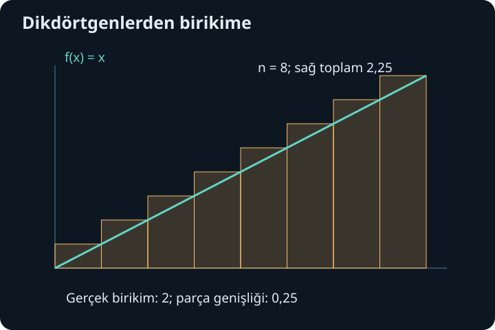
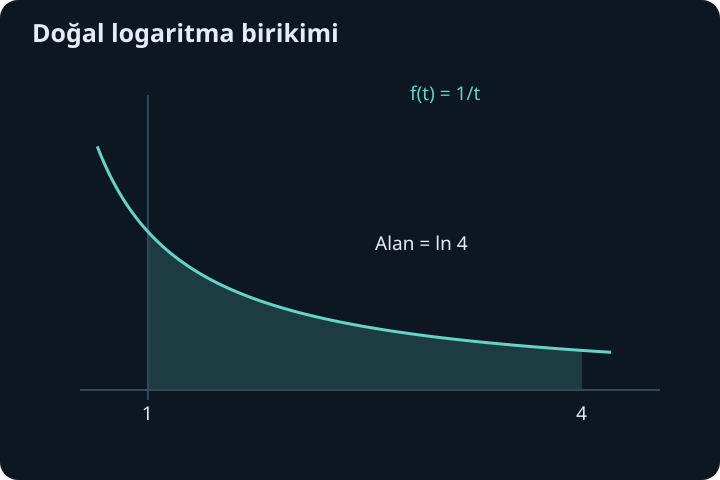

import ArticleVideo from '@/components/ArticleVideo.astro'
import kavram from './media/01-kavram.mp4?url'
import kavramPoster from './media/01-kavram.jpg?url'

Bir musluk dakikada sabit iki litre su akıtıyorsa beş dakikada biriken miktarı bulmak kolaydır: hız ile süreyi çarparız. Akış hızı sürekli değişiyorsa tek bir çarpım yetmez. Süreyi küçük parçalara ayırıp her parçada yaklaşık sabit bir hız kullanabiliriz. Parçaları incelttikçe yaklaşımın nasıl bir değere oturduğu sorusu bizi integrale götürür.

[Önceki yazıda](/blog/turev-teoremleri-ve-uygulamalari/) türevin bir aralığın değişimi hakkında ne söylediğini gördük. Şimdi küçük katkıları toplayacağız. İhtiyacımız olan ön bilgiler limit, süreklilik, toplamlar ve türevdir. İntegrali yalnız “türevi tersine almak” diye başlatmayacağız; önce birikimi tanımlayacak, sonra bu iki işlemin neden birbirini geri aldığını açıklayacağız.

## 1. Toplamı kısa yazmak

$1+2+3+4$ toplamını $\sum_{k=1}^{4}k$ biçiminde yazabiliriz. Büyük sigma işareti $\sum$ “topla” anlamındadır. Alttaki $k=1$ başlangıcı, üstteki 4 bitişi, sağdaki $k$ ise toplanacak ifadeyi söyler. $k$ bir sayacın adıdır; her seferinde sıradaki tamsayıyı alır. Dolayısıyla $\sum_{k=1}^{4}k^2=1^2+2^2+3^2+4^2=30$ olur.

Sabit çarpan dışarı alınabilir: $\sum_{k=1}^{n}3a_k=3\sum_{k=1}^{n}a_k$. İki dizinin terim terim toplamı da ayrı toplanabilir. Bunlar yeni kurallar değil, sonlu toplamlarda alıştığımız dağılma özelliğinin kısa yazımıdır. $n$, kaç terim topladığımızı gösteren pozitif tamsayıdır; daha sonra bu sayıyı büyüterek bir limit alacağız.

İlk $n$ pozitif tamsayının toplamı $n(n+1)/2$'dir. Bunu toplamı bir kez ileri, bir kez geri yazıp alt alta toplarsak görebiliriz: her sütun $n+1$ eder ve $n$ sütun vardır. İki kopyanın toplamı $n(n+1)$ olduğundan bir kopya yarısıdır. Bu küçük toplam formülü, ilk integralimizi doğrudan tanımdan hesaplamaya yetecek.

## 2. Bir aralığı bölüp katkıları toplamak

$[a,b]$ aralığını $a=x_0<x_1<\cdots<x_n=b$ noktalarıyla bölelim. $i$'nci parçanın genişliği $\Delta x_i=x_i-x_{i-1}$ olsun. Her parçadan $\xi_i$ adlı bir örnek nokta seçelim. Yunan harfi $\xi$, burada yalnız parçanın içindeki seçilmiş girdiyi temsil eder. O parçanın katkısını $f(\xi_i)\Delta x_i$ ile yaklaşık hesaplarız. Hepsinin toplamı:

$$
S=\sum_{i=1}^{n}f(\xi_i)\Delta x_i
$$

olur. Buna Riemann toplamı denir. Yükseklik $f(\xi_i)$, genişlik $\Delta x_i$ olduğundan geometrik olarak dikdörtgenleri topluyoruz. Fonksiyon bir akış hızıysa aynı çarpım o kısa sürede geçen yaklaşık miktardır.

Bölmenin en büyük parça genişliğine $\|P\|$ diyelim. Belirli integralin varlığı, yalnız eşit aralıklı bir örneğin düzgün davranması değildir. $\|P\|\to0$ iken, örnek noktalar ve bölmeler nasıl seçilirse seçilsin toplam aynı sonlu değere gidiyorsa:

$$
\int_a^b f(x)\,dx
=\lim_{\|P\|\to0}\sum_{i=1}^{n}f(\xi_i)\Delta x_i
$$

yazarız. Uzun integral işareti toplam fikrini, $a$ ve $b$ alt ve üst sınırları, $dx$ ise hangi değişken boyunca biriktiğini gösterir. Bu tanımda $dx$'i sıradan bir sıfır sayısı gibi çarpmıyoruz; sonlu toplamların limitini adlandırıyoruz.

## 3. Doğrusal örneği tanımdan hesaplamak

$f(x)=x$ ve $[0,2]$ aralığını ele alalım. Eşit genişlikli $n$ parçanın her biri $\Delta x=2/n$ olur. Sağ uçları seçersek $x_i=2i/n$ ve toplam:

$$
S_n=\sum_{i=1}^{n}\frac{2i}{n}\frac2n
=\frac4{n^2}\frac{n(n+1)}2
=2+\frac2n
$$

olur. $n\to\infty$ iken sonuç 2'ye gider. Sol uçları seçersek toplam $2-2/n$ çıkar. Fonksiyon artan olduğu için alt ve üst dikdörtgen toplamları bütün diğer örnek seçimlerini aralarına alır. Aralarındaki fark $4/n$ sıfıra gider; sıkıştırma birikimin 2 olduğunu gösterir.

Geometri de aynı sonucu verir: tabanı 2, yüksekliği 2 olan üçgenin alanı $2\cdot2/2=2$'dir. Fakat integral yönteminin gücü üçgen olmayan şekillere de uygulanabilmesidir. Bir alan formülünü biliyor olmamız gerekmiyor; küçük parçaların toplamının limitini kurabiliyoruz.

## 4. Süreklilik neden yeterlidir?

Kapalı ve sınırlı bir aralıkta sürekli fonksiyon Riemann integrallenebilirdir. Burada sürekli olmak bir yeterli koşuldur; integrallenebilen her fonksiyon sürekli olmak zorunda değildir. Sonlu sayıda sıçraması bulunan sınırlı fonksiyonlar da integrallenebilir. Öte yandan her sınırlı fonksiyona koşulsuz integral atayamayız.

Sürekliliğin yeterli olmasının fikri, küçük parçadaki en büyük ve en küçük yükseklikleri karşılaştırmaktır. Sürekli fonksiyon, kapalı aralıkta düzgün süreklidir: istenen küçük yükseklik farkını sağlamak için bütün aralıkta işe yarayan ortak bir genişlik sınırı seçilebilir. Parçaları bu sınırdan dar tutarsak her parçanın üst ve alt yüksekliği arasındaki fark küçük olur. Üst ve alt toplam arasındaki fark, bu küçük yükseklik farkının toplam genişlik $b-a$ ile çarpımından büyük olamaz.

Dolayısıyla üst ve alt toplamlar aynı sınıra sıkışır. Buradaki “bütün aralıkta ortak” ifadesi önemlidir. Tek bir noktada süreklilik bir bölgedeki toplam davranışı tek başına kontrol etmez. Kapalı ve sınırlı aralık koşulu, yerel süreklilik bilgisini tüm aralığı yöneten bir sınıra dönüştürür.

## 5. İntegral işaretli birikimdir

Fonksiyon eksenin üstündeyse dikdörtgen katkıları pozitiftir. Altındaysa yükseklik negatiftir ve katkı da negatiftir. Bu nedenle integral her zaman geometrik alan değildir. $f(x)=x$ için $[-1,1]$ aralığındaki negatif ve pozitif üçgenler birbirini götürür:

$$
\int_{-1}^{1}x\,dx=0.
$$

İki bölgenin toplam geometrik alanı ise 1'dir. Geometrik alanı ölçmek için $|f(x)|$'i toplarız. Aynı ayrım ileride hızdan yer değiştirme ile toplam yol arasındaki farkı açıklayacak.

Sınırları ters çevirdiğimizde yönü tersine çeviririz: $\int_b^a f=-\int_a^b f$. Aynı noktadan aynı noktaya integral sıfırdır. Aralığı $c$'de bölmek katkıları ayırır: $\int_a^b f=\int_a^c f+\int_c^b f$. Toplamın doğrusallığı da limite geçer; $\int(\alpha f+\beta g)=\alpha\int f+\beta\int g$ olur. Burada $\alpha$ ve $\beta$ sabit sayılardır, her integral aynı sınırlar üzerinde alınır.

## 6. Üst sınır hareket ederse yeni bir fonksiyon doğar

$f$ sürekli olsun ve başlangıç noktası $a$ sabit kalsın. $x$'e kadar biriken miktarı:

$$
A(x)=\int_a^x f(t)\,dt
$$

ile tanımlayalım. İntegral içinde $t$ yazmamız, içeride dolaşan değişkenle hareketli üst sınırı ayırır. Bu $t$'ye kukla değişken denir; $u$ yazsak aynı fonksiyon olur. Dıştaki $x$, ne kadar ilerlediğimizi belirler.

Üst sınırı $h$ kadar ilerletince eklenen miktar $A(x+h)-A(x)=\int_x^{x+h}f(t)\,dt$ olur. Pozitif $h$ için bu dar şeridin ortalama yüksekliği fark oranıdır:

$$
\frac{A(x+h)-A(x)}h=\frac1h\int_x^{x+h}f(t)\,dt.
$$

Dar aralıkta $f(t)$ değerlerinin en küçüğü ile en büyüğü, bu ortalamayı aralarına alır. Süreklilik nedeniyle $h\to0$ iken ikisi de $f(x)$'e yaklaşır. Negatif $h$ için integralin yönü ve paydanın işareti birlikte ters döner; aynı sıkıştırma çalışır. Sonuç:

$$
\boxed{A'(x)=f(x).}
$$

Bu, kalkülüsün temel teoreminin birinci yönüdür. Biriken miktarın anlık değişim hızı, o anda biriken katkının yoğunluğudur. Geometrik bir şerit düşüncesi, türev ile integral arasında tam bir eşitliğe dönüşür.

<ArticleVideo src={kavram} poster={kavramPoster} title="İnceleyen Riemann dikdörtgenleri" caption="f(x) = x için 0 ile 2 arasında orta nokta dikdörtgenleri inceliyor. Bu doğrusal örnekte orta nokta toplamı her bölmede tam 2’dir; parçaların biçimi giderek üçgensel bölgeyi izler." />

## 7. İntegrali uç değerlerle hesaplamak

$F'(x)=f(x)$ sağlayan bir $F$ fonksiyonuna $f$'nin antitürevi denir. Birinci teoremle kurduğumuz $A$ da aynı türeve sahiptir. Dolayısıyla $(F-A)'=0$ olur. Ortalama değer teoremi, türevi sıfır olan fonksiyonun aralıkta sabit olduğunu söyler. $A(a)=0$ olduğundan bu sabit $F(a)$'dır. $x=b$ koyarsak:

$$
\boxed{\int_a^b f(x)\,dx=F(b)-F(a).}
$$

Bu ikinci yön, hesaplama yöntemidir. Sürekli bir fonksiyonun antitürevini bulabildiğimizde sonsuz sayıda dikdörtgen toplamak yerine iki değeri çıkarırız. Fakat her sürekli fonksiyonun antitürevinin alıştığımız temel fonksiyonlarla yazılması gerekmez. İntegralin varlığıyla kolay bir kapalı formunun varlığı ayrı konulardır.

Örneğin $\int_0^2 3x^2\,dx$ için $F(x)=x^3$ seçeriz; çünkü türevi $3x^2$'dir. Sonuç $2^3-0^3=8$ olur. $\int_0^{\pi/2}\cos x\,dx$ için antitürev sinüs olduğundan sonuç $1-0=1$'dir. Her iki örnekte de önce türevle kontrol edilebilen bir fonksiyon bulduk, sonra sınırları kullandık.

Belirsiz integral $\int f(x)\,dx=F(x)+C$ ifadesi, bir sayı değil antitürev ailesidir. $C$ keyfi sabittir; türevi sıfır olduğundan bütün aile aynı türevi verir. Bir aralıkta herhangi iki antitürevin farkı sabittir. Ayrık tanım aralıklarında bu sabitleri birbirinden bağımsız seçmek gerekebilir.

## 8. Başlangıç bilgisi sabiti seçer

Bir depodaki miktarın zamana göre değişimi $Q'(t)=2t+1$ litre/dakika olsun. Burada $t$ dakika, $Q$ litre birimindedir; formüldeki sayısal katsayılar bu birim seçimine göredir. Antitürev $Q(t)=t^2+t+C$ olur. Başlangıçta $Q(0)=5$ litre bulunduğunu bilirsek $C=5$ çıkar. Üçüncü dakikada miktar $Q(3)=9+3+5=17$ litredir.

Aynı hesabı birikimle yapabiliriz: eklenen miktar $\int_0^3(2t+1)dt=12$ litre, başlangıç miktarı 5 litre; toplam 17 litredir. Bu iki anlatım aynı yapıyı farklı yerden görür. Antitürevde kaybolan sabit, başlangıçta zaten var olan miktarı temsil eder. Birikimin sınırlarını seçmek de aynı başlangıcı hesaba katmanın yoludur.

## 9. Doğal logaritmi döngüsüz tanımlamak

Şimdi pozitif $x$ için yeni bir fonksiyon tanımlayalım:

$$
L(x)=\int_1^x\frac1t\,dt,\qquad x>0.
$$

$1/t$ pozitif girdilerde sürekli olduğundan temel teorem hemen $L'(x)=1/x$ verir. $L(1)=0$'dır ve türevi pozitif olduğu için $L$ kesin artandır. $x>1$ ise birikim pozitif, $0<x<1$ ise ters yönlü integral negatif olur.

Bu fonksiyonun neden logaritm olduğunu gösterelim. Sabit $a>0$ seçip $H(x)=L(ax)-L(x)$ tanımlayalım. Zincir kuralıyla:

$$
H'(x)=\frac a{ax}-\frac1x=0.
$$

Dolayısıyla $H$ sabittir. $x=1$ koyunca sabit $L(a)$ olur. Böylece:

$$
L(ax)=L(a)+L(x)
$$

elde edilir. Çarpmayı toplamaya dönüştüren temel logaritma özelliği, önceden bir logaritma türevi varsaymadan ortaya çıktı. Özellikle $L(1/a)=-L(a)$ ve pozitif tamsayı $n$ için $L(a^n)=nL(a)$ olur.

$L(2)>0$ olduğundan $L(2^n)=nL(2)$ sınırsız büyür. Karşılıklarda $L(2^{-n})=-nL(2)$ sınırsız küçülür. Süreklilik ve artış sayesinde $L$ bütün gerçek değerleri tam bir kez alır. Bu nedenle bütün gerçek sayılarda tanımlı, pozitif değerler alan bir ters fonksiyonu vardır.

## 10. Üstel fonksiyon, e sayısı ve eski gösterim

$L$'nin tersine $E$ diyelim: $L(E(y))=y$. Ters fonksiyonun türev kuralında $L'(x)=1/x$ hiçbir pozitif noktada sıfır değildir. Böylece:

$$
E'(y)=\frac1{L'(E(y))}=E(y).
$$

Türevi kendisine eşit olan üstel fonksiyona ulaştık. $e=E(1)$ sayısını tanımlarsak $L(e)=1$ olur. $L$'nin çarpım kuralı ve bire birliği, $E(u+v)=E(u)E(v)$ verir. Ayrıca $E(0)=1$'dir. Tamsayılar için $E(n)=e^n$; rasyonel girdiler için $E(p/q)=e^{p/q}$ elde edilir. Burada $q>0$ ve $p$ tamsayıdır; pozitif $q$'ncu kök tek olduğu için eşitlik belirgindir.

Gerçek üsler rasyonel üslerin sürekli uzantısı olarak kurulduğunda da aynı fonksiyona ulaşılır. Dolayısıyla $E(x)=e^x$ ve $L(x)=\ln x$ yazabiliriz. Önceden çarpma ve üs kurallarıyla tanıdığımız doğal logaritma, integral tanımıyla uyumludur. Kanıtın sırası dikkat çekicidir: önce integral, sonra logaritma türevi, ardından ters fonksiyon ve üstel türev geldi; birbirini varsayan iki kanıt kurulmadı.

Her $a>0$ için $a^x=e^{x\ln a}$ yazılır. Zincir kuralı:

$$
(a^x)'=a^x\ln a
$$

verir. $a\ne1$ için $\log_a x=\ln x/\ln a$ olduğundan:

$$
(\log_a x)'=\frac1{x\ln a},\qquad x>0.
$$

Örneğin $(e^{3x})'=3e^{3x}$ ve $(\ln(1+x^2))'=2x/(1+x^2)$ olur. İkinci örneğin içi her zaman pozitif olduğundan bütün gerçek girdiler kullanılabilir. $\ln x$'in türevi $1/x$ diye negatif girdileri otomatik dahil edemeyiz; gerçek logaritmanın tanım alanı pozitiftir.

İntegral böylece hem birikimin tanımı hem türevi geri almanın yolu oldu. Doğal logaritma ve üstel fonksiyonun türevleri de aynı temele bağlandı. Bundan sonra asıl hesap sorusu, verilen bir fonksiyonun antitürevini hangi dönüşümlerle bulabileceğimiz olacak.

## Kaynaklar

- [OpenStax, Calculus Volume 2: Approximating Areas](https://openstax.org/books/calculus-volume-2/pages/1-1-approximating-areas)
- [OpenStax, Calculus Volume 1: The Fundamental Theorem of Calculus](https://openstax.org/books/calculus-volume-1/pages/5-3-the-fundamental-theorem-of-calculus)
- [OpenStax, Calculus Volume 1: Derivatives of Exponential and Logarithmic Functions](https://openstax.org/books/calculus-volume-1/pages/3-9-derivatives-of-exponential-and-logarithmic-functions)
