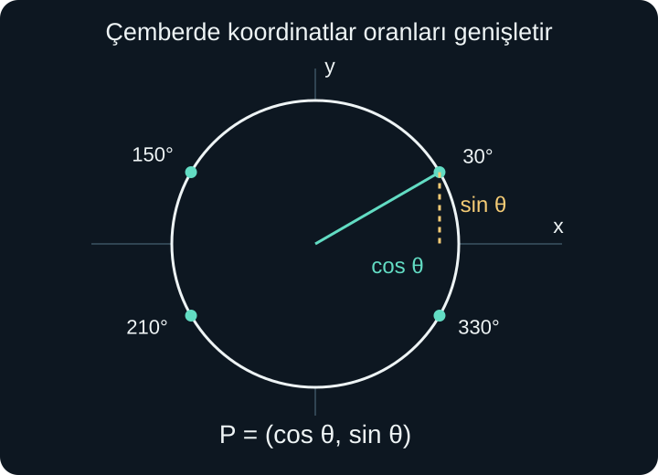
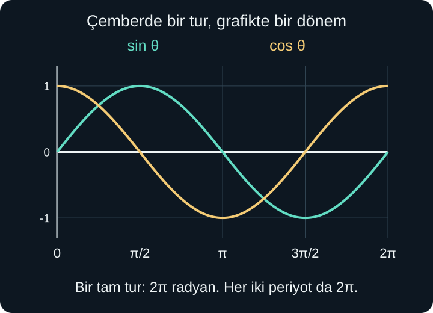
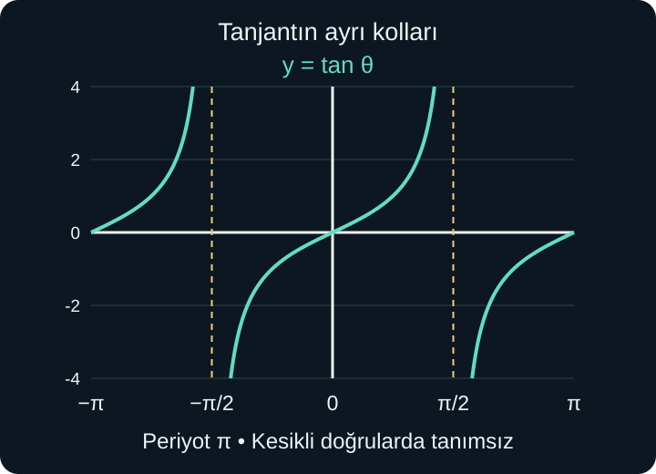

import ArticleVideo from '@/components/ArticleVideo.astro'
import kavram from './media/01-kavram.mp4?url'
import kavramPoster from './media/01-kavram.jpg?url'

Bir çemberin merkezinden kenarına uzanan doğru parçasını döndürelim. Ucu önce sağda, sonra yukarıda, sonra solda, sonra aşağıda olsun. Dönen ucun yüksekliği bir yükselip bir alçalır. Bir tam tur sonunda başlangıç yerine döner ve aynı hareket yeniden başlar.

Bu hareket, sinüs ve kosinüsün yalnızca dik üçgen içindeki dar açılarla sınırlı olmadığını gösteren bir başlangıçtır. [Önceki yazıda](/blog/dik-ucgende-trigonometri/) bu oranları karşı, komşu ve hipotenüs üzerinden tanımladık. Şimdi merkezdeki açıyı bütün bir tur boyunca ve daha ötesinde izleyerek negatif değerleri ve tekrar eden grafikleri açıklayacağız.

Koordinat düzlemi, çemberin çevresi, $\pi$ sayısı, derece, dik üçgen oranları ve fonksiyon dönüşümleri bu yazının ön bilgileridir. Yeni açı birimi **radyan**, yay uzunluğunu yarıçapla karşılaştırmaktan doğacak. Açıyı dereceyle mi radyanla mı ifade ettiğimizi her aşamada açık tutacağız.

## 1. Açıyı Yönlü Bir Dönme Olarak Görmek

Koordinat düzleminde başlangıç ışınını pozitif $x$ ekseni üzerinde seçelim. Işının ucunu saat yönünün tersine döndürmeyi pozitif, saat yönünde döndürmeyi negatif kabul ederiz. Bu, sayı doğrusunda sağ ve sol yönlere işaret vermemize benzer bir anlaşmadır.

90 derecelik pozitif dönme ışını yukarıya getirir. $-90$ derecelik dönme aşağıya getirir. 270 derece pozitif dönme de aşağıya gelir. Son iki hareketin miktarı ve yönü farklı olsa da son ışınları aynıdır. Aynı son konuma gelen açılara **eş bitimli açılar** diyebiliriz.

Bir tam tur 360 derecedir. Bu yüzden 30, 390 ve $-330$ derecelik açılar aynı son ışına sahiptir. Aralarındaki fark tam tur sayısıdır. Çember üzerindeki tek bir nokta, kaç tam tur atıldığını göstermez; son konumu gösterir. Dönme miktarını takip etmek istersek açının tam değerini ayrıca tutarız.

Bu genişletmede 90 derecenin üzerinde kalan açılar artık bir dik üçgenin dar açısı değildir. Eski “karşı kenar bölü hipotenüs” tanımını negatif uzunluklar uydurarak zorlamak yerine, koordinatlar üzerinden daha genel bir tanım kuracağız.

## 2. Radyan: Yayın Yarıçapa Oranı

Yarıçapı 2 santimetre olan bir çemberde, merkez açı karşısındaki yay uzunluğu 2 santimetre olsun. Yay, yarıçap kadar uzun olduğunda açıya **1 radyan** deriz. Aynı açıyı yarıçapı 5 santimetre olan çemberde çizdiğimizde yay 5 santimetre olur; oran yine 1'dir.

Yay uzunluğunu $s$, yarıçapı $r$, radyan cinsinden açı ölçüsünü $\theta$ ile gösterirsek:

$$
\theta=\frac sr
$$

olur. Burada $r>0$ ve aynı uzunluk birimi kullanılmalıdır. Santimetreler veya metreler bölmede birbirini götürür. Bu yüzden radyan bir uzunluk değil, uzunlukların oranıyla ölçülen açıdır. Karışıklığı önlemek için gerektiğinde “rad” kısaltmasını yazarız.

Bir tam turdaki yay uzunluğu çemberin çevresi olan $2\pi r$'dir. Bu nedenle tam turun radyan ölçüsü:

$$
\frac{2\pi r}{r}=2\pi
$$

olur. Yarım tur $\pi$, çeyrek tur $\pi/2$ radyandır. Yarıçap büyüyünce yay da aynı oranda büyür; açı ölçüsü değişmez. Radyanın ölçekten bağımsız olmasının nedeni budur.

Yönlü açılarda işaret, dönme yönünü belirtir. Saat yönünde bir radyan dönmeyi $-1$ radyan diye yazarız. Yayın fiziksel uzunluğu negatif değildir. Tek yönde yapılan $\theta$ radyanlık dönmede alınan yay yolu $r|\theta|$ olur. İşaretli açı ile pozitif yol uzunluğunu ayırırız.

## 3. Derece ile Radyan Arasında Dönüşüm

Aynı yarım tur 180 derece ve $\pi$ radyan olduğundan dereceyi radyana çevirmek için $\pi/180$, radyanı dereceye çevirmek için $180/\pi$ ile çarparız. Bunlar aynı açının iki farklı ölçüm birimini birbirine bağlar.

Örneğin:

$$
60^\circ=60\frac{\pi}{180}=\frac\pi3\text{ rad}
$$

$$
\frac{5\pi}{6}\text{ rad}=\frac{5\pi}{6}\frac{180}{\pi}=150^\circ
$$

İlk satırdaki aritmetik, derece cinsinden sayının radyan cinsinden sayıya dönüşümünü gösterir. Bir radyan yaklaşık $180/\pi\approx57{,}296$ derecedir. Dolayısıyla 1 radyan ile 1 derece aynı açı değildir.

| Derece | Radyan |
| --- | --- |
| $0^\circ$ | $0$ |
| $30^\circ$ | $\pi/6$ |
| $45^\circ$ | $\pi/4$ |
| $60^\circ$ | $\pi/3$ |
| $90^\circ$ | $\pi/2$ |
| $180^\circ$ | $\pi$ |
| $360^\circ$ | $2\pi$ |

Radyan cinsinden açıları yazarken derece işareti eklemeyiz. $\sin30^\circ=1/2$ ile, açı birimi belirtilmeyen ve matematikte genellikle radyan kabul edilen $\sin30$ farklı sayılardır. Hesap makinesinin modu, sayısal değerin hangi açıya ait olduğunu belirler.

## 4. Yay Uzunluğu ve Daire Dilimi

$\theta=s/r$ bağıntısını $r$ ile çarparsak $s=r\theta$ elde edilir. Bu formülde $\theta$ radyan cinsindendir ve burada pozitif yay açısı alıyoruz. Yarıçapı 6 santimetre olan çemberde $\pi/3$ radyanlık, yani 60 derecelik, yay uzunluğu $6\times\pi/3=2\pi$ santimetredir.

60 sayısını doğrudan $s=r\theta$ formülüne koyup 360 santimetre bulmak yanlış olur; önce radyana dönüşüm yapılmalıdır. Dereceyle çalışırsak bütün çevrenin $60/360=1/6$'sını alır, yine $2\pi$ santimetreye ulaşırız.

Aynı açıya ait **daire dilimi**, iki yarıçap ve aradaki yayla sınırlanan bölgedir. $0\le\theta\le2\pi$ için bütün dairenin $\theta/(2\pi)$ oranındaki bölümünü kaplar. Alanı:

$$
A=\frac{\theta}{2\pi}\,\pi r^2=\frac12r^2\theta
$$

olur. Örneğimizde $A=(1/2)\times36\times\pi/3=6\pi\text{ cm}^2$ bulunur. Bir tam turdan daha büyük açıda aynı bölgenin tekrar üzerinden geçilebilir; bu formülü düzlemdeki benzersiz kaplanan bölgenin alanı diye koşulsuz kullanmayız.

## 5. Birim Çemberde Sinüs ve Kosinüs

Merkezi orijinde, yarıçapı 1 olan çembere **birim çember** deriz. Üzerindeki her $(x,y)$ noktası merkezden bir birim uzaktadır. Pisagor gereği koordinatları:

$$
x^2+y^2=1
$$

eşitliğini sağlar. Pozitif yatay eksenden $\theta$ kadar dönerek ulaştığımız noktaya $P$ diyelim. Yeni genel tanımımız:

$$
P=(\cos\theta,\sin\theta)
$$

olur. **Kosinüs yatay, sinüs düşey koordinattır.** Birinci bölgede noktanın yatay eksene dik izdüşümünü indirirsek hipotenüsü 1 olan bir dik üçgen oluşur. Komşu kenar $x$, karşı kenar $y$ olduğundan eski tanımlar $\cos\theta=x/1=x$, $\sin\theta=y/1=y$ verir. Yeni tanım eskisiyle uyuşur.

Diğer bölgelerde koordinatlar negatif olabilir. Bunun için negatif kenar uzunluğu tanımlamadık. Uzunluklar pozitif kalır; koordinatların işaretleri noktanın orijinin hangi tarafında olduğunu gösterir. Sinüs ve kosinüsün genişletilmesindeki temel adım budur.

Birim çember eşitliğinde koordinatların yerine tanımlarını yazınca bütün açılar için $\cos^2\theta+\sin^2\theta=1$ elde ederiz. Dik üçgenden gelen bağıntı, çemberde aynı geometrik uzaklığı anlatmaya devam eder.

## 6. Dört Bölgede İşaretler

Birinci bölgede nokta sağda ve yukarıdadır; kosinüs ve sinüs pozitiftir. İkinci bölgede solda ve yukarıdadır; kosinüs negatif, sinüs pozitiftir. Üçüncü bölgede ikisi negatif, dördüncü bölgede kosinüs pozitif ve sinüs negatiftir.

Eksenlerin üzerinde koordinatlardan biri sıfır olur. Sağ uç $(1,0)$, üst uç $(0,1)$, sol uç $(-1,0)$, alt uç $(0,-1)$ noktalarıdır. Böylece:

$$
\sin0=0,\quad \cos0=1
$$

$$
\sin\frac\pi2=1,\quad \cos\frac\pi2=0
$$

$$
\sin\pi=0,\quad \cos\pi=-1
$$

değerlerini doğrudan okuyabiliriz. Önceki yazıda 0 ve 90 dereceleri gerçek bir dik üçgenin dar açısı olarak kullanmıyorduk. Şimdi çember tanımı bu sınır açıları da kapsıyor.

Sinüs ve kosinüs her zaman $[-1,1]$ aralığındadır. Yarıçapı 1 olan bir çemberde yatay veya düşey koordinatın mutlak değeri 1'den büyük olamaz. Bu aralık bir yaklaşık çizimden değil, noktanın merkeze uzaklığının 1 olmasından kaynaklanır.

## 7. Referans Açıyla Değer Bulmak

150 derece, yani $5\pi/6$ radyan için son ışın ikinci bölgededir. Negatif yatay eksenle yaptığı dar açı 30 derecedir. Bu dar açıya **referans açı** deriz. Oluşan dik üçgenin kenar büyüklüklerini 30 derecelik üçgenden biliriz; işaretleri ise bölge belirler.

İkinci bölgede yatay koordinat negatif, düşey koordinat pozitiftir:

$$
\cos150^\circ=-\frac{\sqrt3}{2},\qquad
\sin150^\circ=\frac12
$$

210 derece üçüncü bölgededir ve referans açısı yine 30 derecedir. Bu kez kosinüs $-\sqrt3/2$, sinüs $-1/2$ olur. 330 derece dördüncü bölgede olduğundan kosinüs $\sqrt3/2$, sinüs $-1/2$ olur. Referans açı büyüklükleri, bölge ise işaretleri belirler.

Negatif açı da aynı çizimle okunur. $-30$ derece, 330 dereceyle aynı son noktaya gider. Bu nedenle sinüsü $-1/2$, kosinüsü $\sqrt3/2$ olur. Genel olarak yatay eksene göre yansımada $x$ değişmez, $y$ işaret değiştirir:

$$
\cos(-\theta)=\cos\theta,\qquad
\sin(-\theta)=-\sin\theta
$$

Bu ilişkiler bütün açılar için geçerlidir. Henüz açı toplamı formüllerini kullanmadık; çemberdeki yansımayı okuduk.

## 8. Çemberden Sinüs Grafiğine

Açıyı yatay eksende, noktanın düşey koordinatını düşey eksende gösterelim. Açının birimi radyandır. Nokta sağ uçtan hareket ederken $\theta=0$ için sinüs 0'dır. Çeyrek turda $\theta=\pi/2$ ve sinüs 1 olur. Yarım turda tekrar 0, üç çeyrek turda $-1$, tam turda tekrar 0 bulunur.

Bu ara konumlar arasında noktanın yüksekliği kesintisiz değişir. Dolayısıyla bu beş nokta, araları düz çizgilerle bağlanan bir zigzag değil, çemberdeki hareketin ürettiği yumuşak bir eğri üzerinde bulunur. Her açı için düşey koordinatı taşımak sinüs grafiğini oluşturur.

<ArticleVideo src={kavram} poster={kavramPoster} title="Birim çemberden sinüs grafiğine" caption="Çemberde dönen noktanın yüksekliği, radyan cinsinden açıya karşı çizilir. Bir turda sinüs grafiğinin bir dönemi oluşur." />

Kosinüste aynı işlemi yatay koordinatla yaparız. Başlangıç 1, çeyrek turda 0, yarım turda $-1$, üç çeyrek turda 0, tam turda yeniden 1 olur. İki fonksiyon aynı aralıkta salınır ama aynı açıdaki değerleri genellikle farklıdır.

## 9. Periyot Neyi Söyler?

Bir fonksiyonun çıktıları belirli bir pozitif girdi artışından sonra bütün uygun girdilerde tekrarlanıyorsa fonksiyon **periyodiktir**. En küçük pozitif tekrar uzunluğuna temel periyot deriz. Sinüs ve kosinüste bu uzunluk $2\pi$'dir:

$$
\sin(\theta+2\pi)=\sin\theta
$$

$$
\cos(\theta+2\pi)=\cos\theta
$$

Bir tam tur aynı noktaya getirir. İki, üç veya daha çok tam tur eklemek de sonucu değiştirmez. Tam sayı $k$ için $\theta+2k\pi$ aynı sinüs ve kosinüse sahiptir. $k$ negatif seçilirse ters yönde tam turlar çıkarılır.

Bir değerin daha erken tekrar etmesi, bütün grafiğin periyodunun o kadar olduğu anlamına gelmez. Sinüs 0 ve $\pi$ açılarında 0'dır; fakat $\pi/2$'de 1, $3\pi/2$'de $-1$ olur. Dolayısıyla $\pi$ eklemek bütün değerleri aynı bırakmaz. Periyot, seçilmiş tek bir çıktının tekrarından daha güçlü bir koşuldur.

## 10. Tanjant ve Tanımsız Açılar

Çemberde tanjantı, kosinüs sıfır olmadığı sürece:

$$
\tan\theta=\frac{\sin\theta}{\cos\theta}
$$

diye tanımlarız. Bu, noktanın düşey koordinatının yatay koordinatına oranıdır. Birinci bölgede eski karşı/komşu tanımıyla aynıdır. İkinci ve dördüncü bölgelerde oran negatif, birinci ve üçüncü bölgelerde pozitiftir.

$\theta=\pi/2$ veya $3\pi/2$ olduğunda yatay koordinat sıfırdır; tanjant tanımlı değildir. Genel yasak açılar $\pi/2+k\pi$ biçimindedir; $k$ herhangi bir tam sayıdır. Bu noktalarda tanjantın değerini “sonsuz” diye yazmayız; gerçek bir sayı değeri yoktur.

Açı $\pi/2$'ye soldan yaklaşırken sinüs yaklaşık 1, kosinüs pozitif ve çok küçük olur. Oran giderek büyür. Sağdan yaklaşırken kosinüs negatif ve çok küçük olduğundan oran büyük negatif değerlere gider. Grafikte $x=\pi/2$ doğrusu bir **düşey asimptottur**; iki taraftaki kolları bu doğrunun üzerinden bir çizgiyle birleştirmeyiz.

Yarım tur sonra hem yatay hem düşey koordinatın işareti değişir. İkisinin oranı aynı kalır: $(-y)/(-x)=y/x$. Bu nedenle tanjantın temel periyodu $\pi$'dir. Sinüs ve kosinüsün $2\pi$ periyodunu tanjanta aynen taşımıyoruz; tanjant yarım turda zaten tekrar eder.

Tanjant sıfırlarını $\sin\theta=0$ koşulundan buluruz; bu noktalarda kosinüs sıfır değildir. Böylece $\theta=k\pi$ açılarında tanjant 0 olur. Her iki komşu asimptot arasında grafik aşağıdan yukarıya ilerler ve bütün gerçek çıktı değerlerini alır. Sinüs ile kosinüsün $[-1,1]$ görüntü aralığı tanjant için geçerli değildir. Yatayda aynı desenin tekrarlanması, düşey değerlerin sınırlı olmasını gerektirmez.

## 11. Genlik, Orta Çizgi ve Yatay Kayma

$y=2\sin x+1$ fonksiyonunda önce sinüsün çıktısını ikiyle çarpar, sonra 1 ekleriz. Sinüs $-1$ ile 1 arasında olduğundan yeni çıktı $-1$ ile 3 arasında değişir. En büyük ve en küçük değerin ortası 1'dir; $y=1$ doğrusuna **orta çizgi** deriz. Orta çizgiden en uzak düşey uzaklık 2'dir; buna **genlik** denir.

$y=-2\sin x+1$ grafiği de aynı genliğe ve aralığa sahiptir. Eksi işareti orta çizgi etrafındaki yönü tersine çevirir; genlik negatif değildir. Genel $A\sin x+D$ biçiminde genlik $|A|$, orta çizgi $y=D$ olur. Burada $A\ne0$ alıyoruz; sıfır olursa sabit fonksiyon elde edilir.

$y=\sin(x-C)$ ifadesinde grafik $C$ kadar sağa kayar. $C$ negatifse sola kayar. Bu yatay konum farkı, dalganın **faz kayması** olarak da adlandırılır. $\sin(x-\pi/2)$ grafiğinin eski sıfır başlangıcı artık $x=\pi/2$'dedir.

Çemberde bir çeyrek tur fazladan dönmek yatay koordinatı yeni düşey koordinata taşır. Bu nedenle $\sin(x+\pi/2)=\cos x$ olur. Sinüsle kosinüs grafikleri arasındaki çeyrek dönemlik kaymanın geometrik anlamı budur.

## 12. Girdiyi Çarpmak Periyodu Değiştirir

$y=\sin(3x)$ fonksiyonunda sinüsün içindeki açı, $x$'in üç katı hızla ilerler. İçeride bir tam tur için $3x$ miktarının $2\pi$ artması yeterlidir. Bu nedenle dış girdinin $2\pi/3$ artması bir dönemi tamamlar.

Genel olarak:

$$
y=A\sin(B(x-C))+D
$$

biçiminde $A\ne0$, $B\ne0$ için genlik $|A|$, orta çizgi $D$, temel periyot $2\pi/|B|$ olur. İçeriyi $B(x-C)$ biçiminde gruplayarak yatay kaymayı $C$ olarak okuruz. Mutlak değer, negatif $B$ için de periyodun pozitif uzunluk olmasını sağlar.

Örneğin $y=2\sin(3(x-\pi/6))+1$ kuralında genlik 2, orta çizgi 1, periyot $2\pi/3$ ve sağa kayma $\pi/6$'dır. $x=\pi/6$ için iç açı 0, çıktı 1 olur. Bir çeyrek dönem sonra $x=\pi/3$ için iç açı $\pi/2$, çıktı 3 olur. Yarım dönem sonra $x=\pi/2$ için çıktı yeniden 1, üç çeyrek dönem sonra $x=2\pi/3$ için $-1$ olur.

Bir sonraki tam dönem başlangıcı $x=5\pi/6$'dır ve çıktı yine 1'dir. Bu beş nokta kayma, genlik ve periyot bilgisini somut hesapla kontrol eder. İçerideki $3x-\pi/2$ ifadesinden doğrudan “$\pi/2$ sağa kayar” diye okumak yanlış olur; önce 3 ortak çarpanına ayırmak gerekir.

Böylece dar üçgenlerdeki oranlardan yönlü açılara, yay ölçüsünden tekrar eden fonksiyonlara geçtik. Aynı çember hem işaretleri hem periyodu hem de grafiklerin birbirine göre konumunu açıklıyor. Sonraki yazıda bu tanımları kullanarak açıların toplamı, farkı ve trigonometrik denklemlerdeki bütün çözümler üzerinde çalışacağız.

## Kaynakça

Anlatım, örnekler ve görseller özgündür. Kaynak bölümleri 8 Ekim 2026 tarihinde kontrol edildi.

- [OpenStax — Precalculus 2e, 5.1: Angles](https://openstax.org/books/precalculus-2e/pages/5-1-angles): Yönlü açı, radyan ve yay uzunluğu koşulları için.
- [OpenStax — Precalculus 2e, 5.2: Unit Circle: Sine and Cosine Functions](https://openstax.org/books/precalculus-2e/pages/5-2-unit-circle-sine-and-cosine-functions): Koordinat tanımı, referans açılar ve işaretler için.
- [OpenStax — Precalculus 2e, 6.1: Graphs of the Sine and Cosine Functions](https://openstax.org/books/precalculus-2e/pages/6-1-graphs-of-the-sine-and-cosine-functions): Periyot, genlik, orta çizgi ve faz kayması için.
- [OpenStax — Precalculus 2e, 6.2: Graphs of the Other Trigonometric Functions](https://openstax.org/books/precalculus-2e/pages/6-2-graphs-of-the-other-trigonometric-functions): Tanjantın tanım kümesi, düşey asimptotları ve periyodu için.
