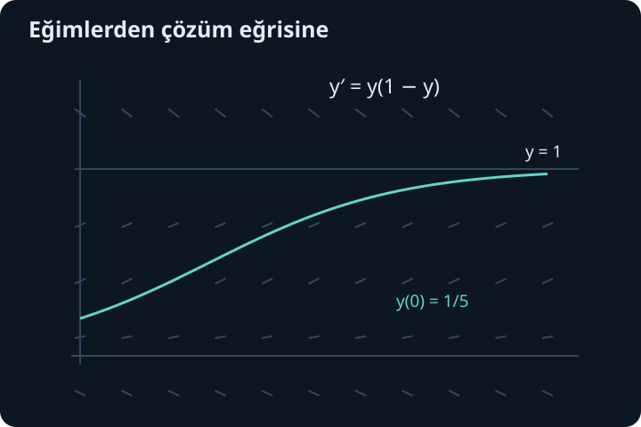
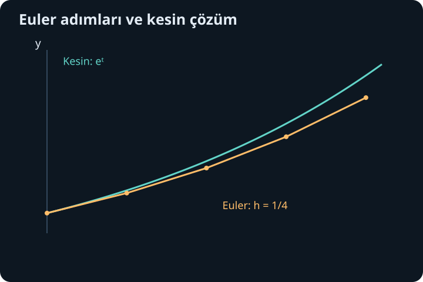

import ArticleVideo from '@/components/ArticleVideo.astro'
import kavram from './media/01-kavram.mp4?url'
import kavramPoster from './media/01-kavram.jpg?url'

Cebir denkleminde bilinmeyen çoğu zaman bir sayıdır. $3x+2=11$ çözüldüğünde $x=3$ bulunur. Diferansiyel denklemde ise aradığımız nesne bir fonksiyondur: bütün uygun girdiler için bir değer üreten ilişki. Denklem bu ilişkinin kendisini ve değişim hızını birbirine bağlar. Bir başlangıç bilgisi, mümkün eğriler arasından ilgilendiğimiz eğriyi seçebilir.

[Önceki yazıda](/blog/vektor-alanlari-ve-integral-teoremleri/) yerel değişimlerle eğri ve bölge toplamları arasında bağ kurduk. Burada yeniden tek bağımsız değişkene dönüyoruz. Türev, integral, üstel fonksiyon ve zincir kuralı temel araçlarımız olacak. Önce bir çözümün ne anlama geldiğini belirleyecek, sonra ayrılabilir ve doğrusal denklemleri çözecek, en sonunda kesin formül bulmadan yaklaşık ilerlemeyi göreceğiz.

## 1. Denklem bir fonksiyona koşul koyar

$y'(t)=2t$ denkleminde $t$ bağımsız değişken, $y$ aranan fonksiyon, $y'$ onun türevidir. Bütün $y(t)=t^2+C$ fonksiyonları denklemi sağlar. Burada $C$ sabittir; farklı seçimler grafiği yukarı veya aşağı kaydırır. Bir çözüm, belirli bir aralık boyunca türevli olmalı ve denklemde yerine konulduğunda her noktada eşitliği sağlamalıdır.

Bir çözümü yalnız bir noktada denkleme uydurmak yeterli değildir. Örneğin $y=t^2+t^3$ fonksiyonunun sıfırdaki türevi 0'dır ve o noktada $2t$ ile eşleşir. Fakat genel türevi $2t+3t^2$ olduğundan tüm aralıkta denklemi sağlamaz. Çözüm denetimi fonksiyonların eşitliğidir, tek bir sayısal eşleşme değildir.

Denklemde görülen en yüksek türevin sırasına **mertebe** denir. $y'+y=t$ birinci mertebe, $y''+y=0$ ikinci mertebedir. **Derece** ayrı bir kavramdır: denklem türevlerde polinom biçimindeyse en yüksek mertebeli türevin kuvvetini anlatır. Örneğin $(y')^2=y$ birinci mertebe ve ikinci derecedir. Günlük dilde bu iki sözcük karışabilse de hesapta ayrımı koruyacağız.

## 2. Başlangıç değeri ve sınır değeri

$y'=2t$ ile birlikte $y(0)=3$ verilirse $C=3$ seçilir ve çözüm $y=t^2+3$ olur. Denklem ile aynı başlangıç noktasındaki ek bilgiye **başlangıç değer problemi** denir. $t$ zaman olarak yorumlanıyorsa isim doğrudan anlaşılır; fakat bağımsız değişkenin zaman olması şart değildir.

İkinci mertebeli bir denklemde çoğunlukla aynı noktadaki $y$ ve $y'$ değerleri gerekir. Farklı uçlarda $y(a)$ ve $y(b)$ gibi değerler verilirse bu bir **sınır değer problemi**dir. İki tür problem aynı biçimde davranmaz; sınır değerinde hiç çözüm, tek çözüm veya birçok çözüm olabilir. İkinci mertebeye geçtiğimizde bu farkı açık örnekle göreceğiz.

Genel çözüm sabitleriyle bir çözüm ailesini, özel çözüm ise seçilen bir üyeyi anlatır. Ancak bir yöntemle elde edilen aileyi “bütün çözümler” diye adlandırmadan önce bölme sırasında kaybolan veya ayrı dallarda kalan çözümleri kontrol etmeliyiz. Özellikle bilinmeyen fonksiyona bölmek bu bakımdan dikkat gerektirir.

## 3. Yön alanı denklemi görünür kılar

Birinci mertebeli denklem $y'=f(t,y)$ biçimindeyse her $(t,y)$ noktasında izin verilen eğim bellidir. Düzleme o eğimde kısa çizgiler yerleştirerek **yön alanı** oluştururuz. Çözüm eğrileri bu çizgilerin gösterdiği yerel yönü izler. Fonksiyonun tamamını bilmeden nerede yükselip alçaldığını okuyabiliriz.

$y'=y(1-y)$ örneğinde $y=0$ ve $y=1$ doğrularında eğim sıfırdır. $0<y<1$ arasında eğim pozitif, $y>1$ için negatiftir. Bu işaretler bazı çözümlerin 1 seviyesine yaklaşacağını düşündürür. Ancak yaklaşımın kesin biçimini ve başlangıç değerine bağlılığını ayrıca hesaplarız.

Yön alanı ile vektör alanı arasında ilişki vardır: $(t,y)$ düzlemindeki $(1,f(t,y))$ vektörleri bu eğimleri taşır. İlk bileşenin 1 olması, parametre boyunca yatay girdinin artışını temsil eder. Çizgileri aynı uzunlukta çizmek görselliği kolaylaştırır; eğimi değiştirmemek yeterlidir.

## 4. Ayrılabilir denklemde iki değişkeni ayırmak

$y'=g(t)h(y)$ biçimindeki bir denklem **ayrılabilirdir**. Önce $h(y)\ne0$ olan bir çözüm aralığında çalışalım. İki tarafı $h(y)$'ye bölüp:

$$
\frac{y'}{h(y)}=g(t)
$$

yazarız. $H'(y)=1/h(y)$ sağlayan bir antitürev seçersek sol taraf zincir kuralıyla $d[H(y(t))]/dt$ olur. İntegral alınca $H(y(t))=\int g(t)dt+C$ elde edilir. Kısa yazımdaki $dy/h(y)=g(t)dt$ ayrımı bu zincir kuralı hesabını temsil eder.

$y'=2ty$, $y(0)=3$ örneğinde sıfır olmayan dalda $y'/y=2t$ olur. İntegral $\ln|y|=t^2+C$ verir. Başlangıç pozitif olduğu için ilgili dalda $y=Ke^{t^2}$ yazabiliriz; $K=3$ ve sonuç $y=3e^{t^2}$'dir. Türevi $6te^{t^2}=2t(3e^{t^2})$ olduğundan denklemi sağlar.

Ayırma işlemi kendiliğinden çözümün hangi aralıkta bulunduğunu söylemez. Logaritmanın argümanı, paydalar ve başlangıç koşulu birlikte incelenir. Bir mutlak değerli denklemden açık fonksiyon çıkarırken işaret dalını başlangıç bilgisi seçebilir.

## 5. Bölmede kaybolan denge çözümleri

Az önce $y$'ye böldüğümüz için $y=0$ çözümünü dışarıda bıraktık. Oysa özgün $y'=2ty$ denkleminde $y\equiv0$ doğrudan çözümüdür. Genel bir $y'=g(t)h(y)$ denkleminde $h(c)=0$ sağlayan her sabit $y(t)=c$, ayrı kontrol edilmesi gereken bir denge çözümüdür.

$y'=y(1-y)$ için dengeler 0 ve 1'dir. Aradaki dallarda ayırma yapalım:

$$
\frac{dy}{y(1-y)}=dt,
\qquad
\frac1{y(1-y)}=\frac1y+\frac1{1-y}.
$$

İntegral $\ln|y|-\ln|1-y|=t+C$ verir. $0<y<1$ dalında $y/(1-y)=Ke^t$ ve buradan $y=1/(1+Ae^{-t})$ elde edilir. $y(0)=1/5$ ise $1/(1+A)=1/5$, yani $A=4$ olur.

Çözüm $y(t)=1/(1+4e^{-t})$'dir. Türevi $4e^{-t}/(1+4e^{-t})^2$, sağ tarafı da $[1/(1+4e^{-t})][4e^{-t}/(1+4e^{-t})]$ olduğundan eşittir. Başlangıç değeri $1/5$ ve uzun zaman limiti 1'dir. Denge 1'e sonlu bir anda “çarpıp durduğunu” söylemiyoruz; bu çözüm her sonlu zamanda 1'den küçüktür ve limite yaklaşır.

## 6. Doğrusal denklemde tümleştiren çarpan

Birinci mertebeli doğrusal denklem standart biçimde:

$$
y'+p(t)y=q(t)
$$

olarak yazılır. Bilinmeyen $y$ ve türevi yalnız birinci kuvvette bulunur ve birbirleriyle çarpılmaz. $p$ ve $q$ bilinen fonksiyonlardır. $y^2$ veya $yy'$ bulunan bir denklem bu anlamda doğrusal değildir; bağımsız değişkenin $t^2$ biçiminde görünmesi ise doğrusallığı bozmaz.

Amacımız sol tarafı bir çarpımın türevine dönüştürmektir. Sıfır olmayan $\mu(t)$ ile çarpalım. $(\mu y)'=\mu y'+\mu'y$ olduğundan $\mu'=p\mu$ seçmek yeterlidir. Bunun pozitif bir çözümü:

$$
\mu(t)=e^{\int p(t)dt}
$$

olur. Bu fonksiyona tümleştiren çarpan denir. Sabit çarpan yöntemin sonucunu değiştirmediği için antitürev sabitini burada sıfır seçebiliriz. Denklem $ (\mu y)'=\mu q$ haline gelir ve bir kez integral alınır.

$p$ ve $q$ ilgili aralıkta sürekli olduğunda yöntem düzenli çalışır. En yüksek türevin önünde başka katsayı varsa önce ona bölerek standart biçime getiririz; katsayının sıfır olduğu noktaları aynı aralığın içinde dikkatsizce geçemeyiz.

## 7. Sabit katsayılı doğrusal örnek

$y'+2y=6$, $y(0)=1$ problemini çözelim. $p=2$ olduğu için $\mu=e^{2t}$ seçilir. Denklem:

$$
(e^{2t}y)'=6e^{2t}
$$

olur. İntegral alınca $e^{2t}y=3e^{2t}+C$, dolayısıyla $y=3+Ce^{-2t}$ bulunur. Başlangıç $1=3+C$ verdiği için $C=-2$'dir:

$$
y(t)=3-2e^{-2t}.
$$

Kontrol $y'=4e^{-2t}$ ve $y'+2y=4e^{-2t}+6-4e^{-2t}=6$ verir. Ayrıca $y(0)=1$ ve $t\to\infty$ iken $y\to3$ olur. Sabit 3 denge değeridir; üstel terim başlangıçla denge arasındaki farkın zamanla nasıl azaldığını gösterir.

Aynı denklemin iki çözümünü çıkarırsak fark $w'+2w=0$ denklemini sağlar. Dolayısıyla başlangıç farkı $e^{-2t}$ ile küçülür. Bu, çözümün başlangıç değerine nasıl bağlı olduğunu doğrudan görmemizi sağlar. Genel doğrusal denklemlerde de özel bir çözüm ile homojen denklemin çözümü birlikte kullanılır.

## 8. Değişken katsayı ve tanım aralığı

$t>0$ için $y'+y/t=t$, $y(1)=1$ olsun. Tümleştiren çarpan $e^{\int dt/t}=e^{\ln t}=t$'dir. Böylece $(ty)'=t^2$ ve $ty=t^3/3+C$ elde edilir. Çözüm:

$$
y(t)=\frac{t^2}{3}+\frac Ct.
$$

$t=1$ koşulu $1=1/3+C$, yani $C=2/3$ verir. Türev $2t/3-2/(3t^2)$ olur. $y/t=t/3+2/(3t^2)$ eklenince toplam $t$'dir; denklem doğrulanır.

Bu çözüm başlangıç noktasını içeren $(0,\infty)$ aralığında geçerlidir. Sıfırda hem denklemin katsayısı hem çözümün bir terimi tekildir. Aynı cebirsel ifadeyi yazabiliyor olmamız, sıfırı geçerek tek bir çözüm aralığı elde ettiğimiz anlamına gelmez. Diferansiyel denklemlerde formül kadar geçerli aralık da çözümün parçasıdır.

## 9. Varlık ve teklik ne zaman beklenir?

$y'=f(t,y)$, $y(t_0)=y_0$ için, $f$ başlangıç noktasının açık bir çevresinde sürekli ve $y$ bakımından yerel Lipschitz ise yeterince küçük bir zaman aralığında tek çözüm vardır. Yerel Lipschitz koşulu, yakın $y$ değerleri için $|f(t,y_1)-f(t,y_2)|\leq L|y_1-y_2|$ gibi ortak bir katsayıyla kontrol demektir. $f_y$'nin çevrede sürekli olması bu koşulu sağlamak için kullanışlı bir yeterli ölçüttür.

Teoremin fikrini integral biçimi açıklar: $y(t)=y_0+\int_{t_0}^tf(s,y(s))ds$. İki aday çözüm arasındaki fark, Lipschitz katsayısı ile kısa aralığın uzunluğunun çarpımı tarafından kontrol edilir. Aralık yeterince kısaysa farkın kendi büyüklüğünden daha küçük olması zorunlu olur; tek olasılık sıfır farktır. Varlık için de bu integral ifadesini ardışık yaklaşımlarla tekrar uygularız.

Buradaki sonuç **yereldir**. $y'=y^2$, $y(0)=1$ denkleminin çözümü $y=1/(1-t)$'dir; başlangıç çevresinde tektir ama $t=1$'e yaklaşınca büyür. Alan $f=y^2$ her yerde düzgün olsa da çözüm bütün zamanlarda sonlu kalmak zorunda değildir. Genel bir teklik teoremi sonsuza kadar devam garantisi diye okunmamalıdır.

## 10. Bir başlangıçtan birçok çözüm

$y'=\sqrt y$, $y(0)=0$ ve $y\geq0$ örneğinde $y\equiv0$ bir çözümdür. Fakat herhangi bir $c\geq0$ için $t\leq c$ boyunca 0 kalan, $t\geq c$ için $(t-c)^2/4$ olan fonksiyon da çözümdür. Geçiş noktasında hem fonksiyon hem türev 0'dır. Sonrasında türev $(t-c)/2$, karekök de aynı değerdir.

Bu farklı çözümler aynı başlangıç bilgisini sağlar. Karekökteki duyarlılık sıfır yakınında sınırsızdır: $|\sqrt y-0|/|y-0|=1/\sqrt y$. Ortak bir sonlu Lipschitz katsayısı bulunmaz. Teoremin koşulu sağlanmadığı için teklik sonucu kullanılamaz. İstersek sağ tarafı bütün gerçek $y$ için $\sqrt{|y|}$ diye genişletiriz; aynı çoklu çözümler kalır ve sorun yalnız tanım kümesinin kenarı olmaktan çıkar.

Bu örnek, “birinci mertebe denklem artı bir başlangıç değeri her zaman tek cevap verir” genellemesini düzeltir. Başlangıç bilgisi gerekli olabilir, fakat denklemin düzenliliği olmadan yeterli olmayabilir. Çözümü denkleme koymak hem bu örnekte hem genel hesaplarda en doğrudan doğrulamadır.

## 11. Euler yöntemi: teğetle kısa bir adım

Kapalı form bulamadığımızda küçük adımlarla ilerleyebiliriz. $t_n$ noktasındaki yaklaşık değere $y_n$, adım uzunluğuna $h$ diyelim. Euler yöntemi:

$$
t_{n+1}=t_n+h,\qquad
y_{n+1}=y_n+h f(t_n,y_n)
$$

kuralını kullanır. O anki eğimi kısa süre sabit kabul ederek teğet boyunca gideriz. Yeni noktada eğimi yeniden hesaplarız. Yöntem, türevin yerel doğrusal yaklaşım anlamını doğrudan bir hesap algoritmasına dönüştürür.

$y'=y$, $y(0)=1$ için kesin çözüm $e^t$'dir. $h=1/4$ seçersek her adım önceki değeri $1{,}25$ ile çarpar. Sırasıyla $1$, $1{,}25$, $1{,}5625$, $1{,}953125$ ve $2{,}44140625$ elde edilir. Son değer $t=1$ içindir. Kesin değer yaklaşık $2{,}718282$ olduğundan hata yaklaşık $0{,}276876$'dır.

$h=0{,}1$ ile on adım sonucu $(1{,}1)^{10}\approx2{,}593742$ olur; hata yaklaşık $0{,}124539$'a düşer. Bu örnekte eğri yukarı kavisli olduğu için teğet adımları altta kalır. Genel denklemlerde hatanın yönü aynı olmak zorunda değildir.

<ArticleVideo src={kavram} poster={kavramPoster} title="Euler adımı ve tam çözüm" caption="y′=−y, y(0)=1 probleminde Euler yönteminin adım boyu küçülür. Sarı kırık çizgi, turkuaz üstel çözüme yaklaşır; karşılaştırma aynı zaman aralığında yapılır." />

## 12. Yerel hata ile biriken hatayı ayırmak

Kesin çözümden tek bir adım başlatırsak Taylor açılımı $y(t+h)=y(t)+hy'(t)+O(h^2)$ verir. Buradaki $O(h^2)$, hata büyüklüğünün yeterince küçük $h$ için sabit çarpı $h^2$ ile sınırlanması demektir. Euler yöntemi ikinci ve daha yüksek terimleri atar; tek adımın yerel hatası bu düzendedir.

Sabit uzunlukta bir aralıkta yaklaşık $1/h$ adım bulunduğu için, uygun düzgünlük ve Lipschitz koşullarında toplam hata $O(h)$ mertebesindedir. Yerel $h^2$ ile küresel $h$ aynı şey değildir. Adımı yarıya indirmek çoğu düzenli durumda toplam hatayı yaklaşık yarıya indirir; her problemde aynı sayısal oranı garanti eden koşulsuz bir kural değildir.

Yöntemin kararlılığı da önemlidir. $y'=-ky$, $k>0$ için Euler çarpanı $1-kh$ olur. Kesin çözüm azalırken $|1-kh|>1$ seçilirse sayısal sonuç büyüyebilir. Dolayısıyla büyük adım yalnız kaba yaklaşım üretmeyebilir, yanlış davranış da üretebilir. Sonucu adım küçülterek karşılaştırmak ve denklemin beklenen nitelikleriyle denetlemek gerekir.

Bir diferansiyel denklem çözümü artık yalnız bir formül bulmaktan ibaret görünmüyor: çözümün varlığı, tekliği, aralığı ve yaklaşık hesabın hatası ayrı sorulardır. Bir sonraki yazıda ikinci türev içeren denklemlerde iki başlangıç bilgisinin nasıl rol oynadığını ve farklı üstel köklerin neden farklı davranışlar ürettiğini inceleyeceğiz.

## Kaynaklar

- [OpenStax, Calculus Volume 2: Basics of Differential Equations](https://openstax.org/books/calculus-volume-2/pages/4-1-basics-of-differential-equations)
- [OpenStax, Calculus Volume 2: Separable Equations](https://openstax.org/books/calculus-volume-2/pages/4-3-separable-equations)
- [OpenStax, Calculus Volume 2: First-Order Linear Equations](https://openstax.org/books/calculus-volume-2/pages/4-5-first-order-linear-equations)
- [OpenStax, Calculus Volume 2: Direction Fields and Numerical Methods](https://openstax.org/books/calculus-volume-2/pages/4-2-direction-fields-and-numerical-methods)
