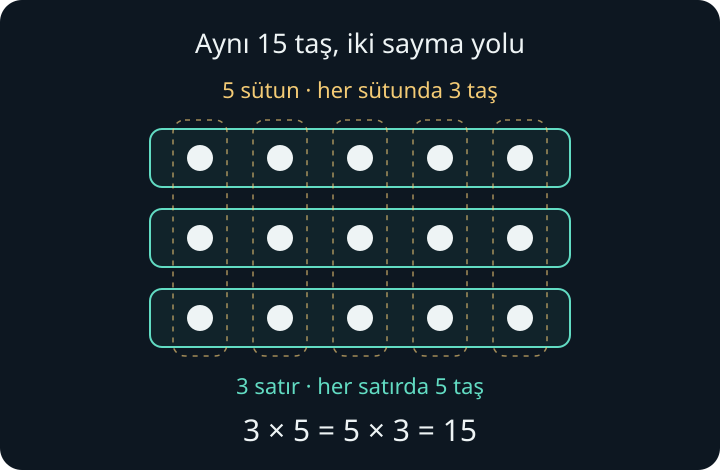

import ArticleVideo from '@/components/ArticleVideo.astro'
import esGruplar from './media/01-esit-paylar-ve-gruplar.mp4?url'
import esGruplarPoster from './media/01-esit-paylar-ve-gruplar.jpg?url'

[Sayı doğrusu yazısında](/blog/sayi-dogrusu-yon-ve-uzaklik/) toplama ve çıkarmayı bir çizgi üzerindeki hareketlerle anlamlandırdık. Şimdi masanın üzerine birkaç taş koyalım. Taşları tek tek sayabiliriz. Peki onları eşit büyüklükte gruplara ayırırsak, aynı toplamı başka türlü görebilir miyiz?

Bu yazıda çarpma ve bölmeyi böyle kuracağız. Önce sayabildiğimiz nesnelerle çalışacak, ardından aynı düşünceyi uzunluklara taşıyacağız. Toplama ve çıkarma dışında bir işlem bilmek gerekmiyor; kullandığımız yeni işaretlerin anlamını birlikte açacağız.

## 1. Aynı Miktarı Tekrar Eklemek

Üç küçük kutumuz olsun. Her kutuya beş taş koyalım. Kutulardaki taşları bir araya getirince:

$$
5+5+5=15
$$

taş elde ederiz. Burada beşi üç kez topladık. Bu tekrarı daha kısa yazmak için **çarpma** işlemini kullanabiliriz:

$$
3\times5=15
$$

$\times$ işareti “çarpı” diye okunur. Bu örnekte 3 grup sayısını, 5 her gruptaki taş sayısını gösteriyor. 15 ise bütün taşların sayısıdır. Çarptığımız sayılara **çarpan**, elde ettiğimiz sonuca **çarpım** denir.

Çarpmanın buradaki dayanağı, grupların eşit olmasıdır. Bir kutuda beş, diğerinde iki, sonuncusunda yedi taş varsa, kutu sayısını beşle çarparak toplamı bulamayız. Her kutudaki miktarı ayrı ayrı hesaba katmamız gerekir.

Sayı doğrusunda da aynı işlemi görebiliriz. Sıfırdan başlayıp her seferinde beş birim sağa ilerleyelim:

$$
0\;\longrightarrow\;5\;\longrightarrow\;10\;\longrightarrow\;15
$$

Üç eşit adım attık; her adım beş birimdi. Çarpma, burada kaç kez ilerlediğimizi ve her ilerlemenin büyüklüğünü bir araya getiriyor.

Bu model, sıfır ve pozitif tam sayılarla çarpmaya bir başlangıçtır. Kesirli ve negatif çarpanları ele alırken anlamını genişleteceğiz. [OpenStax’ın çarpma bölümü](https://openstax.org/books/prealgebra-2e/pages/1-4-multiply-whole-numbers), eşit gruplarla yapılan bu başlangıç için ek örnekler sunar.

## 2. Satırdan Bakmak, Sütundan Bakmak

On beş taşı masaya üç satır hâlinde dizelim. Her satırda beş taş bulunsun. Satırları sayarak yine üç tane beşlik grup görürüz.

Aynı dizilişe sütunlar üzerinden bakınca bu kez beş sütun vardır ve her sütunda üç taş bulunur:

$$
5+5+5=15
$$

$$
3+3+3+3+3=15
$$

Taş eklemedik veya çıkarmadık. Yalnızca hangi yöndeki grupları saydığımızı değiştirdik. Bu nedenle:

$$
3\times5=5\times3
$$

olur. **Çarpanların yerini değiştirmek çarpımı değiştirmez.** Buna çarpmanın *değişme özelliği* denir. Bu satır–sütun düşüncesini başka pozitif tam sayılarla da kurabiliriz.

Yine de bir problemin içinde sayıların neyi temsil ettiğini korumalıyız. Üç kutunun her birine beş taş koymakla beş kutunun her birine üç taş koymak aynı sayıda taş gerektirir; fakat kullanılan kutu sayıları farklıdır. Sayısal sonucun aynı olması, anlattığımız düzenin de aynı olması demek değildir.

## 3. Bir ve Sıfırla Çarpmak

Tek bir kutuda beş taş varsa toplam beş taş vardır:

$$
1\times5=5
$$

Beş kutunun her birinde bir taş olduğunda da toplam beştir:

$$
5\times1=5
$$

**Birle çarpmak sayıyı değiştirmez.**

Peki beş kutunun hepsi boşsa? Her grupta sıfır taş vardır:

$$
5\times0=0
$$

Hiç beşlik grup almazsak da elimizde taş birikmez:

$$
0\times5=0
$$

**Sıfırla çarpmak sıfır verir.** Bu iki durum, “çarpma her zaman büyütür” düşüncesinin daha başlangıçta neden yeterli olmadığını gösteriyor. Birle çarptığımızda sayı aynı kaldı; sıfırla çarptığımızda sonuç sıfır oldu.

## 4. Bir Uzunluğu Üç Katına Çıkarmak

Çarpma, yalnızca nesne sayarken kullanılmaz. Uzunluğu dört santimetre olan bir şeridi düşünelim. Aynı uzunlukta üç şeridi aralarında boşluk bırakmadan, uç uca yerleştirelim:

$$
4+4+4=12
$$

Toplam uzunluk on iki santimetredir. Dört santimetrenin **üç katını** bulduk. Bir uzunluğu belirli bir katına dönüştürmek, *ölçekleme* fikrinin ilk örneklerinden biridir.

$$
3\times4=12
$$

Buradaki 3, kaç kopyayı birleştirdiğimizi söyleyen bir sayıdır. Dört santimetrelik uzunluğu bu sayıyla çarptık. Sonuç hâlâ bir uzunluktur ve birimi santimetredir. Bir dikdörtgenin alanını hesaplarken iki uzunluğu çarpmak ise başka bir anlam taşır; alanı çalışırken bu ayrımı açacağız.

## 5. Bir Bölme İşlemi, İki Farklı Soru

Şimdi başlangıçta elimizde on beş taş olsun. Bu kez toplamı biliyoruz; taşları eşit gruplar hâlinde düzenlemek istiyoruz.

**İlk soru: On beş taşı üç kişiye eşit paylaştırırsak, kişiye kaç taş düşer?**

Her kişiye birer taş verdiğimizde üç taş dağıtmış oluruz. Aynı dağıtımı tekrarlarız. Beş turun sonunda herkesin beş taşı olur ve elimizde taş kalmaz:

$$
15\div3=5
$$

$\div$ işareti “bölü” diye okunur. Bu işlemde 15 **bölünen**, 3 **bölen**, 5 ise **bölüm** adını alır. Burada bölen, kaç kişiye paylaştırdığımızı; bölüm, her kişiye düşen taş sayısını anlatıyor.

**İkinci soru: On beş taşı üçerli gruplara ayırırsak, kaç grup oluşur?**

Bu kez her grubun büyüklüğü baştan bellidir: üç taş. Üç taş ayırıp bir grup oluşturur, sonra sıradaki üç taşı ayırırız. Taşlar bittiğinde beş grubumuz olur:

$$
15\div3=5
$$

İşlem aynı, fakat bu kez bulduğumuz 5, **grup sayısıdır**.

| Bildiğimiz düzen | Aradığımız bilgi | Sonuç |
| --- | --- | --- |
| 15 taş, 3 kişiye eşit paylaştırılıyor. | Her kişiye kaç taş düşer? | Kişi başına 5 taş. |
| 15 taş, her grupta 3 taş olacak şekilde ayrılıyor. | Kaç grup oluşur? | 5 grup. |

İlkinde grupların sayısı verilmişti; her gruptaki miktarı bulduk. İkincisinde her gruptaki miktar verilmişti; grupların sayısını bulduk. Bölmenin *eşit paylaştırma* ve *gruplama* anlamları bu iki soruda görünür hâle geliyor.

<ArticleVideo
  src={esGruplar}
  poster={esGruplarPoster}
  title="Bölmenin iki anlamı: eşit paylaştırma ve gruplama"
  caption="Aynı 15 taş önce üç kişiye beşer taş olarak dağıtılıyor, ardından üçerli beş grup oluşturuyor. 15 ÷ 3 işleminin sonucu ilkinde kişi başına taş sayısını, ikincisinde grup sayısını veriyor."
/>

Gruplama fikri uzunlukta da çalışır. On beş santimetrelik bir şeridi üç santimetrelik parçalara ayırırsak beş parça elde ederiz. Burada bölme, “bu uzunluğun içine o uzunluktan kaç tane sığar?” sorusunu cevaplar. [OpenStax’ın bölme bölümü](https://openstax.org/books/prealgebra-2e/pages/1-5-divide-whole-numbers), gruplama modelini ve çarpmayla kontrol etmeyi birlikte ele alır.

## 6. Çarpma ile Geri Kontrol Etmek

On beş taşı üç kişiye dağıttıktan sonra herkesin beş taşı olduğunu söyledik. Taşları geri toplarsak üç tane beşlik grubu birleştiririz:

$$
3\times5=15
$$

Bölmenin sonucunu çarpma ile kontrol edebiliriz. “15’i 3’e bölmek”, bu örnekte “3’ü hangi sayıyla çarparsam 15 elde ederim?” sorusudur.

Başlangıçtaki kutulara dönelim. Üç kutuda beşer taş olduğunu biliyorsak toplamı çarparak buluruz. Toplam on beş taşı ve kutu sayısını biliyorsak kutu başına düşen miktarı böleriz. Toplamı ve kutu başına beş taş koyduğumuzu biliyorsak bu kez kutu sayısını buluruz:

$$
3\times5=15
$$

$$
15\div3=5
$$

$$
15\div5=3
$$

Çarpma ile bölmenin ters işlemler olması, sıfırdan farklı bölenlerle bu bağı kurabilmemizi anlatır. Bu nedenle bölme yaparken hangi sayının toplamı, hangisinin grup sayısını veya grup büyüklüğünü anlattığını takip etmek işe yarar.

Bölmede sayıların yerini serbestçe değiştiremeyiz. On beş taşı üç kişiye paylaştırmakla üç taşı on beş kişiye paylaştırmak farklı sorulardır. Çarpmada gördüğümüz değişme özelliği bölme için geçerli değildir.

Tek kişiye on beş taşı verirsek o kişi on beş taş alır: $15\div1=15$. Bir sayıyı bire bölmek onu değiştirmez. On beş taşı on beş kişiye dağıttığımızda ise herkese bir taş düşer: $15\div15=1$. Sıfırdan farklı bir sayıyı kendisine bölünce bir elde ederiz. Sıfırı neden bu son cümlede ayrı tuttuğumuzu şimdi görebiliriz.

## 7. Sıfırı Bölmek ile Sıfıra Bölmek

Elimizde hiç taş yoksa ve üç kişiye eşit paylaştırıyorsak herkes sıfır taş alır:

$$
0\div3=0
$$

Çarparak kontrol edelim:

$$
3\times0=0
$$

Bu işlemde sorun yoktur. **Sıfırın, sıfırdan farklı bir sayıya bölümü sıfırdır.**

Şimdi altıyı sıfıra bölmeye çalışalım. Önceki kontrol yöntemimiz şunu sormamızı gerektirir: “Sıfırı hangi sayıyla çarparsam altı elde ederim?”

Hiçbir sayıyla. Sıfırla çarpmanın sonucu yine sıfırdır. Dolayısıyla $6\div0$ için çarpma ile geri dönebileceğimiz bir sonuç bulunmaz.

Peki $0\div0$? Bu kez “Sıfırı hangi sayıyla çarparsam sıfır elde ederim?” diye sorarız. Bir, iki veya beş seçsek de sonuç sıfır olur. İlk örnekte hiç uygun sayı yoktu; burada ise tek bir sonuç seçemiyoruz.

Bu yüzden kullandığımız sayı sisteminde **sıfıra bölme tanımsızdır**. Sonucuna sıfır ya da sonsuz yazmayız. Her iki durumda da bölmenin sonucunu tek bir sayı olarak belirleyemiyoruz.

## 8. Taş Artarsa Ne Olur?

On beş yerine on yedi taşımız olsun. Üçerli gruplar oluşturalım. Beş tam grup yaptığımızda on beş taşı kullanmış oluruz. Geriye iki taş kalır; bunlar bir üçlü grup daha oluşturmaya yetmez.

Bunu “on yediyi üçe böldüğümüzde tam sayı bölüm beş, kalan iki” diye anlatırız. **Kalan**, tam grupları oluşturduktan sonra artan miktardır. Hesabı şöyle kontrol edebiliriz:

$$
17=(5\times3)+2
$$

Parantez, önce beş grubun içerdiği taşları hesapladığımızı belirginleştiriyor. On beşe artan iki taşı ekleyince başlangıçtaki on yediye dönüyoruz. Kalan üç veya daha fazla olsaydı bir grup daha yapabilirdik; bu yüzden bu örnekte kalan üçten küçüktür.

Burada $17\div3=5$ yazıp duramayız; iki taşı hesaptan düşürmüş oluruz. Taşları bütün tutuyorsak kalanları ayrıca belirtiriz.

Fakat aynı on yedi santimetrelik şeridi üç kişiye eşit uzunluklarda vermek istediğimizi düşünelim. Herkese beş santimetre verdiğimizde geriye iki santimetre kalır. Şeridin bu kalan kısmını da kesip paylaşabiliriz. Bu kez her payın uzunluğu beş santimetreden biraz fazla olacaktır.

Tam sayılar, bu payın uzunluğunu tek başına tam olarak söylemeye yetmiyor. Bir sonraki yazıda **bir bütünü eş parçalara ayırıp bu parçalardan kaçını aldığımızı** anlatan kesirleri kuracağız. Böylece bölme sonucunu, artan parçayı da hesaba katarak ifade edebileceğiz.

## Kaynakça

Taşlar ve şerit üzerinden kurulan anlatım, şekil, Manim animasyonu ve Türkçe örnekler bu yazı için hazırlanmıştır. İşlem tanımları ve ek okuma için:

- [OpenStax — Prealgebra 2e, 1.4: Multiply Whole Numbers](https://openstax.org/books/prealgebra-2e/pages/1-4-multiply-whole-numbers). Çarpmanın gösterimi, eşit gruplar, değişme özelliği, bir ve sıfırla çarpma.
- [OpenStax — Prealgebra 2e, 1.5: Divide Whole Numbers](https://openstax.org/books/prealgebra-2e/pages/1-5-divide-whole-numbers). Bölme, gruplama, çarparak kontrol etme ve sıfıra bölmenin tanımsızlığı.

Çevrimiçi kaynaklara erişim tarihi: 28 Eylül 2026.
