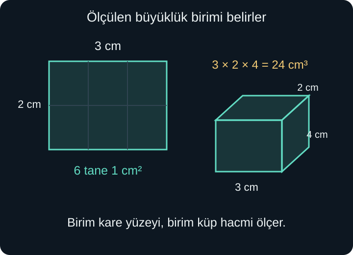
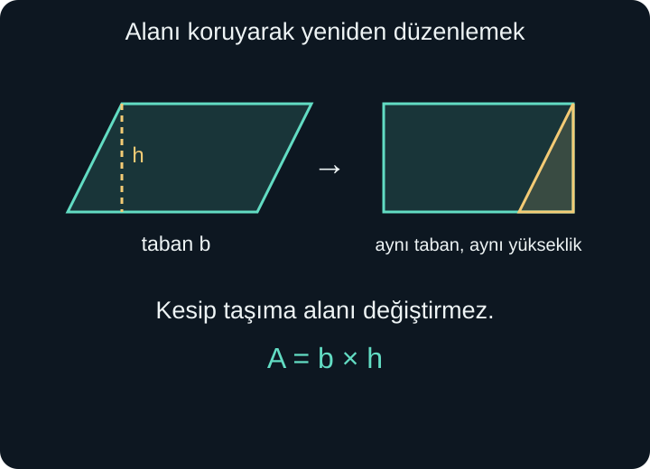

import ArticleVideo from '@/components/ArticleVideo.astro'
import kavram from './media/01-kavram.mp4?url'
import kavramPoster from './media/01-kavram.jpg?url'

Bir bahçenin çevresine çit çekeceğimizi, toprağına çim sereceğimizi ve içindeki bir havuzu suyla dolduracağımızı düşünelim. Üçünde de ölçüm yaparız; fakat aradığımız miktar aynı değildir. Çit için sınırın uzunluğu, çim için kaplanan yüzey, su için doldurulan boşluk gerekir. Aynı şekle bakıp üç farklı soruyu cevaplıyoruz.

Bu ayrım, formülü seçmeden önce gelir. Bahçenin alanını doğru hesaplayıp sonucu çit uzunluğu olarak kullanırsak işlemimiz doğru, cevabımız yanlış olur. **Çevre uzunluğu, alan yüzeyi, hacim ise uzayda kaplanan yeri ölçer.** Birimleri de bu nedenle farklıdır.

[Önceki yazıda](/blog/eslik-benzerlik-ve-olcek/) şekiller büyürken uzunlukların, alanların ve hacimlerin aynı oranda değişmediğini gördük. Burada bu ölçülerin nasıl kurulduğunu açıklayacağız. Çarpma, kesirler, kare ve küp, üçgende taban ve yükseklik bilgisi yeterli olacak. Eğri sınırlı şekillerde tam gerekçeyle sezgisel açıklamayı birbirinden ayıracağız.

## 1. Ölçmek, Birimi Tekrarlamaktır

Bir masanın uzunluğunu santimetreyle ölçtüğümüzde, bir santimetrelik parçanın masa boyunca kaç kez yer aldığını sorarız. Sonuç 80 santimetre ise aynı uzunluk 0,8 metredir. Masa değişmedi; saydığımız birimin büyüklüğü değişti. Daha büyük birim seçince aynı uzunluğu daha küçük sayıyla ifade ettik.

Bir yüzeyde ise yalnızca çizgi parçaları yan yana dizmek yeterli olmaz. İki yönde kaplama yaparız. Kenarı 1 santimetre olan bir karenin alanına **1 santimetrekare**, kısaca $1\text{ cm}^2$ deriz. Bu, kenarı 1 santimetre olan karenin kapladığı yüzeydir; “iki santimetre” anlamına gelmez.

Kenarları 3 ve 2 santimetre olan bir dikdörtgene, her sırada üç kare olacak biçimde iki sıra yerleştiririz. Alan $3\times2=6\text{ cm}^2$ olur. Kenarlar tam sayı olmadığında da aynı fikir daha küçük karelerle sürer. Örneğin 2,5 santimetre ile 1,2 santimetrenin çarpımı 3 santimetrekaredir. Küçük birimlerle sayma, ondalık çarpmanın ölçmedeki anlamını korur.

## 2. Dikdörtgende Çevre ile Alan

Kısa kenarı 4 metre, uzun kenarı 7 metre olan dikdörtgen bir bahçeyi ele alalım. Sınırı boyunca dolaştığımızda 7, 4, 7 ve 4 metrelik dört kenar geçeriz. Çevre:

$$
7+4+7+4=22\text{ m}
$$

İç yüzeyi ise dört sıra yedişer birim kareyle kaplayabiliriz. Alan $4\times7=28\text{ m}^2$ olur. Çevrenin birimi metre, alanın birimi metrekaredir. Sonucun yanındaki birim, hangi soruyu cevapladığımızın parçasıdır.

Genel bir dikdörtgenin kenarlarına $a$ ve $b$, çevresine $Ç$, alanına $A$ diyelim. O zaman:

$$
Ç=2(a+b),\qquad A=ab
$$

$ab$, $a$ ile $b$ sayılarının çarpımıdır. İlk formüldeki 2, her kenar uzunluğundan iki tane bulunmasından gelir. İkinci formül, iki yöndeki birim sayılarının çarpımını anlatır. Karede iki kenar da $a$ olduğundan çevre $4a$, alan $a^2$ olur.

Aynı çevre aynı alanı zorunlu kılmaz. Kenarları 1 ve 5 metre olan dikdörtgenin çevresi 12 metre, alanı 5 metrekaredir. Kenarları 2 ve 4 metre olanın çevresi yine 12 metre, alanı 8 metrekaredir. Aynı uzunlukta çit, farklı miktarda toprağı çevreleyebilir. Bu örnekler tek başına “en büyük alanı hangi şekil verir?” sorusunu ispatlamaz; yalnızca çevrenin alanı tek başına belirlemediğini gösterir.

## 3. Paralelkenarın Eğikliği Alanı Nasıl Etkiler?

Bir dikdörtgenin üst kenarını yana doğru kaydırıp karşılıklı kenarları paralel tutalım. Bir paralelkenar elde ederiz. Taban 6 santimetre, tabana dik yükseklik 4 santimetre olsun. Solda oluşan üçgen parçayı kesip sağdaki boşluğa taşıdığımızda 6 santimetreye 4 santimetrelik bir dikdörtgen oluşur. Parça kaybolmadı, üst üste binmedi; yalnızca yer değiştirdi.

Bu yüzden paralelkenarın alanı $6\times4=24\text{ cm}^2$ olur. Eğik kenarın uzunluğunu çarpmadık. Alan için gereken, tabanla ona paralel üst kenar arasındaki **dik uzaklıktır**.

Taban uzunluğunu $b$, dik yüksekliği $h$ ile gösterirsek:

$$
A=bh
$$

Yükseklik harfinin çizimde şeklin içinde bulunması zorunlu değildir. Çok eğik bir paralelkenarda yükseklik tabanın uzantısına düşebilir. Aynı kesip taşıma fikri, gerekirse daha küçük parçalara ayırarak kullanılabilir. Formülün koşulu belirli bir görünüş değil, seçilen tabana ait dik yüksekliğin kullanılmasıdır.

<ArticleVideo src={kavram} poster={kavramPoster} title="Paralelkenardan dikdörtgene" caption="Üçgen parça yer değiştirirken alan korunur. Taban ile dik yükseklik, oluşan dikdörtgenin kenarlarıdır." />

## 4. Üçgen Alanındaki İkiye Bölme

Bir üçgenin aynısından bir tane daha alıp uygun biçimde döndürerek yanına koyduğumuzda bir paralelkenar oluşturabiliriz. İki üçgen eş olduğundan alanları eşittir. Paralelkenarın tabanı üçgenin tabanı, yüksekliği de üçgenin o tabana ait yüksekliğidir. Dolayısıyla tek üçgen alanın yarısını kaplar:

$$
A=\frac{bh}{2}
$$

Tabanı 8 santimetre, yüksekliği 3 santimetre olan üçgen için önce $8\times3=24$, sonra $24/2=12$ hesaplarız. Alan 12 santimetrekaredir. İkiye bölmenin nedeni üç kenar bulunması değil, **aynı taban ve yükseklikteki paralelkenarın iki eş üçgen içermesidir**.

Bir üçgende herhangi bir kenarı taban seçebiliriz. Ancak yüksekliği de o seçime göre değiştirmeliyiz. Başka bir kenarın uzunluğunu, başka bir tabanın yüksekliğiyle çarpmak tutarlı bir ölçüm değildir. Dik üçgende birbirine dik iki kenardan biri taban, diğeri yükseklik olabilir. Geniş açılı üçgende ise yüksekliğin ayağı taban parçasının dışına düşebilir; alan bağıntısı yine geçerlidir.

Örneğin alanı 30 santimetrekare, tabanı 10 santimetre olan üçgenin yüksekliğini arayalım. $30=10h/2$ eşitliğini önce ikiyle çarparız: $60=10h$. Sonra ona böleriz: $h=6$. Birim kontrolü de aynı sonuca gider; alanı uzunluğa bölünce bir uzunluk buluruz.

## 5. Yamukta İki Tabanın Ortalaması

Yamuğun birbirine paralel iki kenarının uzunlukları 5 ve 9 santimetre, bu kenarlar arasındaki dik uzaklık 4 santimetre olsun. Aynı yamuğun ikinci bir kopyasını ters çevirip yanına koyduğumuzda, tabanı $5+9=14$ santimetre olan bir paralelkenar oluşur. Bu paralelkenarın yüksekliği yine 4 santimetredir.

İki yamuğun toplam alanı $14\times4=56\text{ cm}^2$ olduğundan tek yamuğun alanı 28 santimetrekaredir. Paralel tabanlara $a$ ve $b$, yüksekliğe $h$ dersek:

$$
A=\frac{(a+b)h}{2}
$$

Aynı formül $A=((a+b)/2)h$ diye de okunabilir: iki paralel tabanın aritmetik ortalamasını yükseklikle çarpıyoruz. Buradaki ortalama, herhangi iki kenarın ortalaması değildir. Paralel tabanları seçmek ve aralarındaki dik uzaklığı kullanmak gerekir.

Formülü bir sınır durumuyla kontrol edebiliriz. Tabanlar eşit olup ikisi de 7 santimetre olursa, ifade $(7+7)h/2=7h$ olur; paralelkenarın alan formülüne döner. Bu kontrol bir ispatın yerine geçmez, ancak formüldeki ikiye bölmeyi unutmuş olsaydık hatayı görmemize yardım ederdi.

## 6. Çember, Daire ve Pi Sayısı

Bir noktaya uzaklığı sabit olan düzlem noktalarının oluşturduğu eğriye **çember** deriz. Sabit uzaklık yarıçaptır. Merkezden geçen ve iki ucu çemberde bulunan doğru parçası çapı belirler; çap uzunluğu yarıçapın iki katıdır. Yarıçapa $r$, çapa $d$ dersek $d=2r$ olur.

Çember bir sınırdır; onun içinde kalan bölgeyle birlikte ele aldığımız şekle **daire** deriz. Çemberin uzunluğunu, dairenin alanını hesaplarız. Günlük konuşmada bu sözcükler karışabilse de hangi büyüklüğü ölçtüğümüzü açık tutacağız.

Farklı büyüklükte çemberlerin çevre uzunluğu çapına bölündüğünde aynı sayı elde edilir. Bu sabite $\pi$, “pi”, adı verilir. Dolayısıyla pi sayısının tanımı çevre ile çap arasındaki orandır:

$$
\pi=\frac{Ç}{d},\qquad Ç=\pi d=2\pi r
$$

Pi yaklaşık 3,14159'dur; 3,14 tam değeri değildir. Yarıçapı 3 metre olan dairesel bir havuzun kenarına gereken şerit uzunluğu tam olarak $6\pi$ metredir. İki ondalık basamağa yuvarlarsak yaklaşık 18,85 metre buluruz. Birbirine benzeyen çemberleri büyütürken hem çevre hem çap aynı ölçekle değiştiğinden oran korunur. Sabitin sayısal değerini bulmak ise bundan ayrı bir ölçme ve yaklaşım problemidir.

## 7. Dairenin Alanında Neden Yarıçapın Karesi Var?

Bir daireyi merkezden geçen kesiklerle çok sayıda ince dilime ayırdığımızı düşünelim. Dilimleri sırayla yukarı ve aşağı bakacak biçimde dizince kenarları hafifçe dalgalı, dikdörtgene benzeyen bir şekil oluşur. Dilim sayısı arttıkça bu görünüş düzelir. Yükseklik yarıçapa, uzun kenar ise çevrenin yarısına yaklaşır.

Çevrenin yarısı $\pi r$, yükseklik $r$ olduğundan alan için $\pi r\times r$ elde ederiz:

$$
A=\pi r^2
$$

Burada ince dilimlerle anlattığımız süreç **alan formülünün geometrik gerekçesidir**; sonlu sayıda dilimin tam bir dikdörtgen olduğunu söylemiyoruz. Yaklaşımın neden tam sonuca ulaştığını ayrıntılı ispatlamak, ileride kuracağımız limit fikrini gerektirir. Çokgen alanlarında kullandığımız sonlu kesip taşıma ispatıyla bu açıklamanın düzeyi aynı değildir.

Yarıçapı 3 metre olan havuzun taban alanı $9\pi\text{ m}^2$, yaklaşık 28,27 metrekaredir. Çapı yanlışlıkla yarıçap yerine yazıp $\pi\times6^2$ hesaplarsak dört kat büyük bir alan buluruz. Çünkü yarıçapı iki kat almak, karesini dört kat yapar. Yarıçap, çap ve birim ayrımı, formülü ezberlemekten önce gelmelidir.

## 8. Bileşik Şekilleri Parçalayarak Ölçmek

Dıştan 8 metreye 6 metrelik bir dikdörtgen düşünelim. Bir köşesinden 3 metreye 2 metrelik dikdörtgen parça çıkarılsın. Kalan L biçimindeki alanı doğrudan yeni bir formülle hesaplamak zorunda değiliz. Büyük alan $8\times6=48$, çıkarılan alan $3\times2=6$ metrekaredir. Kalan alan $48-6=42\text{ m}^2$ olur.

Çevrede aynı çıkarma yapılmaz. Köşedeki 3 ve 2 metrelik dış kenarlar kalkarken, içeride aynı uzunlukta iki yeni kenar ortaya çıkar. Bu özel yerleşimde toplam çevre değişmez: yine $2(8+6)=28$ metredir. Bir kenarın ortasından oyuk açsaydık çevre değişimi başka olurdu. **Alan çıkarılması, çevreden aynı miktarın çıkarılması anlamına gelmez.**

Başka bir örnekte 10 metreye 4 metrelik dikdörtgenin kısa kenarına yarım daire ekleyelim. Yarım dairenin çapı 4, yarıçapı 2 metredir. Toplam alan $40+\pi\times2^2/2=40+2\pi$ metrekare olur. Dış çevre ise iki uzun kenar, açıkta kalan kısa kenar ve yarım çember yayından oluşur: $10+10+4+2\pi=24+2\pi$ metre. Ortak kenar şeklin içinde kaldığı için çevreye eklenmez.

Parçalara ayırırken bölgelerin üst üste binmemesine dikkat ederiz. Üst üste binen iki alanı doğrudan toplarsak ortak bölgeyi iki kez sayarız. Çizimde her parçayı ayrı renkle düşünmek, hangi yüzeyin kaç kez hesaba girdiğini izlemeyi kolaylaştırır.

## 9. Hacmi Katman Katman Kurmak

Kenarları 3, 2 ve 4 santimetre olan dikdörtgenler prizmasını ele alalım. Tabanına $3\times2=6$ tane birim küp yerleştiririz. Böyle dört katman varsa toplam $6\times4=24$ birim küp bulunur. Birim küpün her ayrıtı 1 santimetredir; hacmi $1\text{ cm}^3$ olarak yazılır.

Taban alanına $B$, yüksekliğe $h$, hacme $V$ diyelim. Dik prizma için:

$$
V=Bh
$$

Dikdörtgenler prizmasında $B=ab$ olduğundan $V=abh$ elde edilir. Burada yükseklik, tabanlar arasındaki dik uzaklıktır. Dik prizmanın yatay kesitleri aynı alanı taşır. Bir piramidin kesitleri ise yukarı çıktıkça küçülür; bu yüzden taban alanıyla yüksekliği doğrudan çarpmak onun hacmini vermez.

Dik silindirde taban bir dairedir. Aynı alanlı dairesel katmanlar yüksekliği doldurduğundan:

$$
V=\pi r^2h
$$

Yarıçapı 2 santimetre, yüksekliği 5 santimetre olan dik silindirin hacmi $\pi\times4\times5=20\pi\text{ cm}^3$ olur. Katman düşüncesi, küplerle ölçmeden eğri tabanlı cisimlere geçişi anlamlandırır. Koni, piramit ve kürenin hacimlerini burada kanıtsız bir formül listesine eklemiyoruz; değişen kesitleri ayrıca incelemek gerekir.

## 10. Yüzey Alanı Hacim Değildir

Bir kutuyu doldurmak için hacim, dışını kaplamak için yüzey alanı gerekir. Dikdörtgenler prizmasının karşılıklı yüzleri eşittir. Ayrıtları $a$, $b$, $h$ ise iki yüz $ab$, iki yüz $ah$, iki yüz $bh$ alanına sahiptir. Toplam yüzey alanına $S$ diyelim:

$$
S=2(ab+ah+bh)
$$

3, 2 ve 4 santimetrelik kutuda $S=2(6+12+8)=52\text{ cm}^2$ buluruz. Hacim 24 santimetreküptü. 52 ile 24'ü karşılaştırıp kutunun “dışının içinden büyük” olduğunu söyleyemeyiz; farklı türde büyüklükleri ölçüyorlar.

Kapalı dik silindirin iki dairesel tabanı vardır. Yan yüzeyi kesip açtığımızda, bir kenarı yükseklik, diğer kenarı tabanın çevresi olan dikdörtgen elde ederiz. Yan alan $2\pi rh$, iki tabanın toplam alanı $2\pi r^2$ olur. Böylece $S=2\pi rh+2\pi r^2$ bulunur. Silindir üstten açıksa yalnızca bir taban alanı eklenir. Gerçek bir kutuda kapak, kalınlık ve birleşme payı gibi ayrıntılar da hangi yüzeyin kaplanacağını değiştirebilir.

## 11. Kare ve Küp Birimleri Dönüştürmek

Bir metre 100 santimetredir. Kenarı 1 metre olan karenin iki kenarı da 100 santimetre olduğundan:

$$
1\text{ m}^2=100\times100\text{ cm}^2=10000\text{ cm}^2
$$

Dolayısıyla 0,6 metrekare 60 santimetrekare değil, 6000 santimetrekaredir. Uzunluk dönüşümündeki 100 katsayısı iki ayrı yönde uygulanır. Ters yönde 2500 santimetrekareyi metrekareye çevirmek için 10000'e böleriz ve 0,25 metrekare buluruz.

Hacimde üç yönde dönüşüm vardır:

$$
1\text{ m}^3=100^3\text{ cm}^3=1000000\text{ cm}^3
$$

Bir litre, 1 desimetreküp hacme eşittir. Bir desimetre 10 santimetre olduğundan 1 litre $10^3=1000\text{ cm}^3$ eder. Boyutları 20, 30 ve 40 santimetre olan dikdörtgenler prizması biçimindeki kabın iç hacmi $24000\text{ cm}^3$, yani 24 litredir. Bu hesap iç ölçüler kullanıldığında geçerlidir; dış ölçüler duvar kalınlığını da içerir.

## 12. Ölçüm Yaklaşıkken Sonuç da Yaklaşıktır

Bir dikdörtgenin kenarlarını cetvelle 2,4 ve 1,8 metre ölçtüğümüzde çarpım 4,32 metrekare çıkar. Bu ondalık sonuç, başlangıçtaki ölçümlerin kusursuz olduğu anlamına gelmez. Cetvelin duyarlılığı, kenarın düzgünlüğü ve ölçme biçimi sonucu etkiler. Matematiksel modelde tam kabul ettiğimiz uzunluklarla, gerçek bir ölçümden elde ettiğimiz yaklaşık uzunlukları ayırmalıyız.

Örneğin iki kenarın gerçekte 2,35–2,45 metre ve 1,75–1,85 metre aralığında olduğunu biliyorsak, bütün uzunluklar pozitif olduğundan alan alt sınırda iki küçük, üst sınırda iki büyük değerin çarpımı arasında kalır. Alt sınır $2{,}35\times1{,}75=4{,}1125$, üst sınır $2{,}45\times1{,}85=4{,}5325$ metrekaredir. Daha çok ondalık basamak yazmak bu belirsizliği kendiliğinden azaltmaz. Daha iyi ölçüm gerekir.

Çim, boya veya kaplama alırken geometrik alanın dışında kesme payı ya da yüzeyin durumu gibi ek bilgiler de gerekebilir. Matematiksel alanı hesaplamak bu kararın temelidir; kullanılacak malzemenin miktarıyla alanın aynı şey olduğunu peşinen varsaymayız. Bir sorunun neleri ideal kabul ettiğini belirtmek, doğru formülü seçmek kadar önemlidir.

Ölçümün son kontrolünü birimle yapabiliriz: iki uzunluğun çarpımı alan, üç uzunluğun çarpımı hacim verir. Sonra şeklin sınırlarını ve kullanılan dikliği kontrol ederiz. Böylece formül yalnızca hatırlanan bir satır olmaktan çıkar; neyi saydığımızı anlatan kısa bir açıklamaya dönüşür. Bundan sonraki adımda, düzlemdeki noktaları sayılarla adresleyip uzaklığı ve eğimi bu ölçme diliyle kuracağız.

## Kaynakça

Anlatım, örnekler ve görseller özgün hazırlanmıştır. Tanım ve formüllerin koşulları için aşağıdaki açık ders kitabı bölümleri 8 Ekim 2026 tarihinde kontrol edildi.

- [OpenStax — Prealgebra 2e, 9.4: Use Properties of Rectangles, Triangles, and Trapezoids](https://openstax.org/books/prealgebra-2e/pages/9-4-use-properties-of-rectangles-triangles-and-trapezoids): Dik yükseklik, çevre ve çokgen alanı ilişkilerinin kontrolü için.
- [OpenStax — Prealgebra 2e, 9.5: Solve Geometry Applications: Circles and Irregular Figures](https://openstax.org/books/prealgebra-2e/pages/9-5-solve-geometry-applications-circles-and-irregular-figures): Çember uzunluğu, daire alanı ve bileşik bölgeleri parçalama koşulları için.
- [OpenStax — Prealgebra 2e, 9.6: Solve Geometry Applications: Volume and Surface Area](https://openstax.org/books/prealgebra-2e/pages/9-6-solve-geometry-applications-volume-and-surface-area): Dik prizma ve silindirde hacim ile yüzey alanının ayrımı için.
