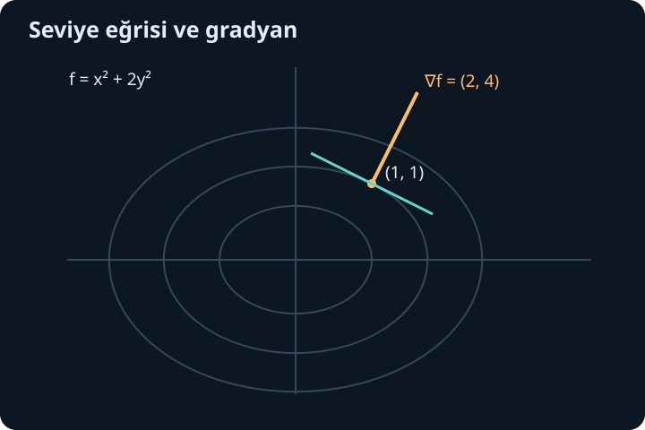
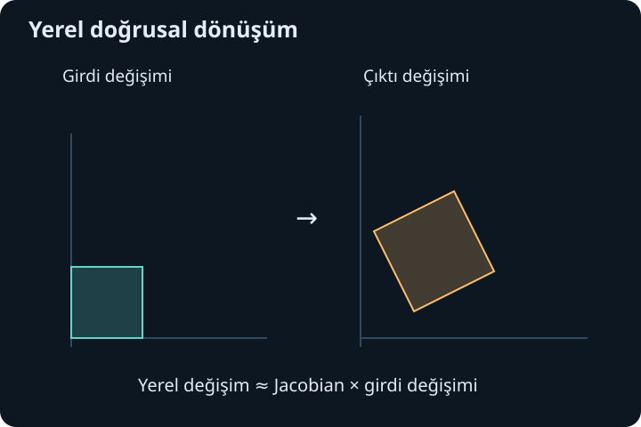

import ArticleVideo from '@/components/ArticleVideo.astro'
import kavram from './media/01-kavram.mp4?url'
import kavramPoster from './media/01-kavram.jpg?url'

Bir yüzeyin yüksekliğini yalnız doğu-batı konumuyla belirleyemeyiz; kuzey-güney konumu da gerekir. Benzer biçimde bir odanın sıcaklığı konuma, bir ürünün maliyeti birkaç girdiye bağlı olabilir. Girdi tek sayı olmaktan çıkınca “fonksiyonun eğimi” sorusu da tek bir cevap taşımaz. Hangi yönde hareket ettiğimizi ve diğer girdileri sabit tutup tutmadığımızı söylemeliyiz.

[Önceki yazıda](/blog/uc-boyutta-vektorel-carpim/) uzay vektörleri, düzlemler ve normal yönleriyle çalıştık. Burada aynı geometriyi fonksiyonların yerel değişimine bağlayacağız. Tek değişkenli türev, limit ve zincir kuralını kullanacağız; yeni olan, farklı yaklaşma yollarını birlikte denetleme gereğidir. Kısmi türev, gradyan, Jacobian ve Hessian adları bu ortak düşüncenin farklı parçalarını anlatır.

## 1. İki girdili bir fonksiyon nasıl okunur?

$z=f(x,y)$ yazımı, her uygun sıralı $(x,y)$ çiftine tek bir gerçek çıktı $z$ atar. Girdilerin sırası önemlidir. Örneğin $f(x,y)=x+2y$ için $f(1,3)=7$, $f(3,1)=5$ olur. İki değişken olması iki sonuç üretildiği anlamına gelmez; burada çıktı hâlâ tek sayıdır.

Tanım kümesini her iki değişken birlikte belirler. $f(x,y)=\sqrt{9-x^2-y^2}$ için kökün içi negatif olmamalıdır. Bu nedenle $x^2+y^2\leq9$ diski üzerinde çalışırız. $g(x,y)=\ln(y-x^2)$ için koşul $y>x^2$'dir. Tanım kümesi artık yalnız bir aralık değil, düzlemde bir bölge olabilir.

Grafik $(x,y,f(x,y))$ noktalarının oluşturduğu yüzeydir. Fakat her bilgiyi üç boyutlu çizimden okumak kolay değildir. **Seviye eğrileri** $f(x,y)=c$ denklemleriyle aynı çıktı değerine sahip girdileri düzlemde gösterir. Haritadaki eş yükselti çizgileri bu fikrin tanıdık örneğidir. Burada $c$, seçilen sabit yüksekliktir.

$f(x,y)=x^2+y^2$ için $c>0$ seviyeleri yarıçapı $\sqrt c$ olan çemberlerdir. Sıfır seviyesi yalnız orijindir; negatif seviyeler boştur. Her $c$ için bir eğri bulunmak zorunda değildir. Seviyelerin sıklaşması, aynı çıktı değişiminin daha kısa yatay uzaklıkta gerçekleştiğini gösterir; yerel değişim büyüktür.

## 2. Limit bütün yaklaşma yollarını kapsar

$(x,y)\to(a,b)$ demek, noktalar arası uzaklık $\sqrt{(x-a)^2+(y-b)^2}$ sıfıra gidiyor demektir. $f(x,y)$'nin limiti $L$ ise, tanım kümesi içindeki bütün yeterince yakın noktalarda çıktı $L$'ye yaklaşmalıdır. Yalnız bir doğru boyunca yaklaşmak yeterli değildir.

Orijin dışında $f(x,y)=xy/(x^2+y^2)$ olsun. $y=0$ yolunda fonksiyon sıfırdır. $y=x$ yolunda ise $x\ne0$ için değer $x^2/(2x^2)=1/2$'dir. İki yol farklı limit verdiği için orijinde iki değişkenli limit yoktur. İki farklı yol, yokluğu kanıtlamaya yeter; çok sayıda aynı sonuç veren yol ise varlığı tek başına kanıtlamaz.

Var olan bir limit için bütün yolları kapsayan bir sınır kullanabiliriz. $g(x,y)=x^2y/(x^2+y^2)$ için $|g(x,y)|\leq|y|$ olur; çünkü $0\leq x^2/(x^2+y^2)\leq1$. Nokta orijine yaklaşırken $|y|\to0$ olduğundan sıkıştırma limiti sıfır verir. Bu eşitsizlik seçilmiş birkaç yolu değil, çevredeki bütün noktaları denetler.

Süreklilik, limitin fonksiyonun o noktadaki değerine eşit olmasıdır. Süreklilik olmadan iyi bir doğrusal yaklaşım bekleyemeyiz. Çok değişkenli türev kavramının dikkatli kurulmasının nedeni de bu farklı yol olasılıklarıdır.

## 3. Bir girdiyi değiştirirken diğerini sabit tutmak

$x$'e göre **kısmi türev**, $y$ sabitken alınan sıradan türevdir:

$$
f_x(a,b)=\frac{\partial f}{\partial x}(a,b)
=\lim_{h\to0}\frac{f(a+h,b)-f(a,b)}h.
$$

$\partial$ işareti, birden çok bağımsız girdi varken bunlardan birini değiştirdiğimizi hatırlatır. Benzer biçimde $f_y(a,b)$, $x=a$ sabit tutularak $y$ yönündeki değişimi ölçer. Kısmi türevler yüzeyin iki koordinat doğrultusundaki kesit eğimleridir.

$f(x,y)=x^2y+3y^2$ olsun. $x$'e göre türev alırken $y$ sabit katsayı gibi davranır; $f_x=2xy$. $y$'ye göre türev alırken $x^2$ sabit katsayıdır; $f_y=x^2+6y$. $(2,1)$ noktasında bunlar sırasıyla 4 ve 10 olur. Aynı noktada farklı yönlere ait iki farklı eğim bulunması doğaldır.

Trigonometri ve zincir kuralı da aynı şekilde çalışır. $g(x,y)=\sin(xy)$ için $g_x=y\cos(xy)$, $g_y=x\cos(xy)$ olur. Çarpanlar hangi girdinin sabit tutulduğunu gösterir. Bu hesapta $x$ ve $y$ bağımsızdır; eğer $y$ ayrıca $x$'in bir fonksiyonuysa toplam değişim için başka bir hesap gerekecek.

## 4. Kısmi türevlerin varlığı neden yeterli değil?

Az önce limitinin olmadığını gördüğümüz $xy/(x^2+y^2)$ fonksiyonunu orijinde 0 olarak tanımlayalım. Her iki koordinat ekseni boyunca fonksiyon 0 olduğundan orijindeki iki kısmi türev de 0'dır. Buna rağmen çapraz yolda değer $1/2$'dir; fonksiyon sürekli bile değildir.

Demek ki iki eksendeki eğimi bilmek, aralarındaki bütün yönlerde düzenli davranış garantisi vermez. Tek değişkenli türevde sağ ve sol yaklaşma aynı çizgi üzerindeydi. İki değişkende sonsuz sayıda yön ve eğri yolu vardır. Bunları aynı anda yakalayan bir yerel yaklaşım koşuluna ihtiyaç duyarız.

Bu ayrım uygulamada önemlidir. Bir hesap programının $f_x$ ve $f_y$ ifadelerini üretmesi, otomatik olarak her noktada teğet düzlem bulunduğunu kanıtlamaz. İfadelerin tanım alanını, sürekliliğini ve ele alınan noktanın özel olup olmadığını da kontrol ederiz. Özellikle parçalı tanımlanan veya paydası sıfıra yaklaşan fonksiyonlarda bu kontrol atlanmamalıdır.

## 5. Tam türevlenebilirlik ve hata ölçüsü

$f$ fonksiyonu $(a,b)$'de türevlenebilirse küçük $(h,k)$ değişimleri için:

$$
f(a+h,b+k)=f(a,b)+f_x(a,b)h+f_y(a,b)k+r(h,k)
$$

olur ve kalan şu koşulu sağlar:

$$
\frac{r(h,k)}{\sqrt{h^2+k^2}}\longrightarrow0.
$$

Yani hata, girdi değişiminin uzunluğuna göre ihmal edilebilir hale gelir. Bu, yalnız hatanın sıfıra gitmesinden güçlü bir koşuldur. Doğrusal terim yerel değişimin birinci dereceden ana kısmını taşır. Bu doğrusal dönüşüme tam türev denir.

Kısmi türevler noktanın bir açık çevresinde bulunuyor ve noktada sürekli oluyorsa bu koşul sağlanır; sık kullandığımız yeterli ölçüt budur. Gerekçeyi iki küçük adımda görebiliriz: önce $x$'i, sonra $y$'yi değiştirip farkı iki parçaya ayırırız. Her parçada tek değişkenli ortalama değer teoremi bir ara noktadaki kısmi türevi verir. Kısmi türevlerin sürekliliği, bu katsayıları merkezdeki değerlere yaklaştırır ve kalan oranını sıfıra götürür.

Böylece teğet düzlem:

$$
z=f(a,b)+f_x(a,b)(x-a)+f_y(a,b)(y-b)
$$

olur. Bu düzlem yüzeye yalnız “değen” rastgele bir düzlem değildir; bütün küçük yatay yönlerdeki birinci dereceden değişimi aynı anda temsil eder.

## 6. Doğrusal yaklaşımın sayısal hesabı

$T(x,y)=20-x^2-2y^2$ fonksiyonunu düşünelim. Değerler bir sıcaklık modeli olarak okunabilir; $x$ ve $y$ aynı uzunluk ölçeğinde ölçülen konum koordinatları olsun. $(1,1)$ noktasında $T=17$, $T_x=-2$ ve $T_y=-4$'tür. Yeni nokta $(1{,}02,0{,}99)$ için $h=0{,}02$, $k=-0{,}01$ olur.

Doğrusal değişim $(-2)(0{,}02)+(-4)(-0{,}01)=0$'dır. Dolayısıyla yaklaşık değer 17'dir. Tam hesap:

$$
20-(1{,}02)^2-2(0{,}99)^2=16{,}9994
$$

verir. Fark $-0{,}0006$'dır. Polinomu açarsak kalan tam olarak $-h^2-2k^2$ olur; bu da $-0{,}0004-0{,}0002=-0{,}0006$'dır. Birinci derecedeki iki katkı birbirini götürmüş, ikinci derecedeki küçük hata kalmıştır.

Bu örnek doğrusal yaklaşımın eşitlik olmadığını gösterir. “İlk derecede değişmiyor” demek “tam olarak aynı kalıyor” demek değildir. Özellikle iki büyük katkı birbirini götürdüğünde daha küçük terimler sonucu belirleyebilir. Yaklaşımın geçerliliğini değişim ölçeğine göre değerlendirmek gerekir.

## 7. Gradyan ve yönlü türev

Kısmi türevleri bir vektörde toplayalım:

$$
\nabla f=(f_x,f_y).
$$

$\nabla$ işaretine nabla, bu vektöre **gradyan** denir. Türevlenebilir bir fonksiyonda birim $\mathbf u=(u_x,u_y)$ yönündeki türev:

$$
D_{\mathbf u}f=\nabla f\cdot\mathbf u=f_xu_x+f_yu_y
$$

olur. Tanım, $[f(\mathbf a+t\mathbf u)-f(\mathbf a)]/t$ oranının limitidir. Birim vektör seçildiğinde $t$, gidilen işaretli uzunluğu temsil eder. Vektör birim değilse sonuç onun uzunluğu kadar ölçeklenir; yön başına değil parametre başına değişim ölçülür.

Örneğin $T$ fonksiyonunda $(1,1)$ gradyanı $(-2,-4)$'tür. $(3,4)$ yönünde birim vektör $(3/5,4/5)$ olur. Yönlü türev $-6/5-16/5=-22/5$'tir. Doğrudan $(3,4)$ kullanılsaydı $-22$ elde edilirdi; bu, beş kat hızlı parametre değişiminin sonucudur.

Skaler çarpım formülü $D_{\mathbf u}f=|\nabla f|\cos\theta$ verir. $\theta$, gradyanla birim yön arasındaki açıdır. En büyük artış gradyan yönünde $|\nabla f|$, en büyük azalış ters yönde $-|\nabla f|$ olur. Gradyan sıfırsa bütün birinci dereceden yönlü türevler sıfırdır; yine de minimum, maksimum veya eyer ayrımı henüz yapılmış değildir.

## 8. Gradyan seviye eğrisine neden diktir?

$f(x(t),y(t))=c$ sabit seviyesini izleyen düzgün bir eğri düşünelim. Zincir kuralına göre:

$$
\frac d{dt}f(x(t),y(t))=f_xx'(t)+f_yy'(t)=0.
$$

Bu, $\nabla f\cdot\mathbf r'(t)=0$ demektir. Eğrinin teğet vektörü $\mathbf r'=(x',y')$ gradyana diktir. Gradyan sıfır olmadığı ve seviye eğrisi düzgün olduğu noktalarda bu, normal yönü belirler. Sıfır gradyanlı özel noktalarda aynı geometrik sonuçla tek bir normal seçemeyiz.

$f=x^2+2y^2$ için $(1,1)$ noktasında seviye $c=3$, gradyan $(2,4)$'tür. $(2,-1)$ teğet yönüyle skaler çarpım $4-4=0$ olur. Teğet doğrunun denklemi $2(x-1)+4(y-1)=0$, yani $x+2y=3$'tür. Bir denklemden eğrinin yerel yönünü, eğriyi tamamen çözmeden elde ettik.

<ArticleVideo src={kavram} poster={kavramPoster} title="Seviye çemberinde gradyan" caption="f(x,y)=x²+y² yüzeyinin seviye çemberi boyunca hareket eden noktada gradyan dışarı yönelir. Ok, her noktada çembere dik olan en hızlı artış yönünü gösterir." />

## 9. Bir yolda giderken toplam türev

$f$ iki girdiye bağlıyken $x=x(t)$ ve $y=y(t)$ birlikte değişebilir. O zaman yol boyunca toplam değişim:

$$
\frac{df}{dt}=f_x\frac{dx}{dt}+f_y\frac{dy}{dt}
$$

olur. Kısmi türevler her girdinin ayrı duyarlılığını, $dx/dt$ ve $dy/dt$ ise girdilerin gerçek hareket hızlarını taşır. İki katkıyı toplamamızın nedeni yerel doğrusal yaklaşımın iki girdi değişimini toplamasıdır.

$f(x,y)=x^2+y^2$, $x(t)=\cos t$, $y(t)=\sin t$ olsun. Doğrudan $f=1$ olduğu için toplam türev sıfırdır. Zincir kuralı da $2\cos t(-\sin t)+2\sin t\cos t=0$ verir. Kısmi türevlerin çoğu noktada sıfır olmamasıyla toplam türevin sıfır olması çelişmez; yol bir seviye eğrisini izlemektedir.

İki ara değişken de $s,t$'ye bağlıysa aynı düşünce her bağımsız girdi için ayrı uygulanır. $z=f(x(s,t),y(s,t))$ için $z_s=f_xx_s+f_yy_s$, $z_t=f_xx_t+f_yy_t$ olur. Hangi türevde hangi diğer girdinin sabit tutulduğunu açıkça yazmak, zincir kuralını karmaşık gösterimlerde de düzenli tutar.

## 10. Birden çok çıktı ve Jacobian matrisi

Şimdi $\mathbf F(x,y)=(u(x,y),v(x,y))$ iki çıktı üretsin. Her çıktının her girdiye duyarlılığını bir matriste toplarız:

$$
J_{\mathbf F}=
\begin{pmatrix}u_x&u_y\\v_x&v_y\end{pmatrix}.
$$

Bu **Jacobian matrisi**dir. Satırlar çıktılara, sütunlar girdilere aittir. Küçük değişim vektörü $\Delta\mathbf x$ için $\Delta\mathbf F\approx J_{\mathbf F}\Delta\mathbf x$ olur. Tek çıktılı gradyan aynı türev bilgisinin vektör gösterimidir; çok çıktılı durumda bütün satırları birlikte taşırız.

$u=x^2-y^2$, $v=2xy$ seçelim. Jacobian $\begin{pmatrix}2x&-2y\\2y&2x\end{pmatrix}$'tir. $(1,2)$ noktasında $\begin{pmatrix}2&-4\\4&2\end{pmatrix}$ olur. $\Delta x=0{,}01$, $\Delta y=-0{,}02$ için yaklaşık çıktı değişimi $(0{,}10,0)$'dır. Tam değişim $(0{,}0997,-0{,}0004)$ çıkar; farklar ikinci derecedendir.

Bileşik dönüşümlerde zincir kuralı matris çarpımına dönüşür: $J_{\mathbf G\circ\mathbf F}=J_{\mathbf G}(\mathbf F(x))J_{\mathbf F}(x)$. Sağdaki matris önce ilk değişimi, soldaki sonraki değişimi uygular. Sıralamayı ters çevirmek genellikle farklı bir dönüşüm verir. Matrislerin boyutları da çıktının bir sonraki işlemin girdisine uygun olduğunu denetler.

## 11. İkinci değişimler ve Hessian

$f_x$ ve $f_y$ de türevlenebiliyorsa ikinci kısmi türevler oluşur. $f_{xy}$ gösterimini burada önce $x$'e, sonra $y$'ye göre türev olarak kullanıyoruz. Karışık ikinci türevler bir açık çevrede sürekliyse $f_{xy}=f_{yx}$ olur. Bu eşitlik düzenlilik koşulu taşır; her parçalı fonksiyonda koşulsuz varsayılmaz.

İkinci türevleri **Hessian matrisi**nde toplarız:

$$
H_f=\begin{pmatrix}f_{xx}&f_{xy}\\f_{yx}&f_{yy}\end{pmatrix}.
$$

Uygun iki kez türevlenebilirlik altında ikinci derece yerel yaklaşım $f(\mathbf a+\mathbf h)\approx f(\mathbf a)+\nabla f(\mathbf a)\cdot\mathbf h+\frac12\mathbf h^{T}H_f(\mathbf a)\mathbf h$ olur. Üstteki $T$ transpozu, sütunu satıra çevirmeyi belirtir. Bu matris çarpımı, farklı yönlerdeki kavis bilgisini tek sayıya dönüştürür.

$f=x^2+xy+2y^2$ için Hessian $\begin{pmatrix}2&1\\1&4\end{pmatrix}$ olur. Orijinde gradyan sıfırdır. Fonksiyonu $(x+y/2)^2+7y^2/4$ diye yazarsak sıfır dışında pozitif olduğunu görürüz; orijin mutlak minimumdur. $g=x^2-y^2$ için ise $x$ yönünde değer yükselirken $y$ yönünde düşer. Gradyan yine sıfırdır, fakat nokta bir **eyer noktasıdır**.

Çok değişkenli türevde temel soru artık tek bir eğimi bulmak değil, küçük bir girdi değişimini çıktı değişimine dönüştüren düzeni bulmaktır. Kısmi türevler bu düzenin eksen bileşenleri, gradyan tek çıktının yön bilgisi, Jacobian çok çıktının doğrusal dönüşümü, Hessian ise ikinci dereceden düzeltmesidir. Sonraki adımda bu girdileri bir bölge boyunca toplayarak çok katlı integrallere geçeceğiz.

## Kaynaklar

- [OpenStax, Calculus Volume 3: Partial Derivatives](https://openstax.org/books/calculus-volume-3/pages/4-3-partial-derivatives)
- [OpenStax, Calculus Volume 3: Tangent Planes and Linear Approximations](https://openstax.org/books/calculus-volume-3/pages/4-4-tangent-planes-and-linear-approximations)
- [OpenStax, Calculus Volume 3: Directional Derivatives and the Gradient](https://openstax.org/books/calculus-volume-3/pages/4-6-directional-derivatives-and-the-gradient)
- [OpenStax, Calculus Volume 3: The Chain Rule](https://openstax.org/books/calculus-volume-3/pages/4-5-the-chain-rule)
