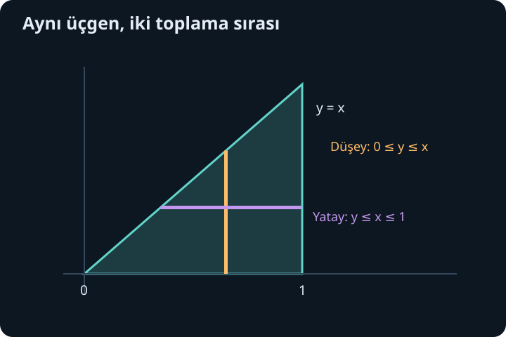
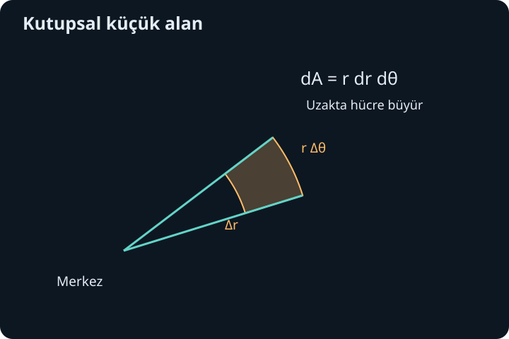

import ArticleVideo from '@/components/ArticleVideo.astro'
import kavram from './media/01-kavram.mp4?url'
import kavramPoster from './media/01-kavram.jpg?url'

Tek değişkenli integralde bir çizgi boyunca küçük katkıları topluyorduk. Bir yüzeyin altındaki hacmi veya bir levhanın değişen yoğunluğunu hesaplamak için artık bir bölgenin bütün noktalarını hesaba katmalıyız. Toplama fikri değişmez; küçük parçanın geometrisi değişir. İnce aralıkların yerini küçük alanlar, sonra küçük hacimler alır.

[Önceki yazıda](/blog/cok-degiskenli-fonksiyonlar-ve-turev/) birden çok girdiye bağlı fonksiyonları ve Jacobian matrisini tanıdık. Şimdi bu fonksiyonları bölgeler üzerinde toplayacağız. Önce dikdörtgenlerde başlayacak, eğri sınırlar için integral sınırlarını kuracak, ardından koordinat değiştirmenin alan ve hacim ölçeğini neden değiştirdiğini göreceğiz. Son hesapta, sıradan antitürevini yazamadığımız Gauss integralinin değerini bu yöntemle bulacağız.

## 1. Küçük kutuları toplamak

$D$ düzlemde bir bölge ve $f(x,y)$ bu bölge üzerinde bir fonksiyon olsun. Bölgeyi küçük parçalara ayıralım; $i$'nci parçanın alanı $\Delta A_i$, seçilen örnek noktasındaki değer $f(x_i,y_i)$ olsun. Toplam:

$$
\sum_i f(x_i,y_i)\Delta A_i
$$

şeklindedir. Parçaların çapı sıfıra giderken bu toplam seçimlerden bağımsız aynı sonlu değere yaklaşıyorsa **çift integral** tanımlanır:

$$
\iint_D f(x,y)\,dA.
$$

$dA$ alan katkısını temsil eder. Dikdörtgensel küçük hücrelerde $\Delta A=\Delta x\Delta y$ olur. $f\geq0$ bir yükseklikse her terim küçük kutunun hacmidir. $f$ negatif değer alıyorsa integral işaretli hacim gibi okunabilir; her durumda geometrik hacim diye adlandırmayız.

$f=1$ seçersek yalnız alanları toplarız ve $\iint_D1dA=\operatorname{Alan}(D)$ olur. $f$ birim alan başına miktarsa sonuç toplam miktardır. Örneğin değer gram/metrekare, $dA$ metrekare ise sonuç gramdır. İntegralin kaç katlı olduğundan önce, çarpılan küçük parçanın hangi ölçüyü taşıdığını belirlemek gerekir.

## 2. Fubini: bir yönde, sonra diğerinde toplamak

$f$ kapalı bir dikdörtgen üzerinde sürekli olsun. Fubini teoremi çift integrali ardışık tek değişkenli integraller olarak hesaplamamızı sağlar:

$$
\iint_{[a,b]\times[c,d]} f(x,y)dA
=\int_a^b\left[\int_c^d f(x,y)dy\right]dx.
$$

İç integralde $x$ sabit tutulur, $y$ değişir. İç hesabın sonucu genellikle $x$'e bağlı bir fonksiyondur; dış integral onu toplar. Sırayı ters çevirebiliriz, fakat hangi değişkenin önce toplandığını $dy\,dx$ veya $dx\,dy$ yazımıyla açık tutarız.

Örneğin $D=[0,2]\times[0,1]$ ve $f=x+2y$ olsun. Önce $y$'yi toplarsak:

$$
\int_0^2\left[xy+y^2\right]_{y=0}^{y=1}dx
=\int_0^2(x+1)dx=4.
$$

Önce $x$'i toplarsak iç integral $[x^2/2+2xy]_0^2=2+4y$ olur. Dış integral $\int_0^1(2+4y)dy=4$ verir. İki yol aynı bütün küçük kutuları farklı sırayla toplar.

Süreklilik burada kolay kontrol edilen yeterli koşuldur. Daha genel teoride mutlak integrallenebilirlik, yani $\iint|f|dA<\infty$, sıralamayı değiştirmek için güçlü bir güvence sağlar. Sınırsız bölgelerde veya tekilliklerde yalnız bir iterasyonun sonlu görünmesi yeterli değildir. İleride limitleri kullanırken koşulları ayrıca denetleyeceğiz.

## 3. Eğri sınırlı bölgeyi okumak

Dikdörtgen dışındaki bölgelerde sınırlar birbirine bağlı olabilir. $D$ bölgesi $a\leq x\leq b$ ve $g_1(x)\leq y\leq g_2(x)$ ile verilsin. Sabit bir $x$ seçtiğimizde düşey kesit alt eğriden üst eğriye gider. O zaman:

$$
\iint_D f(x,y)dA
=\int_a^b\int_{g_1(x)}^{g_2(x)}f(x,y)dy\,dx.
$$

İç sınırların dış değişkene bağlı olması normaldir. Fakat dış integralin sınırlarının henüz içeride dolaşan değişkene bağlı kalması uygun değildir; iç hesap bittikten sonra o değişken ortadan kalkar.

Köşeleri $(0,0)$, $(1,0)$ ve $(1,1)$ olan üçgen için $0\leq x\leq1$, $0\leq y\leq x$ olur. $f=x+y$ seçersek iç integral $xy+y^2/2$'dir. $y=x$ konunca $3x^2/2$, dış integralde $1/2$ elde ederiz. $f=1$ seçilseydi aynı bölgenin alanı $\int_0^1x dx=1/2$ olurdu; iki eşit sayının farklı integrandlardan geldiğine dikkat edelim.

## 4. Sırayı değiştirmek bir geometri işlemidir

Aynı üçgeni yatay kesitlerle tarif edelim. $0\leq y\leq1$ iken $y\leq x\leq1$ olur. İntegral:

$$
\int_0^1\int_y^1(x+y)dx\,dy
$$

şeklindedir. İç hesap $[x^2/2+yx]_y^1=1/2+y-3y^2/2$ verir. Bunun 0 ile 1 arasındaki integrali yine $1/2$'dir. Sırayı değiştirmek yalnız $dx$ ve $dy$ harflerini yer değiştirmek değildir; bölgeyi yeni kesit yönünde yeniden okumaktır.

Bu seçim, zor bir hesabı basitleştirebilir. $\int_0^1\int_x^1e^{y^2}dy\,dx$ iç integralinde elementer antitürev yoktur. Bölge $0\leq x\leq y\leq1$ olduğundan sıra değişince $\int_0^1\int_0^ye^{y^2}dx\,dy=\int_0^1ye^{y^2}dy$ olur. Artık $u=y^2$ dönüşümüyle sonuç $(e-1)/2$'dir. Fonksiyonun kendisi değişmedi; toplama sırasını bölgeye uygun seçtik.

## 5. Kutupsal koordinatların alan parçası

Daire ve halka bölgelerinde $x=r\cos\theta$, $y=r\sin\theta$ kullanmak doğaldır. Burada $r\geq0$ merkezden uzaklık, $\theta$ pozitif $x$ ekseninden saat yönünün tersine ölçülen radyan açıdır. Küçük bir kutupsal hücrenin iki kenarı yaklaşık $\Delta r$ ve $r\Delta\theta$ olur. Bu nedenle alan yaklaşık $r\Delta r\Delta\theta$'dır; yalnız $\Delta r\Delta\theta$ değildir.

Bunu tam halka dilimi alanıyla da görebiliriz. $r$ ile $r+\Delta r$ yarıçapları ve $\Delta\theta$ açısı arasındaki alan:

$$
\frac{\Delta\theta}{2}[(r+\Delta r)^2-r^2]
=r\Delta r\Delta\theta+\frac12(\Delta r)^2\Delta\theta.
$$

Parça küçülünce ikinci terim daha küçük mertebededir. Böylece alan elemanı:

$$
\boxed{dA=r\,dr\,d\theta}
$$

olur. Merkezden uzaklaştıkça aynı açı aralığının daha uzun bir yayı kapsaması, ek $r$ çarpanının geometrik nedenidir.

## 6. Jacobian determinantı yerel alan ölçeğidir

Genel bir dönüşüm $x=x(u,v)$, $y=y(u,v)$ olsun. Küçük bir $(\Delta u,\Delta v)$ dikdörtgeninin iki kenarı yaklaşık $(x_u,y_u)\Delta u$ ve $(x_v,y_v)\Delta v$ vektörlerine dönüşür. Bu vektörlerin gerdiği paralelkenarın alanı determinantın mutlak değeriyle bulunur:

$$
dA=\left|\frac{\partial(x,y)}{\partial(u,v)}\right|du\,dv,
\qquad
\frac{\partial(x,y)}{\partial(u,v)}=x_uy_v-x_vy_u.
$$

Bu sayı Jacobian determinantıdır. Önceki yazıdaki Jacobian matrisi yerel doğrusal dönüşümü veriyordu; determinantı bu dönüşümün alanı kaç kat büyüttüğünü gösterir. Mutlak değer yönelim işaretini kaldırır, çünkü alan ölçüsü negatif değildir.

Kutupsal dönüşümde matris $\begin{pmatrix}\cos\theta&-r\sin\theta\\\sin\theta&r\cos\theta\end{pmatrix}$ olur. Determinant $r\cos^2\theta+r\sin^2\theta=r$'dir. Geometrik hücre hesabıyla aynı çarpanı bulduk. Böylece görünürde farklı iki yöntem birbirini doğrular.

Dönüşüm yeterince düzgün ve bölgenin içini bir kez örtecek biçimde seçilmeli, Jacobian içte sıfır olmamalıdır. Kutupsal koordinatların merkezde veya açı sınırının iki temsilinde tekilliği bulunur; bunlar alanı sıfır olan sınır kümeleri olarak uygun parçalamayla ele alınır. Bir bölgeyi iki kez taramak integral değerini de iki kez sayar.

## 7. Disk üzerinde bir örnek

Yarıçapı 2 olan diskte $f=x^2+y^2$ fonksiyonunu toplayalım. Kutupsal biçimde $f=r^2$, bölge $0\leq r\leq2$, $0\leq\theta\leq2\pi$ olur. Alan çarpanını da eklersek:

$$
\iint_D(x^2+y^2)dA
=\int_0^{2\pi}\int_0^2r^3dr\,d\theta
=\int_0^{2\pi}4d\theta=8\pi.
$$

Diskin alanı $4\pi$ olduğundan fonksiyonun bölge ortalaması 2'dir. İntegrandın en küçük değeri 0, en büyük değeri 4 olduğundan bu ortalama beklenen aralıktadır. Ortalama yalnız merkezin değerini veya sınırın değerini kullanmaz; her noktayı alan ağırlığıyla toplar.

Ek $r$'yi unutursak $\int r^2dr$ hesabı çıkar ve yanlış bir sonuç elde ederiz. Bu hata, bütün yarıçaplarda aynı açısal parçanın aynı alanı taşıdığını varsaymakla eşdeğerdir. Koordinat değişikliğinin yalnız formülü değil küçük ölçüyü de değiştirdiğini hatırlamak gerekir.

<ArticleVideo src={kavram} poster={kavramPoster} title="Kutupsal hücrenin alanı" caption="Aynı radyal kalınlık ve açı genişliğindeki hücre merkezden uzaklaştıkça büyür. Alan elemanındaki r çarpanı bu genişlemeyi ölçer." />

## 8. Üçlü integral ve silindirik koordinatlar

Uzayda bir $E$ bölgesini küçük hacimlere ayırınca üçlü integral $\iiint_Ef(x,y,z)dV$ oluşur. $f=1$ ise bölgenin hacmini, $f$ hacim başına miktarsa toplam miktarı verir. Dikdörtgensel koordinatlarda $dV=dx\,dy\,dz$'dir. Sürekli fonksiyonlar ve düzgün sınırlı bölgelerde uygun sırayla ardışık integraller kullanabiliriz.

Silindirik koordinatlar düzlemdeki kutupsal koordinatlara yüksekliği ekler: $x=r\cos\theta$, $y=r\sin\theta$, $z=z$. Küçük taban alanı $rdrd\theta$, yükseklik $dz$ olduğundan $dV=rdrd\theta dz$ olur. İntegral sırası seçime göre değişebilir, fakat alan ölçeği korunur.

Yarıçapı 2, yüksekliği 3 olan dik silindirin hacmi $\int_0^3\int_0^{2\pi}\int_0^2rdrd\theta dz=3\cdot2\pi\cdot2=12\pi$'dir. Eğer yükseklik $z=4-r^2$ paraboloidiyle sınırlıysa üst sınır sabit 3 yerine $4-r^2$ olur. O zaman hacim $\int_0^{2\pi}\int_0^2(4-r^2)rdrd\theta=8\pi$ çıkar. Bölgenin şekli sınırların bağımlılığında görünür.

## 9. Küresel koordinatlarda açı adlarını sabitlemek

Küresel koordinatlar için şu konvansiyonu kullanacağız: $\rho\geq0$ orijine uzaklık, $0\leq\theta<2\pi$ düzlemdeki azimut açısı, $0\leq\phi\leq\pi$ pozitif $z$ ekseninden ölçülen kutup açısıdır. Bazı kaynaklar iki açı harfini değiştirir; formülleri karşılaştırırken anlamlarına bakmalıyız.

$$
x=\rho\sin\phi\cos\theta,\quad
y=\rho\sin\phi\sin\theta,\quad
z=\rho\cos\phi.
$$

Küçük hücrenin üç dik kenarı yaklaşık $d\rho$, $\rho d\phi$ ve $\rho\sin\phi d\theta$'dır. Çarpımları:

$$
\boxed{dV=\rho^2\sin\phi\,d\rho\,d\phi\,d\theta}
$$

verir. Aynı sonuç üçe üç Jacobian determinantının mutlak değeriyle bulunur. $\sin\phi$ faktörü, kutuplara yaklaşırken aynı azimut açısının daha küçük bir çember yayı oluşturmasını anlatır.

Yarıçapı $R$ olan kürenin hacmi $\int_0^{2\pi}\int_0^\pi\int_0^R\rho^2\sin\phi\,d\rho d\phi d\theta$ olur. Üç çarpan sırasıyla $R^3/3$, 2 ve $2\pi$ verir; sonuç $4\pi R^3/3$'tür. Tanıdık formülü bu kez küçük küresel hücrelerden türettik.

## 10. Gauss integraline hazırlanmak

Şimdi $I=\int_{-\infty}^{\infty}e^{-x^2}dx$ değerini arayalım. Bu integralin yakınsak olduğunu önce doğrulayabiliriz. $|x|\geq1$ için $x^2\geq|x|$ ve $0\leq e^{-x^2}\leq e^{-|x|}$ olur. Üstel kuyrukların integrali sonludur; orta parça da sürekli ve sınırlıdır. Böylece iki kuyruk ayrı ayrı yakınsar.

Elementer antitürev bulamadığımız bu integralde bir boyut daha eklemek hesabı kolaylaştırır. Ancak sonsuz integralleri doğrudan çarpıp sıra değiştirmeyi açıklamasız yapmayacağız. Sonlu $R>0$ için $J_R=\int_{-R}^{R}e^{-x^2}dx$ tanımlayalım. Sonlu kare üzerinde süreklilik ve Fubini:

$$
J_R^2=\iint_{[-R,R]^2}e^{-(x^2+y^2)}dA
$$

verir. İntegrand artık yalnız merkezden uzaklığın karesine bağlıdır. Dairelerde kutupsal dönüşüm kolay olduğundan kareyi iki daire arasında sıkıştıracağız.

## 11. Kareyi iki disk arasında sıkıştırmak

Yarıçapı $R$ olan disk, kenarı $2R$ olan merkezli karenin içindedir. Aynı kare yarıçapı $\sqrt2R$ olan diskin içindedir; çünkü köşenin merkeze uzaklığı $\sqrt{R^2+R^2}=\sqrt2R$'dir. İntegrand pozitif olduğundan bölge büyüdükçe integral büyür.

Yarıçapı $s$ olan diskteki integral kutupsal olarak:

$$
\int_0^{2\pi}\int_0^se^{-r^2}rdrd\theta
=\pi(1-e^{-s^2})
$$

olur. İç integral için $u=r^2$ ve $du=2rdr$ kullandık. Böylece:

$$
\pi(1-e^{-R^2})\leq J_R^2\leq\pi(1-e^{-2R^2}).
$$

$R\to\infty$ iken iki sınır da $\pi$'ye gider. Sıkıştırma $I^2=\pi$ verir. İntegral pozitif olduğundan:

$$
\boxed{\int_{-\infty}^{\infty}e^{-x^2}dx=\sqrt\pi.}
$$

Bu ispat, sonsuz bölgedeki işlemi sonlu bölgelerin denetlenen limitine bağladı. Değişken değiştirme yalnız hesabı kısaltmadı; sonucu elde etmemizi mümkün kıldı. Bir boyutta görünmeyen dönme simetrisi, iki boyutta ortaya çıktı.

$a>0$ için $u=\sqrt a(x-b)$ dönüşümü yaparsak $\int_{-\infty}^{\infty}e^{-a(x-b)^2}dx=\sqrt{\pi/a}$ bulunur. Merkez kayması toplam alanı değiştirmez; genişlik ölçeği değişince alan $1/\sqrt a$ ile ölçeklenir. İleride olasılık dağılımlarını ve dalga biçimlerini toplamı 1 olacak şekilde ayarlarken bu sonuç doğrudan kullanılacak.

Çok katlı integralde güvenilir hesap üç parçayı birlikte taşır: fonksiyonun yeni ifadesi, bölgenin yeni sınırları ve küçük alan ya da hacmin ölçeği. Bunlardan biri eksikse dönüşüm tamamlanmış değildir. Şimdi bu bölge toplamlarını eğriler, yüzeyler ve yönlü akışlarla ilişkilendirmeye hazırız.

## Kaynaklar

- [OpenStax, Calculus Volume 3: Double Integrals over Rectangular Regions](https://openstax.org/books/calculus-volume-3/pages/5-1-double-integrals-over-rectangular-regions)
- [OpenStax, Calculus Volume 3: Double Integrals in Polar Coordinates](https://openstax.org/books/calculus-volume-3/pages/5-3-double-integrals-in-polar-coordinates)
- [OpenStax, Calculus Volume 3: Triple Integrals in Cylindrical and Spherical Coordinates](https://openstax.org/books/calculus-volume-3/pages/5-5-triple-integrals-in-cylindrical-and-spherical-coordinates)
- [OpenStax, Calculus Volume 3: Change of Variables in Multiple Integrals](https://openstax.org/books/calculus-volume-3/pages/5-7-change-of-variables-in-multiple-integrals)
