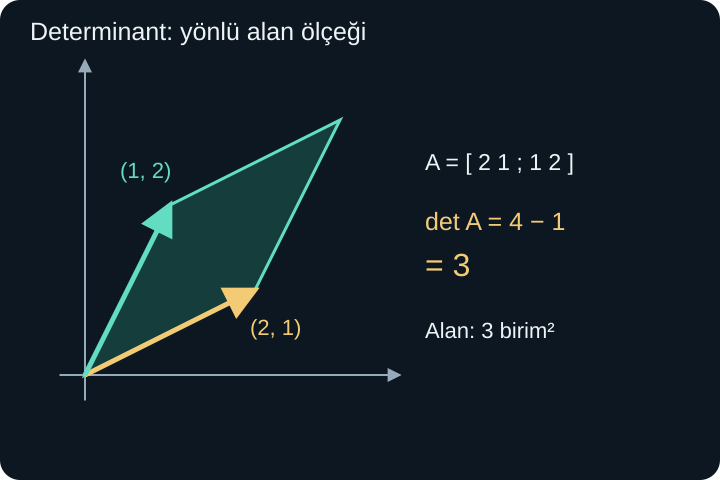
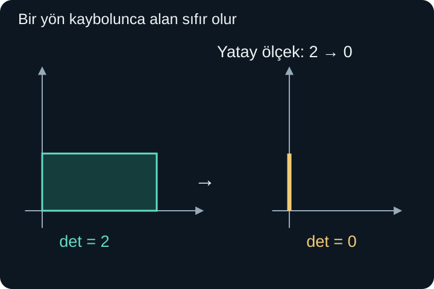

import ArticleVideo from '@/components/ArticleVideo.astro'
import kavram from './media/01-kavram.mp4?url'
import kavramPoster from './media/01-kavram.jpg?url'

Bir kareyi yatayda iki kat büyütürsek alanı iki katına çıkar. Yatayda sıfır katına indirirsek bütün kare düşey bir doğru parçasına çöker; alanı sıfır olur. İlk işlemi geri almak mümkündür: yatay uzunlukları ikiye böleriz. İkinci işlemde ise kaybolan yatay konumları sonuçtan ayırt edemeyiz.

**Determinant**, kare bir matrisin alanı veya daha yüksek boyutta hacmi nasıl ölçeklediğini gösteren sayıdır. İşareti yönelim değişimini, sıfır olması bir boyut kaybını haber verir. **Ters matris** ise, varsa, dönüşümü geri alır. Bu iki kavramın bağlantısı ezberlenmiş bir formülün ötesinde, bilginin korunup korunmamasıyla ilgilidir.

[Önceki yazıda](/blog/matrisler-ve-dogrusal-donusumler/) matris çarpımını, baz görüntülerini ve dönüşüm sırasını gördük. Burada iki boyutta alan, trigonometrik fark bağıntısı ve denklem çözme bilgisini kullanacağız. Üç boyuttaki hacim anlamını da tanıtacak, genel boyutlu determinant hesabının ayrıntılarına girmeyeceğiz.

## 1. Birim Karenin Alanını İzlemek

Bir matrisin sütunları $\mathbf u=(a,c)$ ve $\mathbf v=(b,d)$ olsun:

$$
A=\begin{pmatrix}a&b\\c&d\end{pmatrix}.
$$

Birim karenin köşeleri $\mathbf0$, $\mathbf e_1$, $\mathbf e_1+\mathbf e_2$, $\mathbf e_2$ idi. Dönüşüm bunları $\mathbf0$, $\mathbf u$, $\mathbf u+\mathbf v$, $\mathbf v$ konumlarına götürür. Çıktı, sütun vektörlerinin oluşturduğu paralelkenardır; sütunlar aynı doğrultudaysa şekil çöker.

Örneğin $\mathbf u=(2,1)$ ve $\mathbf v=(1,2)$ için köşeler $(0,0),(2,1),(3,3),(1,2)$ olur. Karenin alanı 1 birimkareydi. Yeni paralelkenarın alanını yalnızca sütun koordinatlarından hesaplamak istiyoruz.

## 2. İki Boyutlu Formülün Geometrik Gerekçesi

Önce iki sütun da sıfırdan farklı olsun. Uzunluklarını $r$ ve $s$, yatay eksenle açılarını $\alpha$ ve $\beta$ diye adlandıralım. O zaman:

$$
a=r\cos\alpha,\quad c=r\sin\alpha,
$$

$$
b=s\cos\beta,\quad d=s\sin\beta.
$$

Paralelkenarın alanı, bir kenar uzunluğu ile o kenara dik yüksekliğin çarpımıdır. Yüksekliğin büyüklüğü $s|\sin(\beta-\alpha)|$ olduğundan alan $rs|\sin(\beta-\alpha)|$ olur.

Sinüs fark bağıntısını kullanırsak:

$$
rs\sin(\beta-\alpha)
=rs(\sin\beta\cos\alpha-\cos\beta\sin\alpha).
$$

Çarpanları gruplayınca ilk terim $(r\cos\alpha)(s\sin\beta)=ad$, ikinci terim $(s\cos\beta)(r\sin\alpha)=bc$ olur. Böylece yönlü değer $ad-bc$, sıradan pozitif alan ise $|ad-bc|$ çıkar.

**İki boyutlu determinantı** bu yönlü değerle tanımlarız:

$$
\boxed{\det A=ad-bc.}
$$

Sütunlardan biri sıfır olduğunda paralelkenarın bir kenarı yok olur, alan sıfırdır; aynı formül de sıfır verir. Sütunlar aynı veya zıt yönde olduğunda aradaki açının sinüsü sıfırdır ve sonuç yine alanın çöktüğünü gösterir.

Başlangıçtaki örnekte $\det A=2\cdot2-1\cdot1=3$ olur. Yeni alan 3 birimkaredir. Determinantı kenar uzunluğu sanmayız; burada alanın eski alana oranını anlatır. Birim kareden başladığımız için yeni alanın sayısal değeriyle aynı çıktı.

## 3. İşaret ve Alanı Ayırmak

Yatay eksene göre yansımanın matrisi $F=\begin{pmatrix}1&0\\0&-1\end{pmatrix}$ olsun. Determinant $-1$'dir. Alanın eksi bir birimkare olduğu anlamına gelmez; alan ölçeğinin büyüklüğü 1'dir, yönelim tersine dönmüştür.

Yönelimi bir köşe sırasıyla görebiliriz. Standart kareyi saat yönünün tersine dolaşan köşe sırası, yansımadan sonra saat yönünde dolaşır. Pozitif determinant bu yönelimi korur, negatif determinant tersine çevirir. Bu anlamı okurken standart eksenlerin ve baz sırasının baştan sabit olduğunu varsayarız.

İki sütunun yerini değiştirmek $ad-bc$ ifadesini $bc-ad$ yapar; işaret değişir. Bir sütunu $k$ ile çarpmak determinantı $k$ ile çarpar. Geometrik olarak paralelkenarın bir kenarını ölçekleriz. Negatif katsayı alan büyüklüğünü $|k|$ ile çarparken yönelimi de ters çevirir.

Yatay kayma matrisi $S=\begin{pmatrix}1&1\\0&1\end{pmatrix}$ için determinant 1'dir. Kare paralelkenara dönüşmesine rağmen alanı değişmez. Dönme matrisinde determinant $\cos^2\theta+\sin^2\theta=1$ olur. Demek ki determinant 1 olan bütün dönüşümler aynı şekli üretmez; determinant tek bir alan bilgisi taşır.

Genel bir çokgeni üçgenlere ayırarak alanın aynı $|\det A|$ katsayısıyla ölçeklendiğini göstermek mümkündür. Bunu belirleyen temel cebirsel özellik, iki ardışık kare matris için $\det(AB)=\det A\det B$ olmasıdır. İki boyutta bu eşitlik matris çarpımının elemanlarını $ad-bc$ ifadesine koyup açarak doğrulanır. Geometrik okuması, önce bir alan ölçeği sonra diğerini uygulayınca oranların çarpılmasıdır.

## 4. Sıfır Determinantta Ne Kaybolur?

$D=\begin{pmatrix}2&0\\0&1\end{pmatrix}$ için determinant 2'dir. Yatay iki kat, düşey bir kat ölçekleme alanı ikiye katlar. İlk elemanı sıfıra indirirsek:

$$
C=\begin{pmatrix}0&0\\0&1\end{pmatrix}
$$

olur. Bu matris $(x,y)$'yi $(0,y)$'ye gönderir. Aynı yükseklikteki bütün farklı yatay konumlar aynı çıktıya gider. Örneğin $(1,3)$, $(5,3)$ ve $(-2,3)$ sonucunda hep $(0,3)$ vardır.

<ArticleVideo src={kavram} poster={kavramPoster} title="Determinant ve alanın çökmesi" caption="Yatay ölçek 2’den 0’a inerken birim karenin görüntüsünün alanı da sıfıra iner. Son durumda yatay konum bilgisi kaybolur." />

Sıfır determinantlı $2\times2$ matrislerde sütunlar bağımlıdır; ya bir doğruyu, ya yalnızca sıfır vektörünü gererler. Dolayısıyla bütün düzleme erişemezler. “Determinant sıfır, demek sonuç sıfır vektörü” demek yanlış olur: örneğimizde $(0,3)$ gibi birçok sıfırdan farklı çıktı vardır. Kaybolan, bütün çıktılar değil, bir bağımsız yöndür.

## 5. Ters Matris Ne Yapar?

Bir $A$ matrisinin yaptığı dönüşümü geri alan matrise $A^{-1}$ denir. Üstteki $-1$ burada bir ters dönüşümü gösterir. Matrisin her elemanının sayısal tersini almak anlamına gelmez.

Terslik koşulu:

$$
A^{-1}A=I,\qquad AA^{-1}=I
$$

biçimindedir. $I$ birim matristir; hiçbir vektörü değiştirmez. Önce dönüşümü sonra tersini, veya önce tersini sonra dönüşümü uyguladığımızda başlangıç vektörüne dönmeliyiz.

Örneğin yatay iki, düşey üç kat ölçeklemenin tersi yatay yarım, düşey üçte bir ölçeklemedir:

$$
\begin{pmatrix}2&0\\0&3\end{pmatrix}^{-1}
=\begin{pmatrix}1/2&0\\0&1/3\end{pmatrix}.
$$

Sıfır determinantlı örneği geri almak mümkün değildir. $(0,3)$ çıktısını gördüğümüzde başlangıcın $(1,3)$ mü, $(5,3)$ mü, başka bir nokta mı olduğunu bilemeyiz. Tek girdiye tek çıktı vermesi gereken ters fonksiyon, bu kayıp bilgiyi kendiliğinden üretemez.

## 6. İki Boyutta Ters Formülünü Kontrol Etmek

$A=\begin{pmatrix}a&b\\c&d\end{pmatrix}$ için şu yardımcı matrisi düşünelim:

$$
B=\begin{pmatrix}d&-b\\-c&a\end{pmatrix}.
$$

$AB$ çarpımını eleman eleman hesaplayalım. Sol üst eleman $ad-bc$, sağ üst $-ab+ba=0$, sol alt $cd-dc=0$, sağ alt $-cb+da=ad-bc$ olur. Yani:

$$
AB=(ad-bc)I.
$$

Aynı hesap $BA$ için de aynı sonucu verir. Eğer $ad-bc\ne0$ ise bütün yardımcı matrisi bu sayıya bölebiliriz:

$$
\boxed{A^{-1}=\frac1{ad-bc}
\begin{pmatrix}d&-b\\-c&a\end{pmatrix}.}
$$

Böylece iki boyutta tersin var olması için determinantın sıfırdan farklı olmasının yeterli olduğunu gördük. Sıfır olduğunda ise sütun bağımlılığı nedeniyle bilgi kaybı vardır ve ters yoktur. Bu iki yön birlikte “ancak ve ancak” koşulunu oluşturur.

Örnek matrisimiz $A=\begin{pmatrix}2&1\\1&2\end{pmatrix}$ için:

$$
A^{-1}=\frac13\begin{pmatrix}2&-1\\-1&2\end{pmatrix}.
$$

$(1,2)$ girdisi $A$ altında $(4,5)$ olur. Tersi uygulayalım: ilk bileşen $(2\cdot4-5)/3=1$, ikinci bileşen $(-4+2\cdot5)/3=2$ çıkar. Başlangıç vektörünü geri bulduk. Formülün dışındaki $1/3$ bütün elemanları çarpar; yalnızca ilk satıra uygulanmaz.

## 7. Ters Matrisle Sistem Çözmek

$A\mathbf x=\mathbf b$ eşitliğinde $A$ katsayı matrisi, $\mathbf x$ bilinmeyenler vektörü, $\mathbf b$ verilen sağ taraftır. $A$ tersinir olduğunda iki tarafa soldan $A^{-1}$ uygularız:

$$
A^{-1}(A\mathbf x)=A^{-1}\mathbf b.
$$

Çarpımın birleşme özelliğiyle sol taraf $(A^{-1}A)\mathbf x=I\mathbf x=\mathbf x$ olur. Sonuç $\mathbf x=A^{-1}\mathbf b$'dir. Sırayı koruduk; matrisleri keyfî biçimde yer değiştirmedik.

$2x+y=4$, $x+2y=5$ sistemi için az önceki ters matris doğrudan $(x,y)=(1,2)$ verir. Sağ taraf değişse bile aynı $A^{-1}$ kullanılabilir. Örneğin sağ taraf $(3,0)$ olursa çözüm $(2,-1)$ çıkar; yerine koyunca $4-1=3$ ve $2-2=0$ doğrulanır.

Bununla birlikte her sistemi çözmek için önce bütün ters matrisi hesaplamak zorunda değiliz. Daha büyük sistemlerde doğrudan satır işlemleri kullanmak daha uygun olabilir. Ters matris, çözümün varlığı ve tekliği için güçlü bir kavramsal araçtır; her hesapta zorunlu bir ara adım değildir.

## 8. Gauss Yöntemi: Eşitlikleri Bozmadan Sadeleştirmek

Denklemleri alt alta yazarken bilinmeyen katsayılarını ve sağ tarafı bir tabloda birleştirebiliriz. Buna **genişletilmiş matris** denir. Dikey çizgi bilinmeyen katsayılarıyla sonuçları ayırır; bir aritmetik işlem sembolü değildir.

Çözüm kümesini koruyan üç temel satır işlemi vardır: iki satırın yerini değiştirmek, bir satırı sıfırdan farklı sayıyla çarpmak, bir satıra başka bir satırın katını eklemek. Her işlemi geri alabiliriz. Bir satırı sıfırla çarpmak ise geri alınamaz ve bilgi kaybettirir; bu yüzden izinli değildir.

Şu üç bilinmeyenli sistemi çözelim:

$$
\begin{aligned}
x+y+z&=6,\\
2x-y+z&=3,\\
x+2y-z&=2.
\end{aligned}
$$

İkinci denklemden birincinin iki katını çıkarınca $-3y-z=-9$ elde edilir. Üçüncüden birinciyi çıkarınca $y-2z=-4$ kalır. Birinci denklemi koruyup ikinci ve üçüncünün sırasını değiştirirsek:

$$
\left[\begin{array}{ccc|c}
1&1&1&6\\
0&1&-2&-4\\
0&-3&-1&-9
\end{array}\right]
$$

tablosuna ulaşırız. Şimdi son satıra ikinci satırın üç katını ekleyelim. $y$ katsayısı $-3+3=0$, $z$ katsayısı $-1-6=-7$, sağ taraf $-9-12=-21$ olur. Son denklem $-7z=-21$, yani $z=3$'tür.

İkinci denkleme dönünce $y-6=-4$, buradan $y=2$ bulunur. Birincide $x+2+3=6$ olduğundan $x=1$ çıkar. Bu son aşama **geri yerine koyma**dır. Kontrol için ilk sistemin ikinci denklemine $2\cdot1-2+3=3$, üçüncüye $1+4-3=2$ yazabiliriz.

Bir sütundaki bilinmeyeni alt satırlardan kaldırarak ilerleyen bu yönteme **Gauss eleme yöntemi** denir. O adımda kullandığımız sıfırdan farklı baş katsayı pivot olarak adlandırılır. Pivot sıfırsa hemen bölme yapmayız; uygun başka satır varsa yer değiştiririz. Yoksa başka bir sütuna geçmek veya serbest bilinmeyen bulunduğunu kabul etmek gerekir.

### Satır işlemleriyle ters matrisi de bulabiliriz

Aynı eleme düşüncesi, yalnızca tek bir sağ taraf için değil bütün birim sağ taraflar için birlikte uygulanabilir. $A$ matrisinin yanına birim matrisi koyup $[A\mid I]$ tablosunu kurarız. Sol tarafı birim matrise dönüştüren satır işlemleri, sağ tarafta ters matrisi üretir. Çünkü sağdaki her sütun, bir baz vektörünü çıktı olarak veren girdiyi ayrı ayrı çözmektedir.

Örneğin $A=\begin{pmatrix}1&1\\1&2\end{pmatrix}$ olsun. Başlangıç tablosu:

$$
\left[\begin{array}{cc|cc}1&1&1&0\\1&2&0&1\end{array}\right]
$$

olur. İkinci satırdan birinciyi çıkarınca solda $(0,1)$, sağda $(-1,1)$ kalır. Şimdi birinci satırdan bu yeni ikinci satırı çıkarırız. Solda $(1,0)$, sağda $(2,-1)$ elde edilir. Son tablo:

$$
\left[\begin{array}{cc|cc}1&0&2&-1\\0&1&-1&1\end{array}\right]
$$

biçimindedir. Sağdaki matris $A^{-1}=\begin{pmatrix}2&-1\\-1&1\end{pmatrix}$ olur. Doğrudan çarparak ilk satırdan $(2-1,-1+1)=(1,0)$, ikinci satırdan $(2-2,-1+2)=(0,1)$ çıktığını denetleyebiliriz.

Her satır işlemini hem sol hem sağ tarafa uyguladık. Yalnızca sol tablodaki katsayıları değiştirip sağ tarafı sabit tutmak, aynı sistemleri çözmek anlamına gelmezdi. Bu yöntem, iki boyutlu hazır ters formülünün ötesine geçebilen sistemli bir yaklaşım sağlar. Sol taraf birim matrise indirgenemiyorsa matris tersinir değildir.

Ayrıca eleme sırasında determinantın nasıl değiştiğini bilmek yararlıdır. Satır değiştirme işareti tersine çevirir; bir satırı bir sayıyla çarpmak determinantı o sayıyla çarpar; bir satıra başka satırın katını eklemek determinantı değiştirmez. Son özellik iki boyutta doğrudan görülebilir: ikinci satır $(c+ka,d+kb)$ olunca determinant $a(d+kb)-b(c+ka)=ad-bc$ kalır. Fazladan $kab$ ve $kba$ terimleri birbirini götürür.

## 9. Tek, Hiç veya Sonsuz Çözüm

Determinant sıfırdan farklı bir kare sistemde her sağ taraf için tek çözüm vardır. Determinant sıfır olduğunda ise sağ tarafa bağlı olarak hiç çözüm veya sonsuz çözüm bulunabilir. İki olasılığı aynı katsayılarla görelim:

$$
x+2y=3,\qquad2x+4y=6.
$$

İkinci denklem birincinin iki katıdır; yeni koşul getirmez. İkinci satırdan birincinin iki katını çıkarmak $0=0$ verir. $y=t$ serbestçe seçilirse $x=3-2t$ olur. Her gerçek $t$ bir çözüm üretir; sonsuz çözüm vardır.

Yalnızca ikinci sağ tarafı 7 yapalım:

$$
x+2y=3,\qquad2x+4y=7.
$$

Aynı satır işlemi bu kez $0=1$ verir. Hiçbir gerçek sayı seçimi bunu sağlayamaz; çözüm yoktur. İki sistemde de katsayı matrisinin determinantı $1\cdot4-2\cdot2=0$'dır. Bu yüzden “determinant sıfırsa çözüm yoktur” cümlesi eksiktir.

Sütun açısından sağ taraf, sütunların gerdiği doğru üzerindeyse çözümler vardır; dışındaysa yoktur. Doğru üzerindeki hedefe giden birden çok girdi bulunması, dönüşümün bilgi kaybetmesiyle aynı olgudur. Cebirdeki serbest parametre ile geometrideki çökme birbirini açıklamış olur.

## 10. Baz Değişimi de Bir Matris Hesabıdır

$\mathbf b_1=(1,0)$ ve $\mathbf b_2=(1,1)$ bazını yeniden kullanalım. Bu vektörleri sütunlara yazalım:

$$
P=\begin{pmatrix}1&1\\0&1\end{pmatrix}.
$$

$P$, yeni bazdaki katsayıları standart koordinatlara çevirir. Çünkü $P(c_1,c_2)=(c_1+c_2,c_2)=c_1\mathbf b_1+c_2\mathbf b_2$ olur. $\det P=1$ olduğu için tersi vardır:

$$
P^{-1}=\begin{pmatrix}1&-1\\0&1\end{pmatrix}.
$$

Standart koordinatları $(3,2)$ olan vektöre $P^{-1}$ uygularsak $(1,2)$ buluruz. Bu, önceki baz yazısındaki katsayılardır. Vektörü fiziksel olarak taşımadık; tarif edildiği koordinat sistemini değiştirdik. Aynı sayısal matris bir bağlamda şekli kaydırmak, başka bağlamda koordinatları çevirmek için kullanılabilir. Neyin girdi, neyin çıktı olduğunu belirtmek bu ayrımı korur.

Baz vektörleri bağımlı olsaydı $P$'nin determinantı sıfır olurdu. Bütün standart vektörleri tek anlamlı koordinatlarla ifade edemezdik. Böylece bazın bağımsızlık ve germe koşulları ile matrisin tersinirliği aynı yapının farklı anlatımları olarak birleşir.

## 11. Üç Boyutta Hacim Anlamı

Üç boyutta bir $3\times3$ matrisin sütunları, birim küpün üç temel kenarının görüntüleridir. Oluşturdukları paralelyüzün hacmi, determinantın mutlak değeriyle verilir. Örneğin eksenleri sırasıyla 2, 3 ve 4 ile ölçekleyen köşegen matris, birim küpü hacmi $2\cdot3\cdot4=24$ olan kutuya götürür; determinantı 24'tür.

Bir ölçek sıfır olursa hacim sıfıra iner. Şekil bir düzleme, doğruya veya noktaya çökebilir. Negatif determinant, üç boyutta seçilen yönelimin ters döndüğünü belirtir. Bu hacim yorumunun genel ispatı ve üç boyutlu determinantın hesap yöntemleri ayrı bir genişletme gerektirir; burada iki boyut için yaptığımız geometrik türetimi üç boyutta yapılmış gibi kabul etmiyoruz.

Matrislerle hangi bilgilerin korunduğunu, hangi koşullarda bir işlemi geri alabildiğimizi gördük. Sonraki aşamada tek bir dönüşüm yerine değişen değer dizilerini inceleyeceğiz. Bir sayı veya fonksiyon değeri bir hedefe yaklaşırken neyin kesin olarak söylenebileceği, limit ve süreklilik dilini gerektirecek.

## Kaynakça

Aşağıdaki açık kitap sayfaları 8 Ekim 2026 tarihinde doğrudan kontrol edilmiştir. Özgün geometrik örnekler ve hesaplar tanımların koşullarıyla karşılaştırılmıştır.

- [Georgia Tech, Interactive Linear Algebra — Determinants and Volumes](https://textbooks.math.gatech.edu/ila/determinants-volumes.html): Alan ve hacim ölçeği, yönelim ve sıfır determinant.
- [Georgia Tech, Interactive Linear Algebra — Matrix Inverses](https://textbooks.math.gatech.edu/ila/matrix-inverses.html): Ters matrisin koşulları, iki boyutlu formül ve doğrusal sistem bağlantısı.
- [Georgia Tech, Interactive Linear Algebra — Row Reduction](https://textbooks.math.gatech.edu/ila/row-reduction.html): Çözüm kümesini koruyan satır işlemleri, pivot ve serbest değişken.
