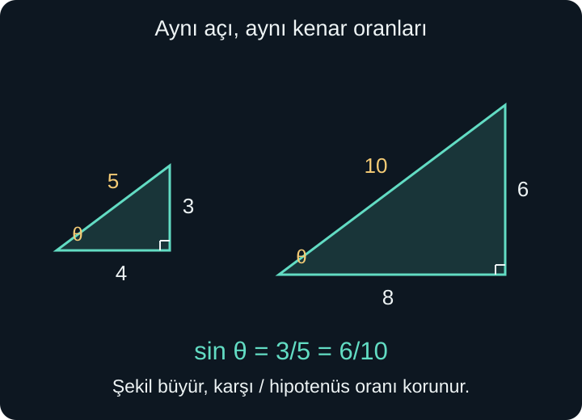
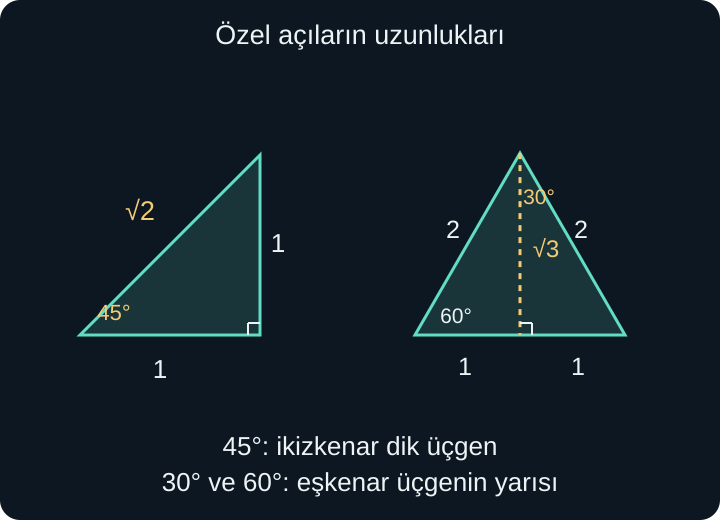

import ArticleVideo from '@/components/ArticleVideo.astro'
import kavram from './media/01-kavram.mp4?url'
import kavramPoster from './media/01-kavram.jpg?url'

Bir merdivenin alt ucu duvardan 4 metre uzakta, üst ucu yerden 3 metre yüksekte olsun. Duvarla zemin dik olduğundan bir dik üçgen oluşur. Merdivenin uzunluğu Pisagor'dan $\sqrt{4^2+3^2}=5$ metredir. Şimdi bütün uzunlukları iki katına çıkaralım: uzaklık 8, yükseklik 6, merdiven 10 metre olsun. Şekil büyür; merdivenin zeminle yaptığı açı değişmez.

İki durumda da yüksekliğin merdiven uzunluğuna oranı aynıdır: $3/5=6/10$. Yüksekliğin yatay uzaklığa oranı da $3/4=6/8$ olarak korunur. **Trigonometri**, bu oranlarla açı arasındaki bağı sistemli biçimde kullanmamızı sağlar.

[Önceki yazıda](/blog/ustel-fonksiyonlar-ve-logaritma/) bir kuralı ve ters sorusunu incelemiştik. Burada asıl geometrik ön bilgiler [benzerlik](/blog/eslik-benzerlik-ve-olcek/), dik üçgen, Pisagor ve oranlardır. İlk aşamada yalnızca dik üçgenin dar açılarıyla çalışacağız: açımız 0 dereceden büyük, 90 dereceden küçük olacak. Negatif veya daha büyük açıları birim çemberde ele alacağız.

## 1. Önce Hangi Açıyı Seçtiğimizi Söyleyelim

Merdivenle zemin arasındaki dar açıya $\theta$ diyelim. Bu Yunan harfi “teta” diye okunur ve burada açı ölçüsünü gösterir. Üç kenarı bu açıya göre adlandıracağız.

Dik açının karşısındaki kenar **hipotenüs**tür. Merdiven örneğinde 5 metrelik kenardır ve dik üçgenin en uzun kenarıdır. Hipotenüs, hangi dar açıyı seçersek seçelim değişmez; adı 90 derecelik açıyla belirlenir.

Seçtiğimiz $\theta$ açısının karşısında kalan dik kenar **karşı kenar**dır. Açıya değen ama hipotenüs olmayan dik kenar ise **komşu kenar**dır. Zeminle yapılan açıyı seçtiğimiz için karşı kenar 3 metrelik yükseklik, komşu kenar 4 metrelik yatay uzaklıktır.

Diğer dar açıyı, yani merdivenle duvar arasındaki açıyı seçersek karşı ve komşu kenarlar yer değiştirir. Bu kez karşı kenar 4, komşu kenar 3 metredir. Kenarların uzunluğu değişmedi; ilişkilendirdiğimiz açı değişti. Bu nedenle karşı veya komşu demeden önce açının çizimde işaretlenmesi gerekir.

## 2. Oran Neden Yalnızca Açıya Bağlı?

Aynı $\theta$ açısını içeren iki dik üçgen düşünelim. İkisinde de bir açı 90 derece, bir açı $\theta$ olduğuna göre kalan açı da aynı olmak zorundadır: $90^\circ-\theta$. İki açı eşitliği, üçgenlerin benzerliğini sağlar.

Benzer üçgenlerin karşılık gelen kenarları aynı katsayıyla büyür veya küçülür. Birinci üçgende karşı kenar $a$, komşu kenar $b$, hipotenüs $c$ olsun. İkinci üçgende bunlar pozitif bir $k$ katsayısıyla $ka$, $kb$, $kc$ olur. O zaman:

$$
\frac{ka}{kc}=\frac ac,\qquad
\frac{kb}{kc}=\frac bc,\qquad
\frac{ka}{kb}=\frac ab
$$

Ortak ölçek çarpanı sadeleşir. Böylece bu üç oran üçgenin büyüklüğünden bağımsız, seçilen açıya bağlı kalır. Bir açıya neden belirli bir oran atayabildiğimizin geometrik gerekçesi budur.

İki üçgenin yalnızca dik olması yetmez; seçilen dar açıları da eşit olmalıdır. Birinde 30 derece, diğerinde 60 dereceyi kullanarak aynı isimli kenar oranlarını karşılaştırırsak farklı sonuçlar bulabiliriz. Benzerlikteki açı eşleşmesi, trigonometrik oranın tanımının parçasıdır.

<ArticleVideo src={kavram} poster={kavramPoster} title="Benzer üçgenlerde aynı sinüs" caption="3-4-5 üçgeni büyütülerek 6-8-10 üçgenine dönüşür. Seçilen açı ve karşı kenarın hipotenüse oranı değişmez." />

## 3. Sinüs, Kosinüs ve Tanjant

Bu üç orana isim verelim. Seçilen dar açı $\theta$ için:

$$
\sin\theta=\frac{\text{karşı kenar}}{\text{hipotenüs}}
$$

$$
\cos\theta=\frac{\text{komşu kenar}}{\text{hipotenüs}}
$$

$$
\tan\theta=\frac{\text{karşı kenar}}{\text{komşu kenar}}
$$

$\sin$, **sinüs**; $\cos$, **kosinüs**; $\tan$, **tanjant** sözcüklerinin kısaltmalarıdır. $\sin\theta$ bir çarpım değildir; $\theta$ açısına karşılık gelen sinüs değerini gösterir. Fonksiyon gösterimindeki $f(x)$ gibi okunabilir, yalnızca parantezler geleneksel olarak her zaman yazılmaz.

3-4-5 üçgeninde, karşı kenarı 3 olan açı için:

$$
\sin\theta=\frac35,\qquad
\cos\theta=\frac45,\qquad
\tan\theta=\frac34
$$

olur. Üç uzunluğu da santimetreyle veya metreyle ölçebiliriz; aynı birime çevrildiklerinde oran değişmez. Uzunluk birimleri pay ve paydada birbirini götürür. Bu yüzden sinüs, kosinüs ve tanjant uzunluk değil, **birimsiz oranlardır**.

Dar açı için dik kenarlar hipotenüsten kısa ve pozitiftir. Dolayısıyla sinüs ile kosinüs 0 ile 1 arasındadır. Tanjant pozitiftir ama 1'den küçük olmak zorunda değildir. Karşı kenar komşudan uzunsa tanjant 1'den büyük çıkar.

## 4. Diğer Açıyı Seçince Ne Değişir?

Aynı üçgende diğer dar açıya $\varphi$, “fi”, diyelim. Dik üçgenin açıları toplamından $\varphi=90^\circ-\theta$ olur. $\theta$ için karşı olan kenar $\varphi$ için komşu, komşu olan da karşıdır.

Bu yüzden:

$$
\sin(90^\circ-\theta)=\cos\theta
$$

$$
\cos(90^\circ-\theta)=\sin\theta
$$

elde edilir. 3-4-5 örneğinde bir açının sinüsü 3/5 iken diğerinin kosinüsü de 3/5'tir. Bu eşitlik bir sözcük benzerliği değil, aynı kenarın iki farklı açıya göre aldığı addan kaynaklanır.

Tanjantlarda oran tersine döner: diğer açı için $4/3$ olur. Dar açılar bağlamında iki tanjantın çarpımı $(3/4)(4/3)=1$'dir. Burada pay ve payda sıfır değildir; çünkü gerçek bir dik üçgenin dik kenar uzunlukları pozitiftir.

## 5. Pisagor'dan Temel Bir Bağıntı

Karşı kenarı $a$, komşu kenarı $b$, hipotenüsü $c$ olarak adlandıralım. Pisagor $a^2+b^2=c^2$ verir. $c>0$ olduğu için iki tarafı $c^2$'ye bölebiliriz:

$$
\frac{a^2}{c^2}+\frac{b^2}{c^2}=1
$$

Kesirleri oranların karesi olarak okuyunca:

$$
\sin^2\theta+\cos^2\theta=1
$$

elde edilir. $\sin^2\theta$, $(\sin\theta)^2$ demektir; açının karesinin sinüsü değildir. Aynı kısaltma kosinüs için de kullanılır.

3-4-5 örneğinde $(3/5)^2+(4/5)^2=9/25+16/25=1$ olur. Bir oran bilindiğinde diğerini bulabiliriz. Örneğin dar açı için $\sin\theta=5/13$ verilirse:

$$
\cos^2\theta=1-\frac{25}{169}
=\frac{144}{169}
$$

Dar açıda kosinüs pozitif olduğundan $\cos\theta=12/13$ seçilir. İşaret seçiminin nedeni geometrik koşuldur. Daha geniş açı aralıklarında aynı kareli bağıntı tek başına işareti belirlemeye yetmeyecek.

İki oranın bölümünden tanjantı da elde ederiz:

$$
\frac{\sin\theta}{\cos\theta}
=\frac{a/c}{b/c}=\frac ab=\tan\theta
$$

Bölme için $\cos\theta\ne0$ gerekir. Dar açı aralığında kosinüs pozitiftir; dolayısıyla bu koşul sağlanır. Koşulu yazmak, daha sonra tanımı genişlettiğimizde hangi açılarda sorun çıkacağını izlememizi sağlar.

## 6. 45 Derecenin Oranlarını Kurmak

İki dik kenarı da 1 birim olan bir dik üçgen düşünelim. Kenarlar eşit olduğundan karşılarındaki dar açılar eşittir. Bu iki açı toplam 90 derece olduğuna göre her biri 45 derecedir. Hipotenüs Pisagor'dan $\sqrt{1^2+1^2}=\sqrt2$ olur.

45 derece için karşı ve komşu kenarlar aynı uzunluktadır:

$$
\sin45^\circ=\cos45^\circ=\frac1{\sqrt2}
=\frac{\sqrt2}{2}
$$

Son adımda payla paydayı $\sqrt2$ ile çarptık. Tanjant ise $1/1=1$ olur. Bu sonuç, 45 derecelik doğrultuda yatay ilerleme ile düşey yükselmenin eşit olduğunu anlatır.

Bir cetvelle yaklaşık açı çizip oranı ölçmek, sonucun neden tam $\sqrt2/2$ olduğunu göstermezdi. Eşlik, açı toplamı ve Pisagor birlikte kesin değeri verir. Yaklaşık ondalık değer gerektiğinde $\sqrt2/2\approx0{,}7071$ kullanabiliriz; ara hesaplarda köklü tam değeri korumak daha iyidir.

## 7. 30 ve 60 Derecelerin Oranları

Bir kenarı 2 birim olan eşkenar üçgen çizelim. Üç açısı da 60 derecedir. Bir köşeden karşı kenara dik yükseklik indirelim. Yüksekliğe $h$, tabanda oluşan parçalara $u$ ve $v$ diyelim. İki dik üçgende Pisagor $u^2+h^2=4$ ve $v^2+h^2=4$ verir. Buradan $u^2=v^2$ çıkar. Uzunluklar pozitif olduğundan $u=v$ olur. Ayrıca $u+v=2$ olduğundan iki parça da 1 birimdir.

Böylece iki küçük üçgenin üçer kenarı eşittir: ortak yükseklik, birer birimlik taban ve ikişer birimlik hipotenüs. Kenar-kenar-kenar eşliğiyle üçgenler eştir. Üstteki 60 derecelik açı iki eş açıya ayrıldığı için her parça 30 derece olur.

Yükseklik için Pisagor $h^2+1^2=2^2$ verir. Buradan $h^2=4-1=3$, uzunluk pozitif olduğundan $h=\sqrt3$ bulunur. Her küçük üçgende kenarlar 1, $\sqrt3$ ve 2'dir.

30 derecenin karşısında 1, komşusunda $\sqrt3$ bulunur. Dolayısıyla $\sin30^\circ=1/2$, $\cos30^\circ=\sqrt3/2$, $\tan30^\circ=1/\sqrt3=\sqrt3/3$ olur. 60 derece seçildiğinde karşı ve komşu yer değiştirir.

| Açı | Sinüs | Kosinüs | Tanjant |
| --- | --- | --- | --- |
| $30^\circ$ | $1/2$ | $\sqrt3/2$ | $\sqrt3/3$ |
| $45^\circ$ | $\sqrt2/2$ | $\sqrt2/2$ | $1$ |
| $60^\circ$ | $\sqrt3/2$ | $1/2$ | $\sqrt3$ |

Bu tablo, bağımsız ezberlenecek dokuz sayıdan oluşmuyor. İki geometrik şeklin kenar oranlarını kaydediyor. Hangi oranın neden büyüdüğünü düşünmek, karşı ve komşuyu karıştırdığımızda hatayı fark etmemizi sağlar.

## 8. Bilinen Açıyı Kullanarak Uzunluk Bulmak

Uzunluğu 10 metre olan bir merdiven yatay zeminle 30 derece yapsın. Duvarın zemine dik olduğunu, merdivenin düz ve duvara temas ettiğini kabul edelim. Üst ucun yüksekliğine $h$, duvara yatay uzaklığa $d$ diyelim.

Açıya göre karşı kenar $h$, hipotenüs 10 olduğundan $\sin30^\circ=h/10$ olur. $\sin30^\circ=1/2$ yazıp iki tarafı 10 ile çarparsak $h=5$ metre buluruz. Komşu kenar için $\cos30^\circ=d/10$, dolayısıyla $d=10(\sqrt3/2)=5\sqrt3$ metredir.

Bu iki sonucu Pisagor'la doğrulayabiliriz: $5^2+(5\sqrt3)^2=25+75=100=10^2$. Böylece trigonometrik hesapla elde ettiğimiz iki uzunluğun aynı üçgene ait olduğunu kontrol ederiz. Yaklaşık yatay uzaklık 8,660 metredir.

Açı ve komşu kenar bilinseydi tanjant daha doğrudan olurdu. Yatay uzaklık 12 metre ve yükselme açısı 30 derece ise $h/12=\tan30^\circ=\sqrt3/3$ olur. Buradan $h=4\sqrt3\approx6{,}928$ metre bulunur. Hipotenüsü ayrıca hesaplamak zorunda kalmadık; verilen ve aranan kenarları aynı oranda buluşturduk.

## 9. Bakış Açısı ile Toplam Yüksekliği Ayırmak

Düz zeminde bir gözlemci, bir direğin tabanından yatayda 12 metre uzakta dursun. Göz hizasından direğin tepesine bakış doğrusu yatayla 30 derece yapsın. Gözün yerden yüksekliği 1,6 metre olsun.

Tanjant hesabıyla bulunan $4\sqrt3$ metrelik yükseklik farkı, yerden tepeye kadar olan toplam uzunluk değildir. Dik üçgenin yatay kenarı göz hizasından geçtiği için bu sonuç **göz hizasından tepeye** olan yükselmeyi verir. Direğin toplam yüksekliği:

$$
H=1{,}6+4\sqrt3\approx8{,}528\text{ m}
$$

olur. Göz yüksekliğini eklemeyi unutmak, doğru oranı kullanarak yanlış fiziksel büyüklüğü hesaplamaktır. Zemin eğimli olsaydı veya yatay uzaklık yerine eğik yürüyüş mesafesi ölçülseydi model de değişirdi.

Benzer biçimde eğimli bir yolun üzerinde ölçtüğümüz mesafeyi, tanjantın komşu kenarı yerine doğrudan yazamayız. Tanjant yatay ilerlemeyle düşey değişimi karşılaştırır; yolun eğik uzunluğu hipotenüse karşılık gelir. “Uzaklık” sözcüğünün hangi parçayı anlattığını şekle yazmak çözümün başlangıcıdır.

## 10. Orandan Açıyı Bulmak

Dik üçgende karşı kenar 3, komşu kenar 4 birimse $\tan\theta=3/4=0{,}75$ olur. Bu kez açıyı değil oranı biliyoruz. Ters soru şudur: “Tanjantı 0,75 olan dar açı hangisidir?”

Özel açı tablosundan $\tan30^\circ\approx0{,}5774$ ve $\tan45^\circ=1$ biliyoruz. Dar açı büyüdükçe, sabit bir yatay uzaklıkta karşı yükseklik arttığından tanjant artar. Aradığımız açı 30 ile 45 derece arasında olmalıdır. Bir hesaplama aracıyla daha ayrıntılı aradığımızda yaklaşık 36,87 derece buluruz.

Hesap makinesinde bu geri arama genellikle $\tan^{-1}$ veya $\arctan$ tuşuyla yapılır. Buradaki işaret ters fonksiyonu anlatır; $1/\tan\theta$ anlamına gelmez. Şimdilik sonuç için dar açı aralığını seçtiğimizi belirtiyoruz. Ters trigonometrik fonksiyonların genel tanım aralıklarını daha sonra ayrıca inceleyeceğiz.

Açı birimi önemlidir. Bu yazıda derece kullanıyoruz; hesaplama aracı da derece modunda olmalıdır. Aynı sayıyı radyan modunda okumak başka bir açı verir. Bir sonraki yazı, bu ikinci açı ölçüsünün ne olduğunu kuracak.

## 11. Eğim ile Tanjantın Bağı

Koordinat düzleminde bir doğru sağa doğru 4 birim ilerlerken 3 birim yükseliyorsa eğimi $m=3/4$ olur. Eksenlerde eşit uzunluk ölçeği kullanıldığında, doğrunun pozitif yatay yönle yaptığı dar açı için tanjant da $3/4$'tür. Böylece pozitif eğimli doğru için $m=\tan\theta$ ilişkisini elde ederiz.

Yüzde 20 eğim, düşey değişimin yatay değişime oranının 0,20 olmasıdır. Bu **20 derece** demek değildir. Tanjantı 0,20 olan açı yaklaşık 11,31 derecedir. Yüzde ifadesi oranı yüz üzerinden yazarken derece ifadesi dönme miktarını ölçer.

Yatay eksenin zamanı, düşey eksenin litreyi gösterdiği bir grafikteki eğim ise litre/dakika taşır. Böyle bir grafikte ekranda görünen açıdan fiziksel bir yol açısı çıkaramayız. Trigonometrik açıyla geometrik eğimi eşleştirmek için eksenlerin aynı tür uzunluğu aynı ölçekle göstermesi gerekir.

## 12. Sonucu Geometriyle Kontrol Etmek

Bir dik üçgende sinüs için 1,4 bulursak dar açı modelinde hata vardır. Karşı dik kenar hipotenüsten uzun olamaz. Fakat tanjant için 1,4 bulunması mümkündür; karşı kenar komşudan büyük olabilir. Bütün trigonometrik oranlara aynı büyüklük kontrolünü uygulamayız.

Örneğin $\tan\theta=2$ verildiğinde karşı kenarı 2, komşuyu 1 seçen bir benzer üçgen kurabiliriz. Hipotenüs $\sqrt{2^2+1^2}=\sqrt5$ olur. Böylece $\sin\theta=2/\sqrt5$, $\cos\theta=1/\sqrt5$ elde edilir. Gerçek üçgenin boyutunu bilmeden oranları bulduk; çünkü seçtiğimiz 2 ve 1 yalnızca uygun bir ölçeği temsil eder.

Bu sonuçlar $4/5+1/5=1$ bağıntısını sağlar. Ayrıca sinüs ve kosinüs pozitif ve 1'den küçüktür. Geometri, cebir ve yaklaşık büyüklük kontrolü aynı sonuca farklı yönlerden destek verir. Her soruda önce dik açıyı, seçilen dar açıyı ve kenar adlarını belirlemek, formül seçimindeki hataların çoğunu önler.

## 13. Açıyı Sayıyla Bilmeden Oran Kullanmak

Düz zeminde dik duran 2 metrelik bir çubuğun gölgesi 3 metre olsun. Aynı yerde ve aynı anda dik duran başka bir cismin gölgesi 9 metre ölçülsün. Güneş ışınlarının bu küçük bölge boyunca paralel kabul edilebildiğini ve zeminin aynı yatay düzlemde bulunduğunu varsayıyoruz. Böylece iki gölge üçgeninde yükselme açısı aynıdır.

Çubuk için bu açının tanjantı $2/3$ olur. Diğer cismin yüksekliğine $H$ dersek aynı oran $H/9$ olarak yazılır. $H/9=2/3$ eşitliğini 9 ile çarparız: $H=9\times2/3=6$ metre bulunur. Açının kaç derece olduğunu hiç hesaplamadık. Ortak açı, oranların eşit olması için yeterliydi.

Bu, daha önce benzerlikle yaptığımız gölge hesabının trigonometrik dildeki karşılığıdır. Trigonometrik sembol eklemek her zaman daha çok hesap yapmak anlamına gelmez. Bazen aynı oranın iki farklı şekil içinde bulunduğunu tek isimle belirtmemize yardım eder. Sayısal açı ancak başka bir soruda gerçekten gerektiğinde aranır.

Koşullar değişirse sonucun gerekçesi de değişir. Bir cisim eğik duruyorsa dik üçgenin düşey kenarı onun bütün boyuyla aynı olmayabilir. Gölge eğimli bir yüzeye düşüyorsa ölçülen gölge parçası yatay komşu kenar değildir. İki ölçüm çok farklı zamanlarda alınırsa aynı açının kullanıldığı da varsayılamaz. Verilerden önce çizimdeki hangi açıların neden eşit olduğunu açıklamak gerekir.

Bu örnek trigonometrinin özündeki fikri yeniden görünür kılar: açı bir büyüklüğü tek başına belirlemez, fakat kenarların birbirine oranını belirler. En az bir uzunluk verildiğinde bu ortak oran, başka bir uzunluğu hesaplamamızı sağlar.

Dik üçgen oranlarıyla açıları uzunluklara, uzunluk oranlarını açılara bağladık. Sıradaki adımda bu tanımları dar açıların dışına taşıyacağız. Birim çember, sinüs ve kosinüsün neden negatif olabildiğini ve bir tam turdan sonra neden tekrarlandığını gösterecek.

## Kaynakça

Anlatım, örnekler ve görseller özgündür. Kaynak bölümleri 8 Ekim 2026 tarihinde kontrol edildi.

- [OpenStax — Precalculus 2e, 5.4: Right Triangle Trigonometry](https://openstax.org/books/precalculus-2e/pages/5-4-right-triangle-trigonometry): Açıya göre kenar seçimi, temel oranlar, özel açılar ve yükseklik uygulamalarının koşulları için.
- [OpenStax — Precalculus 2e, 5.2: Unit Circle: Sine and Cosine Functions](https://openstax.org/books/precalculus-2e/pages/5-2-unit-circle-sine-and-cosine-functions): Sinüs-kosinüs bağıntısının sonraki genişletmeyle tutarlılığını kontrol etmek için.
