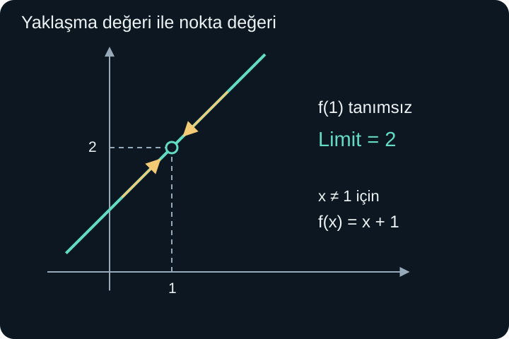
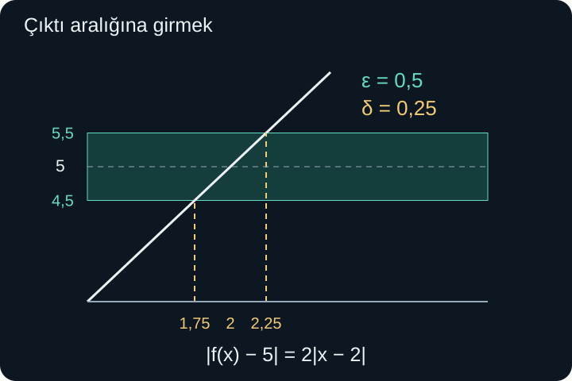

import ArticleVideo from '@/components/ArticleVideo.astro'
import kavram from './media/01-kavram.mp4?url'
import kavramPoster from './media/01-kavram.jpg?url'

Bir sayıya her adımda biraz daha yaklaşmak ne demektir? $1$, $1/2$, $1/3$, $1/4$ diye ilerleyen sayılar küçülür. Hiçbiri sıfır değildir; buna rağmen sıfıra istediğimiz kadar yaklaşabiliriz. Örneğin $1/1000$ binde birdir; daha küçük bir uzaklık istersek paydadaki sayıyı daha da büyütebiliriz.

Matematikte bu düşünceyi **limit** kavramıyla kesinleştiririz. Limit, yalnızca “çok yakın” demek değildir. İstenen yakınlık ne kadar sıkı olursa olsun, bunu hangi koşulla sağlayabildiğimizi ifade eder. Bazen yaklaşan değer, fonksiyonun o noktadaki değerinden farklıdır; bazen fonksiyon o noktada hiç tanımlı değildir.

[Önceki yazıda](/blog/determinant-ters-matris-ve-sistemler/) doğrusal dönüşümlerle çalıştık. Burada yeni konu için asıl gereken ön bilgiler [fonksiyonlar ve grafikler](/blog/fonksiyonlar-ve-grafikler/), mutlak değer, aralıklar, çarpanlara ayırma ve köklü ifadelerdir. Matris hesabı kullanmayacağız. Önce sıra numarasıyla ilerleyen dizilerden başlayacak, sonra bir fonksiyonun girdisini yaklaştıracağız.

## 1. Dizi: Her Sıra Numarasına Bir Değer

Bir **dizi**, sıra numaralarıyla belirtilen değerler topluluğudur. Burada sıra numaraları $n=1,2,3,\ldots$ pozitif tam sayıları olacak. Dizinin $n$'inci terimini $a_n$ ile gösteririz. Alt indis $n$, terimin yerini belirtir; üs değildir.

$$
a_n=\frac1n
$$

kuralı bütün terimleri belirler: $a_1=1$, $a_2=1/2$, $a_3=1/3$. Bu kurala **genel terim** denir. Bir dizi, tanım kümesi pozitif tam sayılar olan bir fonksiyon gibi düşünülebilir. $n=2{,}5$ diye bir ara terim, bu tanımda yoktur.

Bu yüzden dizinin grafiğini çizerken $(1,1),(2,1/2),(3,1/3)$ gibi ayrı noktalar çizeriz. Noktaları bir eğriyle birleştirmek görsel bir yardımcı olabilir, fakat diziye yeni ara girdiler eklemez. Bazı diziler 0'dan başlatılır; o durumda başlangıç indeksini ayrıca belirtmek gerekir.

İlk birkaç sayı bir diziyi tek başına kesin olarak tanımlamaz. $2,4,6$ gördüğümüzde sonraki terimin 8 olduğunu tahmin edebiliriz, ama farklı bir kural aynı ilk üç terimi verip sonra farklılaşabilir. Sonsuz bir davranış hakkında konuşmak için genel bir kural veya bütün adımları belirleyen bir ilişki gerekir.

### Önceki terimden sonraki terime

Bir diziyi **özyinelemeli** olarak da tanımlayabiliriz. Örneğin $b_1=3$ ve:

$$
b_{n+1}=\frac{b_n+2}{2}
$$

olsun. Sonraki terim, öncekiyle 2'nin aritmetik ortalamasıdır. Böylece $b_2=5/2$, $b_3=9/4$, $b_4=17/8$ elde edilir. Başlangıç terimini söylemeden yalnızca bu ilişkiyi vermek tek bir dizi belirlemez; farklı başlangıçlar farklı diziler üretir.

2'ye uzaklığı izlersek $b_{n+1}-2=(b_n-2)/2$ olur. Başlangıç uzaklığı 1'dir ve her adımda yarıya iner. Bu nedenle $b_n=2+1/2^{n-1}$ yazabiliriz. Genel terim, özyinelemeli işlemin tekrarlanan etkisini tek satırda gösterir.

## 2. Yakınsaklık: Sonunda Hep Yakın Kalmak

$a_n=1/n$ dizisi için:

$$
\lim_{n\to\infty}a_n=0
$$

yazarız. “$n$ sonsuza giderken $a_n$'nin limiti sıfırdır” diye okunur. Buradaki $n\to\infty$, dizide yeterince ileri gitmeyi anlatır; $n$'ye sonsuz adlı bir tam sayı koymak değildir.

Daha kesin düşünelim. Sıfıra uzaklığın $0{,}01$'den küçük olmasını istersek $1/n<0{,}01$ gerekir. Bu, $n>100$ demektir. 101'inci terimden itibaren bütün terimler istenen uzaklığın içinde kalır. $0{,}0001$ istersek $n>10000$ yeterlidir. İstenen sınır küçüldükçe daha ileri gitmek gerekebilir; fakat her pozitif sınır için bunu yapabiliriz.

Bu davranışa **yakınsaklık**, yaklaşılan gerçek sayıya limit deriz. Dizi için yalnızca ara sıra hedefin yakınına gelmek yeterli değildir; belli bir noktadan sonraki bütün terimler istenen yakınlıkta kalmalıdır.

$(-1)^n$ dizisi $-1,1,-1,1,\ldots$ diye salınır ve hiçbir tek gerçek sayıya yaklaşmaz. Buna karşılık $(-1)^n/n$ işaret değiştirse de mutlak değeri $1/n$ olduğu için sıfıra yaklaşır. Yakınsak olmak, mutlaka tek yönde ilerlemek veya hedefin hep aynı tarafında durmak demek değildir.

Sabit dizi $a_n=5$ de 5'e yakınsar. Limit, “hiçbir zaman ulaşılmayan sayı” diye tanımlanamaz. Terimler hedefe baştan beri eşit olabilir, bazen eşit olabilir veya hiç eşit olmayabilir. Belirleyici olan, sonraki bütün terimlerin her istenen yakınlık koşulunu sağlamasıdır.

## 3. Bir Fonksiyonun Girdisini Yaklaştırmak

Dizide indeks büyüyordu. Fonksiyon limitinde ise $x$ girdisi belirli bir $a$ sayısına yaklaşabilir. Bu kez $x$ tam sayılarla sınırlı değildir; fonksiyonun tanım kümesindeki gerçek değerleri alabilir.

Şu fonksiyonu ele alalım:

$$
f(x)=\frac{x^2-1}{x-1},\qquad x\ne1.
$$

$x=1$ için payda sıfırdır; fonksiyon tanımlı değildir. Fakat yakındaki girdiler için hesap yapabiliriz. Payı $(x-1)(x+1)$ biçiminde ayırıp $x\ne1$ koşulunda sadeleştirince $f(x)=x+1$ elde edilir.

| $x$ | $f(x)$ |
| --- | --- |
| $0{,}9$ | $1{,}9$ |
| $0{,}99$ | $1{,}99$ |
| $1{,}01$ | $2{,}01$ |
| $1{,}1$ | $2{,}1$ |

Her iki taraftan $x$ değerlerini 1'e yaklaştırdığımızda çıktılar 2'ye yaklaşır:

$$
\lim_{x\to1}\frac{x^2-1}{x-1}=2.
$$

Bu eşitlik $f(1)=2$ demek değildir. Sol taraf, 1'in yakınındaki davranışı sorar. $f(1)$ ise doğrudan 1 girdisinin çıktısını sorar; başlangıç fonksiyonunda böyle bir çıktı yoktur.

<ArticleVideo src={kavram} poster={kavramPoster} title="Bir deliğe iki yandan yaklaşmak" caption="(x² − 1)/(x − 1) fonksiyonunda x = 1 tanımsızdır. Yakındaki girdiler iki yandan 1’e yaklaşırken çıktılar 2’ye yaklaşır." />

Grafiğin yalnızca bir noktasını doldurup oraya 8 değeri atasaydık da limit 2 kalırdı. Çünkü limit hesabı hedef noktanın kendisini dışarıda bırakarak çevredeki davranışı inceler. Ancak bu değişiklik süreklilik sorusunun cevabını değiştirecek.

## 4. Soldan ve Sağdan Yaklaşma

Bir noktaya sayı doğrusunun iki yönünden yaklaşabiliriz. $x\to a^-$ soldan, $x\to a^+$ sağdan yaklaşmayı belirtir. Üstteki eksi ve artı işaretleri burada $a$'nın negatif veya pozitif olduğunu söylemez; yaklaşmanın yönünü gösterir.

Örneğin:

$$
g(x)=\begin{cases}0,&x<0,\\1,&x\ge0\end{cases}
$$

fonksiyonu için soldan limit 0, sağdan limit 1'dir. Tek bir iki taraflı limit yoktur. $g(0)=1$ olması bunu düzeltmez; soldaki değerlerin davranışı hâlâ farklıdır.

Bir iç noktada iki taraflı sonlu limitin var olması için sol ve sağ limitler aynı sonlu sayıya eşit olmalıdır. Önce iki tarafı ayrı düşünmek, özellikle parçalı fonksiyonlarda ve paydası işaret değiştiren ifadelerde yararlıdır.

Tanım kümesinin sınırında ise yaklaşılabilen tarafı açıkça söyleriz. $\sqrt{x}$ gerçek sayılarda yalnızca $x\ge0$ için tanımlıdır. Bu yüzden sıfırda sağdan yaklaşmayı inceleyebiliriz; olmayan negatif girdilerden yaklaşma beklemeyiz. Bu yazıdaki iki taraflı örneklerde hedefin iki yanında da tanım kümesinden noktalar vardır.

## 5. Limit Kuralları ve Koşulları

$x\to a$ iken $f(x)\to L$ ve $g(x)\to M$ olsun; $L$ ve $M$ sonlu gerçek sayılardır. Bu durumda toplamın limiti $L+M$, farkınki $L-M$, çarpımınki $LM$ olur. Sabit bir katsayı limitin dışına çıkarılabilir.

Bölüm için ek koşul gerekir:

$$
\lim_{x\to a}\frac{f(x)}{g(x)}=\frac LM,
\qquad M\ne0.
$$

Payda limitinin sıfır olmaması, hedefe yeterince yakın girdilerde paydanın da sıfırdan uzak tutulabilmesini sağlar. Bu koşulu atlayarak 0'a bölme yapamayız.

Toplama kuralının sezgisel gerekçesi hata paylarını birleştirmektir. $f(x)$ ile $L$ arasındaki fark küçük, $g(x)$ ile $M$ arasındaki fark da küçükse toplamın hedefinden uzaklığı en fazla bu iki farkın mutlak değerlerinin toplamı kadardır. Her bir hatayı istenen toplam hatanın yarısından küçük tutmak yeterlidir.

Polinomların limitini bulurken girdiyi doğrudan yerine koyabiliriz; sabit, $x$ ve bunların sonlu sayıdaki toplam ve çarpımlarından oluşurlar. Örneğin:

$$
\lim_{x\to2}(3x^2-x+1)=12-2+1=11.
$$

Rasyonel fonksiyonlarda paydanın hedef noktadaki değeri sıfır değilse aynı yöntem çalışır. $\lim_{x\to2}(x+3)/(x+1)=5/3$ olur. Payda sıfırsa önce ifadenin davranışını araştırmak gerekir; doğrudan yerleştirme henüz sonuç vermez.

## 6. Sıfır Bölü Sıfır Bir Cevap Değildir

İlk rasyonel örnekte $x=1$ yazmayı denediğimizde pay da payda da 0 oldu. **$0/0$ bir sayı değildir**; bu limit hesabında bir **belirsiz biçim** olarak adlandırılır. Pay ile paydanın hangi hızla küçüldüğünü bilmeden sonucu çıkaramayız.

Bunu üç kısa örnekle görelim. $x\ne0$ için $x/x=1$ olduğundan $x\to0$ limiti 1'dir. $x^2/x=x$ olduğundan ikinci ifadenin limiti 0'dır. $|x|/x$ ise pozitif tarafta 1, negatif tarafta $-1$ olur; iki taraflı limit yoktur. Üçüne de doğrudan sıfır koymaya çalışınca aynı $0/0$ görünümü çıkar, fakat sonuçları farklıdır.

Dolayısıyla “pay ve payda sıfır, cevap 1” veya “cevap 0” diye bir kural yoktur. Çarpanlara ayırmak, ortak çarpanı sadeleştirmek veya eşlenikle çarpmak, yakın çevredeki gerçek ilişkiyi görünür kılabilir.

Örneğin:

$$
\lim_{x\to3}\frac{x^2-9}{x-3}
$$

için pay $(x-3)(x+3)$ olur. $x\ne3$ koşulunda ifade $x+3$'e eşittir; limit 6'dır. $x=3$'te sadeleştirme yapmadık. Limitin baktığı delikli çevrede eşit olan daha kolay bir ifadeye geçtik.

### Eşlenik neden işe yarar?

Şimdi:

$$
\lim_{x\to0}\frac{\sqrt{x+4}-2}{x}
$$

ifadesini ele alalım. Gerçek sayılar için $x\ge-4$ gerekir; ayrıca $x\ne0$'dır. Payın eşleniği $\sqrt{x+4}+2$ ile pay ve paydayı çarparsak, iki kare farkı sayesinde:

$$
\frac{\sqrt{x+4}-2}{x}
=\frac{x+4-4}{x(\sqrt{x+4}+2)}.
$$

Yakındaki sıfırdan farklı $x$ değerlerinde ortak $x$ sadeleşir:

$$
\frac1{\sqrt{x+4}+2}\longrightarrow\frac14.
$$

Burada kullandığımız eşlenik hedefin yakınında sıfır değildir; aslında gerçek tanım kümesinde en az 2'dir. Geçersiz bir bölmeyle yeni değer uydurmadık. Başlangıç ifadesinin tanımsız noktası dururken yakın davranışı hesapladık.

## 7. Sonsuz Limit ile Sonsuzda Limit Farklıdır

$1/x^2$ fonksiyonunda $x$ sıfıra her iki yandan yaklaşırken değerler pozitif ve sınırsız büyür. Bunu:

$$
\lim_{x\to0}\frac1{x^2}=+\infty
$$

biçiminde yazarız. Bu, sonlu gerçek bir limitin bulunduğunu söylemez. Ne kadar büyük bir sınır seçersek seçelim, $x$'i sıfıra yeterince yaklaştırarak bütün yakın değerlerin o sınırı aşmasını sağlayabileceğimizi anlatır.

$1/x$ için ise sağdan değerler $+\infty$ yönünde, soldan $-\infty$ yönünde büyür. Tek bir iki taraflı sonsuz yön bile yoktur. Fonksiyonun yalnızca sağ tarafını görmek, bütün davranışı belirlemez.

**Sonsuzda limit** başka bir sorudur: $x$ girdisi büyürken çıktı neye yaklaşır? Örneğin $1/x$ için $x\to+\infty$ iken sonuç 0'a yaklaşır. İlk durumda girdi 0'a, çıktı sınırsızlığa gidiyordu; ikinci durumda girdi sınırsız büyürken çıktı sonlu bir değere yaklaşır.

Şu rasyonel örnekte pay ve paydayı $x^2$ ile bölelim:

$$
\frac{3x^2-1}{x^2+2}
=\frac{3-1/x^2}{1+2/x^2}.
$$

$x\to+\infty$ iken $1/x^2\to0$ olduğundan limit 3 olur. Burada “sonsuzu sonsuza böldük” demedik; gerçek, büyük $x$ değerleri için eşit olan bir ifadeye geçip küçük terimlerin limitini kullandık.

Fonksiyon bir girdiye yaklaşırken sınırsız büyüyorsa ilgili düşey doğruya **düşey asimptot** denebilir. Sonsuzda sonlu $L$ değerine yaklaşıyorsa $y=L$ yatay bir asimptottur. Yatay asimptot, grafiğin o doğruyu hiçbir yerde kesemeyeceği anlamına gelmez; uzaklardaki davranışı anlatır.

## 8. Yakınlığı Kesin Söylemek: Epsilon ve Delta

“$x$ yeterince yakınsa $f(x)$ de yakındır” cümlesindeki iki yakınlığı ayrı adlandıralım. Çıktıda izin verdiğimiz pozitif hata payına $\varepsilon$ (**epsilon**), girdide seçeceğimiz pozitif yakınlık sınırına $\delta$ (**delta**) diyelim.

$\lim_{x\to a}f(x)=L$ demek şudur: her $\varepsilon>0$ için, öyle bir $\delta>0$ seçebiliriz ki tanım kümesindeki bütün girdiler için:

$$
0<|x-a|<\delta
\quad\Longrightarrow\quad
|f(x)-L|<\varepsilon.
$$

Mutlak değerler uzaklıktır. Soldaki ilk 0, $x=a$ noktasını dışarıda bırakır. Bu yüzden fonksiyonun o noktada tanımsız olması limite tek başına engel değildir. Hedef noktaya tanım kümesinden farklı noktalarla yaklaşılabildiğini varsayıyoruz.

Tanımın sırası önemlidir: önce istenen çıktı hassasiyeti verilir; sonra ona yetecek girdi aralığını buluruz. Tek bir epsilon için çalışması yetmez. Ancak aynı delta bütün epsilonlar için sabit kalmak zorunda da değildir.

### Tam Bir Örnek: İki Katının Bir Fazlası

$x$ 2'ye yaklaşırken çıktının 5'e yaklaştığını gösterelim. Çıktı hatasını hesaplayalım:

$$
|f(x)-5|=|2x+1-5|=|2(x-2)|=2|x-2|.
$$

Çıktı hatası girdi uzaklığının iki katıdır. O hâlde istenen her $\varepsilon>0$ için $\delta=\varepsilon/2$ seçersek:

$$
0<|x-2|<\delta
\quad\Rightarrow\quad
|f(x)-5|<2\delta=\varepsilon.
$$

Örneğin çıktı hatası $0{,}5$'ten küçük olsun istersek girdi uzaklığını $0{,}25$'ten küçük tutmak yeterlidir. $x$ değerini $(1{,}75,2{,}25)$ içinde tuttuğumuzda çıktı $(4{,}5,5{,}5)$ içinde kalır. Daha sıkı $0{,}02$ çıktı hatası istenirse $0{,}01$ girdi uzaklığı seçebiliriz.

Dizide aynı fikir delta yerine bir sıra eşiğiyle ifade edilir. $a_n\to L$ demek, her pozitif epsilon için yeterince büyük bir $N$ bulunup $n\ge N$ olan bütün terimlerde $|a_n-L|<\varepsilon$ olmasıdır. $a_n=1/n$ için $N>1/\varepsilon$ seçmek yeterlidir. Böylece başlangıçta sezgisel söylediğimiz yaklaşmayı kesin bir koşula bağlamış oluruz.

## 9. Süreklilik: Yakın Davranış ve Nokta Değeri Buluşursa

Bir fonksiyonun $a$ noktasında **sürekli** olması için üç şey birlikte gerekir: $f(a)$ tanımlı olmalı, $x\to a$ limiti bulunmalı ve bu limit $f(a)$'ya eşit olmalıdır. İç noktalarda bunu:

$$
\lim_{x\to a}f(x)=f(a)
$$

eşitliğiyle özetleriz. Tanım kümesinin uç noktalarında uygun tek taraflı yaklaşmayı kullanırız.

Başlangıçtaki $(x^2-1)/(x-1)$ fonksiyonunun 1'de limiti 2'ydi ama fonksiyon değeri yoktu. $f(1)=2$ diye tamamlayarak deliği doldurursak sürekli bir fonksiyon elde ederiz. $f(1)=8$ diye doldurursak fonksiyon tanımlanır ama sürekli olmaz. Sadece noktayı tanımlamak yetmez; doğru yakındaki değeri vermeliyiz.

Solda 0, sağda 1 olan sıçrama örneğinde ise tek bir nokta değerini değiştirerek süreklilik kuramayız. İki tarafın limitleri farklıdır. Böylece giderilebilir bir delik ile giderilemeyen sıçramayı ayırırız.

“Kalemi kaldırmadan çizmek” sürekliliği hatırlatabilen bir resimdir, fakat tanımın yerini tutmaz. Grafik farklı aralıklarda tanımlı olabilir, ölçekte görünmeyen kopukluklar bulunabilir. Kesin ölçüt fonksiyon değeri ile limitin ilişkisi olmalıdır.

## 10. Bir Tablo Ne Kadarını Kanıtlar?

Yakın girdiler seçip değerleri hesaplamak tahmin geliştirmemize yardım eder. Fakat sonlu sayıdaki ölçüm, bütün yeterince yakın girdilerin davranışını kanıtlamaz. Seçtiğimiz noktaların arasında farklı davranışlar bulunabilir. Limit kanıtında cebirsel eşitlikler, limit kuralları veya uzaklık denetimleri bu boşluğu kapatır.

Örneğin $x\ne0$ için $|x\sin(1/x)|\le|x|$ olur; çünkü sinüsün mutlak değeri en fazla 1'dir. İçerideki $1/x$ açısı hızla değişse bile bütün çıktıların büyüklüğü sıfıra yaklaşan $|x|$ ile sınırlandırılmıştır. Bu nedenle limit 0'dır. Bu tür düşünceye **sıkıştırma** denir: değerler aynı limite yaklaşan alt ve üst sınırlar arasında tutulur.

Burada limitin varlığını sadece birkaç dalga tepesine bakarak söylemedik; bütün yakındaki girdiler için çalışan bir sınır bulduk. Bu, yaklaşmanın bir hareket benzetmesinden çıkarak kesin bir matematiksel araca dönüşmesidir.

Sonraki yazıda iki yakın girdi arasındaki değişim oranını hesaplayacağız. Girdiler birbirine yaklaşırken bu oran tek bir sonlu değere yaklaşıyorsa, fonksiyonun o noktadaki anlık değişimini tanımlayabileceğiz. Böylece limit, türevin temelini oluşturacak.

## Kaynakça

Aşağıdaki açık ders kitabı sayfaları 8 Ekim 2026 tarihinde doğrudan kontrol edilmiştir. Özgün örneklerin tanımları ve işlem koşulları bu kaynaklarla karşılaştırılmıştır.

- [OpenStax, Calculus Volume 2 — Sequences](https://openstax.org/books/calculus-volume-2/pages/5-1-sequences): İndeks, genel terim, özyineleme ve dizi yakınsaklığı.
- [OpenStax, Calculus Volume 1 — The Limit of a Function](https://openstax.org/books/calculus-volume-1/pages/2-2-the-limit-of-a-function): Nokta değeri, tek taraflı yaklaşma ve limit ayrımı.
- [OpenStax, Calculus Volume 1 — The Limit Laws](https://openstax.org/books/calculus-volume-1/pages/2-3-the-limit-laws): Limit cebiri, bölüm koşulu ve sıkıştırma.
- [OpenStax, Calculus Volume 1 — The Precise Definition of a Limit](https://openstax.org/books/calculus-volume-1/pages/2-5-the-precise-definition-of-a-limit): Epsilon-delta tanımının nicelik sırası.
- [OpenStax, Calculus Volume 1 — Continuity](https://openstax.org/books/calculus-volume-1/pages/2-4-continuity): Noktada süreklilik ve süreksizlik türleri.
- [OpenStax, Calculus Volume 1 — Limits at Infinity and Asymptotes](https://openstax.org/books/calculus-volume-1/pages/4-6-limits-at-infinity-and-asymptotes): Sonsuzda yaklaşma ve asimptotların anlamı.
