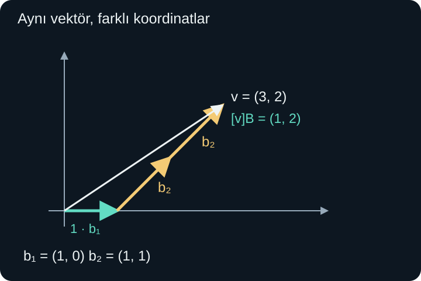
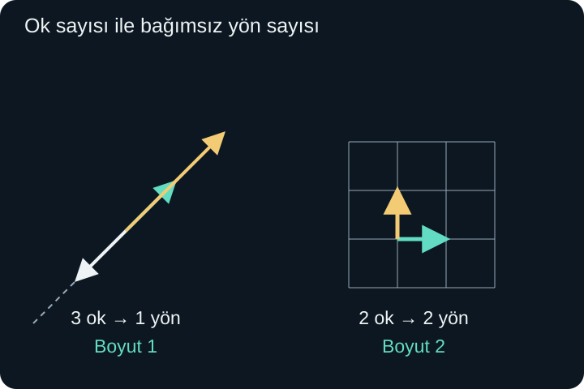

import ArticleVideo from '@/components/ArticleVideo.astro'
import kavram from './media/01-kavram.mp4?url'
import kavramPoster from './media/01-kavram.jpg?url'

Bir robotun hareketini iki komutla tarif edelim. Birinci komut onu 1 birim sağa götürüyor. İkinci komut 1 birim sağa ve 1 birim yukarı götürüyor. Her komutu istediğimiz gerçek sayı kadar kullanabildiğimizi varsayalım: yarım komut yarım hareket, negatif katsayı ters hareket anlamına gelsin.

Robotu başlangıçtan 3 birim sağa ve 2 birim yukarı götürmek için ikinci komutu iki kez, birinciyi bir kez kullanabiliriz. Peki her hedefe ulaşabilir miyiz? Aynı hedefe iki farklı katsayı çiftiyle varmak mümkün mü? Komutlardan biri diğerinin tekrarıysa ne kaybederiz?

Bu sorular, **doğrusal birleşim**, **germe**, **bağımsızlık**, **baz** ve **boyut** kavramlarını birlikte kurar. [Önceki yazıdaki](/blog/skaler-carpim-aci-ve-izdusum/) vektör bilgimizi kullanacağız; özellikle bileşenlerle toplama, sayıyla çarpma ve iki bilinmeyenli denklem çözme yeterlidir. Bu yazıda henüz matrislere ihtiyaç yok.

## 1. Doğrusal Birleşim: Ölçekle ve Topla

Başlangıçtaki iki hareketi $\mathbf b_1=(1,0)$ ve $\mathbf b_2=(1,1)$ olarak yazalım. Hedef vektör $\mathbf v=(3,2)$ olsun. Verdiğimiz çözüm:

$$
\mathbf v=1\mathbf b_1+2\mathbf b_2
=(1,0)+(2,2)=(3,2)
$$

biçimindedir. Birkaç vektörü sayılarla çarpıp topladığımız böyle bir ifadeye **doğrusal birleşim** denir. Çarpan olan sayılara katsayı deriz. İki vektör için genel biçim $s\mathbf b_1+t\mathbf b_2$'dir; $s$ ile $t$ herhangi bir gerçek sayı olabilir.

“Doğrusal” sözcüğü, sonucun mutlaka bir doğru üzerinde bulunduğunu söylemez. Yapılan işlemlerin yalnızca vektör toplamı ve skalerle çarpma olduğunu belirtir. İki bağımsız yön kullanıldığında düzlemin her yerine ulaşabiliriz; bunu hesapla göstereceğiz.

Katsayılar negatif olabilir. Örneğin $-2\mathbf b_1+3\mathbf b_2=(-2,0)+(3,3)=(1,3)$ olur. Birinci komutu ters yönde iki kez kullanmak, ikincinin gereğinden fazla sağa götüren kısmını dengeler. Katsayıları yalnızca pozitif seçseydik farklı ve daha dar bir erişim kümesi elde ederdik. Doğrusal birleşim tanımında böyle bir pozitiflik kısıtı yoktur.

## 2. Germe: Bütün Katsayıları Düşünmek

Tek bir birleşim tek bir sonuç verir. Katsayıları bütün gerçek sayılar arasında değiştirdiğimizde oluşabilen **bütün sonuçların kümesine**, verilen vektörlerin **gerdiği küme** denir. İngilizce “span” sözcüğü de aynı kavram için kullanılır.

Örneğin yalnızca $\mathbf u=(2,1)$ vektörünü kullanalım. $t\mathbf u=(2t,t)$ biçimindeki bütün vektörleri oluşturabiliriz. $t=0$ başlangıcı, $t=1$ okun ucunu, $t=-1$ ters yöndeki ucu, $t=1/2$ aradaki bir noktayı verir. Sonuçlar orijinden geçen tek bir doğru üzerindedir.

Bunu $\operatorname{span}\{\mathbf u\}$ diye yazarız. Küme parantezinin içindeki vektörler malzememiz, “span” işleminin sonucu bunlarla üretilebilen bütün vektörlerdir. Bu gösterim, yalnızca listedeki okun kendisini değil bütün skaler katlarını kapsar.

İki vektörde:

$$
\operatorname{span}\{\mathbf u,\mathbf v\}
=\{s\mathbf u+t\mathbf v:s,t\in\mathbb R\}
$$

yazarız. İki nokta üst üste, burada “öyle ki” diye okunur. Sağ taraf, $s$ ve $t$ gerçek sayılar olmak üzere bu biçimde yazılabilen bütün vektörleri toplar. $\mathbb R$ gerçek sayılar kümesidir.

### Her hedefe ulaşabildiğimizi göstermek

$\mathbf b_1=(1,0)$ ve $\mathbf b_2=(1,1)$ için birleşim:

$$
s\mathbf b_1+t\mathbf b_2=(s+t,t)
$$

olur. Herhangi bir hedef $(x,y)$ verilsin. Eşit bileşenler şartı $s+t=x$ ve $t=y$ denklemlerini verir. İkinciyi birincide kullanınca $s=x-y$ buluruz. Yani her gerçek $x,y$ için bir çözüm vardır:

$$
(x,y)=(x-y)(1,0)+y(1,1).
$$

Bu hesap iki okun bütün düzlemi gerdiğini kanıtlar. Yalnızca birkaç hedef seçerek görsel deneme yapmak yerine, hedefin koordinatlarını harflerle bıraktık ve her hedef için işe yarayan katsayıları kurduk.

<ArticleVideo src={kavram} poster={kavramPoster} title="İki bağımsız yönle düzlemi kurmak" caption="(1, 0) ve (1, 1) yönleri, (3, 2) vektörünü 1 ve 2 katsayılarıyla oluşturur. Aynı doğru üzerindeki iki yön ise düzlemin dışına açılamaz." />

## 3. Daha Fazla Ok Her Zaman Yeni Yön Değildir

$\mathbf u=(1,1)$ ve $\mathbf v=(2,2)$ olsun. İkinci vektör birincinin iki katıdır. Birleşimlerini açalım:

$$
s\mathbf u+t\mathbf v
=s(1,1)+2t(1,1)=(s+2t)(1,1).
$$

Bütün sonuçlar yine $(1,1)$ yönündeki tek doğru üzerinde kalır. İki ok çizdik ama ikinci bağımsız hareket yönü kazanmadık. $(1,0)$ hedefine ulaşamayız; ürettiğimiz her vektörün iki bileşeni eşittir.

Aynı doğru üzerine yüz tane farklı uzunlukta ok eklemek de bunu değiştirmez. Vektörlerin sayısı, erişebildiğimiz yön sayısı değildir. Bu fark, boyut kavramının merkezindedir.

İkinci okun yönü ters olsa da durum aynıdır. $(1,1)$ ile $(-3,-3)$ farklı ok uçlarına sahip olabilir, fakat negatif katsayılara zaten izin verdiğimiz için aynı doğruyu üretirler. “Bağımsız yön” derken sadece ok uçlarının birbirinden farklı olmasını kastetmiyoruz.

## 4. Doğrusal Bağımlılığı Tanımlamak

Bir vektör diğerlerinin doğrusal birleşimiyle yazılabiliyorsa listede gereksiz tekrar bilgisi vardır. Bunu sistemli bir tanıma dönüştürmek için **sıfır vektörünü üretme** sorusunu kullanırız.

İki vektör için:

$$
s\mathbf u+t\mathbf v=\mathbf0
$$

eşitliğine bakalım. $s=t=0$ her zaman çözümdür. Eğer sıfır vektörünü üretmek için en az biri sıfır olmayan başka katsayılar bulunabiliyorsa vektörler **doğrusal bağımlıdır**. Yalnızca bütün katsayıların sıfır olduğu çözüm varsa **doğrusal bağımsızdır**.

Örneğin $(1,1)$ ve $(2,2)$ için $2\mathbf u-\mathbf v=\mathbf0$ olur. Katsayılar 2 ve $-1$'dir; ikisi de sıfır değildir. Böylece bağımlılık kesinleşir. İlişkiyi $\mathbf v=2\mathbf u$ diye yeniden yazmak, ikinci vektörün yeni bilgi katmadığını gösterir.

Başlangıçtaki $(1,0)$ ve $(1,1)$ için sıfır birleşimi $(s+t,t)=(0,0)$ olur. İkinci bileşenden $t=0$, birinciden $s=0$ çıkar. Başka çözüm yoktur; bu iki vektör bağımsızdır.

Sıfır vektörü içeren her liste bağımlıdır. Sıfır vektörünün katsayısını 1, diğerlerini 0 seçersek sonuç sıfır olur; ama bütün katsayılar sıfır değildir. Tek bir sıfırdan farklı vektör ise bağımsızdır: $t\mathbf u=\mathbf0$ eşitliği ancak $t=0$ ile sağlanır.

### Üç vektörde ne değişir?

$\mathbf u=(1,0)$, $\mathbf v=(0,1)$ ve $\mathbf w=(2,3)$ vektörlerini alalım. $\mathbf w=2\mathbf u+3\mathbf v$ olduğundan $2\mathbf u+3\mathbf v-\mathbf w=\mathbf0$ bulunur. Üçü birlikte bağımlıdır. Fakat bu, listenin hiçbir işe yaramadığı anlamına gelmez; hâlâ bütün düzlemi gererler. Yalnızca gereğinden fazla yön bilgisi taşırlar.

## 5. Baz: Yeterli ve Tekrarsız Yönler

Bir vektör kümesini hem geren hem de doğrusal bağımsız olan vektör listesine o kümenin **bazı** denir. İki koşul birlikte gerekir. Germe, hiçbir hedefin dışarıda kalmamasını sağlar. Bağımsızlık, aynı işi yapan gereksiz vektör bulunmamasını sağlar.

Düzlemin alışılmış bazı $\mathbf e_1=(1,0)$ ve $\mathbf e_2=(0,1)$'dir. Buna **standart baz** deriz. $(x,y)=x\mathbf e_1+y\mathbf e_2$ olduğundan her vektörü üretir; sıfır birleşiminde de katsayılar ancak sıfır olabilir.

$\mathbf b_1=(1,0)$ ve $\mathbf b_2=(1,1)$ de düzlem için bir bazdır. Eksenlere dik olmak veya uzunluğu 1 olmak baz tanımının koşulu değildir. Bu iki yön birbirine dik değildir; ikinci vektörün normu $\sqrt2$'dir. Yine de bütün düzlemi tek anlamlı biçimde tarif ederler.

Sadece $(1,0)$ vektörü bağımsızdır ama düzlemi germez; dolayısıyla düzlemin bazı değildir. Buna karşılık $(1,0),(0,1),(2,3)$ listesi düzlemi gerer ama bağımlıdır; o da baz değildir. “Yeterli” ile “tekrarsız” koşullarının ikisini birden istememizin nedeni bu iki örnekte görülebilir.

## 6. Koordinatlar Seçilen Baza Göredir

Bir baz seçildikten sonra bir vektörü oluşturmakta kullanılan katsayılar, vektörün o bazdaki **koordinatlarıdır**. Baz sırasını $B=(\mathbf b_1,\mathbf b_2)$ diye belirtelim. Köşeli parantezle:

$$
[\mathbf v]_B=(1,2)
$$

yazdığımızda, $\mathbf v=1\mathbf b_1+2\mathbf b_2$ demiş oluruz. Bizim bazımızda bu vektörün standart koordinatları $(3,2)$'dir. Ortada iki farklı vektör yok; aynı vektörün iki farklı tarif dili vardır.

Sıralama da önemlidir. Bazı $(\mathbf b_2,\mathbf b_1)$ sırasıyla yazarsak aynı vektörün koordinatları $(2,1)$ olur. Her katsayının hangi baz vektörünü çarptığını bilmeliyiz. Sayı listesini baz bilgisi olmadan sunmak, özellikle alışılmış eksenlerden ayrıldığımızda belirsizlik oluşturur.

Başka bir hedefi çözelim: $\mathbf w=(-2,3)$. $s(1,0)+t(1,1)=(-2,3)$ için $t=3$, $s+t=-2$ ve dolayısıyla $s=-5$ olur. O hâlde $[\mathbf w]_B=(-5,3)$'tür. Kontrol: $-5(1,0)+3(1,1)=(-5,0)+(3,3)=(-2,3)$.

Normu hesaplarken hangi koordinatları kullandığımızı unutmayız. Standart dik birim eksenlerde $\|\mathbf w\|=\sqrt{(-2)^2+3^2}=\sqrt{13}$ olur. Eğik bazdaki katsayılara doğrudan $\sqrt{(-5)^2+3^2}$ uygulamak yanlış sonuç verir. Pisagor formülü, kullanılan yönlerin dik ve birim olması varsayımına dayanır.

### Dik bazın sağladığı kolaylık

Baz vektörlerinin birbirine dik ve birim uzunlukta olması zorunlu değildi. Bununla birlikte böyle bir seçim hesapları kolaylaştırır. Bu tür baza **ortonormal baz** denir: “orto” dikliği, “normal” burada birim uzunluğu belirtir. Standart eksen vektörleri bunun en tanıdık örneğidir.

Örneğin $\mathbf v=a\mathbf e_1+b\mathbf e_2$ ifadesinin $\mathbf e_1$ ile skaler çarpımını alalım. Birinci baz vektörünün kendisiyle çarpımı 1, diğerine dik olduğu için ikinci çarpım 0 olur. Sonuç $a$'dır. Benzer biçimde $\mathbf v\cdot\mathbf e_2=b$ elde edilir. Yani bu özel bazda koordinatlar, doğrudan işaretli dik izdüşümlerdir.

Eğik bazımızda aynı kestirme çalışmaz. $(3,2)\cdot(1,0)=3$ olmasına rağmen, $(1,0),(1,1)$ bazındaki ilk katsayı 1'di. Çünkü ikinci baz vektörü de yatay harekete katkı yapar. Bir yöndeki dik izdüşüm ile bir eğik bazın katsayısı aynı soru değildir. Bu ayrımı korumak, baz değiştirirken işlemlerin anlamını kaybetmememizi sağlar.

## 7. Koordinatlar Neden Tek Olur?

Bir vektörün aynı bazda iki ayrı gösterimi olduğunu varsayalım:

$$
s\mathbf b_1+t\mathbf b_2
=p\mathbf b_1+q\mathbf b_2.
$$

Sağ tarafı soldan çıkarıp benzer terimleri gruplayalım:

$$
(s-p)\mathbf b_1+(t-q)\mathbf b_2=\mathbf0.
$$

Baz vektörleri bağımsız olduğundan, sıfır vektörünü ancak bütün katsayılar sıfırken üretirler. Bu yüzden $s-p=0$ ve $t-q=0$ olmalıdır. Yani $s=p$, $t=q$ çıkar. Başta iki farklı gösterim varsaydık ama aslında aynı katsayılar olduğunu bulduk.

Bağımlı yönlerde bu tekillik bozulur. $(1,1)$ ve $(2,2)$ kullanarak $(3,3)$ hedefini $3(1,1)+0(2,2)$ veya $1(1,1)+1(2,2)$ biçiminde yazabiliriz. Daha genel olarak $(3-2t)(1,1)+t(2,2)=(3,3)$ eşitliği her gerçek $t$ için doğrudur. Gereksiz yön bilgisi, sonsuz sayıda farklı katsayı tarifi üretir.

Dolayısıyla baz, yalnızca hedefe ulaşma yöntemi değildir; her hedefin adresini tek kılan bir sistemdir. Bu özellik, vektörlere sonradan uygulanacak hesapları güvenilir biçimde sayılara çevirmemizi sağlayacak.

## 8. Boyut: Bir Bazda Kaç Vektör Var?

Bir uzayın **boyutu**, bir bazındaki vektör sayısıdır. Aynı uzayın farklı bazları olabilir, fakat sonlu boyutlu durumda hepsinde aynı sayıda vektör bulunur. Bu sayının baz seçimine göre değişmemesi, boyutun uzayın kendi özelliği olmasını sağlar.

Orijinden geçen bir doğru için tek bir sıfırdan farklı yön yeterlidir; boyut 1'dir. Düzlem için iki bağımsız yön gerekir; boyut 2'dir. Alışılmış üç boyutlu uzayda birbirinin oluşturduğu düzlemde bulunmayan üçüncü bir yön gerekir; boyut 3'tür.

Bunun düzlemdeki nedenini daha somut görebiliriz. İki bağımsız vektör bütün düzlemi geriyorsa, eklenecek herhangi bir üçüncü vektör zaten bu ikisinin birleşimidir. Üçüncü ok yeni bir bağımsız yön oluşturamaz. Tersine yalnızca bir vektörün katları bir doğru üzerinde kalır, düzlemin tamamına yetmez. Dolayısıyla düzlem bazında bir vektör az, üç vektör fazladır.

Buradaki boyut, fiziksel birim türüyle aynı kavram değildir. “Metre uzunluk boyutudur” derken kullanılan boyutsal analiz dili başka bir sınıflandırmadır. Lineer cebirde boyut, bağımsız koordinat sayısını anlatır. Ayrıca üç boyutlu uzayın içinde duran bir düzlem, içinde bulunduğu ortam üç boyutlu olsa da kendi başına iki boyutludur.

## 9. Altuzay: İşlemler İçeride Kalıyor mu?

$\mathbb R^2$ veya $\mathbb R^3$ içindeki bazı kümeler kendi başlarına vektör hesabı yapabileceğimiz bir yapı oluşturur. Buna **altuzay** deriz. Bir altuzay sıfır vektörünü içerir; içindeki iki vektörün toplamı yine içeridedir; içindeki bir vektörün her gerçek sayıyla çarpımı yine içeridedir.

Son iki özelliğe sırasıyla toplama ve skalerle çarpma altında **kapalılık** denir. Sözcüğün burada günlük “dışarıya kapalı” anlamı yoktur; belirtilen işlemler yapıldığında kümenin dışına çıkılmadığını anlatır.

Orijinden geçen $y=2x$ doğrusu altuzaydır. Üzerindeki vektörler $(t,2t)$ biçimindedir. İki tanesini toplamak $(t+s,2(t+s))$ verir; skalerle çarpmak da aynı biçimi korur. Buna karşılık $y=2x+1$ doğrusu sıfır vektörünü içermez ve altuzay değildir. Geometrik olarak doğru olması tek başına yeterli değildir.

Orijini içermek de tek başına yeterli değildir. Pozitif yatay ışın $(t,0)$, $t\ge0$, başlangıcı içerir; fakat $(1,0)$ vektörünü $-1$ ile çarpınca ışının dışına çıkarız. İki koordinat ekseninin birleşimi de orijini içerir; ama üzerindeki $(1,0)$ ve $(0,1)$ toplamı $(1,1)$ eksenlerin hiçbirinde değildir.

Her gerilen küme altuzaydır. Çünkü iki doğrusal birleşimi toplayınca katsayılar toplanır ve yine bir doğrusal birleşim elde edilir. Bir birleşimi skalerle çarptığımızda da yalnızca katsayılar ölçeklenir. Bütün katsayıları sıfır seçmek sıfır vektörünü verir. Böylece germe kavramıyla altuzay tanımı birbirine bağlanır.

## 10. Üç Boyutta İki Boyutlu Bir Örnek

Şu koşulu sağlayan bütün gerçek sayı üçlülerini ele alalım:

$$
x+y+z=0.
$$

Bu küme $\mathbb R^3$ içinde bir düzlemdir. Eşitlikten $z=-x-y$ yazabiliriz. Böylece her vektör:

$$
(x,y,z)=(x,y,-x-y)
=x(1,0,-1)+y(0,1,-1)
$$

biçimindedir. İki vektör bütün kümeyi gerer. Bağımsızlıklarını kontrol etmek için $s(1,0,-1)+t(0,1,-1)=(0,0,0)$ yazalım. İlk bileşen $s=0$, ikinci bileşen $t=0$ verir. Dolayısıyla bunlar bir bazdır ve düzlemin boyutu 2'dir.

Örneğin $(2,-3,1)$ bu düzlemdedir; bileşenleri toplamı sıfırdır. Seçilen bazda koordinatları $(2,-3)$ olur. Üç sayı ile standart uzayda yazdığımız vektörü, düzlemin içinde iki bağımsız sayı ile tarif edebiliyoruz. Üçüncü bileşen artık serbest değildir; ilk ikisi tarafından belirlenir.

Aynı soldaki ifadeyi 1'e eşitleseydik, $x+y+z=1$ düzlemi orijinden geçmezdi ve altuzay olmazdı. Bununla birlikte o düzlem üzerindeki iki noktanın farkı bileşenler toplamı sıfır olan bir vektör verir. Nokta adresleriyle yön vektörleri arasındaki ayrım burada da ortaya çıkar.

Bir baz seçmenin amacı artık açık: geometrik vektörlere tek anlamlı sayısal adresler vermek. Sonraki yazıda bir dönüşümün baz vektörlerine ne yaptığını kaydedeceğiz. Bu kayıtlar, çok sayıda vektörün ve hatta bütün bir şeklin nasıl dönüştüğünü hesaplayan matrislere dönüşecek.

## Kaynakça

Aşağıdaki açık ders kitabı sayfaları 8 Ekim 2026 tarihinde doğrudan kontrol edilmiştir. Özgün anlatım ve örneklerin tanım koşulları bu kaynaklarla karşılaştırılmıştır.

- [Georgia Tech, Interactive Linear Algebra — Vector Equations and Spans](https://textbooks.math.gatech.edu/ila/spans.html): Doğrusal birleşim ve germe tanımları.
- [Georgia Tech, Interactive Linear Algebra — Linear Independence](https://textbooks.math.gatech.edu/ila/linear-independence.html): Sıfır birleşimi üzerinden bağımsızlık ölçütü.
- [Georgia Tech, Interactive Linear Algebra — Basis and Dimension](https://textbooks.math.gatech.edu/ila/dimension.html): Bazın iki koşulu, koordinat tekliği ve boyut.
- [Georgia Tech, Interactive Linear Algebra — Subspaces](https://textbooks.math.gatech.edu/ila/subspaces.html): Altuzaylarda sıfır vektörü ve işlem altında kapalılık.
