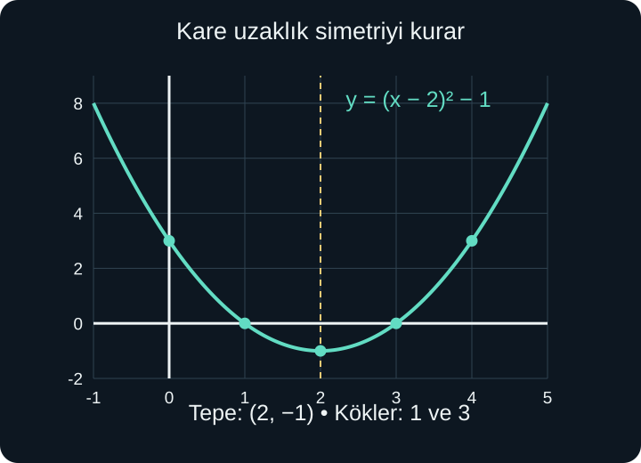
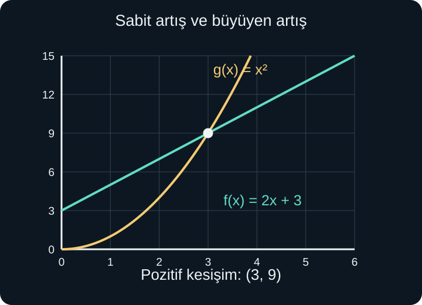

import ArticleVideo from '@/components/ArticleVideo.astro'
import kavram from './media/01-kavram.mp4?url'
import kavramPoster from './media/01-kavram.jpg?url'

Bir kaba başlangıçta 12 litre su koyalım. Her dakika 3 litre daha eklersek miktar sırayla 12, 15, 18, 21 litre olur. Eşit sürelerde eşit miktar ekliyoruz. Başka bir deneyde bir karenin kenarını 1, 2, 3, 4 metre seçelim. Alanlar 1, 4, 9, 16 metrekare olur. Kenarı her defasında bir metre artırmamıza rağmen alan artışları 3, 5 ve 7 metrekaredir.

İlk değişimde artış sabittir; ikincisinde artışın kendisi değişir. Bu iki davranışın grafiklerini **doğru** ve **parabol** üzerinden inceleyeceğiz. Şekli çizdikten sonra formülü tahmin etmekle yetinmeyecek, formülün neden o şekli verdiğini de açıklayacağız.

[Önceki yazıda](/blog/fonksiyonlar-ve-grafikler/) fonksiyonu, tanım kümesini, görüntüyü ve grafik okumayı kurduk. Burada eğim, denklem çözme, çarpanlara ayırma ve kareye tamamlama bilgilerine ihtiyaç var. İkinci derece denklemlerin kökleri artık grafikte bir anlam kazanacak. Artma ve azalmayı açıklarken türev kullanmayacağız.

## 1. Sabit Artış Doğru Verir

Geçen süreye $t$, su miktarına $S(t)$ diyelim. Süreyi dakika, miktarı litre olarak ölçelim. Başlangıçtaki 12 litreye, $t$ dakika boyunca eklenen $3t$ litreyi ekleriz:

$$
S(t)=12+3t
$$

$t=0$ için $S(0)=12$, $t=4$ için $S(4)=12+12=24$ litre buluruz. Formüldeki 12 başlangıç miktarını, 3 ise dakikadaki artış miktarını gösterir. İkisi aynı tür bilgi değildir: 12'nin birimi litre, 3'ün birimi litre/dakikadır.

Grafikte iki farklı zaman arasındaki eğimi hesaplayalım. $t=1$ için 15, $t=4$ için 24 litre vardır. Miktar değişimi 9 litre, zaman değişimi 3 dakikadır. Oran $9/3=3$ litre/dakika olur. Başka iki zaman seçtiğimizde de aynı oran çıkar; grafik bu nedenle bir doğru üzerinde ilerler.

Genel gösterim:

$$
f(x)=mx+b
$$

Burada $x$ girdi, $m$ sabit değişim oranı yani eğim, $b$ ise $x=0$ girdisindeki çıktıdır. Bu yazıda grafik olarak doğru veren kuralları okul matematiğindeki yaygın kullanımla **doğrusal fonksiyon** diye adlandırıyoruz. Daha dar bir kullanımda, özellikle lineer cebirde, “doğrusal dönüşüm” adı $b=0$ koşulunu da ister; iki bağlamı ileride ayıracağız.

## 2. Eğimin İşareti ve Başlangıç Değeri

$m>0$ olduğunda girdi artarken çıktı artar. $m<0$ olduğunda çıktı azalır. $m=0$ olduğunda $f(x)=b$ sabit fonksiyonu elde edilir. Grafiğin yatay olması, fonksiyonun tanımsız olduğu anlamına gelmez; her girdiye aynı çıktı atanır.

$P(t)=30-2t$ kuralı, başlangıçta 30 birim olup her zaman biriminde 2 azalan miktarı anlatabilir. $t=0$ için 30, $t=5$ için 20, $t=15$ için 0 bulunur. Bu miktar bir depodaki suysa negatif sonuç fiziksel olarak uygun değildir. Sabit boşalma modeli en fazla $0\le t\le15$ aralığında kullanılmalıdır.

Başlangıç değerinin büyük olması eğimin büyük olması demek değildir. $f(x)=100+x$ ile $g(x)=3x$ örneğinde birinci fonksiyon yüksekten başlar, ikinci daha hızlı artar. İlk anda hangisinin daha büyük olduğu ile uzun vadede hangisinin daha hızlı değiştiği ayrı sorulardır. Karşılaşma noktasını $100+x=3x$ denklemiyle buluruz: $100=2x$, dolayısıyla $x=50$ ve ortak çıktı 150 olur.

Birinci su kabımızın kapasitesi 42 litre olsun. $12+3t=42$ denklemi $3t=30$, yani $t=10$ dakika verir. Kap dolduktan sonra aynı formülü “kabın içindeki su miktarı” olarak sürdürmek yanlış olur. Cebirsel fonksiyon bütün gerçek sayılarda tanımlanabilir; fiziksel modelin kullanıldığı aralık ayrıca belirlenir.

## 3. İki Ölçümden Doğrusal Model Kurmak

Sabit hızla dolduğu bilinen başka bir kapta, ikinci dakikada 11 litre, beşinci dakikada 23 litre ölçülsün. Önce değişim oranını buluruz:

$$
m=\frac{23-11}{5-2}=\frac{12}{3}=4
$$

Her dakika 4 litre eklenmektedir. $S(t)=4t+b$ yazıp bilinen bir ölçümü yerine koyalım: $11=4\times2+b$. Böylece $11=8+b$, yani $b=3$ litre çıkar. Model $S(t)=4t+3$ olur. Beşinci dakikada $20+3=23$ vererek ikinci ölçümü de doğrular.

Burada “sabit hızla dolduğu bilinen” koşulu önemlidir. Yalnızca iki ölçümün bulunması, aradaki değişimin kesinlikle doğrusal olduğunu kanıtlamaz. Çok sayıda eğri aynı iki noktadan geçebilir. Kullandığımız fiziksel varsayım, noktaları bir doğruyla birleştirmemizi haklı çıkarır. Ölçüm verisinden model üretirken hem hesap hem varsayım görünür olmalıdır.

## 4. Karenin Alanından Parabole

Kare alma fonksiyonu $f(x)=x^2$ olsun. Bu aşamada $x$ gerçek bir sayı girdisidir; yalnızca fiziksel kenar uzunluğu olarak düşünmediğimiz için negatif değerleri de kullanabiliriz. Küçük bir tablo kuralın yapısını gösterir:

| $x$ | $-3$ | $-2$ | $-1$ | $0$ | $1$ | $2$ | $3$ |
| --- | --- | --- | --- | --- | --- | --- | --- |
| $x^2$ | $9$ | $4$ | $1$ | $0$ | $1$ | $4$ | $9$ |

Birbirinin negatifi olan girdiler aynı kareyi verir. Dolayısıyla grafik $y$ eksenine göre simetriktir. Bütün çıktılar sıfır veya pozitiftir; en küçük çıktı 0 ve bunu veren girdi 0'dır. Grafik bu noktaya kadar aşağı iner, sonra yukarı çıkar. Bu eğriye **parabol** deriz.

Tablodaki noktaları düz parçalarla birleştirmek, grafiğin tam kendisini oluşturmaz. Kural aradaki girdiler için de değer verir; örneğin $f(1{,}5)=2{,}25$. Doğru parçasıyla 1 ve 4 çıktılarını birleştirseydik orta noktada 2,5 okurduk. Gerçek grafik bu nedenle doğru değil, eğridir.

Artışın sabit olmamasını cebirle de görebiliriz. Girdiyi $x$'ten $x+1$'e değiştirdiğimizde çıktı farkı:

$$
(x+1)^2-x^2=2x+1
$$

olur. Artış başlangıçtaki $x$ değerine bağlıdır. Pozitif tarafta $x$ büyüdükçe bir birimlik girdi artışının getirdiği çıktı artışı da büyür.

## 5. Tepe Noktası ve Simetri

Şimdi $f(x)=(x-2)^2-1$ fonksiyonuna bakalım. Önce girdiden 2 çıkarıyor, çıkan sayının karesini alıyor, sonra 1 çıkarıyoruz. Kareli parça en küçük 0 olabilir. Bu, $x-2=0$, yani $x=2$ olduğunda gerçekleşir. En küçük fonksiyon değeri $0-1=-1$ olur.

En küçük değerin bulunduğu $(2,-1)$ noktasına parabolün **tepe noktası** deriz. Buradaki “tepe” sözcüğü her zaman en yukarı nokta demek değildir; parabolün yön değiştirdiği merkez noktayı adlandırır. Yukarı açılan parabolde bu nokta en aşağıdadır.

2'nin iki yanında eşit uzaklıkta girdiler seçelim: 1 ve 3 için kareli ifade 1 olur; çıktı iki tarafta da 0'dır. 0 ve 4 için kareli ifade 4, çıktı iki tarafta da 3'tür. Simetri doğrusu $x=2$ olur.

Genel tepe biçimi:

$$
f(x)=a(x-h)^2+k,\qquad a\ne0
$$

Burada $h$ tepenin yatay koordinatı, $k$ düşey koordinatı, $a$ ise kareli uzaklığın katsayısıdır. Tepe $(h,k)$, simetri doğrusu $x=h$ olur. $a>0$ ise kareli miktar pozitif yönde eklenir ve parabol yukarı açılır. $a<0$ ise negatif yönde eklenir ve parabol aşağı açılır; tepe bu kez en büyük değeri verir.

<ArticleVideo src={kavram} poster={kavramPoster} title="Parabolde tepe ve simetri" caption="Hareketli nokta y=(x−2)²−1 kuralını izler. x=2 doğrusunun iki yanındaki eşit uzaklıklar aynı yüksekliği verir." />

## 6. Katsayının Büyüklüğü Neyi Değiştirir?

$f(x)=x^2$, $g(x)=2x^2$ ve $h(x)=x^2/2$ fonksiyonlarında aynı girdiyi deneyelim. $x=2$ için çıktılar sırasıyla 4, 8 ve 2 olur. Tepe aynı kalırken kareli uzaklığın çıktı üzerindeki etkisi değişir. Aynı eksen ölçekleriyle çizildiğinde $2x^2$ daha dar, $x^2/2$ daha geniş görünür.

Bu görünüşü açıklamak için yalnızca “parabolü sıkıştırmak” demek yeterli değildir. Belirli bir yükseklikte yatay uzaklığın ne olduğuna da bakabiliriz. Çıktı 8 olduğunda $2x^2=8$ için $x=\pm2$, $x^2/2=8$ için $x=\pm4$ olur. İkinci grafik aynı yüksekliğe ulaşmak için tepeden daha uzağa gitmiştir.

Negatif katsayı yönü değiştirir. $-2x^2$ fonksiyonunda $x=2$ çıktısı $-8$'dir. Her noktanın düşey koordinatı, $2x^2$ grafiğine göre işaret değiştirmiştir. Yatay eksene göre yansıma elde ederiz. Katsayının işareti açılma yönünü, mutlak değeri ise aynı yatay uzaklıktaki düşey farkın büyüklüğünü belirler.

## 7. Genel Biçimden Tepe Biçimine

İkinci derece fonksiyonun genel biçimi $f(x)=ax^2+bx+c$'dir; $a$, $b$ ve $c$ sabit gerçek sayılar, $a\ne0$ olur. $a=0$ olursa kareli terim kalmaz ve artık ikinci derece fonksiyon olmaz.

$f(x)=x^2-4x+3$ örneğinde ilk iki terimi tam kareye dönüştürelim. $x^2-4x+4=(x-2)^2$ olduğunu biliyoruz. İfadeye 4 eklediğimiz için aynı değeri korumak üzere 4 de çıkarmalıyız:

$$
x^2-4x+3=(x^2-4x+4)-4+3
$$

$$
f(x)=(x-2)^2-1
$$

Genel biçimde hemen görünmeyen $(2,-1)$ tepesi, bu yazımda belirginleşti. $a$ katsayısı 1 değilse önce kareli ve doğrusal terimlerden onu ortak çarpan alırız. Örneğin:

$$
2x^2-8x+5=2(x^2-4x)+5
$$

Parantez içini $(x-2)^2-4$ biçiminde yazınca:

$$
2(x-2)^2-8+5=2(x-2)^2-3
$$

elde edilir. Tepe $(2,-3)$ olur. Parantez içindeki düzeltmenin dışarıdaki 2 ile de çarpılması gerekir; sık yapılan hata $-4$'ü doğrudan dışarı çıkarmaktır.

Aynı işlem genel katsayılarla yapıldığında tepenin yatay koordinatı $h=-b/(2a)$ bulunur. Düşey koordinat $k=f(h)$'dir. Bu formül kareye tamamlamanın kısaltılmış sonucudur; doğrudan ezberlemeden önce yukarıdaki dönüşümün anlamını görmek gerekir.

## 8. Kökler Grafikte Ne Söyler?

$f(x)=x^2-4x+3$ fonksiyonunun sıfırları için $x^2-4x+3=0$ çözeriz. Çarpanlara ayırınca $(x-1)(x-3)=0$ olur. Sıfır çarpım ilkesiyle $x=1$ veya $x=3$ bulunur. Grafik yatay ekseni $(1,0)$ ve $(3,0)$ noktalarında keser.

Köklerin ortalaması $(1+3)/2=2$, simetri doğrusunun yatay koordinatıdır. İki gerçek kökü olan parabolde kökler tepenin iki yanında eşit uzaklıktadır. Bu, tepe biçimindeki karenin eşit uzaklıklara eşit sonuç vermesiyle uyumludur.

Her parabol yatay ekseni iki noktada kesmez. $x^2+1$ fonksiyonunun en küçük değeri 1 olduğundan gerçek sıfırı yoktur. $x^2$ yalnızca 0'da sıfır olur ve eksene orada değer; işaret değiştirmez. $x^2-1$ ise $-1$ ve 1'de iki sıfıra sahiptir.

[İkinci derece denklemlerde](/blog/ikinci-derece-denklemler/) kullandığımız diskriminant $\Delta=b^2-4ac$, bu durumları cebirsel olarak ayırır. Pozitifse iki farklı gerçek kök, sıfırsa tek tekrarlı kök, negatifse gerçek kök yoktur. Tepe biçiminde $k=-\Delta/(4a)$ yazılabilmesi aynı ilişkinin başka ifadesidir. Örneğin yukarı açılan parabolde $\Delta<0$ ise $k>0$, yani tepe bile eksenin üstündedir.

## 9. İşaret ve İkinci Derece Eşitsizlik

$(x-1)(x-3)$ ifadesinin işaretini aralıklara ayıralım. $x<1$ iken iki çarpan da negatif, çarpım pozitiftir. $1<x<3$ iken birinci pozitif, ikinci negatif; çarpım negatiftir. $x>3$ iken ikisi de pozitif olduğundan çarpım pozitiftir.

Bu yüzden $x^2-4x+3<0$ eşitsizliğinin çözümü $(1,3)$ olur. Eşitsizlik $\le0$ olsaydı kökler de dahil edilir ve $[1,3]$ bulunurdu. Grafikte aynı soruyu “parabol hangi girdilerde yatay eksenin altında?” diye okuruz.

Baş katsayı negatifse işaretler tersine döner. $-(x-1)(x-3)>0$ eşitsizliği yine köklerin arasında sağlanır. Kökleri bulduktan sonra grafiğin açılma yönünü veya çarpanların işaretlerini kontrol etmek gerekir; “her zaman dış aralık” gibi bir ezber doğru değildir.

Tekrarlı kökte ayrı bir durum vardır. $(x-2)^2\ge0$ bütün gerçek girdilerde doğrudur, fakat $(x-2)^2<0$ hiçbir gerçek girdide sağlanmaz. Teğet gibi değip geri dönen grafikte kökten geçerken işaret değişmez. Kökün bulunması, iki yanında zıt işaret olacağını zorunlu kılmaz.

## 10. Doğru ile Parabolü Karşılaştırmak

$f(x)=2x+3$ ile $g(x)=x^2$ aynı çıktıyı ne zaman verir? $2x+3=x^2$ eşitliğini düzenleyelim:

$$
x^2-2x-3=(x-3)(x+1)=0
$$

Kesişmeler $x=-1$ ve $x=3$ girdilerindedir. Çıktılar sırasıyla 1 ve 9 olduğu için ortak noktalar $(-1,1)$ ve $(3,9)$ olur. Aşağıdaki çizim pozitif girdilerin bulunduğu bölgeyi gösterir.

Hangi fonksiyonun daha büyük olduğunu bulmak için farkı alırız: $g(x)-f(x)=(x-3)(x+1)$. $-1<x<3$ aralığında bu fark negatiftir; parabol doğrunun altında kalır. Dış aralıklarda fark pozitif olduğundan parabol üsttedir. Karşılaştırmayı yalnızca tek bir örnek girdiye bakarak bütün aralığa yaymadık; işaret değişimlerini köklerle ayırdık.

## 11. Alanı En Büyük Yapmak

Çevresi 20 metre olan dikdörtgenin bir kenarına $x$ diyelim. Diğer kenara $y$ dersek $2x+2y=20$ olur. İkiye bölünce $x+y=10$, buradan $y=10-x$ çıkar. Kenarlar pozitif olduğundan $0<x<10$ koşulu vardır.

Alan, iki kenarın çarpımıdır:

$$
A(x)=x(10-x)=10x-x^2
$$

Kareye tamamlayalım:

$$
A(x)=-(x^2-10x+25)+25
$$

$$
A(x)=25-(x-5)^2
$$

Kareli ifade sıfır veya pozitiftir. Bu nedenle alan 25'ten büyük olamaz. En büyük değer, kareli ifade sıfırken yani $x=5$ olduğunda alınır. Diğer kenar da $10-5=5$ metredir. Bu koşullar altında en büyük alanı 25 metrekarelik kare verir.

Burada türev kullanmadık; bir karenin negatif olamayacağı bilgisini kullandık. Sonucu bağlamla da kontrol ettik: $x=5$, izin verilen $(0,10)$ aralığındadır. Eğer bir kenarın en fazla 3 metre olacağı ayrıca söylenseydi tepe artık izin verilen aralığın dışında kalırdı. Bu yeni koşulda 0 ile 3 arasında alan artar ve izin verilen uç değer 3 dahilse en büyük alan $3\times7=21$ metrekare olur.

## 12. Artma Aralıklarını Türev Olmadan Belirlemek

$(x-2)^2-1$ fonksiyonunda girdi 2'ye soldan yaklaşırken $x-2$ negatif kalır, fakat mutlak değeri küçülür. Örneğin $x=-1,0,1,2$ değerleri, tepeye uzaklık olarak 3, 2, 1, 0 verir. Uzaklığın karesi küçüldüğü için fonksiyon değeri de küçülür. 2'nin sağında ise bu uzaklık büyür ve fonksiyon artar. Dolayısıyla fonksiyon $(-\infty,2]$ aralığında azalan, $[2,\infty)$ aralığında artandır.

Pozitif sayılarda kare almanın sıralamayı neden koruduğunu da açıklayabiliriz. $0\le u<v$ olsun. $v^2-u^2=(v-u)(v+u)$ yazılır. İki çarpan da pozitiftir; bu yüzden fark pozitiftir ve $v^2>u^2$ olur. Parabolde tepeye olan uzaklıkları karşılaştırırken kullandığımız dayanak budur. Grafiğe bakarak verilen bir izlenimi, cebirsel bir gerekçeyle destekledik.

Tanım kümesi kısıtlandığında görüntü de değişir. Aynı fonksiyonu bütün gerçek sayılarda kullanırsak görüntü $[-1,\infty)$ olur. Yalnızca $0\le x\le4$ aralığında kullanırsak en küçük değer yine $-1$, en büyük değer uçlarda 3'tür; görüntü $[-1,3]$ olur. Kareli uzaklık 0'dan 2'ye kadar bütün değerleri alabildiği için aradaki çıktılar da elde edilir.

Tanım kümesini $[0,1]$ seçersek tepeye hiç ulaşamayız. Bu aralık boyunca fonksiyon azalır: başlangıç çıktısı 3, bitiş çıktısı 0'dır. Görüntü $[0,3]$ olur. Aynı formüle sahip bu üç durumda en küçük ve en büyük çıktıların değişmesi çelişki değildir. Bir fonksiyonun davranışını anlatırken formülle birlikte tanım kümesini de söylememiz gerekir.

Doğru başlangıçla sabit değişimi, parabol ise kareli uzaklıkla simetriyi bir araya getirir. Bir fonksiyonun cebirsel biçimi, grafiği ve gerçek kullanım koşulları birlikte okununca hesaplar daha anlamlı hâle gelir. Sıradaki yazıda bu kuralları birleştirecek, ters yönde çalıştıracak ve grafiklerini dönüştüreceğiz.

## Kaynakça

Anlatım, hesap örnekleri ve görseller özgündür. Kaynak bölümleri 8 Ekim 2026 tarihinde kontrol edildi.

- [OpenStax — Precalculus 2e, 2.1: Linear Functions](https://openstax.org/books/precalculus-2e/pages/2-1-linear-functions): Sabit değişim oranı, başlangıç değeri ve modelin tanım kümesi için.
- [OpenStax — Precalculus 2e, 3.2: Quadratic Functions](https://openstax.org/books/precalculus-2e/pages/3-2-quadratic-functions): Tepe biçimi, simetri, kökler ve ikinci derece modellerinin koşulları için.
- [OpenStax — Precalculus 2e, 1.3: Rates of Change and Behavior of Graphs](https://openstax.org/books/precalculus-2e/pages/1-3-rates-of-change-and-behavior-of-graphs): Artma-azalma ve uç değerlerin grafik üzerinden yorumlanması için.
