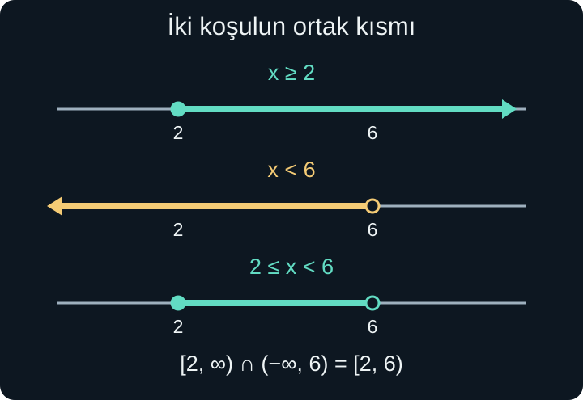
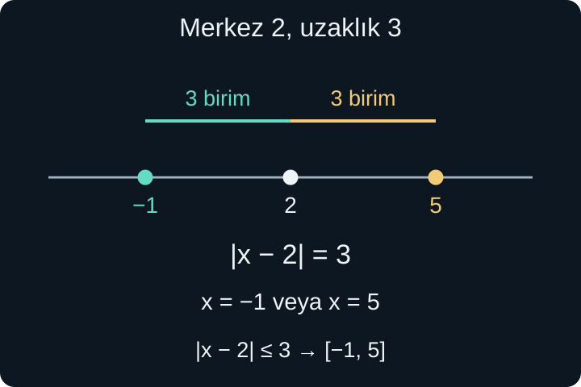

import ArticleVideo from '@/components/ArticleVideo.astro'
import kavram from './media/01-kavram.mp4?url'
import kavramPoster from './media/01-kavram.jpg?url'

Bir atölyeye katılmak için yaşın en az 16 olması, bir kutuya konacak yükün 8 kilogramı aşmaması veya sıcaklığın 18 ile 24 derece arasında tutulması istenebilir. Bu koşullar tek bir sayıyı seçmez. Bir değerin kabul edilip edilmediğini belirleyen bir sınır, bazen de iki sınır koyar.

Denklemlerde “hangi değerler iki tarafı eşit yapıyor?” diye soruyorduk. **Eşitsizliklerde** bir miktarın diğerinden küçük, büyük veya ona eşit olmasına izin veren koşulları araştıracağız. Cevabı çoğu zaman bir sayı listesiyle bitiremeyeceğimiz için kümeleri ve aralıkları tanıtacağız.

[Önceki yazıdaki](/blog/ozdeslikler-ve-carpanlara-ayirma/) parantez açma, benzer terimleri birleştirme ve payda kısıtları burada da gerekli. Sayı doğrusu, negatif sayılar ve kesirler ise geometrik dayanağımız olacak. Koordinat düzlemine henüz ihtiyacımız yok; bütün görseller tek bir sayı doğrusu üzerindedir.

## 1. Küme, Birlikte Düşünülen Nesneler

Belirli bir koşulla seçilen nesneler topluluğuna **küme**, içindeki her nesneye **eleman** deriz. Örneğin 1, 2 ve 3 sayılarından oluşan kümeyi $A=\{1,2,3\}$ biçiminde yazarız. Süslü parantez, bunları tek bir topluluk olarak düşündüğümüzü gösterir. $2\in A$, “2, A kümesinin elemanıdır”; $5\notin A$, “5 bu kümede değildir” anlamına gelir.

Kümede sıra ve tekrar önemli değildir. $\{1,2,3\}$ ile $\{3,1,2\}$ aynı kümedir. Bir sayıyı iki kez yazmak yeni bir eleman eklemez. Bu özellik, ileride göreceğimiz sıralı çiftlerden farklıdır: Küme yalnızca neyin içeride olduğunu sorar.

Hiç elemanı olmayan kümeye **boş küme** denir ve $\varnothing$ ile gösterilir. $\{0\}$ boş küme değildir; içinde sıfır sayısı bulunur. Bu ayrım, “eşitsizliğin hiçbir çözümü yok” ile “tek çözüm sıfır” durumlarını birbirinden ayırmamızı sağlar.

$A$ kümesinin her elemanı $B$ içinde de bulunuyorsa $A$, $B$'nin **alt kümesidir**; $A\subseteq B$ yazarız. Örneğin $\{1,2\}\subseteq\{1,2,3\}$ doğrudur. Eşit kümeler de birbirlerinin alt kümesidir; gösterimdeki küçük eşitlik çizgisi buna izin verir.

## 2. Hangi Sayılarda Çözüm Arıyoruz?

Bu yazıda doğal sayıları $\mathbb N=\{0,1,2,3,\ldots\}$ olarak kabul edeceğiz. Bazı kaynaklar 0'ı doğal sayılara katmaz; bu nedenle kullandığımız anlaşmayı açıkça belirtiyoruz. Tam sayılar $\mathbb Z$, negatif tam sayıları, sıfırı ve pozitif tam sayıları içerir.

**Rasyonel sayılar** $\mathbb Q$, $p$ ve $q$ tam sayı, $q\ne0$ olmak üzere $p/q$ biçiminde yazılabilen sayılardır. $3/4$, $-5/2$ ve $7=7/1$ rasyoneldir. Sonlu veya devirli ondalık gösterimler bu kümeye girer. $\sqrt2$ gibi böyle bir kesir olarak yazılamayan gerçek sayılar ise irrasyoneldir.

Rasyonel ve irrasyonel sayılar birlikte **gerçek sayıları**, $\mathbb R$'yi oluşturur. Sayı doğrusundaki her nokta bir gerçek sayıyı temsil eder. Bu yazıda aksi belirtilmedikçe çözümleri gerçek sayılar arasında arayacağız. Kapsama ilişkisini $\mathbb N\subseteq\mathbb Z\subseteq\mathbb Q\subseteq\mathbb R$ diye kısaltabiliriz.

Sayı kümesini söylemek cevabı değiştirir. $2x=1$ denkleminin gerçek sayılarda çözümü $x=1/2$'dir; tam sayılarda çözümü yoktur. Benzer şekilde $0<x<1$ koşulunu sonsuz sayıda gerçek sayı sağlar, fakat hiçbir tam sayı sağlamaz. Gerçek bir nesnenin adedini arıyorsak yalnızca cebirsel eşitsizliği çözmek yetmez; tam sayı olma koşulunu da uygularız.

## 3. Eşitsizlik İşaretlerini Okumak

$x<4$, $x$'in 4'ten küçük olduğunu söyler; 4'ün kendisi buna dahil değildir. $x\le4$, 4'ten küçük **veya 4'e eşit** demektir. Benzer şekilde $x>4$ kesin büyüklüğü, $x\ge4$ ise büyük veya eşit olmayı anlatır.

Sayı doğrusunda sağda bulunan sayı daha büyüktür. Bu yüzden $-2>-5$ olur; sıfıra yakın negatif sayı burada daha büyüktür. Mutlak büyüklük ile sayı doğrusundaki sıra aynı şey değildir. $-5$'in sıfıra uzaklığı daha fazla olsa da sayısal değeri $-2$'den küçüktür.

Bir koşulun **çözüm kümesi**, o koşulu sağlayan bütün izin verilen değerlerin kümesidir. $x<4$ için yalnızca 3'ü yazmak, bir çözüm örneği vermektir. Tam cevap, 4'ün solundaki bütün gerçek sayıları içerir. Bu sonsuz topluluğu aralık gösterimiyle kısa ve kesin biçimde yazabiliriz.

## 4. Açık ve Kapalı Uçlar

$2<x<6$ ifadesi, $x$'in aynı anda 2'den büyük ve 6'dan küçük olmasıdır. Aralık gösterimi $(2,6)$ olur. Yuvarlak parantezler uçların dahil olmadığını belirtir. $2\le x\le6$ için $[2,6]$ yazarız; köşeli parantezler uçları da içerir.

Bir uç dahil, diğeri hariç olabilir. $2\le x<6$ koşulu $[2,6)$, $2<x\le6$ koşulu $(2,6]$ olarak gösterilir. Sayı doğrusunda dahil edilen uç dolu, edilmeyen uç boş noktayla çizilir. Boyanan parça aradaki bütün gerçek sayıları temsil eder; yalnızca işaretlenen tam sayılar çözüm değildir.

$x\ge2$ koşulunun sağda sonlu bir sınırı yoktur. $[2,\infty)$ yazarız. $\infty$ “sonsuz” simgesidir; çok büyük bir sayı veya ulaşılacak son bir eleman değildir. Bu yüzden sonsuzluğun yanına köşeli parantez koymayız. Benzer şekilde $x<6$, $(-\infty,6)$ aralığıdır.

Aralık gösterimindeki virgül iki ucu ayırır. Türkçede ondalık virgülle karışabilecek bir durumda uçları kesirle yazmak veya aralıkta ayırıcı olarak noktalı virgül kullanıldığını açıkça belirtmek mümkündür. Burada uç değerlerde tam sayı ve kesir tercih ederek bu belirsizliği önlüyoruz.

## 5. İki Koşul: Kesişim ve Birleşim

Bir depodaki sıcaklık için ilk cihaz $x\ge2$, ikinci cihaz $x<6$ koşulu koysun. İkisinin de kabul ettiği değerler $[2,6)$ aralığındadır. İki kümenin ortak elemanlarından oluşan kümeye **kesişim** denir; $A\cap B$ ile gösterilir. Gündelik dildeki “ve” çoğu zaman bu yapıya karşılık gelir.

**Birleşim**, en az bir kümede bulunan elemanları içerir; $A\cup B$ ile gösterilir. $x<2$ **veya** $x\ge6$ koşulunun çözümü $(-\infty,2)\cup[6,\infty)$ olur. Buradaki “veya”, matematikte genellikle kapsayıcıdır: Bir ya da iki koşulun birden sağlanmasına izin verir.

$A=[1,5]$ ve $B=[3,8]$ için kesişim $[3,5]$, birleşim $[1,8]$'dir. İlkinde ortak kısmı, ikincisinde iki parçanın kapladığı bütün bölgeyi alırız. Aralıklar arasında boşluk varsa birleşimi tek aralık gibi yazamayız. Örneğin $[1,2]\cup[4,5]$, 3'ü içermez.

Uç noktalar birleşim ve kesişimde de ayrı düşünülür. $[1,3)$ ile $[3,5]$'in kesişimi boştur; 3 ilk kümede bulunmaz. Aynı iki kümenin birleşimi $[1,5]$ olur, çünkü 3 ikinci kümede vardır ve arada eksik nokta kalmaz.

## 6. Toplama ve Pozitif Çarpanlar

Bir eşitsizliğin iki tarafına aynı sayıyı eklemek veya iki taraftan aynı sayıyı çıkarmak sırayı korur. Sayı doğrusunda iki noktayı aynı miktarda kaydırmış oluruz. Başlangıçta sağda olan nokta yine sağda kalır.

Örneğin $3x+2<14$ eşitsizliğinde iki taraftan 2 çıkaralım:

$$
3x<12.
$$

İki tarafı pozitif 3'e bölersek $x<4$ elde ederiz. Çözüm kümesi $(-\infty,4)$'tür. $x=3$ için başlangıçta $11<14$ doğru, $x=4$ için $14<14$ yanlış olur. Sınırın dahil olmaması, başlangıçtaki kesin küçüklük işaretinden gelir.

Parantezli bir örnekte $2(x-1)\le x+5$ yazalım. Açınca $2x-2\le x+5$ olur. İki taraftan $x$ çıkarıp 2 eklersek $x\le7$ bulunur. $x=7$ eşitlik verdiği için çözümün içindedir. Sonuç $(-\infty,7]$ aralığıdır.

## 7. Negatifle Çarpınca Yön Neden Değişir?

$2<5$ doğrudur. İki sayıyı $-1$ ile çarpınca $-2$ ve $-5$ elde ederiz; bu kez $-2>-5$ olur. Sıfırın karşı tarafına yansıma, noktaların soldan sağa sırasını tersine çevirir. Başka bir negatif çarpanla ayrıca ölçekleme yapılır; sıra yine ters döner.

Bu nedenle bir eşitsizliğin iki tarafını negatif bir sayıyla çarpar veya bölersek eşitsizlik işaretini ters çeviririz. Bu, ezberden yapılan ek bir hareket değil, sayıların sırasını doğru tutmanın gereğidir.

$$
-3x+2\ge11
$$

için önce iki taraftan 2 çıkarırız: $-3x\ge9$. Ardından negatif $-3$'e bölünce:

$$
x\le-3
$$

olur. Kontrol edelim: $x=-4$ için $14\ge11$ doğrudur. Yanlış yönde $x\ge-3$ yazsaydık kabul edeceğimiz $x=0$, başlangıçta $2\ge11$ gibi yanlış bir sonuç verirdi.

<ArticleVideo src={kavram} poster={kavramPoster} title="Sayı doğrusunda iki koşul ve yansıma" caption="Aralıkların ortak kısmı birlikte sağlanan koşulları gösteriyor. Negatifle çarpma ise sayı doğrusundaki sıralamayı tersine çevirerek eşitsizlik yönünün neden değiştiğini açıklıyor." />

İşareti bilinmeyen bir ifadeyle çarpmak doğrudan aynı kuralla yapılamaz. $x$'in pozitif mi, negatif mi, sıfır mı olduğu belli değilken bir eşitsizliği $x$ ile çarpıp yönü koruyamayız. Gerekirse durumları ayırmak gerekir. Burada sabit katsayılı örneklerle çalışarak bu ek güçlüğü sonraya bırakıyoruz.

## 8. Bileşik Eşitsizlikleri Çözmek

$1<2x+3\le9$ koşulu, ortadaki ifadenin aynı anda iki sınır arasında kalmasıdır. Üç bölümden de 3 çıkaralım:

$$
-2<2x\le6.
$$

Üç bölümü pozitif 2'ye bölersek $-1<x\le3$ bulunur. Çözüm $(-1,3]$'tür. Sol uç başlangıçta kesin küçüklük, sağ uç küçük veya eşit işareti taşıdığı için uçların türleri farklıdır.

“Veya” ile bağlanan koşulları ise ayrı ayrı çözeriz. $2x+1<5$ veya $3x-2\ge10$ olsun. İlki $x<2$, ikincisi $x\ge4$ verir. Çözüm $(-\infty,2)\cup[4,\infty)$'dir. Bu iki eşitsizliği tek zincire sıkıştırmak anlamı değiştirir.

Bazen sonuç bütün sayılar veya boş küme olur. $2(x+1)<2x+5$ eşitsizliğini düzenleyince $2<5$ kalır; her gerçek $x$ uygundur. $2(x+1)>2x+5$ ise $2>5$ verir ve hiçbir çözümü yoktur. Bilinmeyenin yok olması, yine tek bir sayı bulduğumuz anlamına gelmez.

## 9. Mutlak Değer Bir Uzaklıktır

Sayı doğrusunda 5 ve $-5$, sıfıra aynı uzaklıktadır. **Mutlak değer**, bir gerçek sayının sıfıra uzaklığını verir: $|5|=5$, $|-5|=5$ ve $|0|=0$. Uzaklık negatif olamayacağı için her gerçek $x$ için $|x|\ge0$ olur.

Harfli tanımını iki durumla yazarız:

$$
|x|=\begin{cases}
x,&x\ge0,\\
-x,&x<0.
\end{cases}
$$

İkinci satırdaki $-x$ negatif bir sonuç demek değildir. $x$ zaten negatif olduğu için işaretini ters çevirdiğimizde pozitif sonuç alırız. Örneğin $x=-7$ ise $-x=-(-7)=7$ olur.

$x$ ile $a$ arasındaki uzaklık $|x-a|$'dır. $x-a$ farkı yönü de taşır; mutlak değer bu farkın yönünü kaldırıp uzaklığı bırakır. 2 ile 7 arasındaki uzaklık $|2-7|=5$, 7 ile 2 arasındaki uzaklık $|7-2|=5$'tir.

## 10. Uzaklığı Verilmiş Noktalar ve Bölgeler

$|x-2|=3$ denklemi, 2'ye uzaklığı 3 olan noktaları sorar. Merkezin 3 birim solundaki $-1$ ve 3 birim sağındaki 5 çözümdür. Cebirsel olarak $x-2=3$ veya $x-2=-3$ durumlarını çözeriz.

$|x-2|\le3$ dersek merkeze en fazla 3 birim uzaktaki bütün noktaları isteriz:

$$
-3\le x-2\le3,
\qquad -1\le x\le5.
$$

Çözüm $[-1,5]$'tir. Kesin küçüklükte uçlar çıkarılır ve $(-1,5)$ olur. $|x-2|>3$ ise tam tersine merkezden 3 birimden daha uzaktaki iki dış bölgeyi seçer: $x<-1$ veya $x>5$.

Mutlak değerin sağındaki sayıya bakmadan iki durum yazmamalıyız. $|x-2|=-3$ denkleminin çözümü yoktur; hiçbir uzaklık negatif değildir. $|x-2|\le-3$ de çözümsüzdür. $|x-2|>-3$ ise bütün gerçek sayılarda doğrudur. Sağ taraf sıfır olduğunda $|x-2|\le0$ yalnızca $x=2$ verir.

Katsayı varsa önce mutlak değeri yalnız bırakırız:

$$
2|x-1|+3\le11.
$$

Üç çıkarıp pozitif 2'ye bölersek $|x-1|\le4$ olur. Buradan $-4\le x-1\le4$, ardından $-3\le x\le5$ bulunur. İşlem sırası, uzaklık koşulunu açıkça görmemizi sağlar.

## 11. Bir Uzaklık İfadesinin İçinde Katsayı Varsa

$|2x-4|<6$ eşitsizliğinde önce içerideki ifadenin ne söylediğini okuyalım. $2x-4=2(x-2)$ olduğundan, bu ifade $x$'in 2'ye olan uzaklığının iki katıyla ilgilidir. Bir sayıyı pozitif 2 ile çarpmak uzaklığını iki katına çıkarır. Dolayısıyla $|2(x-2)|=2|x-2|$ ve koşul $|x-2|<3$ olur. Az önceki iç bölgeyi kullanırsak $-1<x<5$ buluruz.

Aynı sonuca mutlak değeri doğrudan aralığa çevirerek de ulaşabiliriz:

$$
-6<2x-4<6.
$$

Üç bölüme 4 eklediğimizde $-2<2x<10$, pozitif 2'ye böldüğümüzde $-1<x<5$ çıkar. İlk yol uzaklık yorumunu, ikinci yol eşitsizlik işlemlerini vurgular. İkisinde de uçlar açık kalır; çünkü başlangıçta uzaklığın 6'ya eşit olması istenmemiştir.

Mutlak değer her işlemin üzerine dağıtılamaz. $|a+b|=|a|+|b|$ her zaman doğru değildir. $a=3$ ve $b=-3$ için solda $|0|=0$, sağda $3+3=6$ bulunur. Karşıt yönlü miktarlar toplamda birbirini azaltabilir. Buna karşılık gerçek sayılarda $|ab|=|a||b|$ olur; çarpımın büyüklüğü çarpanların büyüklüklerinin çarpımıdır. İşaretler sonucu pozitif ya da negatif yapar, mutlak değer bu son işareti kaldırır.

## 12. “Koşulu Sağlamamak” Ne Demektir?

Bir aralık tanımladığımızda dışında kalan kısmı da açıkça belirleyebiliriz. $x<4$ koşulunu sağlamamak, $x\ge4$ demektir; yalnızca $x>4$ demek sınırdaki 4'ü unutur. Benzer biçimde $2\le x\le6$ koşulunun dışında kalmak, $x<2$ **veya** $x>6$ anlamına gelir.

Kümenin dışında kalmayı konuşurken hangi bütünün içinde olduğumuzu bilmeliyiz. Gerçek sayılar içinde $[2,6]$ aralığının dışında iki sonsuz bölge vardır. Yalnızca $\{1,2,3,4,5,6,7\}$ kümesi içinden seçim yapıyorsak dışında kalanlar 1 ve 7'dir. Bu yüzden bir çözüm kümesini yazmadan önce izin verilen sayıları belirtmek yalnızca biçimsel bir alışkanlık değildir; cevabın kapsamını belirler.

Bir kontrol noktası seçmek de yararlıdır, fakat bütün çözümün ispatı yerine geçmez. $x=0$'ın bir eşitsizliği sağlaması, yakınındaki her sayının veya bütün sayıların sağlayacağını göstermez. İşlemlerle çözüm aralığını bulur, seçilmiş noktaları sınırların yönünü ve dahil olma durumunu denetlemek için kullanırız. Böylece hesapla kontrolün görevlerini birbirine karıştırmayız.

## 13. Sayısal Sonucu Duruma Geri Taşımak

Bir taşıma kutusunun boş kütlesi 2 kilogram, her paketin kütlesi 0,75 kilogram ve izin verilen toplam en fazla 8 kilogram olsun. Paket sayısına $n$ diyelim. Modelimiz $2+0{,}75n\le8$ olur. İki çıkarıp 0,75'e böleriz: $n\le8$.

Cebirsel çözüm gerçek sayılarda $(-\infty,8]$ olsa da paket adedi negatif veya kesirli olamaz. Durumun ek koşulu $n\in\mathbb N$ olduğundan izin verilen sayılar $\{0,1,2,\ldots,8\}$'dir. Sekiz pakette toplam tam 8 kilogram olur; dokuz paket 8,75 kilogram vererek sınırı aşar.

Bir ölçümün hedefi 20 milimetre, izin verilen sapma en fazla 0,4 milimetre ise $|x-20|\le0{,}4$ yazarız. Bu, $19{,}6\le x\le20{,}4$ koşuludur. Mutlak değer, hem eksik hem fazla üretimi aynı uzaklık sınırı altında bir araya getirir. Burada $x$ ölçülen uzunluğun milimetre cinsinden sayısal değeridir.

Bu iki örnekte çözümü anlamlandırmak için hem matematiksel koşulu hem büyüklüğün anlamını kullandık. Sonraki yazıda iki farklı bilinmeyen üzerinde aynı anda sağlanması gereken eşitliklere geçeceğiz; “ortak çözüm” düşüncesi bu kez denklem sistemlerinin temelini oluşturacak.

## Kaynaklar

- [OpenStax — Solve Linear Inequalities](https://openstax.org/books/elementary-algebra-2e/pages/2-7-solve-linear-inequalities): Aralık gösterimi, açık ve kapalı uçlar, negatif çarpanla yön değişimi.
- [OpenStax — Solve Absolute Value Inequalities](https://openstax.org/books/intermediate-algebra-2e/pages/2-7-solve-absolute-value-inequalities): Mutlak değer koşullarının iç ve dış bölge olarak okunması.

Anlatım, modeller ve şekiller bu yazı için özgün olarak oluşturuldu; kurallar kaynak bölümlerle karşılaştırıldı.
