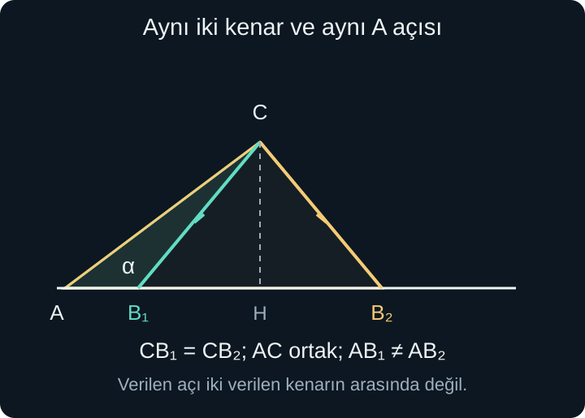
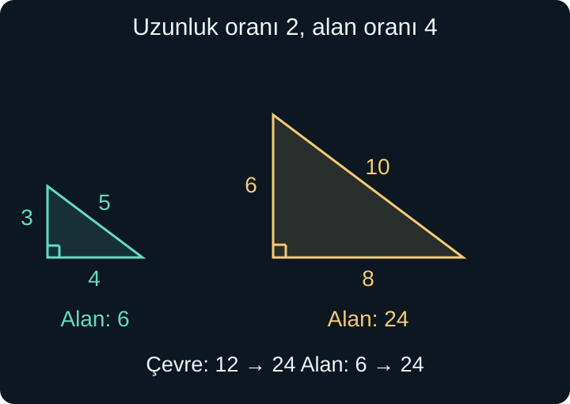

import ArticleVideo from '@/components/ArticleVideo.astro'
import kavram from './media/01-kavram.mp4?url'
import kavramPoster from './media/01-kavram.jpg?url'

Bir fotoğrafın iki baskısını düşünelim. Biri küçük, diğeri iki kat geniş ve iki kat yüksek olsun. Aynı yüzler, aynı açılar ve aynı düzen korunur; yalnızca uzunluklar değişir. Buna karşılık fotoğrafı yalnızca yatay yönde uzatırsak yüzler genişler. İkinci işlem her yönde aynı ölçeği kullanmadığı için şekli korumaz.

Geometride bu ayrımı **eşlik** ve **benzerlik** ile ifade ederiz. Eş şekiller aynı biçim ve boyuta sahiptir. Benzer şekillerde biçim korunur, boyut ortak bir katsayıyla değişebilir. İki üçgeni karşılaştırırken hangi köşenin hangisine karşılık geldiği, sayıları nasıl oranlayacağımızı belirler.

[Önceki yazıda](/blog/noktalar-dogrular-acilar-ve-ucgenler/) üçgenin kenarlarını, açı toplamını, paralelliği ve yüksekliği kurduk. Burada bunlarla birlikte oran, kesir ve basit denklem kullanacağız. Trigonometrik oranlara henüz ihtiyaç duymuyoruz; açıların sayısal sinüs veya kosinüs değerlerini hesaplamayacağız.

## 1. Eşlik: Üst Üste Getirilebilmek

Bir şekli kaydırmak, döndürmek veya ayna görüntüsünü almak kenar uzunluklarını ve açı ölçülerini değiştirmez. Bu tür hareketlerle iki şekil tam olarak üst üste getirilebiliyorsa şekiller **eştir**. Birinin sayfada daha yukarıda veya ters yönde durması eşliği bozmaz.

$\triangle ABC\cong\triangle DEF$ yazımı iki üçgenin eş olduğunu belirtir. $\cong$ eşlik simgesidir. Harflerin sırası eşleşmeyi bildirir: $A$ ile $D$, $B$ ile $E$, $C$ ile $F$ karşılıklıdır. Dolayısıyla $AB$ ile $DE$, $BC$ ile $EF$, $AC$ ile $DF$ kenarları eşleşir. Burada kenar adlarını bağlam açık olduğu için uzunluk anlamında da kullanıyoruz.

Eş üçgenlerde karşılıklı kenarlar eşit, karşılıklı açılar eşittir. Fakat eşliği göstermek için bu altı eşitliği ayrı ayrı ölçmek zorunda değiliz. Bazı daha küçük bilgi kümeleri bütün üçgeni belirler; onlara **eşlik koşulları** denir.

Bir şeklin yalnızca alanının veya çevresinin aynı olması eşlik için yeterli değildir. Kenarları 1 ve 6 olan dikdörtgen ile kenarları 2 ve 3 olan dikdörtgenin alanları 6'dır, fakat biçimleri farklıdır. Bir büyüklüğün eşitliği, bütün şeklin eşliği değildir.

## 2. Üç Kenar: KKK Eşliği

İki üçgenin karşılıklı üç kenarı eşitse üçgenler eştir. Buna **kenar-kenar-kenar**, kısaca **KKK** eşlik koşulu deriz. Örneğin kenarları 4, 5 ve 6 santimetre olan iki üçgenin biri çevrilmiş veya yansıtılmış olsa da aynı biçim ve boyut korunur.

Neden üç kenar yeterlidir? Bir kenarı sabit konuma yerleştirdiğimizi düşünelim. Üçüncü köşenin iki uca uzaklıkları da verilmiştir. Köşe, bu iki uzaklığı aynı anda korumalıdır; oluşan iki olası yerleşim varsa sabit kenarın iki yanındaki ayna görüntüleridir. Bunlar da eş şekillerdir. Kenarları değişmeyen üçgen, dört çubuktan yapılmış serbest bir çerçeve gibi yana yatıp farklı biçim alamaz.

Bu söylem, verilen üç uzunluğun önce gerçekten üçgen oluşturabilmesini gerektirir. 2, 3 ve 8 uzunlukları üçgen eşitsizliğini sağlamaz; “üç kenar verilmiş” olması bir üçgenin varlığını tek başına garanti etmez. Eşlik koşulları, mevcut veya kurulabilir üçgenleri karşılaştırır.

## 3. İki Kenar ve Aralarındaki Açı: KAK

İki kenar ve **bu iki kenarın arasındaki açı** eşitse üçgenler eştir. Buna **kenar-açı-kenar**, yani **KAK** denir. 4 ve 6 santimetrelik iki kenarın arasındaki açı iki üçgende de $50^\circ$ ise üçüncü kenarın konumu da belirlenir.

Bir köşeden iki ışını verilen açıyla açıp üzerlerinde verilen uzunlukları işaretlediğimizde iki diğer köşe yerleşmiş olur. Son kenar bu iki noktayı birleştirir. Aynı işlemi aynı verilerle yaptığımızda döndürme veya yansıtma dışında farklı bir üçgen elde edemeyiz.

“Aralarındaki” sözcüğü kuralın esas koşuludur. Açı, verilen iki kenarın birleştiği köşede bulunmalıdır. Üçgenin başka bir köşesindeki açı verilmişse aynı sonuca otomatik olarak ulaşamayız. Birazdan bunun iki farklı üçgene nasıl izin verebildiğini göreceğiz.

## 4. İki Açı ve Bir Kenar

İki açı ile aralarındaki kenar eşitse üçgenler eştir. Bu **açı-kenar-açı**, yani **AKA** koşuludur. Verilen kenarı yerleştirir, iki ucundan verilen açılarla ışınları çıkarırız; üçüncü köşe bu ışınların kesişiminde oluşur. İki açının toplamı $180^\circ$'den küçük ve her biri pozitif olmalıdır.

Verilen kenar iki açı arasında olmasa da, karşılıklı eşleşme doğruysa eşlik yine belirlenir. Çünkü üçgenin açı toplamından üçüncü açı da bulunur. Örneğin $40^\circ$ ve $65^\circ$ verilmişse üçüncü açı $75^\circ$'dir. Böylece uygun açı-kenar-açı ilişkisine geri dönebiliriz. Bu duruma açı-açı-kenar, **AAK**, denir.

Yalnızca iki veya üç açının eşit olması ise boyutu belirlemez. $40^\circ$, $65^\circ$, $75^\circ$ açılı bir üçgenin bütün kenarlarını iki katına çıkarabiliriz; açılar aynı kalır ama üçgen artık ilkine eş olmaz. Açı bilgisi biçimi belirlerken bir uzunluk bilgisi boyutu sabitler.

Dik üçgenlerde ayrıca karşılıklı hipotenüsler ve birer dik kenar eşitse eşlik vardır. **Hipotenüs**, dik açının karşısındaki kenardır. Bu özel koşul, iki kenar ve açı bilgisinin her durumda yeterli olduğunu söylemez; dik açı ve hangi kenarın hipotenüs olduğu açıkça verilmelidir.

## 5. İki Kenar ve Başka Bir Açı Neden Yetmeyebilir?

Bir $A$ köşesinden sağa uzanan taban ışını ve ona göre yukarıda sabit bir $C$ noktası düşünelim. $AC$ kenarı ve $A$ açısı sabit kalsın. $C$'den taban ışınına uzanan, uzunluğu belirli bir parça bazı yerleşimlerde tabana iki farklı noktada ulaşabilir: $B_1$ ve $B_2$.

Şekilde $CB_1$ ile $CB_2$ eşit uzunluktadır; bunlar $C$'den inen dikmenin iki yanındaki yansımalı parçalardır. $AC$ iki üçgende ortaktır. $A$'daki açı da aynıdır, çünkü $B_1$ ve $B_2$ aynı ışın üzerindedir. Fakat $AB_1$ ile $AB_2$ farklı uzunluktadır; üçgenler eş değildir.

Verilen açı, iki verilen kenarın **arasındaki** açı değildir. İngilizce kaynaklarda bu düzen SSA olarak, Türkçede kenar-kenar-açı türü bilgi olarak geçer. Genel bir eşlik koşulu olmamasının nedeni budur. Bazı sayısal veriler tek üçgen veya hiçbir üçgen verebilir; örnek, her zaman tek üçgeni garanti edemediğimizi gösterir.

Şekil üzerindeki eş uzunluk çizikleri bir varsayımı belirtir; yalnızca iki parça göze yakın göründüğü için eşit saymıyoruz. Bu belirsizliğin sayısal çözümünü ileride üçgen çözümü ve trigonometriyle yeniden ele alacağız.

## 6. Benzerlik ve Ölçek Katsayısı

Karşılıklı açıları eşit, karşılıklı kenar uzunlukları aynı pozitif oranda olan şekiller **benzerdir**. $\triangle ABC\sim\triangle DEF$ yazımındaki $\sim$ benzerlik simgesidir. Harflerin sırası yine eşleşmeyi taşır.

İlk üçgenden ikinciye geçişin **ölçek katsayısı** $k$ olsun. O zaman:

$$
DE=k\,AB,\qquad EF=k\,BC,\qquad DF=k\,AC.
$$

Bölüm biçimiyle $DE/AB=EF/BC=DF/AC=k$ yazabiliriz. $k>0$ olmalıdır; uzunluk oranı negatif değildir. $k>1$ büyütme, $0<k<1$ küçültme, $k=1$ ise eşlik durumudur. Bu nedenle her eş üçgen benzerdir; her benzer üçgen eş değildir.

Yön seçimine dikkat edelim. Küçükten büyüğe katsayı 2 ise büyükten küçüğe $1/2$'dir. Aynı oran zincirinde bazı kesirleri küçük/büyük, bazılarını büyük/küçük yazmak eşleşmeyi bozar. Önce hangi şekilden hangisine geçtiğimizi söylemek bunu önler.

Şekilde karşılıklı kenarlar 3 ile 6, 4 ile 8, 5 ile 10'dur. Üç oran da 2'dir. Yalnızca tabanı iki katına çıkarıp yüksekliği aynı bıraksaydık üçgenin açıları değişir, ortak ölçekle benzerlik kurulmazdı.

## 7. Üçgenlerde Benzerlik Koşulları

İki üçgenin **iki karşılıklı açısı eşitse** üçüncüleri açı toplamından eşittir. Üçgenlerde bu, benzerliği belirlemeye yeter; **açı-açı**, yani **AA benzerliği** denir. Açıların tamamını ve kenar oranlarını ayrı ayrı ölçmek gerekmez.

Bu sonucu eşlikle ilişkilendirebiliriz. Bir üçgeni, seçtiğimiz bir kenarı diğerinin eşleşen kenarı kadar olacak şekilde her yönde aynı oranda ölçekleyelim. Düzgün ölçekleme açılmayı değiştirmez. Artık eşleşen bir kenar ve onun iki ucundaki açılar aynıdır; AKA eşliğiyle ölçeklenmiş üçgen diğeriyle çakışır. Dolayısıyla kalan kenarlar da aynı katsayıyla ölçeklenmiştir.

Karşılıklı **üç kenar aynı orandaysa** KKK benzerliği vardır. Örneğin 4, 6, 8 ile 6, 9, 12 uzunlukları arasında her oran $3/2$'dir. İlk üçgeni $3/2$ ölçeklediğimizde kenarları ikinciyle eşit olur; KKK eşliğine ulaşırız.

İki karşılıklı kenar aynı oranda ve **aralarındaki açılar eşitse** KAK benzerliği vardır. İlk şekli bu ortak oranla büyütünce iki kenar ve aralarındaki açı eşleşir; KAK eşliği kalan yapıyı belirler. Burada da açının arada olması şartını silemeyiz.

Bu koşulları genel dörtgenlere doğrudan taşımamalıyız. Bütün dikdörtgenlerin açıları $90^\circ$ olsa da hepsi benzer değildir; kare ile çok ince bir dikdörtgenin kenar oranları farklıdır. AA ölçütü burada özellikle üçgenlerin yapısına dayanır.

## 8. Eksik Kenarı Doğru Eşleştirmek

$\triangle ABC\sim\triangle DEF$ olsun. $AB=6$, $BC=9$, $AC=12$; ikinci üçgende $DE=10$ verilsin. $AB$ ile $DE$ karşılıklı olduğundan ilkinden ikinciye ölçek $k=10/6=5/3$ olur.

Bu katsayıyla $EF=(5/3)\times9=15$, $DF=(5/3)\times12=20$ bulunur. Üç kenarın 10, 15 ve 20 olması, baştaki 6, 9 ve 12 oranlarını korur. Büyük şeklin herhangi bir kenarını küçük şeklin rastgele bir kenarına bölmek doğru ölçek vermez.

İçteki bir parçayla bütün kenarı da karıştırmamalıyız. Bir üçgende $D$, $AB$ üzerinde; $E$, $AC$ üzerinde ve $DE\parallel BC$ olsun. Yöndeş açılar ve ortak $A$ açısı nedeniyle $\triangle ADE\sim\triangle ABC$ olur. Bu eşleşmede küçük kenar $AD$, büyük karşılığı **bütün** $AB$'dir.

$AD=3$, $DB=2$, $AE=4$ ise $AB=5$ olur. Büyük/küçük oranı $5/3$'tür; dolayısıyla $AC=(5/3)\times4=20/3$. Aranan alt parça $EC$ ise bundan $AE$'yi çıkarırız: $EC=20/3-4=8/3$. Yalnızca $DB/AD$ oranını bütün üçgenin ölçeği sanmak, parça ile bütünü karıştırmak olurdu.

## 9. Gölgeyle Ulaşılamayan Bir Yüksekliği Bulmak

Düz bir zeminde dik duran 1,5 metrelik bir çubuğun gölgesi 2 metre, aynı anda bir direğin gölgesi 8 metre olsun. Güneş ışınlarını bu ölçüm ölçeğinde paralel kabul edelim. İki nesne de zemine dik ve gölgeler aynı düzlemde ölçülmüş olsun.

Her nesne, gölgesi ve gölge ucuna giden ışık doğrusu bir dik üçgen oluşturur. Dik açılar eşit, ışınların zeminle yaptığı açılar da paralellik nedeniyle eşittir. Böylece AA benzerliği vardır. Küçükten büyüğe ölçek $8/2=4$ olduğundan direğin yüksekliği $1{,}5\times4=6$ metredir.

Yükseklik/gölge oranıyla da $h/8=1{,}5/2$ yazabilir, iki tarafı 8 ile çarparak aynı sonuca ulaşabiliriz. Burada $h$ direğin metre cinsinden yüksekliğidir. İki uzunluk aynı birimde ölçüldüğünde oran boyutsuzdur.

Bu hesabın doğruluğu yalnızca bölmeye bağlı değildir. Çubuk eğikse, zemin farklı eğimlerdeyse veya ölçümler güneşin açısı değiştikten sonra yapılmışsa eşit açı varsayımı bozulabilir. Varsayımları belirtmek modeli anlaşılır kılar; gerçek ölçümün belirsizliğini matematiksel benzerlikten ayırır.

## 10. Uzunluk İki Kat, Alan Dört Kat

Bütün uzunluklar $k$ ile çarpılırsa çevre de $k$ ile çarpılır. Çünkü çevre kenarların toplamıdır:

$$
ka+kb+kc=k(a+b+c).
$$

Alan ise iki yöndeki büyümeyi birlikte taşır. Dikdörtgende taban $b$, yükseklik $h$ ise alan $bh$'dir. Bunları $kb$ ve $kh$ yaptığımızda alan $(kb)(kh)=k^2bh$ olur. İki kat büyütmede hem bir sıradaki birim sayısı hem sıra sayısı iki katına çıkar.

Üçgende de aynı oran vardır. Dik üçgeni eş bir kopyasıyla bir dikdörtgene tamamlayabildiğimiz için alanı taban ile dik yüksekliğin çarpımının yarısıdır. Genel üçgeni yüksekliği boyunca iki dik üçgene ayırmak, geniş açılı durumda dıştaki parçayı çıkarmak aynı $A=bh/2$ sonucunu verir. Alanın ayrıntılı türetimini sonraki yazıda göreceğiz; burada gereken, tabanla yüksekliğin birlikte ölçeklenmesidir.

$$
A'=\frac{(kb)(kh)}2=k^2\frac{bh}2=k^2A.
$$

$A$ başlangıç alanı, $A'$ ölçeklenmiş alandır; üstteki küçük çizgi yeni büyüklüğü ayıran bir işarettir. Şekilde 3 ve 4 dik kenarlı üçgenin alanı 6, 6 ve 8 dik kenarlı üçgenin alanı 24 birim karedir. Uzunluk oranı 2, alan oranı 4'tür.

<ArticleVideo src={kavram} poster={kavramPoster} title="Benzer üçgenlerde uzunluk ve alan" caption="Bütün kenarları iki katına çıkan üçgende yükseklik de iki katına çıkar. Alan, iki uzunluk çarpıldığı için dört kat olur." />

## 11. Hacimde Üç Yön Birlikte Değişir

Ayrıtları 2, 3 ve 4 birim olan bir dikdörtgen prizmayı birim küplerle dolduralım. Bir katmanda $2\times3=6$ küp, dört katmanda $6\times4=24$ küp vardır. Hacim 24 birim küptür.

Her ayrıtı iki katına çıkarırsak yeni boyutlar 4, 6 ve 8 olur. Hacim $4\times6\times8=192$ birim küptür. Oran $192/24=8=2^3$'tür. Tabanın iki yöndeki büyümesi alanı dört kat, katman sayısındaki büyüme bunu ayrıca iki kat yapar.

Benzer katı cisimlerde bütün uzunluklar aynı $k>0$ katsayısıyla değiştiğinde hacim oranı $k^3$ olur; uzunluk bir, alan iki, hacim üç yöndeki ölçeklemeyi taşır. Burada prizma sayımı bu ilişkinin temel modelidir. Alan ve hacmi daha ayrıntılı ölçerken aynı birim kare ve birim küp fikrine geri döneceğiz.

Ters yönde dikkat gerekir. Alan oranı 9 olan benzer şekillerde uzunluk oranı 9 değil, pozitif $\sqrt9=3$'tür. Hacim oranı 8 olan benzer cisimlerde uzunluk oranı $\sqrt[3]{8}=2$'dir. Önce hangi büyüklüğün oranını bildiğimizi belirlemeliyiz.

## 12. Ölçek Yazısını Okumak

Bir planda $1:200$ ölçeği, plandaki bir uzunluk biriminin gerçekte aynı birimden 200'e karşılık geldiğini söyler. Planda 3 santimetre ölçülen uzunluk gerçekte $3\times200=600$ santimetre, yani 6 metredir. Santimetreyi doğrudan metreyle oranlayıp aynı 200 katsayısını kullanmayız; önce birimleri eşleriz.

Aynı planın alan oranı $1:40000$ olur, çünkü $200^2=40000$. Plandaki 2 santimetrekare, gerçekte 80000 santimetrekareye karşılık gelir. Bu da 8 metrekaredir; bir metrekare $100\times100=10000$ santimetrekare içerir. Uzunluk ölçeğini alan hesabına aynen taşımak büyük fark üretir.

Eşlik ve benzerlik artık yalnızca “birbirine benziyor” izlenimi değildir. Eşleşmeler, korunmuş açılar ve ortak uzunluk oranlarıyla denetlenebilir koşullardır. Sonraki yazıda bu şekillerin çevresini, kapladığı alanı ve doldurduğu hacmi birimlerden başlayarak daha sistemli ölçeceğiz.

## Kaynaklar

- [Öklid, Elementler — I.4](https://mathcs.clarku.edu/~djoyce/elements/bookI/propI4.html): İki kenar ve aralarındaki açıyla eşlik.
- [Öklid, Elementler — I.8](https://mathcs.clarku.edu/~djoyce/elements/bookI/propI8.html): Üç kenarla eşlik.
- [Öklid, Elementler — I.26](https://mathcs.clarku.edu/~djoyce/elements/bookI/propI26.html): İki açı ve bir kenarla eşlik.
- [NCERT — Mathematics, Triangles](https://ncert.nic.in/textbook/pdf/jemh106.pdf): Benzerlik tanımı, üçgenlerde AA, KKK ve KAK koşulları; karşılıklı kenar oranları.

Bu açık kaynaklar koşulları doğrulamak için incelendi; Türkçe anlatım, ölçüm örnekleri ve şekiller bu yazı için hazırlandı.
