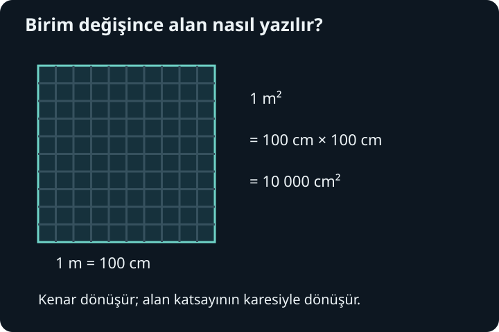
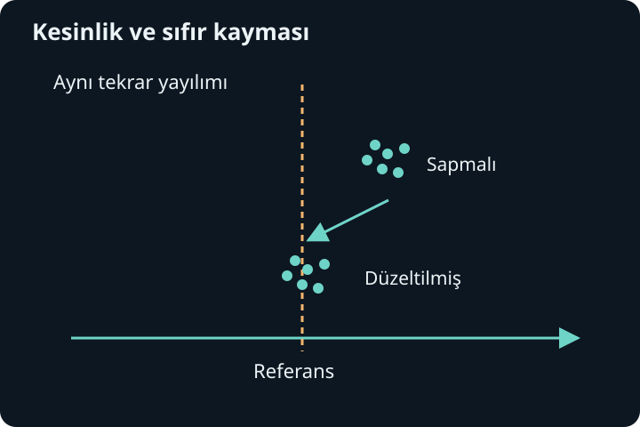

import ArticleVideo from '@/components/ArticleVideo.astro'
import kavram from './media/01-kavram.mp4?url'
import kavramPoster from './media/01-kavram.jpg?url'

Bir masanın uzunluğuna “120” demek, ölçümü henüz aktarmak değildir. 120 santimetre ile 120 milimetre farklı masalar tarif eder. Üstelik cetvelin çizgileri, masanın hangi kenarının ölçüldüğü ve sonucu okuyan kişinin yöntemi de önemlidir. Fizik, sayılara bu bağlamı ekleyerek başlar: Ne ölçüyoruz, neyle karşılaştırıyoruz ve sonuca ne kadar güveniyoruz?

Matematik boyunca sayılar, fonksiyonlar, türevler ve olasılık dağılımları kurduk. Şimdi bu yapıların dünyadaki olaylarla bağını kuracağız. [Dağılımlar yazısındaki](/blog/rastgele-degiskenler-ve-dagilimlar/) ortalama ve standart sapma burada yeniden karşımıza çıkacak. Ön bilgiyi hatırlamak yeterli: Ortalama bir merkezin, standart sapma ise o merkez çevresindeki yayılımın ölçüsüdür. Fiziksel bir modelin doğruluğu yalnız güzel cebirden gelmez; modelin ölçümlerle karşılaştırılması gerekir.

## 1. Nicelik, sayı ve birim

**Fiziksel nicelik**, büyüklüğünü ölçmeye veya ölçümlerden hesaplamaya çalıştığımız özelliktir. Uzunluk, süre ve kütle örnektir. Bir niceliği belirli bir birimin katı olarak yazarız:

$$
\ell=1{,}20\,\mathrm m=120\,\mathrm{cm}.
$$

Burada $\ell$ uzunluğu, $\mathrm m$ metre birimini gösterir. Aynı uzunluk korunurken sayısal değer değişti. Birim seçmek, nesneyi büyütmek veya küçültmek değildir; karşılaştırma ölçeğini değiştirmektir. Denklemdeki harfin biçimi de önemlidir: Kütle için kullanılan $m$ değişkeni ile metre biriminin düz yazılan $\mathrm m$ simgesi farklı görev taşır.

Uluslararası Birimler Sistemi, kısaca **SI**, ölçümleri ortak bir dilde ifade eder. Yedi temel birim vardır: süre için saniye, uzunluk için metre, kütle için kilogram, elektrik akımı için amper, termodinamik sıcaklık için kelvin, madde miktarı için mol ve ışık şiddeti için kandela. Simgeleri sırasıyla $\mathrm s$, $\mathrm m$, $\mathrm{kg}$, $\mathrm A$, $\mathrm K$, $\mathrm{mol}$ ve $\mathrm{cd}$ biçimindedir. Bu niceliklerin tümünün fiziksel anlamını bugün ayrıntılandırmak gerekmiyor; ihtiyaç duydukça akımı ve sıcaklığı ayrıca kuracağız. SI listesinin resmi karşılığı [BIPM temel birimler sayfasında](https://www.bipm.org/en/measurement-units/si-base-units) bulunur.

Temel birim demek, diğerlerinden daha gerçek veya daha önemli birim demek değildir. Seçilen sistemin yapı taşını anlatır. Alan metre kare, hacim metre küp, sürat metre bölü saniye ile ifade edilir. Bunlar temel birimlerin çarpımından ve bölümünden oluşan **türetilmiş birimlerdir**. Günümüzde SI tanımları sabitlerin belirlenmiş sayısal değerlerine dayanır. Tanımın kesin olması, bu birimi laboratuvarda gerçekleştiren her ölçümün belirsizliğinin sıfır olduğu anlamına gelmez.

## 2. Dönüşümü bir denklem olarak yapmak

Birim dönüştürürken ezberlenmiş bir ok yönü yerine değeri bir olan oranlardan yararlanabiliriz. Bir saatin 3600 saniye, bir kilometrenin 1000 metre olduğunu kullanalım:

$$
72\,\frac{\mathrm{km}}{\mathrm h}
\times\frac{1000\,\mathrm m}{1\,\mathrm{km}}
\times\frac{1\,\mathrm h}{3600\,\mathrm s}
=20\,\frac{\mathrm m}{\mathrm s}.
$$

Kilometre ve saat birimleri sadeleşti. Çarptığımız oranlar aynı büyüklüğün iki yazılışını karşılaştırdığı için niceliği değiştirmedi. Sonucun birimi istediğimiz gibi çıkmıyorsa dönüşüm oranlarından birini ters yazmış olabiliriz. Bu yöntem, uzun bir hesapta unutulan katsayıları görmemizi kolaylaştırır.

Alan dönüşümünde uzunluk dönüşümünün karesini almak gerekir. Bir santimetre metrenin yüzde biri olduğundan:

$$
1\,\mathrm{cm}^2=(10^{-2}\,\mathrm m)^2
=10^{-4}\,\mathrm m^2.
$$

Hacimde üçüncü kuvvet gelir: Bir santimetre küp, metreküpün milyonda biridir. “Santimetreden metreye yüzle böleriz” cümlesini bütün niceliklere uygulamak bu yüzden hata üretir. Önce niceliğin uzunluk mu, alan mı, hacim mi olduğunu belirleriz.

Bilimsel gösterim de birim dönüşümünün eşlikçisidir. $0{,}000032\,\mathrm m$ uzunluğu $3{,}2\times10^{-5}\,\mathrm m$ veya $32\,\mathrm{\mu m}$ yazılabilir; mikro öneki $10^{-6}$ çarpanını taşır. Bu üç yazım aynı değerdir. Ölçekteki büyük farkları görünür kıldığı için bilimsel gösterim, atomları veya gezegenleri ele alırken yalnız bir yazım kolaylığı olmaktan çıkar.

## 3. Boyut analizi neyi kontrol eder?

Birim ile **boyut** aynı değildir. Metre ve santimetre ayrı birimlerdir ama ikisi de uzunluk boyutuna sahiptir. Boyutları göstermek için uzunluğa $L$, zamana $T$, kütleye $M$ diyelim. Köşeli parantez bir niceliğin boyutunu göstersin. Sürat $v$, yolun zamana oranı olduğu için:

$$
[v]=LT^{-1}.
$$

İleride ivmenin hız değişiminin zamana oranı olduğunu kuracağız. Şimdilik yalnız bu tanımdan $[a]=LT^{-2}$ çıkar. Bir fizik denkleminde toplanan terimler aynı boyutta olmalıdır. Metreye saniye eklemek bir ölçüm işlemi tanımlamaz. Buna karşılık metreyi saniyeye bölmek anlamlı bir yeni nicelik kurabilir.

Bir hareket için $x=x_0+vt$ önerildiğinde $x$ ve $x_0$ uzunluk, $vt$ ise $(LT^{-1})T=L$ boyutundadır. Denklem boyut denetiminden geçer. $x=x_0+v/t$ yazımı geçmez. Fakat denetimden geçmek doğruluğun kanıtı değildir: $x=x_0+7vt$ de aynı boyutlara sahiptir. Yedi katsayısının uygun olup olmadığını boyut analizi söyleyemez; hareket modeli ve başlangıç bilgileri söylemelidir.

Aynı nedenle üstel fonksiyonun içine gelişigüzel birimli sayı koymayız. $e^{-t/\tau}$ yazımında hem $t$ hem $\tau$ süre ise oran boyutsuzdur. $e^{-t}$ ifadesi ise kullanılan zaman ölçeği açıklanmadan fiziksel olarak eksiktir. Logaritmada da $\ln(\ell/\ell_0)$ gibi aynı boyutlu iki uzunluğun oranı doğaldır. Sayısal hesapta birimler görünmese bile fiziksel modelde gizlice var olmaları gerekir.

Radyan bu konuda öğreticidir. Açıyı yay uzunluğunun yarıçapa oranı olarak $\theta=s/r$ tanımladığımızda boyutlar sadeleşir. Radyan boyutsuz türetilmiş birimdir; yine de “rad” yazmak sayının açı olduğunu anlatır. Boyutsuz olmak, bütün boyutsuz niceliklerin aynı fiziksel anlama sahip olması demek değildir. Bir olasılık, bir kırılma indisi ve bir açı farklı soruların cevaplarıdır.

## 4. Model gerçekliğin seçilmiş bir anlatımıdır

Bir topun hareketini tarif ederken topun her noktasını izlemek zorunda değiliz. Boyutu, ilgilendiğimiz mesafeye göre küçükse kütlesini tek bir noktada toplanmış gibi temsil edebiliriz. Bu **noktasal parçacık modeli**, topun gerçekten hacimsiz olduğunu iddia etmez. Topun dönmesi veya biçim değiştirmesi sonucu belirgin biçimde etkiliyorsa modelin kapsamı daralır ve ek bilgi gerekir.

Benzer biçimde “hava direncini ihmal ediyoruz” demek havanın olmadığını söylemek değildir. Havanın etkisinin bu hesapta küçük kabul edildiğini söylemektir. Ağır ve küçük bir bilye ile geniş bir kâğıdın düşüşü aynı ihmalden eşit derecede yararlanmaz. Varsayımı yalnız başlangıçta yazıp unutmak yerine, sonucun hangi koşullarda kullanılabileceğiyle birlikte düşünmeliyiz.

Ölçümde bir **referans sistemi** de seçeriz. Masadaki bir fincan masaya göre dururken hareket eden bir trenin içindeyse yere göre hareket eder. “Konum sıfır” cümlesi başlangıç noktasının, “hız sıfır” cümlesi referans sisteminin belirtilmesini gerektirir. Koordinat seçimi fizik yasalarını değiştirmez fakat niceliklerin sayısal değerlerini değiştirebilir. İyi bir hesap önce koordinat yönünü ve zaman başlangıcını açıklar.

Modeli değerlendirmek için yalnız tek bir sayının tutmasına bakmayız. Farklı başlangıçlarda, farklı ölçeklerde ve ölçüm belirsizlikleri içinde aynı düzenin sürüp sürmediğini araştırırız. Başarısızlık her zaman cebir hatası değildir; ihmal edilen bir etki önemli hale gelmiş olabilir. Deney ile tahmin arasındaki fark, modelin nereye kadar kullanılabildiğini anlamanın yoludur.

## 5. Tekrarlanan ölçümler neden farklı çıkar?

Aynı masayı birkaç kez ölçtüğümüzde son basamaklar değişebilir. Gözün hizası, cetvelin yerleşimi, nesnenin sıcaklığı veya aletin çözünürlüğü sonuçta rol oynar. **Rastgele etkiler**, tekrarlarda dağılım oluşturur. **Sistematik etkiler** ise yöntemi benzer yönde etkiler: Sıfır çizgisi kaymış bir cetvel, bütün okumaları yaklaşık aynı miktarda kaydırabilir.

Ölçümlerin birbirine yakınlığına **kesinlik**, kabul edilen referans değere yakınlığına **doğruluk** diyeceğiz. Çok dar bir kümelenme, kümenin doğru yerde olduğunu tek başına göstermez. Alet her ölçümde iki milimetre fazla okuyorsa yüz tekrar ortalamayı bu sapmadan kurtarmaz. Kalibrasyon, aletin davranışını uygun bir referansla karşılaştırarak bu tür etkileri değerlendirmeye yardım eder.

**Belirsizlik**, ölçüm sonucuna atfedilebilecek değerlerin yayılımını nicel olarak ifade eder. Hata ile aynı sözcük değildir. Hata, ölçüm sonucu ile referans değer arasındaki fark olarak tanımlanabilir; gerçek farkı çoğu zaman tam olarak bilmeyiz. Belirsizlik ise elimizdeki bilgiye dayanarak raporladığımız nicel değerlendirmedir. Bildiğimiz sistematik sapmayı düzeltmek gerekir; düzeltmenin kendisi de belirsizlik taşıyabilir.

Bir aletin ekranda çok basamak göstermesi küçük belirsizlik garantisi değildir. Ekranın son basamağı çözünürlüğü anlatır; kalibrasyon, ortam ve yöntem başka katkılar getirir. Aynı biçimde üç ölçümün aynı çıkması da bütün olası belirsizlik kaynaklarının ortadan kalktığını göstermez. Fiziksel bilgi, yalnız ekrandaki sayıdan değil ölçüm düzeninin anlaşılmasından gelir.

<ArticleVideo src={kavram} poster={kavramPoster} title="Saçılma ile ortak sapmayı ayırmak" caption="Referans değeri 10 olan ölçüm kümesindeki ortak 0,7 sapması düzeltilir. Noktalar birlikte kayarken aralarındaki saçılma korunur." />

## 6. Hesaplanan sonucun belirsizliği

Bir dikdörtgenin kenarlarını ölçüp alanını hesapladığımızda, kenarlardaki belirsizlik alana taşınır. Önce küçük değişimin anlamına bakalım. $A=ab$ ifadesinde $a$ biraz $\delta a$ kadar değişirken $b$ sabitse, alan yaklaşık $b\,\delta a$ kadar değişir. İki kenar değişince birinci mertebe yaklaşım:

$$
\delta A\approx b\,\delta a+a\,\delta b
$$

olur. Burada çarpımın ikinci mertebedeki küçük katkısını ihmal ettik. Bu, [çok değişkenli türevde](/blog/cok-degiskenli-fonksiyonlar-ve-turev/) kurduğumuz yerel doğrusallaştırmadır. Fakat standart belirsizlikleri toplarken değişimlerin işaretini kesin biliyormuş gibi davranamayız.

Girdilerin belirsizlikleri bağımsızsa ve küçükse, $u_a$ ile $u_b$ standart belirsizlikleri için:

$$
u_A\approx\sqrt{b^2u_a^2+a^2u_b^2}.
$$

Kareleri toplama kuralı, bağımsız rastgele katkıların varyanslarının toplanmasından gelir. Genel bir $y=f(x_1,\ldots,x_n)$ hesabında her katkıyı kısmi türevle, yani sonucun girdiye duyarlılığıyla çarparız. Girdiler ilişkiliyse kovaryans katkıları gerekir; bu basit köklü toplam yeterli olmayabilir. NIST'in [birleşik belirsizlik açıklaması](https://physics.nist.gov/cuu/Uncertainty/combination.html) bu koşulu özellikle ayırır.

Şimdi bağımsız değerlendirildiğini varsaydığımız iki uzunluk kullanalım: $a=2{,}00\,\mathrm m$, $u_a=0{,}01\,\mathrm m$; $b=3{,}00\,\mathrm m$, $u_b=0{,}02\,\mathrm m$. Merkez değer $A=6{,}00\,\mathrm m^2$ olur. İki katkı:

$$
bu_a=0{,}03\,\mathrm m^2,\qquad au_b=0{,}04\,\mathrm m^2
$$

ve sonuç:

$$
u_A=\sqrt{0{,}03^2+0{,}04^2}\,\mathrm m^2
=0{,}05\,\mathrm m^2
$$

olarak bulunur. Alanı $A=(6{,}00\pm0{,}05)\,\mathrm m^2$ diye raporlayabiliriz; artı eksi işaretinin burada bir standart belirsizliği temsil ettiğini ayrıca söyledik. Bu aralık kesin bir alt ve üst sınır değildir. Yaklaşık normal bir dağılım ve güvenilir standart sapma değerlendirmesi altında bir standart sapmalık aralık yaklaşık yüzde 68 kapsamla ilişkilidir. Dağılım ve değerlendirme yöntemi değiştiğinde bu yorum da değişebilir.

### Aynı cetvel iki kenarı da etkilerse

Alan örneğinde bağımsızlık varsayımı bir ayrıntı değildi. İki kenarı aynı cetvelle ölçtüğümüzü ve cetvelin bütün aralıklarının gerçek değerinden biraz büyük olduğunu düşünelim. Bu durumda iki uzunluğun sayısal sonuçları birlikte etkilenir. Bir ölçümün sapması pozitifken ötekinin bağımsız biçimde negatif olmasını bekleyemeyiz. Hatanın ortak kaynağı vardır. Ortak etkinin büyüklüğünü ayrıca değerlendirmeden iki belirsizliği bağımsızmış gibi kareleriyle toplamak sonucu olduğundan güvenilir gösterebilir.

Bunu doğrudan ölçek hesabıyla görelim. İki uzunluk da gerçek değerlerinin yüzde biri kadar büyük raporlanırsa hesaplanan alan gerçek alanın $1{,}01\times1{,}01=1{,}0201$ katı çıkar. Alan sapması yaklaşık yüzde ikidir. Burada farklı yönlerde rastgele dalgalanan iki katkı değil, aynı yönde işleyen ortak bir ölçek etkisi vardır. İki ölçümün ayrı günlerde yapılmış olması bile tek başına bağımsızlık sağlamaz; aynı kalibrasyon bilgisini kullanmaları onları ilişkilendirebilir.

### Boyutları doğru, öngörüsü yanlış bir öneri

Bir nesnenin sabit süratle hareket ettiğini biliyorsak alınan yol, süre iki katına çıktığında iki katına çıkmalıdır. Şimdi boyutları uygun olan $d=v\tau(t/\tau)^2$ önerisini düşünelim. Burada $d$ yol, $v$ sürat, $t$ geçen süre ve $\tau$ seçilmiş bir referans süredir. Boyutsal çarpım yine uzunluktur. Buna rağmen öneri yolun süreyle karesel arttığını söyler; sabit sürat bilgisiyle çelişir.

Demek ki bir fizik hesabını denetlemek için birkaç farklı soru sorarız. Birimler uygun mu, başlangıç anında doğru sonuç çıkıyor mu, çok küçük değişimlerde beklenen davranış korunuyor mu ve ölçümler aynı bağıntıyı destekliyor mu? Bu kontroller birbirinin kopyası değildir. Bir denklem birinden geçip ötekinden kalabilir. Özellikle sıfır süre, sıfır başlangıç değeri veya iki kat büyütülen ölçek gibi kolay sınırlar, karmaşık hesabın içindeki yanlış varsayımı görünür hale getirir.

Ölçümün amacı da gereken ayrıntıyı belirler. Bir masanın odaya sığıp sığmadığına karar vermekle yüzeyine tam oturacak bir cam kestirmek aynı belirsizlik düzeyini gerektirmez. İlk durumda santimetre düzeyindeki bilgi yeterliyken ikinci durumda kenarların düzgünlüğü ve köşelerin dikliği önem kazanabilir. Ölçülecek niceliği açık tanımlamak bu nedenle alet seçmekten önce gelir. Eğri bir kenarın uçları arasındaki uzaklığı mı, kenar boyunca uzunluğu mu istediğimizi söylemeden daha hassas bir alet kullanmak asıl belirsizliği gidermez.

## 7. Yuvarlama ve modelin sınırları

Ara işlemlerde fazladan basamak tutup sonucu en sonda yuvarlamak, yuvarlama hatalarının birikmesini azaltır. Alan hesabımızın belirsizliği yüzde birlik metrekare basamağına kadar ifade edildiğinden merkez değeri de aynı basamağa kadar yazdık. $6{,}000000\,\mathrm m^2$ yazmak ek fiziksel bilgi sağlamaz. Öte yandan sonucu yalnız “6” diye yazmak, yapılan ölçümün çözünürlüğünü gereksiz yere gizler.

Anlamlı basamak kuralları, belirsizlik bütçesi hazırlanmadığında yararlı kısa kurallardır; ayrıntılı belirsizlik değerlendirmesinin yerini tamamen tutmaz. Tanımla kesin verilen dönüşümler, ölçülmüş verilerle aynı sınıfta değildir. Bir metreyi yüz santimetreye çevirmek ölçüm belirsizliğini yüz kat kötüleştirmez; sayısal değer ve sayısal belirsizlik birlikte ölçeklenir, göreli belirsizlik değişmez.

İzleyen yazılarda klasik mekaniği kullanacağız. Bu kuram, günlük ölçeklerde ve ışık hızına göre küçük hızlarda çok başarılı modeller sağlar. Çok yüksek hızlarda görelilik, atom ölçeğinde ise kuantum özellikleri önem kazanabilir. Kesin bir “şu boydan küçük her şey kuantumdur” sınırı çizmek yeterli değildir; hangi etkinin gözlenebildiği, enerji ölçekleri ve deney düzeni önemlidir. Bir modelin sınırlı olması değersiz olması demek değildir. Hangi soruya hangi doğrulukla cevap verdiğini bilmek, fiziği güvenilir biçimde kullanmanın parçasıdır.

Artık bir hareketi sayılarla anlatırken yalnız bir konum değeri yazmayacağız. Eksen, zaman, birim, varsayım ve ölçüm payını birlikte taşıyacağız. Sonraki adımda konumun zamanla değişiminden hız ve ivmeyi kuracağız.

## Kaynaklar

- [BIPM — SI temel birimleri](https://www.bipm.org/en/measurement-units/si-base-units): Temel nicelikler, birimler ve güncel tanım düzeni.
- [NIST — Belirsizlik bileşenlerini birleştirme](https://physics.nist.gov/cuu/Uncertainty/combination.html): Duyarlılık katsayıları, bağımsızlık koşulu ve standart belirsizlik.
