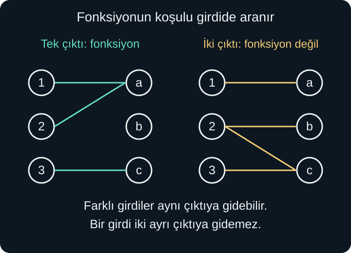
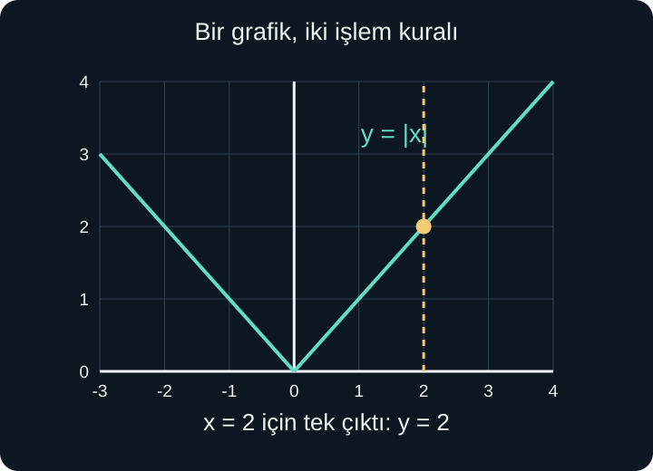

import ArticleVideo from '@/components/ArticleVideo.astro'
import kavram from './media/01-kavram.mp4?url'
import kavramPoster from './media/01-kavram.jpg?url'

Bir kutuya sayı girildiğini, kutunun bu sayının iki katına 3 ekleyerek bir sonuç verdiğini düşünelim. 4 girdiğimizde $2\times4+3=11$, 7 girdiğimizde $2\times7+3=17$ elde ederiz. Aynı sayı yeniden girildiğinde aynı kural yeniden uygulanır. Her izin verilen girdinin belirli bir çıktısı vardır.

Şimdi başka bir kutu düşünelim: 4 girildiğinde bazen 11, bazen 12 döndürüyor ve hangi ek bilgiye göre seçim yaptığı belirtilmiyor. Bu kutu, yalnızca girilen sayıdan tek bir sonuç belirlemiyor. Birinci durumu **fonksiyon** diye adlandırmamızı sağlayan temel özellik tam burada bulunur.

[Önceki yazıda](/blog/koordinatlar-uzaklik-ve-egim/) noktaları sıralı ikililerle yazmayı ve denklemleri düzlemde göstermeyi öğrendik. Burada koordinatlar, kümeler, eşitsizlikler, yerine koyma ve karekökün koşullarını kullanacağız. Fonksiyonun bir formülden daha kapsamlı bir fikir olduğunu; tablo, sözlü kural ve grafikle de tanımlanabileceğini göreceğiz.

## 1. Eşleştirme ile Başlayalım

Üç kartın üzerinde 1, 2 ve 3 sayıları yazsın. Her kartı bir renge bağlayalım: 1 maviye, 2 maviye, 3 sarıya gitsin. Her kartın tek bir rengi vardır. İki farklı kartın aynı renge gitmesi sorun oluşturmaz; fonksiyon olmak için farklı girdilerin mutlaka farklı çıktılara gitmesi gerekmez.

Bu eşleştirmeyi sıralı ikililerle $(1,\text{mavi})$, $(2,\text{mavi})$, $(3,\text{sarı})$ şeklinde kaydedebiliriz. Genel olarak iki kümenin elemanları arasında belirttiğimiz böyle eşleşmeler bir **bağıntı** oluşturur. Fonksiyon, özel koşulu olan bir bağıntıdır: tanım kümesindeki **her** girdiye **tam bir** çıktı bağlanır.

“Her” ve “tam bir” sözcükleri ayrı iş yapar. İzin verilen 3 girdisine hiç çıktı atamazsak fonksiyon tamamlanmamış olur. 2 girdisini hem mavi hem sarıyla eşleştirirsek tek çıktı koşulu bozulur. Buna karşılık kullanılmayan bir renk bulunabilir; hedefteki her rengin mutlaka kullanılması şart değildir.

Bu tanım, sayı dışındaki girdileri de kapsar. Her kitaba sayfa sayısını bağlamak bir fonksiyon olabilir. Fakat “kişiye sevdiği bütün kitapları bağlamak” ifadesinde çıktı olarak tek bir kitap bekliyorsak birden fazla seçenek çıkabilir. Çıktıyı bir kitap kümesi olarak tanımlarsak başka bir fonksiyon kurabiliriz. Girdi ve çıktı türlerinin açık olması, sözlü örneklerde de gereklidir.

<ArticleVideo src={kavram} poster={kavramPoster} title="Fonksiyonda tek çıktı koşulu" caption="Farklı girdiler aynı çıktıya ulaşabilir. Koşul, tek bir girdinin iki ayrı çıktıya ayrılmamasıdır." />

## 2. Tanım, Hedef ve Görüntü Kümeleri

Bir fonksiyonun almasına izin verilen girdilerinin kümesine **tanım kümesi** deriz. Çıktıların içinde bulunacağı baştan belirtilen kümeye **hedef küme** deriz. İzin verilen bütün girdileri kullandığımızda gerçekten ulaşılan çıktıların kümesi ise **görüntü kümesi**, yani burada kullanacağımız anlamıyla **değerler kümesidir**.

Terimler bazı kaynaklarda farklı adlandırılabilir; özellikle “değer kümesi” kimi kitaplarda hedef küme için kullanılır. Karışıklığı önlemek için bu yazıda hedef ile gerçekten elde edilen görüntüyü ayrı sözcüklerle belirtiyoruz.

Örneğin tanım kümesi $X=\{-2,-1,0,1,2\}$, hedef küme $Y=\{0,1,2,3,4,5\}$ olsun. Kuralımız her sayının karesini almak olsun. Çıktılar sırayla 4, 1, 0, 1 ve 4'tür. Görüntü kümesi $\{0,1,4\}$ olur. Bir kümede aynı elemanı tekrar yazmadığımız için 1'i ve 4'ü bir kez kaydederiz.

2, 3 ve 5 hedef kümede bulunmasına rağmen hiçbir girdiden elde edilmedi. Bu, fonksiyon tanımını bozmaz. Görüntü kümesi her zaman hedef kümenin içinde bulunmalıdır. Hedef küme yalnızca $\{0,1\}$ seçilseydi 4 çıktısı dışarıda kalır, aynı kural bu hedefle geçerli bir fonksiyon tanımlamazdı.

Fonksiyona $f$ adını verip $f:X\to Y$ yazabiliriz. Bu ifade, “$f$, $X$ tanım kümesinden $Y$ hedef kümesine giden fonksiyondur” diye okunur. Ok işareti, her $X$ elemanının bir $Y$ elemanına bağlandığını anlatır; bütün $Y$ elemanlarının kullanıldığını tek başına söylemez.

## 3. f(x) Nasıl Okunur?

Başlangıçtaki iki katını alıp 3 ekleyen kurala $f$ adını verelim. Bunu:

$$
f(x)=2x+3
$$

yazarak kısaltırız. $x$ girdi, $f$ fonksiyonun adı, $f(x)$ ise $x$ girdisine karşılık gelen çıktıdır. “Ef iks” ya da “$f$'nin $x$'teki değeri” diye okunur. Buradaki parantez **$f$ ile $x$'in çarpımı değildir**.

$f(4)$ istendiğinde kuraldaki her $x$ yerine 4 koyarız:

$$
f(4)=2\times4+3=11
$$

Negatif girdide parantez işaretleri korur: $f(-2)=2(-2)+3=-4+3=-1$. Girdi kesir de olabilir: $f(1/2)=2(1/2)+3=1+3=4$. Tanım kümesini bütün gerçek sayılar seçtiğimizde bu girdilerin hepsi uygundur.

Girdi bir ifade olduğunda da aynı yerine koyma yapılır. $f(x+1)$, “önce girdiye 1 ekle, sonra $f$ kuralını uygula” demektir:

$$
f(x+1)=2(x+1)+3=2x+5
$$

Buna karşılık $f(x)+1=(2x+3)+1=2x+4$ olur. İlkinde fonksiyona verilen girdi, ikincisinde çıktı değiştirilmiştir. Parantezin içi ve dışı farklı görev taşır. Bu ayrımı ileride fonksiyon dönüşümlerinde ayrıntılı kullanacağız.

## 4. Değer Hesaplamak ile Denklem Çözmek

$f(x)=2x+3$ için $f(5)$ sorusu girdiyi verir ve çıktıyı ister. İşlem doğrudan $2\times5+3=13$ olur. Buna karşılık $f(x)=13$ sorusu çıktıyı verir ve onu üreten girdiyi arar. Artık $2x+3=13$ denklemini çözeriz: önce iki taraftan 3 çıkarıp $2x=10$, sonra ikiye bölüp $x=5$ buluruz.

Fonksiyonun tek çıktı koşulu, verilen bir çıktıya mutlaka tek girdi karşılık geleceği anlamına gelmez. $g(x)=x^2$ için $g(x)=9$ denklemini düşünelim. Hem $x=3$ hem $x=-3$ aynı 9 çıktısını verir. Her bir girdinin kendi çıktısı tektir; bu yüzden $g$ yine fonksiyondur.

Bazen istenen çıktı hiç elde edilmez. Gerçek sayılarda $x^2=-1$ denkleminin çözümü yoktur. Bu durum da kare alma kuralının fonksiyon olmasına engel değildir. Hangi çıktıların elde edilebildiğini görüntü kümesiyle ifade ederiz: gerçek girdilerle kare alma fonksiyonunun görüntüsü $[0,\infty)$ aralığıdır.

## 5. Aynı Fonksiyonu Tablo ve Grafikle Anlatmak

$f(x)=2x+3$ kuralı için küçük bir tablo oluşturalım:

| Girdi $x$ | Çıktı $f(x)$ | Grafikteki nokta |
| --- | --- | --- |
| $-1$ | $1$ | $(-1,1)$ |
| $0$ | $3$ | $(0,3)$ |
| $1$ | $5$ | $(1,5)$ |
| $2$ | $7$ | $(2,7)$ |

Grafikte yatay eksene girdiyi, düşey eksene çıktıyı koyarız. Fonksiyonun grafiği, izin verilen bütün $x$ girdileri için $(x,f(x))$ noktalarının topluluğudur. Bu örnekte $y=2x+3$ doğrusu oluşur. Eğer tanım kümesini yalnızca tablodaki dört sayıyla sınırlarsak grafik dört noktadan ibaret olur; aralarını doldurmayız.

Bir kural verildiğinde tablo o kuralın bazı sonuçlarını gösterir. Ancak yalnızca birkaç ölçüm verilmişse aradaki bütün değerleri kesin bildiğimizi söyleyemeyiz. Örneğin $x=0$ ve $x=1$ noktalarında hem $f(x)=x$ hem $g(x)=x^2$ aynı sonuçları verir. $x=2$ için biri 2, diğeri 4 olur. İki nokta, kuralın doğrusal olduğu ayrıca bilinmeden tüm fonksiyonu belirlemez.

Bu ayrım veri grafiklerinde önemlidir. Ölçülmüş noktaları çizgiyle birleştirmek, aradaki davranışa ilişkin bir varsayım ekleyebilir. Kuralın nereden geldiğini, hangi aralıkta kullanılacağını ve çizginin ölçüm mü model mi anlattığını belirtiriz.

## 6. Düşey Doğru Testi

Bir çizimin $y$'yi $x$'in fonksiyonu olarak gösterip göstermediğini kontrol edebiliriz. Sabit bir $x$ seçmek, düzlemde o yatay koordinattan geçen düşey doğruyu seçmektir. Düşey doğru grafiği iki farklı noktada keserse aynı girdiye iki farklı çıktı karşılık gelir; tek çıktı koşulu bozulur.

Bu gözleme **düşey doğru testi** denir. Tanım kümesindeki her $x$ için tam bir kesişim bulunmalıdır. Tanım kümesi dışında kalan $x$ değerlerinde hiç kesişim olmaması sorun değildir. Örneğin $y=\sqrt{x}$ grafiğinde negatif $x$ girdileri gerçek sayılarla tanımlı değildir; bu değerleri tanım kümesine almıyoruz.

$y^2=x$ bağıntısında $x=4$ seçersek $y=2$ ve $y=-2$ elde ederiz. Bütün bağıntıyı tek bir $y=f(x)$ fonksiyonu olarak okuyamayız. Fakat üst dalı $y=\sqrt{x}$, alt dalı $y=-\sqrt{x}$ diye ayrı ayrı seçebiliriz. Her biri $[0,\infty)$ tanım kümesinde bir fonksiyondur.

Dikey doğru $x=2$ de $y$'yi $x$'in fonksiyonu yapmaz; 2 girdisi karşısında çok sayıda $y$ bulunur. Buna karşılık yatay doğru $y=2$ bir fonksiyondur: bütün gerçek girdilere aynı 2 çıktısını verir. Fonksiyon olmak, mutlaka değişen çıktılar üretmek değildir.

## 7. Formülün İzin Vermediği Girdiler

Bir fonksiyon yalnızca formülüyle verilip başka tanım kümesi belirtilmezse, gerçek sayılarda işlemlerin anlamlı olduğu en geniş kümeyi ararız. Bu, her zaman bütün gerçek sayılar değildir. Özellikle payda ve çift dereceli kökler koşul getirir.

$f(x)=1/(x-3)$ için payda sıfır olamaz. Dolayısıyla $x-3\ne0$, yani $x\ne3$ gerekir. Tanım kümesi $(-\infty,3)\cup(3,\infty)$ olur. Birleşim işareti $\cup$, 3'ün iki yanındaki aralıkları birlikte aldığımızı belirtir.

$g(x)=\sqrt{x+2}$ için kök altı negatif olamaz: $x+2\ge0$, yani $x\ge-2$. Tanım kümesi $[-2,\infty)$ olur. $-2$ girdisi geçerlidir; kök altında sıfır olduğunda sonuç sıfırdır.

İki koşul birlikte bulunursa ikisini de aynı anda sağlamalıyız:

$$
h(x)=\frac{\sqrt{x-1}}{x-3}
$$

Kök için $x\ge1$, payda için $x\ne3$ gerekir. Tanım kümesi $[1,3)\cup(3,\infty)$ olur. 1 dahil, 3 hariçtir. İki ayrı koşulu birbirine karıştırıp yalnızca birini uygulamak fonksiyona geçersiz girdiler ekler.

Sadeleştirme de başlangıçtaki kısıtı kendiliğinden kaldırmaz. $(x^2-1)/(x-1)$ ifadesi, $x\ne1$ koşuluyla $x+1$'e sadeleşir. İlk fonksiyon 1'de tanımsız, $x+1$ kuralıyla bütün gerçek sayılarda tanımlanan başka bir fonksiyon ise 1'de 2 değerini alır. Formüllerin izin verilen yerde aynı değerleri vermesi, tanım kümeleri farklıyken fonksiyonları tamamen aynı yapmaz.

## 8. Parçalı Fonksiyonlar

Bir kuralın bütün girdilerde aynı işlem biçimini kullanması gerekmez. Mutlak değer buna iyi bir örnektir. Pozitif sayının sıfıra uzaklığı kendisidir; negatif sayının uzaklığı işaretini değiştirince elde edilir:

$$
|x|=\begin{cases}
-x,&x<0,\\
x,&x\ge0.
\end{cases}
$$

Büyük süslü ayraç seçenekleri, sağdaki koşullar hangi seçeneği kullanacağımızı gösterir. $x=-3$ için ilk satır seçilir ve $-(-3)=3$ bulunur. $x=2$ için ikinci satır seçilir ve 2 bulunur. $x=0$ ikinci satıra dahildir; çıktı 0 olur.

İki farklı ifade bulunduğu hâlde fonksiyonun tek çıktı koşulu korunur; çünkü hangi girdinin hangi satırı kullanacağı bellidir. Parçalı kurallarda aralıkların sınırları bu nedenle dikkatle yazılır. Bir sınır noktası iki satırda yer alıp farklı çıktılar verirse çelişki oluşur; hiçbir satırda yer almazsa o nokta tanım kümesinden dışarıda kalır.

Bir depoda ilk 2 saat için 30 birim, sonraki her saat için ek 8 birim ücret alındığını, saat kesirlerinin aynı oranla hesaplandığını varsayalım. Kullanım süresi $t>0$ olmak üzere ücret:

$$
U(t)=\begin{cases}
30,&0<t\le2,\\
30+8(t-2),&t>2.
\end{cases}
$$

Üç saat için önce iki saatten sonraki süreyi buluruz: $3-2=1$. Ek ücret 8, toplam ücret 38 olur. İkinci satırda $8t$ yazsaydık ilk iki saati yeniden ücretlendirmiş olurduk. Sıfır saatlik kullanım bu modelin tanım kümesine alınmamıştır; ayrıca bir kural verilirse eklenebilir.

## 9. Kökleri ve Eksen Kesişimlerini Okumak

Bir fonksiyonun **sıfırı**, çıktıyı sıfır yapan girdidir. Yani $f(x)=0$ denkleminin çözümünü ararız. Grafikte bu, yatay eksene değen veya onu kesen noktaların yatay koordinatlarını bulmaktır. Denklem bağlamında bu çözümlere kök de deriz.

$f(x)=2x+3$ için $2x+3=0$ eşitliğinden $2x=-3$, dolayısıyla $x=-3/2$ çıkar. Fonksiyonun sıfırı $-3/2$ sayısıdır; grafiğin yatay eksen kesişimi ise $(-3/2,0)$ noktasıdır. Bir sayı ile bir noktayı aynı şey gibi yazmamak gösterimi açık tutar.

Düşey eksen kesişimi başka bir sorudur: girdi sıfır olduğunda çıktı nedir? Eğer 0 tanım kümesindeyse $f(0)$ hesaplanır. Burada $f(0)=3$, kesişim $(0,3)$ olur. Tanım kümesi 0'ı içermiyorsa düşey eksen kesişimi bulunmayabilir.

Fonksiyonun sıfırları için yalnızca formülün denklemini çözmek yetmez; aday girdilerin tanım kümesinde olması gerekir. Kısaltılmış ifadenin kökü, başlangıçta yasaklanan bir girdiye denk gelirse gerçek fonksiyonun sıfırı sayılmaz.

## 10. Artmayı, Azalmayı ve İşareti Ayırmak

Bir aralıkta girdi büyüdükçe çıktı da büyüyorsa fonksiyon o aralıkta **artandır**. Daha açık biçimde, aralıkta $x_1<x_2$ seçildiğinde $f(x_1)<f(x_2)$ olmalıdır. Girdi büyürken çıktı küçülüyorsa fonksiyon **azalandır**. Çıktı aynı kalıyorsa sabittir.

Artan olmakla pozitif olmak aynı şey değildir. $f(x)=x-10$ fonksiyonu 1'den 2'ye giderken $-9$'dan $-8$'e yükselir. Çıktılar negatiftir ama fonksiyon artmaktadır. $g(x)=10-x$ ise 1'den 2'ye giderken 9'dan 8'e iner; çıktılar pozitifken fonksiyon azalmaktadır.

Mutlak değer fonksiyonu bütün gerçek sayılarda tek yönde değişmez. Negatif tarafta $-3,-2,-1$ girdileri 3,2,1 çıktılarını verir; sıfıra doğru gelirken azalır. Pozitif tarafta 1,2,3 girdileri 1,2,3 çıktılarını verir; artar. Bu yüzden davranışı aralıklara ayırarak anlatırız.

## 11. Formül Aynı Kalsa da Modelin Tanım Kümesi Değişebilir

Bir kutuda 6 kalem olduğunu varsayalım. $n$ kutudaki kalem sayısını $K(n)=6n$ ile hesaplarız. Kutuları tam olarak sayıyorsak $n$ için 0, 1, 2, 3 gibi negatif olmayan tam sayıları seçeriz. $n=1{,}5$ formülde aritmetik olarak hesaplanabilir; fakat yalnızca bütün kutuların sayıldığı modelimizin izin verdiği bir girdi değildir. Cebirsel işlem yapılabilmesi, girdinin bağlama uygun olmasını tek başına sağlamaz.

Başka bir durumda bir musluğun sabit hızla dakikada 6 litre su verdiğini düşünelim. Geçen süre $t$ dakika olsun. $S(t)=6t$ ifadesi aynı çarpma kuralını kullanır; ancak bu kez yarım dakika anlamlıdır. $S(0{,}5)=3$ litre olur. Musluk beş dakika sonra kapatılıyorsa bu kuralı $0\le t\le5$ aralığında kullanırız. Süreyi daha ileri uzatıp aynı hızın devam ettiğini söylemek ek varsayım gerektirir.

Kalem modelinin grafiğinde yalnızca belirli aralıklarla noktalar bulunur. Süre modelinin grafiğinde, kabul ettiğimiz ideal sabit akış boyunca bu noktaların arasındaki girdiler de tanımlıdır. Ayrık değerler ile bir aralıktaki bütün gerçek değerler arasındaki fark, çizgiyi ne zaman doldurabileceğimizi belirler.

Aynı örnek görüntü kümesini de açıklar. Beş dakika çalışan muslukta 0 ile 30 litre arasındaki değerler elde edilir. Bütün kutu sayıları serbest olan kalem modelinde ise yalnızca 0, 6, 12, 18 gibi değerler çıkar. Formülde aynı 6 çarpanı bulunsa da iki fonksiyonun girdileri ve görüntüleri farklıdır. Bir modeli tanımlarken “kural nedir?” sorusuna ek olarak “hangi girdiler geçerlidir?” sorusunu da cevaplamamızın nedeni budur.

Bir grafiği okurken sırayla yatay eksenin neyi gösterdiğini, hangi girdilerin izinli olduğunu, düşey eksenin birimini, sıfırları ve artma-azalma aralıklarını belirleyebiliriz. Bu sorular, şeklin yalnızca “yukarı giden bir çizgi” olarak görülmesini engeller. Bir sonraki yazıda doğru ve parabolün bu davranışlarını formülleriyle ilişkilendireceğiz.

## Kaynakça

Anlatım ve örnekler özgün hazırlanmıştır. Tanım ve gösterim koşulları için kaynak bölümleri 8 Ekim 2026 tarihinde kontrol edildi.

- [OpenStax — Precalculus 2e, 1.1: Functions and Function Notation](https://openstax.org/books/precalculus-2e/pages/1-1-functions-and-function-notation): Tek çıktı koşulu, fonksiyon gösterimi ve düşey doğru testi için.
- [OpenStax — Precalculus 2e, 1.3: Rates of Change and Behavior of Graphs](https://openstax.org/books/precalculus-2e/pages/1-3-rates-of-change-and-behavior-of-graphs): Grafik üzerinde artma, azalma ve değişim yorumlarını kontrol etmek için.
- [OpenStax — Precalculus 2e, 1.4: Composition of Functions](https://openstax.org/books/precalculus-2e/pages/1-4-composition-of-functions): İfadelerle işlem yaparken tanım kümesi kısıtlarının korunması için.

- [OpenStax — Precalculus 2e, 1.2: Domain and Range](https://openstax.org/books/precalculus-2e/pages/1-2-domain-and-range): Kök, payda ve bağlam kaynaklı tanım kümesi kısıtları ile parçalı fonksiyonlar için.
