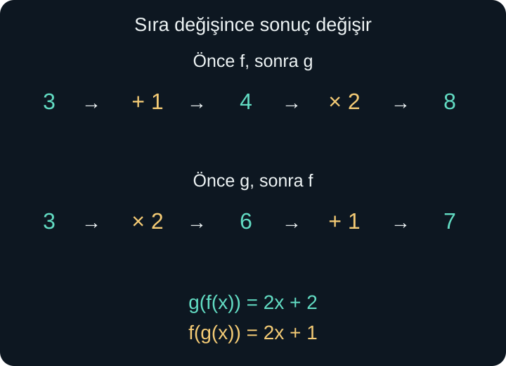
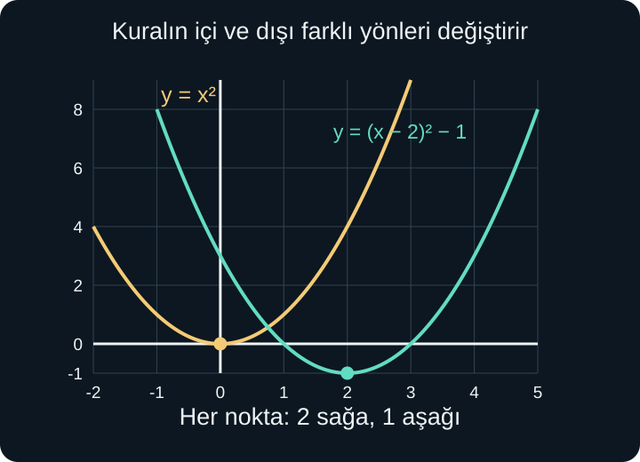

import ArticleVideo from '@/components/ArticleVideo.astro'
import kavram from './media/01-kavram.mp4?url'
import kavramPoster from './media/01-kavram.jpg?url'

Bir sayıya önce 1 ekleyip sonra sonucu 2 ile çarpalım. Başlangıç sayısı 3 ise önce 4, ardından 8 elde ederiz. Şimdi sırayı ters çevirelim: önce 3'ü ikiyle çarpıp 6 bulur, sonra 1 ekleyerek 7'ye ulaşırız. Aynı iki işlem kullanıldı; fakat sonuç değişti.

Fonksiyonlarla çalışırken bu sırayı açıkça kaydetmek isteriz. Bir fonksiyonun çıktısını başka birine girdi yapmak, iki çıktıyı toplamak ve bir işlemi geri almak farklı görevlerdir. Bu yazıda bu görevleri birbirinden ayıracak, ardından aynı düşünceyi grafiklerin taşınmasına uygulayacağız.

[Önceki yazıda](/blog/dogrusal-ve-ikinci-derece-fonksiyonlar/) doğruları ve parabolleri tanıdık. Burada fonksiyon gösterimi, tanım ve görüntü kümeleri, denklem çözme, karekök ve koordinatlar gerekecek. Özellikle bir ifadenin sadeleşmesinin başlangıçtaki yasak girdileri kendiliğinden ortadan kaldırmadığını hatırlayacağız.

## 1. Aynı Girdinin İki Çıktısıyla İşlem Yapmak

$f(x)=x+1$ ve $g(x)=2x$ olsun. Aynı $x=3$ girdisi için $f(3)=4$, $g(3)=6$ buluruz. Bu iki çıktıyı toplamak istersek $4+6=10$ elde ederiz. Yeni fonksiyonu $(f+g)(x)=f(x)+g(x)$ biçiminde tanımlarız. Parantez içindeki $f+g$, toplama yoluyla oluşturduğumuz fonksiyonun adıdır.

Bu örnekte:

$$
(f+g)(x)=(x+1)+2x=3x+1
$$

Benzer biçimde fark $(f-g)(x)=f(x)-g(x)=1-x$, çarpım ise $(fg)(x)=f(x)g(x)=2x(x+1)$ olur. Burada $fg$ **çıktıların çarpımını** gösterir. Bir fonksiyonun diğerine uygulanması için birazdan farklı bir işaret kullanacağız.

Bu işlemlerde aynı girdinin iki fonksiyona da verilebilmesi gerekir. Dolayısıyla başlangıçtaki tanım kümelerinin kesişimini alırız. Birinde izinli, diğerinde yasak olan girdiyle iki çıktıyı toplayamayız. Formül kısa görünse de, girdinin uygunluğu işlemden önce gelir.

Örneğin $p(x)=\sqrt{x-1}$ ve $q(x)=1/(x-2)$ olsun. $p$ için $x\ge1$, $q$ için $x\ne2$ gerekir. Toplam, fark ve çarpımın doğal tanım kümesi $[1,2)\cup(2,\infty)$ olur. Bu sonuç, iki fonksiyonun koşullarını aynı anda sağlamaktan gelir.

## 2. Bölümde Ek Bir Koşul

Fonksiyonların bölümünü:

$$
\left(\frac fg\right)(x)=\frac{f(x)}{g(x)}
$$

şeklinde tanımlarız. Girdinin iki tanım kümesinde bulunmasına ek olarak **paydadaki çıktı sıfır olmamalıdır**. Burada yasaklanan yalnızca $x=0$ değildir; $g(x)$'i sıfır yapan bütün girdiler dışarıda kalır.

$f(x)=\sqrt{x-1}$ ve $g(x)=x-2$ seçelim. İlk fonksiyon $x\ge1$ ister, ikinci bütün gerçek sayılarda tanımlıdır. Bölümde ayrıca $x-2\ne0$ gerekir. Sonuç yine $[1,2)\cup(2,\infty)$ olur. Ters bölüm $g/f$ için ise $\sqrt{x-1}\ne0$, yani $x>1$ gerekir. Bölümün yönü koşulu değiştirmiştir.

Bir başka örnekte $f(x)=x^2-1$, $g(x)=x-1$ olsun. Bölüm $(x^2-1)/(x-1)$, $x\ne1$ koşuluyla $x+1$ olur. Ancak sadeleşmeden sonra 1 girdisini geri eklemeyiz. Elde ettiğimiz fonksiyon, 1 girdisi eksik olan bir doğru grafiğine sahiptir. O noktayı sonradan doldurmak yeni bir tanımlama olur.

## 3. Bileşke: Çıktıyı Yeniden Girdi Yapmak

Başlangıçtaki iki kurala dönelim: $f(x)=x+1$, $g(x)=2x$. Önce $f$ uygulanırsa $x+1$ elde edilir. Sonra bu sonucun tamamı $g$'ye verilir:

$$
g(f(x))=2(x+1)=2x+2
$$

Bu yeni fonksiyona **bileşke** deriz. $g\circ f$ gösterimi kullanılır; ortadaki küçük daire “bileşke” diye okunur. $(g\circ f)(x)=g(f(x))$ ifadesinde **sağdaki fonksiyon önce uygulanır**. İçteki işlem sonucu, dıştaki fonksiyona girdi olur.

Ters sıra ise:

$$
f(g(x))=2x+1
$$

verir. $x=3$ için ilk sıra 8, ikinci sıra 7 üretir. Demek ki genel olarak $g\circ f$ ile $f\circ g$ aynı fonksiyon değildir. İki çıktıyı topladığımız $(f+g)(3)=10$ veya çarptığımız $(fg)(3)=24$ de bileşkelerden farklıdır.

<ArticleVideo src={kavram} poster={kavramPoster} title="Bileşkede işlem sırası" caption="3 girdisi, önce +1 sonra ×2 yolunda 8 olur. Aynı işlemleri ters sırada uygulayınca 7 elde edilir." />

Bileşke gösterimi karmaşık görünen kuralları küçük parçalara ayırmayı da sağlar. $(2x+3)^2$ ifadesinde önce $x\mapsto2x+3$, sonra çıkan sayıyı kareye götüren kural uygulanır. $\mapsto$ işareti burada “şuna gönderilir” anlamındadır. İfadeyi hangi işlem adımlarının oluşturduğunu görmek, geri alma ve tanım kümesi sorularında işe yarar.

## 4. Bileşkenin Tanım Kümesi

Bileşkede iki fonksiyonun tanım kümelerini doğrudan kesiştirmek yeterli değildir. Önce içteki fonksiyonun girdisi uygun olmalı; sonra onun **çıktısı**, dıştaki fonksiyon için uygun girdi olmalıdır.

$f(x)=x-3$, $g(u)=\sqrt{u}$ olsun. Dış fonksiyonda $u$ harfini kullanmamız yeni bir sayı türü yaratmaz; yalnızca oraya bir sonuç yerleştirileceğini görünür kılar. $g(f(x))=\sqrt{x-3}$ olur. Karekök için $x-3\ge0$, yani $x\ge3$ gerekir.

Ters sırada $f(g(x))=\sqrt{x}-3$ elde edilir. Bu kez kök altı doğrudan $x$ olduğundan koşul $x\ge0$ olur. Yalnızca formüller değil, bileşkelerin tanım kümeleri de farklıdır.

Başka bir örnekte $f(x)=x^2$, $g(u)=1/(u-4)$ olsun. $(g\circ f)(x)=1/(x^2-4)$ çıkar. Payda sıfır olmamalıdır: $x^2\ne4$, dolayısıyla $x\ne-2$ ve $x\ne2$. Dış fonksiyonun yasakladığı girdi 4'tür; başlangıçtaki $x$ için yasaklanan değerler, onu 4'e götüren iki sayıdır.

Tanım kümesini sembolle de anlatabiliriz: $g\circ f$ için $x$, $f$'nin tanım kümesinde olmalı ve $f(x)$, $g$'nin tanım kümesinde bulunmalıdır. Bu iki aşamalı kontrol, formülü sadeleştirmenin öncesinde yapılır. İçteki fonksiyon zaten tanımsızsa dıştaki kuralın sonradan bir değeri varmış gibi görünmesi sorunu çözmez.

## 5. Bir İşlemi Geri Almak

$f(x)=2x+3$ kuralına 4 verirsek 11 çıkar. Şimdi yalnızca 11'i görüp başlangıçtaki sayıyı bulmak isteyelim. Son yapılan işlem 3 eklemekti; önce 3 çıkarırız. Sonra ikiyle çarpmayı geri almak için ikiye böleriz: $(11-3)/2=4$.

Bu geri dönüşü sağlayan kurala **ters fonksiyon** deriz. Tersin adı $f^{-1}$ biçiminde yazılır. Buradaki üstteki $-1$, fonksiyon adı üzerinde özel bir gösterimdir; çıktıların çarpmaya göre tersini almıyoruz.

Tersin formülünü sistemli biçimde bulalım. $y=2x+3$ eşitliğinde $x$'i yalnız bırakırız:

$$
y-3=2x,\qquad x=\frac{y-3}{2}
$$

Eski çıktı $y$, geri dönüş kuralının girdisi olmuştur. Girdi harfini yeniden $x$ diye adlandırarak:

$$
f^{-1}(x)=\frac{x-3}{2}
$$

yazarız. Harfleri yer değiştirmek, asıl fikir olan girdi ile çıktının rollerini değiştirmeyi kaydeder. Tek başına harf değiştirmek tersin var olduğunu kanıtlamaz; elde edilen kuralın her izinli çıktıdan tek bir girdiye dönmesi gerekir.

## 6. Birebirlik Neden Gerekir?

Kare alma fonksiyonunda 3 ve $-3$ girdileri aynı 9 çıktısına gider. Yalnızca 9'u görürsek başlangıçtaki işareti bilemeyiz. Geri dönüşte hem 3 hem $-3$ demek, tek girdiye iki çıktı vermektir; bu bir fonksiyon olmaz.

Farklı girdiler daima farklı çıktılara gidiyorsa fonksiyona **birebir** deriz. Eşdeğer biçimde, $f(x_1)=f(x_2)$ olduğunda mutlaka $x_1=x_2$ olmalıdır. Birebirlik, ileri yönde kaybolan bir girdi ayrımı bulunmadığını söyler.

Grafikte bunu **yatay doğru testiyle** kontrol ederiz. Bir yatay doğru grafiği iki farklı noktada kesiyorsa aynı çıktı iki girdiden gelmiştir; fonksiyon birebir değildir. Düşey doğru testi fonksiyon olup olmadığını, yatay doğru testi zaten fonksiyon olan kuralın birebir olup olmadığını denetler. İki testin görevi farklıdır.

$f:X\to Y$ birebirse, görüntü kümesi üzerinde tanımlanan $f^{-1}$ ile $X$'e geri dönebiliriz. Eğer tersin bütün $Y$ üzerinde tanımlı olmasını istiyorsak, $Y$'deki her elemanın gerçekten elde edilmiş olması da gerekir. Bu özelliğe **örtenlik** denir. Hem birebir hem örten fonksiyon için hedefin tamamından geri dönüş vardır. Hedefte hiç kullanılmayan bir elemanın hangi girdiden geldiğini bulamayız.

## 7. Kare Alma Fonksiyonunu Kısıtlamak

$f(x)=x^2$ kuralını bütün gerçek sayılar yerine $[0,\infty)$ girdileriyle sınırlayalım. Artık 9 çıktısı yalnızca 3 girdisinden gelir. $f:[0,\infty)\to[0,\infty)$ birebir ve örtendir. Tersi:

$$
f^{-1}(x)=\sqrt{x},\qquad x\ge0
$$

olur. Karekök sembolünün pozitif dalı seçmesi bu tanım kümesiyle uyumludur. “Karenin tersini aldım, öyleyse artı eksi karekök” demiyoruz; tek çıktılı geri dönüş için başlangıçta hangi girdileri kabul ettiğimizi belirliyoruz.

Kare alma fonksiyonunu bu kez $(-\infty,0]$ üzerinde tanımlasaydık ters $-\sqrt{x}$ olurdu. 9 çıktısından $-3$ girdisine dönerdik. Aynı cebirsel kuralın farklı tanım kümelerinde farklı tersleri olabilir.

Bu noktada $\sqrt{x^2}=|x|$ bağıntısı da açıklık kazanır. Bütün gerçek sayılarda kare alma işareti kaybeder; pozitif karekök onu kendiliğinden geri getirmez. $x\ge0$ kısıtında $|x|=x$ olduğundan terslik sağlanır. $x<0$ için kare ve pozitif karekökten sonra başlangıç sayısına dönmeyiz.

## 8. Tersi Kontrol Etmek ve 1/f ile Karıştırmamak

$f(x)=2x+3$ ve $f^{-1}(x)=(x-3)/2$ için iki sırayı kontrol edelim:

$$
f^{-1}(f(x))=\frac{(2x+3)-3}{2}=x
$$

$$
f(f^{-1}(x))=2\frac{x-3}{2}+3=x
$$

Bu iki bileşke, kendi uygun tanım kümelerinde girdiyi değiştirmeden geri verir. Böyle kurala **özdeşlik fonksiyonu** diyebiliriz: her girdiyi kendisine bağlar. Tersleri doğrularken iki yönün ve tanım kümelerinin birlikte kontrol edilmesi gerekir.

Çarpmaya göre ters ise başka bir şeydir. Aynı fonksiyonda $f^{-1}(5)=1$, çünkü $f(1)=5$ olur. Buna karşılık:

$$
\frac1{f(5)}=\frac1{13}
$$

elde edilir. Biri “5 çıktısı hangi girdiden geldi?” sorusunu sorar; diğeri 5 girdisinin ürettiği sayının tersini alır. $f^{-1}$ ile $1/f$ gösterimlerini bu nedenle birbirinin yerine kullanamayız.

Ters fonksiyonun grafiğinde her $(u,v)$ noktası $(v,u)$ olur. Eksenlerde aynı birim uzunluğu kullanıldığında bu, $y=x$ doğrusuna göre yansımadır. Örneğin $f$ üzerindeki $(1,5)$, ters üzerinde $(5,1)$ olur. Tanım ve görüntü kümelerinin yer değiştirmesinin geometrik karşılığı budur.

## 9. Grafiği Yukarı ve Sağa Taşımak

Bir fonksiyonun her çıktısına 3 eklersek yeni grafik üç birim yukarı taşınır: $g(x)=f(x)+3$. Eski $(u,v)$ noktası $(u,v+3)$ olur. $f(x)-3$ ise üç birim aşağı taşır. Girdi değişmemiş, yalnızca düşey koordinat değişmiştir.

Yatay taşımada değişiklik girdinin içindedir. $g(x)=f(x-2)$ yazalım. Eski fonksiyonun $u$ girdisindeki çıktısını yeni fonksiyonda bulmak için $x-2=u$ olmalıdır. Buradan $x=u+2$ çıkar. Dolayısıyla eski nokta iki birim sağa gider. İçerideki eksi işaretine rağmen sağa kaymanın nedeni bu eşitliktir.

Genel olarak $g(x)=f(x-h)+k$, her $(u,v)$ noktasını $(u+h,v+k)$ noktasına taşır. $h$ yatay, $k$ düşey kaymadır; negatif değerler ters yönü belirtir. Tanım kümesi de yatay kaymayla taşınır; örneğin $\sqrt{x-2}$ için başlangıç 0'dan 2'ye geçer.

$f(x)=x^2$ için $g(x)=(x-2)^2-1$ elde ettiğimizde tepe $(0,0)$'dan $(2,-1)$'e gider. Önceki yazıda kareli uzaklıkla açıkladığımız tepe biçimini şimdi bütün grafiğin taşınması olarak okuyabiliyoruz.

## 10. Yansıma ve Ölçek Değişimi

$g(x)=-f(x)$ kuralında düşey koordinatın işareti değişir. Grafik yatay eksene göre yansır. $g(x)=f(-x)$ kuralında ise eski girdiyi elde etmek için yeni girdinin onun negatifi olması gerekir; grafik düşey eksene göre yansır. Birinci dönüşüm çıktıyı, ikinci girdiyi etkiler.

$g(x)=2f(x)$, her düşey koordinatı ikiyle çarpar. Örneğin eski $(3,4)$ noktası $(3,8)$ olur. Buna karşılık $g(x)=f(2x)$ için eski 3 girdisi yeni $x=3/2$ girdisinde elde edilir. Nokta $(1{,}5,4)$ olur: yatay koordinatlar yarıya iner.

Daha genel $f(bx)$ ifadesinde $b\ne0$ olmak üzere yatay koordinat $b$'ye bölünür. $b<0$ ise bu işlem aynı zamanda düşey eksene göre yansıma içerir. $af(x)$ ifadesinde düşey koordinat $a$ ile çarpılır; $a<0$ ise yatay eksene göre yansıma da vardır. $a=0$ seçilirse bütün çıktılar sıfıra çöker; eski şeklin ayrıntıları korunmaz.

## 11. Dönüşümlerin Sırası

Önce grafiği 2 birim yukarı taşıyıp sonra düşey koordinatları 3 ile çarparsak $3(f(x)+2)=3f(x)+6$ elde ederiz. Önce 3 ile çarpıp sonra 2 birim yukarı taşırsak $3f(x)+2$ olur. Başlangıçtaki küçük sayı örneğinde gördüğümüz sıra farkı bütün grafikte de geçerlidir.

Karmaşık görünen $g(x)=-2f((x-3)/2)+1$ dönüşümünü bir nokta üzerinden okuyalım. Eski girdimiz $u$ ise $(x-3)/2=u$ olmalı. İkiyle çarpıp 3 ekleyince $x=2u+3$ bulunur. Eski çıktı $v$ ise yeni çıktı $1-2v$ olur. Dolayısıyla nokta eşlemesi:

$$
(u,v)\longmapsto(2u+3,\,1-2v)
$$

şeklindedir. Eski $(2,4)$ noktası $(7,-7)$ olur. Bu yöntem, “önce hangi kayma?” diye ezber yürütmek yerine girdiyi ve çıktıyı ayrı eşitliklerle izler. Dönüşümün tanım kümesi de $x=2u+3$ kuralıyla taşınır.

Yatay dönüşümde benzer bir dikkat, $f(2x-4)$ ifadesinde gerekir. İçeriyi $2(x-2)$ olarak yazınca eski $u$ girdisi için $2x-4=u$ denklemi kurulur ve $x=u/2+2$ bulunur. Yani eski yatay koordinat önce yarıya iner, sonra 2 eklenir. “İçeride eksi 4 var, dört birim sağa gider” yorumu doğru değildir; 2 çarpanı da birlikte hesaba katılır. Noktaların yeni koordinatlarını bu kısa denklemle bulmak, dönüşüm sırasındaki belirsizliği ortadan kaldırır.

## 12. Üç Aşamayı Birbirine Bağlamak

Bir sayıya önce 1 ekleyelim, sonra kare alalım, en sonunda 4 çıkaralım. Kuralları $f(x)=x+1$, $g(x)=x^2$, $h(x)=x-4$ diye adlandırırsak sonuç $h(g(f(x)))$ olur. 2 girdisi önce 3, sonra 9, en son 5 olur. Genel ifade $(x+1)^2-4$ şeklindedir.

İlk iki aşamayı önceden tek bir fonksiyon olarak birleştirebiliriz: $p(x)=g(f(x))=(x+1)^2$. Sonra $h(p(x))$ uygularız. Ya da son iki aşamayı $q(x)=h(g(x))=x^2-4$ diye birleştirip $q(f(x))$ hesaplayabiliriz. İki durumda da aynı üç işlem aynı sırayla uygulanır; sonuç değişmez.

Bu, bileşkenin gruplanışını değiştirmenin işlem sırasını değiştirmek olmadığını gösterir. Fonksiyonların bileşkesi, uygun tanım kümeleriyle, $(h\circ g)\circ f=h\circ(g\circ f)$ ilişkisini sağlar. Buna birleşme özelliği denir. Ancak $f$ ile $g$'nin yerini değiştirirsek başka bir sıra elde ederiz. Parantezlerin yerini değiştirmekle fonksiyonların yerini değiştirmeyi ayrı düşünmek gerekir.

## 13. Ters Formülü Tek Başına Yetmez

$f(x)=\sqrt{x-1}+2$ fonksiyonunun tersini arayalım. Kök altı için $x\ge1$ gerekir. Karekök sıfır veya pozitif olduğundan çıktı en az 2'dir. Dolayısıyla tanım kümesi $[1,\infty)$, görüntü $[2,\infty)$ olur. Girdi büyüdükçe kök ve çıktı büyüdüğü için fonksiyon birebirdir.

$y=\sqrt{x-1}+2$ eşitliğinde önce 2 çıkarırız: $y-2=\sqrt{x-1}$. Sol tarafın da negatif olmadığını biliyoruz; $y\ge2$ koşulu zaten görüntü kümesinden geliyor. İki tarafın karesini alınca $(y-2)^2=x-1$, ardından $x=(y-2)^2+1$ bulunur.

Böylece ters kural $f^{-1}(x)=(x-2)^2+1$ olur, fakat **yalnızca $x\ge2$ girdileri için**. Bu koşulu unutursak kareli formüle 1 koyup 2 elde edebiliriz; oysa başlangıçtaki fonksiyon hiçbir zaman 1 çıktısını üretmez. Elde edilmemiş bir çıktıdan geri dönmüş gibi davranmış oluruz.

Kontrol edelim: $f(10)=\sqrt9+2=5$, ters kural da $f^{-1}(5)=(5-2)^2+1=10$ verir. Öte yandan bütün gerçek sayılara yayılan kareli kural için $f((1-2)^2+1)=f(2)=3$ olur; başlangıçtaki 1'e dönülmez. Formül cebirsel olarak hesaplanabilse bile terslik koşulu bozulur. Bir ters fonksiyonu yazarken formülle beraber onun tanım ve görüntü kümelerini de taşımanın nedeni budur.

Fonksiyonlarla işlem yapmak, kuralları yalnızca yan yana yazmak değildir. Hangi sayının hangi aşamada girdi olduğunu, hangi çıktının elde edildiğini ve o işlemin nerede geçerli olduğunu takip ederiz. Bu dil, bir sonraki yazıda üstel fonksiyon ile onun ters sorusunu cevaplayan logaritmayı kurmamızı sağlayacak.

## Kaynakça

Anlatım, örnekler ve görseller özgündür. Kaynak bölümleri 8 Ekim 2026 tarihinde kontrol edildi.

- [OpenStax — Precalculus 2e, 1.4: Composition of Functions](https://openstax.org/books/precalculus-2e/pages/1-4-composition-of-functions): Fonksiyon işlemleri, bileşke sırası ve iki aşamalı tanım kümesi koşulları için.
- [OpenStax — Precalculus 2e, 1.7: Inverse Functions](https://openstax.org/books/precalculus-2e/pages/1-7-inverse-functions): Birebirlik, ters fonksiyon ve tanım kümesini kısıtlama için.
- [OpenStax — Precalculus 2e, 1.5: Transformation of Functions](https://openstax.org/books/precalculus-2e/pages/1-5-transformation-of-functions): Kaydırma, yansıma, ölçek ve işlem sırası için.
