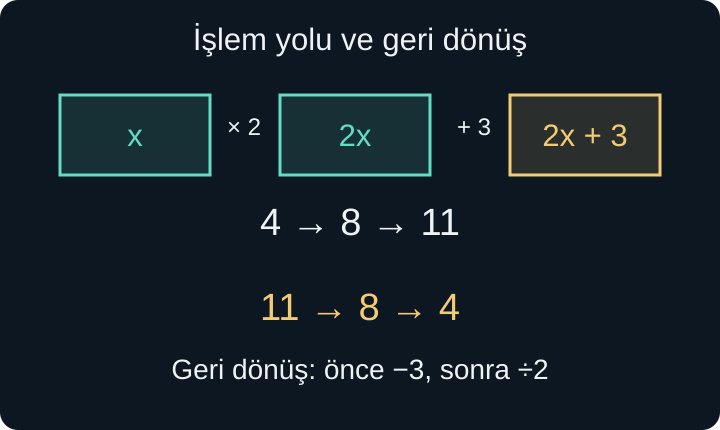
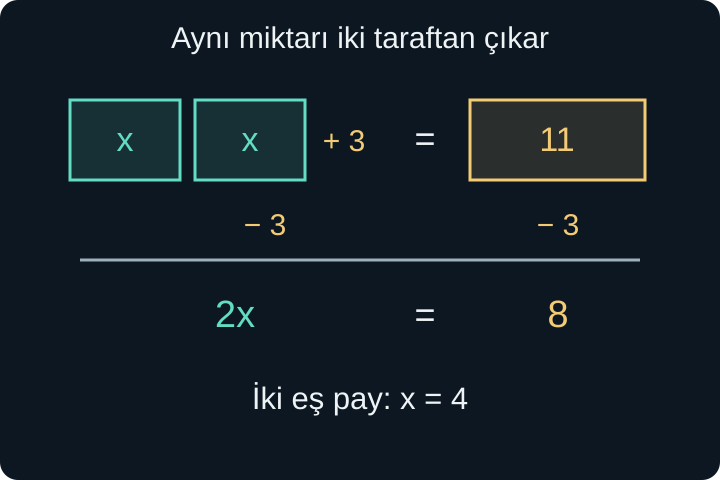

import ArticleVideo from '@/components/ArticleVideo.astro'
import kavram from './media/01-kavram.mp4?url'
import kavramPoster from './media/01-kavram.jpg?url'

Bir kırtasiyeden aynı fiyatta iki defter ve 3 liralık bir etiket aldığımızı düşünelim. Toplam 11 lira ödediysek, bir defterin fiyatını bulabiliriz. Önce etikete ayrılan 3 lirayı çıkarır, kalan 8 lirayı iki deftere eşit olarak paylaştırırız. Bir defter 4 liradır.

Bu küçük hesapta henüz adını koymadığımız bir denklem çözdük. Defterin lira cinsinden fiyatına $x$ dersek, alışverişin koşulu $2x+3=11$ olur. Harf kullanmak hesabı değiştirmez; bilinmeyen miktarı işlemin içinde görünür kılar. Aynı dil daha sonra uzunluk, süre, sıcaklık veya başka bir büyüklük için de kullanılabilir.

[Üsler ve kökler yazısında](/blog/usler-ve-kokler/) harflerle genel kurallar yazmıştık. Şimdi harflerin görevini, eşitlik işaretinin anlamını ve bir bilinmeyeni yalnız bırakmanın gerekçesini kuracağız. Kesirlerle dört işlem, negatif sayılar, işlem sırası ve dağılma özelliği ön bilgilerimizdir. Bir adım zor geldiğinde bu kavramlara dönmek, cebir öğrenmenin doğal bir parçasıdır.

## 1. Harf Bir Sayının Yerini Tutunca

Bir defterin fiyatı her alışverişte aynı olmak zorunda değildir. Fiyatı 4, 6 veya 10 lira seçebiliriz. $x$ bu olası değerleri temsil ettiğinde **değişken** adını alır. Değişkenin değerine göre iki defterin toplam fiyatı $2x$ olur. Yan yana yazılan 2 ve $x$ çarpma anlamındadır: $2x=2\times x$. $x2$ yazımı ise bu alışılmış gösterimin yerini tutmaz.

$2x+3$ ifadesindeki 3, $x$ değişse bile değişmiyor. Bu ifade içinde 3 bir **sabit** sayıdır. “Sabit” sözcüğü bir sayının evrendeki rolünü değil, ele aldığımız hesap içindeki durumunu anlatır. Başka bir problemde etiket fiyatı da değişken olabilir ve ona başka bir harf verebiliriz.

Alışverişin toplamının 11 olduğunu bildiğimizde $x$ artık serbestçe seçilecek bir fiyat değildir. Verilen koşulu sağlayan değeri ararız. Bu rolde $x$ bir **bilinmeyendir**. Değişken ve bilinmeyen iki ayrı harf türü değildir; aynı harfi bazen değişimi anlatmak, bazen belirli bir koşulu sağlayan değeri aramak için kullanırız.

Harfler nesnelerin kısaltması olarak da okunmamalıdır. $d$ defter sayısını temsil ediyorsa $3d$, “üç defter” değil, bu sayının üç katıdır. Harfin neyi ölçtüğünü başta söylemek belirsizliği giderir. Birim de tanımın parçasıdır: $t$ zamanı saniye cinsinden temsil ediyorsa $t=5$, beş saniye demektir.

### Terim ve katsayı

Toplama ile birleştirilmiş parçaların her birine **terim** deriz. Çıkarmayı ters işaretli sayının eklenmesi olarak okuyabiliriz. Örneğin $5x-2y+7$ ifadesinin terimleri $5x$, $-2y$ ve 7'dir. Eksi işaretini ait olduğu terimle birlikte düşünürüz.

Bir harfli terimde harfi çarpan sayıya **katsayı** denir. $5x$ içinde katsayı 5, $-2y$ içinde katsayı $-2$'dir. Tek başına $x$ yazıldığında katsayı 1'dir; $-x$ ise $-1$ ile $x$'in çarpımıdır. Katsayı yazılmamış olması onun sıfır olduğu anlamına gelmez. $0x$ gerçekten sıfırdır ve her $x$ için kaybolur.

$3x+2x$ beş tane aynı miktarın toplamıdır:

$$
3x+2x=(3+2)x=5x.
$$

Fakat $3x+2$ içinde ikinci terim bir $x$ grubu değildir. Örneğin $x=4$ için bu ifade 14 eder; $5x$ ise 20 eder. Benzer görünen yazıları birleştirmeden önce neyin toplandığını sormamız gerekir.

## 2. İfadeyi Okumak ve Yerine Koymak

$2x+3$ bir **cebirsel ifadedir**. Kendi başına doğru veya yanlış bir cümle değildir; $x$'in değeri verildiğinde hesaplanacak bir miktarı tarif eder. Harfin yerine sayı yazıp hesabı yapmaya **yerine koyma** denir.

$x=4$ için önce çarpma yapılır:

$$
2x+3=2\times4+3=8+3=11.
$$

$x=-4$ olsaydı sonuç $2\times(-4)+3=-8+3=-5$ olurdu. Bu sonuç cebirsel olarak geçerlidir. Ancak $x$ bir defterin fiyatını temsil ediyorsa negatif fiyat bu modelin kabul ettiği değerlerden biri olmayabilir. **İfadenin matematiksel anlamı ile gerçek durumun kısıtları birlikte düşünülür.**

Parantez, yerine koyarken özellikle önemlidir. $x=-2$ için $x^2+3x$ ifadesi:

$$
(-2)^2+3(-2)=4-6=-2
$$

olur. $x^2$ yerine $-2^2$ yazarsak negatif sayının tamamını taban yapmamış oluruz. Harfin yerine geçen sayıyı paranteze almak, işaret hatasını önler.

Şekildeki işlem yolu “ikiyle çarp, üç ekle” sırasını gösteriyor. Geriye dönerken aynı sırayı tekrarlamayız: Son yapılan 3 eklemeyi önce geri alır, sonra ikiyle çarpmanın tersini uygularız. Bu fikir, basit denklem çözümünün omurgasıdır.

## 3. Eşitlik Bir Sonuç Oku Değildir

$8+3=11$ yazdığımızda eşitlik işareti, iki taraftaki ifadelerin aynı değeri gösterdiğini söyler. Sol taraf işlem, sağ taraf cevap olmak zorunda değildir. $11=8+3$ de aynı derecede doğrudur. $5+6=8+3$ ifadesinde iki tarafta da işlem bulunabilir.

Bu nedenle eşitlik zincirindeki her parça aynı değerde olmalıdır. $2+3=5\times2=10$ yazamayız: Burada 5 ile 10 eşit değildir. Önce $2+3=5$, sonra $5\times2=10$ yazmalıyız. Cebirde eşitlik işaretine bu anlamı koruyarak yaklaşmak, uzun çözümleri okunabilir kılar.

İçinde bilinmeyen bulunan ve hangi değerlerde doğru olduğunu araştırdığımız eşitliğe **denklem** deriz. $2x+3=11$ bir denklemdir. $x=4$ yazıldığında iki taraf eşit olduğu için 4 bu denklemin bir **çözümüdür**. $x=5$ yazıldığında sol taraf 13 olur; dolayısıyla 5 çözüm değildir.

Bazı harfli eşitlikler ise izin verilen bütün değerlerde doğrudur. $2(x+3)=2x+6$ dağılma özelliğinden dolayı her gerçek $x$ için geçerlidir. Böyle bir eşitliğe **özdeşlik** denir. Özdeşlikleri sonraki yazıda daha ayrıntılı kullanacağız. Denklem çözmek “harf görünce bir sayı üretmek” değil, eşitliği sağlayan bütün değerleri belirlemektir.

## 4. Eşitliği Koruyarak Bilinmeyeni Yalnız Bırakmak

Eşit iki miktara aynı miktarı eklersek yine eşit miktarlar elde ederiz. İkisinden aynı miktarı çıkarırsak da eşitlik korunur. Aynı şekilde iki tarafı aynı sayıyla çarpabiliriz. Bölmede bir ek koşul vardır: Böldüğümüz sayı sıfır olamaz.

Alışveriş denklemine dönelim:

$$
2x+3=11.
$$

İki taraftan 3 çıkaralım:

$$
2x+3-3=11-3,
$$

$$
2x=8.
$$

Ardından iki tarafı sıfır olmayan 2'ye bölelim:

$$
\frac{2x}{2}=\frac82,
\qquad x=4.
$$

Bu adımların her biri geri çevrilebilir. $x=4$ eşitliğini ikiyle çarpar ve iki tarafa 3 eklersek başlangıç denklemine döneriz. Böylece yalnızca bir aday sayı bulmuş olmayız; başlangıç denklemi ile son eşitliğin aynı çözümlere sahip olduğunu da biliriz. Aynı çözümleri olan denklemlere **denk denklemler** diyebiliriz.

<ArticleVideo src={kavram} poster={kavramPoster} title="Eşitliğin iki tarafına aynı işlem" caption="İki taraftan üç birim çıkarılması ve kalan miktarın iki eş parçaya ayrılması, 2x + 3 = 11 denkleminin çözümünü görselleştiriyor." />

Bazen “3 karşıya geçince işaret değiştirir” denir. Bu, iki taraftan 3 çıkarmanın kısa bir anlatımıdır; sayı gerçekten bir sınırın üzerinden atlamaz. Kısa yolun arkasındaki işlemi görmek, özellikle negatif terimlerde güvenilir bir dayanak sağlar.

Sıfırla çarpma eşitliği doğru tutabilir ama çözüm bilgisini silebilir. $x=4$ eşitliğini sıfırla çarparsak $0=0$ elde ederiz. Son eşitlik bütün $x$ değerlerinde doğrudur; artık yalnızca 4'ü seçmez. Denklem çözerken yalnızca doğru satırlar yazmak yeterli değildir: Çözümleri koruyan adımlarla ilerlemeliyiz.

## 5. Bilinmeyen İki Tarafta da Olabilir

İki farklı ücret hesabının aynı toplamı verdiğini düşünelim:

$$
5x-7=2x+8.
$$

Sol taraftaki $5x$ ile sağ taraftaki $2x$ aynı bilinmeyenin katlarıdır. İki taraftan $2x$ çıkaralım:

$$
5x-2x-7=2x-2x+8,
$$

$$
3x-7=8.
$$

İki tarafa 7 eklersek $3x=15$, iki tarafı 3'e bölersek $x=5$ buluruz. Başlangıçta kontrol edelim: Sol taraf $5\times5-7=18$, sağ taraf $2\times5+8=18$ eder.

Bilinmeyenli bir terimi çıkarmak neden mümkündür? Aradığımız çözüm değeri ne olursa olsun, iki taraftan **aynı** $2x$ miktarını çıkarmış oluruz. O değeri önceden bilmiyoruz; fakat işlemin iki tarafa aynı şekilde uygulandığını biliyoruz.

İsterseniz iki taraftan $5x$ çıkararak da ilerleyebilirsiniz. O zaman $-7=-3x+8$, ardından $-15=-3x$ ve yine $x=5$ elde edilir. Bir yöntem daha az eksi işareti üretebilir; doğruluk belirli bir tarafı seçmemize bağlı değildir.

## 6. Parantez ve Kesir Varsa

Önce her tarafın kendi içindeki ifadeleri düzenlemek işe yarar:

$$
3(x-2)+4=2(x+3).
$$

Dağılma özelliğiyle $3x-6+4=2x+6$ olur. Sol tarafta $-6+4=-2$ olduğundan:

$$
3x-2=2x+6.
$$

İki taraftan $2x$ çıkarır, ardından 2 ekleriz. Sonuç $x=8$'dir. İlk denklemde sol taraf $3(8-2)+4=22$, sağ taraf $2(8+3)=22$ olur. Kontrolü düzenlenmiş son satırda değil, başlangıçta yapmak bir açma hatasını da yakalayabilir.

Kesirli bir örnekte kesir çizgisinin gruplama yaptığını unutmayalım:

$$
\frac{x-1}{3}+\frac{x}{2}=4.
$$

İlk payda yalnızca 1'i değil, $x-1$ ifadesinin tamamını böler. 3 ve 2'nin ortak katı 6 olduğundan iki tarafın tamamını 6 ile çarpalım:

$$
6\left(\frac{x-1}{3}+\frac{x}{2}\right)=6\times4.
$$

Çarpanı toplamın her terimine dağıtırız:

$$
2(x-1)+3x=24,
$$

$$
2x-2+3x=24,
\qquad5x-2=24.
$$

İki tarafa 2 ekleyip 5'e bölünce $x=26/5$ bulunur. Çözümün tam sayı çıkması zorunlu değildir. Yerine koyunca ilk kesir $7/5$, ikinci kesir $13/5$ olur; toplamları $20/5=4$'tür.

Paydalar burada sabit ve sıfırdan farklıdır. Paydada bilinmeyen olsaydı, örneğin $1/(x-2)$ bulunsaydı, önce $x\ne2$ koşulunu kaydetmemiz gerekirdi. İşlem yaparak sadeleştirmek, başlangıçta tanımsız olan bir değeri sonradan serbest bırakmaz.

## 7. Her Denklem Tek Bir Sayı Vermez

Birinci derece denklemlerde bilinmeyenin en yüksek kuvveti, düzenleme sonrasında 1'dir. Temel biçim $ax+b=0$ olarak yazılır; $a$ ve $b$ verilmiş sayılar, $a\ne0$ ise birinci derece olma koşuludur. Bu durumda çözüm $x=-b/a$'dır.

Fakat başlangıçta birinci derece gibi görünen ifadeler düzenlenince bilinmeyen tamamen yok olabilir. Örneğin:

$$
2(x+3)=2x+6
$$

denkleminde parantezi açıp iki taraftan $2x$ çıkarınca $6=6$ kalır. Bu her zaman doğrudur. Başka bir kısıt yoksa **bütün gerçek sayılar çözümdür**; sonsuz çözüm vardır. Buradan $x=0$ sonucunu çıkaramayız, çünkü harfin yok olması sıfır olduğu anlamına gelmez.

Buna karşılık $2(x+3)=2x+7$ düzenlendiğinde $6=7$ kalır. Hiçbir $x$ seçimi bu yanlış eşitliği düzeltemez. **Çözüm yoktur.** “Çözüm sıfır” ile “çözüm yok” farklıdır: Sıfır belirli bir sayıdır; çözümsüz denklemde hiçbir sayı işe yaramaz.

Genel olarak düzenleme sonunda $ax=b$ elde ettiysek üç durumu ayırırız. $a\ne0$ ise $x=b/a$ tek çözümdür. $a=0$ ve $b=0$ ise eşitlik bütün izin verilen değerlerde doğrudur. $a=0$ fakat $b\ne0$ ise çözüm bulunmaz. Bu ayrım, bölmeden önce katsayının sıfır olup olmadığını neden sorduğumuzu gösterir.

## 8. Formülde Başka Bir Büyüklüğü Aramak

Formül, büyüklükler arasındaki ilişkiyi genel olarak anlatır. Sabit hızla gidilen bir yol için $d=vt$ yazalım. Burada $d$ alınan yol, $v$ sabit hız, $t$ geçen süredir. Formül her duruma koşulsuz uygulanmaz; bu örnekte hızın sabit olması modelin varsayımıdır.

Yol ve hız verilmiş, süre aranıyorsa iki tarafı $v$'ye böleriz:

$$
\frac d v=\frac{vt}{v},
\qquad t=\frac d v\quad(v\ne0).
$$

Yol 150 kilometre, hız saatte 60 kilometre ise:

$$
t=\frac{150\,\text{km}}{60\,\text{km/saat}}
=2{,}5\,\text{saat}.
$$

Kilometreler sadeleşir ve saat kalır. 0,5 saat 30 dakika olduğu için süre 2 saat 30 dakikadır. Birimler yanlış kurulmuşsa doğru görünen bir sayısal işlem bile yanlış soruya cevap verebilir.

Dikdörtgenin çevresi için $P=2a+2b$ bağıntısını kullanalım. $P$ çevreyi, $a$ ve $b$ iki farklı kenar uzunluğunu gösterir. $b$'yi yalnız bırakmak için önce $2a$ çıkarır, sonra 2'ye böleriz:

$$
P-2a=2b,
\qquad b=\frac{P-2a}{2}.
$$

$P=30$ santimetre ve $a=9$ santimetre ise $b=(30-18)/2=6$ santimetredir. Çevre kontrolü $2\times9+2\times6=30$ verir. Formül $a=20$ için $b=-5$ üretebilir; fakat negatif kenarlı bir dikdörtgen olmadığı için bu veriler geometrik modele uymaz. Gerçek bir dikdörtgen için iki kenar da pozitif olmalıdır.

Formül dönüştürmek yeni bir fizik veya geometri yasası icat etmek değildir. Aynı ilişkiyi, o anda aradığımız büyüklüğü görünür kılacak biçimde yeniden yazmaktır.

## 9. Harfli Bir Katsayıya Bölmeden Önce

Bir formüldeki her harf aranan bilinmeyen olmak zorunda değildir. $ax=12$ yazdığımızda $x$ aranıyor, $a$ ise değeri daha sonra verilecek bir katsayı olabilir. $a=3$ seçilirse $x=4$, $a=-2$ seçilirse $x=-6$ bulunur. Genel olarak $x=12/a$ yazabiliriz; ancak bu ifade yalnızca $a\ne0$ için anlamlıdır. $a=0$ olduğunda başlangıç denklemi $0=12$ olur ve çözüm yoktur.

Bu ayrım, bir harfe bakarak onun sıfır olmadığını varsayamayacağımızı gösterir. Örneğin $ax=0$ denkleminde doğrudan $x=0$ demek eksik kalır. $a\ne0$ ise gerçekten tek çözüm $x=0$'dır. Fakat $a=0$ ise $0x=0$ her $x$ için doğrudur. Katsayının durumu, çözümün yapısını değiştirir.

Bilinmeyenin kendisine bölmek daha da dikkat ister. $x^2=3x$ denkleminde iki tarafı hemen $x$'e bölersek $x=3$ elde ederiz. Oysa $x=0$ da başlangıç eşitliğini sağlar. Bölme sırasında $x\ne0$ varsaymış, sıfır çözümünü dışarıda bırakmış oluruz. Bu denklem birinci derece değildir; ikinci derece denklemleri ileride sistemli olarak çözeceğiz. Burada örneğin amacı, henüz bilmediğimiz bir sayıya bölmenin çözüm kaybettirebileceğini fark etmektir.

Benzer şekilde bir ifadeyi değerlendirirken yapılan işlem ile denklem üzerinde yapılan işlemi ayırmalıyız. $3x+6$ ifadesini $3(x+2)$ diye yazmak, aynı değeri farklı biçimde göstermektir. $3x+6=15$ denkleminin iki tarafını 3'e bölerek $x+2=5$ yazmak ise çözümleri aynı kalan yeni bir denklem üretmektir. İkinci durumda iki tarafın sayısal değerleri küçülür; buna rağmen eşit olma koşulu korunur. Bu iki tür dönüşümün amacı farklı, dayandıkları aritmetik kurallar ortaktır.

## 10. Sonucu Bulmak ile Sonucu Anlamak

Bir sözel durumu cebire çevirirken önce neyin bilinmediğini ve hangi birimle ölçüldüğünü belirleriz. Ardından aynı toplamı, uzunluğu veya başka ortak büyüklüğü anlatan iki ifadeyi eşitleriz. Denklemi çözdükten sonra hem başlangıç eşitliğine hem gerçek durumun koşullarına döneriz.

Örneğin iki defter ve etiket alışverişinde $x=4$ yalnızca bir sayı değildir: Her defterin 4 lira olduğunu söyler. İki defter 8 lira, etiket 3 lira ve toplam 11 liradır. Bilinmeyenin anlamını son cümleye geri taşımak, çözümü tamamlar.

Bu yazı boyunca yapılan ortak iş, karmaşık görünen bir ilişkinin yapısını bozmadan daha okunabilir biçimlere dönüştürmekti. Sonraki yazıda ifadeleri açmanın ve çarpanlarına ayırmanın aynı bilgiyi nasıl farklı biçimlerde gösterdiğini alan şekilleri üzerinden inceleyeceğiz.

## Kaynaklar

- [OpenStax — Solve Equations Using the Subtraction and Addition Properties of Equality](https://openstax.org/books/elementary-algebra-2e/pages/2-1-solve-equations-using-the-subtraction-and-addition-properties-of-equality): Eşitliğin korunması ve çözümün yerine koyarak kontrolü.
- [OpenStax — Solve Equations with Fractions or Decimals](https://openstax.org/books/elementary-algebra-2e/pages/2-5-solve-equations-with-fractions-or-decimals): Ortak payda ile denklem düzenlemenin koşulları.

Tanımlar bu açık ders kitabı bölümleriyle karşılaştırıldı; anlatım, şekiller ve sayısal örnekler bu yazı için hazırlandı.
