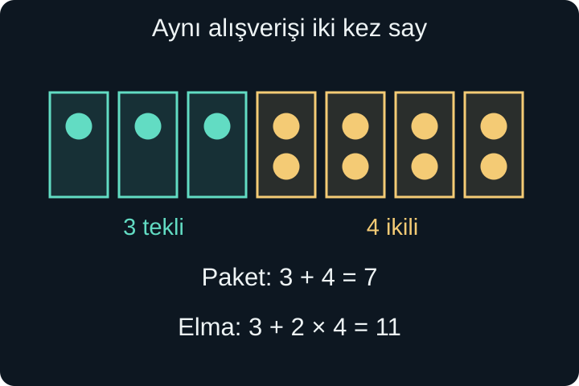
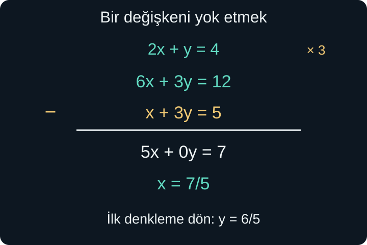

import ArticleVideo from '@/components/ArticleVideo.astro'
import kavram from './media/01-kavram.mp4?url'
import kavramPoster from './media/01-kavram.jpg?url'

Bir tezgâhta elmalar tekli ve ikili paketlerde satılıyor olsun. Yedi paket aldık ve paketleri açınca toplam on bir elma saydık. Kaç tekli, kaç ikili paket almış olabiliriz?

Yalnızca paket sayısını bilmek yetmez. Yedi tekli paket de, beş tekli ve iki ikili paket de toplam yedi pakettir. Elma sayısı ikinci bir koşul getirir. İki bilgiyi aynı anda kullandığımızda belirsizlik azalır; bu örnekte tek bir seçim kalır: üç tekli ve dört ikili paket.

Bu yazıda böyle birlikte sağlanan koşulları **denklem sistemi** olarak ifade edeceğiz. [Önceki yazıdaki](/blog/esitsizlikler-kumeler-ve-mutlak-deger/) ortak çözüm düşüncesi burada da geçerli. Birinci derece denklem çözmeyi, parantez açmayı ve kesirlerle işlem yapmayı kullanacağız. Grafiksel yorumu koordinatlar yazısına bırakıyor; önce hesabın neden çalıştığını kuruyoruz.

## 1. İki Bilinmeyeni Tanımlamak

Tekli paket sayısına $x$, ikili paket sayısına $y$ diyelim. İkisi de paket adedi olduğu için negatif olmayan tam sayılar olmalıdır. Paketleri sayınca $x+y=7$ elde ederiz. Elmaları sayınca tekli paketler $x$, ikili paketler $2y$ elma verir:

$$
x+2y=11.
$$

İki denklemi birlikte göstermek için:

$$
\begin{cases}
x+y=7,\\
x+2y=11
\end{cases}
$$

yazarız. Soldaki büyük ayraç, satırların aynı problemde birlikte geçerli olduğunu belirtir. İkinci satırda $2y$ yazmamızın nedeni ikili paketlerin iki elma içermesidir; denklemdeki katsayılar gerçek durumun ilişkilerinden gelir.

$x$ ve $y$'nin görevlerini değiştirirsek denklemler de değişmelidir. Harfler kendi başlarına “tekli” veya “ikili” anlamı taşımaz. Bir kez tanımladıktan sonra bütün hesap boyunca aynı anlamı korumamız yeterlidir.

## 2. Çözüm Bir Sıralı Çifttir

İki bilinmeyenli bir sistemin çözümünü $(x,y)$ biçiminde bir **sıralı çift** olarak yazarız. İlk sayı $x$'in, ikinci sayı $y$'nin değeridir. Elma problemindeki çözüm $(3,4)$'tür. $(4,3)$ aynı çözüm değildir; dört tekli ve üç ikili paket yalnızca on elma verir.

Bir çiftin çözüm olması için **bütün denklemleri aynı anda** sağlaması gerekir. $(5,2)$ ilk denklemde $5+2=7$ verir, fakat ikinci denklemde $5+2\times2=9$ olur. Bu çift birinci koşulu sağlasa da sistemin çözümü değildir.

Tek bir iki bilinmeyenli denklem, gerçek sayılarda genellikle birçok çiftle sağlanır. $x+y=7$ için $(0,7)$, $(2,5)$ ve $(7/2,7/2)$ geçerlidir. Elma bağlamında son çift paketlerin tam sayı olması şartına uymaz. Denklem çözümü ile modelin kabul ettiği çözüm arasındaki ayrımı burada da koruyoruz.

Şimdilik denklemlerimizde $x$ ve $y$ yalnızca birinci kuvvette bulunacak; $xy$, $x^2$ veya $y^2$ terimi olmayacak. $ax+by=c$ biçimindeki bu tür denklemler **doğrusal denklemler** olarak adlandırılır. $a$, $b$, $c$ verilen sayılardır; $a$ ile $b$'nin ikisi birden sıfır değilse iki değişken üzerinde bir doğrusal koşul bulunur.

## 3. Yerine Koyma: Aynı Miktarı Başka Biçimde Yazmak

İlk denklem $x+y=7$ ise iki taraftan $y$ çıkarabiliriz:

$$
x=7-y.
$$

Bu satır $x$'in değerini henüz tek başına belirlemez. $y$ bilinirse $x$'in nasıl bulunacağını söyler. Şimdi ikinci denklemdeki $x$ yerine, ona eşit olan $7-y$ ifadesini yazalım:

$$
(7-y)+2y=11.
$$

Artık tek bilinmeyen kaldı. Benzer terimleri birleştirince $7+y=11$, iki taraftan 7 çıkarınca $y=4$ bulunur. Ardından $x=7-y=7-4=3$ olur.

Bu yöntem **yerine koyma yöntemi**dir. Bir ifadeyi rastgele değiştirmiyoruz; sistemin ilk koşulunun eşit olduğunu söylediği iki miktarı birbirinin yerine kullanıyoruz. İki denklemin ortak çözümü varsa, bu değiştirmeden sonra da aynı değeri sağlamalıdır.

Son adımda iki başlangıç denklemini ayrı ayrı kontrol ederiz:

$$
3+4=7,\qquad3+2\times4=11.
$$

Yalnızca $y=4$ yazıp durmak çözümü eksik bırakır. Sistem iki bilinmeyeni soruyordu; hangi $x$ değerinin onunla eşleştiğini de belirtmeliyiz.

<ArticleVideo src={kavram} poster={kavramPoster} title="Paketleri ve elmaları birlikte saymak" caption="Tekli ve ikili gruplar, x + y = 7 ile x + 2y = 11 koşullarını aynı anda görünür kılıyor. Ortak çözüm üç tekli ve dört ikili gruptur." />

## 4. Yerine Koymada Parantezleri Korumak

Biraz farklı bir sistem alalım:

$$
\begin{cases}
y=2x-1,\\
3x+2y=19.
\end{cases}
$$

İlk satır zaten $y$'yi yalnız bırakmış. İkinci satırdaki $2y$ teriminde $y$'nin yerine **bütün** $2x-1$ ifadesi geçer:

$$
3x+2(2x-1)=19.
$$

Parantezi açınca $3x+4x-2=19$, terimleri birleştirince $7x-2=19$ olur. İki ekleyip 7'ye bölerek $x=3$ buluruz. Sonra $y=2\times3-1=5$ çıkar. Kontrol: $3\times3+2\times5=9+10=19$.

Parantezi unutup $3x+2\times2x-1=19$ yazsaydık, $-1$ terimini ikiyle çarpmamış olurduk. Hata yöntemde değil, yerine konan ifadenin bir bütün olduğunu gözden kaçırmakta olurdu.

Hangi bilinmeyeni yalnız bıraktığımızı da seçebiliriz. Katsayısı 1 veya $-1$ olan bir değişkeni seçmek çoğu zaman kesir sayısını azaltır. Ancak rahat işlem seçimi bir zorunluluk değildir; aynı eşitlikleri doğru kullandığımız sürece farklı yollar aynı çözüm çiftine ulaşır.

## 5. Yok Etme: Ortak Parçayı Çıkarmak

Elma problemindeki iki satıra tekrar bakalım:

$$
x+y=7,\qquad x+2y=11.
$$

İkinci denklemden birinci denklemi taraf tarafa çıkaralım. Sol tarafta $(x+2y)-(x+y)=y$, sağ tarafta $11-7=4$ kalır. Böylece doğrudan $y=4$ buluruz. Her iki denklemde ortak olan $x$ katkısı çıkarma ile yok oldu.

Eşit miktarlardan eşit miktarlar çıkarınca kalanlar eşittir. **Yok etme yöntemi** bu aritmetik gerçeğe dayanır. Katsayıları ters işaretli olan terimler varsa toplama yaparak da bir bilinmeyeni yok edebiliriz.

Örneğin $2x+y=11$ ve $3x-y=9$ koşullarını toplayalım:

$$
(2x+y)+(3x-y)=11+9,
$$

$$
5x=20,\qquad x=4.
$$

İlk denkleme dönünce $8+y=11$ ve $y=3$ elde ederiz. İkinci denklemde de $12-3=9$ olur. Burada $+y$ ile $-y$ birbirini götürdüğü için toplama uygun seçimdi.

İki denklemi topladıktan sonra başlangıçtaki bütün bilgiyi yalnızca yeni satırla değiştiremeyiz. $5x=20$ tek başına $y$ hakkında hiçbir şey söylemez. Yeni denklemle birlikte ilk denklemlerden en az birini tutarız; kaybolan değişkeni onun yardımıyla geri buluruz.

## 6. Katsayıları Uygun Hâle Getirmek

Her sistemin katsayıları baştan birbirini götürmez. Şu sistemi ele alalım:

$$
\begin{cases}
2x+y=4,\\
x+3y=5.
\end{cases}
$$

Birinci denklemin tamamını 3 ile çarparsak $6x+3y=12$ elde ederiz. Yalnızca $y$ terimini değil, $2x$ ve sağdaki 4 dahil **her terimi** çarptık. Bu, sıfır olmayan bir sayıyla çarpma olduğu için aynı çözüm çiftlerini korur.

Şimdi bu yeni denklemden ikinci denklemi çıkaralım:

$$
(6x+3y)-(x+3y)=12-5,
$$

$$
5x=7,\qquad x=\frac75.
$$

İlk denklemde yerine koyarsak:

$$
2\times\frac75+y=4,
\qquad y=\frac{20}{5}-\frac{14}{5}=\frac65.
$$

Çözüm $(7/5,6/5)$'tir. İkinci denklemin kontrolü $7/5+18/5=25/5=5$ verir. Kesirli çözümler yöntemin yanlış olduğu anlamına gelmez; gerçek sayılarla kurulan bir sistemde beklenen sonuçlardan biridir.

İstersek ikinci denklemi 2 ile çarpıp ilkinden çıkararak $y$'yi de önce bulabilirdik. Yöntem seçerken amaç, işlemleri takip edebileceğimiz kadar açık tutmaktır. Özellikle çıkarma yaparken ikinci satırın tamamını paranteze almak işaret hatalarını azaltır.

## 7. Çözüm Neden Tek Olmak Zorunda Değil?

Şu iki koşula bakalım:

$$
x+y=7,\qquad2x+2y=14.
$$

İkinci denklem birincinin iki katıdır. Yeni bir bilgi eklemiyor. İlkini ikiyle çarpıp ikinciden çıkarırsak $0=0$ kalır. Bu doğru eşitlik, çelişki olmadığını fakat ikinci satırın ayrı bir kısıt getirmediğini gösterir.

Gerçek sayılarda çözüm çiftlerini şöyle anlatabiliriz: $x$ herhangi bir gerçek sayı $t$ olsun; o zaman $y=7-t$ olmalıdır. Bütün çözümler $(t,7-t)$ biçimindedir. $t$ burada serbestçe seçilen sayıya verdiğimiz addır; **parametre** olarak kullanılır. Her $t$ bir çift üretir, fakat $x$ ile $y$ birbirinden bağımsız seçilemez.

Bu sistemin gerçek sayılarda sonsuz çözümü vardır. Paket sayısı gibi negatif olmayan tam sayı koşulu ekleseydik, yalnızca $(0,7)$'den $(7,0)$'a kadar sekiz çift kalırdı. “Sonsuz çözüm” ifadesini hangi sayı kümesinde kullandığımız bu nedenle önemlidir.

Şimdi ikinci satırı $2x+2y=15$ olarak değiştirelim. Birinci satır ikiyle çarpıldığında aynı sol tarafın 14 olması gerektiğini söylüyor. Çıkarma yapınca $0=1$ gibi yanlış bir eşitlik çıkar. İki koşul birlikte sağlanamaz; **çözüm yoktur**. Burada bilinmeyenleri farklı seçmek işe yaramaz, çünkü çelişki değerlerden bağımsızdır.

## 8. Tek, Yok veya Sonsuz Çözümü Ayırmak

İki gerçek bilinmeyenli, iki doğrusal denklemli bir sistemde katsayıların oluşturduğu koşullar üç temel sonuç verebilir. Önceki örneklerde tek bir çift bulduk; birbirinin katı olan tutarlı denklemlerde sonsuz çift bulduk; aynı sol tarafa farklı sonuç dayatan denklemlerde hiçbir çift bulamadık.

Bu sınıflandırma her tür denklem sistemi için geçerli değildir. Örneğin kareli ifadelerin bulunduğu sistemlerde iki veya başka sayıda çözüm çıkabilir. Buradaki kapsamımız doğrusal sistemlerdir. İleride grafikler ve matrisler, bu üç durumun neden ortaya çıktığını başka dillerle gösterecek.

Yok etme sonucunda $0=0$ görürsek “$x=0$ ve $y=0$” diyemeyiz. Başlangıçta kalan koşula dönüp çözüm ailesini yazmalıyız. $0=5$ gibi yanlış bir satır görürsek de 5'i bir değişkenin değeri sanmamalıyız; satır, ortak çözümün olmadığını söyler.

Hiçbir aşamada bilinmeyen bir ifadeye koşulsuz bölmek gerekmiyor. Yalnızca sıfır olmadığını bildiğimiz sayılarla çarpıyor veya bölüyor, denklemleri topluyor ya da çıkarıyoruz. Bu sınırlı ama güvenilir işlemler, doğrusal sistemler için yeterlidir.

## 9. Sözel Bir Durumdan Model Kurmak

Bir sergide yetişkin bileti 90 lira, öğrenci bileti 50 lira olsun. On iki bilet için toplam 840 lira ödenmiş. Yetişkin sayısına $a$, öğrenci sayısına $s$ diyelim. İnsan sayısını sayan denklem $a+s=12$, ödemeyi sayan denklem $90a+50s=840$ olur.

İlk denklemden $s=12-a$ bulup ikincide kullanalım:

$$
90a+50(12-a)=840,
$$

$$
90a+600-50a=840,
\qquad40a=240.
$$

Buradan $a=6$ ve $s=6$ bulunur. Toplam kişi $6+6=12$, ödeme $6\times90+6\times50=540+300=840$ liradır. Sayılar hem denklemleri hem negatif olmayan tam sayı koşulunu sağlıyor.

Bu modelin içinde ek bir varsayım vardır: Her kişi tek bilet alıyor ve verilen iki fiyat dışında indirim veya ücret bulunmuyor. Böyle ayrıntılar değişirse aynı denklem sistemi gerçek durumu anlatmayabilir. Matematiksel çözüm, doğru kurulmuş ilişkinin sonucudur; ilişkiyi seçmek de çözümün bir parçasıdır.

## 10. Karışımda Birimleri Aynı Tutmak

Yüzde 20 ve yüzde 50 derişimli iki çözeltiden, kütlece yüzde 30 derişimli 600 gram karışım hazırlayalım. İlkinden $x$ gram, ikincisinden $y$ gram kullanalım. Kütlelerin toplandığını ve karışım sırasında madde kaybı olmadığını varsayıyoruz.

Toplam kütle $x+y=600$ olur. Birinci çözeltideki çözünen madde kütlesi $0{,}20x$, ikincideki $0{,}50y$ gramdır. Son karışımda $0{,}30\times600=180$ gram çözünen madde bulunmalıdır:

$$
0{,}20x+0{,}50y=180.
$$

İlk denklemden $x=600-y$ yazalım. Yerine koyunca $120-0{,}20y+0{,}50y=180$, ardından $0{,}30y=60$ elde edilir. Böylece $y=200$ gram ve $x=400$ gram bulunur.

Kontrol hem toplamı hem içeriği kapsar. $400+200=600$ gramdır; çözünen miktarı $80+100=180$ gramdır. $180/600=0{,}30$, hedef yüzdeyi verir. Yüzdeleri doğrudan toplayıp 70 demedik; her yüzdeyi ait olduğu miktarla çarptık. Ayrıca hacimlerin her karışımda toplanacağı varsayımına ihtiyaç duymamak için gram cinsinden kütle kullandık.

## 11. Bir Çifti Bulmak ile Tekliğini Göstermek

$(3,4)$ çiftinin elma sistemini sağladığını yerine koyarak kontrol ettik. Bu kontrol, çiftin gerçekten bir çözüm olduğunu gösterir. Başka bir çift olmadığını ise çözüm sırasında yaptığımız işlemler gösteriyor: Sistemi sağlayan her çift için iki denklem çıkarılınca mutlaka $y=4$ çıkmalıdır. Sonra ilk denklem mutlaka $x=3$ verir. Dolayısıyla başka seçenek kalmaz.

Bu ayrım, tahminle bir cevap bulduğumuzda özellikle önemlidir. Deneme yoluyla uygun bir çift görmek her zaman bütün çözümleri bulduğumuz anlamına gelmez. Sonsuz çözümlü $x+y=7$ koşulunda $(3,4)$ doğrudur ama birçok başka doğru çift vardır. Teklik, yalnızca bir örneğin çalışmasına değil, bütün adayları zorlayan koşullara dayanır.

İşlemler sırasında bir başlangıç denklemini saklamamızın nedeni de budur. Yalnızca $y=4$ bilgisi, $(0,4)$ veya $(100,4)$ gibi birçok çifte izin verir. $x+y=7$ koşuluyla birlikte tutulduğunda bu seçenekler elenir. Yeni satır, eski koşullardan türeyen sonuçtur; eski bilgilerin tamamının yerine tek başına geçmez.

## 12. Modelin Uymadığını Hesap da Söyleyebilir

Bilet örneğinde toplam ödemenin 840 yerine 850 lira söylendiğini düşünelim. Yine on iki kişi ve aynı iki fiyat varsa:

$$
90a+50(12-a)=850
$$

olur. Düzenleyince $40a=250$, dolayısıyla $a=25/4=6{,}25$ çıkar. Diğer sayı $s=23/4=5{,}75$ olur. Bu çift gerçek sayılar üzerinde iki denklemi de sağlar, fakat kişi adedi olarak kabul edilemez.

Burada “kesir çıktığı için cebir yanlış” demek yerine verileri ve modelin varsayımlarını gözden geçiririz. Bilet sayısı, toplam ödeme veya fiyatlardan biri yanlış hatırlanmış olabilir; ek ücret veya başka bir bilet türü de bulunabilir. Verilen bilgilerle ve kurduğumuz iki bilet türü modeliyle uygun tam sayı çözümü yoktur. Matematik bize hangi bilginin yanlış olduğunu tek başına söylemez, ama hepsinin birlikte bu modeli sağlamadığını gösterir.

Ölçülen uzunluk veya karışım kütlesi için aynı kesirli sonuç tamamen anlamlı olabilir. Bu yüzden bir sayının kabul edilmesi, yalnızca biçimine değil hangi büyüklüğü temsil ettiğine bağlıdır. Cebirsel çözümden sonra birim, işaret ve tamlık koşullarına dönmek sonradan eklenen bir süs değil, model çözümünün tamamlayıcı adımıdır.

## 13. İki Yöntem, Aynı Ortak Koşul

Yerine koyma, bir bilinmeyeni başka bir ifadeyle değiştirerek tek bilinmeyene iner. Yok etme, iki denklemin ortak katkılarını toplayıp çıkararak tek bilinmeyene iner. Yollar farklı olsa da korunan şey aynıdır: Başlangıçtaki bütün koşulları birlikte sağlayan çiftler.

Çözüm sırasında bir denklem diğerine göre daha kolay görünebilir. Katsayısı 1 olan bir değişken yerine koymayı, eşit veya ters işaretli katsayılar yok etmeyi kolaylaştırır. Kesir çıktığında yöntemi bırakmak yerine kesirleri tam değerleriyle taşımak, erken yuvarlamanın kontrolü bozmasını önler.

Sonraki yazıda bilinmeyenin karesiyle karşılaşacağız. O zaman “birinci derece katsayıya böl ve bitir” yaklaşımı yetmeyecek; çarpanlar, kareye tamamlama ve kök seçimiyle daha geniş bir çözüm dili kuracağız.

## Kaynaklar

- [OpenStax — Solving Systems of Equations by Substitution](https://openstax.org/books/elementary-algebra-2e/pages/5-2-solving-systems-of-equations-by-substitution): Yerine koyma, ortak çözüm ve çözüm sayısı.
- [OpenStax — Solve Systems of Equations by Elimination](https://openstax.org/books/elementary-algebra-2e/pages/5-3-solve-systems-of-equations-by-elimination): Denklemlerin katsayılarını düzenleyerek yok etme.

Kaynak bölümler yöntem ve koşul denetimi için okundu; anlatım ve kullanılan modeller özgün olarak hazırlandı.
