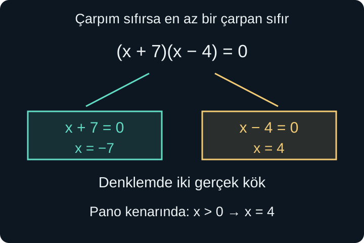
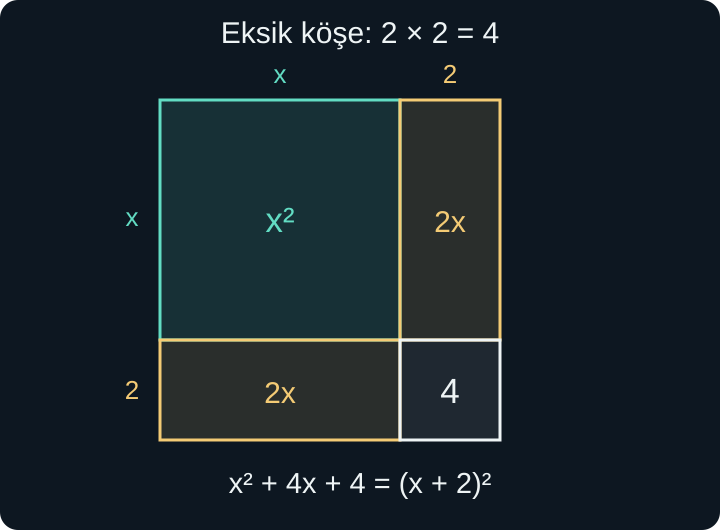

import ArticleVideo from '@/components/ArticleVideo.astro'
import kavram from './media/01-kavram.mp4?url'
import kavramPoster from './media/01-kavram.jpg?url'

Dikdörtgen bir panonun uzun kenarı, kısa kenarından 3 santimetre fazla olsun. Alanı 28 santimetrekareyse kenarları nasıl buluruz? Kısa kenara $x$ dediğimizde uzun kenar $x+3$, alan ise $x(x+3)$ olur. Koşulumuz $x(x+3)=28$'dir.

Parantezi açınca $x^2+3x=28$ elde ederiz. Bu kez bilinmeyenin karesi var. Birinci derece denklemlerdeki gibi benzer terimleri toplayıp tek katsayıya bölmek yeterli olmayacak. Ancak [özdeşlikler yazısında](/blog/ozdeslikler-ve-carpanlara-ayirma/) öğrendiğimiz çarpanlar ve kare açılımları bize yeni yollar açacak.

[Önceki yazıda](/blog/iki-bilinmeyenli-denklem-sistemleri/) birden fazla koşulu birlikte kullandık. Burada yeniden tek bilinmeyene dönüyor; çarpanlara ayırmayı, karekökün anlamını ve eşitliği koruyan işlemleri bir araya getiriyoruz. Çözümleri gerçek sayılarda arayacağız; grafik veya parabol bilgisi gerekmeyecek.

## 1. İkinci Derece Ne Demek?

Düzenlenmiş biçimi $ax^2+bx+c=0$ olan ve $a\ne0$ koşulunu sağlayan denkleme **ikinci derece denklem** denir. $x$ bilinmeyen, $a$, $b$ ve $c$ verilmiş gerçek sayılardır. En yüksek kuvvet 2 olduğu için bu adı kullanırız.

$a\ne0$ koşulu gereklidir. $a=0$ olursa kareli terim kaybolur ve $bx+c=0$ kalır; bu başka bir durumdur. $b$ veya $c$ ise sıfır olabilir. Örneğin $x^2-9=0$ denkleminde $a=1$, $b=0$, $c=-9$'dur.

Terimler başlangıçta farklı taraflarda durabilir. Pano örneğinde iki taraftan 28 çıkararak $x^2+3x-28=0$ yazarız. Bu **standart biçim**, katsayıları doğru okumayı ve birazdan kullanacağımız sıfır çarpım ilkesini uygulamayı kolaylaştırır.

Denklemi sağlayan sayılara bu bağlamda **kök** de denir. Denklem kökü, karekök sembolüyle aynı şey değildir. $x^2-9=0$ denkleminin iki gerçek kökü 3 ve $-3$'tür; $\sqrt9$ gösterimi ise tek bir sayıyı, pozitif olan 3'ü belirtir.

## 2. Sıfır Çarpım İlkesi

İki gerçek sayının çarpımı sıfırsa, sayılardan en az biri sıfırdır. $uv=0$ olduğunda $u=0$ **veya** $v=0$ dememizi sağlayan kurala **sıfır çarpım ilkesi** diyoruz. Burada $u$ ve $v$ herhangi iki gerçek sayı veya sayısal değer alan ifadedir.

Neden doğrudur? $u=0$ değilse iki tarafı sıfır olmayan $u$'ya bölebiliriz; o zaman $v=0$ çıkar. $u=0$ ise koşul zaten sağlanır. Bu iki durum bütün olasılıkları kapsar.

İlke, çarpımın sıfır olmasına dayanır. $uv=12$ ise “$u=12$ veya $v=12$” diyemeyiz; $u=3$ ve $v=4$ da mümkündür. Benzer biçimde bir toplamın sıfır olması, terimlerin ayrı ayrı sıfır olduğunu göstermez: $3+(-3)=0$ bunun basit örneğidir.

Bu nedenle ikinci derece bir denklemi çarpanlarla çözerken önce bütün terimleri bir tarafta toplar ve diğer tarafı **sıfır** yaparız. Sonra çarpım biçimini ararız. Çarpanlara ayırma tek başına çözüm değildir; sıfıra eşit çarpımın hangi değerlerde gerçekleştiğini de bulmamız gerekir.

## 3. Pano Örneğini Çözmek

$x^2+3x-28$ ifadesini çarpanlarına ayırmak için toplamları 3, çarpımları $-28$ olan iki sayı arayalım. 7 ve $-4$ bu işi görür:

$$
x^2+3x-28=(x+7)(x-4).
$$

Geri açarak kontrol edebiliriz: $x^2-4x+7x-28=x^2+3x-28$. Denklemimiz artık $(x+7)(x-4)=0$ olur. Sıfır çarpım ilkesine göre:

$$
x+7=0\quad\text{veya}\quad x-4=0.
$$

Cebirsel kökler $x=-7$ ve $x=4$'tür. Ancak $x$ pano kenarının santimetre cinsinden uzunluğuydu ve pozitif olmalıydı. Bu yüzden geometrik modelde $x=4$ kabul edilir. Diğer kenar 7 santimetredir; $4\times7=28$ alanı doğrular.

Negatif kökü “hesap hatası” diye silmedik. Önce denklemin gerçek çözümlerini bulduk, ardından uzunluk koşulunu uyguladık. Gerçek sayılar üzerinde $-7$ de denklemi sağlar; yalnızca bu fiziksel yorumda uygun değildir.

## 4. Kareden Geri Dönünce İki İşaret

$x^2=16$ denklemini düşünelim. Hem $4^2$ hem $(-4)^2$ 16'dır. Bu yüzden çözümler $x=4$ ve $x=-4$ olur. Kısa yazım $x=\pm4$'tür; $\pm$ simgesi burada iki ayrı seçeneği belirtir.

Karekök alırken doğru eşitlik $\sqrt{x^2}=|x|$'tir. Dolayısıyla $x^2=16$ denklemi $|x|=4$ verir. Negatif değerleri gözden kaçırmamak için yalnızca $x=\sqrt{16}$ yazmayız.

Benzer biçimde $(x-3)^2=10$ ise $x-3=\pm\sqrt{10}$ ve $x=3\pm\sqrt{10}$ olur. Bunlar tam değerlerdir. Yaklaşık değer istenirse $\sqrt{10}\approx3{,}1623$ kullanıp $x\approx6{,}1623$ veya $x\approx-0{,}1623$ diyebiliriz. Yaklaşık sayıları erken kullanmak, sonraki hesaplarda gereksiz hata biriktirir.

Sağ tarafın işareti kök sayısını belirler. $x^2=0$ yalnızca $x=0$ verir. $x^2=-4$ ise gerçek sayılarda çözümsüzdür; hiçbir gerçek sayının karesi negatif olmaz. İleride karmaşık sayılarla bu son durumun başka bir yorumunu kuracağız. Şimdilik sayı sistemimizi değiştirmiyoruz.

## 5. Kareye Tamamlama Nereden Gelir?

$x^2+4x=12$ denklemini ele alalım. Solda $x$ kenarlı bir karenin alanı ve toplam $4x$ alanlı şeritler varmış gibi düşünelim. $4x$'i iki tane $2x$ dikdörtgenine ayırıp karenin iki yanına yerleştirirsek, köşede kenarı 2 olan bir kare eksik kalır.

Bu eksik parçanın alanı 4'tür. Soldaki ifadeye 4 eklenince tam bir $(x+2)$ karesi oluşur. Eşitliği korumak için sağ tarafa da 4 ekleriz:

$$
x^2+4x+4=12+4,
\qquad(x+2)^2=16.
$$

Şimdi kareden geri dönebiliriz:

$$
x+2=4\quad\text{veya}\quad x+2=-4.
$$

Böylece $x=2$ veya $x=-6$ bulunur. Başlangıçta $2^2+4\times2=12$ ve $(-6)^2+4(-6)=36-24=12$ olur. Alan şekli pozitif uzunluklarla fikri anlatır; cebirsel özdeşlik negatif kökü de doğru biçimde taşır.

<ArticleVideo src={kavram} poster={kavramPoster} title="Eksik köşeyi tamamlamak" caption="x² + 4x ifadesine dört birim kare eklenerek (x + 2)² oluşturuluyor. Eşitliğin diğer tarafına da 4 eklemek, çözümü aynı koşul içinde tutuyor." />

İşlemin genel örüntüsü $x^2+px$ için görülür. $(x+h)^2=x^2+2hx+h^2$ olduğundan $2h=p$, yani $h=p/2$ seçilir. Eklenecek sayı $h^2=(p/2)^2$'dir. **Birinci derece katsayısının yarısını alıp karesini eklememizin** nedeni bu eşleşmedir.

## 6. Baş Katsayı Bir Değilse

$2x^2+8x-6=0$ denklemini kareye tamamlamak istiyorsak önce iki tarafı 2'ye böleriz:

$$
x^2+4x-3=0,
\qquad x^2+4x=3.
$$

Bir önceki örnekteki gibi 4 ekleyince $(x+2)^2=7$ olur. Kökler:

$$
x=-2\pm\sqrt7
$$

biçimindedir. Baş katsayıyı 1 yapmadan $8$'in yarısını alıp karesini eklemek bu örneği doğru kareye tamamlamazdı; önce $x^2$ teriminin katsayısını göz önüne almak gerekir.

Her ikinci derece denklem kolay tam sayılı çarpanlara ayrılmaz. $x^2+4x-3$ için tam sayılı çarpan aramamız sonuç vermedi diye denklem çözümsüz değildir. Kareye tamamlama, köklerin irrasyonel olduğu durumlarda da çalışan genel bir yöntemdir.

## 7. Genel Formülü Adım Adım Kurmak

$ax^2+bx+c=0$ ve $a\ne0$ olsun. İki tarafı $a$'ya bölüp sabit terimi ayıralım:

$$
x^2+\frac ba x=-\frac ca.
$$

$x$'in katsayısı $b/a$ olduğundan yarısı $b/(2a)$'dır. İki tarafa bunun karesini ekleriz:

$$
\left(x+\frac{b}{2a}\right)^2
=\frac{b^2-4ac}{4a^2}.
$$

Sağ tarafı ortak paydada topladık: $-c/a=-4ac/(4a^2)$, eklenen kare ise $b^2/(4a^2)$'dir. İki tarafı $4a^2$ ile çarparsak daha kullanışlı bir eşitlik elde ederiz:

$$
(2ax+b)^2=b^2-4ac.
$$

Bu biçim, karekök alırken $\sqrt{a^2}=|a|$ ayrıntısını yanlış kullanma riskini de azaltır. Sağ taraf negatif değilse:

$$
2ax+b=\pm\sqrt{b^2-4ac}.
$$

$b$ çıkarıp sıfır olmayan $2a$'ya böldüğümüzde genel çözüm formülü oluşur:

$$
x=\frac{-b\pm\sqrt{b^2-4ac}}{2a}.
$$

Formül ayrı bir ezber kuralı olarak gökten düşmedi; bütün ikinci derece denklemlere aynı kareye tamamlama adımlarını uyguladık. Paydaki iki terimin tamamı $2a$'ya bölünür. Yalnızca karekökü bölmek, kesir çizgisinin kapsadığı bütünü değiştirmiş olur.

## 8. Diskriminant ve Gerçek Kök Sayısı

Karekökün altındaki $b^2-4ac$ sayısına **diskriminant** denir; $\Delta$ ile gösterilir. Bir önceki eşitlikte bir karenin neye eşit olması gerektiğini belirlediği için gerçek kök sayısını da belirler.

$\Delta>0$ ise pozitif sayının iki zıt işaretli karekök adayı vardır ve iki farklı gerçek kök elde edilir. $\Delta=0$ ise artı ve eksi aynı sıfırı verir; tek bir farklı gerçek kök bulunur. Bu köke **çift katlı kök** de denir. $\Delta<0$ ise gerçek kök yoktur.

Örneğin $2x^2-5x-3=0$ için $a=2$, $b=-5$, $c=-3$'tür. İşaretleriyle birlikte yerine koyalım:

$$
\Delta=(-5)^2-4\times2\times(-3)=25+24=49.
$$

Kökler $x=(5\pm7)/4$ olur. Artı seçeneği $12/4=3$, eksi seçeneği $-2/4=-1/2$ verir. Kontrol için $x=3$ yazınca $18-15-3=0$, $x=-1/2$ yazınca $1/2+5/2-3=0$ elde ederiz.

$x^2-6x+9=0$ için $\Delta=36-36=0$'dır. Denklem zaten $(x-3)^2=0$ biçimindedir; farklı tek kök 3'tür. $x^2+2x+5=0$ için $\Delta=4-20=-16$ olur. Kareye tamamlayınca $(x+1)^2=-4$ çıkması da aynı çözümsüzlüğü gösterir.

## 9. Paydalı Denklemlerde Yasak Değerler

Her ikinci derece denklem başlangıçta polinom biçiminde görünmeyebilir:

$$
\frac{x^2-1}{x-1}=3.
$$

Önce $x\ne1$ koşulunu kaydederiz. Bu izin verilen değerlerde iki tarafı $x-1$ ile çarpabiliriz:

$$
x^2-1=3x-3,
\qquad x^2-3x+2=0.
$$

Çarpanlarına ayırınca $(x-1)(x-2)=0$, adaylar ise 1 ve 2 olur. Başlangıçta 1 yasak olduğu için yalnızca $x=2$ kabul edilir. Kontrol: $(4-1)/(2-1)=3$.

Çarpma adımı kendi koşulu içinde yanlış değildi. Sorun, elde edilen polinom denklemini çözerken başlangıçtaki izin verilen değerleri unutmaktır. Sonradan ortaya çıkan her kök, ilk ifadenin tanımlı olduğu bölgede bulunmak zorundadır.

## 10. Karekök İçeren Denklemlerde Sahte Kök

$\sqrt{x+2}=x$ denklemini çözelim. Karekökün tanımlı olması için $x+2\ge0$ gerekir. Ayrıca sol taraf negatif olamayacağı için sağdaki $x$ de negatif olamaz. Birlikte $x\ge0$ koşulunu elde ederiz.

İki tarafın karesini alırsak $x+2=x^2$, ardından $x^2-x-2=0$ bulunur. Çarpanlar $(x-2)(x+1)$ olduğundan adaylar 2 ve $-1$'dir. $x=2$ için $\sqrt4=2$ doğrudur. $x=-1$ için ise $\sqrt1=1$ olur; bu, sağdaki $-1$'e eşit değildir.

Bu ikinci aday **sahte kök** olarak adlandırılır. Kare alma, farklı işaretli iki sayıyı aynı sonuca götürebilir: $1^2=(-1)^2$ olmasına rağmen $1\ne-1$'dir. Bu yüzden bir eşitliğin karesini almak doğru bir sonuç üretebilir, ama ters yöndeki çıkarım koşulsuz geçerli değildir.

Başlangıçta $x\ge0$ koşulunu koruduğumuzda sahte adayı hemen eleyebiliriz. Yine de ilk denklemde yerine koymak yararlıdır; hem tanım hem işaret hem de hesap denetimini aynı yerde toplar.

## 11. Sıfır Kökünü Bölerek Kaybetmemek

$x^2=5x$ denkleminde iki tarafta da $x$ gördüğümüzde onları sadeleştirip $x=5$ yazmak cazip olabilir. Fakat sadeleştirme, iki tarafı $x$'e bölmek demektir ve $x=0$ için tanımsızdır. Oysa sıfır başlangıç denklemini sağlar: $0^2=5\times0$ doğrudur.

Çözümleri koruyan yol, önce her şeyi bir tarafa almaktır:

$$
x^2-5x=0,\qquad x(x-5)=0.
$$

Sıfır çarpım ilkesi şimdi $x=0$ veya $x-5=0$ verir. İki kök 0 ve 5'tir. Bir değişkenin her terimde ortak olması, onu doğrudan bölerek kaldırmak için yeterli değildir; ortak çarpan olarak yazmak sıfır olasılığını görünür tutar.

Bu örneği genel formülle de kontrol edebiliriz. $a=1$, $b=-5$, $c=0$ olduğundan $\Delta=25$ olur. $x=(5\pm5)/2$ iki seçeneği, yani 5 ile 0'ı geri verir. Formül daha uzun bir yol olsa da aynı çözüm kümesine ulaşır. Yöntemler arasında uygunluk olması, işlemlerin birbirinden kopuk kurallar olmadığını gösterir.

Sabit terimi sıfır olan $ax^2+bx=0$ denkleminde ortak çarpan $x$'tir. $x(ax+b)=0$ yazınca bir kökün sıfır olduğu hemen görünür. $a\ne0$ olduğu için diğer kök $-b/a$'dır. $b=0$ da olursa bu iki yazım aynı sıfır değerini verir; iki farklı kök oluşmaz.

## 12. Tam Değer, Yaklaşık Değer ve Kontrol

Kök içinde tam kare olmayan bir sayı kalması çözümün yarım bırakıldığı anlamına gelmez. $x^2-2=0$ için $\sqrt2$ ve $-\sqrt2$ tam çözümlerdir. $1{,}41$ ve $-1{,}41$ bunlara yakın sayılardır, ama denklemin tam kökleri değildir. $1{,}41^2=1{,}9881$ olduğundan başlangıçtaki sıfıra tam ulaşamayız.

Yaklaşık ölçüm yapıyorsak bir ondalık sonuç yararlı olabilir. Bu durumda önce tam ifadeyi elde eder, sonra gerekli basamağa yuvarlar ve yaklaşık eşitlik işaretini kullanırız. Tam biçim, örneğin bir sonraki alana veya başka bir denklemde yerine konacaksa, hesap zincirinde bilgiyi korur.

Bulduğumuz iki kökü kontrol ederken yalnızca son çarpım biçimine bakmak da yeterli olmayabilir. Parantez açarken yanlış yapmışsak son çarpım kendi içinde doğru kökler verir ama başlangıç denklemine ait olmayabilir. Bu yüzden kontrolün en güçlü yeri ilk yazılmış koşuldur. Paydalı ve köklü denklemlerde bu dönüş ayrıca tanım kısıtlarını da denetler.

Kontrolün neyi kanıtladığını ayırmak gerekir. Bir sayının başlangıç denklemini sağlaması onun bir kök olduğunu gösterir. Bütün kökleri bulduğumuzu ise dönüşümlerin kapsamı gösterir. İkinci derece polinom denklemini sıfır çarpım ilkesine indirdiğimizde iki çarpanın sıfır olabileceği bütün durumları sayarız. Kareye tamamlarken artı ve eksi seçeneklerinin ikisini de ele alırız. Bu sistematik ayrım yapılmazsa çalışan bir aday bulmuş, başka bir kökü gözden kaçırmış olabiliriz.

Çift katlı kök ifadesi de bu açıdan okunmalıdır. $(x-3)^2=0$ denklemi $(x-3)(x-3)=0$ biçiminde aynı çarpanı iki kez içerir. İki kez görünen çarpan, iki farklı sayı üretmez. “İki katlı” çarpımın yapısını, “bir farklı kök” çözüm kümesindeki eleman sayısını anlatır.

## 13. Yöntemi Denklemin Yapısına Göre Seçmek

Denklem doğrudan bir karenin sabite eşitliği biçimindeyse karekök yöntemi uygundur. Sıfıra eşit bir çarpım kolay görünüyorsa çarpanlara ayırmak kısa bir yol sunar. Kareye tamamlama her ikinci derece denklemin içindeki kare yapısını açığa çıkarır; genel formül bu adımları kısaltır.

Yöntemden bağımsız olarak aynı sorulara geri döneriz: Böldüğümüz sayı sıfır olabilir mi? Bir kareden geri dönerken iki işareti de düşündük mü? Paydanın yasakladığı değerleri koruduk mu? Bulduğumuz sayı hem başlangıç denklemini hem modelin uzunluk, zaman veya adet koşullarını sağlıyor mu?

Sonraki yazıda bu gerekçelerin daha genel dilini kuracağız. Bir örneğin neden bütün durumları ispatlamadığını, bir karşı örneğin neyi çürüttüğünü ve matematiksel bir iddiayı koşullarıyla birlikte nasıl savunduğumuzu inceleyeceğiz.

## Kaynaklar

- [OpenStax — Quadratic Equations](https://openstax.org/books/elementary-algebra-2e/pages/7-6-quadratic-equations): Sıfır çarpım ilkesi ve çarpanlarla çözüm.
- [OpenStax — Solve Quadratic Equations by Completing the Square](https://openstax.org/books/intermediate-algebra-2e/pages/9-2-solve-quadratic-equations-by-completing-the-square): Kareye tamamlama adımları.
- [OpenStax — Solve Quadratic Equations Using the Quadratic Formula](https://openstax.org/books/intermediate-algebra-2e/pages/9-3-solve-quadratic-equations-using-the-quadratic-formula): Formül ve diskriminantın gerçek köklerle ilişkisi.
- [OpenStax — Solve Radical Equations](https://openstax.org/books/intermediate-algebra-2e/pages/8-6-solve-radical-equations): Kare alma ve başlangıç denkleminde sahte kök denetimi.

Kaynaklarla tanım ve koşullar karşılaştırıldı; açıklamalar, şekiller ve çözümlü örnekler özgün olarak hazırlandı.
