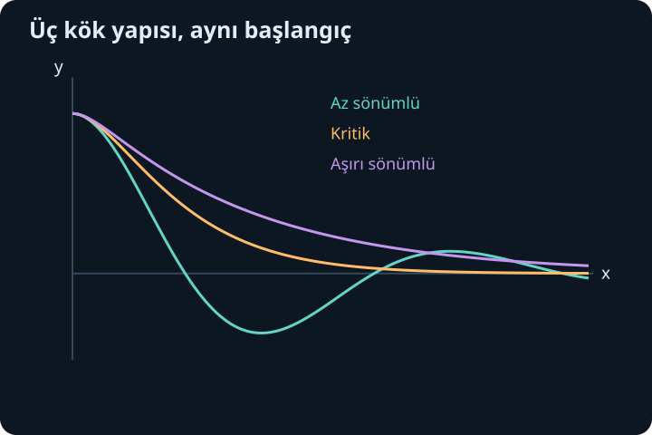
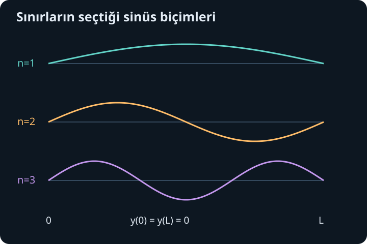

import ArticleVideo from '@/components/ArticleVideo.astro'
import kavram from './media/01-kavram.mp4?url'
import kavramPoster from './media/01-kavram.jpg?url'

Bir eğrinin bir noktadaki yüksekliğini bilmek, o noktadan hangi yönde ayrılacağını söylemez. Eğim bilgisi de gerekir. İkinci türevli denklemlerde iki başlangıç verisinin doğal görünmesinin nedeni budur: başlangıç değeri ile başlangıç eğimi birlikte gelecekteki eğriyi belirler. Uygun koşullarda bu iki bilgi, iki serbest sabiti seçer.

[Önceki yazıda](/blog/birinci-derece-diferansiyel-denklemler/) birinci mertebeli denklemleri ve teklik koşullarını öğrendik. Burada sabit katsayılı ikinci mertebeli doğrusal denklemleri inceleyeceğiz. Üstel türevler, ikinci derece denklemler ve karmaşık sayılardaki Euler bağıntısı temel araçlarımızdır. Salınım ve sönüm sözcüklerini önce fonksiyonların biçimini anlatmak için kullanacağız; fiziksel nedenlerini ileride ayrıca kuracağız.

## 1. İkinci mertebe ve doğrusallık

Genel biçim:

$$
ay''+by'+cy=g(t),\qquad a\ne0
$$

olsun. $a,b,c$ gerçek sabitler, $g(t)$ bilinen fonksiyon, $y(t)$ aranan fonksiyondur. İkinci türev $y''$ bulunduğu için denklem ikinci mertebelidir. $y$, $y'$ ve $y''$ yalnız birinci kuvvette ve birbirleriyle çarpılmadan bulunduğu için doğrusaldır.

$g(t)=0$ ise denklem **homojen**, sıfır olmayan sağ taraf varsa **homojen olmayan** veya zorlanmış denklemdir. “Homojen” burada katsayıların sabit olduğu anlamına gelmez; sağ tarafın sıfır olmasıdır. Bu yazıda sabit katsayı seçmemiz çözüm yöntemini kolaylaştırır. Değişken katsayılı denklemlerde aynı üstel deneme genel olarak çalışmaz.

$y(0)=y_0$ ile $y'(0)=v_0$ başlangıç verileri olsun. Buradaki $v_0$ yalnız başlangıç eğiminin adıdır; fiziksel hız olmak zorunda değildir. Katsayılar düzenli ve en yüksek türevin katsayısı sıfır değilken doğrusal başlangıç değer problemi bir tek çözüm üretir. Sabit katsayılı durumda sürekli $g$ için bu çözüm, $g$'nin tanımlı olduğu aralık boyunca sürer.

## 2. Üstel deneme neden işe yarar?

Homojen denklemde $y=e^{rt}$ biçimini deneyelim. $r$ sabit bir sayı olsun. Türevler $y'=re^{rt}$ ve $y''=r^2e^{rt}$ olur. Yerine koyunca:

$$
(ar^2+br+c)e^{rt}=0
$$

elde edilir. Üstel fonksiyon sıfır olmadığı için:

$$
ar^2+br+c=0
$$

koşulu gerekir. Buna **karakteristik denklem** denir. Diferansiyel denklemde uygun bir biçim ararken ikinci derece cebir denklemine ulaştık. Köklerin reel, tekrarlı veya karmaşık olması çözümün biçimini belirleyecek.

Bu yöntem yalnız tahmin edip bırakmak değildir. Bulunan üstel fonksiyonlar yerine koyarak doğrulanır. İki bağımsız çözüm elde edildiğinde, başlangıç değerleri için oluşturdukları ikiye iki doğrusal sistem çözülür. Teklik teoremi de bu ailedeki çözümün başka bir çözümden kaçırılmadığını garanti eder.

## 3. Süperpozisyon ve bağımsız iki çözüm

$L[y]=ay''+by'+cy$ ifadesini bir işlem olarak adlandıralım. Türevin doğrusallığından $L[\alpha y_1+\beta y_2]=\alpha L[y_1]+\beta L[y_2]$ olur. $L[y_1]=L[y_2]=0$ ise her $\alpha y_1+\beta y_2$ de homojen çözümüdür. Bu özelliğe süperpozisyon denir.

Ancak aynı çözümün iki katını ikinci bir bağımsız çözüm sayamayız. $e^t$ ve $2e^t$ yalnız bir yönlü aile üretir: $C_1e^t+C_2(2e^t)=(C_1+2C_2)e^t$. İki başlangıç koşulunu serbestçe karşılamak için birbirinin sabit katı olmayan iki temel çözüm gerekir.

Bunu başlangıç matrisinden kontrol edebiliriz. $y=C_1y_1+C_2y_2$ için başlangıç denklemlerinin katsayıları $\begin{pmatrix}y_1(0)&y_2(0)\\y_1'(0)&y_2'(0)\end{pmatrix}$ olur. Determinant sıfır değilse iki sabit tek biçimde belirlenir. Bu determinantın genel $t$ değerindeki haline Wronskiyen denir. Burada adı kadar işlevi önemlidir: değer ve eğim bilgileri bağımsız mı, onu sınar.

## 4. İki farklı gerçek kök

Karakteristik kökler $r_1\ne r_2$ ise:

$$
y=C_1e^{r_1t}+C_2e^{r_2t}
$$

genel homojen çözümdür. Başlangıç matrisinin determinantı $r_2-r_1\ne0$ olduğundan iki çözüm bağımsızdır. Kökler pozitifse üstel büyüme, negatifse azalma bileşenleri ortaya çıkar; başlangıç katsayıları bazı bileşenleri sıfırlayabilir.

$y''-3y'+2y=0$, $y(0)=1$, $y'(0)=0$ örneğinde karakteristik denklem $(r-1)(r-2)=0$ olur. Genel çözüm $C_1e^t+C_2e^{2t}$'dir. Başlangıçlar:

$$
C_1+C_2=1,\qquad C_1+2C_2=0
$$

verir. İkinci denklemden birincisini çıkarınca $C_2=-1$, ardından $C_1=2$ bulunur. Sonuç $y=2e^t-e^{2t}$'dir. Türevleri $2e^t-2e^{2t}$ ve $2e^t-4e^{2t}$'dir. Denklemde $e^t$ katsayısı $2-6+4=0$, $e^{2t}$ katsayısı $-4+6-2=0$ çıkar; çözüm doğrulanır.

Başlangıç eğiminin sıfır olması, fonksiyonun sabit kalacağı anlamına gelmez. Burada ikinci türev başlangıçta $-2$'dir. Eğri ilk anda yatay olsa da hemen aşağı kıvrılır. İkinci mertebeli denklem eğimin nasıl değiştiğini de belirlemektedir.

## 5. Tekrarlı kökte kaybolan ikinci yön

Karakteristik denklem aynı $r$ kökünü iki kez verirse $e^{rt}$'yi iki kez yazmak bağımsız çözüm üretmez. Bu durumda ikinci çözüm $te^{rt}$ olur. Bunun nedenini görelim. Denklem bir katsayıya bölündükten sonra $y''-2ry'+r^2y=0$ biçimindedir. $y=e^{rt}u(t)$ yazıp türevleri açınca:

$$
y''-2ry'+r^2y=e^{rt}u''.
$$

Dolayısıyla $u''=0$, yani $u=C_1+C_2t$ olur. Genel çözüm:

$$
y=(C_1+C_2t)e^{rt}
$$

şeklindedir. $t$ çarpanı bir ezber yaması değil, eksik ikinci bağımsız çözümün açık türetimidir.

$y''+4y'+4y=0$, $y(0)=1$, $y'(0)=0$ için kök $r=-2$'dir. $C_1=1$, başlangıç türevi $C_2-2C_1=0$ olduğundan $C_2=2$ bulunur. Çözüm $(1+2t)e^{-2t}$'dir. Birinci türev $-4te^{-2t}$, ikinci türev $(-4+8t)e^{-2t}$ olur. Üç terimi topladığımızda katsayılar sıfırlanır.

## 6. Karmaşık kökten gerçek salınım

Kökler $\alpha\pm i\beta$, $\beta>0$ olsun. Euler bağıntısı:

$$
e^{(\alpha+i\beta)t}=e^{\alpha t}(\cos\beta t+i\sin\beta t)
$$

verir. Denklem katsayıları gerçek olduğu için bu karmaşık çözümün gerçek ve sanal kısımları ayrı ayrı gerçek çözümlerdir. Böylece:

$$
y=e^{\alpha t}(C_1\cos\beta t+C_2\sin\beta t).
$$

$\beta$ salınımın açısal sıklığını, $\alpha$ genel büyüme veya azalma zarfını belirler. $\alpha=0$ ise zarf sabit, $\alpha<0$ ise azalan, $\alpha>0$ ise büyüyendir. Sinüs-kosinüsün girdisi yine radyan açıya karşılık gelir.

$y''+2y'+5y=0$ için kökler $-1\pm2i$'dir. $y(0)=0$, $y'(0)=2$ verilsin. İlk koşul $C_1=0$, ikinci koşul $2C_2=2$ verdiği için $y=e^{-t}\sin2t$ bulunur. Türev $e^{-t}(2\cos2t-\sin2t)$, ikinci türev $e^{-t}(-4\cos2t-3\sin2t)$ olur. $y''+2y'+5y$ içinde kosinüs ve sinüs katsayıları ayrı ayrı sıfırdır.

## 7. Üç sönüm biçimini matematikten ayırmak

$y''+2\gamma y'+\omega_0^2y=0$ ailesini ele alalım; $\gamma\geq0$, $\omega_0>0$ olsun. Kökler $-\gamma\pm\sqrt{\gamma^2-\omega_0^2}$'dir. Buradaki iki parametre henüz fiziksel bir modele bağlanmak zorunda değildir; köklerin türünü düzenli biçimde sınıflandırırlar.

$0<\gamma<\omega_0$ olduğunda kökler karmaşıktır. Çözüm $e^{-\gamma t}$ zarfı içinde, $\omega_d=\sqrt{\omega_0^2-\gamma^2}$ açısal sıklığıyla salınır. Bu davranış az sönümlü diye adlandırılır. $\gamma=0$ özel durumunda zarf azalmaz; saf sinüs-kosinüs çözümü elde edilir.

$\gamma=\omega_0$ durumunda kök tekrarlıdır ve çözüm $(C_1+C_2t)e^{-\omega_0t}$ olur; kritik sönüm adını alır. $\gamma>\omega_0$ olduğunda iki farklı negatif gerçek kök bulunur; çözüm iki azalan üstelin toplamıdır ve salınımlı sinüs bileşeni taşımaz. Bu da aşırı sönümlü davranıştır.

Bu adların fiziksel anlamını yalnız denklem bir modele bağlandığında tamamlayabiliriz. Ayrıca “salınım yok” demek her başlangıçta tekdüze azalma var demek değildir; katsayılar ve başlangıç eğimi geçici yükselme veya eksen geçişi yaratabilir. Kök yapısı çözümün biçimini sınırlar, tek başına bütün ayrıntıları belirlemez.

## 8. Zorlanmış denklemde homojen artı özel çözüm

$L[y]=g(t)$ için bir özel çözüm $y_p$ bulduğumuzu varsayalım. Her homojen çözüm $y_h$ için $L[y_p+y_h]=g+0=g$ olur. Tersine herhangi bir çözümden $y_p$ çıkarılırsa fark homojen denklemi sağlar. Dolayısıyla bütün çözümler:

$$
y=y_h+y_p
$$

şeklindedir. Başlangıç koşullarını bu toplam üzerinde uygularız. Özel çözümün tek başına başlangıç koşullarını sağlaması gerekmez.

$y''+y=\cos2t$ için $y_p=A\cos2t$ deneyelim. Yerine koyunca $(-4A+A)\cos2t=\cos2t$, yani $A=-1/3$ çıkar. Homojen çözüm $C_1\cos t+C_2\sin t$'dir. $y(0)=0$, $y'(0)=0$ koşulları $C_1=1/3$, $C_2=0$ verir. Sonuç $(\cos t-\cos2t)/3$ olur.

Doğrusal süperpozisyon sağ taraflar için de çalışır: $L[y_1]=g_1$, $L[y_2]=g_2$ ise $L[y_1+y_2]=g_1+g_2$. Fakat aynı sağ tarafı sağlayan iki çözümü toplamak, yine aynı sağ tarafı değil iki katını üretir. Homojen durumun özel kolaylığını bütün denklemlere aynı sözlerle taşımamalıyız.

## 9. Rezonans: deneme neden t ile çarpılır?

$y''+y=2\cos t$ denkleminde $A\cos t+B\sin t$ denemesi işe yaramaz; bu terimler zaten homojen çözümdür ve sol tarafta sıfır verir. Sağ taraftaki sıfır olmayan ifadeyi üretemeyiz. Bağımsız yeni biçim olarak $y_p=At\sin t$ deneyelim.

Türevler $y_p'=A\sin t+At\cos t$ ve $y_p''=2A\cos t-At\sin t$ olur. $y_p''+y_p=2A\cos t$ olduğundan $A=1$ çıkar. Özel çözüm $t\sin t$'dir. Üstel veya trigonometrik deneme homojen aileyle çakışınca $t$ çarpanının ortaya çıkmasının nedeni budur; tekrarlı köklerde daha yüksek $t$ kuvveti gerekebilir.

Sıfır başlangıç değeri ve eğimi için bu özel çözüm zaten koşulları sağlar. Genlik zarfı zamanla büyür; bu matematiksel olaya rezonans denir. Buradaki sınırsız büyüme, doğrusal ve sönümsüz denklemin ideal sonucudur. Gerçek sistemin sonsuza kadar aynı denklemle temsil edildiğini henüz iddia etmiyoruz.

<ArticleVideo src={kavram} poster={kavramPoster} title="Aynı denklem, farklı başlangıç" caption="y″+y=0 denkleminin kosinüs ve sinüs çözümleri gösterilir. Başlangıç değeri ve başlangıç türevi, bu iki çözümün hangi birleşiminin seçileceğini belirler." />

## 10. Sınır değerleri parametre seçebilir

Şimdi bağımsız değişkene $x$ diyelim ve $0\leq x\leq L$, $L>0$ aralığında:

$$
y''+\lambda y=0,\qquad y(0)=0,\quad y(L)=0
$$

problemini ele alalım. $\lambda$ henüz bilinmeyen gerçek bir parametredir. Her $\lambda$ için sıfır çözümü vardır. Soru, sıfır olmayan bir çözümün hangi parametrelerde mümkün olduğudur.

$\lambda=0$ ise $y=A+Bx$ olur. İlk sınır $A=0$, ikinci sınır $BL=0$ verir; dolayısıyla yalnız sıfır çözümü kalır. $\lambda=-\mu^2<0$ için $\mu>0$ ve çözüm $Ae^{\mu x}+Be^{-\mu x}$'tir. İlk sınır $B=-A$, ikinci sınır $A(e^{\mu L}-e^{-\mu L})=0$ verir. Parantez sıfır olmadığından yine $A=B=0$ olur.

$\lambda=k^2>0$ ise çözüm $A\cos kx+B\sin kx$'tir. İlk sınır $A=0$ yapar. Sıfır olmayan $B$ için ikinci sınır $\sin(kL)=0$ gerektirir. Böylece:

$$
kL=n\pi,\qquad
\lambda_n=\left(\frac{n\pi}{L}\right)^2,
\qquad n=1,2,3,\ldots
$$

olur. Uygun fonksiyonlar $y_n(x)=B\sin(n\pi x/L)$'dir. Sınır koşulları, sürekli seçilebilen bir parametreden yalnız ayrık değerleri kabul etti. Bu değerlere özdeğer, karşılık gelen sıfır olmayan fonksiyonlara özfonksiyon denir.

## 11. Başlangıç ve sınır bilgisinin farkı

$y''+y=0$ için $y(0)=0$ ve $y'(0)=1$ verilirse tek çözüm $\sin x$'tir. Buna karşılık $y(0)=y(\pi)=0$ koşulları bütün $B\sin x$ fonksiyonlarını kabul eder. Eğer ikinci sınır $y(\pi)=1$ olarak değiştirilirse hiç çözüm yoktur; ilk koşulu sağlayan bütün çözümler $\pi$'de sıfır olur.

Bu üç örnek aynı diferansiyel denklemin farklı veri türleriyle nasıl farklı sonuç verdiğini gösterir. Başlangıç değer teoremini sınır problemlerine doğrudan aktaramayız. Sınır bilgisi bazen sabitleri seçer, bazen parametreleri sınırlar, bazen birbiriyle uyumsuz olur.

Ayrık sinüs biçimleri daha sonra dalgaların ve kuantum durumlarının matematiğinde tekrar karşımıza çıkacak. Buradaki sonuç yalnız doğrusal bir diferansiyel denklem ve iki uç koşulundan geldi. Bir fiziksel yorum eklenmeden önce matematiksel yapının nereden doğduğunu görmek, sonraki kullanımda hangi varsayımın hangi sonucu ürettiğini ayırt etmemizi sağlayacak.

## 12. Çözümü denetlemek için bir düzen

İkinci mertebeli bir sonuç elde ettiğimizde önce iki türevini hesaplar, özgün denklemde yerine koyarız. Sonra başlangıç veya sınır koşullarını ayrı denetleriz. Homojen çözümün iki bağımsız bileşen içerip içermediğini, tekrarlı kökte gerekli $t$ çarpanının bulunup bulunmadığını ve karmaşık köklerin gerçek biçime doğru çevrilip çevrilmediğini kontrol ederiz.

Yaklaşık grafiğe bakmak yararlıdır ama eşitlik denetiminin yerine geçmez. Özellikle küçük bir işaret hatası sönümlü bir üstel yerine büyüyen bir üstel üretebilir. Köklerin gerçek kısımlarını okumak, grafiğin uzun zaman davranışı için hızlı bir kontrol sağlar. Sağ taraf sıfır değilse bulduğumuz özel çözümün gerçekten o sağ tarafı ürettiğini ayrıca görmek gerekir.

Bir sonraki yazıda bu denklemlerdeki “özel yön” fikrini matrislere taşıyacağız. Bir doğrusal dönüşümün yönünü değiştirmediği vektörleri bulmak, birbirine bağlı denklemleri bağımsız biçimlere ayırmanın da yolu olacak.

## Kaynaklar

- [OpenStax, Calculus Volume 3: Second-Order Linear Equations](https://openstax.org/books/calculus-volume-3/pages/7-1-second-order-linear-equations)
- [OpenStax, Calculus Volume 3: Nonhomogeneous Linear Equations](https://openstax.org/books/calculus-volume-3/pages/7-2-nonhomogeneous-linear-equations)
- [MIT OpenCourseWare, Second Order Constant Coefficient Linear Equations](https://ocw.mit.edu/courses/18-03sc-differential-equations-fall-2011/pages/unit-ii-second-order-constant-coefficient-linear-equations/)
