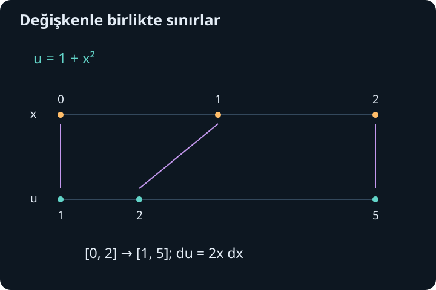
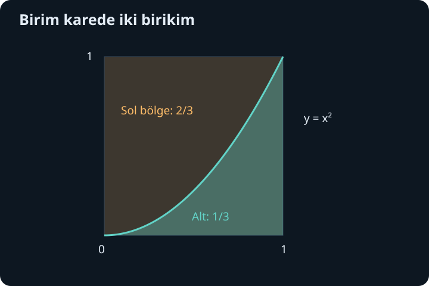

import ArticleVideo from '@/components/ArticleVideo.astro'
import kavram from './media/01-kavram.mp4?url'
import kavramPoster from './media/01-kavram.jpg?url'

Bir integralin anlamını bilmek ile onu hesaplayabilmek aynı şey değildir. Bir eğrinin altında biriken miktar tanımlı olabilir, ama uygun antitürevi hemen göremeyebiliriz. Hesap yöntemleri burada devreye girer. Çoğu yöntem yepyeni bir işlem icat etmez; türev alırken öğrendiğimiz kuralları geriye doğru okur veya ifadeyi bildiğimiz biçimlere ayırır.

[Önceki yazıda](/blog/belirli-integral-ve-temel-teorem/) sürekli bir fonksiyonun belirli integralinin, bir antitürevin uç değerleri farkıyla hesaplanabildiğini gösterdik. Doğal logaritma ve üstel fonksiyonun türevlerini de kurduk. Şimdi zincir kuralını değişken değiştirmeye, çarpım kuralını kısmi integrasyona çevireceğiz. Cebirsel ayrıştırma ve trigonometrik özdeşlikler de bu araçlara yardımcı olacak.

## 1. Küçük bir temel tabloyu anlamak

$F'(x)=f(x)$ ise $\int f(x)dx=F(x)+C$ yazıyoruz. $C$ aynı aralıkta seçilebilen keyfi sabittir. Güç kuralını tersine çevirirsek, $p\ne-1$ için:

$$
\int x^p\,dx=\frac{x^{p+1}}{p+1}+C
$$

buluruz. İfadelerin gerçek ve türevlenebilir olduğu aralıkta çalışırız. Örneğin keyfi gerçek $p$ için $x>0$ güvenli bir ortak alandır; tamsayı üslerde tanım alanı daha geniş olabilir. Formülün kontrolü basittir: türev alırken $p+1$ çarpanı paydadakini götürür ve üs bir azalır.

$p=-1$ için formülde sıfıra bölme oluşur; bu durum ayrı ele alınmalıdır. Sonuç:

$$
\int\frac1x\,dx=\ln|x|+C,\qquad x\ne0
$$

olur. Pozitif tarafta $|x|=x$ olduğu için önceki logaritma türevini kullanırız. Negatif tarafta $|x|=-x$ ve $(\ln(-x))'=(-1)/(-x)=1/x$ olur. Tek bir integral aralığı sıfırı geçemez; iki ayrı tarafta sabitler bağımsız olabilir.

Diğer temel eşleşmeler $\int e^x dx=e^x+C$, $\int\cos x dx=\sin x+C$ ve $\int\sin x dx=-\cos x+C$'dir. Son eşleşmedeki eksi işareti türevle kontrol ederiz: $(-\cos x)'=\sin x$. Ayrıca $\int dx/(1+x^2)=\arctan x+C$ ve $\int dx/\sqrt{1-x^2}=\arcsin x+C$ elde edilir; ikinci eşleşme $-1<x<1$ aralığında geçerlidir.

Tablo, hangi fonksiyonun hangi fonksiyona dönüştüğünü hatırlatır. Bir ifadenin tablodaki biçime gerçekten uyup uymadığını kontrol etmek ise hesaplamanın asıl kısmıdır. Örneğin paydada $1+x^4$ görmek, sonucun doğrudan arktanjant olduğunu söylemeye yetmez; iç değişimin türevi de bulunmalıdır.

## 2. Değişken değiştirme zincir kuralından gelir

$F'=f$ olsun. Zincir kuralı:

$$
\frac{d}{dx}F(g(x))=f(g(x))g'(x)
$$

der. Bu eşitliği ters yönde okuyunca:

$$
\int f(g(x))g'(x)\,dx=F(g(x))+C
$$

buluruz. $u=g(x)$ ve $du=g'(x)dx$ yazımı bu yapıyı izlemek için kullanılır. $du$ ile $dx$'i bu aşamada gelişigüzel cebir nesneleri gibi kullanmak yerine, yazımın zincir kuralını temsil ettiğini hatırlamak güvenlidir.

Örneğin $\int 2x(1+x^2)^4dx$ içinde $1+x^2$'nin türevi olan $2x$ hazır bulunuyor. $u=1+x^2$ seçersek $du=2x dx$ ve integral $\int u^4du=u^5/5+C$ olur. Eski değişkene döneriz:

$$
\int2x(1+x^2)^4dx=\frac{(1+x^2)^5}{5}+C.
$$

Kontrol için türev alalım: dıştaki beşinci güçten 5 gelir, paydadaki 5 gider, kalan $(1+x^2)^4$ iç türev $2x$ ile çarpılır. Başlangıçtaki ifadeyi tam olarak elde ederiz.

## 3. Eksik sabit çarpanı telafi etmek

$\int x e^{x^2}dx$ örneğinde iç ifade $x^2$'dir, fakat onun türevi $2x$ iken integralde yalnız $x$ bulunuyor. Bu küçük farkı açıkça ayıralım:

$$
\int x e^{x^2}dx=\frac12\int2x e^{x^2}dx.
$$

$u=x^2$ dönüşümüyle sonuç $e^{x^2}/2+C$ olur. Katsayıyı atlamak iki kat büyük bir cevap üretirdi. Türevle kontrol, bu tür sabit hatalarını hemen yakalar.

Bir başka örnekte $\int 3/(2+3x)dx$ için $u=2+3x$ ve $du=3dx$ seçeriz. Sonuç $\ln|2+3x|+C$'dir; $x=-2/3$'ü içermeyen bir aralıkta geçerlidir. Mutlak değer, içerinin negatif olduğu aralığı da kapsar. Fonksiyonun tanımsız olduğu noktayı ise ortadan kaldırmaz.

$\int x\sqrt{4+x^2}dx$ için yine $u=4+x^2$, $du=2x dx$ kullanırız. İntegral $\frac12\int u^{1/2}du$ olur. Güç kuralıyla $\frac12\cdot\frac23u^{3/2}=u^{3/2}/3$ elde edilir. Sonuç $(4+x^2)^{3/2}/3+C$'dir. Bu kez iç ifade bütün gerçek girdilerde pozitif olduğundan ek bir gerçeklik kısıtı yoktur.

## 4. Belirli integralde sınırlar da dönüşür

Değişkeni $x$'ten $u=g(x)$'e çeviriyorsak sınırlar artık $x$ değerleri olarak bırakılamaz. $x=a$ iken $u=g(a)$, $x=b$ iken $u=g(b)$ olur. Yeterli süreklilik ve türev koşullarında:

$$
\int_a^b f(g(x))g'(x)dx
=\int_{g(a)}^{g(b)}f(u)du.
$$

Bu biçimin kanıtı temel teoremden gelir: iki taraf da $F(g(b))-F(g(a))$'dır. Burada kullanılan bileşke biçimi için $g$'nin bütün aralıkta bire bir olması gerekmez. Buna karşılık genel bir integrali ters değişkenle yeniden yazarken dalları ve aralığı ayrıca incelemek gerekir.

$\int_0^2 2x/(1+x^2)dx$ için $u=1+x^2$ seçelim. Alt sınır 1, üst sınır 5 olur:

$$
\int_0^2\frac{2x}{1+x^2}dx
=\int_1^5\frac1u du=\ln5.
$$

Yeni integralde eski 0 ve 2 sınırlarını bırakmak $\ln2-\ln0$ gibi anlamsız bir ifadeye götürürdü. İki güvenli yol vardır: bütün hesabı yeni değişken ve yeni sınırlarla tamamlamak veya önce antitürevi eski değişkene döndürüp eski sınırları kullanmak.

Yön de korunmalıdır. $\int_0^1 2x\sqrt{4-x^2}dx$ için $u=4-x^2$ ve $du=-2x dx$ olur. Sınırlar 4'ten 3'e gider. Böylece integral $-\int_4^3\sqrt u\,du=\int_3^4\sqrt u\,du$ biçimindedir. Sonuç $\frac23(8-3\sqrt3)$ olur. Eksi işaretiyle ters sınır birbirini telafi eder; ikisini de rastgele kaldırmayız.

<ArticleVideo src={kavram} poster={kavramPoster} title="Zincir kuralından değişken değiştirmeye" caption="u = x² ve du = 2x dx dönüşümü, 2x cos(x²) ifadesinin integralini sin(x²) + C biçimine götürür. Sonuç türevle kontrol edilir." />

## 5. Kısmi integrasyon çarpım kuralını geri alır

İki türevlenebilir fonksiyon $u(x)$ ve $v(x)$ için $(uv)'=u'v+uv'$ olduğunu biliyoruz. Terimlerden birini karşıya alıp integral alırsak:

$$
\boxed{\int uv'\,dx=uv-\int u'v\,dx.}
$$

Kısa gösterimi $\int u\,dv=uv-\int v\,du$'dur. Kısmi integrasyon, bir integraldeki türev yükünü bir çarpandan diğerine aktarır. Yararlı seçim, yeni integralin daha kolay olduğu seçimdir. Her çarpımı sırf çarpım olduğu için bu yöntemle çözmek zorunda değiliz.

$\int x e^x dx$ için $u=x$, $v'=e^x$ seçelim. O zaman $u'=1$ ve $v=e^x$ olur. Formül:

$$
\int x e^x dx=xe^x-\int e^x dx
=xe^x-e^x+C
$$

verir. Kontrol edelim: $(xe^x-e^x)'=e^x+xe^x-e^x=xe^x$. Seçim başarılıdır; $x$ türev alınca sadeleşti, üstel fonksiyon integral alınca biçimini korudu.

Ters seçimde $u=e^x$ ve $dv=x dx$ alınabilir, fakat yeni integral $\int x^2e^x dx$ olur ve başlangıçtan daha karmaşıktır. Yöntemin doğruluğu her seçimde aynı kalır; pratik yararı seçime bağlıdır. Bir formülün uygulanabilir olması, o anda en iyi yol olduğu anlamına gelmez.

## 6. Görünmeyen ikinci çarpan ve tekrar

$\int\ln x dx$ ifadesinde görünürde çarpım yoktur; ancak $\ln x\cdot1$ diye yazabiliriz. $u=\ln x$, $dv=dx$ seçersek $du=dx/x$ ve $v=x$ olur. Dolayısıyla:

$$
\int\ln x dx=x\ln x-\int1dx=x\ln x-x+C,\qquad x>0.
$$

Türev alırken $x\ln x$ teriminden $\ln x+1$ gelir, son $-x$ teriminden $-1$ gelir ve istenen $\ln x$ kalır. Bu yöntem doğal logaritmanın türevini bildiğimiz için mümkün oldu; onu kanıtlamak için henüz bilinmeyen bu integrali kullanmıyoruz.

$\int x^2e^x dx$ için yöntemi iki kez uygularız. İlk seçim $u=x^2$, $dv=e^x dx$ olsun. Sonuç $x^2e^x-2\int xe^x dx$ olur. Az önce bulduğumuz ifadeyi yerine koyarsak:

$$
\int x^2e^x dx=e^x(x^2-2x+2)+C.
$$

Polinomun derecesi her türevde bir azaldığı için bu süreç sonlanır. Türev kontrolünde üstel çarpanın türevi ile parantezin türevi toplanır: $e^x[(x^2-2x+2)+(2x-2)]=x^2e^x$.

Belirli integralde çarpım terimini de uçlarda değerlendiririz. $\int_0^1 xe^x dx=[xe^x]_0^1-\int_0^1e^x dx=e-(e-1)=1$. Köşeli parantez $[F(x)]_a^b=F(b)-F(a)$ kısaltmasıdır. Kısmi integrasyonun sonundaki çarpım, sınırların etkisini taşıdığı için unutulamaz.

## 7. Bir alan ayrımıyla çarpım kuralını görmek

Artan ve terslenebilir pozitif bir $y=f(x)$ eğrisi düşünelim. Bir dikdörtgenin içini eğrinin altındaki bölge ile yanındaki bölge olarak ayırabiliriz. Bir bölgeyi düşey dilimlerle toplarken diğerini yatay dilimlerle toplarız. Toplam, dikdörtgen alanına eşittir. Bu geometri, bir çarpım ile iki integral arasındaki ilişkinin neden doğal olduğunu gösterir.

Basit örnek $y=x^2$, $0\leq x\leq1$ olsun. Eğrinin altındaki alan $\int_0^1x^2dx=1/3$'tür. Eğrinin solundaki alan $\int_0^1\sqrt y\,dy=2/3$ olur. İkisi birim kareyi doldurur. Burada yatay dilimin uzunluğu $\sqrt y$'dir; eğrinin sağı alınsaydı $1-\sqrt y$ olurdu. Bölgeyi hangi taraftan topladığımızı açıkça belirlemek işaret hatasını önler.

Bu resim her kısmi integrasyonun pozitif alan hesabı olduğu anlamına gelmez. Genel formül işaretli fonksiyonlar için çarpım kuralından gelir. Geometrik örnek yalnız aynı hesabın görülebilir bir özel durumunu sunar.

## 8. Basit kesirlere ayırma

Rasyonel fonksiyonlarda bazen engel kalkülüs değil cebirdir. $1/[x(x+1)]$ ifadesini daha basit iki kesrin toplamı olarak arayalım:

$$
\frac1{x(x+1)}=\frac A x+\frac B{x+1}.
$$

Paydalarla çarpınca $1=A(x+1)+Bx=(A+B)x+A$ olur. Bu eşitlik bütün uygun $x$ değerlerinde geçerli olacağı için sabit katsayıdan $A=1$, $x$ katsayısından $A+B=0$ ve $B=-1$ bulunur. Artık:

$$
\int\frac{dx}{x(x+1)}
=\ln|x|-\ln|x+1|+C.
$$

Çalıştığımız aralık $x=0$ ve $x=-1$ noktalarını içeremez. Kontrol için iki logaritmanın türevini çıkarırız: $1/x-1/(x+1)=[x+1-x]/[x(x+1)]$, yani başlangıçtaki ifade. $[1,2]$ üzerindeki belirli integral $\ln(2/3)-\ln(1/2)=\ln(4/3)$ olur ve pozitiftir; integrandın o aralıkta pozitif olmasıyla uyumludur.

Payın derecesi paydanın derecesinden küçük değilse önce polinom bölmesi yapmak gerekebilir. Örneğin $x^2/(x+1)=x-1+1/(x+1)$ olur. Sağ tarafı ortak paydaya getirerek doğrulayabiliriz. İntegral artık $x^2/2-x+\ln|x+1|+C$'dir. Daha karmaşık paydalarda tekrarlı doğrusal veya indirgenemeyen ikinci derece çarpanlar için farklı ayrıştırma biçimleri gerekir; tek örneğimizin kalıbını hepsine zorla uygulamayız.

## 9. Trigonometrik özdeşlik hesabı kolaylaştırır

$\int\sin^2x dx$ ifadesini doğrudan güç kuralıyla çözmek mümkün değildir; güç kuralındaki değişken $x$, burada ise sinüs vardır. İç türev olan kosinüs de hazır bulunmuyor. Çift açı özdeşliği $\sin^2x=(1-\cos2x)/2$ yeni bir yol açar:

$$
\int\sin^2x dx=\frac x2-\frac12\int\cos2x dx
=\frac x2-\frac{\sin2x}{4}+C.
$$

Son adımda $\int\cos2x dx=\sin2x/2$ olduğunu kullandık; 2 çarpanı zincir kuralından gelir. $[0,\pi]$ aralığında sonuç $\pi/2$'dir. Sinüsün karesi negatif olamaz ve ortalama değeri bu aralıkta $1/2$ olur; sonuç bu yorumla tutarlıdır.

$\int\sin x\cos x dx$ için ise değişken değiştirme daha kısadır. $u=\sin x$, $du=\cos x dx$ alınca $u^2/2+C=\sin^2x/2+C$ bulunur. Çift açı kullanarak $-\cos2x/4+C$ da elde edilebilir. İki cevap farklı görünse de $\sin^2x/2=(1-\cos2x)/4$ olduğundan yalnız $1/4$ sabiti kadar ayrılırlar; aynı antitürev ailesidir.

## 10. Yöntem seçimini sonucun türeviyle tamamlamak

Bir integrale bakarken önce ifadeyi sadeleştirmek çoğu zaman en iyi başlangıçtır. Ardından bir iç fonksiyonun türevi yanında duruyor mu, bir çarpan türev alınca sadeleşiyor mu, rasyonel ifade ayrışabiliyor mu veya bir özdeşlik şekli değiştiriyor mu diye bakarız. Bunlar mutlak bir sıra değil, yapıyı tanımaya yarayan sorulardır.

$\int e^{x^2}dx$ ile $\int xe^{x^2}dx$ arasındaki fark küçüktür ama belirleyicidir. İkincisinde iç türevle eşleşen $x$ vardır; birincisinde yoktur. Birinci integralin elementer bir antitürevi bulunmaz. Bu, integralin anlamsız veya hesaplanamaz olduğu demek değildir; belirli değerleri sayısal yöntemlerle hesaplanabilir ve integralin kendisi yeni bir fonksiyon tanımlar.

Hangi yöntemi seçersek seçelim son kontrol aynı kalır: antitürevin türevini al, başlangıç ifadesini ve tanım aralığını yeniden bul. Belirli integralde sınırları ve işareti ayrıca kontrol et. Bu alışkanlık, ezberlenen yöntemleri birbiriyle tutarlı bir hesap sistemine dönüştürür. Artık bu araçlarla alan, hacim, ortalama ve sonsuza uzanan birikim sorularına geçebiliriz.

## Kaynaklar

- [OpenStax, Calculus Volume 1: Substitution](https://openstax.org/books/calculus-volume-1/pages/5-5-substitution)
- [OpenStax, Calculus Volume 2: Integration by Parts](https://openstax.org/books/calculus-volume-2/pages/3-1-integration-by-parts)
- [OpenStax, Calculus Volume 2: Partial Fractions](https://openstax.org/books/calculus-volume-2/pages/3-4-partial-fractions)
