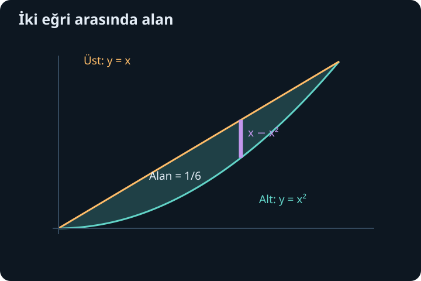
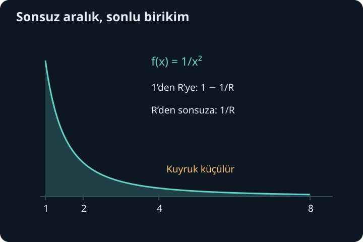

import ArticleVideo from '@/components/ArticleVideo.astro'
import kavram from './media/01-kavram.mp4?url'
import kavramPoster from './media/01-kavram.jpg?url'

İntegral bir formülden çok bir toplama düzenidir. Önce küçük parçanın neyi ölçtüğünü belirler, sonra o parçaları bir aralık boyunca toplarız. Parça bazen ince bir dikdörtgen, bazen ince bir disk, bazen kısa sürede alınan yol olur. Aynı integral işareti farklı büyüklükler için kullanılabilir; anlamı, integrandın ve değişkenin birlikte taşıdığı birimlerden gelir.

[Önceki yazıda](/blog/integral-alma-yontemleri/) değişken değiştirme, kısmi integrasyon ve cebirsel ayrıştırma yöntemlerini öğrendik. Burada bu hesapları ölçme sorularına bağlayacağız. Ardından birikim aralığı sonsuza uzadığında veya fonksiyon sınırsızlaştığında integralin nasıl tanımlanacağını inceleyeceğiz. Sonsuz bir şeklin sonlu alanı olabilmesi şaşırtıcıdır; bunu mümkün kılan şey, uzak parçaların yeterince hızlı küçülmesidir.

## 1. İki grafik arasındaki alan

Bir aralıkta üstte $f(x)$, altta $g(x)$ bulunsun. Düşey bir şeridin yüksekliği $f(x)-g(x)$, genişliği yaklaşık $\Delta x$'tir. Şerit alanı yaklaşık $[f(x)-g(x)]\Delta x$ olduğundan limitte:

$$
A=\int_a^b[f(x)-g(x)]dx
$$

olur. Bu formülde “üst eksi alt” sözü yalnız bir ezber değildir; geometrik bir uzunluk hesaplıyoruz ve uzunluğun negatif olmamasını istiyoruz.

$y=x$ ile $y=x^2$ arasındaki kapalı bölgeyi ele alalım. Kesişimler $x=x^2$, yani $x(x-1)=0$ denkleminden $x=0$ ve $x=1$ çıkar. Bu aralıkta $x\geq x^2$ olduğundan doğru üsttedir. Alan:

$$
A=\int_0^1(x-x^2)dx
=\left[\frac{x^2}{2}-\frac{x^3}{3}\right]_0^1
=\frac12-\frac13=\frac16.
$$

Eğer eğriler aralık içinde yer değiştiriyorsa integral aralığını kesişim noktalarında bölmeliyiz veya $|f-g|$ kullanmalıyız. Tek bir farkı bütün aralıkta toplamak, bazı bölgeleri negatif sayıp alanları birbirinden çıkarabilir. Önce kaba bir grafik veya işaret tablosu oluşturmak bu hatayı önler.

## 2. Yatay dilim bazen daha kolaydır

Aynı bölgeyi yatay dilimlerle de toplayabiliriz. $y=x$ doğrusu $x=y$, $y=x^2$ eğrisinin pozitif dalı $x=\sqrt y$ olur. $0\leq y\leq1$ için sağdaki sınır $\sqrt y$, soldaki sınır $y$'dir. Yatay şeridin uzunluğu $\sqrt y-y$ ve kalınlığı $dy$ olduğundan:

$$
A=\int_0^1(\sqrt y-y)dy
=\left[\frac23y^{3/2}-\frac{y^2}{2}\right]_0^1
=\frac23-\frac12=\frac16.
$$

İki hesap aynı bölgeyi farklı yönde dilimler. Değişken seçimi fiziksel alanı değiştirmez; sınırların yazılışını değiştirir. Bazı bölgeler düşey yönde birkaç parçaya ayrılırken yatay yönde tek integral ile anlatılabilir. “Mutlaka $dx$ kullanmalıyım” düşüncesi yerine hangi dilimin sınırlarını daha kolay yazabildiğimize bakarız.

## 3. Kesit alanlarından hacme

Bir cismin $x$ konumundaki dik kesit alanı $B(x)$ olsun. Kalınlığı küçük $\Delta x$ olan dilimin hacmi yaklaşık $B(x)\Delta x$ olur. Kesit alanı uygun biçimde sürekli değişiyorsa bütün hacim:

$$
V=\int_a^b B(x)dx
$$

ile bulunur. Alanın birimi metrekare ve $x$ metre ise çarpım metreküptür. Hacmi hesaplamak için her zaman üç katlı integral gerekmez; kesitleri zaten biliyorsak tek değişkenli toplama yeterlidir.

$y=x$ doğrusunun $0\leq x\leq2$ altında kalan bölgeyi $x$ ekseni çevresinde döndürelim. Her kesit yarıçapı $x$ olan bir dairedir; $B(x)=\pi x^2$. Böylece:

$$
V=\pi\int_0^2x^2dx=\pi\left[\frac{x^3}{3}\right]_0^2=\frac{8\pi}{3}.
$$

Ortaya taban yarıçapı 2, yüksekliği 2 olan koni çıkar. Bilinen koni formülü $\pi r^2h/3$ de aynı sonucu verir. İntegral, bu formülün neden üçte bir çarpanı taşıdığını dilimlerin değişen alanıyla açıklar.

## 4. Delikli kesit: halka yöntemi

Dönme bölgesi eksene değmiyorsa kesit bir disk yerine halka olabilir. Dış yarıçap $R(x)$, iç yarıçap $r(x)$ ve $R\geq r\geq0$ olsun. Halka alanı dış diskten iç diski çıkarınca:

$$
B(x)=\pi[R(x)^2-r(x)^2]
$$

olur. Burada $\pi(R-r)^2$ yazmak yanlıştır; yarıçap farkının karesi, iki disk alanının farkı değildir.

$y=x$ ile $y=x^2$ arasındaki önceki bölgeyi $x$ ekseni çevresinde döndürürsek $0\leq x\leq1$ için $R=x$, $r=x^2$ olur. Hacim:

$$
V=\pi\int_0^1(x^2-x^4)dx
=\pi\left(\frac13-\frac15\right)=\frac{2\pi}{15}.
$$

Geometrik alanın $1/6$ olması ile dönmüş cismin hacminin $2\pi/15$ olması arasında eşitlik beklemeyiz; farklı boyutlarda büyüklükler ölçüyoruz. Ayrıca dönüş eksenini değiştirirsek yarıçapları yeniden hesaplamalıyız. Eksen her zaman koordinat ekseni olmak zorunda değildir; yarıçap, seçilen eksene dik uzaklıktır.

## 5. Bir fonksiyonun aralık ortalaması

Sonlu sayıların ortalaması toplamın adet sayısına bölünmesidir. Sürekli bir fonksiyonun $[a,b]$ üzerindeki ortalama değeri de birikimin aralık uzunluğuna bölünmesiyle tanımlanır:

$$
f_{\mathrm{ort}}=\frac1{b-a}\int_a^b f(x)dx,\qquad a<b.
$$

Böylece sabit yüksekliği $f_{\mathrm{ort}}$ olan dikdörtgen aynı işaretli birikimi verir. $f$ sürekli olduğunda bu ortalama, en küçük ve en büyük değerler arasında kalır. Ara değer teoremi sayesinde en az bir noktada gerçekten alınır.

$f(x)=x^2$ için $[0,3]$ ortalaması $(1/3)[x^3/3]_0^3=3$ olur. Fonksiyon bu değeri $x=\sqrt3$'te alır. Uç değerlerin aritmetik ortalaması $(0+9)/2=4{,}5$'tir; farklı sonuç çıkar. Yalnız uçları ortalamak, fonksiyonun aralıktaki dağılımını hesaba katmaz. Doğrusal fonksiyonlarda bu kısa yol çalışır, fakat genel bir kural değildir.

## 6. Hızdan yer değiştirme ve yol

Bir doğru üzerindeki konumu $s(t)$, işaretli hızı $v(t)=s'(t)$ ile gösterelim. $t$ zaman olsun. Temel teorem:

$$
s(b)-s(a)=\int_a^b v(t)dt
$$

der. Bu yer değiştirmedir; son konum ile ilk konumun farkını ölçer. Toplam yol ise ileri ve geri gidilen uzunlukları ayrı ayrı pozitif sayar:

$$
\text{toplam yol}=\int_a^b|v(t)|dt.
$$

Örneğin $0\leq t\leq4$ saniye boyunca $v(t)=t-2$ metre/saniye olsun. İlk iki saniyede hız negatif, son iki saniyede pozitiftir. Yer değiştirme $[t^2/2-2t]_0^4=0$ metredir. Toplam yol ise:

$$
\int_0^2(2-t)dt+\int_2^4(t-2)dt=2+2=4\ \text{metre}
$$

olur. Cisim başladığı yere dönmüş ama hareketsiz kalmamıştır. İşaretli alan sıfır, mutlak alan dört olduğu için bu ayrım grafikte de görülebilir. Bu örnekte kuvvet veya enerji bilgisi gerekmiyor; yalnız konumun türevi ile birikimini kullanıyoruz.

<ArticleVideo src={kavram} poster={kavramPoster} title="İşaretli birikim ile toplam yol" caption="Hızın işaret değiştirdiği bölgelerde yer değiştirme katkıları birbirini azaltır; toplam yol her iki yöndeki hareketi pozitif sayar." />

## 7. Sonsuz aralıkta integral bir limittir

Şimdi $\int_1^\infty 1/x^2\,dx$ yazımını ele alalım. Sonsuzluk sıradan bir üst sınır sayısı değildir; önce sonlu $R>1$ için hesap yapar, sonra $R$'yi büyütürüz:

$$
\int_1^\infty\frac{dx}{x^2}
:=\lim_{R\to\infty}\int_1^R\frac{dx}{x^2}
=\lim_{R\to\infty}\left(1-\frac1R\right)=1.
$$

İki nokta ve eşittir birlikte, soldaki ifadenin sağdaki limit ile tanımlandığını belirtir. Limit sonluysa integral **yakınsaktır**. Sonlu bir limit yoksa **ıraksaktır**. Sonsuza uzanan bölgenin alanı burada 1'dir. Yatay uzunluk sınırsız olsa da yükseklik yeterince hızlı küçülür.

Buna karşılık $\int_1^R dx/x=\ln R$ olur ve $R\to\infty$ iken sınırsız büyür. $1/x$ de sıfıra yaklaşır, fakat toplam alanı sonlu yapmak için yeterince hızlı azalmaz. İntegrandın sıfıra yaklaşması tek başına yeterli bir yakınsaklık testi değildir.

## 8. Sonsuzdaki p testi

$p$ gerçek bir sabit olsun. $p\ne1$ için güç kuralı:

$$
\int_1^R x^{-p}dx=\frac{R^{1-p}-1}{1-p}
$$

verir. $p>1$ ise $1-p<0$ olduğundan $R^{1-p}\to0$ ve sonuç $1/(p-1)$ olur. $p<1$ ise pozitif üs nedeniyle $R^{1-p}$ büyür. $p=1$ durumunu logaritmayla zaten inceledik. Dolayısıyla:

$$
\int_1^\infty\frac{dx}{x^p}\text{ ancak ve ancak }p>1\text{ iken yakınsaktır.}
$$

Buradaki başlangıç noktası 1 yerine herhangi bir pozitif sayı olabilir; sonsuzdaki yakınsaklık davranışı değişmez. Sonlu başlangıç parçası yalnız toplam değeri değiştirir. Test bize büyük girdilerde ne olduğuna bakmanın neden yeterli olduğunu gösterir.

## 9. Sınırlı aralıkta sınırsız yükseklik

Uygunsuzluk yalnız sonsuz aralıktan doğmaz. $1/\sqrt x$, sıfıra yaklaşırken sınırsızdır. Bu nedenle integralini sıfırdan doğrudan sıradan sürekli fonksiyon teoremiyle alamayız. Önce $\varepsilon>0$ seçeriz:

$$
\int_0^1\frac{dx}{\sqrt x}
:=\lim_{\varepsilon\to0^+}\int_\varepsilon^1x^{-1/2}dx
=\lim_{\varepsilon\to0^+}(2-2\sqrt\varepsilon)=2.
$$

Yüksekliğin sınırsız olması alanın zorunlu olarak sonsuz olacağı anlamına gelmez. Buna karşılık $\int_\varepsilon^1dx/x=-\ln\varepsilon$ büyüdüğünden $\int_0^1dx/x$ ıraksar. Genel güç hesabı $\int_0^1x^{-p}dx$ integralinin ancak $p<1$ iken yakınsak olduğunu verir.

Sonsuz uçtaki koşul $p>1$, sıfırdaki koşul $p<1$'dir. Bu farkı bir çelişki gibi görmeyelim: iki farklı bölgedeki davranışı inceliyoruz. $x^{-p}$ büyük $x$ için $p$ arttıkça daha hızlı küçülür; küçük pozitif $x$ için ise daha hızlı büyür.

## 10. İç tekillikleri ayrı ayrı ele almak

Bir fonksiyon $[a,b]$ aralığının içindeki $c$ noktasında sınırsızsa iki tarafı ayrı limitlerle tanımlarız:

$$
\int_a^b f(x)dx
=\lim_{u\to c^-}\int_a^u f(x)dx
+\lim_{v\to c^+}\int_v^b f(x)dx.
$$

Standart uygunsuz integralin yakınsak olması için iki limitin de ayrı ayrı sonlu olması gerekir. $f(x)=1/x$ için $[-1,1]$ aralığında sol limit negatif sonsuza, sağ limit pozitif sonsuza gider. Bu yüzden integral yakınsak değildir.

$\int_{-1}^{-\varepsilon}dx/x+\int_\varepsilon^1dx/x=0$ eşitliği doğrudur. Fakat iki kesmeyi aynı hızla yaklaştırmak, farklı bir kavram olan simetrik esas değeri hesaplar. Bir tarafta $\varepsilon$, diğer tarafta $2\varepsilon$ seçilse sonuç başka bir sabit olur. Bağımsız limit koşulu tam da bu keyfi iptalleri önler. Sonsuz aralığın iki ucu varsa da aynı ilke geçerlidir: iki kuyruğu ayrı denetleriz.

## 11. Karşılaştırmayla karar vermek

Bazen antitürevi bulmadan yakınsaklığa karar verebiliriz. Yeterince büyük $x$ için $0\leq f(x)\leq g(x)$ olsun. $g$'nin kuyruğunun integrali sonluysa $f$'ninki de sonludur. Gerekçe, $f$'nin sonlu kesmelerdeki birikiminin artan ama $g$'nin toplamıyla yukarıdan sınırlı olmasıdır. Gerçek sayıların tamlığı bu artan sınırlı birikime bir limit verir.

Örneğin $x\geq1$ için $0\leq1/(1+x^2)\leq1/x^2$ olduğundan ilk integral yakınsaktır. Aslında antitürevi arktanjantla değerini $\pi/4$ bulabiliriz, fakat karşılaştırma değeri bilmeden varlığı garanti etti. Ters yönde, $f\geq g\geq0$ ve $g$'nin integrali ıraksaksa $f$ de ıraksaktır. Eşitsizliği yanlış yönde kullanmak sonuç vermez.

## 12. İşaret değişimiyle yakınsaklık

Pozitif fonksiyonlarda biriken toplam yalnız artar. İşaret değişen fonksiyonlarda karşılıklı iptal başka bir yakınsaklık türü doğurabilir. $\int_1^\infty\sin x/x\,dx$ örneğine bakalım. Kısmi integrasyonla sonlu $R$ için:

$$
\int_1^R\frac{\sin x}{x}dx
=\left[-\frac{\cos x}{x}\right]_1^R
-\int_1^R\frac{\cos x}{x^2}dx.
$$

Sınır terimi sonlu bir değere yaklaşır. Son integralin mutlak değeri, $\int_1^\infty1/x^2dx$ ile kontrol edilir. Bu nedenle sinüslü uygunsuz integral yakınsaktır. Burada değerini hesaplamadık; yakınsaklığını gerekçelendirdik.

Ancak mutlak değer alınırsa $\int_1^\infty|\sin x|/x\,dx$ ıraksar. Her $[n\pi+\pi/6,n\pi+5\pi/6]$ aralığında $|\sin x|\geq1/2$ ve $x\leq(n+1)\pi$ olur. Bu parçanın katkısı en az $1/[3(n+1)]$'dir. Bu alt sınırların toplamı sınırsız büyür: paydaları 2 ile 4, 4 ile 8, 8 ile 16 arasındaki gruplara ayırdığımızda her grup sabit bir pozitif alt katkı verir. Grup sayısı büyüdükçe toplam da büyür.

Mutlak değerli integral de yakınsaksa **mutlak yakınsaklık**, yalnız işaretli integral yakınsaksa **koşullu yakınsaklık** deriz. İptale bağlı bir sonucun, toplam geometrik alanın sonluluğunu söylemediğini bu örnek açıkça gösterir. Birikim hesaplarında önce neyi topladığımızı, sonra limitin nasıl alındığını belirtmek bütün bu ayrımları düzenler. Bir sonraki yazıda sürekli parçalar yerine tek tek sayıları sonsuza kadar toplayarak serileri kuracağız.

## Kaynaklar

- [OpenStax, Calculus Volume 2: Determining Volumes by Slicing](https://openstax.org/books/calculus-volume-2/pages/2-2-determining-volumes-by-slicing)
- [OpenStax, Calculus Volume 2: Improper Integrals](https://openstax.org/books/calculus-volume-2/pages/3-7-improper-integrals)
