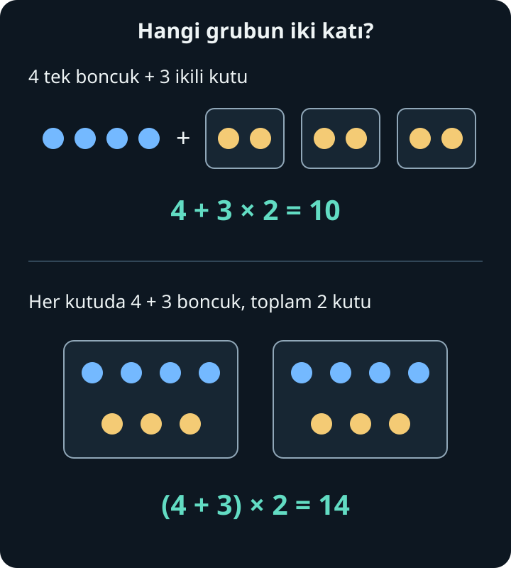
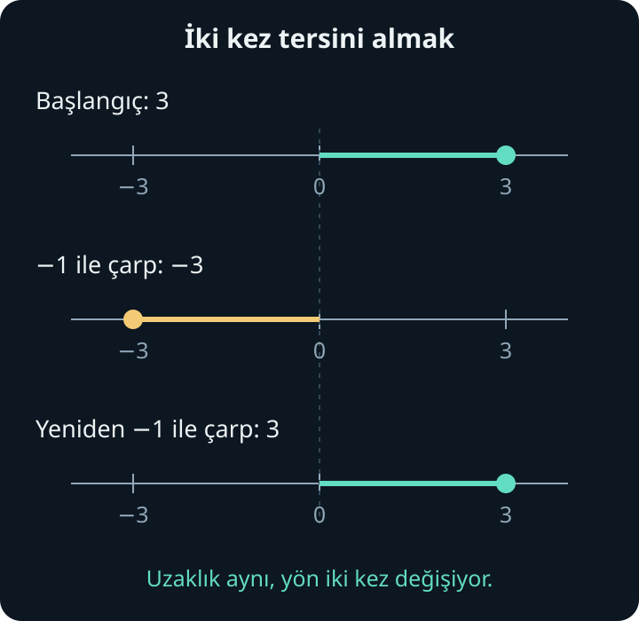

import ArticleVideo from '@/components/ArticleVideo.astro'
import dagilma from './media/01-dagilma.mp4?url'
import dagilmaPoster from './media/01-dagilma.jpg?url'

Masada dört tek boncuk ve içinde ikişer boncuk bulunan üç kutu var. Toplamı saymak kolay: kutularda altı, dışarıda dört boncuk; birlikte on boncuk. Bunu tek satıra yazalım:

$$
4+3\times2=10
$$

Peki satırın en solundan başlayıp önce $4+3=7$, sonra $7\times2=14$ deseydik? Sayıları doğru toplar ve çarpardık, ama masadaki düzenin hesabını yapmamış olurduk. Çünkü son adımda dışarıdaki dört boncuğu da iki katına çıkarmış olurduk.

**Bir işlemi doğru yapmak kadar, o işlemin hangi miktarlara uygulandığını doğru okumak da gerekir.** Bu yazıda parantezlerin, işlem sırasının ve eşitlik işaretinin kurduğu düzeni inceleyeceğiz. Sonra aynı hesabı farklı biçimlerde yazmayı sağlayan özelliklere geçecek; negatif sayılarla çarpmanın işaretlerini de bu özelliklerle açıklayacağız.

[Önceki yazıda](/blog/oran-oranti-ve-yuzde/) oran, orantı ve yüzde hesapları yaptık. Burada dört işlemin, kesirlerin ve sayı doğrusundaki negatif sayıların anlamını kullanacağız. Harflerle denklem çözmeyi henüz bildiğimizi varsaymayacağız. Üslerin ve köklerin ayrıntıları sıradaki ana konumuz; bu yazının örnekleri dört işlemle kurulacak.

## 1. Bir İşlem Satırının Anlamı

$4+3\times2$ ifadesinde iki bölüm var: dışarıdaki dört boncuk ve üç kutunun içindeki boncuklar. Çarpma, kutulardaki toplamı bulur; toplama, bu toplamla dışarıdaki boncukları birleştirir.

Aynı sayılarla başka bir düzen kuralım. Bu kez her birinde dört mavi ve üç sarı boncuk olan iki kutumuz olsun. Önce bir kutudaki toplamı bulur, sonra iki kutuyu sayarız:

$$
(4+3)\times2=7\times2=14
$$

Parantez, “bu iki miktarı birlikte bir grup olarak ele al” der. İkiyle çarpılan şey yalnızca 3 değil, **$4+3$ toplamının tamamıdır**.

İşlem sırası, parantezsiz bir satırın nasıl okunacağını ortaklaştıran bir yazım uzlaşımıdır. Çarpma ve bölmeyi, toplama ve çıkarmadan önce ele alırız. Böylece $4+3\times2$ yazımı, $4+(3\times2)$ anlamına gelir. Başka bir gruplama istiyorsak bunu parantezle belirtiriz.

Bu düzen, “çarpma doğada her zaman toplamadan önce gerçekleşir” demek değildir. Bir hesapta önce toplamak istiyorsak bunu yazabiliriz. Ama yazdığımız ifade, istediğimiz hesabı açıkça anlatmalıdır.

### İfade ve değer

$4+3\times2$ bir **sayısal ifadedir**: sayılar ve işlemlerle bir miktarı tarif eder. Bu ifadenin değeri 10'dur. Aynı değeri $6+4$, $2\times5$ veya $20\div2$ ile de tarif edebiliriz.

İlerleyen bölümlerde bir ifadeyi başka bir ifadeye dönüştüreceğiz. Amaç, hesabı daha anlaşılır veya kolay hâle getirirken **değerini korumak** olacak.

## 2. Öncelik ve Soldan Sağa İlerlemek

Dört işlem içeren ifadelerimizde düzeni üç katmanda okuyabiliriz:

1. Parantezle gruplanan bölümün içini kendi kurallarına göre hesaplarız. İç içe gruplar varsa en içtekinden başlarız.
2. Çarpma ve bölmeleri, aynı düzeyde soldan sağa yaparız.
3. Toplama ve çıkarmaları, aynı düzeyde soldan sağa yaparız.

Buradaki “aynı düzeyde” sözü önemlidir. İfadenin en solundaki işlemi, başka hiçbir şeye bakmadan yapmıyoruz. Önce grupları ve öncelikleri belirliyoruz.

### Çarpma, bölmeden önce gelmez

Çarpma ile bölme **eşit önceliklidir**. Örneğin:

$$
18\div3\times2=6\times2=12
$$

İlk işlem $18\div3$'tür. Önce $3\times2$ yaparsak farklı bir ifade hesaplamış oluruz:

$$
18\div(3\times2)=18\div6=3
$$

İlk yazımda 18'i üçe bölüp sonucu iki katına çıkardık. İkincisinde 18'i altıya böldük. Parantez, paylaştığımız grup sayısını değiştirdi.

### Toplama, çıkarmadan önce gelmez

Toplama ile çıkarma da eşit önceliklidir:

$$
20-8+3=12+3=15
$$

Önce $8+3$ yapmak, $20-(8+3)=9$ ifadesini hesaplamak olurdu. İlk ifadede 8'i çıkarıp 3 ekliyoruz; ikinci ifadede toplam 11 çıkarıyoruz.

Bu nedenle kuralları “önce çarpma, sonra bölme, sonra toplama, sonra çıkarma” diye dört ayrı basamak hâlinde ezberlemek yanlış sonuca götürür. Çarpma–bölme bir çift, toplama–çıkarma başka bir çifttir.

Üslü ifadeler de devreye girdiğinde, üs hesabı çarpma ve bölmeden önce ele alınır. Üssün neyi anlattığını ve parantezin bu hesabı nasıl etkilediğini bir sonraki yazıda kuracağız. Buradaki üç katman, **şimdiki dört işlem örneklerimizin** okuma düzenidir.

## 3. Parantezin İçinde de Bir Düzen Var

Parantez görmek, içindeki bütün sayıları soldan sağa gelişigüzel işlemek anlamına gelmez. İçeride de çarpma ve bölme, toplama ve çıkarmadan önce gelir:

$$
2\times(3+4\times2)=2\times(3+8)
$$

$$
=2\times11=22
$$

Parantezin içindeki $4\times2$ grubunu bulduk, 3 ekledik, elde edilen 11'in iki katını aldık.

İç içe parantezlerde dıştaki grubu daha rahat seçebilmek için köşeli parantez de kullanabiliriz. Bu yazıda $(\ )$ ve $[\ ]$ aynı gruplama görevini görüyor. Örneğin:

$$
30-2\times[7-(5-2)]
$$

En içteki $5-2$ işlemi 3 eder. Sonra köşeli parantezin içi $7-3=4$ olur. Böylece ifade $30-2\times4$ hâline gelir. Çarpmayı yapıp $30-8=22$ buluruz. Her adımda yalnızca hesapladığımız grubu, değeriyle değiştirdik.

### Kesir çizgisi de gruplar

Kesir çizgisinin üstündeki bölümün tamamı pay, altındaki bölümün tamamı paydadır:

$$
\frac{8+4}{2+1}=\frac{12}{3}=4
$$

Tek satırlık bölme işaretiyle aynı anlamı korumak için parantez gerekir:

$$
(8+4)\div(2+1)
$$

Buna karşılık $8+4\div2+1$ yazarsak yalnızca 4'ü 2'ye bölmüş oluruz. Sonuç $8+2+1=11$ çıkar. Kesir çizgisini silerken onun yaptığı gruplamayı da silmemeliyiz.

Pay ve payda ayrı gruplar olduğu için önce ikisini kendi içinde hesaplarız. Birinin hesabı diğerini beklemek zorunda değildir; son adımda payı paydaya böleriz. Payda sıfır çıkarsa işlem tanımsızdır: $36\div(7-7)$ ifadesinde parantez 0 eder ve sıfıra bölme yapılamaz.

## 4. Eşittir İşareti “Sonra Şunu Yap” Demek Değildir

Bir hesabın ara adımlarını yazarken eşittir işaretini sık kullanırız. Bu işaretin iki yanındaki ifadelerin **aynı değerde** olduğunu söylüyoruz:

$$
4+3\times2=4+6=10
$$

Zincirin her bölümü 10 değerindedir. Bu yüzden eşitlikleri arka arkaya yazmak doğrudur.

Ama `4 + 3 × 2 = 6 = 10` yazımı doğru olmaz. 6, yalnızca çarpma grubunun sonucudur; ifadenin dışındaki 4 hâlâ duruyor. Ara sonucu yazarken hesabın geri kalanını kaybedersek, eşit olmayan miktarları eşitlemiş oluruz.

Hesabı birden fazla satıra yaymakta da sorun yoktur. Yeter ki her satırda ifadenin tamamının hangi değere dönüştüğünü izleyelim. Bu alışkanlık, harflerle işlem yapmaya başladığımızda da yanlışları bulmamızı kolaylaştıracak.

## 5. Hangi İşlemlerin Yeri ve Gruplanışı Değişebilir?

İşlem sırasını öğrendikten sonra her hesabı mutlaka aynı adımlarla yapmak zorunda değiliz. Değeri koruduğunu bildiğimiz özelliklerle ifadeyi yeniden düzenleyebiliriz. Önce bu özellikleri ayıralım.

### Yer değiştirmek

Toplamada iki miktarın yerini değiştirmek toplamı değiştirmez: $7+5=5+7=12$. Çarpmada da $3\times4=4\times3=12$. Bir dikdörtgenin içindeki kareleri üç sıra dörder veya dört sütun üçer sayabiliriz. Bunlar toplama ve çarpmanın **değişme özellikleridir**.

Çıkarma ve bölmede aynı serbestlik yoktur:

$$
7-5=2,\qquad 5-7=-2
$$

$$
12\div3=4,\qquad 3\div12=\frac14
$$

İşlemin adını bilmek, hangi yeniden düzenlemelerin güvenli olduğunu da söyler.

### Aynı sırayı farklı gruplamak

Toplamada ve çarpmada, sayıların sırasını değiştirmeden parantezleri farklı yerleştirebiliriz:

$$
(2+3)+5=2+(3+5)=10
$$

$$
(2\times3)\times5=2\times(3\times5)=30
$$

Bunlara **birleşme özellikleri** denir. “Değişme” sayıların yerleriyle, “birleşme” önce hangi grubun hesaplandığıyla ilgilidir.

Bu iki özelliği birlikte kullanarak $27+8+73$ toplamında önce 27 ile 73'ü bir araya getirebiliriz. Bunlar 100 eder; 8 ekleyince 108 buluruz. $4\times13\times25$ çarpımında da 4 ile 25'i eşleştirir, $100\times13=1300$ hesaplarız. Önce eşdeğer bir yazım kurduğumuz için bu kısa yollar, işlem sırasıyla çelişmez.

Çıkarmada parantezin yerini değiştirmek sonucu değiştirir. $(14-6)-2=6$ iken $14-(6-2)=10$ olur. Bölmede de $(24\div6)\div2=2$ iken $24\div(6\div2)=8$'dir.

### Çıkarma içeren bir toplamı düzenlemek

Çıkarmayı, çıkarılan sayının ters işaretlisini eklemek olarak okuyabiliriz. Sayı doğrusunda 5 çıkarmak ile $-5$ eklemek aynı yere götürür:

$$
12-5+3=12+(-5)+3
$$

Artık bir toplama var. Toplanan miktarları yer değiştirirsek **eksi işareti $-5$ ile birlikte hareket eder**:

$$
12+3+(-5)=15-5=10
$$

$12+5-3$ yazmak aynı düzenleme değildir; o ifade 14 eder. Yer değiştirdiğimiz şey yalnızca “5 rakamı” değil, $-5$ sayısıdır.

## 6. Dağılma: Her Parça Aynı Çarpandan Payını Alır

Dört sıra kare düşünelim. Her sırada üç yeşil, iki sarı kare olsun. Bir sırada beş kare; dört sırada yirmi kare var:

$$
4\times(3+2)=4\times5=20
$$

Şimdi renkleri ayrı sayalım. Dört sıranın her birinde üç yeşil kare var: $4\times3=12$. Yine dört sıranın her birinde iki sarı kare var: $4\times2=8$. Aynı yirmi kareyi farklı biçimde saydık:

$$
4\times(3+2)=4\times3+4\times2
$$

Bu, çarpmanın toplama üzerine **dağılma özelliğidir**. Parantezdeki toplamın tamamını dörtle çarpmak, her parçasını ayrı ayrı dörtle çarpıp birleştirmekle aynı sonucu verir.

<ArticleVideo
  src={dagilma}
  poster={dagilmaPoster}
  title="Dağılma: aynı bütün, iki hesap"
  caption="Yirmi kare yer değiştiriyor ama sayıları değişmiyor. Bütün 4 × 5; parçalar 4 × 3 ve 4 × 2. Dört sıra, iki parçanın da içinde korunuyor."
/>

$4\times3+2$ yazsaydık yalnızca yeşil bölümün dört sırasını saymış, sarı bölümden tek sıra almış olurduk. Sonuç 14 çıkardı. Dışarıdaki çarpan, toplamın **her iki parçasına** uygulanmalıdır.

Bazı yazımlarda çarpma işareti gösterilmez: $4(3+2)$, $4\times(3+2)$ anlamındadır. Bu yan yana yazımı gördüğümüzde parantezdeki grubun dört katı istendiğini anlarız. Bu yazıda hesabın daha açık görünmesi için çoğunlukla $\times$ işaretini kullanacağız.

### Çıkarmaya da dağıtmak

Dört sıra beşer kareden, her sıradaki iki kareyi çıkaralım. Her sırada üç kare kalır. Aynı sonucu, yirmi kareden çıkarılan sekiz kareyi eksilterek de buluruz:

$$
4\times(5-2)=4\times5-4\times2
$$

$$
=20-8=12
$$

Çıkarma işaretini koruduk; çıkarılan parçanın da dört katını aldık.

Bu özellik zihinden hesabı kolaylaştırabilir. $6\times19$ için 19'u $20-1$ olarak yazalım: $6\times20-6\times1=120-6=114$. Burada dışarıdaki 6'yı hem 20'ye hem 1'e uyguladık.

### Ters yönde okumak: ortak çarpan

Dağılma eşitliğini ters yönde de okuyabiliriz:

$$
4\times3+4\times2=4\times(3+2)
$$

İki çarpımda da 4 bulunduğu için buna **ortak çarpan** deriz. Dört sırayı bir kez belirtip her sıranın içindeki iki miktarı topladık. Bu işleme ortak çarpan parantezine almak denir.

Örneğin $7\times8+7\times2$, yedi tane sekizlik grup ile yedi tane ikilik gruptur. Sekizlikleri ve ikilikleri eşleştirince yedi tane onluk grup olur: $7\times(8+2)=70$.

## 7. Negatif Sayılarla Çarpmada İşaret Nereden Geliyor?

Üç tane $-4$ miktarını birleştirelim. Sayı doğrusunda her biri sola doğru dört birimlik üç hareket düşünürsek, toplam hareket sola on iki birimdir:

$$
3\times(-4)=(-4)+(-4)+(-4)=-12
$$

Bu, pozitif bir tam sayı kadar negatif miktarı toplamanın anlamıdır. Çarpmanın değişme özelliğini koruduğumuzda $(-4)\times3$ de aynı sonucu verir.

Ama $(-3)\times(-4)$ ifadesini “eksi üç tane grup” diye düşünmek doğrudan işe yaramaz. Çarpmayı negatif çarpanlara genişletirken, saymanın ötesinde bir açıklamaya ihtiyacımız vardır.

**Toplama ile çarpma arasındaki dağılma ilişkisini negatif sayılarda da koruyalım.** Bu istek, iki negatif çarpanın sonucunun neden pozitif olması gerektiğini gösterecek.

### Birbirini sıfırlayan iki parçayı çarpmak

$4+(-4)=0$ olduğunu biliyoruz. Bu toplamı $-3$ ile çarparsak sonuç 0 olmalıdır; herhangi bir sayının sıfır katı 0'dır. Dağılma özelliği aynı bütünü iki parçayla yazmamızı sağlar:

$$
(-3)\times[4+(-4)]=0
$$

$$
(-3)\times4+(-3)\times(-4)=0
$$

İlk çarpım $-12$'dir. O hâlde ikinci çarpım, $-12$ ile toplandığında 0 veren sayı olmak zorundadır. Bu sayı $+12$'dir:

$$
(-3)\times(-4)=12
$$

Önceden kurduğumuz toplama ve çarpma ilişkilerinin tutarlı kalması, bu sonucun pozitif olmasını gerektirir. Aynı düşünce başka negatif çarpanlar için de çalışır: Bir pozitif sayı ile ters işaretlisinin toplamını sıfır yapan düzeni koruruz.

### Negatif çarpan: büyüklük ve yön

Bir sayıyı $-1$ ile çarpmak, onun toplamsal tersini verir: 3'ü $-3$'e, $-3$'ü 3'e götürür. *Toplamsal ters*, sayı ile toplandığında 0 veren sayının adıdır. Sayı doğrusunda bu iki sayı, sıfıra eşit uzaklıkta karşı taraflarda durur.

$-2$ ile çarpmayı da büyüklüğü iki katına çıkarıp yönü tersine çevirmek olarak okuyabiliriz. Örneğin $(-2)\times(-3)=6$: $-3$'ün iki katı $-6$, onun toplamsal tersi 6'dır. Negatif sayıyı yeniden ters yöne çevirdiğimizde pozitif tarafa geçeriz.

Sonuç olarak sıfırdan farklı çarpanlar için aynı işaretler pozitif, farklı işaretler negatif çarpım verir. Bir çarpan sıfırsa sonuç sıfırdır; sıfırı pozitif veya negatif saymayız. Bu işaret düzeni kesirli ve ondalık çarpanlarla da korunur: $(-0{,}5)\times(-6)=3$.

### Bölmenin işaretini çarpmayla kontrol etmek

$(-12)\div3$, “3 ile çarpıldığında $-12$ veren sayı ne?” sorusudur. Cevap $-4$'tür. $(-12)\div(-3)$ için ise $-3$ ile çarpıldığında $-12$ veren sayıyı ararız; cevap 4'tür.

Bölmenin işaretleri bu ters ilişkiden gelir. Sıfır olmayan bir bölen için aynı işaretli iki sayının bölümü pozitif, farklı işaretli iki sayının bölümü negatiftir. Sıfırı sıfırdan farklı bir sayıya bölmek 0 verir; sıfıra bölmek ise yine tanımsızdır.

## 8. Eksi İşareti Nereye Kadar Etkili?

Eksi işaretinin iki kullanımını ayırmak yararlıdır. $7-3$ ifadesinde iki miktar arasında çıkarma yaparız. $-3$ yazımında ise 3'ün toplamsal tersini belirtiriz. $-(7-3)$ yazımı, **parantezdeki sonucun tamamının tersini** almamızı ister.

Önce parantezi hesaplayabiliriz:

$$
-(7-3)=-(4)=-4
$$

Ya da bütünün tersini $-1$ ile çarpma olarak yazıp dağıtabiliriz:

$$
(-1)\times(7-3)=(-1)\times7-(-1)\times3
$$

$$
=-7-(-3)=-7+3=-4
$$

İkinci satırdaki $-(-3)=+3$, bir sayının tersini yeniden almanın başlangıca döndürmesidir. Böylece parantezin önündeki eksi, parantez içindeki **her terimin işaretini** tersine çevirir. Terim, bir toplamda işaretiyle birlikte ele aldığımız parçadır; $7-3=7+(-3)$ yazımında bu parçalar $+7$ ve $-3$'tür.

Başka bir ifadenin içindeki parantezi de aynı şekilde açarız:

$$
12-(5-3)=12-5+3=10
$$

Parantezin içi önce hesaplandığında $12-2=10$ bulmamız bunu doğrular. $12-5-3$ yazmak ise 4 verir; ikinci terimin işaretini tersine çevirmeyi unutmuş oluruz.

Parantezin önünde artı varsa içerideki miktarları olduğu gibi ekleriz: $12+(5-3)=12+5-3=14$. Her iki durumda da parantezi kaldırırken, içerideki grubun dışarıdaki işleme nasıl bağlandığını koruruz.

## 9. Bölmeyi Dağıtırken ve Sadeleştirirken

Dağılma özelliğini görmek, her işlemi her yere dağıtabileceğimiz anlamına gelmez. Paydaki bir toplamı, aynı sıfırdan farklı sayıya parça parça bölebiliriz:

$$
\frac{18+12}{6}=\frac{18}{6}+\frac{12}{6}=3+2=5
$$

Bu, toplamın her parçasını $1/6$ ile çarpmakla aynı işlemdir. [Kesirlerde bölmeyi](/blog/kesirler-bir-butunu-bolmek/) ters kesirle çarpma olarak okuyabildiğimizi hatırlayalım.

Ama **paydadaki toplamı** aynı biçimde dağıtamayız:

$$
\frac{18}{3+6}=\frac{18}{9}=2
$$

Oysa $18/3+18/6=6+3=9$ eder. Birinde 18'i toplam dokuz parçaya bölüyoruz; diğerinde aynı 18 üzerinden iki ayrı bölme yapıp sonuçları topluyoruz. Bunlar aynı hesap değildir.

Sadeleştirme de çarpanlarla ilgilidir. Örneğin:

$$
\frac{6+9}{3}=\frac{3\times(2+3)}{3}=2+3=5
$$

Payın **tamamındaki** ortak 3 çarpanını ortaya çıkardık. Üç katına çıkarılmış bir miktarı üçe bölünce o miktarın kendisine döndük. Yalnızca payın içindeki bir terimi bölüp diğerini olduğu gibi bırakamayız. Örneğin $(3+6)/3$, $1+6$ değil, $1+2=3$ eder.

## 10. Bir İfadeyi Baştan Sona Okumak

Şimdi gruplama, öncelik ve işaretleri aynı hesapta bir araya getirelim:

$$
\frac{24-2\times(3+4)}{5}+(-3)\times(-2)
$$

Kesir çizgisi ilk bölümü bir arada tutuyor. Kesrin dışında da iki negatif sayının çarpımı var. Önce içteki $3+4=7$ toplamını bulalım:

$$
\frac{24-2\times7}{5}+(-3)\times(-2)
$$

Paydaki çarpım $2\times7=14$, dışarıdaki çarpım $(-3)\times(-2)=6$ olur. Bu iki çarpım birbirinden bağımsızdır; hangisini önce hesapladığımız sonucu değiştirmez:

$$
\frac{24-14}{5}+6=\frac{10}{5}+6
$$

Payı hesapladık. Şimdi bölme, ardından son toplama gelir:

$$
2+6=8
$$

Aynı düzen ondalık sayılarda ve kesirlerde de geçerlidir. $0{,}5\times(8-2)+1/4$ ifadesinde önce $8-2=6$, sonra $0{,}5\times6=3$ buluruz. Sonuç $3+1/4=3{,}25$'tir. Sayıların gösterimi değişti; grupları okuma biçimimiz değişmedi.

Bu hesapların ortak noktası, her adımda **hangi grubun tamamına işlem yaptığımızı** izlemekti. Parantez grubu belirledi, işlem sırası parantezsiz bölümleri okumamızı sağladı, dağılma aynı değeri başka parçalara ayırdı. İşaret kuralları da bu ilişkilerle birlikte anlam kazandı.

Sıradaki yazıda aynı çarpanı tekrar tekrar kullanmayı inceleyeceğiz: üsler, kareler ve karekökler. Böylece bir uzunluğun karesini almakla o uzunluğu ikiyle çarpmak arasındaki farkı kuracak ve başladığımız Pisagor bağıntısına daha sağlam bir sayı bilgisiyle döneceğiz.

## Kaynaklar ve İleri Okuma

Anlatım, çözümlü örnekler ve görseller bu seri için hazırlandı. Tanımlar ve işlem özellikleri için aşağıdaki açık erişimli kaynaklarla karşılaştırma yapıldı:

- OpenStax, [Prealgebra 2e — Use the Language of Algebra](https://openstax.org/books/prealgebra-2e/pages/2-1-use-the-language-of-algebra): sayısal ifadeler, eşitlik, gruplama işaretleri ve işlem sırası. Bölümün değişkenler ve üslerle ilgili kısımları sonraki yazılara da eşlik edebilir.
- OpenStax, [Prealgebra 2e — Commutative and Associative Properties](https://openstax.org/books/prealgebra-2e/pages/7-2-commutative-and-associative-properties): toplama ve çarpmada yer değiştirme ve farklı gruplama.
- OpenStax, [Prealgebra 2e — Distributive Property](https://openstax.org/books/prealgebra-2e/pages/7-3-distributive-property): çarpmanın toplama ve çıkarma üzerine dağılması.
- OpenStax, [Prealgebra 2e — Multiply and Divide Integers](https://openstax.org/books/prealgebra-2e/pages/3-4-multiply-and-divide-integers): işaretli çarpma, bölme ve bunların ilişkisi.

Bağlantılar 7 Ekim 2026 tarihinde kontrol edildi.
