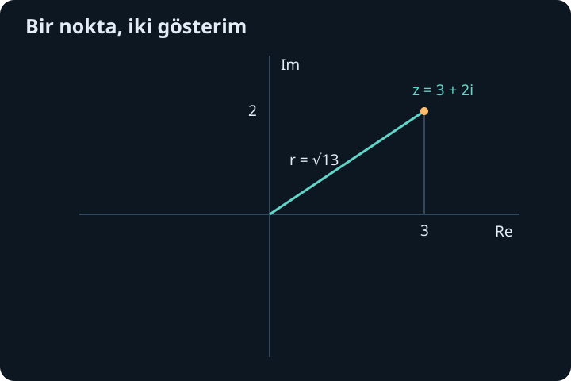
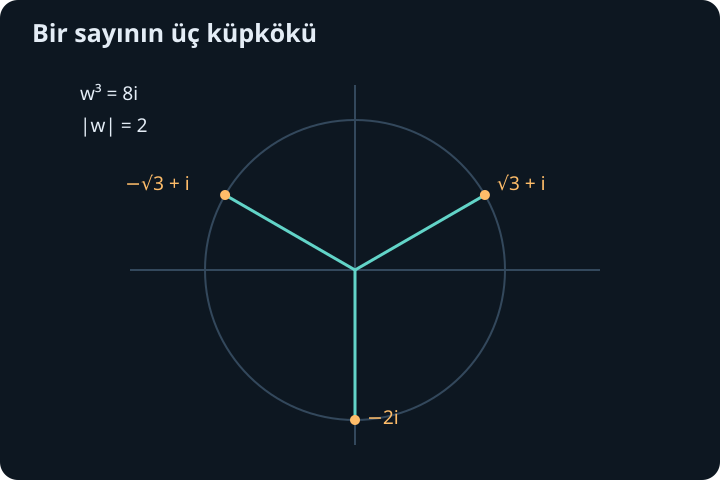

import ArticleVideo from '@/components/ArticleVideo.astro'
import kavram from './media/01-kavram.mp4?url'
import kavramPoster from './media/01-kavram.jpg?url'

Gerçek sayılarda bir sayının karesi negatif olamaz. Bu nedenle $x^2+1=0$ denkleminin gerçek çözümü yoktur. Matematik burada yalnızca “çözülemez” demekle kalmaz; sayı sistemini, eski hesap kurallarını koruyarak genişletmenin mümkün olup olmadığını sorar. Karmaşık sayılar bu genişlemenin sonucudur. Aynı sistem, düzlemde dönmeyi ve periyodik değişimi de kısa bir dille anlatır.

[Önceki yazıda](/blog/sonsuz-seriler-ve-taylor-yaklasimi/) üstel fonksiyon, sinüs ve kosinüsün kuvvet serilerini gerekçeleriyle kurduk. Bu serileri birazdan Euler bağıntısında bir araya getireceğiz. Başlangıç için yalnız cebir, koordinat düzlemi, Pisagor bağıntısı ve trigonometrinin kutupsal açı bilgisi gerekiyor. Fizikteki kullanımına değinirken bir matematik gösterimiyle ölçülen gerçek büyüklüğü ayıracağız.

## 1. Yeni birim ve iki bileşen

$i$ sembolünü $i^2=-1$ koşulunu sağlayan yeni bir sayı birimi olarak tanımlayalım. Bir **karmaşık sayı**:

$$
z=a+bi,\qquad a,b\in\mathbb R
$$

biçimindedir. Burada $a$ ve $b$ gerçek sayılardır. $\operatorname{Re}z=a$ gerçek kısım, $\operatorname{Im}z=b$ sanal kısımdır. Sanal kısım dediğimiz sayı $b$'dir; $bi$ sanal terimdir. “Sanal” sözcüğü tarihsel bir addır, yanlış veya var olmayan hesap anlamına gelmez.

İki karmaşık sayı ancak gerçek kısımları ve sanal kısımları ayrı ayrı eşitse eşittir. $a+bi=c+di$ demek $a=c$ ve $b=d$ demektir. $b=0$ olursa eski gerçek sayıları elde ederiz; böylece gerçek sayılar bu geniş sistemin içinde kalır. Karmaşık sayıların kümesi $\mathbb C$ ile gösterilir.

$i$'nin kuvvetleri kısa bir döngü oluşturur: $i^0=1$, $i^1=i$, $i^2=-1$, $i^3=-i$, $i^4=1$. Dördüncü kuvvetten sonra aynı dört değer tekrarlanır. Örneğin $i^{23}=i^{4\cdot5+3}=i^3=-i$. Bu döngü, yüksek kuvvetleri sadeleştirmenin yanı sıra seri hesaplarında gerçek ve sanal terimleri ayırmamızı sağlayacak.

## 2. Toplama ve çarpma

Toplama, bileşenleri ayrı toplar:

$$
(a+bi)+(c+di)=(a+c)+(b+d)i.
$$

Örneğin $(3+2i)+(-1+4i)=2+6i$ olur. Çıkarmada da aynı düzen geçerlidir. Karmaşık sayıyı düzlemde $(a,b)$ noktası veya başlangıçtan o noktaya giden ok gibi çizdiğimizde toplama, vektör toplamıyla aynı geometrik işlemdir.

Çarpmada dağılma kuralını kullanır ve $i^2=-1$ yazarız:

$$
(a+bi)(c+di)=ac+adi+bci+bd i^2
=(ac-bd)+(ad+bc)i.
$$

$(2+i)(3-2i)$ örneğinde gerçek kısım $6+2=8$, sanal kısım $-4+3=-1$ olur; sonuç $8-i$'dir. Son $+2$ işaretinin nedeni $i(-2i)=-2i^2=2$ olmasıdır. Karmaşık çarpmadaki en yaygın işaret hatası tam bu adımda ortaya çıkar.

Bir gerçek sayı ile çarpma iki bileşeni de aynı oranda ölçekler. $i$ ile çarpma ise $i(a+bi)=-b+ai$ verir: $(a,b)$ noktası $(-b,a)$ noktasına gider. Bu, uzunluğu değiştirmeden saat yönünün tersine çeyrek tur dönmedir. Yeni sayı sistemindeki birim, düzlemde doğal bir geometrik işlem yapmaktadır.

## 3. Eşlenik ve uzaklık

$z=a+bi$ sayısının **eşleniği** $\overline z=a-bi$ olarak tanımlanır. Düzlemde gerçek eksene göre yansımadır. Sayıyla eşleniğini çarparsak:

$$
z\overline z=(a+bi)(a-bi)=a^2+b^2
$$

olur. Çapraz terimler birbirini götürür. Karmaşık sayının başlangıca uzaklığına **modül** denir:

$$
|z|=\sqrt{a^2+b^2},\qquad |z|^2=z\overline z.
$$

Bu tanım Pisagor teoremidir. Gerçek sayılarda alıştığımız mutlak değer, karmaşık düzleme uzaklık olarak genişler. Örneğin $|3+4i|=5$ ve $|-3-4i|=5$ olur. Farkın modülü $|z-w|$, iki karmaşık sayı arasındaki düzlem uzaklığıdır.

Eşlenik toplam ve çarpıma dağılır: $\overline{z+w}=\overline z+\overline w$ ve $\overline{zw}=\overline z\,\overline w$. İkinci özelliği kullanınca $|zw|^2=(zw)\overline{zw}=|z|^2|w|^2$ bulunur. Modüller negatif olmadığından $|zw|=|z||w|$ olur. Birazdan çarpmanın neden uzunlukları çarptığını bu cebirsel sonuçla birlikte geometrik olarak okuyacağız.

## 4. Bölme neden eşlenikle kolaylaşır?

$w=c+di\ne0$ olsun. Bu koşul, $c$ ve $d$'nin aynı anda sıfır olmaması demektir; ayrı ayrı ikisinin de sıfırdan farklı olması gerekmez. Pay ve paydayı $\overline w=c-di$ ile çarparsak payda $c^2+d^2>0$ olur:

$$
\frac zw=\frac{z\overline w}{|w|^2}.
$$

Örneğin:

$$
\frac{3+2i}{1-i}
=\frac{(3+2i)(1+i)}{(1-i)(1+i)}
=\frac{1+5i}{2}.
$$

Sonucun doğruluğunu bölenle çarparak kontrol edelim: $[(1+5i)/2](1-i)=(6+4i)/2=3+2i$. Bölme, sıfır olmayan her karmaşık sayıda mümkündür. Paydayı gerçek hale getirmek yalnız sonucu $a+bi$ biçiminde görmeyi kolaylaştırır; sanal bir sayıya bölmek başlı başına yasak değildir.

Sıfıra bölme burada da tanımsızdır. Sayı sistemini genişletmek, eski tutarlılık koşullarını kaldırmak anlamına gelmez. Örneğin $1/i=-i$ olur; çünkü $i(-i)=1$. Bu küçük örnek, gerçek sayılarda olmayan bölenlerin de düzenli biçimde tersinin alınabildiğini gösterir.

## 5. Gerçek sayı sırasını aynen taşıyamayız

Karmaşık sayıları düzlemde gösterebiliriz ama hepsini gerçek sayılardaki gibi toplama ve çarpmayla uyumlu bir “büyük-küçük” sırasına yerleştiremeyiz. Böyle bir sıralama olsaydı her sıfırdan farklı sayının karesi pozitif olurdu. $i^2=-1$ ise negatif olması gereken sayının pozitif olmasını gerektirirdi. Bu çelişki, alıştığımız düzenin aynen genişletilemediğini gösterir.

Bu nedenle $3+2i>1+i$ gibi bir ifade burada tanımladığımız aritmetikte anlam taşımaz. Modülleri karşılaştırabilir, gerçek kısımları sıralayabilir veya başka açık ölçütler seçebiliriz. Fakat seçtiğimiz ölçütün tüm karmaşık sayılar için gerçek sayı sırasının yerini aldığını varsaymayız. Yeni sistem neyi koruduğunu, neyi değiştirdiğini açıkça belirtmeyi gerektirir.

## 6. Kutupsal biçim ve açı çokluğu

Sıfırdan farklı $z=a+bi$ için $r=|z|>0$ olsun. Pozitif gerçek eksenle yaptığı yönlü açıya $\theta$ diyelim. Birim çember bilgisinden $a=r\cos\theta$, $b=r\sin\theta$ olur. Böylece:

$$
z=r(\cos\theta+i\sin\theta).
$$

$r$ uzaklığı, $\theta$ ise yönü taşır. $\theta$'ya argüman veya uygun bağlamda faz denir. Aynı yön $\theta+2k\pi$ açılarıyla da gösterilir; $k$ herhangi bir tamsayıdır. Dolayısıyla argüman tek bir gerçek sayı değildir. Ana argüman istediğimizde örneğin $(-\pi,\pi]$ aralığında bir temsilci seçebiliriz.

$z=-1+\sqrt3 i$ için modül 2'dir. Nokta ikinci bölgede olduğundan açı $2\pi/3$ olur. Yalnız $\arctan(b/a)$ hesaplamak bölge bilgisini kaybettirebilir; oran $-\sqrt3$ iken arktanjantın ana değeri $-\pi/3$ çıkar ve yanlış yöne bakar. Bileşenlerin işaretleriyle bölgeyi ayrıca belirlemeliyiz.

Sıfırın modülü 0'dır, fakat belirli bir yönü yoktur; sıfır için argüman tanımlamayız. Kutupsal gösterimde bunu gizlemek, daha sonra bölme veya faz hesabında gereksiz belirsizliklere yol açar.

## 7. Karmaşık üstel fonksiyonu tanımlamak

Gerçek üstel fonksiyonun serisi $e^x=\sum_{n=0}^{\infty}x^n/n!$ idi. Şimdi herhangi bir karmaşık $z$ için:

$$
e^z:=\sum_{n=0}^{\infty}\frac{z^n}{n!}
$$

tanımını yapalım. Yakınsaklığı modülle kontrol ederiz. Mutlak terimlerin oranı $|z|/(n+1)\to0$ olduğundan seri her karmaşık girdide mutlak yakınsaktır. Karmaşık bir dizinin yakınsaması, gerçek ve sanal bileşenlerinin ayrı ayrı yakınsaması demektir; modül de bu iki yaklaşmayı birlikte ölçer.

$z$ gerçek olduğunda bu tanım önceki üstel fonksiyonla aynıdır. Karmaşık $z$ içinse yazımın anlamını seri belirler; $i$ kadar tekrar çarpma gibi bir işlem tarif etmiyoruz. Üs kurallarının yeni tanımda geçerli olduğunu ayrıca kontrol etmemiz gerekir.

Mutlak yakınsak iki serinin çarpımındaki terimleri toplam dereceye göre gruplayabiliriz. $e^ze^w$ çarpımında derece $n$ terimleri $\sum_{k=0}^nz^kw^{n-k}/[k!(n-k)!]$ olur. Binom açılımı bu sonlu toplamın $(z+w)^n/n!$ olduğunu verir. Sonuç $e^{z+w}=e^ze^w$'dir. Bu gerekçe, üstel çarpım kuralını karmaşık girdilere güvenilir biçimde taşır.

## 8. Euler bağıntısını seriden görmek

$z=i\theta$ yazalım. $i$'nin kuvvet döngüsüyle serinin çift ve tek terimlerini ayırırız:

$$
e^{i\theta}
=\left(1-\frac{\theta^2}{2!}+\frac{\theta^4}{4!}-\cdots\right)
+i\left(\theta-\frac{\theta^3}{3!}+\frac{\theta^5}{5!}-\cdots\right).
$$

Mutlak yakınsaklık bu ayırmayı meşru kılar. İlk parantez kosinüs, ikinci parantez sinüs serisidir. Böylece:

$$
\boxed{e^{i\theta}=\cos\theta+i\sin\theta.}
$$

Euler bağıntısı, ayrı görünen üstel işlemle çember geometrisini birleştirir. $|e^{i\theta}|=1$ olur; sayı birim çember üzerinde kalır. $\theta=\pi$ seçersek $e^{i\pi}=-1$, yani $e^{i\pi}+1=0$ elde edilir. Bu eşitlik bir simge oyunu değildir; açık bir seri tanımının özel değeridir.

Kutupsal biçimi artık $z=re^{i\theta}$ diye kısaltabiliriz. $e^{i(\theta+2\pi)}=e^{i\theta}$ olduğundan açı çokluğu bu yazımda da sürer. Üstel fonksiyon karmaşık düzlemde bire bir değildir; bu nedenle onu ters çevirirken gerçek logaritmadaki tek değerli yapıyı aynen bekleyemeyiz.

## 9. Çarpma ölçekler ve döndürür

$z_1=r_1e^{i\theta_1}$ ve $z_2=r_2e^{i\theta_2}$ olsun. Üstel çarpım kuralıyla:

$$
z_1z_2=r_1r_2e^{i(\theta_1+\theta_2)}.
$$

Modüller çarpılır, açılar toplanır. $z_2\ne0$ için bölmede modüller bölünür, açılar çıkarılır. Böylece cebirsel çarpımın düzlem anlamı nettir: bir karmaşık sayı ile çarpmak, onun modülü kadar ölçeklemek ve argümanı kadar döndürmektir.

$1+i=\sqrt2e^{i\pi/4}$ olduğundan $(1+i)^2=2e^{i\pi/2}=2i$ olur. Dikdörtgensel çarpım da $1+2i+i^2=2i$ verir. Dördüncü kuvvet $4e^{i\pi}=-4$'tür. Büyük kuvvetlerde açı ve modül hesabı, tekrar tekrar parantez açmaktan çok daha kısadır.

Pozitif tamsayı $n$ için $[\cos\theta+i\sin\theta]^n=\cos(n\theta)+i\sin(n\theta)$ bağıntısına De Moivre bağıntısı denir. Kural tamsayı kuvvetlerde doğrudan yinelenen çarpımdır. Kök almak için kullanırken bütün açı temsilcilerini hesaba katmamız gerekir; tek bir açıyı bölmek bütün kökleri vermeyebilir.

<ArticleVideo src={kavram} poster={kavramPoster} title="Karmaşık çarpma ile dönmek" caption="Bir karmaşık sayıyla çarpma, düzlemde uzunluğu ölçekler ve açıyı artırır; birim modüllü çarpan yalnız döndürür." />

## 10. Köklerin düzlemde dağılımı

$z=re^{i\theta}\ne0$ için $w^n=z$ denklemini çözelim. $w=\rho e^{i\phi}$ yazarsak $\rho^n=r$ ve $n\phi=\theta+2k\pi$ olmalıdır. Dolayısıyla:

$$
w_k=r^{1/n}e^{i(\theta+2k\pi)/n},\qquad k=0,1,\ldots,n-1.
$$

Bu $n$ farklı nokta aynı yarıçaplı çember üzerinde eşit açı aralıklarıyla dizilir. $k=n$ seçmek ilk noktaya dönmek olur; yeni kök üretmez. Sıfırın $n$'inci kökü ise yalnız sıfırdır.

$w^3=8i$ örneğinde $r=8$, $\theta=\pi/2$ olur. Köklerin modülü 2, açıları $\pi/6$, $5\pi/6$ ve $3\pi/2$'dir. Dikdörtgensel biçimleri:

$$
\sqrt3+i,\qquad-\sqrt3+i,\qquad-2i
$$

olur. Sonuncuyu doğrudan kontrol edelim: $(-2i)^3=-8i^3=8i$. Diğerlerinde açı üçle çarpılınca aynı $\pi/2$ yönüne, modül küpü alınca 8'e ulaşılır.

## 11. Karmaşık üstel ile salınım yazmak

Gerçek $a,b$ için $e^{a+ib}=e^ae^{ib}=e^a(\cos b+i\sin b)$ olur. Böylece gerçek kısım büyüme veya azalma ölçeği, sanal kısım dönme açısı taşır. Zamana bağlı $e^{(\alpha+i\omega)t}$ ifadesinde $\alpha$ gerçek büyüme katsayısı, $\omega$ açısal değişim katsayısıdır. Gerçek kısmı $e^{\alpha t}\cos(\omega t)$, sanal kısmı $e^{\alpha t}\sin(\omega t)$ olur.

$A\cos(\omega t+\phi)$ gibi gerçek bir salınımı $\operatorname{Re}[Ae^{i\phi}e^{i\omega t}]$ diye yazabiliriz. Burada $A$ genlik, $\phi$ başlangıç fazıdır. Bu gösterim, iki ayrı sinüs-kosinüs hesabını tek karmaşık ifadede taşıyabilir. Ancak gerçek bir uzunluğun ölçüm sonucu karmaşık çıktı diye bir varsayım yapmıyoruz; hangi kısmın fiziksel büyüklüğü temsil ettiği baştan belirtilmelidir.

Örneğin $\operatorname{Re}[(2-i)e^{it}]=2\cos t+\sin t$ olur. Çarpımı açınca gerçek terimler $2\cos t$ ve $(-i)(i\sin t)=\sin t$'dir. Kompleks katsayı hem genlik hem faz bilgisi saklar. Modülü $\sqrt5$ ve argümanı $-\arctan(1/2)$ olduğundan aynı ifade $\sqrt5\cos[t-\arctan(1/2)]$ biçimindedir.

Bu yöntem doğrusal işlemlerde özellikle elverişlidir. Gerçek kısım alma toplama ve gerçek katsayıyla çarpmaya dağılır. Fakat iki karmaşık ifadenin gerçek kısımlarını çarpmak, çarpımlarının gerçek kısmını almakla genel olarak aynı değildir. Örneğin $\operatorname{Re}(i)\operatorname{Re}(i)=0$, ama $\operatorname{Re}(i^2)=-1$ olur. Gösterimi kullanırken hangi işlemin korunduğunu bilmek gerekir.

Karmaşık sayılarla artık hem cebirsel işlemleri hem düzlemde yön ve ölçeği aynı dilde ifade edebiliyoruz. Bundan sonra üç boyutlu vektörlere döndüğümüzde başka bir çarpımın, iki yöne dik bir yön ve yönlü alan üretmek için neden gerektiğini göreceğiz.

## Kaynaklar

- [OpenStax, Precalculus 2e: Complex Numbers](https://openstax.org/books/precalculus-2e/pages/3-1-complex-numbers)
- [MIT OpenCourseWare, Complex Arithmetic and Exponentials](https://ocw.mit.edu/courses/18-03sc-differential-equations-fall-2011/pages/unit-i-first-order-differential-equations/complex-arithmetic-and-exponentials/)
