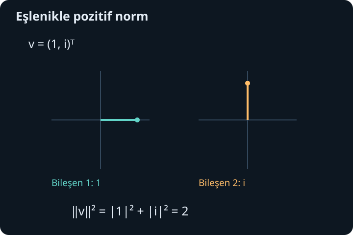
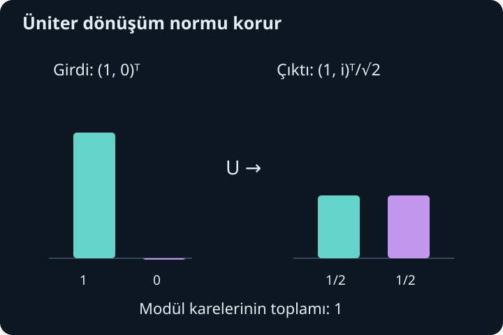

import ArticleVideo from '@/components/ArticleVideo.astro'
import kavram from './media/01-kavram.mp4?url'
import kavramPoster from './media/01-kavram.jpg?url'

Gerçek vektörlerde uzunluğun karesini bileşenlerin karelerini toplayarak buluyorduk. Bileşenler karmaşık olunca aynı işlemi düşünmeden uygulamak sorun çıkarır. $(1,i)$ vektörünün kareler toplamı $1+i^2=0$ olur; oysa vektör sıfır değildir. Uzunluk tanımının yeni sayı sisteminde pozitif kalması için eşlenik kullanmamız gerekir.

[Önceki yazıda](/blog/ozdegerler-ozvektorler-ve-kosegenlestirme/) gerçek simetrik matrislerin dik bir özbaz taşıdığını gördük. Şimdi karmaşık vektörlerde uzunluk, diklik ve baz değişimini kuracağız. Karmaşık sayıların eşleniği, modülü ve matris çarpımı ön bilgilerimizdir. Bu yazıda standart sütun vektör gösterimini koruyacağız; farklı gösterimler daha sonra aynı matematiğin üzerine eklenecek.

## 1. Karmaşık vektör uzayı

$\mathbb C^n$, $n$ karmaşık bileşenli sütun vektörlerinin kümesidir. Örneğin $\mathbf v=(1+i,2,-i)^T$ üç bileşenlidir; her bileşenin kendi gerçek ve sanal kısmı vardır. Bu nedenle $\mathbb C^2$'deki genel bir vektör dört gerçek sayıyla belirlenir. Onu gerçek düzlemde sıradan iki bileşenli bir ok gibi çizmek bütün bilgiyi göstermez.

Toplama bileşen bileşen yapılır. Bir karmaşık $\alpha$ sayısıyla çarpma her bileşeni aynı $\alpha$ ile çarpar. Doğrusal birleşim, $\alpha_1\mathbf v_1+\cdots+\alpha_k\mathbf v_k$ biçimindedir; katsayılar artık karmaşık olabilir. Bağımsızlık ve baz kavramları aynı yapıyı taşır, ancak izin verilen katsayı kümesi değiştiği için hangi uzay üzerinde çalıştığımızı belirtiriz.

Standart baz vektörleri $\mathbf e_1=(1,0,\ldots,0)^T$ ve benzerleridir. Her vektör bileşenlerini katsayı alarak bu bazda tek biçimde yazılır. Bir bazın her vektörü bir fiziksel yönü temsil etmek zorunda değildir; burada soyut bir koordinat sistemini tanımlıyoruz.

## 2. İç çarpımda ilk bileşeni eşlemek

Bu yazıda iç çarpımı **ilk girdide eşlenik** alarak tanımlıyoruz:

$$
\langle\mathbf u,\mathbf v\rangle
=\sum_{j=1}^n\overline{u_j}v_j.
$$

$j$ bileşen sayacı, üst çizgi karmaşık eşleniktir. Bazı matematik kaynakları eşleniği ikinci girdide seçer; sonuçlar uygun biçimde çevrildiğinde aynı geometridir. Burada bütün formüller ilk girdinin eşlendiği konvansiyona göre yazılacaktır.

İkinci girdide doğrusallık vardır: $\langle\mathbf u,\alpha\mathbf v+\beta\mathbf w\rangle=\alpha\langle\mathbf u,\mathbf v\rangle+\beta\langle\mathbf u,\mathbf w\rangle$. İlk girdide ise katsayılar eşlenir: $\langle\alpha\mathbf u,\mathbf v\rangle=\overline\alpha\langle\mathbf u,\mathbf v\rangle$. Ayrıca $\langle\mathbf v,\mathbf u\rangle=\overline{\langle\mathbf u,\mathbf v\rangle}$ olur. Gerçek durumdaki simetri yerini eşlenik simetriye bırakır.

$\mathbf u=(1,i)^T$, $\mathbf v=(2,1)^T$ için iç çarpım $1\cdot2+(-i)\cdot1=2-i$ olur. Sıra değiştirilince $2+i$ çıkar. İç çarpımın genel olarak karmaşık olması normaldir; uzunluğa dönüşmesi için iki girdiyi aynı seçmemiz gerekir.

## 3. Norm ve diklik

Vektörün normunu:

$$
\|\mathbf v\|=\sqrt{\langle\mathbf v,\mathbf v\rangle}
=\sqrt{\sum_j|v_j|^2}
$$

olarak tanımlarız. Her $|v_j|^2$ negatif olmayan gerçek sayıdır. Norm sıfır ancak bütün bileşenler sıfırken olur. $\|\alpha\mathbf v\|=|\alpha|\|\mathbf v\|$ eşitliği, karmaşık ölçeklemenin uzunluğa etkisini verir.

$\mathbf u=(1,i)^T$ için norm $\sqrt2$'dir; baştaki sorun çözülür. $\alpha=e^{i\theta}$ birim modüllü olduğu için $\|e^{i\theta}\mathbf u\|=\|\mathbf u\|$. Bütün bileşenleri aynı fazla çarpmak vektörün normunu değiştirmez; fakat vektörün kendisini genel olarak değiştirir. Fiziksel olarak aynı durumu temsil edip etmediği ayrıca tanımlanacak bir konudur.

İki vektörün iç çarpımı sıfırsa birbirine diktir. $\mathbf q_1=(1,i)^T/\sqrt2$ ve $\mathbf q_2=(1,-i)^T/\sqrt2$ için iç çarpım $[1+(-i)(-i)]/2=0$ olur. İkisinin de normu 1'dir; ortonormal bir çift oluştururlar. Buradaki diklik, dört gerçek koordinatı iki boyutlu resimde çizmeden de cebirsel olarak kesin biçimde tanımlıdır.

## 4. İzdüşüm katsayısı neden iç çarpımdır?

Birim $\mathbf q$ yönüne bir $\mathbf v$ vektörünü ayırmak isteyelim. Bu doğrultudaki bileşeni $c\mathbf q$ biçiminde ararız. Kalan $\mathbf v-c\mathbf q$ dik olsun:

$$
\langle\mathbf q,\mathbf v-c\mathbf q\rangle
=\langle\mathbf q,\mathbf v\rangle-c=0.
$$

Dolayısıyla $c=\langle\mathbf q,\mathbf v\rangle$ ve izdüşüm $\mathbf q\langle\mathbf q,\mathbf v\rangle$ olur. İç çarpım sırasını ters yazarsak katsayının eşleniği çıkar; genel karmaşık durumda farklı sonuç elde ederiz.

$\mathbf q=(1,i)^T/\sqrt2$ ve $\mathbf v=(1,0)^T$ için katsayı $1/\sqrt2$, izdüşüm $(1,i)^T/2$'dir. Kalan $(1,-i)^T/2$ olur ve $\mathbf q$ ile iç çarpımı sıfırdır. İzdüşümün norm karesi $1/2$, kalanın norm karesi $1/2$; toplamı başlangıç norm karesi 1'dir.

Bu, dik vektörlerde Pisagor ilişkisinin karmaşık uzayda da sürdüğünü gösterir. Genel olarak $\langle\mathbf a,\mathbf b\rangle=0$ ise $\|\mathbf a+\mathbf b\|^2=\|\mathbf a\|^2+\|\mathbf b\|^2$ olur; çapraz iç çarpımlar sıfırlanır. Eşlenik kullanımı bu pozitif geometrinin temelidir.

## 5. Cauchy–Schwarz eşitsizliğinin gerekçesi

$\mathbf u\ne0$ olsun. $\mathbf v$'den onun $\mathbf u$ doğrultusundaki izdüşümünü çıkaralım:

$$
\mathbf w=\mathbf v-\mathbf u\frac{\langle\mathbf u,\mathbf v\rangle}{\|\mathbf u\|^2}.
$$

$\mathbf w$ dik kalandır. Norm karesi negatif olamaz. İfadeyi iç çarpımla açınca:

$$
0\leq\|\mathbf w\|^2
=\|\mathbf v\|^2-\frac{|\langle\mathbf u,\mathbf v\rangle|^2}{\|\mathbf u\|^2}
$$

bulunur. Düzenlersek:

$$
\boxed{|\langle\mathbf u,\mathbf v\rangle|\leq\|\mathbf u\|\|\mathbf v\|.}
$$

Sıfır vektör durumunda eşitsizlik doğrudan doğrudur. Eşitlik, dik kalanın sıfır olduğu yani vektörlerin doğrusal bağımlı olduğu durumda gerçekleşir. Bu eşitsizlik, bir vektörün başka bir doğrultuyla eşleşmesinin uzunlukların çarpımını aşamayacağını söyler.

Önceki $\mathbf u=(1,i)$ ve $\mathbf v=(2,1)$ örneğinde iç çarpımın modülü $\sqrt5$, normların çarpımı $\sqrt2\sqrt5=\sqrt{10}$'dur. Eşitsizlik sağlanır ve sıkıdır; iki vektör birbirinin katı değildir. Aynı sonuç üçgen eşitsizliğini de destekler: çapraz terimi sınırlandırınca $\|\mathbf u+\mathbf v\|\leq\|\mathbf u\|+\|\mathbf v\|$ elde edilir.

## 6. Gram–Schmidt ile ortonormal baz

Bağımsız vektörlerden dik bir baz üretmek için her yeni vektörden önceki doğrultulardaki izdüşümleri çıkarırız. İlk vektörü normalleştirip $\mathbf q_1=\mathbf a_1/\|\mathbf a_1\|$ seçeriz. İkinci için $\mathbf w_2=\mathbf a_2-\mathbf q_1\langle\mathbf q_1,\mathbf a_2\rangle$, sonra $\mathbf q_2=\mathbf w_2/\|\mathbf w_2\|$ yazılır.

Daha sonraki adımlarda bütün önceki izdüşümler çıkarılır: $\mathbf w_k=\mathbf a_k-\sum_{j<k}\mathbf q_j\langle\mathbf q_j,\mathbf a_k\rangle$. Başlangıç vektörleri bağımsızsa kalan sıfır olmaz. Kalan sıfır çıkıyorsa yeni vektör önceki vektörlerin gerdiği uzayda bulunuyor demektir; onu sıfıra bölerek normalleştiremeyiz.

$\mathbf a_1=(1,i)^T$, $\mathbf a_2=(1,0)^T$ için ilk birim vektör $(1,i)^T/\sqrt2$'dir. İkinci izdüşüm katsayısı $1/\sqrt2$, kalan $(1,-i)^T/2$ ve kalan normu $1/\sqrt2$ olur. Sonuç $\mathbf q_2=(1,-i)^T/\sqrt2$'dir. Böylece daha önce doğrudan doğruladığımız ortonormal çifti sistematik yöntemle elde ettik.

## 7. Eşlenik transpoz ve adjoint

Bir karmaşık matrisin **eşlenik transpozu**, önce tüm elemanların eşleniğini alıp sonra satırlarla sütunları değiştirmektir. $A^\dagger=(\overline A)^T$ ile gösterilir ve adjoint adıyla da anılır. Sütun vektörü için $\mathbf u^\dagger$ eşlenik satırdır; iç çarpım $\mathbf u^\dagger\mathbf v$ biçiminde yazılır.

Örneğin $A=\begin{pmatrix}1&i\\2&3-i\end{pmatrix}$ ise $A^\dagger=\begin{pmatrix}1&2\\-i&3+i\end{pmatrix}$ olur. Yalnız transpoz almak yeterli değildir. Matris çarpımında $(AB)^\dagger=B^\dagger A^\dagger$ olur; transpoz sıralamayı tersine çevirir.

Adjointin iç çarpımdaki temel işi $\langle\mathbf u,A\mathbf v\rangle=\langle A^\dagger\mathbf u,\mathbf v\rangle$ eşitliğidir. Sol taraf $\mathbf u^\dagger A\mathbf v$'dir; sağ taraf $(A^\dagger\mathbf u)^\dagger\mathbf v=\mathbf u^\dagger A\mathbf v$ olur. Böylece bir işlemi iç çarpımın diğer tarafına taşırken hangi matrisin gerektiğini biliriz.

## 8. Hermit matris ve gerçek özdeğer

$H^\dagger=H$ olan kare matrise **Hermit** matris denir. Gerçek elemanlı durumda bu koşul simetriye iner. Köşegendeki elemanlar gerçek olmalı, karşılıklı elemanlar birbirinin eşleniği olmalıdır. $H=\begin{pmatrix}2&i\\-i&2\end{pmatrix}$ bir örnektir; yalnız transpozu kendisine eşit değildir ama eşlenik transpozu eşittir.

$H\mathbf v=\lambda\mathbf v$, $\mathbf v\ne0$ olsun. İç çarpım $\langle\mathbf v,H\mathbf v\rangle=\lambda\|\mathbf v\|^2$ olur. Hermit özelliği aynı ifadenin eşleniğine eşit olduğunu söyler; bu nedenle gerçektir. Pozitif $\|\mathbf v\|^2$ ile bölünce $\lambda$'nın gerçek olduğu çıkar. Karmaşık bileşenlerden oluşan bir matrisin özdeğerleri böylece gerçek kalabilir.

Farklı özdeğerlere ait özvektörler de diktir. $H\mathbf u=\lambda\mathbf u$, $H\mathbf v=\mu\mathbf v$ için $\langle H\mathbf u,\mathbf v\rangle=\langle\mathbf u,H\mathbf v\rangle$ eşitliği $\lambda\langle\mathbf u,\mathbf v\rangle=\mu\langle\mathbf u,\mathbf v\rangle$ verir; özdeğerlerin gerçekliğini kullandık. $\lambda\ne\mu$ ise iç çarpım sıfırdır.

## 9. Karmaşık spektral teorem

Sonlu boyutta her Hermit matrisin ortonormal bir özbazı vardır. Özdeğerleri köşegene, birim özvektörleri $U$'nun sütunlarına koyarsak:

$$
H=UDU^\dagger
$$

elde edilir. $D$ gerçek köşegendir. Gerçek simetrik teoremin karmaşık karşılığı budur. Aynı özdeğerin özuzayında Gram–Schmidt uygulanarak dik baz seçilebilir; farklı özuzaylar zaten diktir.

Varoluş gerekçesi de önceki yazıdaki fikri genişletir. Birim karmaşık küreyi gerçek ve sanal bileşenlerden oluşan kapalı, sınırlı bir küme gibi görürüz. Gerçek değerli $\mathbf v^\dagger H\mathbf v$ fonksiyonu maksimum alır. Hem $\mathbf u$ hem $i\mathbf u$ yönlerindeki küçük değişimleri incelemek, $H\mathbf v$'nin dik bütün yönlerle iç çarpımının gerçek ve sanal kısımlarını sıfırlar. Böylece $H\mathbf v$ yalnız $\mathbf v$ doğrultusunda kalır. Dik tümleyen Hermit işlem altında korunur ve boyut azaltarak tam baz elde edilir.

Örnek $H$ için determinant $(2-\lambda)^2-1$ olur; özdeğerler 3 ve 1'dir. Birim özvektörleri sırasıyla $(i,1)^T/\sqrt2$ ve $(-i,1)^T/\sqrt2$ seçebiliriz. İlk vektörle çarpım $(3i,3)^T/\sqrt2$, ikinciyle $(-i,1)^T/\sqrt2$ verir. İç çarpımları $[(-i)(-i)+1]/2=0$'dır.

## 10. Üniter matris normu korur

Bir kare $U$ matrisi $U^\dagger U=I$ sağlıyorsa **üniter**dir. Sonlu kare matrislerde bu aynı zamanda $UU^\dagger=I$ ve $U^{-1}=U^\dagger$ demektir. Her vektör için:

$$
\|U\mathbf v\|^2
=\mathbf v^\dagger U^\dagger U\mathbf v
=\mathbf v^\dagger\mathbf v=\|\mathbf v\|^2.
$$

Yalnız uzunluklar değil iç çarpımlar da korunur: $\langle U\mathbf u,U\mathbf v\rangle=\langle\mathbf u,\mathbf v\rangle$. Bu nedenle diklik ve uzaklık değişmez. Gerçek ortogonal matrislerin karmaşık uzaydaki karşılığı üniter matrislerdir.

$U=\frac1{\sqrt2}\begin{pmatrix}1&i\\i&1\end{pmatrix}$ örneğinde sütunların normu 1, iç çarpımı $(i-i)/2=0$'dır. Bu yüzden üniterdir. $(1,0)^T$ girdisini $(1,i)^T/\sqrt2$ çıktısına dönüştürür; çıkış bileşenlerinin modül kareleri $1/2$ ve $1/2$, toplamı 1'dir. Bileşenler değiştiği halde toplam norm korunur.

Hermit olmak ile üniter olmak farklı koşullardır. Hermit matrisin özdeğerleri gerçek, üniter matrisin özdeğerlerinin modülü 1'dir. İkisini aynı anda sağlayan matrisler olabilir, fakat her Hermit matris norm korumaz. Örneğin $2I$ Hermit'tir ve bütün normları iki katına çıkarır; üniter değildir.

## 11. Baz değişiminde koordinatlar değişir

$\mathbf q_1,\ldots,\mathbf q_n$ ortonormal bir baz olsun. Her vektör:

$$
\mathbf v=\sum_jc_j\mathbf q_j,\qquad
c_j=\langle\mathbf q_j,\mathbf v\rangle
$$

biçimindedir. Baz vektörleri $U$'nun sütunlarıysa $\mathbf c=U^\dagger\mathbf v$ ve $\mathbf v=U\mathbf c$ olur. Koordinatlar değişir, temsil edilen soyut vektör aynı kalır. Bir matrisin yeni bazdaki gösterimi $A_{\mathrm{yeni}}=U^\dagger AU$'dur.

Ortonormallik sayesinde $\|\mathbf v\|^2=\sum_j|c_j|^2$ elde edilir. Tamlık bağıntısı da $\sum_j\mathbf q_j\mathbf q_j^\dagger=I$'dir; bütün dik izdüşümler toplandığında vektörü eksiksiz geri verirler. Yalnız bazı baz yönleri toplanırsa bir altuzaya izdüşüm elde edilir ve kalan norm bilgisi dışarıda kalır.

Birim $\mathbf q$ için $P=\mathbf q\mathbf q^\dagger$ matrisi $P^2=P$ ve $P^\dagger=P$ sağlar. İlk eşitlik, bir doğrultuya ikinci kez izdüşmenin sonucu değiştirmediğini söyler. Genel olarak izdüşüm üniter değildir; dik bileşeni kaybettiği için normu azaltabilir. “Dik bir işlem” sözüyle bu iki farklı yapıyı karıştırmamalıyız.

<ArticleVideo src={kavram} poster={kavramPoster} title="Normu koruyan bir dönüşüm" caption="Gerçek düzlem dönmesi, uniter dönüşümün özel bir örneğidir. Ok birim ölçekli çember üzerinde dönerken uzunluğu sabit kalır." />

## 12. Sonlu boyutun sınırını açık tutmak

Buradaki bütün matrisler sonlu boyutluydu. Bu nedenle iç çarpımlar sonlu toplamlar, dönüşümler sonlu matrisler ve özbazlar sonlu listelerdi. İleride fonksiyon uzaylarında iç çarpım integral haline gelecek; sonsuz boyutlu işlemlerin tanım alanı ve sınır koşulları ayrıca önem kazanacak. Sonlu matrisler için doğru bir sonucu bu yeni ortama koşulsuz taşımayacağız.

Şimdilik temel yapı hazır: eşlenik pozitif normu sağlar, iç çarpım izdüşüm katsayısını verir, Hermit simetri gerçek özdeğer ve ortonormal özbaz sağlar, üniter dönüşüm bu geometrinin ölçülerini korur. Bu ayrımlar, karmaşık sayılarla çalışırken gerçek ölçülebilir sonuçların nasıl düzenlenebildiğini anlamak için matematiksel bir temel oluşturur. Önce olasılığın kendi kurallarını kurarak belirsiz sonuçları saymayı öğreneceğiz.

## Kaynaklar

- [MIT OpenCourseWare, Complex Matrices; Fast Fourier Transform](https://ocw.mit.edu/courses/18-06-linear-algebra-spring-2010/resources/lecture-26-complex-matrices-fast-fourier-transform/)
- [MIT OpenCourseWare, Orthogonal Matrices and Gram–Schmidt](https://ocw.mit.edu/courses/18-06-linear-algebra-spring-2010/resources/lecture-17-orthogonal-matrices-and-gram-schmidt/)
