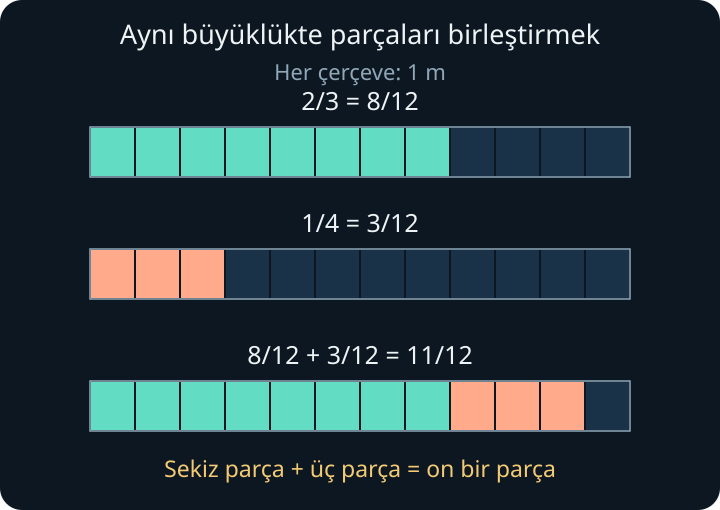
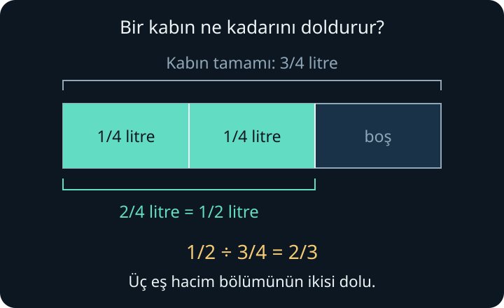
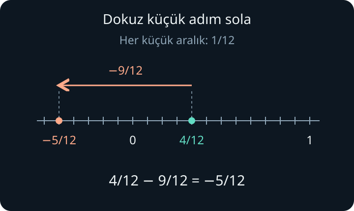

import ArticleVideo from '@/components/ArticleVideo.astro'
import denkKesirler from './media/01-denk-kesirler.mp4?url'
import denkKesirlerPoster from './media/01-denk-kesirler.jpg?url'
import ortakPayda from './media/02-ortak-payda.mp4?url'
import ortakPaydaPoster from './media/02-ortak-payda.jpg?url'
import kesirleCarpma from './media/03-kesirle-carpma.mp4?url'
import kesirleCarpmaPoster from './media/03-kesirle-carpma.jpg?url'

[Çarpma ve bölme yazısının](/blog/carpma-ve-bolme-es-gruplar/) sonunda on yedi santimetrelik bir şeridi üç kişiye eşit paylaştırıyorduk. Herkese beş santimetre verdiğimizde geriye iki santimetre kalmıştı. Bu kalan kısmı da paylaşabiliriz. Peki herkesin aldığı uzunluğu, hiçbir parçayı hesaptan düşürmeden nasıl söyleyeceğiz?

Kesirleri bu sorudan başlayarak kuracağız. Önce eş parçaların nasıl sayıldığını, sonra aynı miktarın farklı kesirlerle nasıl anlatıldığını göreceğiz. Karşılaştırma, toplama, çıkarma, çarpma ve bölme de bu düşüncelerin devamı olacak. Sayı doğrusu ile dört işlemin önceki yazılarda açıkladığımız anlamlarını kullanacağız; yeni gösterimleri karşılaştığımız yerde açıklayacağız.

## 1. Bütün, Pay ve Payda

Bir kâğıt şeridin uzunluğunu **bir bütün** kabul edelim. Şeridi dört eşit uzunlukta parçaya ayıralım. Her parça, bütünün *dörtte biridir*. Dört parçayı uç uca koyduğumuzda başlangıçtaki şeridi elde ederiz.

Burada eşitlik şarttır. Şeridi gelişigüzel dört parçaya ayırırsak her parça onun dörtte biri olmaz. Aynı büyüklükte parçalar oluşturup onları saymak istiyoruz.

Dört eş parçadan üçünü aldığımızda bunu şöyle yazarız:

$$
\frac{3}{4}
$$

Bu gösterim “dörtte üç” veya “üç bölü dört” diye okunur. Alttaki 4'e **payda** denir: bir bütünü kaç eş parçaya ayırdığımızı söyler. Üstteki 3 **pay**dır: bu parçalardan kaçını saydığımızı belirtir. Aradaki yatay çizgi **kesir çizgisi**dir.

Bir parça alsaydık $\frac{1}{4}$, iki parça alsaydık $\frac{2}{4}$ yazardık. Payı 1 olan $\frac{1}{2}$, $\frac{1}{3}$ ve $\frac{1}{4}$ gibi kesirlere **birim kesir** denir. Dörtte üç, üç tane dörtte birlik parçadan oluşur.

Aynı bütünü daha fazla eş parçaya ayırdığımızda her parça küçülür. Fakat bütünün kendisini de belirtmeliyiz: on santimetrelik şeridin yarısı beş, yirmi santimetrelik şeridin yarısı on santimetredir. **“Yarısı” bir oran söyler; fiziksel uzunluğu bilmek için neyin yarısı olduğunu da bilmeliyiz.**

Bu yazıda paydaları pozitif tam sayılarla göstereceğiz. Payda sıfır olamaz; sıfıra bölmenin neden tanımsız olduğunu önceki yazıda görmüştük. [OpenStax’ın kesirlere giriş bölümü](https://openstax.org/books/prealgebra-2e/pages/4-1-visualize-fractions) bu adlandırmalar için ek bir başvuru kaynağıdır.

## 2. Sayı Doğrusunda Kesirler

Şeridimizin tamamını sayı doğrusunda 0 ile 1 arasına yerleştirelim. Sıfırdan başlayıp her seferinde dörtte birlik bir adım ilerlediğimizde sırasıyla $\frac{1}{4}$, $\frac{2}{4}$, $\frac{3}{4}$ ve $\frac{4}{4}$ noktalarına varırız. Dördüncü adımda 1'e ulaşırız:

$$
\frac{4}{4}=1
$$

Pay ile payda birlikte **tek bir sayıyı** ifade eder. $\frac{3}{4}$ sayı doğrusunda belirli bir noktadır. Hiç parça almazsak $\frac{0}{4}=0$ olur. Bir bütünün üzerine bir dörtte birlik adım daha eklersek:

$$
\frac{5}{4}=1+\frac{1}{4}
$$

sonucuna ulaşırız. Bir kesir her zaman birden küçük değildir. Bu pozitif örneklerde payı paydasından küçük olan $\frac{3}{4}$ bir **basit kesir**; payı paydasına eşit veya ondan büyük olan $\frac{4}{4}$ ve $\frac{5}{4}$ ise **bileşik kesirdir**.

Bir bütün ile dörtte birini $1\frac{1}{4}$ biçiminde de yazabiliriz. Bu **tam sayılı kesir** gösterimi “bir tam dörtte bir” diye okunur; burada yan yana duran tam sayı ile kesir **toplanmaktadır**.

Tam sayılı kesri bileşik kesre çevirmek için bütünleri de aynı parçalarla sayarız. İki bütün sekiz tane dörtte birlik parçadır; yanındaki bir parçayla toplam dokuz eder:

$$
2\frac{1}{4}=\frac{8}{4}+\frac{1}{4}=\frac{9}{4}
$$

Sıfırın soluna da gidebiliriz. Üç tane dörtte birlik adım sola gitmek bizi $-\frac{3}{4}$ noktasına götürür. [Sayı doğrusu yazısındaki](/blog/sayi-dogrusu-yon-ve-uzaklik/) gibi, eksi işareti yönü belirtir.

## 3. Denk Kesirler: Gösterim Değişir, Miktar Kalır

Bir şeridin sol yarısını boyayalım. Her yarıyı ikiye bölersek bütünde dört parça, boyalı kısımda iki parça olur. Boyalı uzunluk değişmediği için:

$$
\frac{1}{2}=\frac{2}{4}
$$

yazarız. Her parçayı tekrar ikiye böldüğümüzde bütünde sekiz, boyalı kısımda dört parça vardır. Aynı miktarı belirten bu gösterimlere **denk kesirler** denir:

$$
\frac{1}{2}=\frac{2}{4}=\frac{4}{8}
$$

<ArticleVideo
  src={denkKesirler}
  poster={denkKesirlerPoster}
  title="Denk kesirler: aynı uzunluk, farklı parçalar"
  caption="Bütünün ve boyalı kısmın uzunluğu sabit kalıyor. Şerit iki, dört ve sekiz eş parçaya ayrıldığında aynı yarımı 1/2, 2/4 ve 4/8 olarak sayıyoruz."
/>

Pay ile paydayı aynı pozitif tam sayıyla çarparak denk bir gösterim elde etmeye **genişletme** denir. Örneğin dörtte üçün her parçasını ikiye bölersek:

$$
\frac{3}{4}=\frac{3\times2}{4\times2}=\frac{6}{8}
$$

olur. Hem bütündeki hem seçtiğimiz kısımdaki parça sayısı iki katına çıkar.

İşlemi tersine çevirebiliriz. Sekiz parçalı şeritte parçaları ikişerli birleştirince bütünde dört, boyalı kısımda üç büyük parça kalır:

$$
\frac{6}{8}=\frac{6\div2}{8\div2}=\frac{3}{4}
$$

Payı ve paydayı, ikisini de kalansız bölen aynı pozitif tam sayıya bölmeye **sadeleştirme** denir. Miktar küçülmez; onu daha az sayıda, daha büyük parçayla anlatırız. Pay ile paydanın 1 dışında ortak bir pozitif böleni kalmadığında kesir en sade hâlindedir. Örneğin 3 ve 4 için böyledir.

Yalnızca payı veya yalnızca paydayı değiştirmek genel olarak aynı miktarı korumaz. Denkliği sağlayan, iki sayıya birlikte uyguladığımız işlemdir.

## 4. Karşılaştırmak ve Ortak Payda Bulmak

$\frac{2}{5}$ ile $\frac{4}{5}$ aynı büyüklükte parçaları sayar. Dört parça iki parçadan fazla olduğuna göre:

$$
\frac{2}{5}<\frac{4}{5}
$$

$<$ işareti “küçüktür”, $>$ işareti “büyüktür” diye okunur. Paylar aynıysa parçaların büyüklüğüne bakarız: aynı bütünün üçte biri beşte birinden büyüktür, yani $\frac{1}{3}>\frac{1}{5}$. Paydanın büyümesi tek başına kesrin büyüdüğü anlamına gelmez.

Hem pay hem payda farklıysa ortak parçalar bulabiliriz. $\frac{2}{3}$ ile $\frac{3}{4}$'ü karşılaştırırken üçte birlik her parçayı dörde, dörtte birlik her parçayı üçe bölelim:

$$
\frac{2}{3}=\frac{2\times4}{3\times4}=\frac{8}{12}
$$

$$
\frac{3}{4}=\frac{3\times3}{4\times3}=\frac{9}{12}
$$

Sekiz tane on ikide birlik parça dokuz tanesinden azdır. Dolayısıyla $\frac{2}{3}<\frac{3}{4}$. Buradaki 12, **ortak paydadır**. Sayıları birbirine eşitlemedik; saydığımız parçaların büyüklüğünü eşitledik.

### Ortak payda nasıl seçilir?

Paydalar 4 ve 6 olduğunda hem dörde hem altıya kalansız bölünebilen bir sayı ararız. Dörder sayınca **4, 8, 12, 16, 20, 24…**, altışar sayınca **6, 12, 18, 24…** elde ederiz. Bu sayılar sırasıyla 4'ün ve 6'nın pozitif **katlarıdır**.

İlk ortak sayı 12'dir. Buna **en küçük ortak kat**, kısaca **EKOK** denir. Böylece $\frac{1}{4}=\frac{3}{12}$ ve $\frac{1}{6}=\frac{2}{12}$ yazabiliriz.

24 de ortak payda olabilir: $\frac{1}{4}=\frac{6}{24}$ ve $\frac{1}{6}=\frac{4}{24}$. En küçük paydayı seçmek zorunlu değildir; küçük sayılarla çalışmayı kolaylaştırır. Pozitif tam sayı paydalarını birbiriyle çarpmak her zaman ortak bir payda verir, ama bu en küçüğü olmayabilir.

## 5. Kesir Çizgisi Neden Bölme de Demektir?

Başlangıçtaki on yedi santimetreyi üç kişiye paylaştırma sorusuna dönelim. Beşer santimetreden toplam on beş santimetre dağıtmış, iki santimetreyi ayırmıştık.

Şimdi **bir santimetreyi birim uzunluk** seçelim. Kalan iki santimetrenin her birini üç eş parçaya bölelim. Her kişiye ilk santimetreden bir parça, ikinci santimetreden de bir parça verelim. Herkes iki tane üçte bir santimetre, yani $\frac{2}{3}$ santimetre alır.

İki santimetreyi üç kişiye eşit paylaştırdığımız için $2\div3=\frac{2}{3}$ yazabiliriz. **Kesir çizgisi bölme işlemini de ifade eder.** Önceden verilen beş santimetreyle birlikte herkes $5\frac{2}{3}$ santimetre almıştır.

On yedi santimetrenin her birini üçe bölüp paylaştırsaydık da herkes on yedi tane üçte birlik parça alırdı. Bunların on beşi beş tam santimetre eder, ikisi artar:

$$
17\div3=\frac{17}{3}=5+\frac{2}{3}
$$

Kalanı atmadık; miktarın tamamını kesirlerle ifade ettik. Şimdi bu sayılarla işlem yapabiliriz.

## 6. Toplama ve Çıkarma: Aynı Parçaları Saymak

Bu bölümde uzunlukları metreyle ölçeceğiz; **bir bütün bir metredir**. Metreyi kısaca **m** ile göstereceğiz.

### Paydalar aynı olduğunda

Bir metreyi yedi eş parçaya ayıralım. İki parça ile üç parçayı birleştirince beş tane yedide birlik parça olur:

$$
\frac{2}{7}+\frac{3}{7}=\frac{2+3}{7}=\frac{5}{7}
$$

Ortadaki pay, parçaların toplam sayısıdır. Parçaların büyüklüğü değişmediği için payda 7 kalır. Aynı şekilde beş parçanın ikisini çıkarırsak:

$$
\frac{5}{7}-\frac{2}{7}=\frac{5-2}{7}=\frac{3}{7}
$$

**Paydalar aynıysa payları toplar veya çıkarır, paydayı koruruz.**

Paydaları da toplasaydık iki yarım için $\frac{1}{2}+\frac{1}{2}=\frac{2}{4}$ yazardık. Oysa iki yarım bir bütündür; $\frac{2}{4}$ ise yalnızca yarımdır. Doğru sonuç $\frac{2}{2}=1$'dir. Payda, parça sayısını toplarken değiştireceğimiz bir sayı değil, hangi büyüklükte parçaları saydığımızın bilgisidir.

### Paydalar farklı olduğunda

Üçte iki metre ile dörtte bir metreyi birleştirelim. Üçte birlik parçaların her birini dörde, dörtte birlik parçaların her birini üçe böldüğümüzde aynı büyüklükte parçalar elde ederiz:

$$
\frac{2}{3}=\frac{8}{12},\qquad
\frac{1}{4}=\frac{3}{12}
$$

Sekiz parça ile üç parça toplam on bir parçadır:

$$
\frac{2}{3}+\frac{1}{4}=\frac{8}{12}+\frac{3}{12}=\frac{11}{12}
$$

Toplamdan eklediğimiz dörtte biri geri çıkarırsak on bir parçanın üçünü alırız:

$$
\frac{11}{12}-\frac{1}{4}=\frac{11}{12}-\frac{3}{12}=\frac{8}{12}
$$

Payı ve paydayı 4'e bölünce $\frac{8}{12}=\frac{2}{3}$ olur. Başlangıçtaki miktara döndük; bu, toplama sonucunu kontrol etmenin de bir yoludur.

<ArticleVideo
  src={ortakPayda}
  poster={ortakPaydaPoster}
  title="Ortak payda: parçaları birleştirmek ve ayırmak"
  caption="Her çerçeve bir metreyi gösteriyor. Üçte iki ve dörtte bir, on ikide birlik parçalara ayrılıyor; sekiz yeşil parçayla üç turuncu parça birleşiyor. Sonra eklenen üç parçayı geri alarak başlangıçtaki üçte ikiye dönüyoruz."
/>

4 ve 6 paydaları için bulduğumuz ortak katları da kullanabiliriz:

$$
\frac{1}{4}+\frac{1}{6}=\frac{3}{12}+\frac{2}{12}=\frac{5}{12}
$$

24'ü seçseydik $\frac{6}{24}+\frac{4}{24}=\frac{10}{24}$ bulurduk. Payı ve paydayı 2'ye bölünce yine $\frac{5}{12}$ çıkar. Ortak paydanın seçimi sayının değerini değiştirmez.

### Bir bütünü aşmak ve tam sayılı kesirler

İki kesir de birden küçükken toplamları birden büyük olabilir:

$$
\frac{3}{4}+\frac{2}{3}=\frac{9}{12}+\frac{8}{12}=\frac{17}{12}
$$

On yedi parçanın on ikisi bir bütün yapar, beşi artar. Sonuç $1\frac{5}{12}$'dir.

Tam sayılı kesirlerde de bütün miktarı aynı parçalarla sayabiliriz. $2\frac{1}{4}$'ün dokuz tane dörtte birlik parça olduğunu görmüştük. Bundan $\frac{3}{4}$ çıkaralım:

$$
2\frac{1}{4}-\frac{3}{4}=\frac{9}{4}-\frac{3}{4}=\frac{6}{4}
$$

Altı parçanın dördü bir bütün, ikisi yarım eder. Sonuç $1\frac{1}{2}$'dir. Bütün miktarı ortak birimde ifade etmek, tam kısımdan parça almamız gereken durumları da kapsar.

## 7. Çarpma: Bir Miktarın Kesir Kadarını Almak

Bir miktarı pozitif bir kesirle çarpmak, o miktarın belirtilen payını almaktır. Sekiz metrenin dörtte üçü ne kadardır? Önce sekizi dörde böleriz; her pay iki metredir. Üç pay altı metre eder:

$$
\frac{3}{4}\times8=6
$$

### Bir kesrin kesir kadarını almak

Şimdi bir dikdörtgenin tamamını bir bütün kabul edelim. Onu dört eş sütuna ayırıp üçünü boyayalım. Boyalı kısım $\frac{3}{4}$'tür. Bu boyalı kısmın **üçte ikisini** almak istiyoruz:

$$
\frac{2}{3}\times\frac{3}{4}
$$

Dikdörtgeni ayrıca üç eş satıra bölelim. Boyalı üç sütunun her satırda eşit miktarda alanı vardır. Üç satırın ikisini seçince, boyalı kısmın üçte ikisini seçmiş oluruz.

Bütün dikdörtgende $3\times4=12$ eş küçük hücre, seçtiğimiz bölgede $2\times3=6$ hücre vardır. Her hücre bütünün on ikide biridir. Sonuç:

$$
\frac{2}{3}\times\frac{3}{4}
=\frac{2\times3}{3\times4}
=\frac{6}{12}=\frac{1}{2}
$$

<ArticleVideo
  src={kesirleCarpma}
  poster={kesirleCarpmaPoster}
  title="Kesirle çarpma: bir parçanın üçte ikisini almak"
  caption="Dört sütunun üçü boyanıyor; bu boyalı alanın üç satırından ikisi seçiliyor. Seçilen altı hücre, bütünün on iki hücresinin yarısı. Aynı altı hücre yeniden yerleştirilince bu yarım daha belirgin görülüyor."
/>

**Kesirleri çarparken payları birbiriyle, paydaları birbiriyle çarparız.** Bu örnekte paydaların çarpımı bütündeki hücre sayısını, payların çarpımı seçilen hücre sayısını verdi. Toplamada aynı parçaları birleştiriyorduk; burada seçtiğimiz miktarın bir bölümünü alıyoruz. Bu yüzden çarpmak için ortak payda bulmak gerekmez.

Bir tam sayıyı da paydası 1 olan kesir biçiminde yazabiliriz: $8=\frac{8}{1}$. İlk örneğimiz aynı kuralla:

$$
\frac{3}{4}\times\frac{8}{1}=\frac{24}{4}=6
$$

olur. Tam sayılı kesir varsa önce bileşik kesre çeviririz. Örneğin $1\frac{1}{2}=\frac{3}{2}$ olduğundan:

$$
\frac{2}{3}\times1\frac{1}{2}
=\frac{2}{3}\times\frac{3}{2}
=\frac{6}{6}=1
$$

### Çarpma sonucu neden küçülebilir?

Pozitif bir miktarı 0 ile 1 arasındaki bir sayıyla çarptığımızda onun bir bölümünü alırız. Üçte ikisini almak tamamını almaktan azdır; bu yüzden $\frac{2}{3}\times\frac{3}{4}=\frac{1}{2}$, başlangıçtaki $\frac{3}{4}$'ten küçüktür.

Aynı pozitif miktarı 1 ile çarparsak tamamını, 1'den büyük bir sayıyla çarparsak tamamından fazlasını alırız. Örneğin $\frac{3}{2}\times\frac{3}{4}=\frac{9}{8}$ olur. Çarpmanın her zaman büyüttüğü düşüncesi, yalnızca bazı çarpanlarla doğrudur. Sıfırla çarptığımızda ise hiç pay almayız; sonuç sıfırdır.

### Çarpmadan önce sadeleştirmek

$\frac{2}{3}\times\frac{9}{10}$ işlemini yaparken önce $\frac{18}{30}$ bulup pay ve paydayı 6'ya bölebiliriz. Sonuç $\frac{3}{5}$'tir. Aynı sadeleştirmeyi büyük sayıları oluşturmadan da yapabiliriz:

$$
\frac{2\times9}{3\times10}
=\frac{1\times9}{3\times5}
=\frac{1\times3}{1\times5}
=\frac{3}{5}
$$

İlk adımda paydaki 2 ile paydadaki 10'u 2'ye, sonra paydaki 9 ile paydadaki 3'ü 3'e böldük. Her adımda **çarpımın toplam payı ve toplam paydası aynı sayıya bölündü**. Buradaki sayı silme görüntüsünün arkasında denk kesir kuralı vardır. Bu işlem, toplama işaretinin iki yanındaki sayıları gelişigüzel silme izni vermez.

## 8. Bölme: İçinde Kaç Pay Var?

Bölmenin iki anlamını hatırlayalım: bir miktarı eşit paylaştırmak veya belirli büyüklükte kaç pay içerdiğini bulmak.

Üçte iki metreyi iki kişiye eşit paylaştırırsak, iki tane üçte birlik parçanın her birini bir kişiye verebiliriz:

$$
\frac{2}{3}\div2=\frac{1}{3}
$$

Kesirli büyüklükte payları sayarken de aynı düşünce işe yarar. Yarım litrede kaç tane dörtte bir litrelik pay vardır? Yarım litre iki tane dörtte bir litre içerir:

$$
\frac{1}{2}\div\frac{1}{4}=2
$$

Buradaki 2, litre miktarı değil, pay sayısıdır. Küçük bir payla ölçtüğümüz için sayı büyüdü; bölme de her zaman küçültmez.

### Pay sayısı tam çıkmazsa

Yarım litreyi, dörtte üç litrelik bir kabın hacmiyle ölçelim. Yarım litre iki tane dörtte bir; kabın tamamı üç tane dörtte bir litredir. Elimizde kabın üç eş bölümünden ikisini dolduracak miktar bulunur:

$$
\frac{1}{2}\div\frac{3}{4}
=\frac{2}{4}\div\frac{3}{4}
=2\div3=\frac{2}{3}
$$

Sonuç, kabın üçte ikisinin dolacağıdır. Tam sayı çıkmayan bölüm de bir sayı ve anlamlı bir orandır.

### Ters çevirip çarpma nereden gelir?

$\frac{3}{4}\div\frac{2}{5}$ işleminde de iki miktarı aynı küçük birimle sayalım. Ortak payda 20'dir:

$$
\frac{3}{4}=\frac{15}{20},\qquad
\frac{2}{5}=\frac{8}{20}
$$

Elimizde on beş küçük parça var; bir pay sekiz küçük parçadan oluşuyor. Pay sayısı $15\div8=\frac{15}{8}$'dir. Bu 15 ve 8'in nereden geldiğini açarsak:

$$
\frac{15}{8}=\frac{3\times5}{4\times2}
=\frac{3}{4}\times\frac{5}{2}
$$

Yani bölen $\frac{2}{5}$, çarpma işleminde $\frac{5}{2}$ oldu. **Bir kesre bölmek, bölenin payı ile paydasını yer değiştirip onunla çarpmaktır; bölen sıfır olamaz.** Ortak parçaları sayarak ulaştığımız kural budur. İlk kesri olduğu gibi bırakırız.

Payı ve paydası yer değiştiren bu sayıya **çarpma işlemine göre ters** denir. İkisini çarptığımızda 1 elde ederiz:

$$
\frac{2}{5}\times\frac{5}{2}=\frac{10}{10}=1
$$

Bu, işareti değiştirmekten farklıdır. $\frac{2}{5}$'in toplama işlemine göre tersi $-\frac{2}{5}$; çarpma işlemine göre tersi $\frac{5}{2}$'dir.

Bulduğumuz bölümü bölenle çarparak kontrol edebiliriz:

$$
\frac{15}{8}\times\frac{2}{5}=\frac{30}{40}=\frac{3}{4}
$$

Tam sayılı kesirlerde önce bileşik kesre geçeriz. Örneğin $1\frac{1}{2}\div\frac{3}{4}=\frac{3}{2}\times\frac{4}{3}=2$. Bir buçuk metrede iki tane dörtte üç metrelik pay vardır.

Sıfırın çarpma işlemine göre tersi yoktur: sıfırı hangi sayıyla çarparsak çarpalım 1 elde edemeyiz. Bu yüzden sıfıra bölme tanımsız kalır. Sıfırı, sıfırdan farklı bir sayıya bölersek sonuç sıfırdır; örneğin $0\div\frac{2}{5}=0$.

## 9. Eksi İşaretini de Hesaba Katmak

Toplama ve çıkarmada ortak parçalar, sayı doğrusunda ortak adımlara dönüşür. $\frac{1}{3}-\frac{3}{4}$ için üçte birden başlayıp dörtte üç kadar sola gidelim:

$$
\frac{1}{3}-\frac{3}{4}
=\frac{4}{12}-\frac{9}{12}
=-\frac{5}{12}
$$

Dört küçük adımda sıfıra varır, kalan beş adımda sıfırın soluna geçeriz. Fiziksel bir şeritten elimizdekinden uzun parça kesemeyiz; fakat bu sayı bir eksikliği veya yönlü konumu ifade edebilir.

Negatif bir sayıdan başlayıp pozitif miktar eklemek de aynı biçimde yapılır:

$$
-\frac{1}{4}+\frac{2}{3}
=-\frac{3}{12}+\frac{8}{12}
=\frac{5}{12}
$$

Negatif bir miktarı çıkarmak, onun ters işaretlisini eklemektir. Parantez, çıkarılan sayının tamamını belirtir:

$$
\frac{1}{3}-\left(-\frac{1}{4}\right)
=\frac{1}{3}+\frac{1}{4}=\frac{7}{12}
$$

Çarpmada pozitif kesir, sayı doğrusundaki sıfıra uzaklığı ölçekler ve yönü korur. $-\frac{3}{4}$'ün üçte ikisi, sıfırın solunda $\frac{1}{2}$ uzaklıktadır:

$$
\frac{2}{3}\times\left(-\frac{3}{4}\right)=-\frac{1}{2}
$$

Negatif bir çarpan ise bu ölçeklemeye ek olarak yönü tersine çevirir. Sıfırın solundaki miktarın yönü ters çevrilince sağa geçer:

$$
\left(-\frac{2}{3}\right)\times\left(-\frac{3}{4}\right)=\frac{1}{2}
$$

Böylece aynı işaretli iki sayının çarpımı pozitif, zıt işaretlilerin çarpımı negatif olur. Bölme, tersle çarpmaya dönüştüğü için aynı işaret kuralını izler. Negatif bir sayının çarpma işlemine göre tersi de negatiftir: $-\frac{2}{5}$ için $-\frac{5}{2}$. Çarpımları 1'dir.

Bir bütünü eş parçalara ayırmakla başladık. Bu parçaları yeniden adlandırarak karşılaştırdık, birleştirdik, ayırdık, bir bölümünü aldık ve başka miktarların içinde kaç kez bulunduğunu saydık. Kesirlerle dört işlem, bu anlamların kısa birer yazımı oldu. Sonraki ana konumuz, aynı sayıları onda birlik ve yüzde birlik basamaklarla anlatacağımız **ondalık gösterim ve yaklaşık değerler** olacak.

## Kaynakça

Şerit ve kap örnekleri, şekiller, Manim animasyonları ve Türkçe anlatım bu yazı için hazırlanmıştır. Standart tanımlar ve işlem kuralları için açık erişimli başvuru bölümleri:

- [OpenStax — Prealgebra 2e, 4.1: Visualize Fractions](https://openstax.org/books/prealgebra-2e/pages/4-1-visualize-fractions). Pay, payda, denk kesirler, tam sayılı kesirler ve sayı doğrusu.
- [OpenStax — Prealgebra 2e, 4.2: Multiply and Divide Fractions](https://openstax.org/books/prealgebra-2e/pages/4-2-multiply-and-divide-fractions). Sadeleştirme, çarpma, çarpma işlemine göre ters ve bölme.
- [OpenStax — Prealgebra 2e, 4.3: Multiply and Divide Mixed Numbers and Complex Fractions](https://openstax.org/books/prealgebra-2e/pages/4-3-multiply-and-divide-mixed-numbers-and-complex-fractions). Tam sayılı kesirleri bileşik kesre dönüştürerek çarpma ve bölme.
- [OpenStax — Prealgebra 2e, 4.4: Add and Subtract Fractions with Common Denominators](https://openstax.org/books/prealgebra-2e/pages/4-4-add-and-subtract-fractions-with-common-denominators). Aynı paydalı kesirlerde toplama ve çıkarma.
- [OpenStax — Prealgebra 2e, 4.5: Add and Subtract Fractions with Different Denominators](https://openstax.org/books/prealgebra-2e/pages/4-5-add-and-subtract-fractions-with-different-denominators). Ortak payda kullanarak işlem.
- [OpenStax — Prealgebra 2e, 4.6: Add and Subtract Mixed Numbers](https://openstax.org/books/prealgebra-2e/pages/4-6-add-and-subtract-mixed-numbers). Tam sayılı kesirlerle toplama ve çıkarma.

Kaynaklar 29–30 Eylül 2026 tarihlerinde kontrol edildi.
