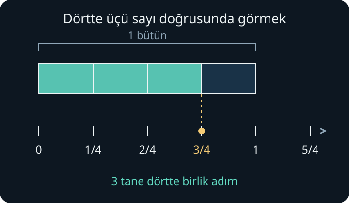
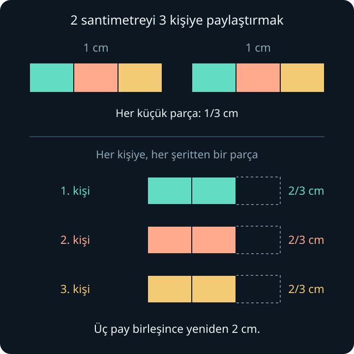

import ArticleVideo from '@/components/ArticleVideo.astro'
import denkKesirler from './media/01-denk-kesirler.mp4?url'
import denkKesirlerPoster from './media/01-denk-kesirler.jpg?url'

[Çarpma ve bölme yazısının](/blog/carpma-ve-bolme-es-gruplar/) sonunda on yedi santimetrelik bir şeridi üç kişiye eşit paylaştırıyorduk. Herkese beş santimetre verdiğimizde geriye iki santimetre kalmıştı. Bu kalan kısmı da paylaşabiliriz. Peki herkesin aldığı uzunluğu, hiçbir parçayı hesaptan düşürmeden nasıl söyleyeceğiz?

Bu soruya cevap vermek için kesirlere ihtiyacımız var. Önce bir bütünü eş parçalara ayıracak, bu parçaları saymayı öğrenecek ve sonra şeridimize döneceğiz. Sayı doğrusu, toplama, çarpma ve bölmenin önceki yazılarda kurduğumuz anlamlarını kullanacağız.

## 1. Önce Bir Bütün Seçmek

Bir kâğıt şeridi önümüze koyalım ve uzunluğunu **bir bütün** kabul edelim. Sayı doğrusunda 0 ile 1 arasındaki aralık, bu uzunluğu temsil etsin.

Şeridi dört eşit uzunlukta parçaya ayıralım. Her parça, seçtiğimiz bütünün *dörtte biridir*. Dört parçayı uç uca koyduğumuzda başlangıçtaki şeridi eksiksiz elde ederiz.

Burada “eşit” sözcüğü gereklidir. Şeridi gelişigüzel dört parçaya ayırmak yetmez. Parçaların uzunlukları farklıysa her biri bütünün dörtte biri olamaz. Bu örnekte aynı birimden dört tane oluşturmak istiyoruz.

Bir bütün farklı şekillerde de bölünebilir. İki eş parçaya bölersek her parça bir yarım, üç eş parçaya bölersek her parça üçte bir olur. Bütünü daha fazla eş parçaya ayırdığımızda her bir parça küçülür.

## 2. Pay ile Payda Ne Anlatır?

Dört eş parçadan üçünü yan yana koyalım. Aldığımız miktarı şöyle yazabiliriz:

$$
\frac{3}{4}
$$

Bu gösterim “dörtte üç” veya “üç bölü dört” diye okunur.

Alttaki 4’e **payda** denir. Bir bütünü kaç eş parçaya ayırdığımızı söyler. Üstteki 3 ise **pay**dır; bu eş parçalardan kaçını saydığımızı gösterir. Aradaki yatay çizgiye **kesir çizgisi** deriz. Bu çizginin bölmeyle bağını yazının sonunda kuracağız.

Yalnızca bir parça alsaydık $\frac{1}{4}$, iki parça alsaydık $\frac{2}{4}$ yazardık. Parçaların büyüklüğü aynı kalıyor; aldığımız parçaların sayısı değişiyor.

Payı 1 olan $\frac{1}{2}$, $\frac{1}{3}$ ve $\frac{1}{4}$ gibi kesirlere **birim kesir** denir. Her biri, kendi paydasının belirlediği eş parçalardan bir tanesini anlatır. Dörtte üçü, üç tane dörtte birlik parçayı sayarak kurduk.

Bu yazıda paydaları pozitif tam sayılar olarak kullanıyoruz. Payda sıfır olamaz; önceki yazıda gördüğümüz sıfıra bölme sorunu burada da karşımıza çıkar. Kesirlerin standart tanımları için [OpenStax’ın kesirlere giriş bölümü](https://openstax.org/books/prealgebra-2e/pages/4-1-visualize-fractions) ek örnekler sunar.

## 3. Kesir de Sayı Doğrusunda Bir Sayıdır

Şeritteki dört eş parçayı şimdi 0 ile 1 arasına yerleştirelim. Sıfırdan başlayıp her seferinde dörtte bir uzunluğunda ilerlediğimizde sırasıyla şu noktalara ulaşırız:

$$
0\;\longrightarrow\;\frac{1}{4}\;\longrightarrow\;\frac{2}{4}\;\longrightarrow\;\frac{3}{4}\;\longrightarrow\;1
$$

$\frac{3}{4}$, sayı doğrusunda 0 ile 1 arasındaki belirli bir yerdir. Pay ile payda, birlikte bu tek sayıyı ifade eder.

Dört parçanın tamamını aldığımızda bir bütüne ulaşırız:

$$
\frac{4}{4}=1
$$

Hiç parça almazsak $\frac{0}{4}=0$ olur. Aynı büyüklükte bir parça daha ekleyip beş tane dörtte birlik parça sayarsak bu kez 1’in ötesine geçeriz:

$$
\frac{5}{4}=1+\frac{1}{4}
$$

Demek ki bir kesrin değeri her zaman birden küçük olmak zorunda değildir. Bir bütün ve bir dörtte biri, $1\frac{1}{4}$ biçiminde de yazabiliriz. Bu gösterim “bir tam dörtte bir” diye okunur; burada yan yana yazılan tam sayı ile kesir toplanmaktadır.

Bu pozitif örnekleri adlandırırken $\frac{3}{4}$ gibi payı paydasından küçük olanlara **basit kesir**, $\frac{5}{4}$ veya $\frac{4}{4}$ gibi payı paydasına eşit ya da ondan büyük olanlara **bileşik kesir** deriz. $1\frac{1}{4}$ ise **tam sayılı kesir** gösterimidir.

Kesirlerle sıfırın solundaki konumları da anlatabiliriz. Sıfırdan üç tane dörtte birlik adım sola gidersek $-\frac{3}{4}$ noktasına ulaşırız. Eksi işareti, sayı doğrusu yazısında olduğu gibi yön bilgisini korur.

## 4. Hangi Bütünün Yarısı?

Biri on santimetre, diğeri yirmi santimetre uzunluğunda iki şerit düşünelim. Her birini kendi içinde iki eş parçaya ayıralım.

Kısa şeridin yarısı beş santimetredir. Uzun şeridin yarısı ise on santimetredir. Her iki durumda da şeridin $\frac{1}{2}$’sini aldık; fakat aldığımız uzunluklar farklı çıktı.

**Bir nesnenin kesir kadarını söylerken hangi nesneyi bütün kabul ettiğimiz de önemlidir.** “Yarısını aldım” cümlesi, neyin yarısından söz ettiğimizi bilmeden fiziksel bir miktar belirtmez.

Sayı doğrusunda ise birim aralığını baştan sabitleriz. Aynı doğru üzerinde $\frac{1}{2}$ her zaman aynı noktadır. Şimdi denk kesirleri ve karşılaştırmayı çalışırken bütünümüzün büyüklüğünü değiştirmeyeceğiz.

## 5. Farklı Bölmeler, Aynı Miktar

Bir şeridi iki eş parçaya ayıralım ve sol yarısını boyayalım. Boyalı miktar $\frac{1}{2}$’dir.

Şimdi şeridin her yarısını kendi içinde iki eş parçaya daha ayıralım. Bütün şeritte dört parça, boyalı tarafta iki parça vardır. Boyalı uzunluğun başlangıcı ve bitişi değişmedi; aynı miktarı bu kez $\frac{2}{4}$ diye sayıyoruz.

Her parçayı bir kez daha ikiye bölersek bütünde sekiz, boyalı tarafta dört parça olur:

$$
\frac{1}{2}=\frac{2}{4}=\frac{4}{8}
$$

Aynı sayıyı ifade eden bu gösterimlere **denk kesirler** denir. Sayı doğrusunda üçü de aynı noktaya karşılık gelir.

<ArticleVideo
  src={denkKesirler}
  poster={denkKesirlerPoster}
  title="Denk kesirler: aynı uzunluk, farklı parçalar"
  caption="Bütünün ve boyalı kısmın uzunluğu sabit kalıyor. Şerit iki, dört ve sekiz eş parçaya ayrıldığında aynı yarımı 1/2, 2/4 ve 4/8 olarak sayıyoruz."
/>

Aynı düşünceyi dörtte üçe uygulayalım. Dört parçanın her birini ikiye bölersek toplam parça sayısı sekiz olur. Boyalı üç parçanın her biri de ikiye bölündüğü için boyalı parça sayısı altıya çıkar:

$$
\frac{3}{4}=\frac{3\times2}{4\times2}=\frac{6}{8}
$$

Pay ile paydayı aynı pozitif tam sayıyla çarparak denk bir kesir elde etmeye **genişletme** denir. Burada her eski parçayı aynı sayıda yeni parçaya ayırdığımız için hem pay hem payda birlikte değişir. Yalnızca birini değiştirirsek genel olarak aynı miktarı koruyamayız.

Bu işlemi ters yönde de görebiliriz. Sekiz parçalı şeritte yan yana duran parçaları ikişerli birleştirelim. Bütün şerit dört büyük parçaya, boyalı altı küçük parça da üç büyük parçaya dönüşür:

$$
\frac{6}{8}=\frac{6\div2}{8\div2}=\frac{3}{4}
$$

Payı ve paydayı, ikisini de kalansız bölen aynı pozitif tam sayıya bölerek denk bir kesir elde etmeye **sadeleştirme** denir. Sadeleştirdiğimizde kesrin anlattığı miktar küçülmez. Örnekte sekizde altı ile dörtte üç aynı uzunluktur. Bu ters yönlü ilişki [OpenStax’ın sadeleştirme açıklamasında](https://openstax.org/books/prealgebra-2e/pages/4-2-multiply-and-divide-fractions) da ele alınır.

## 6. Kesirleri Aynı Birimle Karşılaştırmak

Önce paydaları aynı olan $\frac{2}{5}$ ile $\frac{4}{5}$’i karşılaştıralım. İkisinde de saydığımız parçalar bir bütünün beşte biridir. Dört tane böyle parça, iki tanesinden daha fazla uzunluk oluşturur:

$$
\frac{2}{5}<\frac{4}{5}
$$

$<$ işareti “küçüktür” demektir. Bu örnekte parçaların büyüklükleri aynı olduğu için yalnızca kaç parça aldığımıza bakmak yeterliydi.

Paylar aynı olduğunda ise parçaların büyüklüğünü düşünmeliyiz. Bir bütünün üçte biri, aynı bütünün beşte birinden büyüktür:

$$
\frac{1}{3}>\frac{1}{5}
$$

Çünkü aynı uzunluğu beş eş parçaya böldüğümüzde, üç eş parçaya böldüğümüzdekinden daha küçük parçalar elde ederiz. Paydanın daha büyük olması tek başına kesrin daha büyük olduğunu söylemez.

Şimdi hem payı hem paydası farklı olan $\frac{2}{3}$ ile $\frac{3}{4}$’ü karşılaştıralım. Üçte birlik parçalarla dörtte birlik parçaları doğrudan saymak zor: parçaların büyüklükleri farklı. İkisini de aynı büyüklükte parçalarla anlatabiliriz.

Üçte birlik parçaların her birini dörde ayıralım. Bütün, on iki eş parçaya; aldığımız iki parça ise sekiz küçük parçaya dönüşür:

$$
\frac{2}{3}=\frac{2\times4}{3\times4}=\frac{8}{12}
$$

Dörtte birlik parçaların her birini üçe ayıralım. Yine bütünde on iki parça vardır; aldığımız üç parça ise dokuz küçük parçaya dönüşür:

$$
\frac{3}{4}=\frac{3\times3}{4\times3}=\frac{9}{12}
$$

Artık aynı büyüklükte parçaları sayıyoruz. Sekiz parça dokuz parçadan az olduğuna göre:

$$
\frac{2}{3}<\frac{3}{4}
$$

Bu yöntemde 12, iki kesir için kullandığımız **ortak payda**dır. Kesirlerin değerlerini koruyarak saydığımız parçaların büyüklüklerini eşitledik.

## 7. Kalan Şeridi de Paylaşmak

Başlangıçtaki sorumuza dönelim. On yedi santimetrelik şeritten üç kişiye beşer santimetre verdik. Toplam on beş santimetre dağıttık; geriye iki santimetre kaldı.

Şimdi **bir santimetreyi birim uzunluk** seçelim. Kalan iki santimetreyi, yan yana duran iki tane bir santimetrelik şerit olarak düşünelim. Her birini üç eş parçaya ayıralım. Oluşan her küçük parçanın uzunluğu $\frac{1}{3}$ santimetredir.

Her kişiye ilk şeritten bir parça, ikinci şeritten de bir parça verelim. Böylece herkes iki tane üçte birlik parça alır. Kişi başına düşen ek uzunluk $\frac{2}{3}$ santimetredir.

İki santimetreyi üç kişiye eşit paylaştırdık. Bu yüzden:

$$
2\div3=\frac{2}{3}
$$

yazabiliriz. **Kesir çizgisi bölme işlemini de ifade eder.** Buradaki $\frac{2}{3}$ santimetre, bir santimetrenin üçte ikisidir; kalan iki santimetrenin her kişiye düşen üçte birlik payıdır. Hangi uzunluğu birim saydığımızı belirtmek bu iki anlatımı birbirine bağlar.

Herkes önceden beş santimetre almıştı. Buna eklediğimiz iki tane üçte birlik parçayla birlikte kişi başına toplam uzunluk:

$$
5+\frac{2}{3}\text{ santimetre}
$$

olur. Bu sayıya “beş tam üçte iki” deriz. Aynı uzunluğu tam sayılı kesir biçiminde $5\frac{2}{3}$ santimetre olarak yazabiliriz.

On yedi tane bir santimetrelik parçanın her birini üçe bölüp her kişiye birer küçük parça verseydik, herkes on yedi tane üçte birlik parça alırdı. Bunların on beşi beş tam santimetre yapar, iki tanesi artar. Dolayısıyla aynı sonuç:

$$
17\div3=\frac{17}{3}
$$

$$
\frac{17}{3}=5+\frac{2}{3}
$$

biçiminde de ifade edilir. Kalan uzunluğun tamamını paylaştırdık ve her payı tam olarak söyleyebildik.

Bir sonraki yazıda kesirlerle toplama ve çıkarmaya geçeceğiz. Burada kurduğumuz ortak parça fikri, işlemlerde neden bazen paydaları eşitlememiz gerektiğini anlamamızı sağlayacak.

## Kaynakça

Şerit örnekleri, şekiller, Manim animasyonu ve Türkçe anlatım bu yazı için hazırlanmıştır. Standart tanımlar ve ek okuma için:

- [OpenStax — Prealgebra 2e, 4.1: Visualize Fractions](https://openstax.org/books/prealgebra-2e/pages/4-1-visualize-fractions). Pay, payda, tam sayılı kesirler, denk kesirler ve sayı doğrusu.
- [OpenStax — Prealgebra 2e, 4.2: Multiply and Divide Fractions](https://openstax.org/books/prealgebra-2e/pages/4-2-multiply-and-divide-fractions). Bu yazı için bölümün başındaki *Simplify Fractions* açıklaması kullanılmıştır; kesirlerle çarpma ve bölme sonraki yazılarda ele alınacaktır.

Çevrimiçi kaynaklara erişim tarihi: 29 Eylül 2026.
