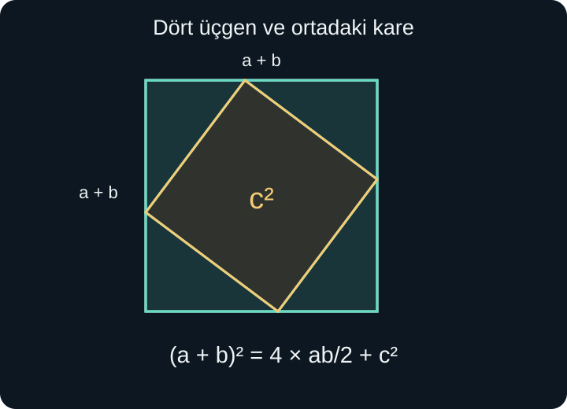
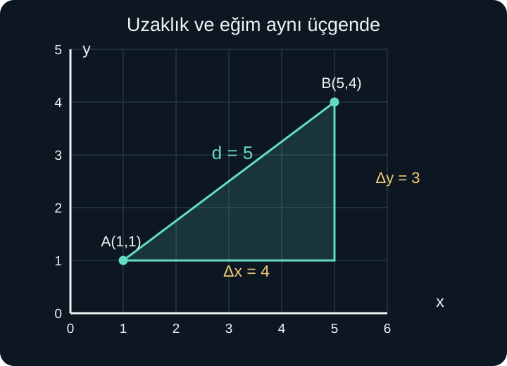

import ArticleVideo from '@/components/ArticleVideo.astro'
import kavram from './media/01-kavram.mp4?url'
import kavramPoster from './media/01-kavram.jpg?url'

Kareli bir haritada iki yer işaretleyelim. Birincisine başlangıç noktasından bir birim sağa, bir birim yukarı giderek; ikincisine beş birim sağa, dört birim yukarı giderek ulaşıyoruz. Aralarındaki yatay fark dört, düşey fark üç birimdir. Peki iki yeri birleştiren düz yolun uzunluğu nedir? Bu yol hangi ölçüde yükseliyor?

İlk soru uzaklığı, ikincisi eğimi sorar. İkisini de aynı çizim üzerinden cevaplayabiliriz. Bunun için önce düzlemde bir noktanın yerini sayılarla belirtmeyi öğrenecek, sonra geometrik uzunlukları cebirsel ifadelere dönüştüreceğiz.

[Önceki yazıda](/blog/cevre-alan-ve-hacim/) uzunluk ve alan ölçülerini ayırdık. Burada sayı doğrusu, negatif sayılar, karekök, dik üçgen, alan ve birinci derece denklem bilgilerini kullanacağız. Pisagor bağıntısını yalnızca hatırlatmakla kalmayıp kısa bir alan ispatıyla yeniden kuracağız. Fonksiyon kavramını ise bir sonraki yazıda tanımlayacağız.

## 1. İki Sayı Doğrusundan Bir Düzlem Kurmak

Bir sayı doğrusunda bir noktanın yeri tek sayıyla belirlenir. Düzlemde ise hem sağa-sola hem yukarı-aşağı hareket edebiliriz. İki sayı doğrusunu sıfır noktalarında dik kesiştirerek **koordinat sistemini** kurarız. Yatay doğruya $x$ ekseni, düşey doğruya $y$ ekseni, kesişimlerine **orijin** deriz.

Sağ yönü yatay eksenin pozitif, yukarı yönü düşey eksenin pozitif yönü olarak seçiyoruz. Sol ve aşağı yönlerde koordinatlar negatiftir. Bu yön seçimi bir anlaşmadır; çizimlerde açıkça belirtilmesi önemlidir. Haritada kuzeyi yukarı seçmek gibi, sayıları yorumlayacağımız bir çerçeve kuruyoruz.

Bir noktanın koordinatlarını $(x,y)$ biçiminde yazarız. Buna **sıralı ikili** denir. İlk sayı yatay, ikinci sayı düşey konumu gösterir. $(2,5)$ noktasını bulmak için orijinden iki birim sağa, beş birim yukarı gideriz. $(5,2)$ başka bir noktadır. “Sıralı” sözcüğü, bu yer değiştirmenin sonucu değiştirdiğini vurgular.

Noktaya ad vermek istersek $A(2,5)$ yazabiliriz: $A$ noktanın adı, parantezin içi koordinatlarıdır. Sayıların kendisi yol tarifi verir; önce yukarı sonra sağa yürümek de aynı noktaya götürür. Koordinatların sırası ile fiziksel olarak adımları hangi sırada attığımız farklı konulardır.

## 2. Bölgeler, Eksenler ve Ölçek

Eksenler düzlemi dört bölgeye ayırır. Sağ üstte iki koordinat pozitif, sol üstte ilk negatif ikinci pozitif, sol altta ikisi negatif, sağ altta ilk pozitif ikinci negatiftir. Geleneksel adlandırmada sağ üstten başlayıp saat yönünün tersine birinci, ikinci, üçüncü ve dördüncü bölge deriz.

$(-3,2)$ ikinci bölgededir; yatayda sola, düşeyde yukarı gideriz. $(4,-1)$ dördüncü bölgededir. $(0,3)$ ise bir bölgenin içinde değil, doğrudan $y$ eksenindedir. Benzer biçimde $(5,0)$, $x$ ekseninde bulunur. Orijinin koordinatları $(0,0)$ olur.

Çizimin ölçeği okunmadan mesafe hesaplanmaz. Bir kare yatayda 1 kilometre, düşeyde 1 kilometre gösteriyorsa geometrik biçim korunur. Yatayda 1 kilometre, düşeyde 10 kilometre gösteriyorsa çizimdeki açı gerçek haritadaki açı değildir. Koordinatlarla yine doğru hesap yapılabilir; fakat cetvelle görünen eğimi veya uzunluğu doğrudan ölçmek yanıltır.

Özellikle bir eksenin zaman, diğerinin sıcaklık gösterdiği grafikte iki koordinatı aynı tür uzunluk gibi toplayamayız. Uzaklık formülünü fiziksel bir düzleme uygularken eksenlerin dik olması ve koordinatların ortak uzunluk birimine çevrilmesi gerekir. Grafik çizmekle fiziksel harita çizmenin aynı şey olmadığını baştan koruyalım.

## 3. Dik Üçgende Pisagor Neden Doğru?

Dik kenarları 3 ve 4 birim olan bir üçgenin üçüncü kenarına $c$ diyelim. Dik açının karşısındaki bu kenarın adı **hipotenüs**tür. Dik kenarların arasındaki açı 90 derece olduğu için birazdan kuracağımız alan ilişkisini kullanabileceğiz.

Bu üçgenden dört eş kopya alalım. Kenarı $3+4=7$ olan bir büyük karenin köşelerine yerleştirelim. Hipotenüsler ortada bir dörtgenin sınırını oluşturur. İç dörtgenin dört kenarı da $c$ uzunluğundadır. Komşu iki üçgenin dar açıları toplamı 90 derece olduğundan, iç dörtgenin her açısı da 90 derecedir. Dolayısıyla ortadaki şekil gerçekten bir karedir.

Büyük karenin alanı $7^2=49$ birimkaredir. Bir üçgenin alanı $3\times4/2=6$, dört üçgenin toplam alanı 24 birimkaredir. Ortadaki karenin alanı $49-24=25$ olur. Bu karenin kenarı hipotenüs olduğundan $c^2=25$ ve uzunluk pozitif olduğu için $c=5$ buluruz.

Aynı yerleşimi pozitif $a$ ve $b$ dik kenarları için kurarsak:

$$
(a+b)^2=4\frac{ab}{2}+c^2
$$

Soldaki kareyi açıp sağdaki çarpımı yapalım:

$$
a^2+2ab+b^2=2ab+c^2
$$

İki taraftan $2ab$ çıkarınca **Pisagor teoremini** elde ederiz:

$$
a^2+b^2=c^2
$$

İspatta dik açı hem üçgen alanında hem ortadaki karenin açılarını kurarken kullanıldı. Bu nedenle bağıntıyı herhangi bir üçgenin üç kenarına koşulsuz uygulayamayız. Uzunlukların karelerini topluyoruz; $a+b=c$ demiyoruz.

## 4. Uzunlukları Bilince Dikliği Anlamak

Pisagor'un tersi de doğrudur: Bir üçgende en uzun kenarın karesi, diğer iki kenarın kareleri toplamına eşitse, en uzun kenarın karşısındaki açı diktir. Bunu anlamak için, verilen iki kısa kenarla ayrı bir dik üçgen kurabiliriz. Pisagor bu yeni üçgenin hipotenüs uzunluğunu belirler. Verilen üçgen de aynı üç kenara sahip olduğundan kenar-kenar-kenar eşliğiyle ona eştir; ilgili açısı da diktir.

Örneğin 5, 12 ve 13 birimlik üçgende $5^2+12^2=25+144=169=13^2$ olur. Dolayısıyla 13'ün karşısındaki açı 90 derecedir. Kenarları 4, 5 ve 6 olan bir üçgende ise $16+25=41$, fakat $6^2=36$; bu üçgen dik değildir. En uzun kenarı doğru seçmek, ters teoremi uygulamanın parçasıdır.

Dikliği bir çizimin görünüşünden çıkarmak yerine, verilen açı işaretinden, koşuldan veya böyle bir bağıntıdan doğrularız. Ekranda dik gibi görünen iki çizgi, ölçülü çizilmemiş bir şeklin içinde dik olmak zorunda değildir.

## 5. İki Nokta Arasındaki Uzaklık

Başlangıçtaki $A(1,1)$ ve $B(5,4)$ noktalarına dönelim. $A$'dan yatay gidip $B$'nin altına ulaşalım; ara nokta $(5,1)$ olur. Yatay parçanın uzunluğu $5-1=4$, düşey parçanın uzunluğu $4-1=3$ birimdir. Yatay ve düşey eksenler dik olduğundan bu iki parça bir dik üçgenin dik kenarlarıdır.

$A$ ile $B$ arasındaki düz uzaklığa $d$ diyelim. Pisagor'dan:

$$
d^2=4^2+3^2=16+9=25
$$

Uzunluk negatif olamayacağından $d=\sqrt{25}=5$ birimdir. Yatay-düşey yolun uzunluğu $4+3=7$ birim olur; iki nokta arasındaki doğru parçası bundan kısadır. “Uzaklık” derken bu düz uzunluğu, “gidilen yol” derken seçilen güzergâhın toplamını ayırmalıyız.

Genel iki nokta $A(x_1,y_1)$ ve $B(x_2,y_2)$ olsun. Alt indisler, yani harflerin sağ altındaki 1 ve 2, noktaları ayıran etiketlerdir; çarpma veya kuvvet belirtmez. Yatay fark $x_2-x_1$, düşey fark $y_2-y_1$ olur. Bunlar işaretli değişimlerdir; parçaların uzunlukları mutlak değerleridir. Kare alınca işaret zaten kaybolduğu için:

$$
d=\sqrt{(x_2-x_1)^2+(y_2-y_1)^2}
$$

Örneğin $A(-2,3)$, $B(4,-5)$ için yatay fark $4-(-2)=6$, düşey fark $-5-3=-8$ bulunur. Uzaklık $\sqrt{36+64}=10$ birimdir. Noktaların sırasını ters seçsek iki farkın işareti değişir, kareleri değişmez; uzaklık yine 10 olur.

<ArticleVideo src={kavram} poster={kavramPoster} title="Koordinatlardan uzaklığa ve eğime" caption="A(1,1) ile B(5,4) arasında yatay fark 4, düşey fark 3 birimdir. Aynı üçgen uzaklık için 5, eğim için 3/4 verir." />

## 6. Orta Noktanın Koordinatları

Bir doğru parçasının ortasına ulaşmak için iki uç arasındaki yatay değişimin yarısını, düşey değişimin de yarısını alırız. $A(1,1)$ ile $B(5,4)$ arasında yatay fark 4, düşey fark 3 olduğundan, $A$'dan 2 birim sağa ve 1,5 birim yukarı gideriz. Orta nokta $(3,2{,}5)$ olur.

Genel durumda yatay koordinat:

$$
x_1+\frac{x_2-x_1}{2}
=\frac{2x_1+x_2-x_1}{2}
=\frac{x_1+x_2}{2}
$$

Düşey koordinat için de aynı işlem yapılır. Orta noktayı $M$ ile gösterirsek:

$$
M\left(\frac{x_1+x_2}{2},\frac{y_1+y_2}{2}\right)
$$

Burada ortalamaları ayrı ayrı alıyoruz. Bütün dört sayıyı toplayıp dörde bölmek tek sayı verir; düzlemdeki bir noktayı belirlemek için iki koordinat gerekir. $(-2,3)$ ile $(4,-5)$ örneğinde orta nokta $(1,-1)$ olur. Bu noktanın her iki uca uzaklığı $\sqrt{3^2+4^2}=5$ birimdir; toplam uzaklığın yarısını elde ederek kontrol ederiz.

## 7. Eğim Bir Değişim Oranıdır

Bir yol yatayda 4 metre ilerlerken 3 metre yükseliyorsa, her 1 metre yatay ilerleme başına 3/4 metre yükselir. **Eğim**, düşey değişimin yatay değişime oranıdır. Eğimi genellikle $m$ ile gösteririz:

$$
m=\frac{y_2-y_1}{x_2-x_1}
$$

Bu formülde $x_2\ne x_1$ olmalıdır; paydayı sıfır yapamayız. Değişim için kullanılan $\Delta$ harfi “delta” diye okunur. $\Delta x=x_2-x_1$, $\Delta y=y_2-y_1$ kısaltmalarıyla aynı ilişki $m=\Delta y/\Delta x$ olur.

$A(1,1)$ ve $B(5,4)$ için eğim $3/4=0{,}75$'tir. Her iki eksen metreyle ölçülüyorsa birimler birbirini götürür. Yüzde eğim olarak 75 yüzde denebilir; bu sayı **75 derecelik açı demek değildir**. Açıyla eğim arasındaki bağı trigonometride kuracağız.

Sağa giderken yükselen doğrunun eğimi pozitif, alçalanın negatiftir. $(1,4)$ ile $(5,2)$ arasında $m=(2-4)/(5-1)=-2/4=-1/2$ olur. Eksi işareti uzunluğun negatifliğini değil, sağa ilerlerken düşey koordinatın azalmasını anlatır. Noktaları ters sırayla çıkardığımızda hem pay hem payda işaret değiştirir; oran aynı kalır.

Yatay doğru üzerinde düşey değişim sıfırdır, eğim 0 olur. Dikey doğru üzerinde yatay değişim sıfırdır; eğim **tanımsızdır**. Dikey doğruya “eğimi sıfır” demek onu yatay doğruyla karıştırır. Burada sıfıra bölmeyi bir sayı gibi kullanmıyoruz.

## 8. Bir Nokta ve Eğimden Doğru Denklemi

$(1,1)$ noktasından geçen ve eğimi $3/4$ olan doğru üzerindeki herhangi bir noktaya $(x,y)$ diyelim. Sabit noktadan bu yeni noktaya yatay değişim $x-1$, düşey değişim $y-1$ olur. Eğimin sabit olması şu eşitliği verir:

$$
y-1=\frac34(x-1)
$$

Bu, **nokta-eğim biçimidir**. Paydalı oran yazmak yerine çarparak düzenlediğimiz için başlangıç noktası $(1,1)$ de eşitliği sağlar. Sağ tarafı açıp iki tarafa 1 ekleyelim:

$$
y=\frac34x+\frac14
$$

Genel yazım $y=mx+b$ olur. $m$ eğim, $b$ doğrunun $y$ eksenini kestiği noktadaki düşey koordinattır. Çünkü $x=0$ yazınca $y=b$ çıkar. Bu yazıdaki $b$ harfi, alan yazısındaki taban uzunluğundan farklı görev taşıyor; bir harfin anlamını bulunduğu tanım belirler.

Bir doğru üzerinde eğimin neden değişmediğini de geometriden görebiliriz. İki farklı nokta çifti seçildiğinde yatay ve düşey parçalarla oluşan dik üçgenler aynı eğik açıya sahiptir. Üçgenler benzerdir; karşılık gelen düşey ve yatay uzunlukların oranı aynıdır. Dolayısıyla eğim tek bir çizim parçasının rastlantısal oranı değildir.

Dikey doğrular $y=mx+b$ biçimine sığmaz. Örneğin $x=3$, yatay koordinatı daima 3 olan bütün noktaları anlatır. Düşey koordinat serbesttir. Daha genel $ax+by=c$ biçimi hem dikey hem diğer doğruları kapsar; ancak $a$ ile $b$ aynı anda sıfır olamaz. Burada harfler sabit katsayıları gösterir.

## 9. Eksen Kesişimlerini Bulmak

$2x+3y=12$ doğrusunu çizmek için iki farklı noktası yeterlidir. $y=0$ koyarsak $2x=12$, dolayısıyla $x=6$ buluruz. Yatay eksen kesişimi $(6,0)$ olur. $x=0$ koyarsak $3y=12$, dolayısıyla $y=4$ çıkar. Düşey eksen kesişimi $(0,4)$ olur.

Bu noktaları birleştirirken çizdiğimiz doğru parçasının ötesinde de denklemi sağlayan noktalar bulunduğunu hatırlarız. Ek bir aralık koşulu verilmedikçe denklem bütün doğruyu anlatır. $y$'yi yalnız bırakırsak $y=4-(2/3)x$ elde eder, eğimin $-2/3$ olduğunu görürüz.

Eksen kesişimleri her zaman iki farklı nokta sağlamaz. $y=2x$ doğrusu iki ekseni de orijinde keser. Böyle bir durumda ikinci noktayı başka bir $x$ değeri seçerek buluruz: $x=1$ için $y=2$ olur. Bir yöntemin amacını anlamak, özel durumda nasıl uyarlanacağını da gösterir.

## 10. Denklem Sistemlerini Grafikte Okumak

$y=x+1$ ve $y=-x+5$ koşullarını aynı anda sağlayan noktayı arayalım. İki ifade aynı $y$ değerine eşit olduğundan $x+1=-x+5$ yazabiliriz. İki tarafa $x$ ekleyip 1 çıkarınca $2x=4$, ardından $x=2$ bulunur. Yerine koyunca $y=3$ çıkar.

Geometrik anlamı şudur: $(2,3)$ noktası iki doğrunun da üzerindedir. Sistem çözümü, grafiklerin ortak noktasıdır. İki farklı eğimli doğru tek noktada kesişir. Eğimi aynı, düşey eksen kesişimi farklı olan $y=2x+1$ ve $y=2x-3$ doğruları paraleldir; ortak noktaları yoktur.

$y=2x+1$ ve $2y=4x+2$ ise aynı doğrunun iki farklı yazımıdır. İkinci denklemi ikiye böldüğümüzde ilkini buluruz. Bu durumda bir doğru boyunca sonsuz sayıda ortak nokta vardır. [Denklem sistemlerinde](/blog/iki-bilinmeyenli-denklem-sistemleri/) cebirle ayırdığımız tek çözüm, çözümsüzlük ve sonsuz çözüm durumları böylece görünür hâle gelir.

Grafik yaklaşık bir kesişim okumaya yardımcı olur; kesin koordinatları cebirle doğrularız. Kalın çizgi veya küçük ekran, $(2,3)$ ile ona çok yakın bir noktayı ayırt etmeyebilir. Çizim ilişkiyi gösterir, yerine koyma ise bulduğumuz çiftin iki koşulu da tam sağladığını denetler.

## 11. Birimleri Değiştirince Hangi Sayılar Değişir?

Bir rampanın yatay uzunluğu 2 metre, yükselmesi 40 santimetre olsun. İlk bakışta $40/2=20$ yazmak mümkün görünür; fakat pay ile payda farklı uzunluk birimlerindedir. Önce 40 santimetreyi 0,4 metre yaparız. Eğim $0{,}4/2=0{,}2$, yani yüzde 20 olur. Santimetreyle çalışsaydık $40/200$ hesabıyla yine 0,2 bulurduk. Aynı tür uzunlukları aynı birime çevirmek oranı anlamlı kılar.

Rampanın eğik uzunluğu da 2 ile 40'ın kareleri toplanarak bulunmaz. Metreyle $\sqrt{2^2+0{,}4^2}=\sqrt{4{,}16}$ metre elde ederiz. Sonuç yaklaşık 2,040 metredir. Bu, yatay uzunluktan biraz büyük, yatay ve düşey parçaların toplamı olan 2,4 metreden küçüktür. Böyle bir büyüklük kontrolü, işlem hatasını fark etmeye yardımcı olur.

Bir depo grafiğinde ise yatay eksen dakikayı, düşey eksen litreyi gösterebilir. İki ölçüm $(2,11)$ ve $(5,23)$ olsun. Üç dakika boyunca miktar $23-11=12$ litre artmıştır; eğim $12/3=4$ litre/dakikadır. Burada birimler birbirini götürmez. Eğim fiziksel olarak “her dakika kaç litre ekleniyor?” sorusunu cevaplar. Bu sayı geometrik bir rampanın yüzde eğimi değildir.

Zamanı saniyeyle yazarsak aynı noktaların yatay koordinatları 120 ve 300 olur. Yeni sayısal eğim $12/180=1/15$ litre/saniyedir. İşlem aynı süreci anlatır; yalnızca kullanılan zaman birimi değişmiştir. Bir eğimi başka bir eğimle karşılaştırmadan önce hem büyüklüklerin hem birimlerin aynı olup olmadığına bakarız.

Bu depo örneğinde $\sqrt{3^2+12^2}$ hesaplamak, noktalar arasında fiziksel bir uzunluk vermez: dakika karesiyle litre karesini toplayamayız. Grafiği ekranda iki boyutlu çizmiş olmamız, eksenlerin aynı tür fiziksel büyüklük olduğu anlamına gelmez. Uzaklık formülüyle eğim formülünün koşullarını ayrı düşünmek, koordinat yöntemini çok farklı alanlarda doğru kullanmamızı sağlar.

Düzlemde artık bir noktayı adresleyebilir, iki nokta arasındaki değişimi hesaplayabilir ve bir eşitliği noktalar topluluğu olarak okuyabiliriz. Sıradaki adımda, her girdiye tek bir çıktı bağlayan kuralları ele alacağız. Koordinat grafiği bu kuralların davranışını incelememizi sağlayacak.

## Kaynakça

Örnekler, alan ispatının anlatımı ve görseller özgündür. Aşağıdaki doğrudan kaynak bölümleri 8 Ekim 2026 tarihinde kontrol edildi.

- [OpenStax — College Algebra 2e, 2.1: The Rectangular Coordinate Systems and Graphs](https://openstax.org/books/college-algebra-2e/pages/2-1-the-rectangular-coordinate-systems-and-graphs): Koordinatlar, uzaklık ve orta nokta bağıntılarının koşulları için.
- [OpenStax — Precalculus 2e, 2.1: Linear Functions](https://openstax.org/books/precalculus-2e/pages/2-1-linear-functions): Eğimin değişim oranı olması, nokta-eğim gösterimi ve birim yorumu için.
- [OpenStax — Prealgebra 2e, 9.4: Use Properties of Rectangles, Triangles, and Trapezoids](https://openstax.org/books/prealgebra-2e/pages/9-4-use-properties-of-rectangles-triangles-and-trapezoids): Alan ispatında kullanılan üçgen ve kare alanları için.
