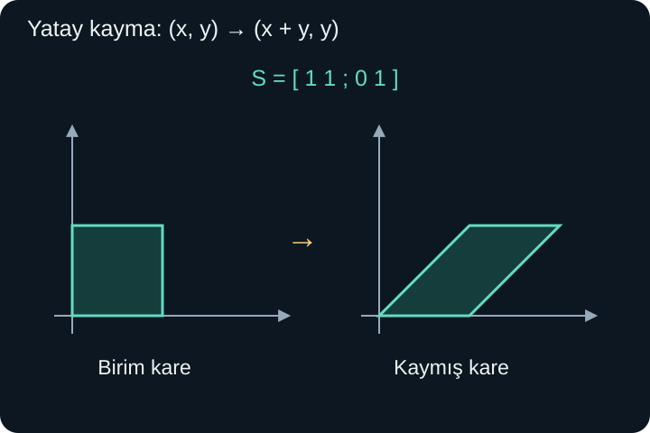
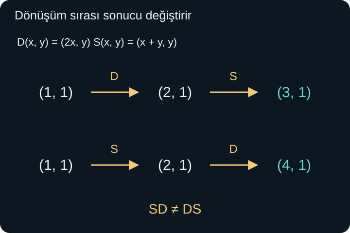

import ArticleVideo from '@/components/ArticleVideo.astro'
import kavram from './media/01-kavram.mp4?url'
import kavramPoster from './media/01-kavram.jpg?url'

Bir kareyi yatayda iki kat genişletmek için dört köşeyi ayrı ayrı hareket ettirebiliriz. Fakat şekil yüzlerce nokta içeriyorsa her noktaya bağımsız bir komut vermek yerine, bütün düzlem için tek bir kural yazmak daha kullanışlıdır: $(x,y)$ noktası $(2x,y)$ noktasına gitsin.

Bu kural yatay bilgiyi ikiyle çarpar, düşey bilgiyi korur. Benzer kurallarla şekilleri döndürebilir, yansıtabilir veya yatay katmanlarını birbirine göre kaydırabiliriz. **Matrisler**, bu işlemlerin belirli bir sınıfını sayılarla kaydeder. Her sayı tablosu aynı boyutta değildir; tablonun nasıl okunacağı ve vektöre nasıl uygulanacağı açıkça tanımlanmalıdır.

[Önceki yazıda](/blog/dogrusal-birlesim-baz-ve-boyut/) bir bazın bütün vektörleri tek anlamlı koordinatlarla kurduğunu gördük. Şimdi bir dönüşümün yalnızca baz vektörlerine ne yaptığını bilerek diğer bütün vektörlere ne yapacağını hesaplayacağız. Bunun için vektör toplamı, skalerle çarpma ve fonksiyonların bileşkesi bilgimiz yeterlidir.

## 1. Matris Bir Sayı Tablosudur

Şu tabloyu ele alalım:

$$
A=\begin{pmatrix}2&1\\-1&3\end{pmatrix}.
$$

Tabloda iki yatay **satır**, iki düşey **sütun** vardır. Bu yüzden $A$ bir $2\times2$ matristir; önce satır sayısı, sonra sütun sayısı söylenir. Tablodaki her sayıya bir **eleman** denir. $a_{ij}$ gösteriminde $i$ satırı, $j$ sütunu belirtir. Örneğin $a_{21}=-1$, ikinci satırın birinci elemanıdır.

Matrisin boyutu, içindeki toplam sayı adediyle aynı şey değildir. $2\times3$ ve $3\times2$ matrislerin ikisinde de altı eleman vardır; ama farklı türde girdiler ve çıktılarla ilişkilidirler. Bu nedenle boyut bilgisini yalnızca “altı sayı” diye özetleyemeyiz.

Vektörleri şimdi çoğunlukla sütun biçiminde yazacağız:

$$
\mathbf v=\begin{pmatrix}x\\y\end{pmatrix}.
$$

Bu, önceki $(x,y)$ gösteriminin alt alta yazılmasıdır. Geometrik vektör değişmedi. Sütun yazımı, matrisle yapılan işlemin satır ve sütunlarını izlemeyi kolaylaştırır.

## 2. Matris Bir Vektöre Nasıl Etki Eder?

$A$ matrisini $\mathbf v$ vektörüyle çarpmayı şöyle tanımlayalım:

$$
\begin{pmatrix}a&b\\c&d\end{pmatrix}
\begin{pmatrix}x\\y\end{pmatrix}
=
\begin{pmatrix}ax+by\\cx+dy\end{pmatrix}.
$$

İlk satırın vektörle skaler çarpımı ilk çıktı bileşenini, ikinci satırın skaler çarpımı ikinci çıktı bileşenini verir. Örneğin yukarıdaki $A$ için $(3,2)$ girdisi:

$$
A\begin{pmatrix}3\\2\end{pmatrix}
=\begin{pmatrix}2\cdot3+1\cdot2\\-1\cdot3+3\cdot2\end{pmatrix}
=\begin{pmatrix}8\\3\end{pmatrix}
$$

çıktısına gider. Girdideki iki sayıyı yalnızca yan yana bulunan iki matris elemanıyla çarpmadık; her çıktı için bir satırın tamamını kullandık.

Aynı işlemi sütunlar açısından da okuyabiliriz:

$$
A\begin{pmatrix}x\\y\end{pmatrix}
=x\begin{pmatrix}a\\c\end{pmatrix}
+y\begin{pmatrix}b\\d\end{pmatrix}.
$$

Yani çıktı, matris sütunlarının girdideki koordinatlarla oluşturulan doğrusal birleşimidir. Bu ikinci yorum geometrik anlamı görünür kılar: sütunlar, dönüşümün temel yönlerini kaydeder.

## 3. Sütunlar Baz Vektörlerinin Görüntüleridir

Standart baz vektörleri $\mathbf e_1=(1,0)$ ve $\mathbf e_2=(0,1)$ idi. İlkini matrise uygularsak $x=1$, $y=0$ olduğu için birinci sütun kalır. İkincisini uygularsak ikinci sütun kalır:

$$
A\mathbf e_1=(a,c),\qquad A\mathbf e_2=(b,d).
$$

Bir fonksiyonun verdiği çıktıya girdinin **görüntüsü** de denir. Bu kullanımda “görüntü” fotoğraf anlamına gelmez. Matrisin birinci sütunu ilk baz vektörünün, ikinci sütunu ikinci baz vektörünün görüntüsüdür.

Her vektör $x\mathbf e_1+y\mathbf e_2$ biçiminde kurulduğundan, bu iki görüntüyü bilmek bütün girdilerin sonucunu belirleyebilir. Ancak bunun için dönüşümün toplamı ve skalerle çarpmayı koruması gerekir. Şimdi bu koşulu tanımlayacağız.

## 4. Doğrusal Dönüşümün İki Koşulu

Vektörleri vektörlere götüren bir fonksiyona dönüşüm diyelim ve $T$ harfiyle gösterelim. Bir dönüşüm şu iki özelliği bütün uygun vektörler ve gerçek $k$ sayıları için sağlıyorsa **doğrusaldır**:

$$
T(\mathbf u+\mathbf v)=T(\mathbf u)+T(\mathbf v),
$$

$$
T(k\mathbf u)=kT(\mathbf u).
$$

İlki, önce toplamakla önce dönüştürüp sonra toplamanın aynı sonucu vermesidir. İkincisi, önce ölçeklemekle önce dönüştürüp sonra ölçeklemenin aynı olmasıdır. Bu iki koşul birleşince bütün doğrusal birleşimler korunur.

Matrisle çarpma bu özellikleri taşır; her satırdaki sıradan dağılma özelliği bunu sağlar. Ters yönde, standart koordinatlarla ifade edilmiş bir doğrusal dönüşümün baz görüntülerini sütunlara yerleştirirsek onu temsil eden matrisi elde ederiz. Böylece matris, yalnızca hesap tablosu olmaktan çıkıp dönüşümün kaydı hâline gelir.

Her doğrusal dönüşüm sıfır vektörünü sıfıra götürür. İkinci koşulda $k=0$ seçersek $T(\mathbf0)=0T(\mathbf u)=\mathbf0$ olur. Bu sonuç, doğrusallığı sınamak için hızlı bir ilk kontroldür. Ancak sıfırı sıfıra götürmek tek başına yeterli değildir; diğer koşullar da gerekir.

### Öteleme neden bu tanıma uymaz?

Her noktayı sağa 2 birim götüren $T(x,y)=(x+2,y)$ kuralını düşünelim. Başlangıç noktası $(0,0)$, $(2,0)$ noktasına gider. Dolayısıyla bu dönüşüm doğrusal değildir. Vektörlerin toplamı ile de uyum bozulur: iki ayrı çıktıya eklenen 2'ler toplanırken iki kez sayılır.

Günlük okul kullanımında $f(x)=mx+b$ biçimindeki fonksiyonlara “doğrusal fonksiyon” denmesiyle burada kullanılan teknik tanımı ayırmalıyız. Lineer cebirde $b\ne0$ olduğunda sabit öteleme içeren böyle kurallar **afin** olarak adlandırılır. Bu yazıda doğrusal dönüşüm derken toplam ve skaler çarpma koşullarını kullanıyoruz.

## 5. Temel Şekil Dönüşümleri

Yatayda iki, düşeyde üç kat ölçekleme:

$$
D=\begin{pmatrix}2&0\\0&3\end{pmatrix}
$$

matrisiyle verilir. $(x,y)$, $(2x,3y)$ olur. Birim karenin köşeleri $(0,0),(1,0),(1,1),(0,1)$ iken görüntüleri $(0,0),(2,0),(2,3),(0,3)$'tür. Yeni şekil eni 2, boyu 3 olan dikdörtgendir.

Yatay eksene göre yansıma matrisi:

$$
F=\begin{pmatrix}1&0\\0&-1\end{pmatrix}
$$

olur. Yatay bileşen korunur, düşey bileşen işaret değiştirir. $(3,2)$ noktası $(3,-2)$'ye gider. Uzunluk korunur, fakat düzlemin yönelimi ters çevrilir; örneğin saat yönünün tersinde sıralanmış köşeler yansımadan sonra saat yönünde sıralanır.

Düşey bileşeni silen $P=\begin{pmatrix}1&0\\0&0\end{pmatrix}$ ise $(x,y)$'yi $(x,0)$'a gönderir. Bütün düzlem yatay eksene çöker. Bu da doğrusaldır: doğrusal olmak, uzunluk veya şekil korumak anlamına gelmez. Aynı zamanda farklı girdiler aynı çıktıya gidebilir; örneğin $(2,1)$ ile $(2,5)$ ikisi de $(2,0)$ olur.

## 6. Kayma: Katmanları Farklı Miktarda Taşımak

Şimdi şu matrisi kullanalım:

$$
S=\begin{pmatrix}1&1\\0&1\end{pmatrix}.
$$

Çıktı $(x+y,y)$ olur. Düşey konum değişmez; yatay konuma $y$ kadar eklenir. Yatay eksendeki noktalar yerinde kalır. Yüksekliği 1 olan katman sağa 1, yüksekliği 2 olan katman sağa 2 birim kayar. Negatif yükseklikteki katmanlar sola kayar.

Bu dönüşüme **kayma**, daha özel olarak yatay kesme dönüşümü denir. Her noktaya aynı sabit miktarı ekleyen ötelemeden farklıdır; kayma miktarı konuma bağlıdır ve orijin yerinde kalır. Birim karenin köşeleri sırasıyla $(0,0),(1,0),(2,1),(1,1)$ olur; kare bir paralelkenara dönüşür.

<ArticleVideo src={kavram} poster={kavramPoster} title="Birim karenin matrisle kaydırılması" caption="(x, y) noktası (x + y, y) noktasına gider. Üst katman sağa kayarken birim kare paralelkenara dönüşür." />

Sütun yorumuyla aynı sonucu hemen okuyabiliriz. İlk sütun $(1,0)$ olduğu için yatay baz yönü korunur. İkinci sütun $(1,1)$ olduğu için düşey baz yönü sağa eğilir. Karedeki $(1,1)$ köşesinin görüntüsü bu iki sütunun toplamı olan $(2,1)$'dir.

## 7. Dönme Matrisini Açı Bağıntısından Kurmak

Orijin çevresinde saat yönünün tersine $\theta$ kadar döndürmek isteyelim. Yatay birim vektörün yeni konumu $(\cos\theta,\sin\theta)$'dır. Düşey birim vektör başlangıçta $\pi/2$ açısındadır; döndüğünde koordinatları $(-\sin\theta,\cos\theta)$ olur. Bu iki görüntüyü sütunlara koyarsak:

$$
R_\theta=
\begin{pmatrix}
\cos\theta&-\sin\theta\\
\sin\theta&\cos\theta
\end{pmatrix}.
$$

Dönmenin gerçekten doğrusal olduğunu, herhangi bir vektörü $r(\cos\varphi,\sin\varphi)$ olarak yazarak doğrulayabiliriz. $r$ uzunluk, $\varphi$ başlangıç açısıdır. Yeni açı $\varphi+\theta$ olur. Toplam açı bağıntıları yeni koordinatları $(x\cos\theta-y\sin\theta,x\sin\theta+y\cos\theta)$ verir. Bunlar matris çarpımındaki ifadelerdir ve $x,y$ bakımından doğrusaldır. Sıfır vektörü de yerinde kalır.

$\theta=90^\circ$ için kosinüs 0, sinüs 1 olduğundan $R=\begin{pmatrix}0&-1\\1&0\end{pmatrix}$ bulunur. $(3,2)$ girdisi $(-2,3)$ olur. Normların ikisi de $\sqrt{13}$'tür. Bu dönüşümde uzunlukların korunması özel bir özelliktir; her matris için beklemeyiz.

## 8. Matris Çarpımı, Dönüşümlerin Bileşkesidir

Önce $B$, sonra $A$ dönüşümünü uyguluyorsak sonuç $A(B\mathbf v)$ olur. Bu ardışık işlemi tek bir matrisle temsil eden çarpıma $AB$ deriz:

$$
(AB)\mathbf v=A(B\mathbf v).
$$

Sağdaki matris önce uygulanır. Bu sıra, fonksiyonların bileşkesinde gördüğümüz sağdan sola okuma ile aynıdır. $AB$ matrisinin sütunlarını bulmak için $B$'nin her sütununu $A$ ile dönüştürürüz. Her elemanın “bir satır ile bir sütunun skaler çarpımı” olması bu geometrik tanımdan çıkar.

Örneğin yatay ölçekleme $D=\begin{pmatrix}2&0\\0&1\end{pmatrix}$ ve yukarıdaki kayma $S$ olsun. Önce $D$, sonra $S$ uygularsak:

$$
SD=\begin{pmatrix}2&1\\0&1\end{pmatrix}.
$$

Birinci sütun, $D$'nin $(2,0)$ sütununun $S$ görüntüsü olan $(2,0)$'dır. İkinci sütun ise $(0,1)$'in $S$ görüntüsü $(1,1)$'dir. $(1,1)$ girdisi sonuçta $(3,1)$ olur.

Sırayı değiştirirsek:

$$
DS=\begin{pmatrix}2&2\\0&1\end{pmatrix},
$$

ve aynı girdi $(4,1)$ olur. Çünkü önce kaymanın eklediği yatay miktar da sonradan iki katına çıkar. Genel olarak **matris çarpımında sıra değiştirilemez**.

Buna karşılık parantezleme uyumludur: $A(BC)=(AB)C$, boyutlar elverdiğinde aynı ardışık uygulamayı anlatır. Burada sıra korunur; sadece ara hesabı nasıl grupladığımız değişir. Değişme ve birleşme özelliklerini birbirinden ayırmak gerekir.

## 9. Boyutlar Uyumlu mu?

Bir $m\times n$ matris, $n$ bileşenli girdiden $m$ bileşenli çıktı üretir. $m$ satır sayısı, $n$ sütun sayısıdır. Örneğin:

$$
A=\begin{pmatrix}1&2&0\\0&-1&1\end{pmatrix}
$$

bir $2\times3$ matristir. $(2,1,4)$ girdisini $(4,3)$ çıktısına götürür. Üç boyutlu bilgiden iki bileşenli bilgi üretmiştir. Matrisin kare olması zorunlu değildir.

Çarpımda $A$ matrisi $m\times n$, $B$ matrisi $n\times p$ ise $AB$ tanımlıdır ve $m\times p$ boyutundadır. İçteki iki $n$ aynı olmalıdır; çünkü $B$'nin ürettiği bileşen sayısı, $A$'nın istediği girdi sayısına eşit olmalıdır. Sonucun boyutunu dıştaki sayılar belirler.

Örneğin $2\times3$ ile $3\times4$ çarpılabilir ve $2\times4$ verir. Aynı iki matrisi ters sırayla çarpmaya çalışırsak iç boyutlar 4 ve 2 olur; bu işlem tanımlı değildir. Bu, yalnızca değişme özelliğinin başarısızlığından daha temel bir sorundur: kimi zaman ters sırada işlem yoktur.

## 10. Birim Matris, Toplama ve Transpoz

Hiçbir vektörü değiştirmeyen matrise **birim matris** deriz. İki boyutta:

$$
I=\begin{pmatrix}1&0\\0&1\end{pmatrix}.
$$

$ I\mathbf v=\mathbf v$ olur. Uygun boyutlu birim matrislerle $IA=A$ ve $AI=A$ yazılır. Köşegendeki 1'ler ilgili bileşeni korur, diğer 0'lar bileşenler arasında ek katkı gelmesini önler.

Aynı boyutlu matrisleri eleman eleman toplayabiliriz. Bir skalerle çarparken de her elemanı çarparız. Örneğin $2\begin{pmatrix}1&3\\0&-1\end{pmatrix}=\begin{pmatrix}2&6\\0&-2\end{pmatrix}$. Bu işlemlerin eleman bazında olması, matris çarpımının da eleman bazında olduğu anlamına gelmez; çarpımın bileşke gerekçesi farklıdır.

Bir matrisin **transpozu**, satırları sütun yaparak elde edilir ve $A^T$ ile gösterilir. Örneğin:

$$
\begin{pmatrix}1&2&3\\4&5&6\end{pmatrix}^{T}
=\begin{pmatrix}1&4\\2&5\\3&6\end{pmatrix}.
$$

$2\times3$ boyut, $3\times2$ olur. İki kez transpoz almak ilk matrise döndürür. Transpoz genel olarak dönüşümü geri alan ters matris değildir; bu başka bir kavramdır. Örneğin yatay iki kat büyütmenin matrisi transpoz alınca değişmez, oysa geri almak için yatay bileşeni ikiye bölmek gerekir.

## 11. Doğruların ve Şekillerin Görüntüsü

Bir doğruyu $\mathbf p+t\mathbf v$ biçiminde yazabiliriz. Burada $\mathbf p$ doğru üzerindeki sabit bir noktanın konum vektörü, $\mathbf v\ne\mathbf0$ doğru yönü, $t$ ise bütün gerçek sayılar arasında değişen parametredir. Her farklı $t$ aynı doğru üzerindeki bir konumu tarif eder. $t$'yi zaman olarak yorumlamak zorunda değiliz; burada yalnızca noktaları sayısal olarak seçer.

Doğrusal $T$ dönüşümünü uyguladığımızda $T(\mathbf p+t\mathbf v)=T(\mathbf p)+tT(\mathbf v)$ olur. Eğer $T(\mathbf v)$ sıfırdan farklıysa sonuç yine bir doğrudur. Eğer bu yön sıfıra gidiyorsa bütün noktalar aynı $T(\mathbf p)$ noktasına çöker. Dolayısıyla “doğrusal dönüşüm her doğruyu mutlaka bir doğruya götürür” cümlesinin çökmenin mümkün olduğu durum için düzeltilmesi gerekir.

Benzer biçimde, bir doğru parçasının iki uç görüntüsünü bulmak, aradaki noktaların nasıl yerleşeceğini de belirler. $0\le t\le1$ için $(1-t)\mathbf p+t\mathbf q$ iki uç arasındaki noktaları verir. Dönüşümden sonra $(1-t)T(\mathbf p)+tT(\mathbf q)$ elde edilir. Aynı oran yeni uçlar arasında korunur. Bu yüzden bir kareyi çizmek için önce köşeleri dönüştürüp aralarını doğru parçalarıyla birleştirebiliriz.

Fakat açıların veya uzunlukların korunacağını söylemedik. Kayma örneğinde dik açı eğik bir açıya dönüştü. Eşit uzunluktaki yatay ve düşey iki kenar farklı uzunluklara dönüşebilir. “Doğrusallık” çok özel iki cebirsel ilişkiyi korur; bütün geometrik özelliklerin korunması anlamına gelmez.

### Sıfırı koruma kontrolünün sınırı

$T(x,y)=(x^2,y)$ dönüşümü sıfırı sıfıra götürür. Buna rağmen doğrusal değildir. $\mathbf u=(1,0)$ için $T(2\mathbf u)=T(2,0)=(4,0)$, fakat $2T(\mathbf u)=2(1,0)=(2,0)$ olur. Skalerle çarpma koşulu başarısızdır. Tek bir karşı örnek, bütün girdiler için geçerli olması gereken doğrusallığı çürütmeye yeter.

Bu ayrım uygulamada kullanışlıdır. Bir grafikte orijinin yerinde kaldığını görmek ilk kontroldür; matrisle temsil edilebileceğini kanıtlamak için bütün birleşimleri koruyan kuralı göstermemiz gerekir. Öte yandan kuralın $ax+by$ ve $cx+dy$ biçiminde olduğunu açıkça yazabildiğimizde, gerçek sayıların dağılma özelliği bu kanıtı sağlar. Rastgele çok sayıda girdi denemek yerine, ifadelerin yapısına bakarak genel sonuca ulaşırız.

## 12. Denklem Sistemlerini Aynı Dille Yazmak

Şu sistemi düşünelim:

$$
2x+y=7,\qquad x-y=2.
$$

Bilinmeyenlerin katsayılarını satırlara yazarsak:

$$
\begin{pmatrix}2&1\\1&-1\end{pmatrix}
\begin{pmatrix}x\\y\end{pmatrix}
=\begin{pmatrix}7\\2\end{pmatrix}.
$$

Bu, sistemi değiştirmez; aynı iki denklemi tek bir vektör eşitliğinde toplar. İlk satır ilk denklemi, ikinci satır ikinci denklemi üretir. İkinci denklemden $y=x-2$ yazıp birincide kullanırsak $2x+x-2=7$, $3x=9$, $x=3$ ve $y=1$ buluruz.

Geometrik yorumda $(x,y)$ girdisinin verilen dönüşüm altında $(7,2)$ çıktısına gitmesini istiyoruz. Sütun yorumunda ise $x(2,1)+y(1,-1)=(7,2)$ doğrusal birleşiminin katsayılarını arıyoruz. Denklem sistemi, dönüşüm ve baz yönlerini birleştirme aynı hesapta buluşur.

Her çıktının bir girdisi var mı, varsa tek mi soruları henüz her matris için yanıtlanmış değil. Düzlemi bir doğruya çökerten örnekte bazı bilgileri kaybettiğimizi gördük. Sonraki yazıda alanın değişimini izleyen determinantı kuracak; bu kaybın ne zaman dönüşümü geri almayı imkânsızlaştırdığını inceleyeceğiz.

## Kaynakça

Aşağıdaki açık ders kitabı sayfaları 8 Ekim 2026 tarihinde doğrudan kontrol edilmiştir. Dönüşüm örnekleri, şekiller ve adım adım anlatım özgün hazırlanmıştır.

- [Georgia Tech, Interactive Linear Algebra — Linear Transformations](https://textbooks.math.gatech.edu/ila/linear-transformations.html): Toplam ve skalerle çarpmayı koruma, standart baz görüntüleri.
- [Georgia Tech, Interactive Linear Algebra — Matrix Multiplication](https://textbooks.math.gatech.edu/ila/matrix-multiplication.html): Matris çarpımının bileşke anlamı, boyut koşulları ve sıra.
- [Georgia Tech, Interactive Linear Algebra — Vectors](https://textbooks.math.gatech.edu/ila/vectors.html): Sütun vektörleri ile bileşen işlemleri arasındaki ilişki.
