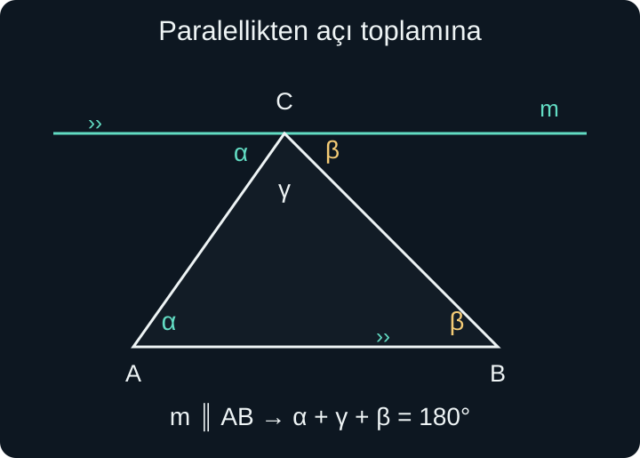
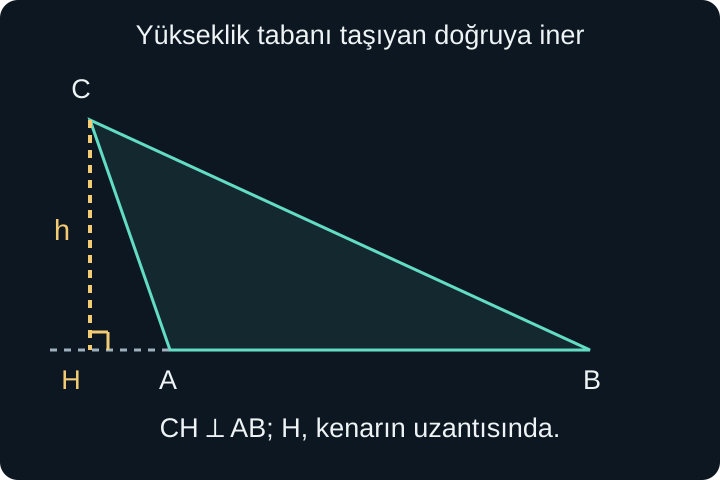

import ArticleVideo from '@/components/ArticleVideo.astro'
import kavram from './media/01-kavram.mp4?url'
import kavramPoster from './media/01-kavram.jpg?url'

Bir masanın kenarını cetvelle ölçebilir, iki yolun kesişmesini çizerek gösterebilir, bir çatının eğimini açıyla anlatabiliriz. Gerçek nesneler kalın, pürüzlü ve ölçüm hatasına açıktır. Geometride bunları anlamak için daha sade nesneler kurarız: genişliği olmayan noktalar, kalınlığı olmayan doğrular ve tam olarak tanımlanmış açılar.

Bu yazının ortamı **Öklid düzlemidir**: Düz bir yüzeyin sınırsız matematiksel modeli. Aşağıda kullanacağımız paralellik ve üçgen açı toplamı ilişkileri bu ortamda geçerlidir. Bir kürenin yüzeyi üzerinde çizilen yolları aynı kurallarla değerlendirmeyeceğiz.

[Önceki yazıda](/blog/ornek-karsi-ornek-ve-ispat/) tanım, varsayım ve ispatı ayırdık. Şimdi bu ayrımı çizimlere uygulayacağız. Sayı, oran, temel denklem ve eşitsizlik bilgisi yeterlidir. Çizimde benzer görünen parçaları kendiliğinden eşit saymayacak; hangi ilişkinin verildiğini, hangisinin çıkarıldığını belirteceğiz.

## 1. Nokta, Doğru, Doğru Parçası ve Işın

**Nokta**, bir konumu temsil eden temel geometrik nesnedir. Uzunluğu, genişliği veya alanı yoktur. Kâğıda koyduğumuz küçük leke noktanın kendisi değil, onu görünür kılan işarettir. Noktaları $A$, $B$, $C$ gibi büyük harflerle adlandırırız.

**Doğru**, iki yönde sınırsız uzanan, kalınlığı olmayan düz bir nesnedir. Çizimde yalnızca bir bölümünü gösterebiliriz. Uçlara konan oklar devam ettiğini hatırlatır. Öklid düzleminde birbirinden farklı iki noktadan geçen tek bir doğru vardır; bunu başlangıç ilişkilerimizden biri olarak kabul ederiz.

$A$ ile $B$ arasındaki noktaları ve iki ucu içeren sonlu bölüm **doğru parçasıdır**. $[AB]$ gösterimini kullanabiliriz. Uzunluğu $|AB|$ ile belirtiriz; bu, iki nokta arasındaki uzaklıktır. Birçok metin bağlam açıkken uzunluğu da $AB$ yazar. Burada karışıklık olduğunda dik çizgili gösterimi tercih edeceğiz.

**Işın**, bir başlangıç noktasından tek yönde sınırsız uzanır. $A$'dan başlayıp $B$'den geçen ışın ile $B$'den başlayıp $A$'dan geçen ışın aynı değildir. Noktaların sırası ışının hangi tarafta devam ettiğini belirler.

Aynı doğru üzerinde bulunan noktalara **doğrusal noktalar** denir. $B$, $A$ ile $C$ arasındaysa $|AC|=|AB|+|BC|$ olur. “Arasında” koşulu önemlidir; üç harfin aynı doğru üzerinde bulunması tek başına bu özel toplamı garanti etmez. Ortadaki noktanın hangisi olduğu verilmelidir.

## 2. Açı Bir Açılma Miktarıdır

Ortak başlangıçlı iki ışın bir açı oluşturur. Ortak noktaya **köşe**, ışınlara açının **kolları** deriz. $\angle ABC$ gösteriminde ortadaki $B$ köşedir; kollar $BA$ ve $BC$ yönündeki ışınlardır. Köşedeki açı tek ve açıkça belli ise yalnızca $\angle B$ yazılabilir.

Açının ölçüsü, bir kolun diğerine göre ne kadar döndüğünü anlatır. Kolları çizimde daha uzun göstermek açıyı büyütmez. Aynı iki yönü koruduğumuz sürece açılma miktarı değişmez. Bu nedenle kısa çizilmiş geniş bir açı, uzun çizilmiş dar bir açıdan büyük olabilir.

Bir tam dönüşü 360 eş parçaya ayırdığımızda her parçanın ölçüsüne **bir derece** deriz; $1^\circ$ ile gösterilir. Yarım dönüş $180^\circ$, çeyrek dönüş $90^\circ$ olur. Derece bir uzunluk birimi değildir; santimetreyle doğrudan karşılaştırılmaz.

$0^\circ$ ile $90^\circ$ arasındaki açılar **dar**, $90^\circ$ olan açı **dik**, $90^\circ$ ile $180^\circ$ arasındaki açılar **geniş** açıdır. $180^\circ$ doğru açı, $360^\circ$ tam açıdır. $180^\circ$ ile $360^\circ$ arasındaki açılara refleks açı da denir; burada üçgenlerin iç açıları için bu aralığa ihtiyacımız olmayacak.

İki kol iki farklı dönme bölgesi belirleyebilir. Örneğin bir yöndeki açı $70^\circ$ ise tam turu tamamlayan diğer bölge $290^\circ$'dir. Hangi bölgenin kastedildiğini yay işareti veya açıklama belirler. Sadece iki çizgi görmek her bağlamda tek bir ölçü seçmek için yeterli değildir.

## 3. Komşu, Tümler ve Bütünler Açılar

Aynı köşeyi ve bir kolu paylaşan, iç bölgeleri örtüşmeyen açılar **komşu açılardır**. Komşu olmak, toplamlarının mutlaka $180^\circ$ olması demek değildir. İki küçük komşu açı toplamda $40^\circ$ de verebilir.

Toplamları $90^\circ$ olan iki açı **tümler**, toplamları $180^\circ$ olan iki açı **bütünler** açılardır. Bu tanımlar komşu olmayı gerektirmez. Şeklin farklı yerlerindeki $35^\circ$ ve $55^\circ$ açıları tümlerdir; $35^\circ$ ve $145^\circ$ açıları bütünlerdir.

Komşu iki açının ortak olmayan kolları birbirine zıt ışınlarsa, birlikte bir doğru açı oluştururlar. Bunlara doğrusal açı çifti diyebiliriz. Toplamları $180^\circ$'dir. Birisi $68^\circ$ ise diğeri $180^\circ-68^\circ=112^\circ$ olur.

Bu ilişkiyi kullanırken doğru boyunca gerçekten zıt yönde uzanan iki kol bulunduğundan emin olmalıyız. Kolların düz görünmesi bir çizim izlenimi olabilir; doğrusal oldukları verilmişse veya ispatlanmışsa toplamı kesin olarak kullanabiliriz.

## 4. Kesişen İki Doğrunun Ters Açıları

İki farklı doğru bir noktada kesiştiğinde dört açı oluşur. Birbirinin karşısında duran, ortak kol paylaşmayan açı çiftlerine **ters açılar** denir. Ters açıların ölçüleri eşittir.

Bunu doğrusal açı çiftleriyle gösterebiliriz. Çevrede sırayla $\alpha$, $\beta$, $\gamma$, $\delta$ açıları olsun. Yunan harfleri burada açı ölçülerinin adlarıdır. Doğrusal çiftlerden $\alpha+\beta=180^\circ$ ve $\beta+\gamma=180^\circ$ elde edilir. İkisinden aynı $\beta$ miktarını çıkarınca $\alpha=\gamma$ bulunur. Diğer ters çift de aynı yolla eşittir.

Burada paralellik koşulu kullanmadık; yalnızca iki doğrunun kesişmesini ve doğru açının ölçüsünü kullandık. Bu ayrım önemlidir: Bir şekilde eşit açı görmek için her zaman paralel doğrular gerekmez; ters açılar aynı kesişimde zaten eşittir.

Bir açı $52^\circ$ ise karşısı da $52^\circ$, komşu iki açı $128^\circ$ olur. Dördünün toplamı $52+128+52+128=360^\circ$ eder. Bu, bir nokta çevresindeki tam dönüşle tutarlıdır.

## 5. Paralel Doğrular ve Bir Kesen

Aynı düzlemde bulunan ve uzatıldıklarında kesişmeyen iki farklı doğru **paraleldir**. $d\parallel e$ yazımı, $d$ ile $e$ doğrularının paralel olduğunu söyler. İkisini farklı noktalarda kesen başka bir doğruya **kesen** denir.

İki paraleli kesen bir doğru, iki kesişimde toplam sekiz açı oluşturur. Her kesişimde aynı göreli konumda bulunan açılar **yöndeş** açılardır; örneğin ikisinde de kesenin sağında ve paralelin üstünde duran açıları karşılaştırabiliriz. Paralellik varsa bunların ölçüleri eşittir.

Paralellerin arasında kalan ve kesenin zıt taraflarında bulunan açılar **iç ters** açılardır; onlar da eşittir. Aynı bölgede olup kesenin aynı tarafında kalan iki iç açının toplamı ise $180^\circ$ olur. Dış bölgede, kesenin zıt taraflarında bulunan dış ters açılar da eşittir.

Bu ilişkiler Öklid düzleminin paralellik kurallarıdır. Önceki kesişim ilişkilerinden farklı olarak iki doğrunun paralel olması gerekir. Paralellik yoksa, farklı kesişimlerdeki açıları yalnızca benzer konumda durdukları için eşit sayamayız.

Ters yönde de kullanılabilecek ölçütler vardır: Bir kesenin oluşturduğu yöndeş veya iç ters açılar eşitse, kesilen iki doğrunun paralel olduğu sonucuna ulaşabiliriz. Burada “paralel oldukları için açılar eşit” ile “açılar eşit olduğu için paralelliği çıkarıyoruz” iki farklı çıkarım yönüdür; hangisini kullandığımızı belirtiriz.

## 6. Üçgeni Tanımlamak ve Adlandırmak

Aynı doğru üzerinde bulunmayan üç nokta, aralarındaki üç doğru parçasıyla bir **üçgen** oluşturur. $A$, $B$, $C$ köşeleriyle $\triangle ABC$ yazarız. Üç kenar $[AB]$, $[BC]$, $[CA]$; üç iç açı bu köşelerdeki açılardır.

Üç nokta aynı doğru üzerinde olursa alan kapatan gerçek bir üçgen oluşmaz. Bazen böyle sınır durumlara “yozlaşmış üçgen” denir; bu yazıda üçgen dediğimizde doğrusal olmayan üç noktayı ve pozitif kenar uzunluklarını kastediyoruz.

Kenarlarına göre bütün kenarları farklı üçgen **çeşitkenar**, en az iki kenarı eşit üçgen **ikizkenar**, üç kenarı eşit üçgen **eşkenar** olarak adlandırılır. Bu tanımla eşkenar üçgen, ikizkenarların özel bir durumudur. Bazı anlatımlar ikizkenarı “tam iki kenarı eşit” diye ayırır; burada hangi anlamı kullandığımızı açık tutuyoruz.

Açılarına göre bütün iç açıları dar olan üçgen **dar açılı**, bir iç açısı dik olan **dik üçgen**, bir iç açısı geniş olan **geniş açılı üçgen**dir. Aynı üçgen hem kenarlarına hem açılarına göre adlandırılabilir. Örneğin dik ve ikizkenar bir üçgen mümkündür.

## 7. İç Açıların Toplamını İspatlamak

$\triangle ABC$'de $A$, $B$, $C$ iç açılarının ölçülerine sırasıyla $\alpha$, $\beta$, $\gamma$ diyelim. $C$'den geçen ve $AB$ doğrusuna paralel bir $m$ doğrusu çizelim. Öklid düzleminde, bir doğrunun dışındaki noktadan ona tek bir paralel çizilebilmesini temel paralellik özelliği olarak kullanıyoruz.

$AC$ doğrusu iki paraleli kestiği için $A$'daki $\alpha$ açısı, $C$'de soldaki iç ters açıya eşittir. $BC$ doğrusu da bir kesendir; $B$'deki $\beta$, $C$'de sağdaki iç ters açıya eşittir. Bu iki kopya açı ile üçgenin $C$'deki $\gamma$ açısı, $m$ doğrusunun altında yan yana bir doğru açı oluşturur.

Dolayısıyla:

$$
\alpha+\gamma+\beta=180^\circ.
$$

Toplamanın sırasını değiştirerek tanıdık biçimi elde ederiz: **Üçgenin üç iç açısının toplamı $180^\circ$'dir.** Bu sonuç belirli bir üçgenin açılarını ölçmekten çıkmadı; herhangi bir üçgen için uygulanabilen paralellik ilişkilerinden türedi.

İki açı $48^\circ$ ve $67^\circ$ ise üçüncü açı $180^\circ-48^\circ-67^\circ=65^\circ$ olur. Dik üçgende bir açı $90^\circ$ olduğundan diğer iki açının toplamı $90^\circ$'dir; yani dar açılar tümlerdir.

Bir üçgenin iki dik veya iki geniş açısı olamaz. İki dik açı toplamı zaten $180^\circ$ eder ve üçüncü pozitif açıya yer kalmaz. İki geniş açı ise bu toplamı aşar. Bu nedenle açıya göre sınıflandırmada aynı üçgende en fazla bir dik veya geniş açı bulunur.

### Açı bilgilerini denklemle birleştirmek

Bir üçgenin iç açıları $2:3:4$ oranında verilmiş olsun. Oran, açıların 2, 3 ve 4 derece olduğunu söylemez. Aynı ortak miktarın iki, üç ve dört katı olduklarını söyler. Bu ortak miktara $t$ derece dersek açılar $2t$, $3t$ ve $4t$ derecedir.

İç açı toplamını kullanınca $2t+3t+4t=180$, yani $9t=180$ elde ederiz. Dokuz eş parçanın toplamı 180 olduğuna göre her parça 20 derecedir. Açıların ölçüleri sırasıyla 40, 60 ve 80 derece olur. Üçü de pozitif ve toplamları 180'dir; dolayısıyla açı koşulları bir üçgenle uyumludur.

Burada geometri bize eşitliği, cebir ise bilinmeyeni bulma yolunu verdi. Çizimde büyük görünen açıyı tahmin ederek sayıları yerleştirmedik. Hangi köşeye hangi oran verildiyse, bulunan ölçüyü o köşeyle eşleştirmeliyiz. Sıra bilgisi eksikse yalnızca üç ölçüyü belirlemiş oluruz; çizimdeki köşe adlarını kendiliğinden tayin edemeyiz.

Açıların toplamının doğru olması, bir çizimde yazılan bütün kenarların da doğru olduğu anlamına gelmez. Uzunluk verileri ayrıca üçgen eşitsizliğini ve başka geometrik ilişkileri sağlamalıdır. Her bilgi grubunu kendi koşulları içinde denetlemek, çizimin görünüşüne aşırı güvenmememizi sağlar.

## 8. Dış Açı ve Bir Tam Dönüş

Bir üçgenin bir kenarını köşeden ileri uzattığımızda, uzantı ile komşu kenarın oluşturduğu ve iç açıyla bütünler olan açıya o köşedeki **dış açı** deriz. İç açı $\gamma$ ise bu dış açı $180^\circ-\gamma$'dır.

İç açı toplamından $\alpha+\beta=180^\circ-\gamma$ olduğuna göre, dış açı kendisine komşu olmayan iki iç açının toplamına eşittir. Örneğin uzak iç açılar $40^\circ$ ve $65^\circ$ ise dış açı $105^\circ$ olur. Aynı köşedeki iç açı $75^\circ$'dir; $105+75=180$ kontrolü tutar.

Üçgenin kenarları boyunca aynı yönde yürüdüğümüzü düşünelim. Her köşede yolumuza devam edebilmek için bir dış açı kadar döneriz. Üç köşeyi geçip başlangıç yönüne döndüğümüzde toplam bir tam dönüş yaparız. Cebirsel hesap da bunu doğrular:

$$
(180^\circ-\alpha)+(180^\circ-\beta)
+(180^\circ-\gamma)=540^\circ-180^\circ=360^\circ.
$$

Burada her köşede bir tane, aynı dolaşım yönüne uygun dış açı seçtik. Bir köşenin iki uzantısından doğan açıları rastgele toplayarak aynı toplamı beklememeliyiz.

<ArticleVideo src={kavram} poster={kavramPoster} title="Üçgenin çevresinde bir tam dönüş" caption="Her köşede aynı yönde seçilen dış açı, yürüyüş yönünü değiştiriyor. Üç dış açının toplamı bir tam dönüş, yani 360 derecedir." />

## 9. Her Üç Uzunluk Üçgen Olmaz

Uzunlukları 2, 3 ve 8 santimetre olan üç çubuğu uç uca kapatıp üçgen yapamayız. İlk ikisinin toplamı yalnızca 5 santimetredir; 8 santimetrelik kenarın iki ucunu birleştirmeye yetmezler.

**Üçgen eşitsizliği**, herhangi iki kenarın toplamının üçüncü kenardan büyük olmasını ister. Kenar uzunlukları $a$, $b$, $c$ ise $a+b>c$, $a+c>b$, $b+c>a$ olmalıdır. Düz bir parça, uçları arasındaki en kısa yoldur; araya doğru dışında bir köşe koyarak giden kırık yol daha uzundur. Bu, eşitsizliğin geometrik sezgisidir.

Eşitlik durumunda üç köşe aynı doğru üzerine kapanır; alan kapatan üçgen oluşmaz. Bu yüzden “büyük veya eşit” değil, kesin büyüklük kullanıyoruz. 2, 3 ve 5 uzunlukları da gerçek bir üçgen vermez.

İki kenar 4 ve 7 santimetre, üçüncüsü $x$ ise toplam koşulu $x<11$ verir. Diğer iki koşul $x>3$ ve $x>-3$ olur; pozitif uzunluklarda güçlü alt sınır $x>3$'tür. Birlikte $3<x<11$ bulunur. Genel biçim $|a-b|<c<a+b$ olarak da yazılır. Kenarların farkı alt, toplamı üst sınırı belirler.

## 10. Yükseklik Her Zaman İçeride Değildir

Bir üçgende seçtiğimiz kenara **taban** diyebiliriz; taban yalnızca sayfanın altında duran kenar olmak zorunda değildir. Karşı köşeden tabanı taşıyan doğruya indirilen dik parçaya, o tabana ait **yükseklik** denir. Dik ayağı $H$ ile adlandırabiliriz.

Şekilde $C$'den $AB$ doğrusuna inen $CH$, tabana diktir. $H$, $[AB]$ parçasının dışında kaldığı hâlde yükseklik geçerlidir; tanım parçaya değil, onu taşıyan **doğruya** dik uzaklığı kullanır. Şeklin dışına taşan yardımcı çizgi bir hata değildir.

Dar açılı üçgende üç yükseklik de içeriden geçer. Dik üçgende dik kenarlardan her biri, diğer dik kenara ait yükseklik görevini görür. Geniş açılı üçgende iki yüksekliğin ayağı kenar uzantılarında bulunur. Her köşeden bir yükseklik seçilebildiği için bir üçgenin üç farklı taban-yükseklik eşleşmesi vardır.

Yüksekliği **kenarortay** ile karıştırmamalıyız. Kenarortay, bir köşeyi karşı kenarın orta noktasına bağlar; mutlaka dik değildir. **Açıortay** ise bir köşedeki açıyı iki eş açıya böler; mutlaka kenarın ortasına gitmez. Özel simetrili üçgenlerde bu parçalar çakışabilir, fakat tanımları farklıdır.

Bu temel nesneler, sonraki ölçüm kurallarının dilini kuruyor. Sonraki yazıda iki üçgenin ne zaman tam olarak aynı biçim ve boyutta olduğunu, ne zaman yalnızca ölçek farkıyla aynı şekli taşıdığını inceleyeceğiz.

## Kaynaklar

- [Öklid, Elementler — Nokta](https://mathcs.clarku.edu/~djoyce/elements/bookI/defI1.html): David Joyce’un açıklamalı sunumunda temel geometrik nesne yaklaşımı.
- [Öklid, Elementler — I.15](https://mathcs.clarku.edu/~djoyce/elements/bookI/propI15.html): Ters açıların eşitliği.
- [Öklid, Elementler — I.29](https://mathcs.clarku.edu/~djoyce/elements/bookI/propI29.html): Paralel doğruları kesen doğrunun açı ilişkileri ve Öklid koşulu.
- [Öklid, Elementler — I.32](https://mathcs.clarku.edu/~djoyce/elements/bookI/propI32.html): Üçgenin iç ve dış açı ilişkileri.
- [Öklid, Elementler — I.20](https://mathcs.clarku.edu/~djoyce/elements/bookI/propI20.html): Üçgen eşitsizliği.

Kaynaklar tanım ve ispatların kapsamını karşılaştırmak için doğrudan incelendi; Türkçe anlatım, sayısal örnekler ve çizimler özgün olarak hazırlandı.
