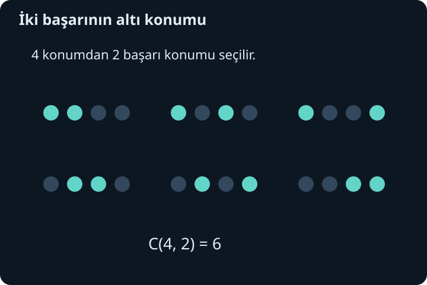
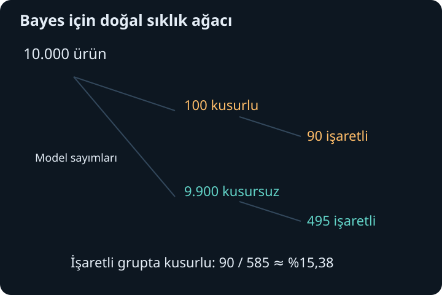

import ArticleVideo from '@/components/ArticleVideo.astro'
import kavram from './media/01-kavram.mp4?url'
import kavramPoster from './media/01-kavram.jpg?url'

Bir sonucun hangisi olacağını bilmemek, onun hakkında hiçbir şey söyleyememek demek değildir. Olasılık, belirsiz sonuçlara tutarlı sayılar atamanın dilidir. Bu sayılar bir modelin varsayımlarından, deneysel sıklıklardan veya eldeki koşullu bilgiden beslenebilir. Hesap yapabilmek için önce neyi bir sonuç saydığımızı, hangi sonuçları aynı olayda topladığımızı ve hangi bilginin verildiğini açıkça belirlemeliyiz.

[Önceki yazıda](/blog/karmasik-vektorler-hermit-ve-uniter-matrisler/) karmaşık vektörlerin normunu ve iç çarpımını kurduk. Olasılık şimdilik ayrı bir matematiksel araç olarak başlayacak; bu iki yapı daha sonra birlikte kullanılacak. Burada gereken ön bilgiler kümeler, oranlar, yüzdeler ve sonlu toplamlardır. Faktöriyel ve kombinasyonları da kullanmadan önce anlamlarıyla açıklayacağız.

## 1. Örnek uzay ve olay

Belirli bir denemenin bütün mümkün sonuçlarının kümesine **örnek uzay** denir ve $\Omega$ ile gösterilir. Adil altı yüzlü bir zar için $\Omega=\{1,2,3,4,5,6\}$ seçebiliriz. Tek bir sonuç bu kümenin elemanıdır. **Olay** ise sonuçların bir altkümesidir; örneğin çift sayı gelmesi $A=\{2,4,6\}$ olayıdır.

Örnek uzay, neyi kaydettiğimize bağlıdır. İki zar atıldığında sıralı sonuçları $(i,j)$ olarak kaydedersek 36 sonuç vardır. Yalnız toplamı kaydedersek 2 ile 12 arasındaki 11 sayı görünür. Ancak bu 11 toplam eşit olasılıklı değildir. Toplam 2 yalnız $(1,1)$ ile, toplam 7 ise altı farklı sıralı çiftle oluşur.

Bu ayrım ilk önemli korumadır: aynı listede görünmek eşit olasılıklı olmak anlamına gelmez. Bir olasılık modeli, yalnız sonuç listesini değil her olaya atanan olasılıkları da içerir. Modeli kurmadan “istenen sonuç sayısı bölü bütün sonuç sayısı” işlemini otomatik yapmayız.

## 2. Olasılığın temel kuralları

Bir $A$ olayının olasılığını $P(A)$ ile yazalım. Olasılık negatif olamaz, bütün örnek uzayın olasılığı 1'dir ve birbirinden ayrık olayların birleşiminin olasılığı toplamlarına eşittir. Sayılabilir sonsuz olay ailelerinde de bu toplama özelliği korunur; burada ağırlıkla sonlu örneklerle çalışacağız.

Ayrık olaylar ortak sonuç içermez. $A\cap B=\varnothing$ yazımı kesişimin boş olduğunu belirtir. $A\cup B$ birleşimi, $A$ veya $B$ veya ikisinin birden gerçekleştiği sonuçları içerir. $A^c$ tümleyeni, $A$ dışında kalan bütün sonuçlardır.

$A$ ile $A^c$ ayrık ve birleşimleri $\Omega$ olduğundan $P(A)+P(A^c)=1$, yani $P(A^c)=1-P(A)$ olur. Ayrıca boş olayın olasılığı 0'dır ve her olay için $0\leq P(A)\leq1$ elde edilir. Bunlar ayrı ezber kuralları değil, başlangıç ilkelerinin sonuçlarıdır.

Sonlu eşit olasılıklı bir örnek uzayda $N$ sonuç varsa her birine $1/N$ düşer. Bir olay $m$ sonuç içeriyorsa olasılığı $m/N$'dir. Zarın adil olduğu varsayımı bu özel modeli gerekçelendirir. Dengesiz bir zar için aynı sayım yapılabilir ama yüzlerin olasılıklarını ayrıca bilmek gerekir.

## 3. Model olasılığı ve gözlenen sıklık

Bir denemeyi $N$ kez yapıp $A$ olayını $N_A$ kez gözlersek göreli sıklık $N_A/N$ olur. Bu sayı veriden hesaplanır; modeldeki $P(A)$ ile aynı nesne değildir. Uygun bağımsız tekrar koşullarında çok sayıda gözlem, model olasılığına yaklaşma davranışı gösterir. Fakat her sonlu denemede tam eşitlik beklenmez.

Adil para modeli yazı olasılığını $1/2$ alır. On atışta tam beş yazı gelmek zorunda değildir. Altı veya yedi yazı, tek başına modelin yanlış olduğunu kanıtlamaz. Öte yandan uzun ve tutarlı bir sapma model varsayımını sorgulamamıza yol açabilir. Olasılık hesabı, modelin fiziksel dünyaya uygunluğunu kendiliğinden garanti etmez.

Bu ayrımı korumak önemlidir: bir formülün matematiksel olarak doğru uygulanması ile başlangıç varsayımlarının doğru olması ayrı denetimlerdir. Bir deneyde bağımsızlık veya eşitlik varsayımı yanlışsa kusursuz cebir de yanlış yoruma götürebilir. Bu yazıdaki sayısal örnekler açıkça belirtilmiş ideal modellerdir.

## 4. “Veya” derken çift saymayı düzeltmek

İki olay ortak sonuçlar içerebilir. $P(A)+P(B)$ toplandığında ortak kısım iki kez sayılır. Bir kez geri çıkarınca:

$$
P(A\cup B)=P(A)+P(B)-P(A\cap B)
$$

elde edilir. Adil zarda $A=\{2,4,6\}$ çift gelmesi, $B=\{4,5,6\}$ en az 4 gelmesi olsun. Olasılıklar $1/2$ ve $1/2$, kesişim $\{4,6\}$ olduğundan $1/3$'tür. Birleşim olasılığı $1/2+1/2-1/3=2/3$ olur.

Sonuç listesinden de kontrol edebiliriz: birleşim $\{2,4,5,6\}$ dört sonuç içerir ve $4/6=2/3$'tür. Ayrık olaylarda kesişim sıfır olduğundan basit toplama yeterlidir. Ayrık olup olmadığını söylemeden olasılıkları toplamak, örtüşen sonuçları fark etmeden çoğaltabilir.

Tümleyen yöntemi bazen saymayı kısaltır. Üç bağımsız adil para atışında “en az bir yazı” olayını doğrudan birçok durumla saymak yerine karşıtı olan “hiç yazı yok” olayını kullanabiliriz. Bu tek sıra üç tura içerir ve olasılığı $(1/2)^3=1/8$'dir. İstenen olasılık $1-1/8=7/8$ olur.

## 5. Çarpma ilkesi ve sıralı seçim

Bir seçim ilk adımda $m$ farklı, her ilk seçimden sonra ikinci adımda $n$ farklı biçimde yapılabiliyorsa toplam $mn$ sonuç vardır. Üç renk ve dört biçimden birer tane seçmek $3\cdot4=12$ farklı ikili üretir. Burada çarpma ilkesi yalnız sonuç sayar; olasılıkların çarpılması için ayrıca koşullu olasılık bilgisine ihtiyaç vardır.

Birbirinden farklı $n$ nesnenin tümünü sıralama sayısı $n!=n(n-1)\cdots1$'dir. İlk yere $n$, ikinciye $n-1$ seçenek kalır ve bu böyle sürer. $0!=1$ tanımı, boş bir sıralamanın tek biçimi olmasıyla ve formüllerin sınır durumlarıyla uyumludur.

$n$ nesneden tekrar kullanmadan sıralı $k$ seçim yaparsak sayı $n!/(n-k)!$ olur. Beş kişiden bir başkan ve farklı bir yardımcı seçmek $5\cdot4=20$ sonuç verir. Aynı iki kişinin görevleri değişirse farklı sonuç sayılır. Sıra veya görev önemliyse bu ayrımı korumalıyız.

## 6. Kombinasyon: sıranın gereksiz tekrarını çıkarmak

Beş kişiden iki kişilik bir ekip seçerken görev ayrımı olmasın. Önce sıralı 20 seçimi sayabiliriz, fakat her ekip iki farklı sırayla görünür. Bu yüzden $20/2=10$ ekip vardır. Genel olarak seçilen $k$ farklı nesnenin her kümesi $k!$ sırayla yazılabilir. Dolayısıyla:

$$
\binom nk=\frac{n!}{k!(n-k)!}
$$

ifadesi sırasız $k$ seçim sayısıdır. Buna kombinasyon sayısı veya binom katsayısı denir. $0\leq k\leq n$ ve bu sayılar tamsayıdır. Sıralı sayımdan neden $k!$ ile böldüğümüzü görmek, formülü hangi durumda kullanacağımızı belirler.

Dört para atışında tam iki yazı gelecekse yazıların bulunacağı iki konumu seçeriz. $\binom42=6$ sıra vardır. Atışlar bağımsız ve her yazı olasılığı $p$ ise bu sıraların her birinin olasılığı $p^2(1-p)^2$ olur. Toplam $6p^2(1-p)^2$'dir. Olasılıkların eşitliği, bağımsız ve aynı $p$ varsayımından gelir; yalnız altı sıra saymış olmak yetmez.

## 7. Koşul bilgisi örnek uzayı değiştirir

$B$ olayının gerçekleştiğini öğrendiğimizde artık yalnız $B$ içindeki sonuçları dikkate alırız. $P(B)>0$ olmak üzere **koşullu olasılık**:

$$
P(A\mid B)=\frac{P(A\cap B)}{P(B)}
$$

olarak tanımlanır. Dikey çizgi “B verilmişken” diye okunur. Pay ortak kısmın eski ağırlığı, payda yeni dikkate alınan bütün bölgenin ağırlığıdır. Bölme, $B$ içindeki toplam olasılığı tekrar 1 yapar.

Adil zarın çift geldiğini biliyorsak yeni sonuçlar $\{2,4,6\}$'dır. Sonucun 4'ten büyük olma olasılığı artık $1/3$'tür; yalnız 6 uygundur. Ön bilgi yokken $\{5,6\}$ olayı da $1/3$ olasılıklıdır. Bu örnekte sayı tesadüfen değişmedi. “En az 4” olayı için koşullu olasılık $2/3$, koşulsuz olasılık $1/2$ olur; bilgi etkisi görünür hale gelir.

Koşullu olasılık, olayın mutlaka zaman bakımından önce gerçekleştiği anlamına gelmez. Bir sonucun bilgisine dayanarak başka bir özellik hakkında değerlendirme yaparız. Nedensellik iddiası tanımın içinde yoktur. Bu ayrım Bayes hesabında yönü ters çevirdiğimizde özellikle önem kazanacak.

## 8. Birlikte gerçekleşme ve bağımsızlık

Koşullu tanımı düzenlersek:

$$
P(A\cap B)=P(A\mid B)P(B)
$$

elde edilir. Aynı ortak olayı ters sırayla da yazabiliriz: $P(A\cap B)=P(B\mid A)P(A)$. “Ve” olasılığında doğrudan koşulsuz olasılıkları çarpmak ancak bağımsızlık varsa geçerlidir.

$A$ ve $B$ **bağımsız** ise $P(A\cap B)=P(A)P(B)$ olur. Pozitif koşul olasılığında bu, $P(A\mid B)=P(A)$ demektir; $B$ bilgisi $A$'nın olasılığını değiştirmez. Aynı denemenin olayları da bağımsız olabilir. Adil zarda çift gelme ile 4'ten büyük gelme olaylarının kesişimi yalnız 6'dır: $1/6=(1/2)(1/3)$.

Bağımsızlık ile ayrıklık aynı değildir. Pozitif olasılıklı iki ayrık olayın ortak olasılığı sıfırdır, fakat olasılıklarının çarpımı pozitiftir; bağımsız olamazlar. Zarın çift ve tek gelmesi ayrık olaylardır. Birinin gerçekleştiğini öğrenmek diğerini olanaksız kıldığı için bilgi etkisi çok güçlüdür.

Üç veya daha çok olayda yalnız her çiftin bağımsızlığı, bütün ailenin birlikte bağımsızlığını garanti etmez. Birden çok bağımsız deneme modeli kurarken bütün gerekli ortak olasılıkların çarpım biçiminde ayrıştığını varsayarız. Buradaki para örnekleri bu tam bağımsızlık varsayımını kullanır.

## 9. Geri koymadan seçmek bağımlılık yaratır

Bir kutuda üç mavi ve iki sarı top bulunsun; toplar kendi renkleri içinde de fiziksel olarak ayrı nesnelerdir. Rastgele bir top çekip geri koymadan ikinciyi çekelim. İlk çekimin mavi olasılığı $3/5$'tir. İlk mavi geldiyse kalan dört topun ikisi mavidir; ikinci mavinin koşullu olasılığı $2/4$ olur.

İki mavi olasılığı $(3/5)(2/4)=3/10$'dur. Koşulsuz $3/5$ değerini iki kez çarpmak yanlış olurdu, çünkü ilk çekim kutunun içeriğini değiştirdi. Sırasız sayımla da $\binom32/\binom52=3/10$ buluruz. İki farklı yöntem aynı fiziksel seçim modelini saydığı için uyuşur.

Çekilen top geri konup kutu aynı şekilde karıştırılırsa ikinci çekimin modeli yeniden $3/5$ olabilir; bağımsızlık bu ideal mekanizmayla desteklenir. “Rastgele” sözcüğü tek başına bağımsızlık demek değildir. Örnekleme düzeni değişince olasılık hesabı da değişir.

## 10. Toplam olasılıkla farklı yolları birleştirmek

$B_1,\ldots,B_m$ olayları örnek uzayı ayrık parçalara ayırsın. Her sonuç tam bir parçaya aittir. $A$ olayı bu parçaların her birinde gerçekleşebilir. Ayrık katkıları toplayınca:

$$
P(A)=\sum_{j=1}^mP(A\mid B_j)P(B_j)
$$

elde edilir; koşullu terimler için ilgili $P(B_j)$ pozitif olmalıdır. Bu toplam olasılık formülüdür. Ağaç diyagramında her yol boyunca koşullu olasılıkları çarpar, aynı hedefe giden ayrık yolları toplarız.

İki üretim hattı düşünelim: örnek modelde ürünlerin yüzde 40'ı ilk, yüzde 60'ı ikinci hattan gelsin. Kusur olasılıkları sırasıyla yüzde 2 ve yüzde 5 olsun. Rastgele seçilen bir ürünün kusurlu olasılığı $0{,}40\cdot0{,}02+0{,}60\cdot0{,}05=0{,}038$, yani yüzde 3,8'dir. Basitçe yüzde 2 ile yüzde 5'in ortasını almak yanlış olur; hatların ağırlıkları eşit değildir.

Bu değerler gerçek bir işletme verisi değildir, yöntemi göstermek için seçilmiş model sayılarıdır. Bir uygulamada hangi hattın ne kadar katkı verdiği ve koşullu oranların nasıl ölçüldüğü ayrıca doğrulanmalıdır. Matematik, verilen ağırlıkları tutarlı biçimde birleştirir.

## 11. Bayes: koşulun yönünü çevirmek

Aynı ortak olayı iki biçimde yazdığımız için $P(A\mid B)P(B)=P(B\mid A)P(A)$ olur. $P(B)>0$ ise:

$$
\boxed{P(A\mid B)=\frac{P(B\mid A)P(A)}{P(B)}.}
$$

Bu Bayes bağıntısıdır. $P(A)$ başlangıç ağırlığı, $P(B\mid A)$ yeni bilginin o durumda görülme olasılığı, $P(A\mid B)$ ise bilgi sonrası ağırlıktır. Paydadaki $P(B)$, bütün mümkün yollardan gelen $B$ sonuçlarını hesaba katar.

$P(B\mid A)$ ile $P(A\mid B)$ genel olarak aynı değildir. Bir işaretin belirli durumda sık görülmesi, o işaret görüldüğünde durumun kesinlikle mevcut olduğu anlamına gelmez. Diğer durumların ne kadar yaygın olduğu ve aynı işareti ne sıklıkla ürettiği de belirleyicidir.

## 12. Taban oranını sayılarla görmek

Örnek bir kalite kontrol modelinde ürünlerin yüzde 1'i kusurlu olsun. Denetleyici kusurluların yüzde 90'ını işaretlesin; kusursuzların yüzde 5'ini de yanlışlıkla işaretlesin. $D$ kusurlu olayı, $+$ işaretlenme olayı olsun. Böylece $P(D)=0{,}01$, $P(+\mid D)=0{,}90$, $P(+\mid D^c)=0{,}05$'tir.

10.000 ürünlük varsayımsal bir sıklık tablosu kurarsak model ağırlıkları 100 kusurlu ve 9.900 kusursuz ürüne karşılık gelir. Kusurlu gruptan 90 işaretli, 10 işaretsiz; kusursuz gruptan 495 işaretli, 9.405 işaretsiz çıkar. Bunlar gözlenmiş kesin sayılar değil, olasılıkların kolay okunması için ölçeklenmiş sayılardır.

Toplam işaretli sayısı $90+495=585$ olur. İşaretli ürünler arasındaki kusurlu payı:

$$
P(D\mid+)=\frac{90}{585}=\frac2{13}\approx0{,}1538
$$

çıkar. Yani yaklaşık yüzde 15,38. Formülle aynı hesap $0{,}90\cdot0{,}01/[0{,}90\cdot0{,}01+0{,}05\cdot0{,}99]$'dur. Yüzde 90 algılama başarısı, işaretli bir ürünün yüzde 90 olasılıkla kusurlu olduğu anlamına gelmiyordu.

Kusur başlangıç oranı yüzde 10 olsaydı, aynı denetleyici özellikleriyle işaretli kusurlu ağırlık 0,09, yanlış işaret ağırlığı 0,045 olurdu. Sonuç $0{,}09/0{,}135=2/3$'e yükselirdi. Denetleyici değişmedi; taban oranı değişti. Bayes hesabının temel dersi, yeni kanıtı başlangıç sıklığından koparmamaktır.

<ArticleVideo src={kavram} poster={kavramPoster} title="Koşulla daralan örnek uzay" caption="Adil zarın çift geldiği bilindiğinde 2, 4 ve 6 kalır. Bu koşul altında 4’ten büyük sonuç yalnız 6 olduğu için olasılık 1/3 olur." />

## 13. Olasılık neyi söylemez?

Bağımsız adil para modelinde önceki beş atışın yazı olması, altıncı atışın tura olasılığını artırmaz; yine $1/2$'dir. Geçmişteki dengesizliği hemen telafi edecek bir mekanizma varsaymadık. Uzun dönem sıklık düzeni, kısa dönemde sonuçların sırayla denge kuracağı anlamına gelmez.

Olasılık 0 veya 1 ifadelerini de modelin bağlamında okumalıyız. Sonlu, her sonuca pozitif ağırlık verilen örneklerde sıfır olasılıklı olay boştur. Sürekli modellerde tek bir noktanın olasılığı sıfır olduğu halde bir değer gerçekleşir; bu ayrımı sonraki yazıda yoğunlukla açıklayacağız. Olasılık değeriyle mantıksal imkânsızlığı her bağlamda aynı tutmayacağız.

Olasılık hesabı için artık bir düzenimiz var: sonuçları açık seç, olayları tanımla, eşitlik ve bağımsızlık varsayımlarını belirt, koşulun hangi grubu daralttığını izle. Bir sonraki adımda bu sonuçlara sayısal değerler atayıp dağılım, ortalama ve yayılımı tanımlayacağız.

## Kaynaklar

- [OpenStax, Introductory Statistics 2e: Terminology](https://openstax.org/books/introductory-statistics-2e/pages/3-1-terminology)
- [OpenStax, Introductory Statistics 2e: Independent and Mutually Exclusive Events](https://openstax.org/books/introductory-statistics-2e/pages/3-2-independent-and-mutually-exclusive-events)
- [OpenStax, Introductory Statistics 2e: Two Basic Rules of Probability](https://openstax.org/books/introductory-statistics-2e/pages/3-3-two-basic-rules-of-probability)
- [MIT OpenCourseWare, Introduction to Probability and Statistics: ders materyalleri](https://ocw.mit.edu/courses/18-05-introduction-to-probability-and-statistics-spring-2022/pages/classes-reading-and-in-class-materials/)
