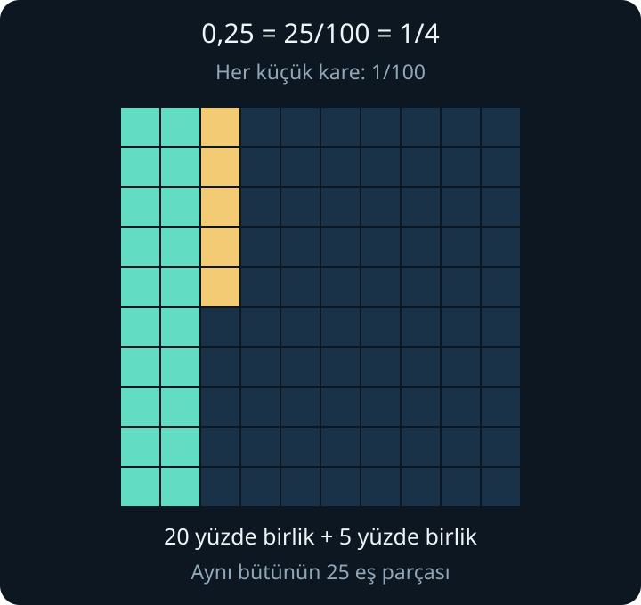
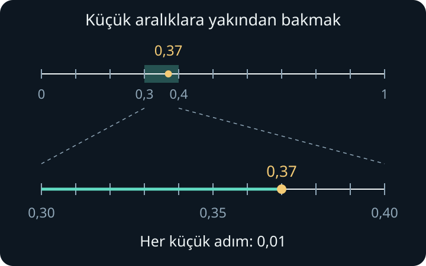
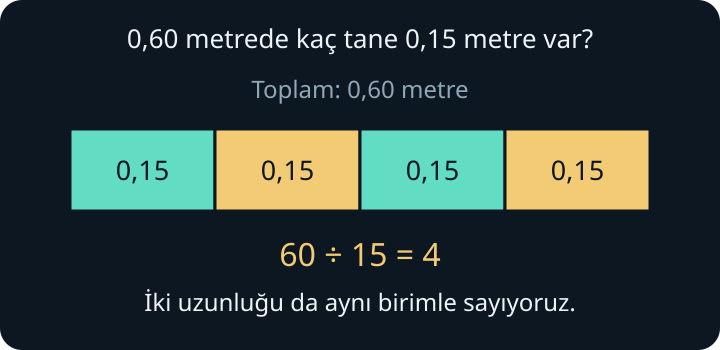

import ArticleVideo from '@/components/ArticleVideo.astro'
import ondalikYakinlasma from './media/01-ondalik-yakinlasma.mp4?url'
import ondalikYakinlasmaPoster from './media/01-ondalik-yakinlasma.jpg?url'

[Kesirler yazısında](/blog/kesirler-bir-butunu-bolmek/) bir bütünü eş parçalara ayırmış, parçaları farklı biçimlerde sayarak dört işlemi kurmuştuk. Şimdi aynı bütünü elimize alalım. Bir kişi uzunluğun dörtte birini gösterip “$\frac{1}{4}$” diyor. Bir başkası aynı uzunluk için “$0{,}25$” yazıyor. İkisi nasıl aynı miktarı anlatıyor?

Bu sorunun cevabı virgülün kendisinde değil, virgülün iki yanındaki **basamakların hangi büyüklükte parçaları saydığında** yatıyor. Ondalık gösterimi bu parçalarla kuracağız. Sonra karşılaştırmayı, dört işlemi ve bir sayıyı neden bazen yaklaşık olarak yazdığımızı ele alacağız.

Önceki yazıdaki denk kesirleri, dört işlemin anlamını ve sayı doğrusunu kullanacağız. Virgüllü yazım, devir çizgisi ve yaklaşık eşitlik işaretiyle burada tanışacağız.

## 1. Bir Bütünü Hep Onar Parçaya Ayırmak

Bir şeridin tamamını 1 kabul edelim. On eş parçaya bölersek her parça $\frac{1}{10}$ olur. Bu parçaların her birini yeniden on eş parçaya böldüğümüzde, bütün şeritte yüz küçük parça bulunur. Her biri $\frac{1}{100}$'dür. Bir kez daha aynı şeyi yaparsak bin parça elde ederiz.

Ondalık gösterim, bu parçalar için basamaklar ayırır:

| Parçanın adı | Kesir olarak | Ondalık gösterimi |
| --- | --- | --- |
| Onda bir | $\frac{1}{10}$ | $0{,}1$ |
| Yüzde bir | $\frac{1}{100}$ | $0{,}01$ |
| Binde bir | $\frac{1}{1000}$ | $0{,}001$ |

Buradaki “yüzde bir”, bütünün yüz eş parçasından birinin adıdır. Yüzde işaretiyle hesap yapmayı bir sonraki ana konuda ele alacağız.

Bir onda birlik parçanın içinde on yüzde birlik parça vardır:

$$
\frac{1}{10}=\frac{10}{100}
$$

Dolayısıyla iki onda birlik parça, yirmi yüzde birlik parçadır. Yanına beş yüzde birlik parça daha koyalım:

$$
\frac{2}{10}+\frac{5}{100}
=\frac{20}{100}+\frac{5}{100}
=\frac{25}{100}
$$

İşte $0{,}25$ bu miktarı anlatır: **iki onda bir ve beş yüzde bir**. Yirmi beş yüzde birlik parça dediğimizde de aynı miktarı söylemiş oluruz. Kesri sadeleştirirsek başlangıçtaki soruya ulaşırız:

$$
0{,}25=\frac{25}{100}=\frac{1}{4}
$$

Bu yazıda ondalık ayıracı olarak virgül kullanıyoruz. Bazı kitaplarda ve hesap makinelerinde aynı sayı `0.25` biçiminde, noktayla gösterilir. Burada virgülün sağındaki ilk rakam onda birlikleri, ikincisi yüzde birlikleri, üçüncüsü binde birlikleri sayar.

## 2. Basamak Değeri ve Sıfırın Görevi

$24$ sayısındaki 2, iki onluğu; 4, dört birliği anlatır. Bir basamak sağa geçtiğimizde saydığımız birimin büyüklüğü onda bire iner. Aynı düzen virgülden sonra da sürer.

Örneğin $2{,}307$ sayısını açalım:

| Basamak | Rakam | Sayıya katkısı |
| --- | --- | --- |
| Birler | 2 | $2$ |
| Onda birler | 3 | $\frac{3}{10}$ |
| Yüzde birler | 0 | $\frac{0}{100}$ |
| Binde birler | 7 | $\frac{7}{1000}$ |

$$
2{,}307=2+\frac{3}{10}+\frac{0}{100}+\frac{7}{1000}
$$

Üç onda bir, üç yüz binde birlik parçadır. Yedi binde birlik parçayı da ekleyince virgülün sağındaki kısmın toplamı $\frac{307}{1000}$ olur. Bu nedenle sayı “iki tam binde üç yüz yedi” diye okunabilir. “İki virgül üç sıfır yedi” demek rakamları aktarır; basamak adları ise büyüklüklerini de açık eder.

Ortadaki sıfırı silip $2{,}37$ yazarsak 7 artık binde birleri değil, yüzde birleri sayar. Sayıyı değiştirmiş oluruz.

### Hangi sıfırlar değeri değiştirmez?

Virgülden sonraki bölümün **en sağına** sıfır eklemek, daha küçük basamakta sıfır tane parça bulunduğunu söyler:

$$
0{,}4=\frac{4}{10}=\frac{40}{100}=0{,}40
$$

Bu yüzden $0{,}4$, $0{,}40$ ve $0{,}400$ aynı sayıdır. Buna karşılık $0{,}04$, dört yüzde birlik parçadır; $0{,}4$'ün onda biri kadardır. Sıfırın yeri önemlidir.

Tam sayılar da aynı gösterime uyar: $3=3{,}0=3{,}00$. Ancak tam sayının sağına virgül koymadan sıfır eklemek başka bir işlemdir: $30$, $3$'ün on katıdır.

### Ondalık gösterimden kesre dönmek

Son basamağın büyüklüğü, bütün sayıyı hangi parçalarla sayabileceğimizi gösterir:

$$
0{,}048=\frac{48}{1000}=\frac{6}{125}
$$

Virgülden sonra üç basamak olduğu için binde birlik parçaları saydık. Başta görünen sıfırları sayısal değeri değiştirmeden kaldırınca pay 48 oldu. Sadeleştirmede payı ve paydayı 8'e böldük.

Birden büyük bir örnekte de aynı düşünce geçerlidir:

$$
2{,}35=\frac{235}{100}=\frac{47}{20}
$$

Çünkü iki bütün, iki yüz yüzde birlik parçadır; kalan otuz beş parçayla toplam iki yüz otuz beş parça eder. Virgülü kaldırıp bir pay yazmak, bu sayma işleminin kısa yoludur.

## 3. Sayı Doğrusunda Yer Bulmak ve Karşılaştırmak

Sayı doğrusunda 0 ile 1 arasını on eş aralığa bölelim. Her adım $0{,}1$ olur. $0{,}3$ ile $0{,}4$ arasını da on eş aralığa bölersek bu yeni adımların her biri $0{,}01$'dir.

$0{,}37$'ye ulaşmak için önce sıfırdan üç onda birlik adım, ardından yedi yüzde birlik adım gideriz. Sayı $0{,}3$ ile $0{,}4$ arasındadır; ikincisine daha yakındır. Çizimi büyütmemiz sayının değerini değiştirmez, yalnızca küçük aralıkları görmemizi kolaylaştırır.

Şimdi $0{,}8$ ile $0{,}75$'i karşılaştıralım. Virgülün sağında 75'in 8'den büyük görünmesi yanıltıcı olabilir: İlk sayı onda birlikleri, ikinci sayı yüzde birlikleri sayıyor. İkisini aynı parçalarla yazalım:

$$
0{,}8=0{,}80=\frac{80}{100},
\qquad 0{,}75=\frac{75}{100}
$$

Seksen parça, yetmiş beş parçadan fazladır. Yani $0{,}8>0{,}75$. Ondalık basamak sayısının fazla olması, sayının büyük olması anlamına gelmez.

Pozitif sayıları karşılaştırırken önce tam kısımlarına bakarız. Bunlar eşitse onda birler, sonra yüzde birler, sonra diğer basamaklar gelir. Örneğin $1{,}406<1{,}46$; ikinci sayıyı $1{,}460$ yazdığımızda fark açıkça görünür.

Negatif sayılarda sayı doğrusunu hatırlamak gerekir. $-0{,}8$, $-0{,}75$'ten daha soldadır; bu yüzden $-0{,}8<-0{,}75$. Sıfıra uzaklığı daha büyük olduğu hâlde sayı olarak daha küçüktür.

## 4. Toplama ve Çıkarma: Virgüller Neden Hizalanır?

$2{,}7$ metre uzunluğundaki bir şeride $0{,}46$ metre ekleyelim. Yedi onda birlik parça, yetmiş yüzde birlik parçadır. İki uzunluğu yüzde birlik metrelerle yazarsak:

$$
2{,}70+0{,}46
=\frac{270}{100}+\frac{46}{100}
=\frac{316}{100}=3{,}16
$$

Alt alta toplamada virgülleri hizalamamızın nedeni de budur: **Birliklerin altına birlikleri, onda birliklerin altına onda birlikleri koyarız.**

$$
\begin{array}{r}
2{,}70\\
+\;0{,}46\\
\hline
3{,}16
\end{array}
$$

Yüzde birler basamağında $0+6=6$ bulunur. Onda birlerde $7+4=11$ olur. On onda birlik parça bir bütün ettiği için bu 11 parçanın 10'unu birler basamağına aktarırız; onda birlerde 1 kalır. Birler basamağındaki $2+0$ toplamına aktardığımız 1 de eklenince 3 elde edilir. “Elde var bir” dediğimiz şey, daha büyük bir parçaya dönüştürmedir.

Çıkarmada bu dönüşümü ters yönde kullanabiliriz. $3{,}20-0{,}47$ işleminde 0 yüzde birlik parçadan 7 yüzde birlik parça çıkaramayız. Bir onda birlik parçayı on yüzde birlik parçaya ayıralım. Sayımız artık 3 birlik, 1 onda birlik ve 10 yüzde birlik parçayla temsil edilir.

Bu kez 1 onda birlik parçadan 4 onda birlik parça çıkarmamız gerekiyor. Bir bütünün on onda birlik parçasını da açalım. **2 birlik, 11 onda birlik ve 10 yüzde birlik** parça elde ederiz. Toplam miktar hâlâ $3{,}20$'dir.

Artık her basamakta çıkarabiliriz: yüzde birlerde $10-7=3$, onda birlerde $11-4=7$, birlerde $2-0=2$. Sonuç $2{,}73$ olur. Kesirlerle kontrolü de aynı sonucu verir:

$$
3{,}20-0{,}47
=\frac{320-47}{100}
=\frac{273}{100}=2{,}73
$$

İşaretli sayılarda da parçalar değişmez. Örneğin $-0{,}6+0{,}25=-0{,}35$: sıfırın solunda altmış yüzde birlik uzaklıktan başlayıp yirmi beş yüzde birlik adım sağa gideriz.

## 5. Çarpma: Virgülün Yerini Parçalar Belirler

Önce onla çarpmayı düşünelim. Otuz yedi yüzde birlik parçanın on katı, üç yüz yetmiş yüzde birlik parçadır:

$$
0{,}37\times10=\frac{370}{100}=3{,}7
$$

Her rakamın temsil ettiği değer on katına çıkar. Onla bölünce de onda birine iner: $3{,}7\div10=0{,}37$. Yüzle çarpmak, arka arkaya iki kez onla çarpmaktır; bu yüzden $0{,}37\times100=37$.

“Virgülü kaydırmak” bu değişimin yazımdaki sonucudur. Nedenini bildiğimizde $0{,}037\times10=0{,}37$ gibi sıfırlı örnekler de aynı kurala uyar.

### İki ondalık sayıyı çarpmak

$1{,}2$ metrelik bir uzunluğun $0{,}3$ kadarını, yani onda üçünü alalım. İki sayıyı kesre çevirdiğimizde:

$$
1{,}2\times0{,}3
=\frac{12}{10}\times\frac{3}{10}
=\frac{36}{100}=0{,}36
$$

On ikiyi üçle çarpıp 36 bulduk; fakat sonuç 36 bütün değildir. Paydada $10\times10=100$ olduğundan **36 yüzde birlik parça**dır.

Sonlu ondalık gösterimlerle çarpma yaparken iki çarpanın virgül sonrası basamak sayılarını toplamamızın nedeni bu payda çarpımıdır. Bir basamak ile bir basamak, iki basamaklık bir ölçek verir. İki basamak ile bir basamakta ise payda $100\times10=1000$ olur:

$$
0{,}04\times0{,}2
=\frac{4}{100}\times\frac{2}{10}
=\frac{8}{1000}=0{,}008
$$

Sekiz, binde birler basamağına gelmelidir. Önündeki iki sıfırı bu nedenle yazarız. Önce basamakları doğru yerleştirir, sonra varsa en sağdaki gereksiz sıfırları kaldırırız.

İlk örnekte pozitif bir uzunluğun onda üçünü aldık; sonuç başlangıçtan küçük olmalıydı. $0{,}36$ bu beklentiye uyar. Çarpma her zaman büyütmez: Sıfır ile bir arasındaki pozitif bir çarpan, pozitif miktarın bir bölümünü alır.

İşaret kuralları da kesirlerdekiyle aynıdır. Örneğin $(-0{,}4)\times(-0{,}3)=0{,}12$; iki negatif çarpanın çarpımı pozitiftir.

## 6. Bölme: İki Sayıyı Birlikte Ölçeklemek

$0{,}60$ metre uzunluğundaki bir şeritten $0{,}15$ metrelik kaç parça çıkar? Her iki uzunluğu da yüzde birlik metrelerle sayarsak soru 60 parçanın içinde 15 parçalık kaç grup bulunduğuna dönüşür:

$$
0{,}60\div0{,}15=60\div15=4
$$

Burada bölüneni de böleni de 100 ile çarptık. İkisinin içinde kaç grup bulunduğu değişmedi. Kesir çizgisinin bölme anlamını kullanarak bunu yazabiliriz:

$$
\frac{0{,}60}{0{,}15}
=\frac{0{,}60\times100}{0{,}15\times100}
=\frac{60}{15}
$$

Bu, denk kesir oluştururken payla paydayı aynı sıfırdan farklı sayıyla çarpmanın bir uygulamasıdır. Yalnızca birini değiştirirsek aynı bölme işlemini korumayız.

Pratikte böleni tam sayı yapacak kadar onla çarparız; bölünene de aynı işlemi uygularız. Bölen $0{,}5$ olduğunda tek kez onla çarpmak yeterlidir:

$$
1{,}25\div0{,}5
=12{,}5\div5=2{,}5
$$

Son adımı parçalara ayırabiliriz: $12{,}5$, 125 onda birlik parçadır. Beşe paylaştırıldığında her gruba 25 onda birlik parça, yani $2{,}5$ düşer. Ters işlemle kontrol edersek $2{,}5\times0{,}5=1{,}25$ elde ederiz.

Bölüm tam sayı olmak zorunda değildir. Ayrıca pozitif bir sayıyı sıfır ile bir arasındaki pozitif bir sayıya bölmek, onu büyütebilir; küçük gruplardan daha çok bulunur. Sıfırla ilgili koşul ise aynen kalır: $0\div0{,}5=0$, ama $0{,}5\div0$ tanımsızdır. İşaretli bir örnekte $-0{,}60\div0{,}15=-4$ olur.

## 7. Kesirden Ondalık Gösterime: Bölmeye Devam Etmek

$\frac{1}{4}$'ü yüz parçalı bir gösterime genişleterek $0{,}25$ bulmuştuk. Bazen uygun paydayı hemen göremeyiz. O zaman kesrin zaten bir bölme işlemi söylediğini kullanırız.

$\frac{3}{8}$ için üç bütünü sekiz kişiye eşit paylaştıralım. Herkese bir bütün düşmez. Bütünleri daha küçük parçalara ayırarak devam ederiz:

| Saydığımız parçalar | Sekize paylaşma | Her kişinin aldığı | Kalan |
| --- | --- | --- | --- |
| 30 onda birlik | $30=8\times3+6$ | 3 onda birlik | 6 onda birlik |
| 60 yüzde birlik | $60=8\times7+4$ | 7 yüzde birlik | 4 yüzde birlik |
| 40 binde birlik | $40=8\times5$ | 5 binde birlik | 0 |

İlk satırda üç bütünü 30 onda birlik parçaya çevirdik. Sonraki satırlarda yalnızca **kalanı** bir alt basamağın parçalarına ayırdık. Herkesin aldığı parçaları birleştirelim:

$$
\frac{3}{8}
=\frac{3}{10}+\frac{7}{100}+\frac{5}{1000}
=0{,}375
$$

Kalan sıfır olduğu için işlem bitti. $8\times0{,}375=3$ eşitliği, bütün miktarın paylaştırıldığını doğrular.

Bazen bir basamakta hiç parça veremeyiz. Bir bütünü yirmiye bölerken 10 onda birlik parçanın her biri yirmi kişiye yetmez; herkes için onda birler basamağına 0 yazarız. Yüzde birliklere geçtiğimizde 100 parça olur ve her kişiye 5 parça düşer. Böylece $\frac{1}{20}=0{,}05$ elde edilir. Aradaki sıfır, yüzde birlikleri yanlışlıkla onda birlikler diye okumamızı önler.

### Kalan hiç sıfır olmazsa

Bir bütünü üçe paylaştıralım. On onda birlik parçadan herkese 3 tane veririz, 1 onda birlik parça kalır. Bu kalanı on yüzde birlik parçaya ayırırız; yine herkese 3 tane düşer ve 1 yüzde birlik parça kalır. Aynı durum her basamakta tekrarlanır:

$$
\frac{1}{3}=0{,}333\ldots=0{,}\overline{3}
$$

Üç nokta burada 3 rakamının sonu gelmeden devam ettiğini belirtir. Üstteki çizgi de tekrar eden rakamı gösterir. Buna **devirli ondalık gösterim** denir.

Tekrar hemen başlamayabilir: $\frac{1}{6}=0{,}1666\ldots=0{,}1\overline{6}$. Birden fazla rakam da birlikte tekrarlanabilir: $\frac{3}{11}=0{,}272727\ldots=0{,}\overline{27}$. Çizginin altında hangi rakamlar varsa tekrar eden bölüm onlardır.

Pozitif tam sayıları birbirine bölerken, kalan bölenden küçüktür. Örneğin 8'e bölmede kalan yalnızca 0, 1, 2, 3, 4, 5, 6 veya 7 olabilir. Kalan sıfır olursa ondalık yazım biter. Sıfır olmadan devam ederse, sınırlı sayıdaki kalandan biri sonunda yeniden karşımıza çıkar. Aynı kalanla aynı işlemi yaptığımız için sonraki rakamlar da tekrar eder. Sayının başına eksi işareti koymak bu basamak düzenini değiştirmez. **Tam sayıların, paydası sıfır olmayan bir kesriyle yazılan sayılar bu nedenle sonlu veya devirli ondalık gösterime sahiptir.**

### Devirli gösterimden kesre geri dönmek

$0{,}\overline{27}$ sayısını bir kesir olarak nasıl bulabiliriz? Tekrar eden bölüm iki basamaklıdır. Sayıyı 100 ile çarptığımızda virgülden sonra yine aynı tekrar kalır:

$$
100\times0{,}\overline{27}=27{,}\overline{27}
$$

Şimdi bu sonuçtan başlangıçtaki sayıyı çıkaralım. İkisinin virgülden sonraki kısmı tam olarak aynıdır; fark 27 olur. Bir sayının 100 katından kendisini çıkarınca 99 katı kalır. Demek ki bu sayının 99 katı 27'dir. Sayının kendisini bulmak için 27'yi 99'a böleriz:

$$
0{,}\overline{27}=\frac{27}{99}=\frac{3}{11}
$$

Burada iki basamak yazıp durmadık. Devir çizgisi, bütün tekrarı temsil ediyor. Yalnızca $0{,}27$ yazsaydık $\frac{27}{100}$ demiş olurduk; bu başka bir sayıdır.

Devirli bir gösterim de tam bir değeri anlatabilir. $0{,}\overline{3}$ tam olarak üçte birdir; fakat $0{,}33$ tam olarak üçte bir değildir. Bu fark bizi yaklaşık değerlere götürüyor.

## 8. Eşitlikten Yaklaşık Değere

İki basamakta durup $\frac{1}{3}$ yerine $0{,}33$ yazdığımızda bir miktarı dışarıda bırakırız:

$$
\frac{1}{3}-0{,}33
=\frac{1}{3}-\frac{33}{100}
=\frac{1}{300}
$$

Aradaki fark küçük olabilir, ama sıfır değildir. Bu nedenle burada eşitlik yerine **yaklaşık eşitlik** işaretini kullanırız:

$$
\frac{1}{3}\approx0{,}33
$$

$\approx$ işareti “yaklaşık olarak eşittir” diye okunur. Hangi basamağa kadar yaklaştığımızı söylemek de önemlidir. Aynı sayıyı onda birlere göre $0{,}3$, yüzde birlere göre $0{,}33$, binde birlere göre $0{,}333$ ile temsil edebiliriz.

Öte yandan $\frac{1}{4}=0{,}25$ tam bir eşitliktir. Virgüllü yazılmış olması bir sayıyı kendiliğinden yaklaşık yapmaz. Tamlık, yazının biçimine değil, temsil ettiği değerle ilişkisine bağlıdır.

### Yuvarlamak, en yakın basamağı seçmektir

$0{,}37$'yi onda birlere yuvarlayalım. Onu çevreleyen iki onda birlik değer $0{,}3$ ve $0{,}4$'tür. Uzaklıklarını hesaplayalım:

$$
0{,}37-0{,}30=0{,}07
$$

$$
0{,}40-0{,}37=0{,}03
$$

$0{,}4$ daha yakındır. Bu yüzden onda birlere yuvarladığımızda $0{,}37\approx0{,}4$ yazarız. Sayı doğrusundaki asıl nokta $0{,}37$'de kalır; onu anlatmak için daha kaba aralıklı bir gösterim seçmiş oluruz.

<ArticleVideo
  src={ondalikYakinlasma}
  poster={ondalikYakinlasmaPoster}
  title="Ondalık sayı doğrusunda yakınlaşma ve yuvarlama"
  caption="0,3 ile 0,4 arasını büyütüp yüzde birlik adımları görüyoruz. 0,37'den 0,4'e uzaklık 0,03; 0,3'e uzaklık 0,07. Onda birlere yuvarlarken en yakın değeri, 0,4'ü seçiyoruz."
/>

İki adayın tam ortası $0{,}35$'tir. Onun altındaki sayılar $0{,}3$'e, üstündekiler $0{,}4$'e daha yakındır. Tam ortada uzaklıklar eşittir; o zaman ayrıca bir seçim kuralı gerekir. Bu yazıda eşit uzaklıkta **sıfırdan daha uzak olanı seçiyoruz**: $0{,}35$ onda birlere $0{,}4$, $-0{,}35$ ise $-0{,}4$ olarak yuvarlanır. Başka bağlamlarda, örneğin bazı yazılımlarda, eşitlik için farklı kurallar kullanılabilir.

Pozitif sayılarda bu geometrik düşünce, bildiğimiz basamak kuralını verir: Korunacak basamağın hemen sağındaki rakam 0, 1, 2, 3 veya 4 ise korunacak rakam aynı kalır; 5, 6, 7, 8 veya 9 ise bir artırılır. Ardındaki basamaklar bırakılır. Örneğin $2{,}746$ yüzde birlere yuvarlandığında $2{,}75$ olur; binde birler basamağındaki 6, sayının $2{,}75$'e daha yakın olduğunu söyler.

Artırma bazen önceki basamağa da taşar: $2{,}998$ yüzde birlere yuvarlandığında $3{,}00$ olur. En sağdaki 8 yüzünden yüzde birler basamağındaki 9 artar; oluşan aktarım onda birler ve birler basamağına kadar ilerler. Buradaki iki sıfır, sonucun hangi basamağa göre yazıldığını görünür tutar.

### Kesip bırakmak ile yuvarlamak aynı işlem değildir

$0{,}379$ sayısının yüzde birlerden sonrasını yalnızca kesersek $0{,}37$ kalır. En yakın yüzde birliğe yuvarlarsak $0{,}38$ elde ederiz. İlkinde rakamları bıraktık; ikincisinde hangi adayın daha yakın olduğuna baktık.

Yuvarlama farkını da uzaklık olarak düşünebiliriz. En yakın onda birliğe yuvarlamada adaylar $0{,}1$ aralıklıdır. Her noktanın en yakın adaya uzaklığı bu aralığın yarısını, yani $0{,}05$'i aşmaz. En yakın yüzde birliğe yuvarlamada bu sınır $0{,}005$ olur. Bunlar **yalnızca yuvarlamanın getirdiği farkın** sınırlarıdır; bir ölçüm cihazının yanılgısını açıklamaz.

## 9. Hesabın Sonunda Yuvarlamak

Bir ipi altı parçadan birleştireceğimizi ve her parçanın uzunluğunu matematiksel olarak tam $\frac{1}{3}$ metre kabul ettiğimizi düşünelim. Toplam uzunluk:

$$
6\times\frac{1}{3}=2\ \text{metre}
$$

Her parçayı daha baştan $0{,}33$ metreye yuvarlayıp toplarsak:

$$
6\times0{,}33=1{,}98\ \text{metre}
$$

İki sonuç arasında $0{,}02$ metre fark oluştu. Bir metrenin 100 santimetre olduğunu kullanırsak bu 2 santimetredir. Her parçada küçük görünen eksikliği altı kez topladık.

Tam değerleri biliyorsak kesirleri veya yeterli basamak sayısını işlem boyunca koruyup gereken yuvarlamayı sonuçta yapmak, bu tür birikmeleri azaltır. Yaklaşık sayılarla başladığımızda ise hesap makinesinin daha çok rakam göstermesi, başlangıç bilgisini kendiliğinden daha doğru yapmaz.

Bir hesabın büyüklüğünü önceden tahmin etmek de yararlıdır. $4{,}8\times2{,}1$ için yaklaşık $5\times2=10$ bekleriz. Tam çarpım $10{,}08$'dir. Sonucu $100{,}8$ bulsaydık, bu tahmin virgülün yerini yeniden incelememiz gerektiğini söylerdi. Tahmin kontrol sağlar; tam hesabın veya gerekçesinin yerine geçmez.

Bir miktarı dörtte bir diye söylemekle $0{,}25$ diye yazmak aynı sayıya iki yoldan ulaşmamızı sağladı. Fakat miktarı başka bir miktarla karşılaştırdığımızda yeni bir soru doğacak: “Neyin ne kadarı?” Bir sonraki yazıda **oran, orantı ve yüzdeyi** bu sorunun çevresinde birlikte kuracağız.

## Kaynakça

Örnekler, şekiller, Manim animasyonu ve Türkçe anlatım bu yazı için hazırlanmıştır. Standart tanımlar ve işlem kuralları için açık erişimli başvuru bölümleri:

- [OpenStax — Prealgebra 2e, 5.1: Decimals](https://openstax.org/books/prealgebra-2e/pages/5-1-decimals). Basamak değeri, kesre dönüşüm, sayı doğrusu, karşılaştırma ve yuvarlama.
- [OpenStax — Prealgebra 2e, 5.2: Decimal Operations](https://openstax.org/books/prealgebra-2e/pages/5-2-decimal-operations). Ondalık gösterimlerle dört işlem ve bölmede iki sayıyı birlikte ölçekleme.
- [OpenStax — Prealgebra 2e, 5.3: Decimals and Fractions](https://openstax.org/books/prealgebra-2e/pages/5-3-decimals-and-fractions). Kesirleri bölmeyle ondalık gösterime çevirme ve devirli gösterimler.

Kaynaklar 30 Eylül 2026 tarihinde kontrol edildi.
