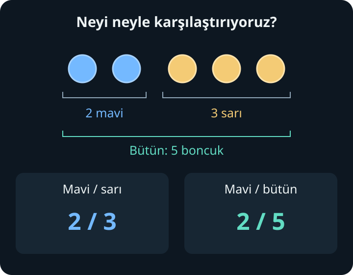
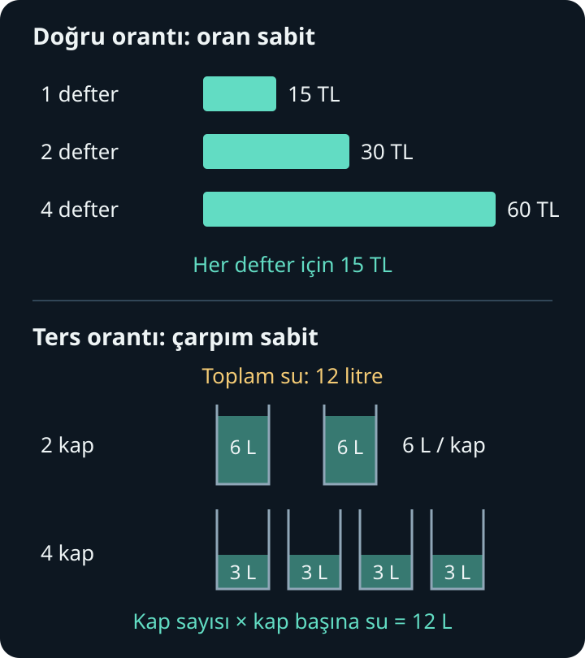
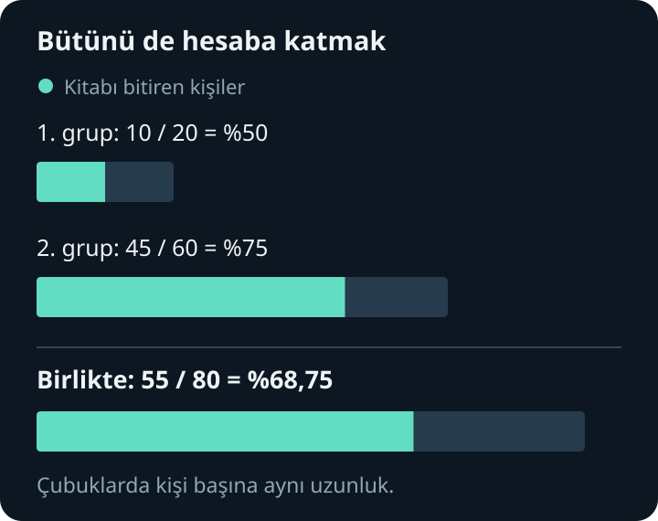

import ArticleVideo from '@/components/ArticleVideo.astro'
import degisenButun from './media/01-degisen-butun.mp4?url'
import degisenButunPoster from './media/01-degisen-butun.jpg?url'

Masada iki mavi, üç sarı boncuk var. “Mavi boncuklar ne kadar?” diye sorarsak “iki tane” cevabını alırız. Ama “Maviler, sarıların ne kadarı?” ve “Maviler, bütün boncukların ne kadarı?” aynı soru değildir. Birinde üç boncukla, diğerinde beş boncukla karşılaştırma yaparız.

**Bir miktarın ne kadar olduğunu söylemek için bazen onu neyle karşılaştırdığımızı da söylememiz gerekir.** Oran, orantı ve yüzde bu karşılaştırmayı düzenler. Bir karışımı aynı özellikte çoğaltırken, farklı boydaki paketleri karşılaştırırken ve bir değişimi yüzdeyle anlatırken aynı düşünceyi kullanırız.

[Kesirler yazısında](/blog/kesirler-bir-butunu-bolmek/) bölmenin ve bir miktarın parçasını almanın anlamını kurmuştuk. [Ondalık gösterim yazısında](/blog/ondalik-gosterim-ve-yaklasik-degerler/) aynı sayıları virgüllü biçimde yazmayı öğrendik. Burada o bilgilerin üzerine çıkacağız. Henüz harflerle denklem çözmeyi bildiğimizi varsaymadan, bütün hesapları sayılarla ve miktarlarla açıklayacağız.

## 1. Oran: Hangi Miktarı Hangisiyle Karşılaştırıyoruz?

Mavi boncuk sayısını sarı boncuk sayısına bölelim:

$$
\frac{\text{mavi sayısı}}{\text{sarı sayısı}}=\frac{2}{3}
$$

Bu, **mavilerin sarılara oranıdır**. “İkinin üçe oranı” diye okunur; $2:3$ biçiminde de yazılır. Buradaki iki nokta oran gösterimidir. Kesir çizgisiyle yazınca oranı bir bölme işlemi olarak hesaplayabildiğimiz de görünür.

Sarıların sayısını bir karşılaştırma birimi kabul edersek, mavilerin sayısı bunun üçte ikisidir. Boncukları fiziksel olarak üçe bölmedik; **sayılarını karşılaştırdık**. Bu yüzden kesir, yalnızca kesilmiş bir pastayı anlatmakla sınırlı değildir.

Karşılaştırmanın sırasını değiştirelim:

$$
\frac{\text{sarı sayısı}}{\text{mavi sayısı}}=\frac{3}{2}=1{,}5
$$

Sarı boncuk sayısı, mavi boncuk sayısının bir buçuk katıdır. $2:3$ ile $3:2$ farklı şeyler söyler. “Mavilerin sarılara oranı” ifadesindeki sıra, kesrin payında ve paydasında korunur.

### Bir parçayı başka parçayla mı, bütünle mi karşılaştırıyoruz?

Toplam boncuk sayısı $2+3=5$ olduğuna göre mavilerin **bütün boncuklara** oranı şöyledir:

$$
\frac{\text{mavi sayısı}}{\text{toplam sayı}}=\frac{2}{5}
$$

İlk karşılaştırmada payda 3, şimdi 5 oldu. Mavi boncuklar değişmedi; referans aldığımız miktar değişti.

Bu ayrım ileride yüzde hesabında da belirleyici olacak. “Mavilerin sarılara oranı $2:3$” demek, mavilerin bütünün üçte ikisi olduğu anlamına gelmez. Bütün, iki mavi pay ile üç sarı payın toplamı olan **beş paydan** oluşur.

Bölme işleminden bildiğimiz sınırlama burada da geçerlidir: Referans miktar sıfırsa, ona bölerek sayısal bir oran hesaplayamayız. Buna karşılık sıfır mavi ve üç sarı boncuk varsa mavilerin sarılara oranı $0/3=0$ olur.

## 2. Miktar Değişirken Oranı Korumak

Aynı boncuk düzeninden iki tane yan yana koyalım. Dört mavi, altı sarı boncuğumuz olur. Üç düzen yaparsak altı mavi, dokuz sarı boncuk elde ederiz:

$$
\frac{2}{3}=\frac{4}{6}=\frac{6}{9}
$$

Bunlar önceki yazılardan tanıdığımız denk kesirlerdir. İki miktarı **aynı pozitif sayıyla çarptığımızda** karşılaştırma değişmez. Boncukların sayısı artar, renklerin birbirine oranı aynı kalır.

Bu kez iki renge de birer boncuk ekleyelim. Üç mavi ve dört sarı boncuk olur. $3/4$ ile $2/3$ eşit değildir: On iki ortak parçayla yazarsak biri $9/12$, diğeri $8/12$ olur. İki miktara aynı sayıyı eklemek, oranı genel olarak korumaz.

Bu farkı günlük bir örnekte de görebiliriz. İki ölçek meyve suyu ile üç ölçek su içeren bir karışımı aynı oranla çoğaltmak için her iki miktarı da iki katına çıkarabiliriz. Dört ölçek meyve suyu ve altı ölçek su kullanırız. Her birine bir ölçek ekleyip üç ve dört yapmak ise meyve suyunun karışımdaki payını değiştirir. Burada bütün ölçeklerin aynı hacimde olduğunu kabul ediyoruz.

### Toplamı belli bir miktarı orana göre paylaşmak

Yirmi boncuğu, mavi sayısının sarı sayısına oranı $2:3$ olacak şekilde ayıralım. Oran bize “iki eş pay mavi, üç eş pay sarı” diyor. Toplam beş eş pay var:

$$
20\div5=4
$$

Her pay dört boncuk olduğuna göre mavi bölüm $2\times4=8$, sarı bölüm $3\times4=12$ boncuk olur. Kontrol edelim: $8+12=20$ ve $8/12=2/3$.

Burada toplamı 3'e bölmedik. Çünkü 3, yalnızca sarı bölümün pay sayısıydı. Bütünün pay sayısı $2+3=5$.

Aynı düşünce bir çizimi büyütürken de karşımıza çıkar. Uzunlukları iki katına çıkardığımızda uzunluk oranları korunur. Fakat alanlar aynı oranda büyümez: Kenarı iki katına çıkan bir kare, eskisinden dört tane kareyi içine alır. **Oran kurmadan önce karşılaştırdığımız şeyin uzunluk mu, alan mı olduğunu belirlemeliyiz.**

## 3. Birimler: 30'u 1,2'ye Bölmek Yeterli mi?

30 santimetrelik bir şeridi, $1{,}2$ metrelik başka bir şeritle karşılaştıralım. Doğrudan $30\div1{,}2=25$ bulursak kısa şeridin uzun şeridin 25 katı olduğunu söylemiş oluruz. Sayıları doğru böldüğümüz hâlde miktarları yanlış karşılaştırdık.

Nedeni, bir sayının santimetreleri, diğerinin metreleri saymasıdır. **Aynı türden iki büyüklüğü karşılaştırırken önce aynı birimle yazmalıyız.** Bir metre 100 santimetre olduğu için:

$$
1{,}2\ \text{m}=120\ \text{cm}
$$

Artık oranı kurabiliriz:

$$
\frac{30\ \text{cm}}{120\ \text{cm}}=\frac{1}{4}
$$

Kısa şerit, uzun şeridin dörtte biridir. Metreyle çalışsak da aynı sonuca ulaşırız: $0{,}30/1{,}2=0{,}25=1/4$. İki uzunluğu aynı birimde yazdığımızda oran, seçtiğimiz uzunluk birimine bağlı kalmaz.

Birim dönüştürmek miktarı değiştirmez; aynı miktarı başka büyüklükte parçalarla saymaktır. Birimi küçültünce sayımız büyüyebilir. Bir metreyi santimetreyle yazınca 100 sayısını kullanmamız, şeridin uzadığı anlamına gelmez.

### Farklı türden miktarlar: birim başına değer

Bazen karşılaştırdığımız miktarlar aynı türden değildir. Bir araç üç saatte 180 kilometre yol alsın:

$$
\frac{180\ \text{km}}{3\ \text{saat}}=60\ \text{km/saat}
$$

Buradaki sonuç yalnızca 60 değildir: **saat başına 60 kilometredir**. İki farklı birim olduğu için oranı birimiyle birlikte taşırız. Bu değer yolculuğun ortalama süratidir; aracın her an aynı süratle gittiğini tek başına söylemez.

Paydadaki miktarı bir birime indirdiğimiz için buna *birim başına değer* diyebiliriz. Kilogram başına fiyat, saniye başına geçen su miktarı veya metrekare başına düşen insan sayısı da aynı düşünceyle kurulur.

Hayalî bir alışverişte aynı üründen 750 gramlık paket 90 TL, 1 kilogramlık paket 116 TL olsun. Paketlerin büyüklükleri farklı olduğundan yalnızca etiket fiyatına bakmak yetmez. $1$ kilogram $1000$ gramdır; dolayısıyla $750$ gram $0{,}75$ kilogramdır:

$$
90\div0{,}75=120\ \text{TL/kg}
$$

Diğer paket kilogram başına 116 TL'dir. Aynı miktarın fiyatını karşılaştırınca ikinci paket daha ucuz çıkar. Bu hesap, iki paket için aynı ürünü ve aynı fiyat koşullarını karşılaştırdığımız varsayımına dayanır.

Zaman birimlerinde de sayıları körlemesine karşılaştırmamalıyız. Bir saat 60 dakika olduğu için 30 dakika $30/60=1/2$ saattir; $0{,}30$ saat değildir. Her birim dönüşümü onluk sisteme uymaz.

## 4. Orantı: İki Oranın Eşit Olması

$2/3$ ile $8/12$ aynı oranı gösterir. Bu eşitliği yazdığımızda bir **orantı** kurmuş oluruz:

$$
\frac{2}{3}=\frac{8}{12}
$$

Oran bir karşılaştırmadır; orantı, iki böyle karşılaştırmanın eşit olduğunu söyler. Orantıyla bilinmeyen bir miktarı bulabilmek için de karşılaştırmaların neden eşit kalacağını bilmemiz gerekir.

Örneğin üç özdeş defter 45 TL olsun. Her defter aynı fiyatsa, indirim veya ek ücret yoksa beş defterin fiyatını bulabiliriz. Önce bir defter:

$$
45\div3=15\ \text{TL}
$$

Sonra beş defter: $5\times15=75$ TL. Her iki alışverişte de defter başına fiyat aynıdır:

$$
\frac{45\ \text{TL}}{3\ \text{defter}}
=\frac{75\ \text{TL}}{5\ \text{defter}}
$$

Aynı sonuca üçten beşe büyütme çarpanıyla da ulaşabiliriz. Beş defter, üç defterin $5/3$ katıdır. Toplam fiyat da aynı çarpanla büyür: $45\times5/3=75$. Buradaki çarpanın tam sayı olması gerekmiyor.

### İçler dışlar çarpımı nereden geliyor?

Bir orantı gördüğümüzde sık kullanılan kısa yol, kesirlerin çapraz duran sayılarını çarpmaktır. Bunun nedenini $2/3=8/12$ üzerinde görebiliriz. İki kesri ortak paydası $3\times12=36$ olacak şekilde genişletelim:

$$
\frac{2\times12}{3\times12}
=\frac{8\times3}{12\times3}
$$

Paydalar eşit ve sıfırdan farklı olduğuna göre, kesirlerin eşit olması için payların da eşit olması gerekir:

$$
2\times12=8\times3=24
$$

İçler dışlar çarpımı bu eşitliği kullanır. Örneğin $2/3$ oranına denk, paydası 12 olan kesrin payını arıyorsak: $2\times12=24$ bulur, bu 24'ü 3'e böleriz. Eksik pay 8 olur. Paydanın üçten on ikiye dört kat büyüdüğünü fark edip payı da dörtle çarpmak aynı hesabın daha kısa yoludur.

Kısa yolu kullanmadan önce oranların sırasını korumalıyız. İlk kesirde “fiyat/defter sayısı” yazıyorsak ikinci kesirde de aynı düzeni kullanırız. Birinde TL/defter, diğerinde defter/TL yazmak farklı büyüklükleri eşitlemek olur.

## 5. Doğru ve Ters Orantı: Ne Sabit Kalıyor?

Defter örneğinde defter sayısı iki katına çıkarsa fiyat da iki katına çıkar. Yarısına inerse fiyat da yarıya iner. **Bir miktar hangi çarpanla değişiyorsa diğeri de aynı çarpanla değişiyorsa** bu ilişki doğru orantıdır.

Sabit kalan şey, toplam fiyatın defter sayısına oranıdır: her defter için 15 TL.

| Defter sayısı | Toplam fiyat | Defter başına fiyat |
| --- | --- | --- |
| 1 | 15 TL | 15 TL |
| 2 | 30 TL | 15 TL |
| 4 | 60 TL | 15 TL |

“İkisi de artıyor” demek doğru orantı için yeterli değildir. Sipariş başına ayrıca 20 TL teslimat ücreti olsaydı bir defter için toplam 35 TL, iki defter için 50 TL öderdik. Defter sayısı iki katına çıktı, toplam ödeme iki katına çıkmadı. Sabit ücret, defter sayısıyla toplam ödeme arasındaki doğru orantıyı bozdu.

### Aynı bütünü daha çok gruba paylaştırmak

Şimdi elimizde sabit 12 litre su olsun. Suyu eşit miktarlarda kaplara dağıtalım:

| Kap sayısı | Kap başına su | Toplam su |
| --- | --- | --- |
| 2 | 6 litre | 12 litre |
| 3 | 4 litre | 12 litre |
| 4 | 3 litre | 12 litre |
| 6 | 2 litre | 12 litre |

Kap sayısı iki katına çıkınca kap başına su yarıya iner. Üç katına çıkınca üçte birine iner. Bu ilişki **ters orantıdır**. Sabit kalan, iki sayının oranı değil, çarpımıdır:

$$
2\times6=3\times4=4\times3=6\times2=12
$$

Ters orantı için de yalnızca “biri artarken diğeri azalıyor” demek yeterli değildir. Azalışın, artış çarpanının tersiyle gerçekleşmesi gerekir. Burada toplam suyu sabit tuttuk, hiç su kaybetmedik ve eşit paylaştırdık. Toplam su miktarı da değişseydi bu tabloyu doğrudan kullanamazdık.

Orantı problemlerinde ilk soru böylece netleşir: **Sabit tuttuğumuz şey ne?** Birim başına miktar mı, toplam miktar mı, yoksa başka bir şey mi? Hesabın hangi koşullarda geçerli olduğunu bu cevap belirler.

## 6. Yüzde: Oranı Yüz Üzerinden Söylemek

Başlangıçtaki beş boncuğun ikisi maviydi. Mavilerin bütüne oranı $2/5$ idi. Aynı oranı paydası 100 olacak şekilde yazalım:

$$
\frac{2}{5}=\frac{40}{100}=0{,}40
$$

Bu oranı “yüzde kırk” diye okur, **%40** yazarız. Yüzde işareti, sayının yüz üzerinden bir oranı anlattığını belirtir. Formüllerde aynı gösterimi $40\%$ biçiminde de göreceğiz. İki yazımın anlamı aynıdır.

Masada gerçekten yüz boncuk bulunması gerekmiyor. “Yüzde kırk”, oranı yüz eş paylık bir ölçekte anlatmaktır. Yirmi boncuğun sekizi mavi olsa da aynı oranı elde ederiz.

| Kesir | Ondalık gösterim | Yüzde |
| --- | --- | --- |
| $1/4$ | $0{,}25$ | %25 |
| $1/2$ | $0{,}5$ | %50 |
| $3/4$ | $0{,}75$ | %75 |
| $1$ | $1{,}00$ | %100 |

Yüzdeyi ondalık gösterime çevirmek için yüzde sayısını 100'e böleriz: %7, $7/100=0{,}07$ demektir. Ondalık bir oranı yüzdeyle söylemek için 100 ile çarparız: $0{,}07\times100=7$, yani %7. Burada $0{,}07$ sayısının 7'ye eşit olduğunu söylemiyoruz; **$0{,}07=7\%$** yazıyoruz. Yüzde işareti gösterimin bir parçasıdır.

### Yüzde her zaman 0 ile 100 arasında mı kalır?

Bir bütünün içindeki parçayı o bütünle karşılaştırıyorsak %100'ü aşmayız. Fakat her yüzde böyle bir parça–bütün karşılaştırması değildir. Bugün 30 sayfa, dün 20 sayfa okuduysak bugünkü sayfa sayısı dünkünün $30/20=1{,}5$ katı, yani **%150'sidir**. Artış ise 10 sayfa olduğu için **%50'dir**. “%150'si” ile “%150 artış” aynı şey değildir.

%1'den küçük yüzdeler de vardır. Örneğin %0,5, $0{,}5/100=0{,}005$ oranıdır; binde beşe eşittir. Yüzde sayısının kendisi de ondalık olabilir.

## 7. Yüzde Hesabında Üç Farklı Soru

Bir yüzde hesabında üç miktar arasında bağ kurarız: **bütün, parça ve parçanın bütüne oranı**. Hangi ikisini bildiğimiz, üçüncüsünü nasıl bulacağımızı belirler.

### Bütün ve yüzde belli: parça ne kadar?

240 sayfalık bir kitabın %15'ini okuyalım. %1'i, kitabın yüz eş payından biridir:

$$
240\div100=2{,}4
$$

%15'i, bu payların 15 tanesidir: $2{,}4\times15=36$ sayfa. Aynı işlemi tek satırda yazabiliriz:

$$
240\times\frac{15}{100}=36
$$

Bir miktarın belli bir yüzdesini almak, kesirler yazısındaki **bir miktarın parçasını almakla** aynı işlemdir. %10 ile %5'i ayrı ayrı bulup toplamak da mümkün: 24 sayfa ile 12 sayfa, toplam 36 sayfa eder. İki yüzde de aynı 240 sayfalık bütüne aittir.

### Parça ve bütün belli: yüzde kaç?

60 sayfalık bir metnin 18 sayfasını okumuş olalım. Önce parçayı bütüne böleriz:

$$
\frac{18}{60}=\frac{3}{10}=0{,}3
$$

$0{,}3=30/100$ olduğuna göre metnin %30'unu okuduk. “Yüzde kaç?” sorusu, parça/bütün oranını yüz üzerinden yazmamızı istiyor. Bütünü parçaya bölseydik farklı bir soruyu cevaplamış olurduk.

### Parça ve yüzde belli: bütün ne kadar?

Bu kez 18 sayfanın, bir metnin %30'u olduğunu bilelim. Metnin tamamını arıyoruz. Otuz eş yüzde payı 18 sayfa ediyorsa bir yüzde payı:

$$
18\div30=0{,}6\ \text{sayfa}
$$

Yüz payın tamamı $0{,}6\times100=60$ sayfadır. %30'un ondalık karşılığını kullanarak daha kısa yazabiliriz:

$$
18\div0{,}30=60
$$

Bu kez 18'i %30 ile çarpmadık. Öyle yapsaydık bütünün kendisini değil, bilinen 18 sayfanın %30'unu bulurduk. Önceki soruda bütünün bir parçasına iniyorduk; şimdi o parçadan bütüne geri dönüyoruz.

## 8. Artış ve Azalış: Yüzdenin Referansı Değişince

Bir fidanın boyu 80 santimetreden 100 santimetreye çıksın. Artış $100-80=20$ santimetredir. Yüzde artışı bulurken bu farkı **başlangıç boyuyla** karşılaştırırız:

$$
\frac{20}{80}=0{,}25=25\%
$$

Boy %25 artmıştır. Farkı yeni boya bölseydik $20/100=20\%$ bulurduk. Bu, artışın son boy içindeki payını söylerdi; başlangıca göre yüzde artışını değil.

Pozitif bir başlangıç miktarı için yüzde değişimini bulurken, değişim miktarını başlangıç miktarına böler ve oranı yüzdeyle yazarız. Azalışta da aynı referansı kullanırız. 100'den 80'e inişte azalış 20, başlangıç 100 olduğundan azalış %20'dir. Başlangıç sıfırsa bu bölme yapılamaz; örneğin sıfırdan beşe çıkışı bu yöntemle bir yüzde artış olarak veremeyiz.

### Aynı yüzdeyle artıp azalınca neden başa dönmüyoruz?

100 birimlik bir miktar önce %20 artsın. 100'ün %20'si 20'dir; yeni miktar 120 olur. Sonra **bu yeni miktarı** %20 azaltalım. Artık yüzdeyi aldığımız bütün 120'dir:

$$
120\times0{,}20=24
$$

24 birim çıkarınca $120-24=96$ kalır. Başlangıca göre 4 birim, yani %4 eksildik. İlk işlemde 20 ekledik; ikincisinde 24 çıkardık.

<ArticleVideo
  src={degisenButun}
  poster={degisenButunPoster}
  title="Aynı yüzde, değişen bütün"
  caption="Çubukların ölçeği sabit. İlk %20, 100 birimin 20'si; ikinci %20, 120 birimin 24'ü. Son çubuk başlangıçtaki 100 işaretine ulaşmıyor."
/>

Yüzdeyi hesaplarken kullanılan bütün değiştiği için %20 artış ile %20 azalış birbirini götürmez. Bu tür ardışık değişimleri yalnızca yüzde sayılarını toplayıp çıkararak hesaplayamayız.

Bir artışın kısa hesabını da buradan çıkarabiliriz. %20 artışta başlangıcın %100'ünü korur, üzerine %20'sini ekleriz. Yeni miktar başlangıcın %120'si, yani $1{,}20$ katıdır. %20 azalışta ise %80'i, yani $0{,}80$ katı kalır:

$$
100\times1{,}20\times0{,}80=96
$$

Tersine gitmek istediğimizde kalan oranı kullanırız. %20 azaltıldıktan sonra 80 birim kalan bir miktarın başlangıcı $80\div0{,}80=100$ birimdir. 80'e %20 eklemek 96 verir; başlangıcı geri getirmez. Çünkü 80'in %20'si ile ilk miktarın %20'si aynı değildir.

## 9. Yüzde Puan ve Farklı Büyüklükteki Bütünler

Bir depodaki doluluk oranı %20'den %30'a yükselsin. Yüzde sayıları arasındaki fark $30-20=10$ olduğu için **10 yüzde puanlık artış** vardır.

Başlangıçtaki doluluğa göre ne kadar arttığını sorarsak başka bir hesap yaparız:

$$
\frac{30-20}{20}=\frac{10}{20}=0{,}5=50\%
$$

Doluluk miktarı, depo kapasitesi değişmediyse, başlangıca göre %50 artmıştır. Örneğin 100 litrelik depoda 20 litre yerine 30 litre vardır; eklenen 10 litre, ilk 20 litrenin yarısıdır. **10 yüzde puan** oranların farkını, **%50 artış** ise bu farkın başlangıç değerine oranını anlatır.

### İki grubun yüzdesini birleştirmek

Bir okuma etkinliğinde 20 kişilik grubun 10 kişisi, 60 kişilik grubun 45 kişisi kitabı bitirmiş olsun. İlk grupta bitirme oranı %50, ikincisinde %75'tir. İki grubun tamamındaki oranı bulmak için bu yüzdeleri doğrudan toplayıp ikiye bölemeyiz. Çünkü %50, 20 kişilik; %75, 60 kişilik bir bütüne aittir.

Önce insanları sayalım. Toplam $20+60=80$ kişi var. Kitabı bitirenler $10+45=55$ kişi:

$$
\frac{55}{80}=0{,}6875=68{,}75\%
$$

İki yüzdeyi doğrudan ortalamak %62,5 verirdi; burada doğru sonuç değildir. Büyük grupta daha çok insan bulunduğu için o grubun oranı toplamda daha fazla ağırlık taşır. Gruplar eşit büyüklükte olsaydı iki yüzdeyi toplayıp ikiye bölmek işe yarardı.

Başlangıçtaki boncuklara döndüğümüzde bütün bu hesapların ortak sorusunu görebiliriz: **Paydada hangi miktar var?** İki maviyi üç sarıyla karşılaştırınca $2/3$, beş boncukluk bütünle karşılaştırınca $2/5$ bulduk. Yüzdeyle yazmak da, birim başına değere inmek de bu karşılaştırmayı daha kullanışlı bir biçimde ifade etti.

Artık miktarları yalnızca tek başlarına değil, birbirlerine göre de okuyabiliyoruz. Bir sonraki ana konuda bu hesapların yazımını düzenleyeceğiz: Aynı satırda toplama, bölme ve çarpma bulunduğunda neyi önce yaptığımızı, parantezin neyi değiştirdiğini ve bir işlemi neden parçalara ayırabildiğimizi ele alacağız.

## Kaynaklar ve İleri Okuma

Bu yazının anlatımı, örnekleri ve görselleri bu seri için hazırlandı. Aşağıdaki açık erişimli kaynaklar tanımları ve işlem gerekçelerini karşılaştırmak için kullanıldı:

- OpenStax, [Prealgebra 2e — Ratios and Rate](https://openstax.org/books/prealgebra-2e/pages/5-6-ratios-and-rate): oran, birim dönüşümü ve birim başına değer.
- OpenStax, [Prealgebra 2e — Solve Proportions and their Applications](https://openstax.org/books/prealgebra-2e/pages/6-5-solve-proportions-and-their-applications): eşit oranlar ve çapraz çarpımların gerekçesi.
- OpenStax, [Elementary Algebra — Use Direct and Inverse Variation](https://openstax.org/books/elementary-algebra/pages/8-9-use-direct-and-inverse-variation): doğru orantıda sabit oran, ters orantıda sabit çarpım. Harfli gösterimler kullanan bu bölüm, cebiri öğrendikten sonra yeniden okunabilir.
- OpenStax, [Prealgebra 2e — Understand Percent](https://openstax.org/books/prealgebra-2e/pages/6-1-understand-percent): yüzde, kesir ve ondalık gösterim arasındaki geçişler.
- OpenStax, [Prealgebra 2e — Solve General Applications of Percent](https://openstax.org/books/prealgebra-2e/pages/6-2-solve-general-applications-of-percent): parça–bütün ilişkisi ve başlangıç miktarına göre yüzde değişimi.

Bağlantılar 30 Eylül 2026 tarihinde kontrol edildi.
