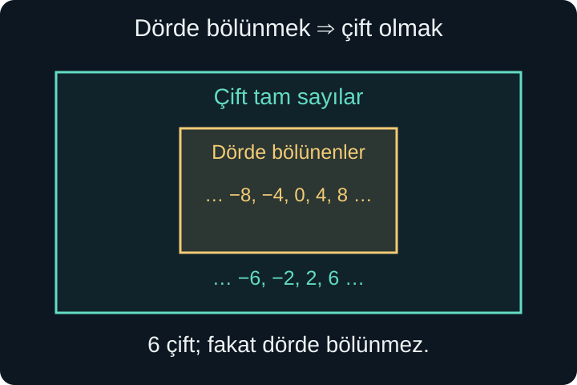
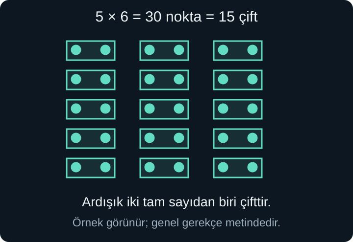

import ArticleVideo from '@/components/ArticleVideo.astro'
import kavram from './media/01-kavram.mp4?url'
import kavramPoster from './media/01-kavram.jpg?url'

Ardışık iki tam sayıyı çarpalım: $3\times4=12$, $4\times5=20$, $5\times6=30$. Üç sonuç da çift. Daha fazla örnek denediğimizde de aynı durumla karşılaşabiliriz. Peki bu, ardışık iki tam sayının çarpımının **her zaman** çift olduğunu göstermeye yeter mi?

Örnekler bir düzeni fark etmemizi sağlar. Fakat bütün tam sayıları tek tek deneyemeyiz. Genel sonuca ulaşmak için, sayılar büyüse, sıfır olsa veya negatif olsa da geçerliliğini koruyan bir gerekçe gerekir. Matematikte **ispat**, bu tür bir gerekçe zinciridir.

[Önceki yazıda](/blog/ikinci-derece-denklemler/) sıfır çarpım ilkesini ve kareye tamamlamayı nedenleriyle kullandık. Şimdi sonuçların arkasındaki düşünme diline odaklanacağız. Tam sayılar, kümeler, basit harfli ifadeler ve dağılma özelliği yeterli ön bilgidir. Amaç ağır semboller ezberlemek değil, bir iddianın ne söylediğini ve nasıl doğrulandığını açıkça görebilmektir.

## 1. Önerme: Doğru veya Yanlış Olabilen Cümle

“12 çift bir sayıdır” cümlesi doğrudur. “9 çift bir sayıdır” cümlesi yanlıştır. Doğru veya yanlış olduğu belirli olan bu tür bildirimlere **önerme** deriz. Bir önermenin yanlış olması, onun önerme olmasını engellemez.

“Bu sayıyı hesapla” bir emir, “Sonuç kaç?” bir sorudur; bunlar doğru veya yanlış diye değerlendirilmez. “Bu şekil güzel” gibi ölçütü belirtilmemiş bir yargı da burada kullanacağımız kesin matematiksel önerme türünde değildir.

“$x$ çifttir” ifadesinde ise $x$ henüz belirlenmemiştir. $x=4$ seçince doğru, $x=5$ seçince yanlış olur. Böyle değişkene bağlı bir cümleyi tamamlamak için ya değişkenin değerini vermeli ya da hangi değerler hakkında konuştuğumuzu belirtmeliyiz. “Her tam sayı $x$ için $x$ çifttir” artık belirli bir iddiadır ve yanlıştır.

Uzun cümleleri kısa yazmak için $P$ ve $Q$ gibi harfler kullanabiliriz. Örneğin $P$, “$n$ dört ile bölünür”; $Q$, “$n$ çifttir” cümlesini temsil etsin. Bu harfler bu bölümde sayıları değil, doğru veya yanlış olabilen koşulları kısaltır.

## 2. “Ve”, “Veya” ve Değilleme

$P$ **ve** $Q$ dediğimizde iki koşulun da doğru olmasını isteriz. “$n$ pozitiftir ve çifttir” koşulunu 6 sağlar; $-6$ pozitif olmadığı, 5 çift olmadığı için sağlamaz. Önceki yazılardaki kesişim düşüncesi burada tekrar karşımıza çıkar.

$P$ **veya** $Q$ dediğimizde en az birinin doğru olması yeterlidir. Matematikte aksi söylenmedikçe “veya” kapsayıcıdır: İkisi birden doğru olabilir. “$n$ pozitiftir veya çifttir” koşulunu 5, $-6$ ve 6 sağlar. Yalnızca “tam olarak biri” kastediliyorsa bunu ayrıca söylemek gerekir.

Bir önermenin **değili**, onun doğru olmadığı iddiasıdır. $P$'nin değilini $\neg P$ ile gösterebiliriz; $\neg$ simgesini “değil” diye okuruz. “$x>3$” koşulunun değili “$x\le3$” olur. Sadece “$x<3$” yazmak eşitlik durumunu kaybettirir.

İki koşulun birlikte sağlanmaması, en az birinin bozulması demektir. Bir sayının “pozitif ve çift” olmaması için ya pozitif olmaması ya da çift olmaması yeterlidir. Buna karşılık “pozitif veya çift” koşulunun sağlanmaması için ikisinin de yanlış olması gerekir. Örneğin $-5$ ne pozitiftir ne çifttir.

Bu ifadeleri gündelik sezgiyle okuyabiliriz; semboller yalnızca uzun cümlelerde neyin neye bağlandığını takip etmeyi kolaylaştırır. Bir cümle belirsizse önce açık Türkçeyle yazmak, sonra gerekirse sembolle kısaltmak daha güvenlidir.

## 3. “Her” ile “Bazı” Aynı Gücü Taşımaz

“Her tam sayının karesi negatif değildir” dediğimizde bütün tam sayıları kapsayan bir iddia kurarız. $n$ hangi tam sayı olursa olsun $n^2\ge0$ olması gerekir. Bir tek aykırı değer bile bu iddiayı çürütmeye yeterdi.

“Bazı tam sayıların karesi 9'dur” ise en az bir tam sayının bu özelliği taşıdığını söyler. $n=3$ örneği bunu göstermeye yeter. $n=-3$ de uygundur; “bazı” sözcüğü tam olarak bir veya az sayıda örnek olduğu anlamına gelmez. Matematikte bu sözcük **en az bir** varlık bildirmek için kullanılır.

“Bütün sayılar bu özelliğe sahip” cümlesinin değili “hiçbiri sahip değil” değildir. Doğru değilse en az bir sayı özelliği taşımıyor demektir. “Her pozitif tam sayı çifttir” iddiasını 3 çürütür; bunun için bütün pozitif sayıların tek olduğunu söylememize gerek yoktur.

“En az bir sayı bu özelliğe sahip” cümlesinin değili ise “hiçbir sayı bu özelliğe sahip değil” olur. Her ve bazı sözcüklerinin yeri, ispatın ne göstermesi gerektiğini belirler. Sayı kümesini de açıkça söylemeliyiz: “Her sayının bir sonraki sayısı vardır” gibi gündelik bir cümle, tam sayılarla gerçek sayılarda aynı biçimde yorumlanamaz.

## 4. Koşullu İddia: Eğer P ise Q

“Bir tam sayı 4 ile bölünüyorsa çifttir” cümlesinde ilk bölüm **varsayım**, ikinci bölüm **sonuç**tur. Bunu $P\Rightarrow Q$ ile kısaltabiliriz. Ok, “P doğruysa Q da doğrudur” anlamına gelir; zaman sırasını veya nedenselliği tek başına anlatmaz.

Bu iddianın yanlış çıkması için 4 ile bölünen ama çift olmayan bir tam sayı bulmamız gerekir. İlk koşulu sağlamayan 7 gibi bir sayı, iddiayı çürütmez; cümle 7 hakkında böyle bir sonuç vaat etmemiştir. Bir koşullu önermenin tek yanlış durumu, varsayımın doğru ama sonucun yanlış olmasıdır.

Dört ile bölünmek, çift olmak için **yeterli koşuldur**: İlkini biliyorsak ikincisine ulaşırız. Çift olmak ise dört ile bölünmek için **gerekli koşuldur**: Dörde bölünen bir sayı çift olmak zorundadır. Gerekli koşulun sağlanması tek başına yeterli değildir; 6 çifttir ama 4 ile tam bölünmez.

Bu dil ilk başta ters gelebilir. “Yeterli” sözcüğünü başlangıç bilgisine, “gerekli” sözcüğünü o bilgi doğruysa mutlaka bulunacak özelliğe bağlamak yardımcı olur. Sonucu varsayımdan daha geniş bir küme olarak düşünmek de ilişkinin yönünü görünür kılar.

## 5. Ters ile Karşıt Ters

“4 ile bölünüyorsa çifttir” iddiasının **tersi**, “çiftse 4 ile bölünür” olur. İki koşulun yerini değiştirdik. İlk iddia doğrudur; tersi 6 örneği nedeniyle yanlıştır. Bir doğru koşullu önermenin tersi otomatik olarak doğru değildir.

**Karşıt ters** ise hem koşulların yerini değiştirir hem ikisini de değiller: “Çift değilse 4 ile bölünmez.” Sembolle $\neg Q\Rightarrow\neg P$ yazılır. Bu, ilk koşullu iddiayla aynı mantıksal bilgiyi taşır. Dörde bölünen bütün sayılar çiftlerin içindeyse, çiftlerin dışında kalan bir sayı dörde bölünenlerin arasında olamaz.

Buna karşılık “4 ile bölünmüyorsa çift değildir” cümlesi, iki koşulu yalnızca değilleyip sırasını korur; bu da 6 nedeniyle yanlıştır. Ters, karşıt ters ve yalnızca olumsuzlaştırma farklı işlemlerdir. İsimlerden emin olamadığımızda cümleleri açıkça yazmak karışıklığı giderir.

Hem $P\Rightarrow Q$ hem $Q\Rightarrow P$ doğruysa koşullar **denk** veya **eşdeğer**dir; $P\Leftrightarrow Q$ yazarız. “P ancak ve ancak Q” denir. Bu durumda P, Q için hem gerekli hem yeterlidir. Böyle bir iddiayı ispatlarken iki yönü de göstermeliyiz; tek yön yetmez.

## 6. Örnek Neyi Gösterir, Neyi Göstermez?

$2^2>2$, $3^2>3$ ve $10^2>10$ örneklerinden “Her pozitif tam sayı $n$ için $n^2>n$” sonucunu çıkarırsak hata yaparız. $n=1$ için $1^2=1$ olur. Bu tek örnek genel iddiayı çürütür; ona **karşı örnek** deriz.

İddiayı “$n>1$ olan her tam sayı için $n^2>n$” biçiminde düzeltirsek doğru bir cümle elde ederiz. Fakat düzeltmenin doğruluğu da yeni birkaç denemeye değil, gerekçeye dayanmalıdır. $n>1$ pozitif olduğu için $n>1$ eşitsizliğini $n$ ile çarpabiliriz; $n^2>n$ çıkar. Burada negatifle çarpınca yön değişimi gibi bir sorun yoktur, çünkü pozitiflik varsayımı açıkça verilmiştir.

Bir bilgisayarla milyonlarca örnek denemek hata bulmak veya bir düzen tahmin etmek için çok yararlı olabilir. Ancak sınırsız bir sayı kümesindeki bütün durumları tek tek kapsamaz. İspatın gücü örnek sayısından değil, seçtiğimiz sayının özel değerine bağlı olmayan ilişkilerden gelir.

Buna karşılık incelenen küme sonluysa bütün durumları kontrol etmek bir ispat olabilir. Bir koşulun yalnızca $\{0,1,2\}$ kümesinde araştırılması isteniyorsa üç durumu da incelemek bütün olasılıkları bitirir. “Örnek ispat değildir” sözünü, sonsuz bir iddiaya birkaç olumlu örnek sunmakla karıştırmadan okumalıyız.

## 7. Tanımdan Başlayan Doğrudan İspat

Bir tam sayı, başka bir tam sayının iki katıysa **çift**tir. Yani $n=2k$ olacak bir tam sayı $k$ bulunur. **Tek** tam sayılar ise $n=2k+1$ biçimindedir. $k$ negatif de olabilir: $-5=2(-3)+1$ tektir. Sıfır $2\times0$ olduğu için çifttir.

“İki tek tam sayının toplamı çifttir” iddiasını ispatlayalım. İki tek sayıyı $2r+1$ ve $2s+1$ yazabiliriz; $r$ ve $s$ tam sayılardır. Aynı harfi kullanmıyoruz, çünkü sayıların aynı olmasını istemiyoruz. Toplam:

$$
(2r+1)+(2s+1)=2r+2s+2=2(r+s+1)
$$

olur. $r+s+1$ bir tam sayı olduğundan sonuç bir tam sayının iki katıdır. Çift tanımı tam olarak bunu istediği için ispat tamamlanır.

Bu bir **doğrudan ispat**tır: Varsayımla başlayıp tanımlar ve geçerli işlemler aracılığıyla sonuca vardık. “Sonuç çift olsun” diye başlamadık; tek olma varsayımının zorunlu olarak çift bir toplam ürettiğini gösterdik.

İspatta $r$ ve $s$'ye belirli değer vermememiz bilinçlidir. Böylece akıl yürütme 3 ile 5 için olduğu kadar $-7$ ile 101 için de geçerlidir. Harf kullanmak tek başına ispat yapmaz; harflerin bütün izin verilen değerlerinde adımların geçerli olması gerekir.

## 8. Ardışık Sayılarda İki Durumu Kapsamak

Ardışık iki tam sayıyı $n$ ve $n+1$ ile gösteririz. Tam sayıları ikiye böldüğümüzde kalan 0 veya 1 olduğundan her tam sayı ya çift ya tektir. Şimdi bu iki durumu ayrı ayrı ele alabiliriz.

$n$ çiftse $n=2k$ yazılır. Çarpım $n(n+1)=2k(n+1)=2[k(n+1)]$ olur ve çifttir. $n$ tekse $n=2k+1$, dolayısıyla $n+1=2(k+1)$ olur. Bu kez $n(n+1)=2[n(k+1)]$ yine çifttir.

Her iki durumda parantez içleri tam sayıdır ve bütün olasılıkları kapsadık. Dolayısıyla **ardışık iki tam sayının çarpımı her zaman çifttir**. Negatif tam sayılar ve sıfır için ayrı bir istisna koymadık; tanımlar onları da içeriyor.

Şekil, $5\times6=30$ örneğinde otuz noktanın on beş çift oluşturduğunu gösterir. Görsel genel düşünceyi destekler; bütün tam sayılardaki ispat, az önceki çift ve tek durumlarının eksiksiz ayrılmasıdır.

<ArticleVideo src={kavram} poster={kavramPoster} title="Ardışık iki sayının çarpımını eşlemek" caption="Ardışık sayılardan birinin çift olması, çarpımdaki nesnelerin ikişerli eşlenmesini sağlar. Görsel örneğin bütün tam sayılara uzanan gerekçesi metindeki iki durumlu ispattır." />

## 9. Karşıt Tersten İspat

“Bir tam sayının karesi çiftse kendisi de çifttir” iddiasını düşünelim. Doğrudan $n^2=2k$ yazmak, $n$'in iki kat biçiminde olduğunu hemen göstermeyebilir. Karşıt ters daha kolaydır: **$n$ tekse $n^2$ tektir.**

$n=2k+1$ yazalım. Kare açılımıyla:

$$
n^2=(2k+1)^2=4k^2+4k+1
=2(2k^2+2k)+1.
$$

Parantezin içi tam sayı olduğu için sonuç tektir. Böylece karşıt tersi ve ona denk olan başlangıç iddiasını ispatladık. Burada “çift değil” ile “tek” eşlemesini tam sayılarda yapıyoruz; gerçek sayıların tamamını çift veya tek diye sınıflandırmıyoruz.

Ayrıca $n$ çiftse $n^2$ çifttir; çünkü $n=2k$ için $n^2=4k^2=2(2k^2)$ olur. İki yön birlikte, bir tam sayının çift olmasıyla karesinin çift olmasının eşdeğer olduğunu gösterir.

## 10. Çelişkiyle İspat

Bazen iddianın yanlış olduğunu varsaymanın imkânsız bir sonuca götürdüğünü gösteririz. Buna **çelişkiyle ispat** denir. “En büyük tam sayı yoktur” iddiası bunun kısa bir örneğidir.

Tersini varsayalım: En büyük tam sayı $M$ var olsun. $M+1$ de bir tam sayıdır ve $M+1>M$ olur. Bu, $M$'nin en büyük olduğu varsayımıyla çelişir. O hâlde böyle bir $M$ bulunamaz.

Çelişki yalnızca beklemediğimiz veya hoşumuza gitmeyen bir sonuç değildir. Aynı anda doğru olamayacak iki kesin cümleye ulaşmalıyız. Burada “$M$'den büyük tam sayı yok” ile “$M+1$ daha büyük bir tam sayı” birlikte sağlanamaz.

Bu yöntem, kanıtlamak istediğimiz sonucu baştan doğru kabul etmek değildir. Geçici olarak onun değiline izin verir, diğer bilinen kurallarla çatışıp çatışmadığını inceleriz. Çatışma ortaya çıkarsa geçici varsayımı reddederiz. Çelişki bulamamak ise iddianın yanlış olduğunu tek başına göstermez; kullandığımız yol yeterince ilerlememiş olabilir.

## 11. Tanım, Aksiyom ve Teorem

Tanım, bir sözcüğü nasıl kullanacağımızı belirler: “Çift tam sayı, bir tam sayının iki katıdır.” Tanıma göre işlem yaparken kavramın anlamını açmış oluruz. **Aksiyom**, kurduğumuz matematiksel sistemin başlangıçta kabul edilen temel ilişkilerinden biridir. **Teorem** ise bu başlangıçlar ve önceden kanıtlanan sonuçlar kullanılarak ispatlanan iddiadır.

Her şeyi daha önceki bir cümleyle gerekçelendirmeye çalışırsak sonsuz bir geriye gidiş oluşur. Aksiyomlar başlangıç noktalarını açıkça belirlememizi sağlar. Bundan sonra bir teoremin doğruluğu, seçilen başlangıçlar ve mantıksal çıkarım kuralları içinde değerlendirilir.

Bir sonucu yine kendisine dayanarak gerekçelendirmek **döngüsel akıl yürütme** olur. Örneğin bir üçgen özelliğini, yalnızca o özelliği kullanarak elde edilmiş başka bir kuralla ispatlayamayız. Ara cümleler değişse bile bağımlılık aynı sonuca geri dönüyorsa yeni bir gerekçe üretmiş olmayız.

Geometride çizimler özellikle yararlıdır, ama ekranda iki çizginin eşit görünmesi eşit olduklarının ispatı değildir. Eşit uzunluk, paralellik veya diklik ya verilmiş olmalı ya da bir gerekçeyle çıkarılmalıdır. Çizim düşünmemize yardım eder; görünüş, koşulun yerini almaz.

Sonraki yazıda bu ayrımı kullanarak noktaları, doğruları, açıları ve üçgenleri kuracağız. Üçgenin açı toplamını yalnızca ölçerek görmekle, paralellikten çıkararak ispatlamak arasındaki farkı adım adım göstereceğiz.

## Kaynaklar

- [OpenStax — Statements and Quantifiers](https://openstax.org/books/contemporary-mathematics/pages/2-1-statements-and-quantifiers): Önerme, her ve en az bir ifadeleri.
- [OpenStax — Equivalent Statements](https://openstax.org/books/contemporary-mathematics/pages/2-5-equivalent-statements): Koşullu önerme ve karşıt ters ilişkisi.
- [Richard Hammack — Book of Proof](https://richardhammack.github.io/BookOfProof/Main.pdf): Doğrudan ispat, karşıt ters ve çelişki yöntemlerinin açık ders kitabı açıklaması.

Bu kaynaklar mantıksal kapsamı doğrulamak için kullanıldı; örneklerin sunumu, Türkçe açıklamalar ve şekiller özgün olarak hazırlandı.
