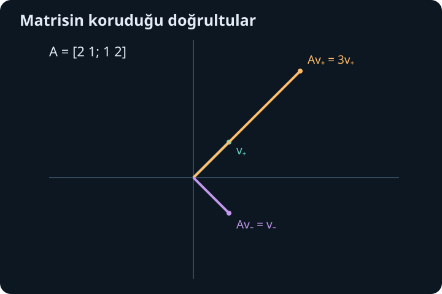
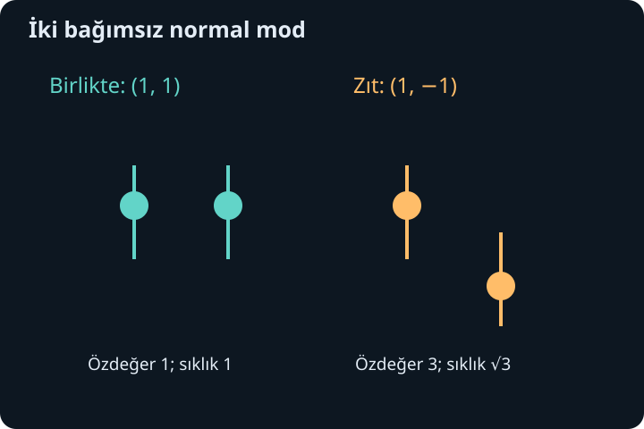

import ArticleVideo from '@/components/ArticleVideo.astro'
import kavram from './media/01-kavram.mp4?url'
import kavramPoster from './media/01-kavram.jpg?url'

Bir matris bir vektörü dönüştürdüğünde genellikle hem uzunluk hem yön değişir. Fakat bazı özel doğrultular korunabilir: vektör aynı doğru üzerinde kalır, yalnız ölçeklenir veya ters döner. Bu doğrultuları bulmak, karmaşık görünen bir dönüşümü birbirinden bağımsız basit ölçeklemelere ayırabilir.

[Önceki yazıda](/blog/ikinci-derece-diferansiyel-denklemler/) sınır koşullarının belirli parametre değerlerini seçtiğini ve bunlara özdeğer dendiğini gördük. Şimdi aynı fikrin sonlu boyutlu matrislerdeki biçimini kuracağız. Matris-vektör çarpımı, determinant, doğrusal bağımsızlık ve baz bilgisine dayanacağız; gereken anlamları hesap içinde hatırlatacağız. Son örnekte birbirine bağlı iki diferansiyel denklemi özel yönler yardımıyla ayıracağız.

## 1. Özdeğer denklemi ne söyler?

$A$ bir $n\times n$ kare matris olsun. Sıfırdan farklı bir $\mathbf v$ vektörü ve bir $\lambda$ sayısı için:

$$
A\mathbf v=\lambda\mathbf v
$$

oluyorsa $\mathbf v$'ye özvektör, $\lambda$'ya karşılık gelen özdeğer denir. $n$ uzayın boyutunu, $\lambda$ ölçek çarpanını belirtir. Vektörün sıfır olmaması zorunludur; çünkü sıfır vektörü her matris ve her $\lambda$ için eşitliği sağlar, özel yön hakkında bilgi vermez.

$\lambda>0$ ise yön aynı kalır. $\lambda<0$ ise vektör aynı doğru üzerinde ters yöne döner. $\lambda=0$ ise vektör sıfıra gönderilir; bu da geçerli bir özdeğerdir. “Yön değişmiyor” ifadesini bu nedenle aynı doğrultunun korunması olarak anlamak gerekir. Negatif çarpanı dışarıda bırakmayız.

Bir özvektörün sıfırdan farklı her sabit katı da aynı özdeğerin özvektörüdür. Ölçekleme çizginin yönünü değiştirmez. Bu yüzden hesapta tek bir vektör yazdığımızda, aslında aynı doğrultudaki bütün sıfır olmayan vektörleri temsil ediyoruz. Normalleştirme gerektiğinde uzunluğu 1 olan temsilci seçilebilir.

## 2. İlk örnekte iki özel doğrultu

Şu matrisi ele alalım:

$$
A=\begin{pmatrix}2&1\\1&2\end{pmatrix}.
$$

$\mathbf v_+=(1,1)^T$ için çarpım $(3,3)^T=3\mathbf v_+$ olur. $\mathbf v_-=(1,-1)^T$ için çarpım $(1,-1)^T=\mathbf v_-$ olur. Üstteki $T$ transpozu gösterir; yan yana yazdığımız bileşenleri sütun vektörü olarak okuyoruz.

İki özel doğrultu sırasıyla üç kat ölçeklenir ve değişmeden kalır. Fakat $(1,0)^T$ vektörü $(2,1)^T$ olur; bu aynı doğrultu değildir. Dönüşümün bazı vektörlerde yönü değiştirmesi, özel doğrultuların varlığıyla çelişmez. Genel bir vektör bu iki özel bileşenin toplamıdır ve bileşenler farklı ölçeklenince toplamın yönü değişir.

## 3. Determinant neden sıfır olmalı?

Özdeğer denklemini $(A-\lambda I)\mathbf v=0$ biçiminde yazalım. $I$ birim matristir; vektörü değiştirmeden bırakır. Sıfır olmayan çözüm bulunması için $A-\lambda I$ terslenebilir olmamalıdır. Kare matriste bunun ölçütü determinantın sıfır olmasıdır:

$$
\det(A-\lambda I)=0.
$$

Bu denklem **karakteristik denklem**, sol taraf karakteristik polinomdur. Determinantı sıfır olan dönüşüm en az bir sıfır olmayan yönü sıfıra gönderir. O yön, özgün $A$ altında tam $\lambda$ ile ölçeklenir.

Örneğimizde determinant $(2-\lambda)^2-1=\lambda^2-4\lambda+3$ olur. Çarpanlara ayırınca $(\lambda-1)(\lambda-3)=0$, yani $\lambda=1,3$ çıkar. Her özdeğer için $(A-\lambda I)\mathbf v=0$ denklemini ayrıca çözeriz. $\lambda=3$ için $-v_1+v_2=0$, $\lambda=1$ için $v_1+v_2=0$ elde edilir; önce bulduğumuz yönler böylece sistematik biçimde ortaya çıkar.

Determinant denklemi özvektörü tek başına vermez. Önce olası ölçekleri bulur, sonra bu ölçekleri taşıyan yönleri çözeriz. Hesabı bitirince $A\mathbf v=\lambda\mathbf v$ eşitliğini doğrudan kontrol etmek küçük cebir hatalarını yakalar.

## 4. Gerçek matris her zaman gerçek özvektör taşımaz

Düzlemde çeyrek tur döndüren $R=\begin{pmatrix}0&-1\\1&0\end{pmatrix}$ matrisini düşünelim. Sıfır olmayan hiçbir gerçek vektör, 90 derece döndükten sonra kendi doğrultusunda kalmaz. Karakteristik denklem $\lambda^2+1=0$ olur ve gerçek kökü yoktur.

Karmaşık sayılara izin verirsek özdeğerler $i$ ve $-i$ olur. Örneğin $(1,-i)^T$ vektörünü $R$ ile çarpmak $(i,1)^T=i(1,-i)^T$ verir. Karmaşık bir özvektör, gerçek düzlemde sıradan tek bir ok olarak aynı biçimde yorumlanmaz; bileşen uzayı genişlemiştir.

Bu nedenle “bir matrisi köşegenleştirebiliriz” derken hangi sayı sistemi üzerinde çalıştığımızı belirtmeliyiz. Gerçek özbazı olmayan bir matris karmaşık özbaz taşıyabilir. Buna rağmen bazı matrisler karmaşık sayılar üzerinde de yeterince bağımsız özvektör vermez. Bir sonraki ayrım bunu açıklayacak.

## 5. Tekrarlı özdeğer ile eksik özvektör farklıdır

Bir özdeğerin karakteristik polinomda kaç kez kök olduğuna cebirsel çokluk denir. O özdeğerin bütün özvektörlerine sıfırı da ekleyince oluşan altuzaya özuzay denir; boyutu geometrik çokluktur. Bu iki sayı her zaman eşit olmak zorunda değildir.

$A=2I$ matrisinde yalnız özdeğer 2 vardır ve iki kez tekrarlanır. Fakat her sıfır olmayan vektör özvektördür; iki bağımsız yön seçmek kolaydır. Matris zaten köşegendir. Tekrarlı özdeğer tek başına sorun değildir.

Buna karşılık:

$$
J=\begin{pmatrix}2&1\\0&2\end{pmatrix}
$$

matrisinin karakteristik polinomu yine $(2-\lambda)^2$'dir. $\lambda=2$ için denklem $v_2=0$ verir. Bütün özvektörler $(v_1,0)^T$ doğrultusundadır; yalnız bir bağımsız özvektör vardır. İki boyutlu uzayı bunlarla dolduramayız. Bu matris köşegenleştirilemez.

Burada tam Jordan kuramına girmeyeceğiz. Gereken ders daha sınırlıdır: özdeğerleri bulmak, özvektörlerden baz kurulacağını garanti etmez. Özellikle tekrarlı köklerde özuzayın boyutunu ayrıca kontrol ederiz. Farklı özdeğerlere ait özvektörler ise doğrusal bağımsızdır; bu yüzden $n$ farklı özdeğer, $n$ boyutta yeterli bir baz sağlar.

İki farklı özdeğerin vektörleri neden bağımsızdır? Birinin diğerinin sıfırdan farklı katı olduğunu varsayalım: $\mathbf v=c\mathbf u$. O zaman $A\mathbf v=cA\mathbf u=c\lambda\mathbf u=\lambda\mathbf v$ olur. Aynı zamanda $A\mathbf v=\mu\mathbf v$ olduğundan $(\lambda-\mu)\mathbf v=0$ gerekir. Vektör sıfır olmadığı için $\lambda=\mu$ çıkar; bu da farklılık varsayımına aykırıdır. Daha çok vektörde aynı fikir, olası bir bağımlılık ilişkisine $A-\lambda I$ uygulayıp terim sayısını azaltarak tekrarlanır. Böylece farklı özdeğerlerin verdiği yönler birbirinin gereksiz kopyaları olamaz.

## 6. Köşegenleştirme bir baz değişimidir

$A$'nın $n$ bağımsız özvektörü varsa bunları $P$ matrisinin sütunlarına yerleştirelim. Karşılık gelen özdeğerleri aynı sırayla $D$ köşegen matrisine yazalım. Sütun sütun özdeğer eşitliği:

$$
AP=PD
$$

verir. Sütunlar bağımsız olduğundan $P$ terslenebilir ve:

$$
\boxed{A=PDP^{-1}.}
$$

$P^{-1}$ bir vektörün eski koordinatlarını özbazdaki koordinatlara çevirir. $D$ her bileşeni kendi özdeğeriyle çarpar. $P$ sonucu başlangıç koordinatlarına geri taşır. Bu işlem dönüşümü değiştirmez; aynı dönüşümü daha uygun koordinatlarla anlatır.

Örneğimiz için $P=\begin{pmatrix}1&1\\1&-1\end{pmatrix}$, $D=\begin{pmatrix}3&0\\0&1\end{pmatrix}$ ve $P^{-1}=\frac12P$ olur. Çarpımı açıkça yapınca $PDP^{-1}=\begin{pmatrix}2&1\\1&2\end{pmatrix}$ bulunur. Özvektörlerin sütun sırasını değiştirirsek $D$'deki değerlerin sırasını da değiştirmeliyiz.

## 7. Yüksek kuvvetler neden kolaylaşır?

$A=PDP^{-1}$ ise iki çarpımda ortadaki $P^{-1}P$ birim matrise dönüşür. Bu iptal tekrarlandığından:

$$
A^N=PD^NP^{-1},\qquad N=0,1,2,\ldots
$$

olur. Köşegen matriste kuvvet almak yalnız köşegendeki sayılara kuvvet uygulamaktır. İlk örnekte:

$$
A^N=\frac12
\begin{pmatrix}3^N+1&3^N-1\\3^N-1&3^N+1\end{pmatrix}.
$$

$N=2$ için $\begin{pmatrix}5&4\\4&5\end{pmatrix}$ çıkar; doğrudan $A$'yı kendisiyle çarparak doğrulayabiliriz. $N=0$ için birim matris elde edilir. Başlangıç vektörü $(1,0)^T$ ise $N$ uygulama sonrasında $((3^N+1)/2,(3^N-1)/2)^T$ olur.

Büyük $N$ için iki bileşen neredeyse eşittir; büyüklüğü en fazla olan özdeğer 3'ün doğrultusu baskın hale gelir. Ancak başlangıç vektörünün o doğrultudaki bileşeni sıfırsa bu sonuç beklenmez. Örneğin $(1,-1)^T$ hiç değişmez. Uzun zaman veya çok adımlı davranışta yalnız özdeğerlere değil başlangıcın hangi özvektörleri içerdiğine de bakarız.

Köşegenleşmeyen $J=2I+N$ örneğinde $N=\begin{pmatrix}0&1\\0&0\end{pmatrix}$ ve $N^2=0$'dır. Binom açılımı $J^m=2^mI+m2^{m-1}N$ verir. Saf üstel çarpanın yanında $m$ çarpanı görünür. Önceki yazıdaki tekrarlı kökte $te^{rt}$ terimiyle akraba bir yapı vardır; köşegenleştirme eksikliği hesapta ek çarpanlar doğurabilir.

## 8. Simetri dik özvektörler verir

Gerçek bir matris $A^T=A$ koşulunu sağlıyorsa simetriktir. İlk örneğimiz böyleydi. $A\mathbf u=\lambda\mathbf u$ ve $A\mathbf v=\mu\mathbf v$ olsun. Simetriden:

$$
\mathbf u^TA\mathbf v=(A\mathbf u)^T\mathbf v
$$

olur. Sol taraf $\mu\mathbf u^T\mathbf v$, sağ taraf $\lambda\mathbf u^T\mathbf v$'dir. Dolayısıyla $(\lambda-\mu)\mathbf u^T\mathbf v=0$. Farklı özdeğerlerde $\lambda\ne\mu$ olduğundan $\mathbf u^T\mathbf v=0$; özvektörler diktir.

Aynı özdeğere ait iki rastgele özvektörün dik olması gerekmez. Fakat özuzay içinde birbirine dik bir baz seçebiliriz. Simetri bütün uzay için bunu tamamlamamıza izin verir: **gerçek simetrik bir matrisin gerçek özdeğerlerden oluşan ortonormal bir özbazı vardır**. Ortonormal, vektörlerin birbirine dik ve her birinin uzunluğunun 1 olması demektir. Bu sonuç sonlu boyutlu spektral teoremdir.

## 9. Spektral teoremin nedenini görmek

Sonucun arkasındaki fikri kısaca kuralım. Birim vektörler üzerinde $q(\mathbf v)=\mathbf v^TA\mathbf v$ fonksiyonu süreklidir. Birim küre kapalı ve sınırlı olduğundan bu fonksiyon en büyük değerini bir $\mathbf v$ noktasında alır; bu, ekstremum teoreminin sonlu boyutlu biçimidir.

$\mathbf v$'ye dik herhangi bir $\mathbf u$ yönünde, birim kürede kalmak için $(\mathbf v+t\mathbf u)/\sqrt{1+t^2|\mathbf u|^2}$ eğrisini kullanalım. Maksimumda $q$'nun bu yol boyunca türevi sıfırdır. Türev hesabı $2\mathbf u^TA\mathbf v=0$ verir. Demek ki $A\mathbf v$, $\mathbf v$'ye dik bütün yönlere diktir; yalnız $\mathbf v$ doğrultusunda olabilir. Böylece gerçek bir özvektör bulduk.

Simetri, $\mathbf v$'ye dik altuzayı da korur: $\mathbf w\perp\mathbf v$ ise $\mathbf v^TA\mathbf w=(A\mathbf v)^T\mathbf w=\lambda\mathbf v^T\mathbf w=0$. Aynı işlemi bu bir boyut küçük altuzayda tekrarlarız. Sonlu sayıda adım sonunda birbirine dik özvektörlerden baz elde edilir. Bu gerekçe, simetrinin yalnız güzel bir görünüm değil neden tam özbaz sağladığını açıklar.

## 10. Ortonormal bazda ters matris kolaylaşır

Ortonormal özvektörleri $Q$'nun sütunlarına yerleştirirsek $Q^TQ=I$ olur. Böyle bir matrise ortogonal matris denir ve $Q^{-1}=Q^T$'dir. Spektral ayrışım:

$$
A=QDQ^T
$$

şeklinde yazılır. İlk örneğin birim özvektörleri $\mathbf e_+=(1,1)^T/\sqrt2$, $\mathbf e_-=(1,-1)^T/\sqrt2$'dir. Her vektörün bu bazdaki katsayıları doğrudan skaler çarpımla bulunur: $c_+=\mathbf e_+^T\mathbf x$, $c_-=\mathbf e_-^T\mathbf x$.

Ayrışımı $A=3\mathbf e_+\mathbf e_+^T+\mathbf e_-\mathbf e_-^T$ biçiminde de okuyabiliriz. $\mathbf e\mathbf e^T$ matrisi vektörü $\mathbf e$ doğrultusuna izdüşürür. Önce iki dik bileşeni ayırır, sonra her birini özdeğeriyle ölçekleriz. Bu gösterim daha sonra ölçüm ve durum ayrıştırması gibi konularda önemli olacak; burada bütünüyle gerçek vektör geometrisine dayanıyor.

## 11. Bağlı iki denklemi bağımsızlaştırmak

İki fonksiyonun şu sistemi sağladığını düşünelim:

$$
\mathbf y''=-K\mathbf y,\qquad
K=\begin{pmatrix}2&-1\\-1&2\end{pmatrix},\quad
\mathbf y=\begin{pmatrix}y_1\\y_2\end{pmatrix}.
$$

Bileşenleri $y_1''=-2y_1+y_2$ ve $y_2''=y_1-2y_2$'dir. Her denklem diğer fonksiyonu da içerir. $K$'nın $(1,1)^T$ yönündeki özdeğeri 1, $(1,-1)^T$ yönündeki özdeğeri 3'tür. Birim biçimlerinden oluşan $Q$ ile $\mathbf y=Q\mathbf q$ yazalım.

$Q$ sabit olduğundan $\mathbf y''=Q\mathbf q''$ olur. Soldan $Q^T$ ile çarpınca:

$$
\mathbf q''=-\begin{pmatrix}1&0\\0&3\end{pmatrix}\mathbf q.
$$

Artık $q_+''+q_+=0$ ve $q_-''+3q_-=0$ birbirinden bağımsızdır. İlk bileşen açısal sıklığı 1 olan, ikincisi $\sqrt3$ olan sinüs-kosinüs çözümleri taşır. Bu bağımsız biçimlere normal modlar denir. Sözcüğün fiziksel çağrışımı olsa da burada yalnız bir baz değişimiyle denklemleri ayırdık.

## 12. Başlangıcı modlara dağıtmak

Başlangıçta $\mathbf y(0)=(1,0)^T$ ve $\mathbf y'(0)=(0,0)^T$ olsun. Ortonormal bazda $q_+(0)=q_-(0)=1/\sqrt2$, iki başlangıç türevi de sıfırdır. Çözümler $q_+(t)=\cos t/\sqrt2$ ve $q_-(t)=\cos(\sqrt3t)/\sqrt2$ olur.

Eski koordinatlara dönünce:

$$
y_1(t)=\frac{\cos t+\cos(\sqrt3t)}2,\qquad
y_2(t)=\frac{\cos t-\cos(\sqrt3t)}2.
$$

Başlangıç değerleri yerine koyunca açıkça doğrulanır. İlk bileşenin ikinci türevi $[-\cos t-3\cos(\sqrt3t)]/2$'dir. $-2y_1+y_2$ de aynı ifadeyi verir. Böylece baz değişimiyle bulunan sonuç özgün bağlı sistemde denetlenmiş olur.

<ArticleVideo src={kavram} poster={kavramPoster} title="Hangi vektör özvektör?" caption="Yatay bileşeni ikiyle çarpan dönüşüm uygulanır. Yatay vektör doğrultusunu korurken köşegen yönündeki vektör yön değiştirir." />

Özdeğer hesabının amacı yalnız determinant kökleri bulmak değildir. Asıl kazanç, dönüşümün bağımsız davranışlarını ortaya çıkarmaktır. Yeterli özvektör varsa köşegenleştirme bunu doğrudan yapar; simetri ise dik ve tam bir baz garantisi verir. Sonraki yazıda bu yapıyı karmaşık vektörlere genişletirken skaler çarpımdaki eşleniğin neden vazgeçilmez olduğunu göreceğiz.

## Kaynaklar

- [MIT OpenCourseWare, Eigenvalues and Eigenvectors](https://ocw.mit.edu/courses/18-06-linear-algebra-spring-2010/resources/lecture-21-eigenvalues-and-eigenvectors/)
- [MIT OpenCourseWare, Diagonalization and Powers of A](https://ocw.mit.edu/courses/18-06-linear-algebra-spring-2010/resources/lecture-22-diagonalization-and-powers-of-a/)
- [MIT OpenCourseWare, Symmetric Matrices and Positive Definiteness](https://ocw.mit.edu/courses/18-06-linear-algebra-spring-2010/resources/lecture-25-symmetric-matrices-and-positive-definiteness/)
