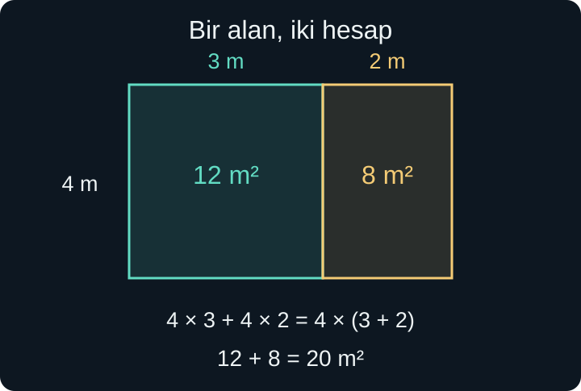
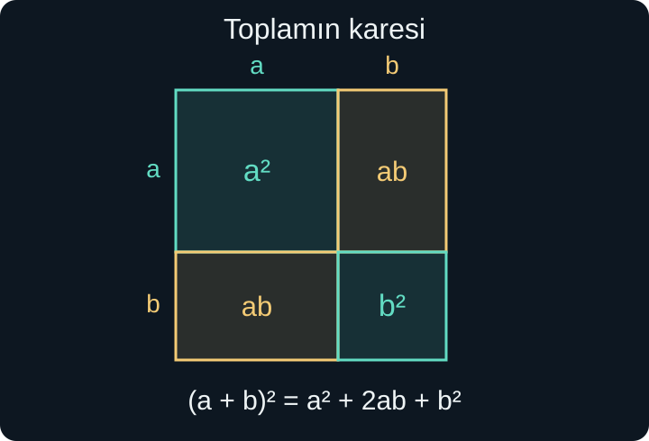

import ArticleVideo from '@/components/ArticleVideo.astro'
import kavram from './media/01-kavram.mp4?url'
import kavramPoster from './media/01-kavram.jpg?url'

Kenarları 4 metre ve 3 metre olan bir bahçenin yanına, aynı genişlikte 2 metrelik bir bölüm eklendiğini düşünelim. Eski alan $4\times3=12$, eklenen alan $4\times2=8$ metrekaredir. Bütün bahçeyi tek bir dikdörtgen olarak ölçersek $4(3+2)=20$ metrekare buluruz. Parçaları toplayarak da $12+8=20$ elde ederiz.

Aynı alanın iki hesabı, cebirdeki iki yönlü bir hareketi gösteriyor: $4(3+2)$ ifadesini $4\times3+4\times2$ biçiminde **açabilir**, toplamı yeniden ortak çarpan kullanarak **çarpım** biçimine getirebiliriz. Bu yazıda bu iki yönü, daha büyük harfli ifadeleri okuyabilmek için kullanacağız.

[Önceki yazıda](/blog/harfler-esitlikler-ve-denklemler/) terim, katsayı, yerine koyma ve eşitliği koruyan işlemleri kurduk. Burada ayrıca üs kurallarını ve kesirlerin dört işlemini kullanacağız. Bir ifadeyi sadeleştirmekle denklem çözmek arasındaki ayrımı koruyacağız: Ortada bir eşitlik koşulu yoksa, harfin değerini aramıyoruz.

## 1. Alanı Bölmek, Dağılmayı Görmek

Bahçenin ortak genişliğine $a$, iki bölümün uzunluklarına $b$ ve $c$ diyelim. Bütün uzunluk $b+c$, alan $a(b+c)$ olur. İki parçanın alanları ise $ab$ ve $ac$'dir. Örtüşmeyen parçalar bütünü doldurduğu için:

$$
a(b+c)=ab+ac.
$$

Bu eşitlik, **dağılma özelliğidir**. Uzunluklarla başladığımız için şekilde $a$, $b$ ve $c$ pozitiftir. Cebirsel eşitlik ise negatif sayılar ve sıfır için de geçerlidir; bu daha genel geçerlik aritmetiğin dağılma kuralına dayanır. Negatif sayıya geometrik bir kenar uzunluğu uydurmamız gerekmez.

Sol taraftan sağa giderken parantezin dışındaki $a$'yı içerideki **her** terimle çarparız. Sağdan sola giderken iki terimde de bulunan ortak $a$ çarpanını görünür kılarız. Alan şekli bu iki yazımın aynı miktarı anlattığını gösterir; bir biçim parçaları, diğeri bütünün kenarlarını öne çıkarır.

Eksi işareti bulunduğunda da kural değişmez. $3(x-4)=3x-12$ olur. Parantezin dışındaki sayı negatifse her terimin işareti buna göre değişir: $-2(x-5)=-2x+10$. Sadece ilk terimi çarpmak, bütünü değil bir parçayı dönüştürmek olur.

## 2. Polinom Nedir?

$x$ bir gerçek sayı değişkeni olsun. $3x^2-5x+7$ ifadesi sonlu sayıda terimin toplamıdır. Her terimde $x$, sıfır veya pozitif tam sayı kuvvetiyle bulunur. Böyle ifadelere, tek değişkenli durumda, **polinom** denir.

Bu örnekte terimler $3x^2$, $-5x$ ve 7'dir. Katsayılar sırasıyla 3, $-5$ ve 7'dir. Sabit terim olan 7, $x$'e bağlı değildir. $x^0=1$ gösterimi uygun olduğunda onu sıfırıncı kuvvetli terim olarak düşünebiliriz; polinomu $x=0$ noktasında değerlendirmek için $0^0$ hesaplamaya gerek yoktur, sabit terim doğrudan 7'dir.

Bir terimdeki üs onun **derecesidir**. Düzenlenmiş bir polinomda katsayısı sıfır olmayan en yüksek kuvvet, polinomun derecesini verir. $3x^2-5x+7$ ikinci derecedir. $8x^3+x-1$ üçüncü, sıfır olmayan sabit bir polinom sıfırıncı derecedir. Sıfır polinomunun derecesini burada tanımlamıyoruz.

$1/x=x^{-1}$ ve $\sqrt{x}=x^{1/2}$ ifadeleri bu tanıma göre $x$'te polinom değildir. Sorun harf içermeleri değil, üslerinin izin verilen türde olmamasıdır. Buna karşılık $\frac12x^2+\sqrt2x-3$ bir polinomdur: Katsayılar kesirli veya irrasyonel olabilir; değişkenin kuvvetleri 2, 1 ve 0'dır.

Şimdilik tek değişkenli ifadeler üzerinde duruyoruz. $2xy+3x$ gibi birden fazla değişken içeren polinomlar da vardır; ancak burada “derece” dediğimizde hangi değişkene göre konuştuğumuzu belirttiğimiz basit çerçeve yeterlidir.

## 3. Benzer Terimleri Birleştirmek

$4x^2+3x-2x^2+5x-6$ ifadesinde kareli terimleri kendi aralarında, birinci kuvvetli terimleri kendi aralarında birleştirebiliriz:

$$
(4-2)x^2+(3+5)x-6=2x^2+8x-6.
$$

**Benzer terimler**, değişken kısmı ve üsleri aynı olan terimlerdir. $4x^2$ ile $-2x^2$ benzerdir; $4x^2$ ile $3x$ değildir. Birinde dört adet “$x$'in karesi”, diğerinde üç adet “$x$” vardır. Bunları katsayılarını toplayarak tek terime dönüştüremeyiz.

Bu ayrımı sayıyla da kontrol edebiliriz. $x=2$ için $x^2+x=4+2=6$ olur. $2x^2$ ise 8 eder. Dolayısıyla $x^2+x=2x^2$ bir özdeşlik değildir. Bazı seçilmiş sayılarda aynı çıkmaları, her sayıda aynı olduklarını göstermez.

Polinomları çıkarırken ikinci polinomun tamamının işaretini değiştirmek gerekir:

$$
(3x^2+x-4)-(x^2-2x+5)
$$

$$
=3x^2+x-4-x^2+2x-5
=2x^2+3x-9.
$$

Parantez önündeki eksi, içerideki her terimi $-1$ ile çarpar. Sabit terimin işareti de, eksiyle yazılmış terimin işareti de değişir. Düzenleme bittikten sonra en yüksek kuvveti kontrol ederiz; başlangıçta görünen yüksek dereceli terimler birbirini götürmüş olabilir.

## 4. İki Parantezi Çarpmak

$(x+2)(x+3)$ ifadesinde ilk parantezin tamamı ikinci parantezi çarpar. Dağılmayı iki kez uygularız:

$$
(x+2)(x+3)=x(x+3)+2(x+3)
$$

$$
=x^2+3x+2x+6=x^2+5x+6.
$$

Her terimin diğer parantezdeki her terimle çarpıldığını görmek önemlidir. İlk ve son terimleri çarpmak yeterli olmaz; aradaki iki çarpım $3x$ ve $2x$, sonucun $5x$ kısmını oluşturur.

Aynı işlem farklarda da geçerlidir:

$$
(x+4)(x-2)=x^2-2x+4x-8=x^2+2x-8.
$$

Açılmış biçim, benzer terimleri toplamayı kolaylaştırır. Çarpım biçimi ise hangi iki parçanın çarpıldığını gösterir. “En sade biçim” her zaman “en az parantez” demek değildir; kullanacağımız işe göre bir biçim daha uygun olur.

## 5. Toplamın Karesindeki İki Dikdörtgen

Kenarı $a+b$ olan bir kareyi, her kenarında $a$ ve $b$ uzunlukları ayırarak dört parçaya bölelim. Bir parça $a$ kenarlı kare, bir parça $b$ kenarlı kare, diğer iki parça ise kenarları $a$ ve $b$ olan dikdörtgenlerdir.

Dört alanın toplamı büyük karenin alanına eşittir:

$$
(a+b)^2=a^2+ab+ab+b^2
=a^2+2ab+b^2.
$$

Ortadaki $2ab$ terimi, şekildeki iki dikdörtgenin toplamıdır. Bu yüzden bir toplamın karesini alırken yalnızca iki sayının karesini toplamak eksik kalır. Örneğin $a=3$, $b=2$ için büyük karenin alanı 25'tir. İki küçük karenin alanları $9+4=13$ eder; eksik 12, iki tane $3\times2$ dikdörtgenidir.

<ArticleVideo src={kavram} poster={kavramPoster} title="Bir karenin dört parçası" caption="Kenarı a + b olan kare, a² ve b² kareleri ile iki ab dikdörtgenine ayrılıyor. Orta terimin neden 2ab olduğu alanlarla görünür oluyor." />

Cebirsel olarak $(a+b)(a+b)$ çarpımını açtığımızda da aynı dört terim çıkar. Alan modeli pozitif uzunluklarda sezgi verir; çarpma kuralları eşitliği bütün gerçek $a$ ve $b$ değerlerine taşır. Her izin verilen değerde doğru olan bu tür eşitliklere **özdeşlik** diyoruz.

## 6. Farkın Karesi ve İki Kare Farkı

Toplamın karesinde $b$ yerine $-b$ koyarsak:

$$
(a-b)^2=a^2+2a(-b)+(-b)^2
=a^2-2ab+b^2.
$$

Son terim pozitiftir, çünkü $(-b)^2=b^2$ olur. Örneğin $(x-4)^2=x^2-8x+16$'dır. Ortadaki terim iki ifadenin çarpımının iki katıdır; yalnızca $-4x$ yazmak doğru olmaz.

Başka bir kullanışlı çarpımda orta terimler birbirini götürür:

$$
(a+b)(a-b)=a^2-ab+ab-b^2=a^2-b^2.
$$

Bu, **iki kare farkı** özdeşliğidir. $x^2-25=(x-5)(x+5)$ yazabiliriz, çünkü $25=5^2$'tir. Burada $x$'in değerini bulmadık; aynı ifadeyi çarpım biçimine dönüştürdük.

İki kural birbirine karıştırılmamalıdır. $(a-b)^2$ bir farkın karesidir; $a^2-b^2$ ise iki karenin farkıdır. $a=7$, $b=2$ için ilki $5^2=25$, ikincisi $49-4=45$ olur. Parantez, hangi bütünün karesini aldığımızı belirler.

Bu özdeşlikler zihinden hesapta da işe yarar. $49^2=(50-1)^2=2500-100+1=2401$ olur. $53\times47=(50+3)(50-3)=2500-9=2491$ hesabında ise iki kare farkını kullandık. Sayıları ezberlenmiş bir şablona zorlamıyor, uygun yapıyı fark ediyoruz.

## 7. Ortak Çarpan ve Gruplama

**Çarpanlara ayırma**, bir toplamı veya farkı çarpım biçiminde yazmaktır. İlk bakılacak yer ortak çarpandır:

$$
6x^2+9x=3x(2x+3).
$$

İki terimde de 3 ve $x$ çarpanları bulunur. Parantezin içinde kalanları, her terimi ortak $3x$ çarpanının katı olarak yazarak buluruz. Bu özdeşlik $x=0$ için de doğrudur; yazımın doğruluğunu doğrulamak için parantezi geri açmamız yeterlidir. Burada $x$'e bölünmüş bir denklem kurmuyoruz.

Dört terimde ilk bakışta ortak çarpan görünmeyebilir:

$$
x^2+3x+2x+6.
$$

İlk iki ve son iki terimi ayrı ayrı gruplayalım:

$$
x(x+3)+2(x+3).
$$

Bu kez iki terimde de $x+3$ vardır. Onu ortak çarpan olarak alırsak $(x+2)(x+3)$ elde ederiz. Gruplamanın başarısı, parantezlerin aynı hâle gelmesine dayanır. Her rastgele gruplama bunu sağlamayabilir.

$x^2+7x+12$ ifadesinde orta terimi neden $3x+4x$ diye ayırabiliriz? Çünkü $3+4=7$ ve $3\times4=12$ olur. Böylece $x^2+3x+4x+12=x(x+3)+4(x+3)=(x+4)(x+3)$ bulunur. Bu düşünce, baş katsayısı 1 olan bazı ikinci derece ifadelerde işe yarar; her polinomun tam sayılı böyle bir çarpımı olacağını varsayamayız.

Çarpanlara ayırdıktan sonra geri çarpmak küçük ama güçlü bir denetimdir. $(x+4)(x+3)$ açıldığında başlangıçtaki üç terimi eksiksiz vermelidir. Sonuç benzer görünüyorsa değil, aynı ifadeye dönüyorsa işlem doğrudur.

## 8. Cebirsel Kesirde Sadeleştirme

Payı ve paydası polinom olan kesirli ifadeye **rasyonel ifade** denir. $\frac{x^2-9}{x-3}$ buna bir örnektir. İlk iş, paydanın hangi değerde sıfır olduğunu görmektir. Burada $x=3$ yasaktır; sıfıra bölme tanımlı değildir.

İki kare farkını kullanalım:

$$
\frac{x^2-9}{x-3}
=\frac{(x-3)(x+3)}{x-3}
=x+3,\qquad x\ne3.
$$

Sadeleşen şey, toplam içindeki bir terim değil, payın ve paydanın **tamamını çarpan ortak çarpandır**. $x-3$ sıfır olmadığı için kendisine bölündüğünde 1 eder. Son ifade $x=3$ için kendi başına tanımlı görünse de başlangıçtaki kesir tanımsızdır. Eşitlik, yalnızca $x\ne3$ koşuluyla geçerlidir.

Buna karşılık $\frac{x+3}{x}$ ifadesindeki $x$'leri çizip 3 bırakamayız. Pay $x$ ile 3'ün toplamıdır. Geçerli ayrım:

$$
\frac{x+3}{x}=\frac{x}{x}+\frac3x
=1+\frac3x,\qquad x\ne0
$$

biçimindedir. $x=3$ seçince başlangıç ifadesi 2 eder; yanlış sadeleştirme 3 verirdi. Tek bir sayısal kontrol, iddia edilen genel kuralın yanlışlığını hemen gösterebilir.

## 9. Kesirlerle İşlemler Aynı Mantığı İzler

Çarpmada payları ve paydaları çarparız, ortak çarpanları sadeleştiririz:

$$
\frac{x^2-4}{x+1}\cdot\frac{x+1}{x+2}
=\frac{(x-2)(x+2)(x+1)}{(x+1)(x+2)}
=x-2.
$$

Başlangıçtaki paydalardan $x\ne-1$ ve $x\ne-2$ koşulları gelir. Sonuç yazılırken bu koşullar korunur. $x=2$ ise yasak değildir; payın sıfır olması, payda sıfır değilken, geçerli bir sıfır sonucu verir.

Toplamada önce ortak payda gerekir:

$$
\frac1x+\frac1{x+1}
=\frac{x+1}{x(x+1)}+\frac{x}{x(x+1)}
=\frac{2x+1}{x(x+1)}.
$$

Burada $x\ne0,-1$ olmalıdır. Paydaları doğrudan toplayıp $2/(2x+1)$ yazamayız; sayısal kesirlerde geçersiz olan işlem, harfler eklenince geçerli hâle gelmez.

Çıkarmada payın tamamına dikkat edelim:

$$
\frac2{x-1}-\frac1{x+1}
=\frac{2(x+1)-(x-1)}{(x-1)(x+1)}
=\frac{x+3}{x^2-1}.
$$

Payda $x\ne1,-1$ koşulunu verir. Paydaki $-(x-1)$, $-x+1$ olur; son sabitin 3 çıkması bu işaret değişimine bağlıdır.

Bölmede ikinci kesrin tersini alıp çarparız, ama **bölen kesrin kendisi sıfır olamaz**:

$$
\frac{x}{x-1}\div\frac{x+2}{x-1}
=\frac{x}{x-1}\cdot\frac{x-1}{x+2}
=\frac{x}{x+2}.
$$

İlk kesirlerin tanımlı olması için $x\ne1$, bölenin sıfır olmaması için ayrıca $x\ne-2$ gerekir. Sonuçtaki payda yalnızca ikinci yasağı gösterir; ilkini unutmamak bize düşer. Koşulları işlemden önce yazmak bu yüzden yararlıdır.

## 10. Çarpan Ararken İşareti de Taşımak

Bazen ortak çarpanı pozitif seçmek ifadeyi gereksiz yere karıştırır. $-3x^2+12x$ için $3x(-x+4)$ doğrudur. Aynı ifade $-3x(x-4)$ biçiminde de yazılabilir. İkinci biçimde ortak çarpan negatiftir; parantezi açarsak $(-3x)x=-3x^2$ ve $(-3x)(-4)=12x$ elde ederiz. İki biçimin de doğruluğu geri çarparak anlaşılır.

Benzer bir işaret ilişkisi $a-b$ ile $b-a$ arasında vardır:

$$
a-b=-(b-a).
$$

Örneğin $5-2=3$ iken $2-5=-3$'tür. Bu yüzden $\frac{a-b}{b-a}$ ifadesi, $a\ne b$ koşuluyla, $-1$ eder. Pay ve paydada aynı harflerin görünmesi yeterli değildir; hangi sırada çıkarıldıkları da ifadenin değerini belirler.

Gruplamada bu ilişkiyi kullanabiliriz:

$$
x^2-3x-2x+6=x(x-3)-2(x-3).
$$

Son iki terimi $-2(x-3)$ olarak yazdık; $-2x+6$ ifadesinin işaretleri böyle doğru kalır. Artık ortak parantez açıkça görünür ve sonuç $(x-2)(x-3)$ olur. Açarsak $x^2-5x+6$ elde ederiz. Her adımda yalnızca bir görünüş değişikliği yapıyoruz; $x$'in seçilebilecek değerlerine yeni bir koşul eklemiyoruz.

## 11. Bir Uzunluk Formülünü Yeniden Okumak

Kenar uzunluğu $x$ metre olan kare bir alanın her kenarını 2 metre artırdığımızı düşünelim. Burada $x>0$ olsun. Yeni alan $(x+2)^2$, eski alan $x^2$ metrekaredir. Alan artışını bulmak için yenisinden eskisini çıkarırız:

$$
(x+2)^2-x^2=(x^2+4x+4)-x^2=4x+4.
$$

Sonuç, eklenen alanın her başlangıç boyutunda aynı olmadığını söylüyor. $x=3$ için artış 16 metrekare, $x=5$ için 24 metrekaredir. Her iki durumda kenara 2 metre eklenmesine rağmen, yeni kenar şeritlerinin uzunluğu başlangıç boyutuna bağlıdır. Harfli ifade bu bağımlılığı tek bir satırda görünür kılar.

Aynı hesabı iki kare farkıyla da yapabiliriz. Büyük karenin kenarı $x+2$, küçük karenin kenarı $x$ olduğundan:

$$
(x+2)^2-x^2=((x+2)-x)((x+2)+x)
=2(2x+2)=4x+4.
$$

Birbirinden farklı iki dönüşüm aynı sonucu verdi. İlk yol alanı dört parçaya ayırmayı, ikinci yol iki kare farkını vurguluyor. Hangisini seçtiğimiz bilgiyi değiştirmiyor; hesabın hangi yapısını görmek istediğimizi değiştiriyor.

Burada $4x+4$ yazımındaki sayıların birimleri bağlamdan gelir. $x$ metre cinsinden sayısal kenar uzunluğu olarak tanımlandığı için bu ifadenin sayısal sonucu metrekare cinsinden alan artışıdır. Fiziksel büyüklükleri birimleriyle yazsaydık $4\,\text{m}\cdot x+4\,\text{m}^2$ derdik. Uzunlukla alanı doğrudan toplamadığımızdan emin olmak, harfli hesapları gerçek ölçümlere bağlar.

## 12. Hangi Biçim Hangi Bilgiyi Gösterir?

$x^2+6x+9$ ile $(x+3)^2$ aynı ifadedir. Açılmış biçim terimleri ve dereceyi gösterir; kare biçimi ise ifadenin gerçek sayılarda negatif olamayacağını görünür kılar. $(x-2)(x+5)$ biçimi de hangi değerlerde çarpımın sıfır olacağını fark ettirir. Bu bağlantıyı ikinci derece denklemlerde kullanacağız.

Bir ifadeyi dönüştürmeden önce amacımızı söylemek yararlıdır: Sayısal değer mi hesaplıyoruz, benzer terimleri mi topluyoruz, ortak çarpan mı arıyoruz, kesir mi sadeleştiriyoruz? Bütün işlemler aynı kurallara dayansa da uygun yazım biçimi amaca göre değişir.

Sonraki yazıda tek bir sayıya eşit olma koşulundan, bir aralık içinde kalma koşuluna geçeceğiz. Bu kez çözümleri yalnızca hesaplamak değil, kümeler ve sayı doğrusu üzerinde doğru göstermek de işimizin bir parçası olacak.

## Kaynaklar

- [OpenStax — Add and Subtract Polynomials](https://openstax.org/books/elementary-algebra-2e/pages/6-1-add-and-subtract-polynomials): Polinom, derece ve benzer terim tanımları.
- [OpenStax — Special Products](https://openstax.org/books/elementary-algebra-2e/pages/6-4-special-products): Kare açılımları ve iki kare farkı.
- [OpenStax — Greatest Common Factor and Factor by Grouping](https://openstax.org/books/elementary-algebra-2e/pages/7-1-greatest-common-factor-and-factor-by-grouping): Ortak çarpan ve gruplama.
- [OpenStax — Simplify Rational Expressions](https://openstax.org/books/elementary-algebra-2e/pages/8-1-simplify-rational-expressions): Tanım kısıtları ve sadeleştirme koşulları.
- [OpenStax — Multiply and Divide Rational Expressions](https://openstax.org/books/elementary-algebra-2e/pages/8-2-multiply-and-divide-rational-expressions): Bölmede bölenin sıfır olmaması koşulu.

Kaynaklar kavramların doğrulanması için kullanıldı; açıklamalar ve görsel örnekler özgün olarak hazırlandı.
