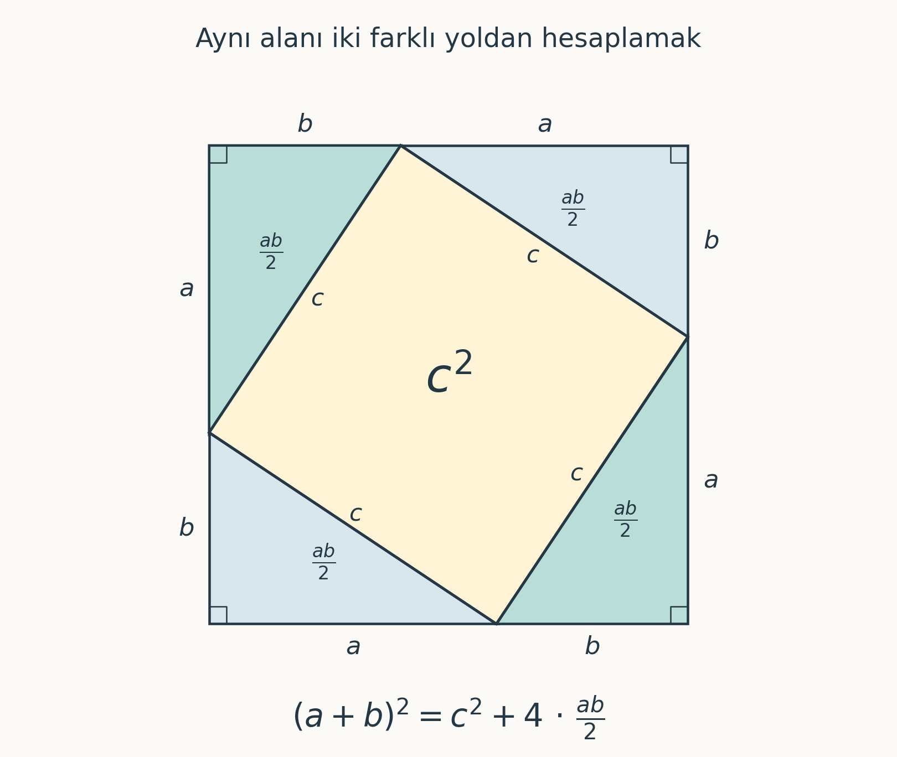

import ArticleVideo from '@/components/ArticleVideo.astro'
import teoreminAnlami from './media/01-teoremin-anlami.mp4?url'
import teoreminAnlamiPoster from './media/01-teoremin-anlami.jpg?url'
import alanIspati from './media/02-alan-ispati.mp4?url'
import alanIspatiPoster from './media/02-alan-ispati.jpg?url'
import karelerinTasinmasi from './media/03-karelerin-tasinmasi.mp4?url'
import karelerinTasinmasiPoster from './media/03-karelerin-tasinmasi.jpg?url'
import kokIki from './media/04-kok-iki.mp4?url'
import kokIkiPoster from './media/04-kok-iki.jpg?url'

Pisagor teoremi, okul yıllarından aklımızda kalan en tanıdık matematiksel ifadelerden biri:

$$
a^2+b^2=c^2
$$

Bir dik üçgen çizilir, iki kenarın uzunluğu verilir ve üçüncüsü sorulur. Sayıları formüle yerleştirir, işlemleri yapar ve sonucu buluruz. Bu işlem zamanla o kadar alışıldık hâle gelir ki formülün arkasındaki düşünceyi gözden kaçırabiliriz.

Oysa bu eşitliği anlamaya çalışmak bizi oldukça geniş bir alana götürür: geometrik şekillerin alanlarına, matematiksel ispatın nasıl çalıştığına, irrasyonel sayılara ve yüzyıllar boyunca çözüm beklemiş problemlere.

Bu yolculuğa teoremin tam olarak ne söylediğiyle başlayalım.

## 1. Pisagor Teoremi Nedir?

Pisagor teoremi, düzlem geometrisinde bir dik üçgenin kenar uzunlukları arasındaki ilişkiyi açıklar. Dik açıyı oluşturan kenarların uzunluklarına $a$ ve $b$, dik açının karşısındaki en uzun kenara, yani **hipotenüse**, $c$ dersek:

$$
a^2+b^2=c^2
$$

eşitliği geçerlidir.

Bu ifadenin geometrik anlamı, kenarların üzerine çizilen karelerde saklıdır. Dik kenarlar üzerine çizilen iki karenin alanlarının toplamı, hipotenüs üzerine çizilen karenin alanına eşittir.

Örneğin dik kenarları 3 ve 4 birim olan bir üçgende:

$$
3^2+4^2=9+16=25
$$

olduğundan hipotenüsün uzunluğu 5 birimdir.

Burada 9, 16 ve 25 sayıları, üçgenin kenarları üzerine çizilebilen karelerin alanlarını temsil eder. Böylece bir uzunluk problemi, alanlar arasındaki bir ilişkiyle çözülür.

Teoremi kullanırken dik açı koşuluna dikkat etmek gerekir. Her üçgenin kenarlarını bu eşitliğe yerleştiremeyiz. İlişkinin geçerliliği, üçgenin geometrik yapısına bağlıdır.

<ArticleVideo
  src={teoreminAnlami}
  poster={teoreminAnlamiPoster}
  title="Dik üçgenin kenarlarına kurulan kareler ve alan eşitliği"
  caption="Dik kenarlardaki iki karenin alanları toplamı, hipotenüsteki karenin alanına eşittir."
/>

## 2. Pisagor Teoreminin Tarihsel Yolculuğu

Teorem Pisagor’un adını taşısa da onunla bağlantılı matematiksel bilgiler çok daha eskiye uzanır.

Babil matematiğinden kalan tabletler, dik üçgenler ve karelerin köşegenleri üzerine yapılan hesapları günümüze taşır. Yale Babil Koleksiyonu’ndaki **YBC 7289** adlı tablet, bir kare çizimiyle birlikte $\sqrt{2}$ için oldukça hassas bir yaklaşık değer içerir. Bu çalışma, Pisagor’un yaşadığı dönemden bin yılı aşkın süre öncesine aittir. [Yale’ın tablet hakkındaki incelemesi](https://news.yale.edu/2016/04/11/3800-year-journey-classroom-classroom)

Teoremin ilk kez kim tarafından ispatlandığını belirlemek ise daha güçtür. Pisagor’un bizzat bir ispat geliştirdiğini kesin biçimde gösteren tarihsel kanıt bulunmaz; ona ilişkin anlatıların önemli bir bölümü çok daha sonraki kaynaklardan gelir.

Bu tarih, matematiksel bilginin farklı toplumların katkılarıyla geliştiğini gösterir. Hesaplama yöntemleri, geometrik gözlemler ve ispatlar zaman içinde birbirini beslemiştir.

Biz de aynı soruyu kendimiz sorabiliriz: Bu eşitlik birkaç örnekte çalışıyor olabilir; bütün dik üçgenlerde geçerli olduğunu nasıl gösterebiliriz?

## 3. Formül Neden Doğru?

Pisagor teoremini anlamanın en anlaşılır yollarından biri, aynı şeklin alanını iki farklı biçimde hesaplamaktır.

Dik kenarları $a$ ve $b$, hipotenüsü $c$ olan bir üçgen düşünelim. Bu üçgenden dört tane alıp aşağıdaki gibi yerleştirelim:

Dıştaki büyük karenin her bir kenarı $a+b$ uzunluğundadır. Dolayısıyla alanı:

$$
(a+b)^2
$$

olur.

İçeride kalan şeklin dört kenarı da üçgenlerin hipotenüslerinden oluşur ve $c$ uzunluğundadır. Ayrıca bir dik üçgenin iki dar açısının toplamı $90^\circ$ olduğundan, yerleşimde ortadaki şeklin her köşesi de $90^\circ$ olur. Böylece ortada gerçekten bir kare bulunduğunu söyleyebiliriz. Bu karenin alanı $c^2$’dir.

Dört üçgenin her birinin alanı ise:

$$
\frac{ab}{2}
$$

kadardır. Büyük karenin alanını, bu dört üçgenin alanlarıyla ortadaki karenin alanını toplayarak da hesaplayabiliriz:

$$
(a+b)^2=4\cdot\frac{ab}{2}+c^2
$$

Sol taraftaki ifadeyi açalım:

$$
a^2+2ab+b^2=2ab+c^2
$$

İki taraftan da $2ab$ çıkarınca:

$$
\boxed{a^2+b^2=c^2}
$$

elde ederiz.

Bu işlemlerde kenarlara belirli sayılar vermedik. Akıl yürütmemiz, herhangi bir dik üçgen için aynı şekilde çalışıyor. İspatın gücü burada ortaya çıkıyor: **Eşitliğin neden bütün dik üçgenlerde geçerli olduğunu açıklayabiliyoruz.**

<ArticleVideo
  src={alanIspati}
  poster={alanIspatiPoster}
  title="Dört eş üçgenin yeniden yerleştirilmesiyle Pisagor teoreminin alan ispatı"
  caption="Aynı dış karede aynı dört üçgen yeniden yerleşiyor. Geriye kalan alan değişmiyor: a² + b² = c²."
/>

## 4. Bir Karenin Köşegeni: √2 ve İrrasyonel Sayılar

Şimdi kenar uzunluğu 1 birim olan bir kare çizelim ve karşılıklı iki köşesini birleştirelim.

Köşegen, kareyi iki eş dik üçgene ayırır. Bu üçgenlerden birine Pisagor teoremini uygularsak, köşegenin uzunluğu $d$ için:

$$
d^2=1^2+1^2=2
$$

buluruz. Uzunluk pozitif olduğundan:

$$
d=\sqrt{2}
$$

olur.

Bu uzunluk yaklaşık olarak $1{,}41421356\ldots$ birimdir. Çizdiğimiz karenin belirli, sonlu bir köşegeni vardır. Buna karşılık onun uzunluğunu iki tam sayının oranıyla tam olarak ifade edemeyiz.

<ArticleVideo
  src={kokIki}
  poster={kokIkiPoster}
  title="Birim karenin köşegen uzunluğunun karekök iki olarak hesaplanması"
  caption="Kenarları 1 birim olan karenin köşegeni √2 birimdir; animasyonda bu uzunluk c ile gösteriliyor."
/>

Bunu göstermek için **olmayana ergi** yöntemini kullanabiliriz: Önce $\sqrt{2}$’nin bir kesir olarak yazılabildiğini kabul eder, bu kabulün sonuçlarını inceleriz.

Varsayalım ki:

$$
\sqrt{2}=\frac{p}{q}
$$

Burada $p$ ve $q$ pozitif tam sayılar olsun. Kesri tamamen sadeleştirmiş olalım; yani bu iki sayının 1’den büyük ortak böleni bulunmasın.

İki tarafın karesini aldığımızda:

$$
2=\frac{p^2}{q^2}
$$

ve buradan:

$$
p^2=2q^2
$$

elde ederiz.

Sağ taraf 2’nin katı olduğuna göre $p^2$ çifttir. Karesi çift olan bir tam sayının kendisi de çifttir; çünkü tek bir sayının karesi her zaman tek olur.

O hâlde $p=2k$ yazabiliriz. Bunu eşitliğe yerleştirelim:

$$
(2k)^2=2q^2
$$

$$
4k^2=2q^2
$$

$$
q^2=2k^2
$$

Bu kez $q^2$’nin, dolayısıyla $q$’nun da çift olduğunu görüyoruz.

Böylece hem $p$ hem de $q$ çift çıktı. İkisi de 2’ye bölünebiliyor. Ancak başlangıçta kesri tamamen sadeleştirdiğimizi söylemiştik. Ulaştığımız sonuç, başlangıç koşulumuzla çelişiyor.

Dolayısıyla $\sqrt{2}$, iki tam sayının oranı olarak yazılamaz. **İrrasyonel bir sayıdır.**

Buradaki sonsuzluk, sayının büyüklüğüyle ilgili değildir. $\sqrt{2}$, 1 ile 2 arasında sonlu bir sayıdır. Sonsuza uzanan şey, ondalık gösterimindeki basamaklardır; üstelik bu basamaklar bir noktadan sonra sabit bir döngüyle tekrar etmez.

Birim karenin köşegeni, böylece sayı anlayışımızı genişletir: Kesirlerle ifade edemediğimiz uzunluklar da vardır.

## 5. Pisagor Üçlüleri ve Sayılar Arasındaki Örüntüler

Bazı dik üçgenlerin üç kenarı da tam sayı uzunluklarına sahiptir:

$$
3^2+4^2=5^2
$$

$$
5^2+12^2=13^2
$$

$$
8^2+15^2=17^2
$$

Eşitliği sağlayan bu pozitif tam sayı gruplarına **Pisagor üçlüleri** denir.

<ArticleVideo
  src={karelerinTasinmasi}
  poster={karelerinTasinmasiPoster}
  title="3–4–5 üçgeninde 9 ve 16 birim karenin 25 birimlik kareyi doldurması"
  caption="3–4–5 örneğinde 9 ve 16 birim kare, şekilleri ve alanları değişmeden 25 birimlik kareyi dolduruyor."
/>

Bu üçlüleri belirli bir yöntemle üretebiliriz. $m>n>0$ olacak şekilde iki tam sayı seçelim ve:

$$
a=m^2-n^2,\qquad b=2mn,\qquad c=m^2+n^2
$$

tanımlarını kullanalım.

Örneğin $m=2$, $n=1$ seçersek:

$$
a=3,\qquad b=4,\qquad c=5
$$

elde ederiz. $m=3$, $n=2$ seçtiğimizde ise 5–12–13 üçlüsüne ulaşırız.

Yöntemin neden çalıştığını cebirle görebiliriz:

$$
(m^2-n^2)^2+(2mn)^2
=m^4+2m^2n^2+n^4
=(m^2+n^2)^2
$$

Başlangıçta birbirinden ayrı görünen örnekler, böylece ortak bir yapının parçaları hâline gelir. Örüntüyü fark etmek bizi bir tahmine götürür; cebirsel açıklama da bu tahmini gerekçelendirir.

## 6. Pisagor Teoreminin Kullanım Alanları

Pisagor teoremi, birbirine dik iki yöndeki uzaklıkları tek bir mesafe hesabında birleştirmemizi sağlar.

Örneğin bir noktadan 6 metre doğuya ve ardından 8 metre kuzeye ilerlediğimizi düşünelim. Yürüdüğümüz toplam yol 14 metredir. Başlangıç ve bitiş noktaları arasındaki kuş uçuşu mesafe ise:

$$
d=\sqrt{6^2+8^2}=\sqrt{100}=10
$$

metredir.

Aynı ilişki, düz bir koordinat sisteminde iki nokta arasındaki mesafeyi hesaplamak için kullanılır. Noktalar $(x_1,y_1)$ ve $(x_2,y_2)$ ise yatay ve düşey uzaklıklar bir dik üçgenin iki kenarını oluşturur:

$$
d=\sqrt{(x_2-x_1)^2+(y_2-y_1)^2}
$$

Bilgisayar grafiklerinde iki nesnenin birbirine ne kadar yakın olduğunu hesaplamak veya bir oyun karakterinin hedefe uzaklığını bulmak için bu bağıntıdan yararlanabiliriz.

İnşaatta da teoremin tersinden faydalanılır. Kenarları 3, 4 ve 5 birim olan bir üçgen oluşturulduğunda, 3 ve 4 birimlik kenarların arasındaki açı diktir. Bu ilişki, bir köşenin dikliğini kontrol etmenin geometrik temelini verir.

Bütün bu örneklerde yaptığımız şey, fiziksel bir durumu uzunluklar ve açılarla temsil etmektir. Kurduğumuz model duruma uygun olduğunda, matematik doğrudan ölçmenin zor olduğu bir mesafeyi hesaplamamıza yardımcı olur.

## 7. Pisagor’dan Fermat’ın Son Teoremine

Pisagor üçlüleriyle uğraşırken denklemde küçük bir değişiklik yapabiliriz: Kareler yerine küpler kullanırsak ne olur?

$$
a^3+b^3=c^3
$$

Bu eşitliği sağlayan pozitif tam sayılar bulunabilir mi? Daha genel olarak:

$$
a^n+b^n=c^n
$$

denkleminde $n$, 2’den büyük bir tam sayı olduğunda durum nasıldır?

**Fermat’ın Son Teoremi**, bu koşullarda denklemi sağlayan pozitif tam sayılar $a$, $b$ ve $c$ bulunmadığını söyler.

Burada sayıların pozitif tam sayı olması belirleyicidir. Örneğin gerçek sayılara izin verirsek:

$$
1^3+1^3=(\sqrt[3]{2})^3
$$

eşitliğini rahatlıkla yazabiliriz. Fermat’ın önermesi, çözümleri belirli bir sayı kümesinde aradığımızda ortaya çıkar.

İfadesi bu kadar kısa olan problemin genel ispatı yüzyıllar boyunca matematikçileri uğraştırdı. Andrew Wiles, Richard Taylor’ın da katkısıyla 1994 yılında genel ispatı tamamladı.

Bir denklemdeki üssü değiştirmek, bizi tamamen farklı bir matematiksel probleme götürebilir. Sorunun kolay anlaşılması, çözümünün de kolay olacağı anlamına gelmez.

## 8. Pisagor Teoreminin Düşünme Biçimimize Katkısı

Pisagor teoremi üzerinden birbirini tamamlayan birkaç düşünme adımını izleyebiliyoruz.

Önce bir ilişki fark ediyoruz: Bazı sayıların kareleri arasında belirli bir eşitlik var. Ardından geometrik bir düzen kurarak bu eşitliğin bütün dik üçgenler için neden geçerli olduğunu gösteriyoruz. Teoremi birim kareye uyguladığımızda, kesirlerle ifade edilemeyen bir uzunlukla karşılaşıyoruz. Denklemdeki üsleri değiştirdiğimizde ise yeni bir araştırma sorusu ortaya çıkıyor.

Bu süreçte her adım, kullandığımız kavramları biraz daha dikkatli tanımlamamızı gerektiriyor. Üçgenin dik olması, kesrin sadeleştirilmiş olması veya çözümlerin pozitif tam sayılarda aranması, ulaştığımız sonucun ayrılmaz parçaları.

Bir formülü gerçekten anlamak, onun hangi koşullarda çalıştığını ve neden doğru olduğunu açıklayabilmekle derinleşiyor. Pisagor teoremine bu gözle baktığımızda, tanıdık bir eşitliğin içinde yeni sorular bulabiliyoruz.

Bir karenin köşegenini çizmek bile, bildiğimizi düşündüğümüz sayılara yeniden bakmamız için yeterli olabiliyor.

## Kaynakça

Bu yazının çıkış noktası, Marcel Danesi’nin kitabındaki “Pisagor Teoremi: Matematiğin Doğuşu” bölümüdür. Babil tabletine ilişkin bilgiler için aşağıdaki Yale News yazısından da yararlanılmıştır.

- **Marcel Danesi — [Pisagor’un Mirası: 10 Muhteşem Fikir Üzerinden Matematik](https://www.ketebe.com/pisagorun-mirasi-marcel-danesi).** Çeviren: Emre Bekman. Ketebe Yayınları, 2021. Özellikle 1. bölüm.

- **Yale News — [A 3,800-year journey from classroom to classroom](https://news.yale.edu/2016/04/11/3800-year-journey-classroom-classroom).** Patrick Lynch, 11 Nisan 2016. Babil döneminden kalan YBC 7289 tabletini ve karekök iki hesabını anlatan yazı.

Çevrimiçi kaynaklara erişim tarihi: 20 Eylül 2026.
