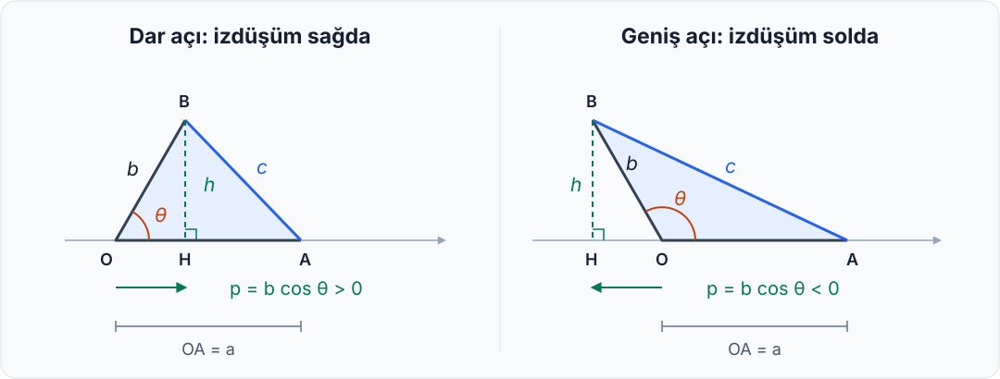

import ArticleVideo from '@/components/ArticleVideo.astro'
import ikiKenarSabit from './media/01-iki-kenar-sabit.mp4?url'
import ikiKenarSabitPoster from './media/01-iki-kenar-sabit.jpg?url'
import uzunluklardanAci from './media/06-uzunluklardan-aci.mp4?url'
import uzunluklardanAciPoster from './media/06-uzunluklardan-aci.jpg?url'

Birbirine bir uçlarından bağlı, uzunlukları 3 ve 4 birim olan iki çubuk düşünelim. Çubukları aralarında dik açı olacak şekilde açtığımızda, serbest uçları arasındaki mesafeyi biliyoruz:

$$
c=\sqrt{3^2+4^2}=5
$$

Şimdi bağlantı noktasını bir menteşe gibi kullanalım ve çubukları birbirine yaklaştıralım. Uzunlukları değişmediği hâlde uçları arasındaki mesafe küçülür. Çubukları daha fazla açtığımızda ise mesafe büyür.

Demek ki iki kenarın uzunluğunu bilmek, üçüncü kenarı belirlemeye yetmiyor. **Aralarındaki açıyı da bilmemiz gerekiyor.**

[Önceki yazıda](/blog/pisagor-teoremi/) Pisagor teoreminin neden doğru olduğunu alanlar üzerinden incelemiştik. Bu kez onun koşullarından birini değiştireceğiz: Üçgenin dik olmasını istemeyeceğiz.

Bu küçük değişiklik bizi kosinüs teoremine götürecek. Yola, açıların bir uzunluk hesabına nasıl katıldığını anlamakla başlayalım.

## 1. İki Kenar Sabitken Neler Değişir?

Çubukların ortak ucuna $O$, diğer uçlarına $A$ ve $B$ diyelim. Uzunlukları şöyle adlandıralım:

$$
OA=a,\qquad OB=b,\qquad AB=c
$$

$a$ ve $b$ kenarlarının arasındaki açıya da $\theta$ diyelim. Böylece $c$, bu açının karşısındaki kenar olur. Artık üçgenimizin dik olması gerekmediğinden, $c$ için hipotenüs adını kullanmayacağız.

$OA$ çubuğunu yatay tutup $OB$ çubuğunu yukarı doğru döndürelim. $B$ noktası, merkezi $O$ ve yarıçapı $b$ olan bir çember yayı üzerinde hareket eder. $A$ ise yerinde kalır.

Uçlar arasındaki mesafenin iki sınırını zihnimizde canlandırabiliriz. Çubuklar aynı yöne doğru neredeyse kapandığında $c$, $|a-b|$ değerine yaklaşır. Ters yönlere doğru neredeyse tamamen açıldığında ise $a+b$ değerine yaklaşır.

3 ve 4 birimlik çubuklarımız için bu sınırlar 1 ve 7’dir. Dik açıda bulduğumuz Bu bağıntıya, bu iki sınırın arasındaki değerlerden yalnızca biridir.

Tam kapalı ve tam açık konumlarda üç nokta aynı doğru üzerinde kalır; artık alanı olan bir üçgen oluşmaz. Bu nedenle gerçek bir üçgende:

$$
|a-b|<c<a+b
$$

olur.

<ArticleVideo
  src={ikiKenarSabit}
  poster={ikiKenarSabitPoster}
  title="OA ve OB çubukları: açı değişirken AB uzaklığı"
  caption="OA (4 birim) sabit kalırken OB (3 birim), O noktası etrafında döner. Çubukların uzunlukları değişmez; aralarındaki açıyla birlikte AB uzaklığı değişir."
/>

Peki aradaki bir açı için $c$’yi nasıl hesaplarız?

## 2. Bir Kenarın Yatay Gölgesi: İzdüşüm

$B$ noktasından, $OA$’nın üzerinde bulunduğu yatay doğruya bir dikme indirelim. Dikmenin ayağına $H$ diyelim.

$B$’nin yatay konumunu $p$, bu doğruya olan yüksekliğini $h$ ile göstereceğiz. Başlangıç noktası $O$ olduğuna göre:

$$
O=(0,0),\qquad A=(a,0),\qquad B=(p,h)
$$

yazabiliriz.

$p$, eğik duran $OB$ kenarının yatay doğrultudaki **işaretli izdüşümüdür**. Bunu, yukarıdan dik gelen ışık altında çubuğun yatay doğruya düşen gölgesi gibi düşünebiliriz. Ancak bir ayrıntıyla: Sağa düşen izdüşümü pozitif, sola düşeni negatif kabul ediyoruz.

Dar açıda $OBH$ dik üçgeninden kosinüsü hatırlayalım:

$$
\cos\theta=\frac{\text{komşu dik kenar}}{\text{hipotenüs}}=\frac{p}{b}
$$

Buradan:

$$
p=b\cos\theta
$$

elde ederiz. Yani kosinüs, çubuğun uzunluğunun ne kadarının yatay doğrultuya yansıdığını söyler.

Açı $90^\circ$ olduğunda $B$, tam $O$’nun üstündedir; yatay izdüşüm sıfırdır. Açı $90^\circ$’yi geçtiğinde $B$, $O$’nun soluna geçer ve $p$ negatif olur. Kosinüsün çember üzerinden yapılan tanımı bu işareti de kapsar: Yarıçapı 1 olan bir çemberde, pozitif yatay yönden ölçülen $\theta$ açısına karşılık gelen noktanın yatay koordinatı $\cos\theta$’dır.

Bu yüzden $p=b\cos\theta$ ilişkisini geniş açılarda da kullanabiliriz. Negatif olan fiziksel bir uzunluk değil, seçtiğimiz yöne göre yatay konumdur.

## 3. İki Kez Pisagor, Bir Yeni Teorem

Şimdi şeklimizdeki iki uzaklığı ayrı ayrı hesaplayalım.

$O$ ile $B$ arasındaki yatay fark $p$, düşey fark $h$ olduğundan Pisagor bize:

$$
b^2=p^2+h^2
$$

eşitliğini verir. Buradan yüksekliğin karesini ayırabiliriz:

$$
h^2=b^2-p^2
$$

$A$ ile $B$ arasındaki yatay uzaklık ise $|a-p|$, düşey uzaklık yine $h$’dir. Pisagor’u bir kez daha uygulayalım:

$$
c^2=(a-p)^2+h^2
$$

Bir önceki eşitlikte bulduğumuz $h^2$ ifadesini yerine yazarsak:

$$
c^2=(a-p)^2+b^2-p^2
$$

olur. Parantezi açalım:

$$
c^2=a^2-2ap+p^2+b^2-p^2
$$

$p^2$ terimleri birbirini götürür:

$$
c^2=a^2+b^2-2ap
$$

Son olarak $p=b\cos\theta$ yazdığımızda:

$$
\boxed{c^2=a^2+b^2-2ab\cos\theta}
$$

elde ederiz. Bu bağıntıya **kosinüs teoremi** denir. Düzlemdeki bütün üçgenler için geçerlidir; $\theta$, her zaman $a$ ve $b$ kenarlarının arasındaki, $c$ kenarının karşısındaki açıdır. [OpenStax — Kosinüs teoremi](https://openstax.org/books/precalculus-2e/pages/8-2-non-right-triangles-law-of-cosines)

İspatta $p$’nin pozitif olduğunu varsaymadık. Yatay farkların karelerini kullandığımız için dikmenin ayağı kenarın üzerinde de olsa, uzantısına da düşse aynı hesap çalışır.

Yeni bağıntıya ulaşırken kullandığımız temel araç hâlâ Pisagor’du. Genel bir üçgenin içine dik üçgenler yerleştirmek, bildiğimiz ilişkiyi daha geniş bir alana taşımamızı sağladı.

## 4. Formüldeki Ek Terim Ne Anlatıyor?

Pisagor’dan farklı görünen kısım:

$$
-2ab\cos\theta
$$

terimidir. İspatın bir önceki satırında bunu $-2ap$ biçiminde görmüştük. Kaynağı, yatay uzaklığı hesaplarken açtığımız $(a-p)^2$ ifadesidir.

Böylece bu terimin geometrik anlamını da biliyoruz: İki kenarın arasındaki açı değiştikçe yatay izdüşüm değişir; bu değişim, uçlar arasındaki mesafeye yansır.

Üç durumu ayrı ayrı okuyabiliriz:

| Kenarlar arasındaki açı | Kosinüsün işareti | Kenarların kareleri arasındaki ilişki |
| --- | --- | --- |
| Dar açı | Pozitif | $c^2<a^2+b^2$ |
| Dik açı | Sıfır | $c^2=a^2+b^2$ |
| Geniş açı | Negatif | $c^2>a^2+b^2$ |

Dik açıda ek terim kaybolur:

$$
c^2=a^2+b^2-2ab\cdot 0=a^2+b^2
$$

**Pisagor teoremi, kosinüs teoreminin açı $90^\circ$ olduğundaki özel durumudur.** [University of Nebraska–Lincoln — Sinüs ve kosinüs teoremleri](https://mathbooks.unl.edu/PreCalculus/LOS-LOC.html)

Önceki yazıda kenarlara kurduğumuz kareleri de hatırlayabiliriz. Artık $c$ kenarındaki karenin alanı, diğer iki karenin alanları toplamından küçük, ona eşit veya ondan büyük olabilir. Hangi durumun gerçekleşeceğini açı belirler.

## 5. Aynı İki Kenar, Üç Farklı Üçgen

Başlangıçtaki 3 ve 4 birimlik çubuklara dönelim. Bu kez açıyı $60^\circ$ yapalım. $\cos60^\circ=\tfrac12$ olduğundan:

$$
c^2=3^2+4^2-2\cdot3\cdot4\cdot\frac12
=25-12=13
$$

Dolayısıyla:

$$
c=\sqrt{13}\approx3{,}61
$$

birimdir. Açı daraldığında uçlar birbirine yaklaşmıştır.

Şimdi açıyı $120^\circ$ yapalım. Bu kez $\cos120^\circ=-\tfrac12$:

$$
c^2=3^2+4^2-2\cdot3\cdot4\cdot\left(-\frac12\right)
=25+12=37
$$

Buradan:

$$
c=\sqrt{37}\approx6{,}08
$$

buluruz. Çubuklar daha fazla açılmış, uçlar birbirinden uzaklaşmıştır.

Üç durumu yan yana koyalım:

| $a$ | $b$ | Aralarındaki açı | Karşı kenar $c$ |
| --- | --- | --- | --- |
| 4 | 3 | $60^\circ$ | $\sqrt{13}\approx3{,}61$ |
| 4 | 3 | $90^\circ$ | $5$ |
| 4 | 3 | $120^\circ$ | $\sqrt{37}\approx6{,}08$ |

3 ve 4 sayıları tek başına 5’i zorunlu kılmaz. 5 sonucunu veren, bu iki uzunluğun dik açıyla bir araya gelmesidir.

## 6. Uzunluklardan Açıyı Bulmak

Kosinüs teoremini ters yönde de kullanabiliriz. Üç kenarı bildiğimizde eşitliği açı için düzenleyelim:

$$
\cos\theta=\frac{a^2+b^2-c^2}{2ab}
$$

Örneğin iki çubuğumuz yine 3 ve 4 birim olsun; bu kez serbest uçları arasında tam 6 birim ölçelim. O zaman:

$$
\cos\theta=\frac{9+16-36}{24}=-\frac{11}{24}
$$

Kosinüs negatif çıktığı için, açının geniş olduğunu daha derece değerini hesaplamadan söyleyebiliriz. Ters kosinüs işlemini uygularsak:

$$
\theta=\arccos\left(-\frac{11}{24}\right)\approx117{,}3^\circ
$$

buluruz. Buradaki $\arccos$, verilen kosinüs değerine karşılık gelen açıyı bulur; $1/\cos\theta$ anlamına gelmez.

<ArticleVideo
  src={uzunluklardanAci}
  poster={uzunluklardanAciPoster}
  title="Üç kenardan açıyı bulmak: 3, 4 ve 6 birimlik üçgen"
  caption="OA 4 birimken, O’ya 3 ve A’ya 6 birim uzaklıktaki B noktasını buluyoruz. Üçgen tamamlandığında O açısı kosinüs teoremiyle yaklaşık 117,3° olarak hesaplanıyor."
/>

Bu hesap, erişemediğimiz iki noktanın arasındaki mesafeyi bulmak için de kullanılabilir. Örneğin aynı gözlem noktasından iki hedefin uzaklıklarını ve görüş doğrultuları arasındaki açıyı ölçebilirsek, hedefler arasındaki mesafeyi hesaplayabiliriz. Bunun için ölçümleri aynı düzlemde bir üçgen olarak modelleyebilmemiz gerekir.

## 7. Uzunluklara Yön Eklemek: Vektörler

Çubuklarımızın üzerine $O$’dan uçlarına doğru oklar çizelim. Artık yalnızca uzunlukları değil, yönleri de gösteriyoruz. Bu okları iki vektör olarak adlandıralım:

$$
\mathbf{u}=\overrightarrow{OA},\qquad
\mathbf{v}=\overrightarrow{OB}
$$

Vektörlerin uzunlukları $\|\mathbf{u}\|=a$ ve $\|\mathbf{v}\|=b$’dir. $A$’dan $B$’ye giden vektör ise $\mathbf{v}-\mathbf{u}$ olur; dolayısıyla uzunluğu $c$’dir.

İki vektörün **skaler çarpımı**, bileşenler üzerinden şöyle hesaplanır:

$$
\mathbf{u}\cdot\mathbf{v}=u_xv_x+u_yv_y
$$

Sonuç bir sayıdır. Bizim seçtiğimiz koordinatlarda $\mathbf{u}=(a,0)$ ve $\mathbf{v}=(p,h)$ olduğundan:

$$
\mathbf{u}\cdot\mathbf{v}=ap=a\,b\cos\theta
$$

elde ederiz. Genel olarak da:

$$
\mathbf{u}\cdot\mathbf{v}
=\|\mathbf{u}\|\,\|\mathbf{v}\|\cos\theta
$$

ilişkisi geçerlidir. Böylece skaler çarpım, uzunluklarla aralarındaki açıyı aynı ifadede birleştirir. [OpenStax — Vektörler ve skaler çarpım](https://openstax.org/books/precalculus-2e/pages/8-8-vectors)

Kosinüs teoremimizi bu dille yeniden yazabiliriz:

$$
\|\mathbf{v}-\mathbf{u}\|^2
=\|\mathbf{u}\|^2+\|\mathbf{v}\|^2
-2\,\mathbf{u}\cdot\mathbf{v}
$$

Oklar birbirine dik olduğunda skaler çarpımları sıfırdır ve yine Pisagor’a ulaşırız. Başlangıçta iki çubuk arasındaki mesafeyi sorarken, şimdi yönlü büyüklükler arasındaki ilişkiyi anlatan bir ifadeye sahibiz.

Bu bağlantı, vektörlerle çalışmaya başladığımızda uzunluk ve açı hesaplarını neden birlikte ele aldığımızı görmemizi sağlar.

## 8. Bir Koşulu Değiştirince

Pisagor teoreminde dik açı, hesabın belirleyici koşuluydu. Bu koşulu kaldırdığımızda, aradığımız uzunluğu belirlemek için açı bilgisini de kullanmamız gerekti.

Açının hesaba nasıl katılacağını izdüşüm gösterdi. İki kez Pisagor uygulayarak kosinüs teoremine ulaştık; vektörleri tanıdığımızda da aynı izdüşümün skaler çarpımın içinde bulunduğunu gördük.

Bu yolculuk, bildiğimiz bir sonucu genelleştirmenin nasıl çalıştığına küçük bir örnek sunuyor. Önce bir varsayımı değiştiriyor, sonra hangi bilginin eksildiğini araştırıyoruz. Yeni bağıntı, eski sonucu da içinde taşıyor.

Bir sonraki adımda çubukların yerine hareketleri veya kuvvetleri koyabiliriz. İki farklı yöndeki hareket bir araya geldiğinde ortaya nasıl bir hareket çıkar? Üçgende başladığımız uzunluk ve açı hesabı, bu kez vektörlerin toplamı olarak karşımıza çıkacak.

## Kaynakça

Yazıdaki çubuk modeli, sayısal örnekler ve anlatım bu yazı için hazırlanmıştır. Kosinüs teoremi ile skaler çarpımın standart tanım ve bağıntıları için şu açık ders kaynaklarından yararlanılmıştır:

- **OpenStax — [Precalculus 2e, 8.2: Non-right Triangles — Law of Cosines](https://openstax.org/books/precalculus-2e/pages/8-2-non-right-triangles-law-of-cosines).** Kosinüs teoremi ve koordinat düzlemindeki ispatı.
- **University of Nebraska–Lincoln — [The Laws of Sines and Cosines](https://mathbooks.unl.edu/PreCalculus/LOS-LOC.html).** Kosinüs teoreminin Pisagor teoremiyle ilişkisi.
- **OpenStax — [Precalculus 2e, 8.8: Vectors](https://openstax.org/books/precalculus-2e/pages/8-8-vectors).** Vektörler, bileşenler ve skaler çarpım.

Çevrimiçi kaynaklara erişim tarihi: 21 Eylül 2026.
