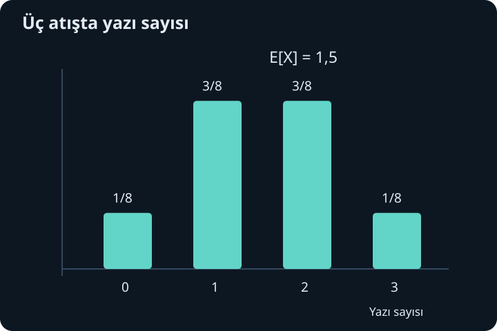
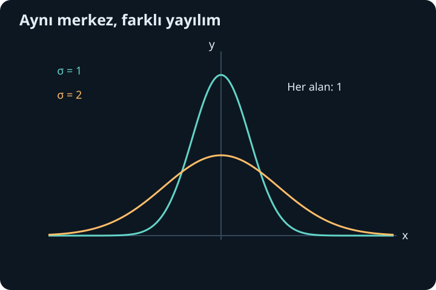

import ArticleVideo from '@/components/ArticleVideo.astro'
import kavram from './media/01-kavram.mp4?url'
import kavramPoster from './media/01-kavram.jpg?url'

Üç para atışının bütün sonuçlarını yazmak mümkündür, fakat bazen yalnız kaç yazı geldiğiyle ilgileniriz. Farklı atış sıraları aynı sayıya karşılık gelebilir. Rastgele değişken, denemenin ayrıntılı sonucunu ilgilendiğimiz sayısal bilgiye dönüştürür. Bu sayıların olasılıkları bir dağılım oluşturur; ortalama ve yayılım da dağılımın farklı özelliklerini özetler.

[Önceki yazıda](/blog/olasilik-sayma-ve-kosullu-bilgi/) örnek uzay, olay, koşullu olasılık ve bağımsızlığı kurduk. Şimdi bunları toplamlar ve integrallerle birleştireceğiz. Ayrık değerlerde tek tek olasılıkları, sürekli değerlerde ise aralık olasılıklarını kullanacağız. Son bölümde çok sayıda bağımsız ölçümün ortalamasının neden daha az oynadığını ve bunun hangi tür belirsizlikleri azaltmadığını açıklayacağız.

## 1. Rastgele değişken bir fonksiyondur

Bir örnek uzay $\Omega$ üzerindeki **rastgele değişken**, her sonuca bir gerçek sayı atayan $X:\Omega\to\mathbb R$ fonksiyonudur. Büyük $X$ fonksiyonun kendisini, küçük $x$ ise alabileceği belirli bir değeri gösterir. Rastgele olan, deneyin hangi sonucunun gerçekleşeceğidir; sayı atama kuralı sabittir.

Üç para atışında $X$ yazı sayısı olsun. Yazı-tura-yazı ile tura-yazı-yazı farklı temel sonuçlardır, fakat ikisinde de $X=2$ olur. Adil ve bağımsız atışlarda sekiz sıralı sonuç eşit olasılıklıdır. $X=0,1,2,3$ değerlerinin olasılıkları sırasıyla $1/8,3/8,3/8,1/8$'dir.

Bu dört sayısal sonuç eşit olasılıklı değildir. Rastgele değişken, birçok temel sonucu aynı değerde topladığı için ağırlıklar değişir. Önceki yazıdaki iki zarın toplamı örneği de aynı yapıya sahiptir. Dağılımı kurarken hangi temel sonuçların aynı sayıya gönderildiğini dikkatle sayarız.

## 2. Ayrık dağılım ve normalizasyon

Sonlu veya sayılabilir değerler alan bir değişkene ayrık rastgele değişken denir. $p_X(x)=P(X=x)$ fonksiyonu her değerin olasılığını verir; buna olasılık kütle fonksiyonu diyebiliriz. Koşullar:

$$
p_X(x)\geq0,\qquad\sum_xp_X(x)=1
$$

şeklindedir. Toplamın 1 olması **normalizasyon** koşuludur: mümkün değerlerden biri gerçekleşecektir. Bir değer kümesine ait olasılık, o kümedeki kütlelerin toplamıdır.

Üç atış örneğinde $P(X\geq2)=3/8+1/8=1/2$ olur. $P(X=1{,}5)=0$'dır çünkü bu değer sayım değişkeninin mümkün sonucu değildir. Birazdan ortalamasının 1,5 çıkması, deneyin tek seferde bir buçuk yazı üreteceği anlamına gelmeyecek.

Dağılım grafiğinde ayrık olasılıkları sütun yükseklikleri veya noktalarla gösterebiliriz. Sürekli yoğunluk grafiğindeki alan yorumunu bu sütunlarla karıştırmamalıyız. Ayrık modelde temel ağırlık tek tek değerlere atanır; eksen üzerinde çubukların görsel genişliğini değiştirmek olasılığı değiştirmez.

## 3. Birikimli dağılım iki türü birleştirir

Her rastgele değişken için birikimli dağılım fonksiyonu:

$$
F_X(x)=P(X\leq x)
$$

olarak tanımlanır. Girdi büyüdükçe daha çok sonucu kapsadığı için azalmayan bir fonksiyondur. Sol uçta 0'a, sağ uçta 1'e yaklaşır. Sağdan süreklidir; ayrık olasılık kütleleri grafikte sıçrama üretir.

Üç atış örneğinde $x<0$ için 0, $0\leq x<1$ için $1/8$, $1\leq x<2$ için $1/2$, $2\leq x<3$ için $7/8$, $x\geq3$ için 1 olur. Her sıçramanın büyüklüğü ilgili noktanın olasılığıdır. Örneğin 2 noktasındaki sıçrama $7/8-1/2=3/8$'dir.

Aralık olasılığı $P(a<X\leq b)=F_X(b)-F_X(a)$ ile bulunur. Uçlardaki eşitlik işaretleri ayrık modellerde önemlidir. Sürekli yoğunluğu olan modellerde tek noktanın olasılığı sıfır olacağı için açık veya kapalı uç aynı sonucu verir. Bu farkı dağılım türünden bağımsız bir yazım alışkanlığı gibi görmeyiz.

## 4. Beklenen değer ağırlıklı ortalamadır

Ayrık $X$ için **beklenen değer** veya ortalama:

$$
\mu=E[X]=\sum_xx\,p_X(x)
$$

olarak tanımlanır; sonsuz değer kümesinde $\sum|x|p_X(x)<\infty$ koşulu ortalamanın sonlu ve iyi tanımlı olması için yeterlidir. $E$ işleci olasılık ağırlıklı toplama yapar. $\mu$ harfi ortalamayı gösterir.

Üç adil atışta $E[X]=(0+3+6+3)/8=12/8=3/2$ olur. Bu sayı olası tek bir sonuç olmak zorunda değildir; çok sayıda tekrardaki ortalamanın etrafında toplandığı merkezdir. “Beklenen” sözcüğü “bir sonraki denemede kesin çıkacak” anlamına gelmez.

Bir $g$ fonksiyonu için $E[g(X)]=\sum_xg(x)p_X(x)$ kullanılır. Özellikle $E[X^2]$ kareleri önce alıp sonra ağırlıklı toplar. Genel olarak $E[X^2]$ ile $(E[X])^2$ aynı değildir. Ortalama alma doğrusal işlemlere dağılır, fakat kare alma gibi doğrusal olmayan işlemlere gelişigüzel taşınamaz.

## 5. Varyans ve standart sapma

Ortalama çevresindeki yayılımı ölçmek için sapmaların karelerinin ortalamasını alırız:

$$
\operatorname{Var}(X)=E[(X-\mu)^2]=E[X^2]-\mu^2.
$$

İkinci eşitlik kareyi açıp $E[X]=\mu$ kullanmaktan gelir. Varyans negatif olamaz. **Standart sapma** $\sigma=\sqrt{\operatorname{Var}(X)}$'dır. $X$ metre birimindeyse varyans metrekare, standart sapma metre birimindedir. Standart sapmayı kullanmanın yararlarından biri, asıl değişkenle aynı birimde olmasıdır.

Üç atışta $E[X^2]=(0+3+12+9)/8=3$ olur. Varyans $3-(3/2)^2=3/4$, standart sapma $\sqrt3/2$'dir. Bu değer dağılımın ne kadar yayıldığını özetler. Ortalama tek başına yeterli değildir: sürekli 1 üreten değişkenle eşit olasılıkla 0 veya 2 üreten değişkenin ortalaması 1'dir, fakat varyansları sırasıyla 0 ve 1'dir.

Standart sapma genel olarak ortalamadan mutlak uzaklığın ortalaması değildir. Kare alma uzak sapmaları daha güçlü ağırlıklandırır. Hangi yayılım ölçüsünün kullanıldığını söylemek, farklı raporlardaki sayıları doğru karşılaştırmak için gerekir.

## 6. Bernoulli ve binom dağılımı

Tek denemede başarıya 1, başarısızlığa 0 veren değişken Bernoulli değişkenidir. Başarı olasılığı $p$ ise $P(X=1)=p$, $P(X=0)=1-p$ olur. $X^2=X$ olduğundan $E[X]=p$ ve $\operatorname{Var}(X)=p-p^2=p(1-p)$ bulunur.

Bağımsız, aynı başarı olasılığına sahip $n$ Bernoulli denemesinin başarı sayısına binom dağılımlı değişken denir. Tam $k$ başarı için başarı konumları $\binom nk$ biçimde seçilir. Her sıranın olasılığı $p^k(1-p)^{n-k}$ olduğundan:

$$
P(X=k)=\binom nkp^k(1-p)^{n-k},\qquad k=0,\ldots,n.
$$

Toplamın 1 olması binom açılımından da görülür: $\sum_k\binom nkp^k(1-p)^{n-k}=[p+(1-p)]^n=1$. Denemelerin olasılıkları farklıysa veya denemeler bağımlıysa bu formül doğrudan kullanılamaz.

Her denemenin gösterge değişkenini $X_j$ yazarsak toplam başarı sayısı $X=\sum_jX_j$'dir. Beklenen değerin doğrusallığı $E[X]=np$ verir. Bağımsızlık altında varyanslar da toplanır ve $\operatorname{Var}(X)=np(1-p)$ olur. Varyans toplamının neden bağımsızlık istediğini birazdan kovaryansla açıklayacağız.

## 7. Sürekli yoğunluk nokta olasılığı değildir

Yoğunluk fonksiyonu olan bir sürekli rastgele değişkende $f_X(x)\geq0$ ve:

$$
\int_{-\infty}^{\infty}f_X(x)dx=1,
\qquad
P(a\leq X\leq b)=\int_a^bf_X(x)dx
$$

olur. Olasılık eğrinin yüksekliği değil, aralık altındaki alandır. $f_X(x)$ değeri 1'den büyük olabilir; toplam alan 1 kaldığı sürece sorun yoktur. $X$ saniyeyle ölçülüyorsa yoğunluğun birimi saniyenin tersidir, böylece yoğunluk ile aralık genişliğinin çarpımı boyutsuz olasılık verir.

Tek noktada aralık genişliği sıfır olduğundan $P(X=x)=0$ olur. Buna rağmen bir denemede bir değer gerçekleşir. Sürekli modelde sıfır olasılık, mantıksal olarak boş olayla aynı değildir. Gerçek ölçüm cihazları da genellikle tam bir gerçek sayı yerine sonlu çözünürlüklü bir aralık raporlar.

Yoğunluk varsa $F_X(x)=\int_{-\infty}^xf_X(t)dt$ olur. Yoğunluğun sürekli olduğu noktalarda temel teorem $F_X'=f_X$ verir. Her dağılımın yoğunluğu olmak zorunda değildir; ayrık ve sürekli bileşenleri karışan modeller de vardır. Burada iki temel türü ayrı ve açık biçimde kuruyoruz.

## 8. Düzgün dağılım örneği

$[a,b]$ aralığında eşit uzunluktaki aralıkların eşit olasılıklı olduğu modelde yoğunluk $1/(b-a)$, dışarıda 0'dır. Buna düzgün dağılım denir. Yükseklik ile toplam genişliğin çarpımı 1 olduğundan normalizasyon sağlanır.

$X$, 2 ile 6 arasında düzgün dağılsın. Yoğunluk $1/4$, $P(3\leq X\leq5)=2/4=1/2$ olur. Ortalama:

$$
E[X]=\frac14\int_2^6x dx=4.
$$

İkinci moment $E[X^2]=\frac14[x^3/3]_2^6=52/3$ ve varyans $52/3-16=4/3$ olur. Standart sapma $2/\sqrt3$'tür. Genel hesap düzgün dağılımda ortalamanın $(a+b)/2$, varyansın $(b-a)^2/12$ olduğunu verir.

Sürekli beklenen değerlerin formülü de aynı ağırlıklı toplama fikridir: $E[g(X)]=\int g(x)f_X(x)dx$, uygun integrallenebilirlik koşuluyla. Ayrık toplam ile sürekli integral arasında kavramsal farktan çok ağırlığın nasıl dağıtıldığı farkı vardır.

## 9. Gauss dağılımı ve normalizasyon

Ortalaması $\mu$, standart sapması $\sigma>0$ olan normal veya Gauss yoğunluğu:

$$
f_X(x)=\frac1{\sigma\sqrt{2\pi}}
\exp\left[-\frac{(x-\mu)^2}{2\sigma^2}\right]
$$

şeklindedir. $\exp(u)=e^u$ gösterimidir. Önceki integral yazısında $\int_{-\infty}^{\infty} e^{-a(x-b)^2}dx=\sqrt{\pi/a}$ sonucunu bütün gerçek doğru için kurduk. $a=1/(2\sigma^2)$ konunca integral $\sigma\sqrt{2\pi}$ olur; öndeki katsayı bunu 1'e normalleştirir.

$\mu$ eğrinin merkezini kaydırır. $\sigma$ büyürse dağılım yayılır ve tepe alçalır; alan 1 kalır. Yoğunluğu genişletirken yüksekliği aynı bırakmak toplam olasılığı değiştirirdi. Standart normal değişken $Z$ için $\mu=0$, $\sigma=1$'dir. Genel $X$ değişkenini $Z=(X-\mu)/\sigma$ ile standart ölçeğe dönüştürebiliriz.

Simetriden standart normalin ortalaması 0'dır. Varyansını görmek için $\varphi(z)=e^{-z^2/2}/\sqrt{2\pi}$ yazalım. $\varphi'=-z\varphi$ olduğundan kısmi integrasyon:

$$
\int_{-\infty}^{\infty}z^2\varphi(z)dz
=[-z\varphi(z)]_{-\infty}^{\infty}+\int_{-\infty}^{\infty}\varphi(z)dz=1
$$

verir. Üstel kuyruk yüzünden sınır terimi sıfırdır. Dolayısıyla ölçekleme sonrası $X$'in varyansı gerçekten $\sigma^2$ olur; parametrenin adı formülle uyumludur.

## 10. Ölçek ve değişken dönüşümü

$Y=aX+b$ olsun. Beklenen değerin doğrusallığı $E[Y]=aE[X]+b$ verir. Merkezden sapma $Y-E[Y]=a(X-E[X])$ olduğundan:

$$
\operatorname{Var}(Y)=a^2\operatorname{Var}(X),\qquad
\sigma_Y=|a|\sigma_X.
$$

Kaydırma $b$ ortalamayı değiştirir ama yayılımı değiştirmez. Negatif $a$ yönü ters çevirir; standart sapma negatif olamayacağı için mutlak değer kullanılır. Birim dönüşümlerinde bu fark özellikle önemlidir.

Yoğunluğu dönüştürmek için $a\ne0$ durumunda $x=(y-b)/a$ ve küçük uzunlukların ilişkisi $|dx|=|dy|/|a|$ kullanılır. Sonuç $f_Y(y)=f_X((y-b)/a)/|a|$ olur. Bu, çok katlı integrallerde gördüğümüz Jacobian ölçek fikrinin tek değişkenli biçimidir. Daha genel dönüşüm birden çok girdiyi aynı çıktıya götürüyorsa bütün uygun ters dalların katkıları toplanmalıdır.

Örneğin $X$, $[0,1]$ üzerinde düzgünse $Y=2X+3$, $[3,5]$ üzerinde yoğunluğu $1/2$ olan düzgün dağılımdır. Aralık iki kat genişlediği için yükseklik yarıya iner. $a=0$ ise $Y=b$ sabit değişkendir; sıradan sürekli yoğunluk formülünde sıfıra bölme yapamayız.

## 11. Kovaryans ve toplamın yayılımı

İki değişkenin birlikte sapmasını **kovaryans** ölçer:

$$
\operatorname{Cov}(X,Y)=E[(X-E[X])(Y-E[Y])].
$$

Sonlu ikinci momentler altında $E[XY]-E[X]E[Y]$ biçiminde de yazılır. Pozitif değer, merkezden sapmaların aynı yönde birlikte olma eğilimini; negatif değer zıt yönü gösterir. Birimi $X$ ile $Y$ birimlerinin çarpımıdır.

Kare açılımından:

$$
\operatorname{Var}(X+Y)=\operatorname{Var}(X)+\operatorname{Var}(Y)+2\operatorname{Cov}(X,Y)
$$

elde edilir. Bağımsız değişkenlerde ortak dağılım ayrıştığı için $E[XY]=E[X]E[Y]$ ve kovaryans sıfır olur. Böylece varyanslar toplanır. Beklenen değerlerin toplanması ise bağımsızlık gerektirmez; bu iki kuralı ayırmalıyız.

Sıfır kovaryans bağımsızlık demek değildir. $X$, $[-1,1]$ üzerinde düzgün olsun ve $Y=X^2$ seçilsin. Simetriden $E[X]=0$, $E[X^3]=0$ olduğundan kovaryans sıfırdır. Buna rağmen $Y$, $X$ tarafından tamamen belirlenir. Kovaryans yalnız belirli bir doğrusal birlikte değişim bilgisidir; bütün bağımlılık türlerini yakalamaz.

## 12. Çok sayıda tekrarın ortalaması

$X_1,\ldots,X_n$ bağımsız, aynı dağılımlı, sonlu ortalama $\mu$ ve sonlu varyans $\sigma^2$ taşısın. Örnek ortalaması $\overline X_n=(X_1+\cdots+X_n)/n$ olsun. Doğrusallık ve bağımsızlıkla:

$$
E[\overline X_n]=\mu,\qquad
\operatorname{Var}(\overline X_n)=\frac{\sigma^2}{n}.
$$

Dolayısıyla ortalamanın standart sapması $\sigma/\sqrt n$'dir. Dört kat tekrar, bu ideal koşullarda ortalamanın yayılımını ikiye indirir. Tek tek ölçümlerin dağılımı daralmaz; onların ortalamasının dağılımı daralır.

Bu sonuç büyük sayılar yasasının bir biçimini de açıklar. Her $\varepsilon>0$ için Chebyshev eşitsizliği:

$$
P(|\overline X_n-\mu|\geq\varepsilon)
\leq\frac{\sigma^2}{n\varepsilon^2}\to0
$$

verir. Eşitsizliğin fikri basittir: sapma en az $\varepsilon$ olan olayda sapmanın karesi en az $\varepsilon^2$'dir. Kare sapmanın ortalaması bu olayın olasılığının $\varepsilon^2$ katından küçük olamaz. Düzenleyince sınır bulunur.

Bu, her yeni denemede ortalamanın merkeze monoton yaklaşacağını söylemez. Belirli bir sonlu tekrar sayısında tam eşitlik de garanti etmez. Söylediği şey, sabit bir hata eşiğini aşma olasılığının çok sayıda bağımsız tekrarda küçülmesidir. Varsayımlar bozulursa aynı sonuç otomatik uygulanmaz.

<ArticleVideo src={kavram} poster={kavramPoster} title="Yoğunluğun altındaki alan" caption="Standart normal dağılımda merkez çevresindeki aralık genişler. Sarı alan, seçilen aralığa düşme olasılığıdır; eğrinin tek bir noktadaki yüksekliği olasılık değildir." />

## 13. Ölçüm yayılımı ile başka belirsizlikleri ayırmak

Bir ölçüm modeli $M_j=\theta+\epsilon_j$ olsun. $\theta$ sabit gerçek değer, $\epsilon_j$ bağımsız, sıfır ortalamalı hata olsun. Bu modelde tekrar ortalamasının rastgele yayılımı azalır. Fakat cihaz her ölçüme aynı $b$ yanlılığını ekliyorsa ortalama $\theta+b$ çevresine yaklaşır; tekrar sayısını artırmak bu kaymayı gidermez.

Bağımsızlık da sınanması gereken bir varsayımdır. Ortak sıcaklık değişimi veya aynı kalibrasyon hatası bütün ölçümleri birlikte etkileyebilir. Böyle durumlarda kovaryans terimleri toplamın varyansına katkı yapar ve basit $\sigma/\sqrt n$ hesabı yetersiz kalabilir. İstatistiksel modelin hangi belirsizliği temsil ettiği açıklanmalıdır.

Buradaki standart sapma dağılımın yayılımıdır. Onu cihaz çözünürlüğü, tahminin hata payı veya ileride karşılaşacağımız kuantum belirsizlik ilişkileriyle isim benzerliği üzerinden özdeşleştirmeyeceğiz. Aynı matematiksel ölçü farklı bağlamlarda kullanılabilir, fakat nedenleri ve yorumları ayrıca kurulur.

Olasılığın sayısal dili artık hazır: dağılım bütün ağırlıkları, beklenen değer merkezi, varyans ve standart sapma yayılımı, kovaryans ise iki değişkenin birlikte değişimini anlatır. Bundan sonra fiziksel büyüklükleri ölçmeye, birimlerle ifade etmeye ve bir modelin hangi koşullarda geçerli olduğunu sorgulamaya başlayacağız.

## Kaynaklar

- [OpenStax, Introductory Statistics 2e: Discrete Probability Distribution](https://openstax.org/books/introductory-statistics-2e/pages/4-1-probability-distribution-function-pdf-for-a-discrete-random-variable)
- [OpenStax, Introductory Statistics 2e: Mean or Expected Value and Standard Deviation](https://openstax.org/books/introductory-statistics-2e/pages/4-2-mean-or-expected-value-and-standard-deviation)
- [OpenStax, Introductory Statistics 2e: Continuous Probability Functions](https://openstax.org/books/introductory-statistics-2e/pages/5-1-continuous-probability-functions)
- [OpenStax, Introductory Statistics 2e: The Standard Normal Distribution](https://openstax.org/books/introductory-statistics-2e/pages/6-1-the-standard-normal-distribution)
