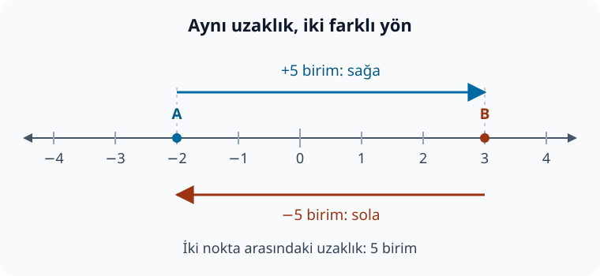

import ArticleVideo from '@/components/ArticleVideo.astro'
import yuruyus from './media/01-yol-ve-yer-degistirme.mp4?url'
import yuruyusPoster from './media/01-yol-ve-yer-degistirme.jpg?url'

[Pisagor yazısında](/blog/pisagor-teoremi/) uzunluklarla çalıştık. [Kosinüs teoremini incelerken](/blog/pisagorun-otesi-kosinus-teoremi/) ise bir kenarın yatay izdüşümünün negatif olabildiğini gördük. Burada durup açıklamamız gereken bir soru var: Bir uzunluk nasıl negatif olabilir?

Bu soruyu cevaplamak için bir çizgi üzerinde yürüyeceğiz. Önce bulunduğumuz yeri, sonra yaptığımız hareketi, en sonunda iki yer arasındaki uzaklığı sayılarla anlatacağız.

Bu yazıda tam sayıları kullanacağız: sıfır, birer birer saydığımız pozitif sayılar ve onların negatif karşılıkları. Kesirler, üsler veya denklem çözme bilgisi gerekmiyor. Toplama ve çıkarmayı da çizgi üzerindeki hareketlerden kuracağız.

## 1. Bir Başlangıç Noktası Seçmek

Yere düz bir çizgi çizdiğimizi düşünelim. Üzerinde bir nokta seçip buraya **0** yazalım. Bu, konumları tarif ederken kullanacağımız başlangıç, yani referans noktası olsun.

Ardından bir uzunluk seçelim. İster bir santimetre ister bir metre olsun; buna **bir birim** diyelim. Çizgi üzerinde bu uzunluğu değiştirmeden art arda işaretleyelim. İşaretler arasındaki aralıkların eşit olması gerekiyor.

Sağa doğru ilk işarete 1, sonrakine 2, ardından gelene 3 yazabiliriz. Pozitif sayılar bizi sıfırın sağına götürür. Genellikle başlarındaki artı işaretini yazmayız: 3 ve +3 aynı sayıdır.

Sıfırın solunda da yerler var. Oradaki işaretlere sırasıyla −1, −2, −3 yazalım. Bir sayının başındaki eksi işareti, onun negatif olduğunu belirtir. Bu sayı doğrusunda negatif konumlar sıfırın solundadır.

**Sıfır ne pozitiftir ne de negatiftir.** Başlangıç noktamızın kendisidir.

Şekildeki çizgi iki uçta da devam eder. Görselde yalnızca üzerinde çalıştığımız kısmını gösteriyoruz.

Sağı pozitif seçmek bir uzlaşmadır. Tersini de seçebilirdik. Ancak bir hesap boyunca seçtiğimiz yönü tutarlı kullanmalıyız.

## 2. Konum ile Uzaklık Aynı Bilgi Değildir

Bir arkadaşımız sıfırın üç birim sağında, bir başkası üç birim solunda dursun. Konumları 3 ve −3’tür. İkisi de başlangıç noktasına üç birim uzaktadır.

Demek ki konumu anlatan sayı iki bilgi taşır: sıfıra ne kadar uzak olduğumuz ve sıfırın hangi tarafında bulunduğumuz.

Uzaklık sorusu ise yalnızca aradaki aralığın büyüklüğünü sorar. Bu nedenle uzaklık negatif olmaz. İki nokta aynı yerdeyse aralarındaki uzaklık sıfırdır.

Sayıların sırasını da çizgiden okuyabiliriz. Sağa gittikçe sayılar büyür. Örneğin −1, −4’ün sağındadır; bu yüzden −1 daha büyüktür. Şöyle yazarız:

$$
-1>-4
$$

Buradaki $>$ işareti “büyüktür” diye okunur. Ters yöndeki $<$ işareti “küçüktür” demektir. İşaretin açık tarafı büyük sayıya bakar.

−4 sıfıra daha uzak olsa da −1’den küçük bir sayıdır. **Bir sayının büyüklük sırası ile sıfıra uzaklığı farklı sorulardır.** Sayıların sıralanması ve sıfıra uzaklıkları için [OpenStax’ın tam sayılar bölümü](https://openstax.org/books/prealgebra-2e/pages/3-1-introduction-to-integers) ek örnekler sunar.

## 3. Toplama: Bulunduğumuz Yerden Hareket Etmek

Şimdi −2 konumunda duralım. Sağa doğru beş birim ilerlersek sırayla şu konumlardan geçeriz:

$$
-2\;\longrightarrow\;-1\;\longrightarrow\;0\;\longrightarrow\;1\;\longrightarrow\;2\;\longrightarrow\;3
$$

Beş aralık ilerledik ve 3’e ulaştık. Bunu bir işlemle yazabiliriz:

$$
-2+5=3
$$

Burada −2 başlangıç konumumuz, +5 sağa doğru yaptığımız değişim, 3 ise son konumumuzdur. Eşitlik işareti, sol taraftaki işlemin değerinin sağdaki sayıyla aynı olduğunu söyler.

Bu kez 2’den başlayıp sola dört birim ilerleyelim. Sırasıyla 1, 0, −1 ve −2’ye ulaşırız:

$$
2+(-4)=-2
$$

Parantez, eklediğimiz sayının −4 olduğunu belirginleştiriyor. Negatif bir sayı eklemek, seçtiğimiz sayı doğrusunda sola ilerlemek anlamına geliyor.

Dolayısıyla toplamanın sonucu her zaman başlangıçtaki sayıdan büyük olmak zorunda değildir. Sonucun hangi yönde değişeceğini eklediğimiz sayının işareti belirler. Sıfır eklersek bulunduğumuz yerde kalırız. Bu hareket yorumunu [tam sayılarda toplama](https://openstax.org/books/prealgebra-2e/pages/3-2-add-integers) örneklerinde de kullanabiliriz.

## 4. Çıkarma: Başlangıçtan Sona Ne Kadar Değiştik?

Şeklimizdeki iki noktayı tekrar kullanalım. A, −2’de; B, 3’te olsun. A’dan B’ye gitmek için beş birim sağa ilerlediğimizi sayarak gördük.

Bu değişimi bulmak için **son konumdan başlangıç konumunu çıkarırız**:

$$
3-(-2)=5
$$

Bu satırda iki ayrı eksi işareti var. İlki çıkarma işlemini, parantezin içindeki ikincisi başlangıç sayısının negatif olduğunu gösteriyor.

Neden sonuç 5? Çıkarma burada “−2’ye ne eklersem 3 olur?” sorusunun cevabını veriyor. Az önce −2’ye 5 ekleyince 3’e ulaştık.

Negatif bir sayıyı çıkarmak, onun pozitif karşılığını eklemekle aynı sonucu verir. Bu örneği şöyle de yazabiliriz:

$$
3-(-2)=3+2=5
$$

Sayı doğrusunda −2’ye karşılık gelen hareket iki birim soladır. Bu hareketi geri almak iki birim sağa gitmektir. Çıkarmayı ters yöndeki hareketi ekleyerek düşünmek, işaretlerin neden değiştiğini görmemizi sağlar. [OpenStax — Tam sayılarda çıkarma](https://openstax.org/books/prealgebra-2e/pages/3-3-subtract-integers)

Şimdi aynı yolu ters yönde gidelim: 3’ten −2’ye.

$$
-2-3=-5
$$

Bu sefer değişim negatiftir; beş birim sola gittik. Gidişte de dönüşte de iki nokta arasındaki uzaklık beş birimdir. Değişimin işareti hareketin yönünü ayırır.

## 5. Mutlak Değer: Sıfıra Olan Uzaklık

Bir sayının sıfıra olan uzaklığını anlatmak için **mutlak değer** kullanırız. Sayıyı iki dik çizginin arasına yazarız:

$$
|3|=3,\qquad |-3|=3,\qquad |0|=0
$$

$|-3|$ ifadesi “eksi üçün mutlak değeri” diye okunur. −3’ün sıfıra uzaklığı üç birimdir.

Mutlak değeri yalnızca “eksi işaretini silmek” diye ezberlemek yerine, sayı doğrusunda sıfıra uzaklık olarak düşünelim. Böylece çizgilerin içinde bir işlem olduğunda da anlamını koruyabiliriz. Önce içerideki işlemi yapar, sonra çıkan sayının sıfıra uzaklığını buluruz:

$$
|2-5|=|-3|=3
$$

İki konumun farkı bize aralarındaki işaretli değişimi veriyordu. Bu değişimin mutlak değeri, iki nokta arasındaki uzaklığı verir:

$$
\text{Uzaklık}=|\text{son konum}-\text{başlangıç konumu}|
$$

Örneğimizde:

$$
|3-(-2)|=|5|=5
$$

Ters yönde hesaplayınca da:

$$
|-2-3|=|-5|=5
$$

buluruz. Başlangıç ile sonun yer değiştirmesi, iki nokta arasındaki uzaklığı değiştirmez.

## 6. Alınan Yol ile Yer Değiştirme

Şimdi tek seferde durmayalım. −2’den 3’e yürüyelim, ardından geri dönüp 1’de duralım.

İlk bölümde beş birim sağa gittik. İkinci bölümde iki birim sola geldik. Toplam yürüdüğümüz yol:

$$
5+2=7\text{ birim}
$$

Başlangıç ile son konum arasındaki değişim ise:

$$
1-(-2)=3\text{ birim}
$$

İşaret pozitif olduğundan, başladığımız yerin üç birim sağında bitirdik. Hareketleri toplayarak da aynı sonucu bulabiliriz:

$$
5+(-2)=3
$$

| Sorduğumuz soru | Bu yürüyüşteki cevap |
| --- | --- |
| Nereden başladık? | −2 konumundan |
| Nerede bitirdik? | 1 konumunda |
| Toplam ne kadar yol yürüdük? | 7 birim |
| Başlangıca göre yer değiştirmemiz ne oldu? | +3 birim; sağa doğru |
| Başlangıç ve bitiş noktaları ne kadar uzak? | 3 birim |

Bir boyutta yer değiştirmeyi işaretli bir sayıyla ifade edebiliyoruz. İleride düzlemde hareketleri anlatırken yönü belirtmek için vektörler kullanacağız. Şimdilik bu ayrım yeterli: Alınan yol, hareketin bütün parçalarının uzunluklarını toplar; yer değiştirme, başlangıç ile sonu karşılaştırır.

<ArticleVideo
  src={yuruyus}
  poster={yuruyusPoster}
  title="Sayı doğrusunda alınan yol ve yer değiştirme"
  caption="Nokta −2’den 3’e gidip 1’e dönüyor. Dönüşte alınan yol büyümeye devam ederken yer değiştirme oku kısalıyor: toplam yol 7 birim, yer değiştirme +3 birim."
/>

## 7. Negatif İzdüşüme Geri Dönmek

Önceki yazıda bir çubuğun ucundan yatay doğruya dikme indirmiştik. Dikmenin ayağı başlangıç noktasının soluna düştüğünde yatay konumu negatif çıkıyordu.

Bu ayak, başlangıcın üç birim solundaysa yatay konumuna −3 deriz. Başlangıca uzaklığı ise $|-3|=3$ birimdir. Çubuğun fiziksel uzunluğu da negatif olmaz.

Böylece ilk sorumuzu cevaplayabiliriz: Negatif çıkan şey, seçtiğimiz başlangıç ve yöne göre ifade ettiğimiz **işaretli konumdur**. Uzunluk hesabıyla yön bilgisini aynı şeymiş gibi okumamalıyız.

Bir sonraki çalışmada sayıların başka bir kullanımına geçeceğiz: Eş büyüklükte grupları birleştirmek ve bir bütünü eş parçalara ayırmak. Çarpma ve bölmenin anlamını kurduktan sonra kesirleri ele alacağız.

## Kaynakça

Yürüyüş örnekleri, şekil, Manim animasyonu ve Türkçe anlatım bu yazı için hazırlanmıştır. Standart tanımlar ve ek okuma için:

- [OpenStax — Prealgebra 2e, 3.1: Introduction to Integers](https://openstax.org/books/prealgebra-2e/pages/3-1-introduction-to-integers). Sayı doğrusu, sıralama ve mutlak değer.
- [OpenStax — Prealgebra 2e, 3.2: Add Integers](https://openstax.org/books/prealgebra-2e/pages/3-2-add-integers). Tam sayılarda toplama.
- [OpenStax — Prealgebra 2e, 3.3: Subtract Integers](https://openstax.org/books/prealgebra-2e/pages/3-3-subtract-integers). Çıkarma ile karşıt sayıyı eklemek arasındaki bağ.

Çevrimiçi kaynaklara erişim tarihi: 28 Eylül 2026.
