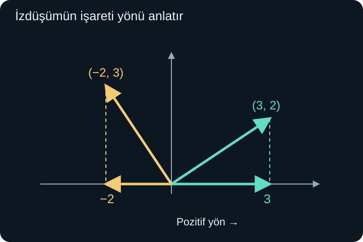
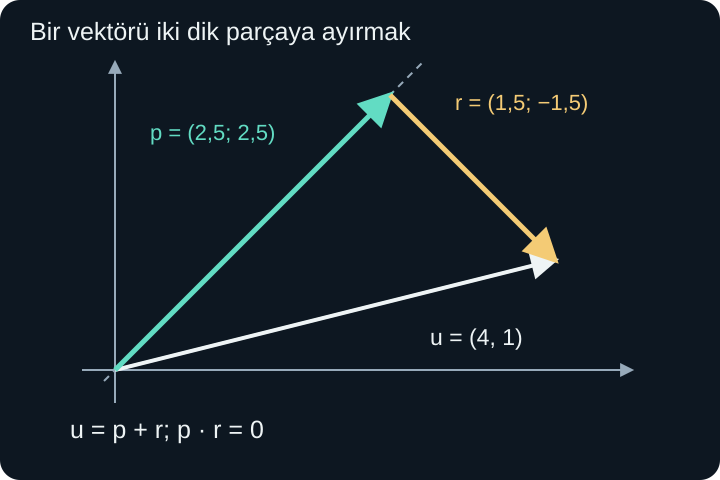

import ArticleVideo from '@/components/ArticleVideo.astro'
import kavram from './media/01-kavram.mp4?url'
import kavramPoster from './media/01-kavram.jpg?url'

Doğuya uzanan bir yol boyunca ilerlemek istiyoruz. Elimizdeki hareket oku 3 birim doğuya, 2 birim kuzeye gidiyor. Bu okun tamamının uzunluğu $\sqrt{13}$ birimdir; fakat doğu yönündeki katkısı yalnızca 3 birimdir. Oku biraz döndürürsek uzunluğu sabit kalabilir, ama doğu yönüne düşen payı değişir.

İki vektör arasındaki ilişkiyi anlamak için yalnızca uzunluklarını bilmek yetmez. Aralarındaki açı da önemlidir. **Skaler çarpım**, iki vektörden tek bir gerçek sayı üretir; bu sayı, uzunluklarla yön uyumunu birlikte hesaba katar. **İzdüşüm** ise bir vektörün seçilmiş doğrultu üzerindeki parçasını ayırır.

[Önceki yazıdaki](/blog/vektorler-ve-bilesenleri/) bileşenleri, normu ve birim vektörü kullanacağız. Geometrik gerekçe için kosinüs teoremi ve temel cebir yeterli olacak. Burada bütün vektör bileşenleri gerçek sayıdır; eksenler birbirine diktir ve aynı uzunluk ölçeği kullanılır.

## 1. İki Vektörden Bir Sayı Üretmek

$\mathbf u=(u_1,u_2)$ ve $\mathbf v=(v_1,v_2)$ için **skaler çarpımı** şöyle tanımlarız:

$$
\mathbf u\cdot\mathbf v=u_1v_1+u_2v_2.
$$

Ortadaki nokta, bu yeni işlemin sembolüdür. Eşleşen bileşenleri çarpar, sonuçları toplarız. Çıktı bir vektör değil, skalerdir. Örneğin $\mathbf u=(3,2)$ ve $\mathbf v=(4,-1)$ için:

$$
\mathbf u\cdot\mathbf v=3\cdot4+2\cdot(-1)=12-2=10.
$$

İşlemin sırasını değiştirmek sonucu değiştirmez; gerçek sayıların çarpması değişmelidir. Bu yüzden $\mathbf u\cdot\mathbf v=\mathbf v\cdot\mathbf u$ olur. Ancak “çarpımın sonucu 10” demek, iki vektörün birbirinin 10 katı olduğunu veya aralarında 10 derece bulunduğunu söylemez. Sayının geometrik anlamını ayrıca kuracağız.

Üç boyutta aynı tanıma üçüncü bileşenin çarpımı eklenir:

$$
\mathbf u\cdot\mathbf v=u_1v_1+u_2v_2+u_3v_3.
$$

Örneğin $(1,2,-1)\cdot(2,0,2)=2+0-2=0$ olur. Sıfır sonuç, iki vektörden birinin mutlaka sıfır olduğunu göstermez. Bu bakımdan sıradan sayı çarpımındaki sıfır çarpım ilkesini bu yeni işleme doğrudan taşıyamayız.

## 2. Bir Vektörün Kendisiyle Çarpımı

Aynı vektörü iki girişe de koyarsak:

$$
\mathbf u\cdot\mathbf u=u_1^2+u_2^2=\|\mathbf u\|^2.
$$

Sağ taraf normun karesidir. Dolayısıyla kendisiyle skaler çarpım sıfır veya pozitiftir; sıfır olması ancak bütün bileşenlerin sıfır olmasıyla mümkündür. Normu $\sqrt{\mathbf u\cdot\mathbf u}$ biçiminde de yazabiliriz.

Bu eşitlik, skaler çarpımın neden rastgele bir bileşen hesabı olmadığını gösterir. Pisagor ile tanıdığımız uzunluk ölçüsünü kendi içinde barındırır. İki farklı vektör kullanınca, aynı uzunluk bilgisinin aralarındaki açıyla birleştiğini göreceğiz.

Skaler çarpım toplama üzerine dağılır:

$$
\mathbf u\cdot(\mathbf v+\mathbf w)
=\mathbf u\cdot\mathbf v+\mathbf u\cdot\mathbf w.
$$

Bunu bileşenlerde $u_1(v_1+w_1)=u_1v_1+u_1w_1$ ve ikinci bileşendeki aynı özellikten elde ederiz. Bir skaler $k$ için $(k\mathbf u)\cdot\mathbf v=k(\mathbf u\cdot\mathbf v)$ de geçerlidir. Bu kurallar uzun ifadeleri açmamızı sağlar; fakat sonuçların sayı mı vektör mü olduğunu her adımda izleriz.

## 3. Kosinüs Nereden Gelir?

İki sıfırdan farklı vektörü aynı başlangıç noktasından çizelim. Aralarındaki küçük, yönsüz açıya $\theta$ diyelim; $0\le\theta\le\pi$ olsun. İki ucun arasındaki fark vektörü $\mathbf u-\mathbf v$'dir. Bu farkın uzunluğunun karesini iki yöntemle bulabiliriz.

Bileşenlerden:

$$
\|\mathbf u-\mathbf v\|^2
=(u_1-v_1)^2+(u_2-v_2)^2.
$$

Kareleri açıp gruplarsak:

$$
\|\mathbf u-\mathbf v\|^2
=\|\mathbf u\|^2+\|\mathbf v\|^2
-2(\mathbf u\cdot\mathbf v).
$$

Öte yandan iki ok ve uçlarını birleştiren kenar bir üçgen kurar. Kosinüs teoremi aynı uzunluk için:

$$
\|\mathbf u-\mathbf v\|^2
=\|\mathbf u\|^2+\|\mathbf v\|^2
-2\|\mathbf u\|\|\mathbf v\|\cos\theta
$$

verir. İki sağ taraftaki ortak terimleri çıkarınca:

$$
\boxed{\mathbf u\cdot\mathbf v
=\|\mathbf u\|\|\mathbf v\|\cos\theta.}
$$

Aynı veya zıt yöndeki vektörlerde üçgen düzleşir; bu iki uç durum, $\mathbf v$'nin $\mathbf u$'nun pozitif veya negatif katı olduğunu doğrudan yerine koyarak da doğrulanır. Böylece bağıntı açı aralığının uçlarında da geçerlidir. Üç boyutta iki vektör bir düzlem içinde bulunduğu için aynı geometrik gerekçe kullanılabilir; bileşen açılımına yalnızca üçüncü kare eklenir.

İki tanımı birbirine bağladık: bileşen çarpımları toplamı ile uzunluklar ve açıdan oluşan ifade aynı sayıyı verir. Bu yüzden dik koordinat eksenlerini döndürmek skaler çarpımı değiştirmez. Sayısal bileşenler değişebilir; vektör uzunlukları ve aralarındaki geometrik açı değişmez.

## 4. İşaret Açıyı Nasıl Anlatır?

İki norm da pozitif olduğundan, sıfırdan farklı vektörlerin skaler çarpımının işaretini kosinüs belirler. Dar açıda kosinüs pozitif, dik açıda sıfır, geniş açıda negatiftir. Dolayısıyla pozitif skaler çarpım yönlerin kısmen aynı tarafa, negatif skaler çarpım kısmen ters tarafa baktığını söyler.

Örneğin $(3,2)\cdot(1,0)=3$ olur. Yatay birim vektör, ilk okun doğuya katkısını ölçer. $(-2,3)\cdot(1,0)=-2$ ise batıya doğru iki birimlik katkıyı gösterir. Bu negatif değer bir uzunluğun negatif olduğu anlamına gelmez; seçilmiş pozitif yöne göre işaretli bir bileşendir.

$\mathbf0\cdot\mathbf v=0$ eşitliği her $\mathbf v$ için doğrudur. Cebirde sıfır vektörü her vektöre ortogonal kabul edilir. Ancak sıfır vektörünün belirli bir yönü olmadığından, onunla başka bir vektör arasında geometrik açı tanımlamayız. “Çarpım sıfır, demek açı 90 derece” yorumunu yaparken iki vektörün de sıfırdan farklı olduğunu kontrol etmeliyiz.

## 5. Açı Hesabını Adım Adım Yapmak

İki sıfırdan farklı vektör için temel bağıntıyı normların çarpımına bölebiliriz:

$$
\cos\theta=\frac{\mathbf u\cdot\mathbf v}
{\|\mathbf u\|\|\mathbf v\|}.
$$

$\mathbf u=(2,1)$ ve $\mathbf v=(1,3)$ olsun. Önce skaler çarpım $2\cdot1+1\cdot3=5$ olur. Normlar $\sqrt5$ ve $\sqrt{10}$'dur. Bu yüzden:

$$
\cos\theta=\frac5{\sqrt5\sqrt{10}}
=\frac5{\sqrt{50}}=\frac1{\sqrt2}.
$$

Arkkosinüsün $[0,\pi]$ aralığındaki çıktısını seçeriz: $\theta=\pi/4=45^\circ$. Bu açı yönsüz açıdır; bir vektörden diğerine saat yönünde mi yoksa ters yönde mi dönüldüğünü skaler çarpım tek başına belirlemez.

İlk vektörü iki katına çıkarırsak pay da iki, normların çarpımı da iki katına çıkar; oran aynı kalır. Bu beklediğimiz bir sonuçtur: uzunluğu pozitif sayıyla ölçeklemek yönü değiştirmez. Negatif sayıyla çarparsak yön tersine döner, yeni açı eski açının bütünleri olur.

Diklik kontrolü çoğu zaman açı hesaplamaktan daha kolaydır. $(2,3)\cdot(3,-2)=6-6=0$ olduğundan iki sıfırdan farklı vektör diktir. Karekök veya ters trigonometrik işlem yapmaya gerek kalmaz.

## 6. Skaler İzdüşüm: Yön Boyunca Ne Kadar?

$\mathbf v\ne\mathbf0$ seçilmiş yön vektörü olsun. Bu yöndeki birim vektörü $\mathbf e=\mathbf v/\|\mathbf v\|$ diye yazalım. $\mathbf u$'nun bu yön üzerindeki **skaler izdüşümü**:

$$
\operatorname{comp}_{\mathbf v}\mathbf u
=\mathbf u\cdot\mathbf e
=\frac{\mathbf u\cdot\mathbf v}{\|\mathbf v\|}
=\|\mathbf u\|\cos\theta
$$

olur. Buradaki “comp” gösterimi işaretli bileşeni belirtir. Sonuç bir sayıdır. Pozitifse seçilen yöne, negatifse ters yöne katkı vardır.

$\mathbf u=(4,1)$ ve $\mathbf v=(1,1)$ için skaler çarpım 5, $\|\mathbf v\|=\sqrt2$ olduğundan izdüşüm $5/\sqrt2$'dir. Bu sayı doğrudan yatay bileşen 4'e veya düşey bileşen 1'e eşit değildir; bu kez ölçüm yönümüz iki eksene de 45 derece eğiktir.

Yön vektörünü pozitif bir sayıyla büyütmek bu işaretli izdüşümü değiştirmez. Örneğin $(1,1)$ yerine $(10,10)$ kullanırsak hem pay hem payda on katına çıkar. Sadece yön önemlidir. Ters yönü seçersek işaret değişir; aynı doğru üzerindeki ölçüm yönünü ters çevirmiş oluruz.

<ArticleVideo src={kavram} poster={kavramPoster} title="Dönen vektörün işaretli izdüşümü" caption="Okun uzunluğu sabit kalırken yatay izdüşümü değişir. Dik konumda sıfır olur; ok sola döndüğünde izdüşümün işareti negatife geçer." />

## 7. Vektörel İzdüşüm: Parçanın Kendisi

Skaler izdüşüm bize işaretli miktarı verdi. Bu miktarı aynı yöndeki birim vektörle çarparsak doğru üzerinde bir vektör elde ederiz:

$$
\operatorname{proj}_{\mathbf v}\mathbf u
=\frac{\mathbf u\cdot\mathbf v}{\|\mathbf v\|^2}\mathbf v.
$$

“proj” gösterimi burada **vektörel izdüşümü** belirtir. Sonuç sayı değil vektördür. Paydadaki normun karesinin bir çarpanı skaler bileşeni, diğer çarpanı birim yönü kurmaktan gelir. $\mathbf v=\mathbf0$ için iki izdüşüm tanımı da kullanılmaz; üzerine düşürülecek yön belli değildir.

Örneğimizde $\|\mathbf v\|^2=2$ olduğundan:

$$
\mathbf p=\operatorname{proj}_{\mathbf v}\mathbf u
=\frac52(1,1)=(5/2,5/2).
$$

Kalan vektörü $\mathbf r=\mathbf u-\mathbf p$ ile tanımlayalım:

$$
\mathbf r=(4,1)-(5/2,5/2)=(3/2,-3/2).
$$

Gerçekten $\mathbf r\cdot\mathbf v=3/2-3/2=0$ olur. Yani kalan parça seçilmiş yöne diktir. Aynı zamanda $\mathbf p+\mathbf r=(4,1)$ başlangıç vektörünü geri verir.

Bu yalnızca sayısal örneğe özgü değildir. Genel formülü kalan parçaya yazarsak:

$$
\left(\mathbf u-\frac{\mathbf u\cdot\mathbf v}
{\mathbf v\cdot\mathbf v}\mathbf v\right)\cdot\mathbf v
=\mathbf u\cdot\mathbf v-\mathbf u\cdot\mathbf v=0.
$$

Dağılma özelliği ve $\mathbf v\cdot\mathbf v=\|\mathbf v\|^2$ sayesinde dikliği doğruladık. Dik izdüşümün cebirsel formülü, şekle göz kararı bir dikme çizmenin kesin hesap karşılığıdır.

## 8. Bir Noktanın Doğruya En Kısa Uzaklığı

Orijinden geçen ve $(1,1)$ yönündeki doğruyu düşünelim. $(4,1)$ noktasının bu doğru üzerindeki dik izdüşümü $(5/2,5/2)$ bulundu. Aradaki fark $(3/2,-3/2)$ olduğundan uzaklık:

$$
\sqrt{(3/2)^2+(-3/2)^2}
=\sqrt{9/2}=\frac3{\sqrt2}.
$$

Bunun neden en kısa uzaklık olduğunu geometriden açıklayabiliriz. Doğru üzerinde izdüşüm noktası dışında bir nokta seçersek, kalan dik parça ve doğru üzerindeki ek parça bir dik üçgen kurar. Yeni uzaklığın karesi, dik uzaklığın karesine pozitif bir karenin eklenmesidir. Dolayısıyla daha kısa olamaz.

Doğru orijinden geçmiyorsa önce başlangıcı ona göre taşıyabiliriz. Doğru üzerindeki bir nokta $A$, dışarıdaki nokta $P$ ve doğru yönü $\mathbf v$ olsun. Önce $\mathbf u=\overrightarrow{AP}$ farkını alır, bunu $\mathbf v$ üzerine izdüşürürüz. Ayağın adresi $A+\operatorname{proj}_{\mathbf v}\mathbf u$, uzaklık ise kalan vektörün normudur. Böylece konum vektörüyle yer değiştirmeyi karıştırmadan aynı hesabı kullanırız.

Örneğin $A=(1,2)$, $P=(5,3)$ seçilirse $\overrightarrow{AP}=(4,1)$ olur. Aynı yön için ayak noktası $(1,2)+(5/2,5/2)=(7/2,9/2)$'dir. Uzaklık yine $3/\sqrt2$ kalır; bütün şekli taşımak uzunlukları değiştirmez.

## 9. Üç Boyutta ve Fiziksel Birimlerle

$\mathbf u=(1,2,-1)$ ve $\mathbf v=(2,0,2)$ için skaler çarpımı 0 bulmuştuk. Normlar $\sqrt6$ ve $\sqrt8$ pozitiftir. Dolayısıyla vektörler üç boyutta birbirine diktir. İki boyutlu ekranda çizilen perspektif görüntü bu açıyı 90 derece göstermese bile, bileşen hesabı gerçek dikliği belirler.

Başka bir örnekte $\mathbf a=(2,1,2)$'yi düşey $\mathbf e_3=(0,0,1)$ yönüne izdüşürelim. $\mathbf a\cdot\mathbf e_3=2$ olduğundan skaler izdüşüm 2, vektörel izdüşüm $(0,0,2)$ olur. Kalan $(2,1,0)$ yatay düzlemdedir. Tanım iki boyuttakiyle aynıdır; yalnızca bileşen sayısı arttı.

Fizikte sabit bir kuvvetin düz bir yer değiştirme boyunca yaptığı iş, kuvvet ile yer değiştirmenin skaler çarpımıyla modellenir:

$$
W=\mathbf F\cdot\mathbf s.
$$

$\mathbf F$ kuvvet, $\mathbf s$ yer değiştirme, $W$ iştir. $\mathbf F=(10,0)$ newton ve $\mathbf s=(3,4)$ metre için $W=10\cdot3+0\cdot4=30$ newton metre, yani 30 joule olur. Hareketin kuvvete dik olan 4 metrelik bileşeni bu kuvvetin işine katkı yapmaz.

Aynı kuvvete karşı $(-3,4)$ metre hareket olsaydı iş $-30$ joule olurdu. Negatif iş, kuvvetin yer değiştirme yönüne karşı etki ettiğini anlatır. Bu yazıdaki formül sabit kuvvet ve verilen yer değiştirme içindir. Kuvvet yol boyunca değiştiğinde küçük parçaların katkılarını birleştirmek gerekir; bunu integral konusu hazırlayacaktır.

## 10. İşlemin Sonucunu Doğru Türde Okumak

Vektörlerle işlem yaparken sayısal olarak doğru görünen ama anlamı olmayan yazımlar kurmak mümkündür. Örneğin $\mathbf u\cdot\mathbf v$ bir sayıdır. Bu sonuçla üçüncü bir vektörü skaler çarpıma sokmak, iki vektör isteyen tanıma uymaz. Buna karşılık $(\mathbf u\cdot\mathbf v)\mathbf w$ geçerli bir ifadedir: önce bir sayı üretir, sonra bu sayıyla $\mathbf w$ vektörünü ölçekleriz.

Somut olarak $\mathbf u=(1,0)$, $\mathbf v=(1,1)$ ve $\mathbf w=(0,1)$ seçelim. İlk skaler çarpım 1 olduğundan $(\mathbf u\cdot\mathbf v)\mathbf w=(0,1)$ olur. Diğer gruplanışta $\mathbf v\cdot\mathbf w=1$ ve $\mathbf u(\mathbf v\cdot\mathbf w)=(1,0)$ çıkar. Sonuçlar eşit değildir. Sayı çarpımında alıştığımız bütün özellikleri yeni işlemlere tanımını incelemeden aktaramayız.

Aynı şekilde $\mathbf u\cdot\mathbf v=\mathbf u\cdot\mathbf w$ eşitliğinde $\mathbf u$'yu sadeleştirip $\mathbf v=\mathbf w$ diyemeyiz. $\mathbf u=(1,0)$, $\mathbf v=(2,3)$, $\mathbf w=(2,-5)$ için iki skaler çarpım da 2'dir; fakat son iki vektör farklıdır. Yatay yöndeki katkıları aynıdır, düşey bilgileri farklıdır. Tek bir izdüşüm, vektörün bütün bileşenlerini yeniden kurmaya yetmez.

Bu örnek aynı zamanda ölçümün sınırını anlatır. Bir gölgeye veya tek bir eksendeki bileşene bakarak asıl vektörün tüm yönünü ve uzunluğunu belirleyemeyiz. Aynı yatay izdüşüme sahip çok sayıda farklı vektör olabilir. Daha fazla bağımsız yöndeki bilgi, bu belirsizliği azaltır.

Fiziksel birimler de sonuç türünün parçasıdır. İki yer değiştirme vektörünün skaler çarpımı metrekare birimindedir; bunun bir alan formülü olduğu sonucu kendiliğinden çıkmaz. Kuvvet ile yer değiştirmede ise birim newton metredir ve tanımlanan fiziksel büyüklük iştir. Aynı matematik işlemi, girdilerin anlamına göre farklı ölçülen büyüklükleri temsil edebilir.

## 11. Skaler Çarpım Ne Kadar Büyük Olabilir?

Kosinüs her zaman $-1$ ile 1 arasındadır. Bu nedenle:

$$
|\mathbf u\cdot\mathbf v|
\le\|\mathbf u\|\|\mathbf v\|.
$$

Bu bağıntıya **Cauchy–Schwarz eşitsizliği** denir. Buradaki geometrik anlamı açıktır: bir yöndeki izdüşümün mutlak büyüklüğü, vektörün tam uzunluğunu aşamaz. İki sıfırdan farklı vektör aynı veya zıt yöndeyse eşitlik sağlanır; dikken sol taraf sıfır olur. Sıfır vektörü içeren durumda da iki taraf sıfırdır.

Bu aynı zamanda açı hesabının tutarlılık kontrolüdür. $\mathbf u\cdot\mathbf v/(\|\mathbf u\|\|\mathbf v\|)$ oranını 1,3 bulursak gerçek bir kosinüs bulmuş olmayız. Bir aritmetik, birim veya veri hatası vardır. Bilgisayardaki çok küçük yuvarlama taşmaları ayrıca değerlendirilir; fakat büyük bir sapma geometriyle bağdaşmaz.

İzdüşüm, bir vektörü seçtiğimiz bir yöne göre parçalamanın yoluydu. Bundan sonra birkaç yönü birlikte kullanarak hangi vektörleri kurabildiğimizi soracağız. Bu soru doğrusal birleşim, bağımsızlık, baz ve boyut kavramlarına götürecek.

## Kaynakça

Aşağıdaki birincil açık ders kitabı sayfaları 8 Ekim 2026 tarihinde doğrudan kontrol edilmiştir. Örnek hesaplar, çizimler ve anlatım özgündür.

- [Georgia Tech, Interactive Linear Algebra — Dot Products and Orthogonality](https://textbooks.math.gatech.edu/ila/dot-product.html): Gerçek bileşenli skaler çarpım, norm ve diklik koşulları.
- [Georgia Tech, Interactive Linear Algebra — Orthogonal Projection](https://textbooks.math.gatech.edu/ila/projections.html): Bir doğru üzerindeki dik izdüşüm, dik kalan ve en yakın nokta ilişkisi.
- [OpenStax, Precalculus 2e — Vectors](https://openstax.org/books/precalculus-2e/pages/8-8-vectors): Skaler çarpımın açı ve fiziksel iş ile bağlantısı.
