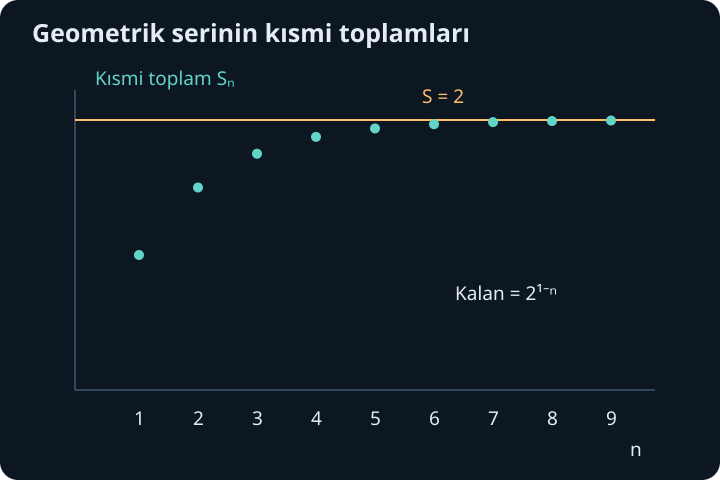
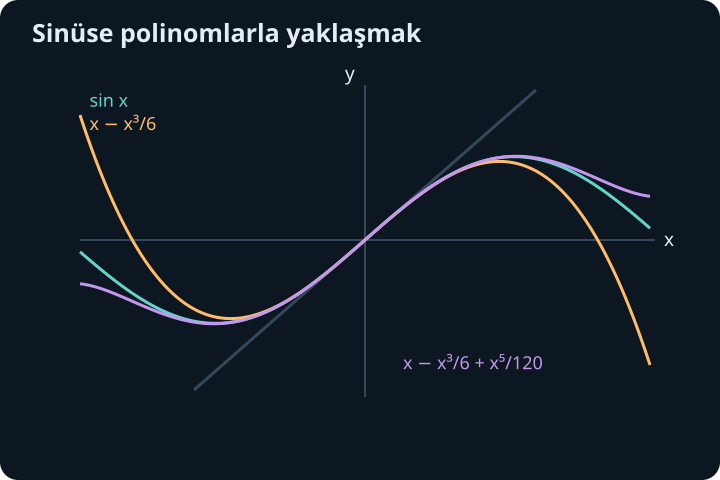

import ArticleVideo from '@/components/ArticleVideo.astro'
import kavram from './media/01-kavram.mp4?url'
import kavramPoster from './media/01-kavram.jpg?url'

Bir mesafenin önce yarısını, sonra kalan yarısını, ardından yeniden kalan yarısını yürüdüğümüzü düşünelim. Sonsuz sayıda adım fikri, toplam mesafenin de sonsuz olmasını gerektirmez. Her yeni katkı küçülürken toplam belli bir sınıra yaklaşabilir. Fakat katkıların küçülmesi tek başına yeterli değildir; ne hızla küçüldüklerini ve işaretlerini de incelemeliyiz.

[Önceki yazıda](/blog/integralin-uygulamalari-ve-uygunsuz-integraller/) sonsuz aralıklardaki birikimleri limitlerle tanımladık. Şimdi tek tek terimleri toplayacağız. Diziler, limit, türev, integral ve faktöriyel gösterimi gerekecek; sonuncusunu burada tanımlayacağız. Seriler, bir hesap tekniği olmanın ötesinde, sinüs ve üstel gibi fonksiyonları polinomlarla temsil etmenin temelini oluşturacak.

## 1. Önce sonlu toplamları ayırmak

Terimleri sabit farkla ilerleyen diziye aritmetik dizi denir. İlk terim $a$, fark $d$ ise terimler $a,a+d,a+2d,\ldots$ biçimindedir. İlk $N$ terimin sonuncusu $a+(N-1)d$ olur. Toplamı ileri ve geri yazıp eşlersek her çift ilk ile sonun toplamını verir. Dolayısıyla:

$$
S_N=\frac N2[2a+(N-1)d].
$$

Örneğin $3+5+7+9+11$ için $a=3$, $d=2$, $N=5$ ve toplam $5(3+11)/2=35$ olur. Bu formül sonlu sayıda terimi toplar; henüz sonsuzluk hakkında bir iddia içermez.

Terimler sabit $r$ oranıyla çarpılarak ilerliyorsa geometrik dizi oluşur. $S_N=a+ar+\cdots+ar^{N-1}$ yazalım. İki tarafı $r$ ile çarpıp çıkarınca aradaki terimler gider:

$$
S_N-rS_N=a-ar^N.
$$

$r\ne1$ için $S_N=a(1-r^N)/(1-r)$ bulunur. $r=1$ için bütün terimler $a$ olduğundan toplam $Na$'dır. Bölme formülünün istisnasını böylece ayrıca ele alırız.

## 2. Dizi ile seri aynı nesne değildir

$a_1,a_2,\ldots$ tek tek terimlerin dizisidir. Bu terimlerden $S_N=a_1+\cdots+a_N$ adlı başka bir dizi kurarız; buna kısmi toplamlar dizisi denir. Sonsuz seri $\sum_{n=1}^{\infty}a_n$, bu kısmi toplamların limitidir:

$$
\sum_{n=1}^{\infty}a_n=S
\quad\text{demek}\quad
\lim_{N\to\infty}S_N=S\text{ demektir.}
$$

Limit sonluysa seri yakınsaktır. Bir sonlu limit yoksa ıraksaktır. “Sonsuz terimlerin hepsini bitirip topladık” demiyoruz; sonlu toplamların giderek büyüyen ailesinin davranışını tanımlıyoruz.

Geometrik örnekte $|r|<1$ ise $r^N\to0$ olur ve toplam $a/(1-r)$'ye gider. $a=1$, $r=1/2$ için $1+1/2+1/4+\cdots=2$ bulunur. İlk $N$ terim sonrası kalan miktar tam olarak $2^{1-N}$'dir. Böylece yalnız toplamı değil, sonlu hesapla ne kadar hata yaptığımızı da biliriz.

$r=-1/2$ olduğunda işaretler sırayla değişir; toplam $1/(1+1/2)=2/3$ olur. Kısmi toplamlar bu değerin iki yanında gidip gelir. $r=-1$ için ise $1,0,1,0,\ldots$ kısmi toplamları oluşur; tek bir limit yoktur. Bu standart seri tanımında toplama herhangi bir “ortalama değer” atamayız.

## 3. Terimlerin sıfıra gitmesi neden yetmez?

Yakınsak bir seride $a_N=S_N-S_{N-1}$ olduğundan $a_N\to S-S=0$ olmalıdır. Bu gerekli koşuldur. Terimler sıfıra gitmiyorsa seri kesinlikle ıraksaktır. Örneğin $n/(n+1)$ terimleri 1'e gittiği için toplam yakınsak olamaz.

Ters yönde sonuç çıkaramayız. Harmonik seri $1+1/2+1/3+\cdots$ terimleri sıfıra giderken ıraksar. Bunu gruplarla görelim: $1/3+1/4\geq2/4=1/2$; sonraki dört terimin toplamı en az $4/8=1/2$; sonraki sekiz terimin toplamı en az $8/16=1/2$'dir. Her yeni grup toplamı en az yarım artırır. Sonsuz sayıda böyle grup bulunduğundan kısmi toplamlar sınırsız büyür.

Buradaki hata, “her eklenen şey küçük” sözünü “eklenenlerin toplamı küçük” sanmaktır. Çok sayıda küçük katkı birikebilir. Yakınsaklık testleri tek bir terimin küçüklüğünü değil, kuyruğun toplamını denetlemek için vardır.

## 4. Pozitif serilerde karşılaştırma ve integral

$0\leq a_n\leq b_n$ ve $\sum b_n$ yakınsaksa $\sum a_n$ da yakınsaktır. Kısmi toplamlar artar ama üst serinin toplamıyla sınırlanır. Gerçek sayıların tamlığı, artan ve sınırlı bu dizinin bir limiti olduğunu söyler. Sonlu sayıda ilk terimi değiştirmek yakınsaklık durumunu değiştirmez; yalnız toplamı değiştirir.

Pozitif, sürekli ve azalan $f$ için $a_n=f(n)$ seçersek dikdörtgenleri eğri altı alanlarla karşılaştırabiliriz. $[n,n+1]$ üzerinde $f(n+1)\leq f(x)\leq f(n)$ olur. İntegral alınca her alan iki komşu terim arasında kalır. Bu eşitsizlikler toplandığında $\sum f(n)$ ile $\int_1^\infty f(x)dx$ aynı yakınsaklık davranışına sahip olur.

Örneğin $\sum1/n^p$ pozitif $p$ için bu teste uyar. Önceki uygunsuz integral hesabı, $p>1$ iken yakınsak, $0<p\leq1$ iken ıraksak olduğunu verir. $p\leq0$ iken terimler zaten sıfıra gitmez. Böylece bütün gerçek $p$ değerleri için sınır yine 1'dir.

## 5. Oran testi geometrik karşılaştırmadır

Sıfırdan farklı terimlerde ardışık büyüklüklerin oranını inceleyelim:

$$
L=\lim_{n\to\infty}\left|\frac{a_{n+1}}{a_n}\right|.
$$

$L<1$ ise, $L$ ile 1 arasında bir $q$ seçebiliriz. Yeterince ileride her oran $q$'dan küçüktür. Sonraki terimler bu nedenle bir geometrik kuyruğun terimlerinden büyük olamaz ve mutlak değerlerin serisi yakınsaktır. $L>1$ veya sonsuzsa terimler sonunda küçülmez ve sıfıra yaklaşamaz; seri ıraksar. $L=1$ ise test karar vermez.

Faktöriyel $n!=1\cdot2\cdots n$ olarak tanımlanır; ayrıca $0!=1$ alınır. $a_n=3^n/n!$ için:

$$
\left|\frac{a_{n+1}}{a_n}\right|
=\frac{3^{n+1}}{(n+1)!}\frac{n!}{3^n}
=\frac3{n+1}\to0.
$$

Dolayısıyla seri mutlak yakınsaktır. Faktöriyelin büyümesi, sabit tabanlı üstel büyümeyi sonunda bastırır. Buna karşılık hem $1/n$ hem $1/n^2$ için oran limiti 1'dir; biri ıraksak, diğeri yakınsaktır. Kararsız bir testi başarısız hesap gibi görmeyiz; başka bilgi gerektiğini öğrenmiş oluruz.

## 6. Alternans ve hata sınırı

$b_n\geq0$ terimleri azalarak sıfıra gitsin. İşaretleri sırayla değişen $\sum_{n=1}^{\infty}(-1)^{n-1}b_n$ serisi yakınsaktır. Çift ve tek kısmi toplamları ayrı düşündüğümüzde biri alttan yükselir, diğeri üstten iner. Aralarındaki fark sıradaki $b_n$ olduğundan sıfıra yaklaşır ve iki dizi aynı limite sıkışır.

Dahası, $N$ terimde durursak hata sıradaki terimden büyük değildir:

$$
|S-S_N|\leq b_{N+1}.
$$

Örneğin $1-1/2+1/3-1/4+\cdots$ alternanslı harmonik seri yakınsaktır. İlk 100 terimle hata en fazla $1/101$ olur. Bu, hızlı bir yakınsama sayılmaz; yüzde birin altında kesin hata istemek için çok sayıda terim gerekir. Daha iyi bir yöntem aramak matematiğin hesaplama tarafının parçasıdır.

Mutlak değerli seri $\sum|a_n|$ yakınsaksa asıl seri de yakınsaktır; buna mutlak yakınsaklık denir. Alternanslı harmonik serinin mutlak değerleri harmonik seriyi verdiğinden o yalnız koşullu yakınsaktır. Mutlak yakınsak serilerde terim sırasını değiştirmek toplamı korur. Koşullu serilerde bunu gelişigüzel yapamayız; sonsuz toplamlar sonlu toplamların bütün alışkanlıklarını koşulsuz taşımaz.

## 7. Girdi içeren seri: kuvvet serisi

Bir $a$ merkezi çevresinde:

$$
\sum_{n=0}^{\infty}c_n(x-a)^n
$$

biçimindeki seriye kuvvet serisi denir. $c_n$ katsayıları sabittir; $x$ değiştikçe farklı bir sayısal seri elde edilir. Bir kuvvet serisinin yakınsaklık yarıçapı $R$ vardır: $|x-a|<R$ içinde mutlak yakınsak, $|x-a|>R$ dışında ıraksaktır. $R=0$ veya $R=\infty$ de olabilir. Sınır noktaları ayrı incelenmelidir.

$\sum_{n=1}^{\infty}x^n/n$ için oran limiti $|x|$ olur. Bu nedenle $|x|<1$ içinde yakınsaktır. $x=1$ noktasında harmonik seri olduğu için ıraksar. $x=-1$ noktasında alternanslı harmonik seri olduğu için yakınsar. Yakınsaklık aralığı $[-1,1)$'dir; sağ uç açık, sol uç kapalıdır. Bir yarıçap bulmak uçları otomatik karara bağlamaz.

Kuvvet serileri açık yakınsaklık aralığının içindeki her kapalı küçük aralıkta yeterince düzenli yakınsar. Bu özellik sayesinde terim terim türev ve integral alınabilir; türev ve integral serilerinin yarıçapı aynıdır. Uç noktalardaki davranış değişebilir. Bu sonuç genel seriler için izinsiz bir kural değildir; kuvvet serilerinin özel düzenine dayanır.

## 8. Taylor katsayıları nereden gelir?

$f$ fonksiyonunu $a$ çevresinde $P_N(x)=c_0+c_1(x-a)+\cdots+c_N(x-a)^N$ polinomuyla yaklaştıralım. Önce $P_N(a)=f(a)$ isteyelim; $c_0=f(a)$ olur. Birinci türevleri eşleştirince $c_1=f'(a)$, ikinci türevleri eşleştirince $2c_2=f''(a)$ çıkar. Genel olarak $n$'inci türevde $n!c_n$ kalır. Böylece:

$$
P_N(x)=\sum_{n=0}^{N}\frac{f^{(n)}(a)}{n!}(x-a)^n.
$$

$f^{(n)}$ gösterimi $n$ kez türev demektir; $f^{(0)}=f$ kabul edilir. $a=0$ merkezli biçime Maclaurin polinomu da denir. Katsayıları böyle seçmek, fonksiyonun değerini, eğimini ve giderek daha yüksek değişim bilgilerini merkezde eşleştirir.

Bu eşleşme bütün gerçek doğru üzerinde kusursuz yaklaşım garantisi değildir. Merkezden uzaklaştıkça hata büyüyebilir. Hatta bütün türevleri eşleştirmek bile tek başına fonksiyonun kendi sonsuz serisine eşit olduğunu garanti etmez. Eksik parçayı kalan terim hesabı tamamlar.

## 9. Kalan terim ve güvenilir yaklaşım

$f$'nin $a$ ile $x$ arasındaki aralıkta $N+1$ kez sürekli türevlenebilir olduğunu varsayalım. Taylor teoremi bir ara $\xi$ noktası için:

$$
f(x)=P_N(x)+R_N(x),\qquad
R_N(x)=\frac{f^{(N+1)}(\xi)}{(N+1)!}(x-a)^{N+1}
$$

verir. $\xi$'nin tam yerini bilmesek de bütün aralıkta $|f^{(N+1)}|\leq M$ ise:

$$
|R_N(x)|\leq\frac{M|x-a|^{N+1}}{(N+1)!}
$$

buluruz. Bu yalnız “yaklaşık” demekten güçlüdür: belirli bir polinomun belirli bir noktadaki hatasını sınırlar.

Teoremin yapısı temel teoremden de görülebilir. $f(x)=f(a)+\int_a^xf'(t)dt$ ile başlarız. İntegrandaki türevi de kendi başlangıç değeri ve birikimi olarak açar, işlemi tekrarlarsak polinom terimleri ortaya çıkar. Kalan $\frac1{N!}\int_a^x f^{(N+1)}(t)(x-t)^Ndt$ biçimindedir. Süreklilik ve integralin ortalama değer özelliği bu ifadeyi yukarıdaki ara nokta biçimine dönüştürür. Böylece Taylor yaklaşımı, tekrarlanan birikimin düzenli hesabıdır.

## 10. Üstel fonksiyonun serisi

$e^x$'in her türevi yine $e^x$ ve sıfırdaki bütün türev değerleri 1'dir. Bu yüzden aday seri:

$$
e^x=\sum_{n=0}^{\infty}\frac{x^n}{n!}
=1+x+\frac{x^2}{2!}+\frac{x^3}{3!}+\cdots
$$

olur. Eşitliği gerekçelendirmek için herhangi bir sabit $x$ seçelim. Sıfır ile $x$ arasında türev büyüklüğü en fazla $e^{|x|}$'tir. Kalanın sınırı $e^{|x|}|x|^{N+1}/(N+1)!$ olur. Ardışık büyüklük oranı sonunda sıfıra gittiğinden bu ifade sıfıra yaklaşır. Dolayısıyla eşitlik bütün gerçek $x$ değerlerinde geçerlidir.

$x=0{,}2$ ve derece 3 için polinom $1+0{,}2+0{,}02+0{,}001333\ldots=1{,}221333\ldots$ verir. $[0,0{,}2]$ üzerinde $e^t<2$ üst sınırını kullanırsak hata $2(0{,}2)^4/4!<0{,}000134$ olur. Bu sınır için $\ln2=\int_1^2dt/t\geq1/2>0{,}2$ ve üstel fonksiyonun artışı yeterlidir; hesaplamaya çalıştığımız değeri önceden bilmemize gerek yoktur.

## 11. Sinüs ve kosinüsün polinomları

Sinüsün türevleri sırayla $\cos x,-\sin x,-\cos x,\sin x$ biçiminde döner. Sıfırdaki çift dereceli katsayılar kaybolur; tek dereceliler sırayla işaret değiştirir. Kosinüste bunun tersi olur:

$$
\sin x=x-\frac{x^3}{3!}+\frac{x^5}{5!}-\cdots,
\qquad
\cos x=1-\frac{x^2}{2!}+\frac{x^4}{4!}-\cdots.
$$

Bütün türevlerin mutlak değeri en fazla 1 olduğu için Taylor kalanı $|x|^{N+1}/(N+1)!$ ile sınırlıdır ve her sabit $x$ için sıfıra gider. Dolayısıyla bu seriler de bütün gerçek girdilerde fonksiyonlara eşittir. Açılar yine radyan cinsindedir; türev kurallarındaki birim koşulu katsayılara da taşınır.

$x=0{,}5$ için üçüncü dereceden sinüs yaklaşımı $0{,}5-0{,}125/6=0{,}479166\ldots$ olur. Dördüncü derecenin katsayısı sıfır olduğundan aynı ifade dördüncü Taylor polinomudur. Beşinci türev en fazla 1 olduğu için hata $0{,}5^5/5!<0{,}000261$'dir. Küçük açı yaklaşımı $\sin x\approx x$ bundan daha kabadır; daha çok terim neden daha iyi sonuç verdiğini kalan hesabıyla ölçebiliriz.

<ArticleVideo src={kavram} poster={kavramPoster} title="Taylor polinomlarıyla yaklaşmak" caption="Sinüsün değer ve türev bilgileriyle kurulan polinomlar üst üste gösterilir; merkeze yakın uyum ile uzak bölgedeki hata karşılaştırılır." />

## 12. Her düzgün fonksiyon kendi Taylor serisine eşit mi?

Hayır. $x\ne0$ için $f(x)=e^{-1/x^2}$ ve $f(0)=0$ tanımlansın. Bu fonksiyonun sıfırdaki bütün türevleri sıfırdır; Taylor serisi tamamen sıfır çıkar. Buna rağmen sıfır dışındaki her noktada fonksiyon pozitiftir. Bu örneğin temel nedeni, $e^{-1/x^2}$'nin sıfıra herhangi bir $x$ kuvvetinden daha hızlı yaklaşmasıdır.

Bu hızlı azalmayı $t=1/x^2\to\infty$ dönüşümüyle görebiliriz. Her sabit $m$ için $t^m e^{-t}\to0$ olur; üstel seride yeterince yüksek tek bir pozitif terim bile $e^t$'nin bir güçten daha hızlı büyüdüğünü gösterir. Tekrarlanan türevler üstel ifadeyi $1/x$'in polinomlarıyla çarpar; bu hızlı azalma bütün limitleri sıfıra götürür. Böylece çok kez türevlenebilir olmak ile Taylor serisine eşit olmak farklı özelliklerdir.

Serilerle çalışırken üç soruyu ayrı tutacağız: terimler hangi ifadeyi veriyor, kısmi toplamlar yakınsıyor mu, yakınsıyorsa toplam hedef fonksiyona eşit mi? Taylor kalanı üçüncü soruya cevap verir. Bu ayrım, bir sonraki yazıda karmaşık üstel fonksiyonu tanımlayıp sinüs ve kosinüsle ilişkilendirirken de hesabın temel güvencesi olacak.

## Kaynaklar

- [OpenStax, Calculus Volume 2: Infinite Series](https://openstax.org/books/calculus-volume-2/pages/5-2-infinite-series)
- [OpenStax, Calculus Volume 2: Ratio and Root Tests](https://openstax.org/books/calculus-volume-2/pages/5-6-ratio-and-root-tests)
- [OpenStax, Calculus Volume 2: Power Series and Functions](https://openstax.org/books/calculus-volume-2/pages/6-1-power-series-and-functions)
- [OpenStax, Calculus Volume 2: Taylor and Maclaurin Series](https://openstax.org/books/calculus-volume-2/pages/6-3-taylor-and-maclaurin-series)
