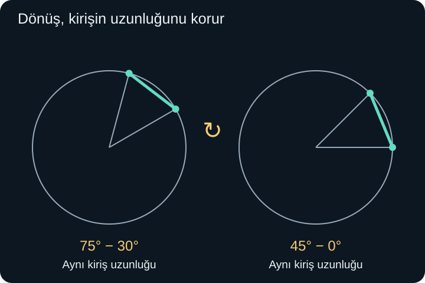
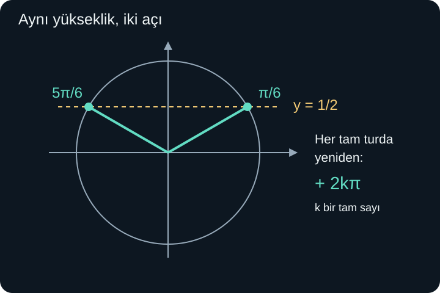

import ArticleVideo from '@/components/ArticleVideo.astro'
import kavram from './media/01-kavram.mp4?url'
import kavramPoster from './media/01-kavram.jpg?url'

30 derecelik bir dönüşün ardından 45 derece daha dönersek toplam dönüş 75 derece olur. Açıları toplamak kolaydır. Peki yeni konumun yüksekliğini bulmak için iki açının sinüslerini de doğrudan toplayabilir miyiz?

Denersek $\sin30^\circ+\sin45^\circ=1/2+\sqrt2/2$ buluruz. Bu sayı 1'den büyüktür. Oysa birim çember üzerindeki hiçbir noktanın yüksekliği 1'i aşamaz. Demek ki açı toplamı ile sinüs değerlerinin toplamı farklı şeylerdir. Yeni açının sinüsünü hesaplamak için, iki dönüşün yatay ve düşey etkilerini birlikte hesaba katmalıyız.

[Önceki yazıda](/blog/birim-cember-radyan-ve-trigonometrik-grafikler/) birim çemberde yatay koordinatın kosinüs, düşey koordinatın sinüs olduğunu gördük. Burada bunlara koordinat düzleminde uzaklık, iki kare toplamı, çarpanlara ayırma ve denklem çözme bilgimizi ekleyeceğiz. Vektörleri veya matrisleri henüz kullanmayacağız. Derece yazılmayan açılar radyanla ölçülecek; $\pi$ radyan ile $180^\circ$ aynı dönüşü gösterecek.

## 1. Bir Özdeşlik Ne Söyler?

$$
\sin^2x+\cos^2x=1
$$

Buradaki $\sin^2x$, $(\sin x)^2$ demektir; açının karesinin sinüsü değildir. Eşitlik, birim çemberin $x$ açısındaki noktasına Pisagor uygulanmasından gelir. Açı hangi gerçek sayı olursa olsun geçerlidir. Böyle bir eşitliğe **özdeşlik** deriz.

Buna karşılık $\sin x=1/2$ eşitliği her açı için doğru değildir. Söz gelimi $x=0$ için sol taraf 0'dır. Bu kez eşitliği sağlayan açıları ararız; elimizde bir **denklem** vardır. Aynı eşitlik işareti kullanılmasına rağmen, yaptığımız iş değişir: özdeşlikte iki ifadenin aynı değeri verdiğini gösterir, denklemde hangi girdilerin eşitliği sağladığını buluruz.

Özdeşliklerin de tanım koşulları vardır. $\tan x=\sin x/\cos x$ eşitliği ancak $\cos x\ne0$ olduğunda anlamlıdır. “Her açı için doğru” yerine, gerektiğinde “iki tarafın da tanımlı olduğu bütün açılar için doğru” dememiz gerekir. Tanımsız bir ifadeyi eşitliğe yazmak onu tanımlı hâle getirmez.

## 2. Dönüş Bir Uzaklığı Değiştirmez

Kosinüsün fark bağıntısını, aynı doğru parçasının uzunluğunu iki farklı konumda hesaplayarak kurabiliriz. Birim çember üzerinde açıları $a$ ve $b$ olan iki noktayı seçelim. $a$ ve $b$ burada iki gerçek açı ölçüsünü temsil eder. Noktalara $P$ ve $Q$ dersek koordinatları:

$$
P=(\cos a,\sin a),\qquad Q=(\cos b,\sin b)
$$

olur. İki nokta arasındaki doğru parçasına **kiriş** denir. Uzaklığın karesini $d^2$ ile gösterelim. Koordinat farklarına Pisagor uygularız:

$$
d^2=(\cos a-\cos b)^2+(\sin a-\sin b)^2.
$$

Her parantezin karesini açalım. Kosinüslerden $\cos^2a-2\cos a\cos b+\cos^2b$, sinüslerden $\sin^2a-2\sin a\sin b+\sin^2b$ gelir. Aynı açıya ait kareleri yan yana getirince:

$$
d^2=2-2\cos a\cos b-2\sin a\sin b.
$$

Buradaki 2, iki ayrı birim yarıçapın karelerinden geldi: $\cos^2a+\sin^2a=1$ ve $\cos^2b+\sin^2b=1$.

Şimdi bütün şekli merkez çevresinde $-b$ açısı kadar döndürelim. $Q$ noktası $(1,0)$ konumuna gelir. $P$ ise açısı $a-b$ olan konuma taşınır. Bir şekli katı biçimde döndürmek uzunluklarını değiştirmez; bu, düzlem geometrisindeki eşlik düşüncesidir. Dolayısıyla aynı $d$ uzaklığını yeni konumda da hesaplayabiliriz:

$$
d^2=(\cos(a-b)-1)^2+\sin^2(a-b).
$$

Kareyi açınca $\cos^2(a-b)-2\cos(a-b)+1+\sin^2(a-b)$ elde edilir. İki kare toplamı yine 1 olduğundan:

$$
d^2=2-2\cos(a-b).
$$

Aynı uzunluğun karesini iki biçimde bulduk. Sağ tarafları eşitleyip her iki taraftan 2 çıkaralım; sonra sıfırdan farklı olan $-2$'ye bölelim:

$$
\boxed{\cos(a-b)=\cos a\cos b+\sin a\sin b.}
$$

Çizimde iki dar açı gösterilmiş olması, sonucun yalnızca dar açılara ait olduğu anlamına gelmez. Koordinatlar işaretli gerçek sayılardır; dönüş ve uzaklık hesabı bütün yönlü açılar için çalışır. Böylece tek bir şeklin görünüşüne bağlı bir varsayım yapmadan genel bağıntıya ulaştık.

## 3. Toplam ve Fark Formülleri

Birim çemberde yatay eksene göre yansıma, açıyı $b$'den $-b$'ye götürür. Yatay koordinat değişmez, düşey koordinatın işareti değişir. Bu nedenle $\cos(-b)=\cos b$ ve $\sin(-b)=-\sin b$ olur.

Kosinüs fark bağıntısında $b$ yerine $-b$ yazalım. Solda $a-(-b)=a+b$ kalır; sağdaki sinüs çarpımı eksi işareti kazanır:

$$
\boxed{\cos(a+b)=\cos a\cos b-\sin a\sin b.}
$$

Sinüs formülünü de aynı geometriden çıkarabiliriz. Birim çemberde $\sin t=\cos(\pi/2-t)$ ilişkisi vardır. Buradaki $t$ herhangi bir açıdır; çeyrek turla ilişkilenen iki noktanın yatay ve düşey koordinatları yer değiştirir. Dolayısıyla:

$$
\sin(a+b)=\cos\bigl((\pi/2-a)-b\bigr).
$$

Sağa az önce kanıtladığımız kosinüs fark bağıntısını uygularsak $\cos(\pi/2-a)\cos b+\sin(\pi/2-a)\sin b$ çıkar. İlk çeyrek tur ilişkisi $\sin a$, ikincisi $\cos a$ olduğundan:

$$
\boxed{\sin(a+b)=\sin a\cos b+\cos a\sin b.}
$$

Burada da $b$ yerine $-b$ yazınca:

$$
\boxed{\sin(a-b)=\sin a\cos b-\cos a\sin b.}
$$

Bu dört bağıntıyı işaretleriyle birlikte okumak gerekir. Kosinüs toplamında eksi, kosinüs farkında artı vardır. Sinüste ise açıların arasındaki işaret iki çarpımın arasında korunur. İşaretleri ezberlerken tereddüt edersek, $a=b$ seçerek küçük bir kontrol yapabiliriz: kosinüs farkı 1 vermeli, sinüs farkı 0 olmalıdır.

### Bilinen açılardan yeni bir değer

$75^\circ=45^\circ+30^\circ$ olduğuna göre:

$$
\sin75^\circ
=\frac{\sqrt2}{2}\frac{\sqrt3}{2}
+\frac{\sqrt2}{2}\frac12
=\frac{\sqrt6+\sqrt2}{4}.
$$

Bu yaklaşık $0{,}966$'dır ve beklediğimiz gibi 1'den küçüktür. Kosinüste aynı iki çarpımı çıkarırız:

$$
\cos75^\circ=\frac{\sqrt6-\sqrt2}{4}\approx0{,}259.
$$

Tam değer köklü ifadedir; ondalık sayı yuvarlanmış bir yaklaşımdır. Ayrıca $75^\circ$ birinci bölgede bulunduğu için hem sinüs hem kosinüs pozitif çıkmalıdır. İşaret kontrolü, uzun bir işlemin sonunda basit ama etkili bir denetim sağlar.

<ArticleVideo src={kavram} poster={kavramPoster} title="İki açının toplamı ve çemberdeki koordinatlar" caption="30 derecelik dönüşe 45 derece eklenince 75 dereceye ulaşılır. Yeni noktanın yatay ve düşey koordinatları birlikte değişir." />

### Tanjant toplamı hangi koşullarda kullanılır?

$\tan(a+b)$ için sinüs toplamını kosinüs toplamına böleriz. Ardından pay ve paydayı $\cos a\cos b$ ile bölersek:

$$
\tan(a+b)=\frac{\tan a+\tan b}{1-\tan a\tan b}.
$$

Bu yazım için $\cos a$ ve $\cos b$ sıfır olmamalıdır. Son payda da sıfır olamaz; bu koşul toplam açının tanjantının tanımlı olmasını sağlar. Örneğin $a=b=45^\circ$ seçildiğinde payda $1-1=0$ olur. Bu bir hesap kazası değildir: toplam $90^\circ$'dir ve tanjantı tanımsızdır.

Fark formülünde benzer biçimde $\tan(a-b)=(\tan a-\tan b)/(1+\tan a\tan b)$ elde edilir. Yine iki ayrı tanjantın ve son bölümün tanımlı olması gerekir. Sinüs ve kosinüs toplamları bu ek bölme kısıtlarına ihtiyaç duymaz.

## 4. İki Kat Açı Yeni Bir Konu Değil

Toplam bağıntılarında iki açıyı eşit seçelim: $b=a$. Böylece:

$$
\sin2a=2\sin a\cos a
$$

ve

$$
\cos2a=\cos^2a-\sin^2a
$$

çıkar. İlk formülde aynı çarpım iki kez toplanır. İkincide iki farklı kare çıkarılır. Bu nedenle genel olarak $\sin2a=2\sin a$ diyemeyiz; sağ tarafta bir de $\cos a$ çarpanı bulunmalıdır.

$\sin^2a+\cos^2a=1$ ilişkisini kullanarak kosinüs formülünü iki başka biçimde yazabiliriz:

$$
\cos2a=1-2\sin^2a=2\cos^2a-1.
$$

Örneğin $\sin^2a=(1-\cos2a)/2$ ifadesi, aynı eşitliği sinüsün karesi için çözmektir. Yeni bir ezber gerektirmez: önce $2\sin^2a=1-\cos2a$, sonra ikiye bölme gelir.

Birinci bölgede $\sin a=3/5$ verilsin. Önce $\cos^2a=1-9/25=16/25$ buluruz. Bölge kosinüsün pozitif olduğunu söylediği için $\cos a=4/5$ seçeriz. Ardından $\sin2a=2(3/5)(4/5)=24/25$ ve $\cos2a=16/25-9/25=7/25$ çıkar. İki değerin kareleri toplamı $(576+49)/625=1$ olduğundan çember koşulu da sağlanır.

## 5. Yarım Açıda İşareti Kim Belirler?

İki kat açı bağıntısında $a$ yerine $x/2$ yazarsak:

$$
\sin^2(x/2)=\frac{1-\cos x}{2},
\qquad
\cos^2(x/2)=\frac{1+\cos x}{2}.
$$

Karelerden fonksiyon değerlerine geçerken işaret bilgisi gerekir:

$$
\sin(x/2)=\pm\sqrt{\frac{1-\cos x}{2}},
$$

$$
\cos(x/2)=\pm\sqrt{\frac{1+\cos x}{2}}.
$$

Buradaki artı-eksi, sinüs veya kosinüsün aynı anda iki değer aldığı anlamına gelmez. **Verilen açı için tek doğru işaret vardır; onu yarım açının bulunduğu bölge belirler.** Karekök sembolü kendi başına sıfır veya pozitif değeri verdiğinden, negatif değer gerekiyorsa dışarıya eksi yazılır.

Örneğin $x=240^\circ$ olsun. $x/2=120^\circ$ ikinci bölgededir: sinüs pozitif, kosinüs negatiftir. $\cos240^\circ=-1/2$ olduğundan:

$$
\sin120^\circ=+\sqrt{\frac{1+1/2}{2}}
=\sqrt{\frac34}=\frac{\sqrt3}{2},
$$

$$
\cos120^\circ=-\sqrt{\frac{1-1/2}{2}}
=-\sqrt{\frac14}=-\frac12.
$$

İşareti $240^\circ$'nin bölgesine göre seçmek yanlış olurdu. Formülde aradığımız değerler $120^\circ$'ye aittir. Aynı şekilde, yalnızca $\cos x$ verilmesi yarım açıların işaretlerini her zaman belirlemeye yetmez; açının aralığı da gerekebilir.

## 6. Bir Denklemde Bütün Açıları Bulmak

$\sin x=1/2$ denklemini birim çemberde düşünelim. Sinüs düşey koordinattı. Yüksekliği $1/2$ olan yatay çizgi, çemberi bir tur içinde iki noktada keser: $\pi/6$ ve $5\pi/6$.

Tam tur eklemek aynı noktaya döndürdüğünden bütün gerçek çözümler:

$$
x=\frac\pi6+2k\pi
\quad\text{veya}\quad
x=\frac{5\pi}6+2k\pi,
\qquad k\in\mathbb Z.
$$

$\mathbb Z$ tam sayılar kümesidir; $k$ sıfır, pozitif veya negatif herhangi bir tam sayı olabilir. Böylece ileri ve geri yöndeki bütün turları tek bir yazımda kapsarız. Soruda yalnızca $0\le x<2\pi$ isteniyorsa iki temel açıyı alırız. Genel çözüm ile belirli aralıktaki çözüm aynı şey değildir.

$\cos x=-\sqrt2/2$ için yatay koordinat negatiftir. Bir tur içindeki açılar $3\pi/4$ ve $5\pi/4$ olur; ikisine de $2k\pi$ eklenir. $\tan x=1$ içinse birinci ve üçüncü bölgedeki açılar aynı oranı verir. Tanjantın periyodu $\pi$ olduğundan bütün çözümler $x=\pi/4+k\pi$ biçiminde tek ailede yazılabilir.

Sinüs veya kosinüs için istenen değer $[-1,1]$ aralığının dışındaysa gerçek çözüm yoktur. $\sin x=1{,}2$ denklemi, çember üzerinde bulunmayan bir yüksekliği ister. Denklem çözümüne başlamadan değer aralığını kontrol etmek gereksiz işlemleri engeller.

### İçeride farklı bir açı varsa

$\sin(2x)=1/2$ denkleminde birim çemberin açısı doğrudan $x$ değil, $2x$'tir. Önce:

$$
2x=\frac\pi6+2k\pi
\quad\text{veya}\quad
2x=\frac{5\pi}6+2k\pi
$$

yazarız. İkiye bölerken yalnızca ilk terimi değil, bütün sağ tarafı böleriz:

$$
x=\frac\pi{12}+k\pi
\quad\text{veya}\quad
x=\frac{5\pi}{12}+k\pi.
$$

$0\le x<2\pi$ aralığında $k=0$ ve $k=1$ uygundur. Sonuçlar $\pi/12$, $5\pi/12$, $13\pi/12$ ve $17\pi/12$ olur. İçerideki açı iki kat hızlı ilerlediği için, aynı $x$ aralığında daha çok çözümle karşılaşırız.

## 7. Bölme Yaparken Bir Çözümü Kaybetmemek

Şimdi $\sin2x=\sin x$ denklemini çözelim. İki kat açı bağıntısıyla:

$$
2\sin x\cos x=\sin x.
$$

Burada iki tarafı hemen $\sin x$'e bölmek cazip görünebilir. Fakat $\sin x=0$ olabilirse sıfıra bölmüş oluruz; üstelik bu açılar ilk denklemi sağlar. Güvenli yol bütün terimleri bir tarafa taşıyıp çarpanlara ayırmaktır:

$$
\sin x(2\cos x-1)=0.
$$

Bir çarpımın sıfır olması için çarpanlardan en az biri sıfır olmalıdır. İki durum elde ederiz: $\sin x=0$ veya $\cos x=1/2$. Birincisi $x=k\pi$ verir. İkincisi $x=\pi/3+2k\pi$ veya $x=5\pi/3+2k\pi$ verir.

$0\le x<2\pi$ aralığında çözümler $0$, $\pi/3$, $\pi$ ve $5\pi/3$ olur. Başta sinüse bölseydik $0$ ile $\pi$'yi kaybederdik. Bölme adımı yanlış cebir yapıldığı için değil, bölenin sıfır olabileceği durumu dışladığı için sorun çıkarır.

Kare alma işlemi ters yönde tehlike taşır: çözüm kaybetmek yerine yeni adaylar ekleyebilir. Örneğin $\sin x=-1/2$ denkleminin karesini alınca $\sin^2x=1/4$ olur. Son denklem $\sin x=+1/2$ olan açıları da kabul eder. Bu yüzden adayları başlangıç denkleminde doğrulamak gerekir. Aynı dikkat köklü ve paydalı cebirsel denklemlerde de geçerliydi.

## 8. Aralığı ve Birimi Sonuca Taşımak

Bir denklemde açı birimi, yalnızca yazının süsü değildir. $\sin x=1/2$ için dereceyle genel çözüm $x=30^\circ+360^\circ k$ veya $x=150^\circ+360^\circ k$ olur. Radyanla yazdığımız iki aile bunlarla aynı dönüşleri anlatır. Ancak $30+2k\pi$ gibi bir yazım, 30'u derece sanıp turu radyanla eklersek iki farklı ölçüyü karıştırır. Başlangıçta hangi birimi seçtiysek bütün işlem boyunca onu koruruz.

Hesap makinesinde de aynı dikkat gerekir. Derece modunda girilen 30 ile radyan modunda girilen 30, çemberde çok farklı dönüşlerdir. Yaklaşık sonuç beklenen bölgede görünmüyorsa önce işlem sırasını ve birim ayarını kontrol ederiz. Sayısal bir sonuç, yalnızca ekranda çıktığı için matematiksel koşulları sağlamış sayılmaz.

Aralık uçlarına da ayrı bakmalıyız. $\sin x=0$ denklemini $[0,2\pi]$ kapalı aralığında çözersek $0$, $\pi$ ve $2\pi$ vardır. $[0,2\pi)$ yarı açık aralığında sonuncusu yoktur. Çember üzerinde $0$ ile $2\pi$ aynı noktaya karşılık gelir; fakat denklemde farklı gerçek sayılardır. Sorunun değişkeni çember noktası değil açı ölçüsü olduğunda ikisini ayrı çözüm olarak sayabiliriz.

Birden fazla dönüşüm içeren örnekte bu disiplin daha görünür olur. $\cos(3x-\pi/2)=0$ denklemini düşünelim. Kosinüsün sıfır olduğu açılar $\pi/2+k\pi$ biçimindedir. Önce içerdeki ifadenin tamamını bu açıya eşitleriz:

$$
3x-\frac\pi2=\frac\pi2+k\pi.
$$

İki tarafa $\pi/2$ ekleyince $3x=\pi+k\pi$ olur. Üçe bölersek $x=\pi/3+k\pi/3$ elde edilir. $k$ bütün tam sayıları dolaştığı için bunu $x=m\pi/3$, $m\in\mathbb Z$ biçiminde de yazabiliriz: yeni tam sayı $m=k+1$'dir. İki farklı görünüş, aynı çözüm kümesini temsil eder.

$0\le x<2\pi$ koşulu verilseydi, $m=0,1,2,3,4,5$ seçilirdi. Altı çözüm elde etmemizin sebebi, içerideki $3x$ açısının üç tam tur taramasıdır. Bunlardan $x=0$'ı başlangıçta denetlersek $\cos(-\pi/2)=0$ buluruz. Böyle bir kontrol, genel çözümü yeniden adlandırırken bir başlangıç değerini yanlışlıkla dışarıda bırakmadığımızı gösterir.

## 9. Özdeşliği Kullanmak ile Kanıtlamak

$\cos x\ne0$ koşulunda şu ifadeyi sadeleştirelim:

$$
\frac{1-\sin^2x}{\cos x}.
$$

Pay, temel özdeşlik gereği $\cos^2x$'tir. Böylece bölüm $\cos x$ olur. Ancak ilk ifadenin tanımından gelen $\cos x\ne0$ koşulu kaybolmaz. Sadeleşmiş ifade daha çok noktada tanımlı olsa bile, iki ifadenin eşitliğini yalnızca ilk ifadenin tanımlı olduğu yerlerde söylüyoruz.

Bir özdeşliği birkaç açı için denemek kontrol sağlar ama ispat değildir. Yukarıdaki dönüşüm ise payı bütün izin verilen açılarda eşit bir ifadeyle değiştirdiği, sonra sıfırdan farklı ortak çarpanı sadeleştirdiği için geneldir. Her adımda “Bu eşitliği hangi bilgiyle yazdım?” sorusuna cevap verebiliriz.

Bu yazıda çemberdeki konumları birbirine bağlayan kuralları kurduk. Sonraki adım, bu kurallarla bir üçgenin eksik kenarlarını ve açılarını bulmak olacak. Bunun için ayrıca, sinüs veya kosinüs değeri verildiğinde bir açının nasıl seçildiğini ve neden bazen iki farklı üçgenin aynı verilere uyduğunu açıklayacağız.

## Kaynakça

Anlatım, çözümlü örneklerin düzeni ve şekiller özgün hazırlanmıştır. Aşağıdaki açık ders kitabı sayfaları 8 Ekim 2026 tarihinde doğrudan kontrol edilmiştir; tanım koşulları ve bağıntıların kapsamı için başvuru niteliğindedir.

- [OpenStax, Precalculus 2e — Sum and Difference Identities](https://openstax.org/books/precalculus-2e/pages/7-2-sum-and-difference-identities): Toplam ve fark bağıntıları ile tanjant formüllerinin bölme koşulları.
- [OpenStax, Precalculus 2e — Double-Angle, Half-Angle, and Reduction Formulas](https://openstax.org/books/precalculus-2e/pages/7-3-double-angle-half-angle-and-reduction-formulas): İki kat açı, yarım açı ve bölgeye bağlı işaret seçimi.
- [OpenStax, Precalculus 2e — Solving Trigonometric Equations](https://openstax.org/books/precalculus-2e/pages/7-5-solving-trigonometric-equations): Periyotla genel çözüm ve sınırlı aralıkta çözüm seçme.
