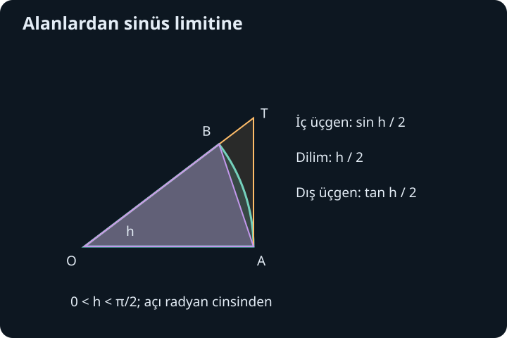
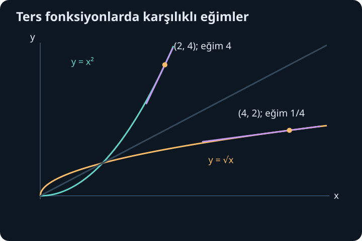

import ArticleVideo from '@/components/ArticleVideo.astro'
import kavram from './media/01-kavram.mp4?url'
import kavramPoster from './media/01-kavram.jpg?url'

Sinüsün türevinin kosinüs olduğunu bir tablodan öğrenebiliriz. Fakat böyle bir tablo iki soruyu açık bırakır: Bu sonuç neden doğrudur ve açıyı hangi birimle ölçüyoruz? Ters fonksiyonlarda da benzer bir sorun vardır. Bir işlemi geri çevirmek, değişim hızını nasıl etkiler? Bu yazıda kuralların arkasındaki limitleri kuracağız; ardından kuralların nerede kullanılabildiğini örneklerle göreceğiz.

[Önceki yazıda](/blog/turevin-anlami-ve-temel-kurallari/) türevi fark oranının limiti olarak tanımladık. Çarpım, bölüm ve zincir kurallarını kullanacağız. Trigonometriden gereken bilgiler birim çember, sinüs ve kosinüsün toplam formülleri ile $\sin^2x+\cos^2x=1$ özdeşliğidir. Ters fonksiyon, bir fonksiyonun çıktısından girdisine dönmemizi sağlar; birazdan bu dönüşün neden uygun bir aralık seçmeyi gerektirdiğini de açıklayacağız.

## 1. Radyan koşulu bir ayrıntı değildir

Yarıçapı $r$ olan bir çemberde uzunluğu $s$ olan yayın gördüğü merkez açı, radyan cinsinden $h=s/r$ olarak tanımlanır. Birim çemberde $r=1$ olduğu için açının radyan değeri, ilgili yayın uzunluğuna sayıca eşittir. Tam çemberin açısı $2\pi$ radyan; düz açınınki $\pi$ radyandır. Dereceyle yazılan 180 sayısı aynı açıyı anlatır, fakat aynı sayısal girdi değildir.

Türev, çıktı değişimini girdi değişimine böler. Girdi birimini değiştirince bu oran da değişir. Dolayısıyla $\sin x$ yazarken $x$'in radyan olarak ölçüldüğünü kabul edeceğiz. Derece cinsinden bir $d$ girdisi kullanırsak aynı fonksiyon $\sin(\pi d/180)$ biçiminde yazılır. Zincir kuralı onun türevine $\pi/180$ çarpanı getirir. Bu çarpanı unutmak, bir birim dönüşümünü unutmak demektir.

## 2. Üç alanın arasında bir limit

$0<h<\pi/2$ olsun. Birim çemberin merkezi $O$, sağdaki noktası $A=(1,0)$ ve çember üzerindeki diğer noktası $B=(\cos h,\sin h)$ olsun. $OA$ ile $OB$ arasındaki açı $h$'dir. $A$'daki teğet ile $OB$ doğrultusunun kesişimine $T$ diyelim. İçteki $OAB$ üçgeni, çember dilimi ve dıştaki $OAT$ üçgeni birbirini kapsar.

İç üçgenin tabanı 1, yüksekliği $\sin h$ olduğundan alanı $\sin h/2$'dir. Dilimin alanı $h/2$'dir: tam çember alanı $\pi$ ve açı payı $h/(2\pi)$ olduğundan çarpımları bu sonucu verir. Dış üçgenin yüksekliği $\tan h$ olduğundan alanı $\tan h/2$ olur. Kapsama ilişkisi böylece:

$$
\frac{\sin h}{2}\leq\frac h2\leq\frac{\tan h}{2}
$$

eşitsizliğini verir. İkiyle çarpıp $\tan h=\sin h/\cos h$ yazarsak $\sin h\leq h\leq\sin h/\cos h$ elde ederiz. Bu aralıkta bütün bölenler pozitiftir. Eşitsizlikleri düzenleyince:

$$
\cos h\leq\frac{\sin h}{h}\leq1
$$

bulunur. $h$ sıfıra giderken birim çemberdeki nokta $A$'ya yaklaşır; $\cos h\to1$ olur. Sıkıştırma teoremine göre ortadaki oran da 1'e yaklaşır. Negatif $h$ için sinüsün tekliği sayesinde $\sin(-h)/(-h)=\sin h/h$ olduğundan aynı sonuç soldan da geçerlidir:

$$
\boxed{\lim_{h\to0}\frac{\sin h}{h}=1.}
$$

Burada $h=0$ için kesri tanımlamadık. Sıfıra yaklaşırken aldığı değerlere baktık. Ayrıca sinüsün türevini kullanmadık: kanıt, çember geometrisi ve alan karşılaştırmasına dayanıyor. Türevi kanıtlamak için henüz kanıtlanmamış aynı türevi kullanmak bir döngü olurdu.

Kosinüsün sürekliliği de bu geometriyle uyumludur. Küçük $h$ için $|\sin h|\leq|h|$ elde ettik. $1-\cos h=2\sin^2(h/2)$ özdeşliğinden $0\leq1-\cos h\leq h^2/2$ gelir. Dolayısıyla $h\to0$ iken kosinüsün 1'e gitmesi ayrıca bu eşitsizlikle doğrulanabilir; türev bilgisi gerektirmez.

## 3. Kosinüslü ikinci limit

Sinüsün toplam formülünde iki farklı küçük değişim ortaya çıkacak. İkincisini şimdiden hazırlayalım. Sıfıra yakın ve sıfırdan farklı $h$ için eşlenikle çarparız:

$$
\frac{\cos h-1}{h}
=\frac{\cos^2h-1}{h(\cos h+1)}
=-\frac{\sin h}{h}\frac{\sin h}{\cos h+1}.
$$

İlk oran 1'e, ikinci oran $0/2=0$'a gider. Sonuç:

$$
\lim_{h\to0}\frac{\cos h-1}{h}=0
$$

olur. Payda $\cos h+1$ sıfıra yakın bölgede sıfır değildir. Sadeleştirme ve limit işlemlerini yaparken bu küçük koşul önemlidir. Büyük açılardaki olası sıfırlar, burada yalnız sıfırın çevresini incelediğimiz için soruna yol açmaz.

## 4. Sinüs ve kosinüsün türevlerini çıkarmak

$f(x)=\sin x$ için fark oranını yazalım. Toplam formülü $\sin(x+h)=\sin x\cos h+\cos x\sin h$ olduğundan:

$$
\frac{\sin(x+h)-\sin x}{h}
=\sin x\frac{\cos h-1}{h}
+\cos x\frac{\sin h}{h}.
$$

$x$ sabitken $h\to0$ alıyoruz. İlk terim $\sin x\cdot0$, ikincisi $\cos x\cdot1$ olur. Böylece $(\sin x)'=\cos x$ sonucunu elde ederiz. Aynı işlemi $\cos(x+h)=\cos x\cos h-\sin x\sin h$ toplam formülüne uygulayalım:

$$
\frac{\cos(x+h)-\cos x}{h}
=\cos x\frac{\cos h-1}{h}
-\sin x\frac{\sin h}{h}.
$$

Limit $-\sin x$ olur. İki temel kuralımız her gerçek radyan girdisi için geçerlidir:

$$
\boxed{(\sin x)'=\cos x,\qquad(\cos x)'=-\sin x.}
$$

Bu sonuçlar grafikle de okunur. Sinüs, sıfırda yukarı doğru en dik biçimde geçer ve türevi 1'dir. $\pi/2$ noktasında değeri 1 iken türevi 0 olur; teğeti yataydır. $\pi$ noktasında türevi $-1$'dir, yani artan girdi karşısında çıktı azalmaktadır. Türevin işareti ile fonksiyonun değeri farklı bilgilerdir: fonksiyon pozitifken azalabilir.

<ArticleVideo src={kavram} poster={kavramPoster} title="Sinüs boyunca değişen teğet" caption="Birim çemberde açı ilerlerken sinüs grafiğindeki teğetin eğimi kosinüs değerini izler." />

## 5. Yeni kuralları önceki kurallarla birleştirmek

Tanjant, $\tan x=\sin x/\cos x$ olduğundan yalnız $\cos x\ne0$ iken tanımlıdır. Bölüm kuralı:

$$
(\tan x)'=\frac{\cos^2x+\sin^2x}{\cos^2x}
=\frac1{\cos^2x}
$$

verir. Burada payın 1 olması trigonometrik özdeşlikten gelir. Tanjantın türevi tanımlı olduğu her noktada pozitiftir; ancak tanjant bütün gerçek doğru üzerinde kesintisiz bir fonksiyon değildir. Farklı dalları tek bir artma aralığı gibi birleştirmemeliyiz.

Örneğin $p(x)=\sin(3x^2)$ için dış fonksiyon sinüs, iç fonksiyon $3x^2$'dir. Önce dışın türevini iç girdide değerlendirir, sonra iç türevle çarparız:

$$
p'(x)=\cos(3x^2)\cdot6x.
$$

$6x$ çarpanı, iç açının $x$ ile ne hızla değiştiğini taşır. $x=0$ noktasında kosinüs 1 olsa da iç değişim hızı sıfırdır; sonuç $p'(0)=0$ olur.

Başka bir örnekte $q(x)=x^2\cos x$ olsun. İki çarpanın da değiştiğini hesaba katmalıyız:

$$
q'(x)=2x\cos x-x^2\sin x.
$$

$x=\pi/2$ noktasında ilk terim sıfır, ikinci terim $-\pi^2/4$ olur. Fonksiyonun o noktadaki değeri sıfırdır ama türevi sıfır değildir. Grafiğin ekseni kesmesi ile yatay teğet taşıması farklı olaylardır.

## 6. Ters fonksiyonda neden aralık seçiyoruz?

$f(x)=x^2$ bütün gerçek sayılarda bire bir değildir: 2 ve $-2$ aynı 4 sonucunu verir. Yalnız $x\geq0$ girdilerine kısıtlarsak ters işlem $g(y)=\sqrt y$ olur. Ters fonksiyonun varlığı için girdiyi çıktıdan tek biçimde geri bulabilmemiz gerekir. Yerel ters fonksiyon derken de tüm doğruyu değil, ilgilendiğimiz noktanın çevresindeki uygun aralığı kastediyoruz.

Sinüs de periyodik olduğundan tüm doğru üzerinde terslenemez. $[-\pi/2,\pi/2]$ aralığında sürekli ve kesin artandır; bu aralıktaki tersine $\arcsin$ denir. $\arcsin y$, sinüsü $y$ olan ve seçilen aralıkta kalan açıyı verir. $\sin^{-1}y$ gösterimi de kullanılabilir, fakat bu ifade $1/\sin y$ anlamına gelmez. Karışıklığı önlemek için burada arcsin yazacağız.

## 7. Ters türevin fark oranı

$f$, $a$'yı içeren açık bir aralıkta sürekli ve kesin monoton olsun; yani o aralıkta ya sürekli artan ya da sürekli azalan bir ilişki kursun. Bu özellikler, görüntü aralığında sürekli bir ters $g$ verir. Ayrıca $f$'nin $a$'da türevli ve $f'(a)\ne0$ olduğunu varsayalım. $b=f(a)$ olduğundan $g(b)=a$'dır.

$b$'ye yakın bir $y\ne b$ seçip $x=g(y)$ diyelim. Tersin sürekliliği $y\to b$ iken $x\to a$ demektir. Bire birlik nedeniyle $y\ne b$ iken $x\ne a$'dır. Şimdi tersin fark oranı:

$$
\frac{g(y)-g(b)}{y-b}
=\frac{x-a}{f(x)-f(a)}
=\frac1{\dfrac{f(x)-f(a)}{x-a}}
$$

olur. Alttaki oran $f'(a)$'ya gider. Bu limit sıfır olmadığı için tersini alabiliriz:

$$
\boxed{g'(b)=\frac1{f'(a)}=\frac1{f'(g(b))}.}
$$

Bu bir ezberden önce bir oran ilişkisidir. İleri yönde çıktı değişimini girdi değişimine bölüyorduk; geri yönde aynı iki değişimin yerini değiştiriyoruz. Ancak limitin sıfır olmaması ve tersin sürekliliği, bu fikri geçerli bir kanıta dönüştüren koşullardır.

Örneğin $f(x)=x^2$'nin pozitif dalında $a=2$, $b=4$ olsun. İleri türev 4, ters türev $1/4$ olur. Gerçekten $g(y)=\sqrt y$ için $g'(y)=1/(2\sqrt y)$ ve $g'(4)=1/4$'tür. Kare fonksiyonunun sıfırdaki türevi ise sıfırdır; ters kuralın varsayımı orada bozulur. Karekökün sıfırdaki sağ fark oranı $\sqrt h/h=1/\sqrt h$ sınırsız büyür; sonlu türev elde edilmez.

## 8. Üç ters trigonometrik türev

$y=\arcsin x$ yazarsak $x=\sin y$ ve $-\pi/2\leq y\leq\pi/2$ olur. İç noktalarda $\cos y>0$'dır. Ters kural ve çember özdeşliğiyle:

$$
\frac{dy}{dx}=\frac1{\cos y}
=\frac1{\sqrt{1-\sin^2y}}
=\frac1{\sqrt{1-x^2}},\qquad -1<x<1.
$$

Karekökün pozitif işaretini rastgele seçmedik; seçilen açı aralığında kosinüs pozitif olduğu için seçtik. $x=\pm1$ uçlarında payda sıfırdır ve bu formül sonlu türev vermez. Fonksiyon uçlarda tanımlı olabilirken türev orada bulunmayabilir.

$y=\arccos x$ için $0\leq y\leq\pi$ dalını seçeriz. Kosinüs bu aralıkta azalandır ve iç noktalarda $\sin y>0$ olur. İleri türev $-\sin y$ olduğundan:

$$
(\arccos x)'=-\frac1{\sqrt{1-x^2}},\qquad -1<x<1.
$$

Eksi işareti anlamlıdır: daha büyük bir kosinüs değeri, bu dalda daha küçük bir açıya karşılık gelir. Arcsin artarken arccos azalır.

Son olarak $y=\arctan x$ için $-\pi/2<y<\pi/2$ dalını kullanırız. Tanjant bu açık aralıkta bütün gerçek çıktıları bir kez alır. İleri türev $1/\cos^2y=1+\tan^2y$ olduğundan:

$$
(\arctan x)'=\frac1{1+x^2},\qquad x\in\mathbb R.
$$

Burada $\mathbb R$ gerçek sayılar kümesidir. Payda en az 1 olduğu için sonlu türev bütün gerçek girdilerde vardır. Büyük $|x|$ değerlerinde türev küçülür; arktanjant grafiği yatay sınırlara yaklaşırken giderek yatıklaşır.

## 9. Bileşkede alanı ve işareti birlikte takip etmek

$r(x)=\arcsin(2x)$ fonksiyonunda önce tanım alanını bulalım. İç değer $-1\leq2x\leq1$ olmalıdır; dolayısıyla $-1/2\leq x\leq1/2$. Türev formülü iç noktalar için:

$$
r'(x)=\frac{2}{\sqrt{1-4x^2}},\qquad |x|<\frac12
$$

olur. Paydaki 2 iç fonksiyonun türevidir. $x=1/4$ için payda $\sqrt{3/4}=\sqrt3/2$ olduğundan sonuç $4/\sqrt3$'tür. Uçlarda fonksiyon değeri vardır, ama bu hesap sonlu türev vermez.

$s(x)=\arctan(x^2)$ için ise bütün gerçek $x$ değerleri kullanılabilir ve $s'(x)=2x/(1+x^4)$ olur. $x<0$ iken türev negatiftir; arktanjantın kendisinin artan olması bileşkenin her yerde artacağını garanti etmez. İçteki kare fonksiyonu negatif tarafta azalır ve bileşke bu değişimi izler. Bu örnek, zincir kuralının çarpanlarını yalnız cebirsel zorunluluk olarak değil, iki ardışık değişimin hesabı olarak okumamızı sağlar.

Trigonometrik türevleri artık geometrik bir limitten, ters türevleri ise karşılıklı fark oranlarından elde ettik. Üstel ve logaritmik türevlerin tam gerekçesini integral yardımıyla kuracağız. Ondan önce türevin yalnız teğet hesaplamakla kalmayıp bir fonksiyonun artışı, azalışı ve en iyi değerleri hakkında nasıl kesin sonuçlar verdiğini inceleyeceğiz.

## Kaynaklar

Bu yazıdaki anlatım, örnekler ve görseller özgündür. Kuralların kapsamı ve ters fonksiyon koşulları açık ders kaynaklarıyla karşılaştırılmıştır.

- [OpenStax, Calculus Volume 1: Derivatives of Trigonometric Functions](https://openstax.org/books/calculus-volume-1/pages/3-5-derivatives-of-trigonometric-functions)
- [OpenStax, Calculus Volume 1: Derivatives of Inverse Functions](https://openstax.org/books/calculus-volume-1/pages/3-7-derivatives-of-inverse-functions)
