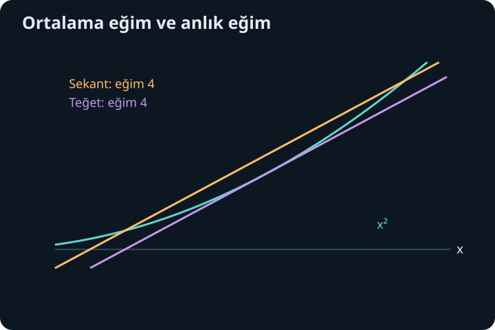
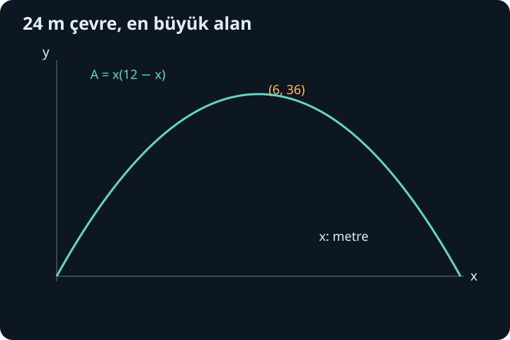

import ArticleVideo from '@/components/ArticleVideo.astro'
import kavram from './media/01-kavram.mp4?url'
import kavramPoster from './media/01-kavram.jpg?url'

Bir fonksiyonun türevini hesaplamak, onun hakkında karar vermenin başlangıcıdır. Bir kapta kullanılacak malzeme miktarını küçültmek, bir grafiğin nerede yükseldiğini görmek veya birbirine bağlı iki uzunluğun değişimini karşılaştırmak için türevin bize neyi garanti ettiğini bilmeliyiz. Birkaç noktada olumlu eğim görmek bütün aralıkta artış kanıtı değildir. Aynı şekilde türevin sıfır olması da en büyük değeri bulduğumuz anlamına gelmez.

[Önceki yazıda](/blog/trigonometrik-ve-ters-fonksiyonlarda-turev/) trigonometrik ve ters fonksiyon türevlerini kurduk. Burada esas gereksinimimiz türev tanımı, süreklilik, aralıklar ve zincir kuralıdır. Önce bir noktadaki eğim bilgisini bir aralığın toplam değişimine bağlayacağız. Sonra grafik okuma, en büyük değer bulma ve bağlı değişim hesapları aynı çerçeveye oturacak.

## 1. En büyük değerin gerçekten bulunması

Bir kümede alınan bütün değerlerden büyük veya onlara eşit olan ve fonksiyonun gerçekten aldığı değere **mutlak maksimum** denir. Mutlak minimum bunun küçük olan karşılığıdır. **Yerel maksimum** ise yalnız bir noktanın yeterince küçük çevresindeki değerlerle karşılaştırılır. Bir tepe bütün dağların en yüksek tepesi olmak zorunda değildir; “yerel” sözcüğü karşılaştırmanın alanını sınırlar.

Sürekli bir $f$ fonksiyonu kapalı ve sınırlı $[a,b]$ aralığında tanımlıysa hem mutlak maksimum hem mutlak minimum alır. Bu, ekstremum teoremidir. Kapalı aralık uçları içerir; sınırlı aralık sonlu iki uç arasında kalır. Teorem bu değerlerin nerede olduğunu söylemez, fakat aramanın boşa çıkmayacağını garanti eder.

Koşulları kaldırınca ne olacağını görelim. $f(x)=x$, $(0,1)$ açık aralığında süreklidir; ama 1'e yaklaşmasına rağmen hiçbir girdide 1'i alamaz. Bu aralıkta en büyük değeri yoktur. $f(x)=x$ bütün gerçek doğru üzerinde de süreklidir; bu kez yukarıdan sınırsızdır. Sürekliliği kaldırmak da sorun çıkarır: $f(x)=x$ değerini $0\leq x<1$ için koruyup $f(1)=0$ seçersek kapalı $[0,1]$ aralığında yine maksimum yoktur.

Teoremin arkasındaki gerçek sayı özelliği şudur: kapalı, sınırlı bir aralıkta seçilen her sonsuz nokta dizisinin, aynı aralık içindeki bir noktaya yaklaşan alt dizisi vardır. Fonksiyon değerleri sınırsız olsaydı değerleri büyüyen bir nokta dizisi seçer, yakınsayan alt dizide süreklilik nedeniyle sonlu bir değere ulaşırdık; bu çelişkidir. Değerler sınırlıysa en küçük üst sınıra yaklaşan bir dizi seçebiliriz. Aynı alt dizi düşüncesi ve süreklilik, bu üst sınırın bir noktada gerçekten alınmasını sağlar. Ayrıntılı gerçek analiz ispatının temeli budur.

## 2. Fermat koşulu: içteki düzgün tepe yataydır

$f$, iç noktası $c$'de yerel maksimum alsın ve orada türevli olsun. Yeterince küçük $h$ için $f(c+h)-f(c)\leq0$ olur. Pozitif $h$ ile bölersek fark oranı sıfırdan büyük değildir. Negatif $h$ ile bölersek eşitsizliğin yönü değişir ve oran sıfırdan küçük değildir. İki taraf aynı sonlu türeve yaklaşacağı için ortak değer yalnız sıfır olabilir:

$$
f'(c)=0.
$$

Minimumda eşitsizlikler tersine döner, sonuç değişmez. Fermat teoremi, türevlenebilir bir iç ekstremum için gerekli koşulu verir. Tersi doğru değildir. $f(x)=x^3$ için $f'(0)=0$ olur; ama sıfırın solunda negatif, sağında pozitif değerler vardır. Nokta ne tepe ne çukurdur.

Türevin sıfır olduğu veya fonksiyon tanımlı olduğu halde türevin bulunmadığı iç noktalara **kritik nokta** diyeceğiz. $|x|$ fonksiyonunun sıfırda minimumu vardır, fakat türevi yoktur. Kapalı aralıkta maksimum ve minimum ararken kritik noktalarla birlikte uçları da karşılaştırırız. Uçlarda iki yönlü türev bulunması gerekmez.

## 3. Rolle teoreminden ortalama değere

$f$, $[a,b]$ üzerinde sürekli, $(a,b)$ üzerinde türevli ve $f(a)=f(b)$ olsun. Fonksiyon sabitse her iç noktada türevi sıfırdır. Sabit değilse bir iç değer uçlardakinden büyük ya da küçüktür. Ekstremum teoremi uygun maksimum veya minimumun varlığını verir; bu değer uçlarda olamayacağından içeride alınır. Fermat koşulu orada türevin sıfır olduğunu söyler. Böylece en az bir $c\in(a,b)$ için $f'(c)=0$ elde edilir. Bu sonuç Rolle teoremidir.

İki ucun eşit olmaması halinde uçları birleştiren doğruyu çıkarırız. Bu doğrunun eğimi:

$$
m=\frac{f(b)-f(a)}{b-a}
$$

olsun. $g(x)=f(x)-[f(a)+m(x-a)]$ tanımlarsak $g(a)=g(b)=0$ olur. Rolle teoremi bir iç $c$ için $g'(c)=0$ verir. $g'(x)=f'(x)-m$ olduğundan:

$$
\boxed{f'(c)=\frac{f(b)-f(a)}{b-a}.}
$$

Bu **ortalama değer teoremidir**. Uçlar arasındaki ortalama eğime eşit bir anlık eğim vardır. Teorem $c$'nin aralığın tam ortası olduğunu veya yalnız bir tane bulunduğunu söylemez. Ortalama sözcüğü, girdi konumundan çok değişim oranıyla ilgilidir.

$f(x)=x^2$ ve $[1,3]$ için ortalama eğim $(9-1)/(3-1)=4$ olur. Türev $2x$ olduğundan $2c=4$ ve $c=2$ bulunur. Burada orta nokta çıktı, fakat bu özel örneğin simetrisidir. $x^3$ için aynı aralıkta ortalama eğim 13 olur; $3c^2=13$ çözümü $c=\sqrt{13/3}$'tür ve 2 değildir.

Süreklilik ve türev koşullarını atlamayalım. $f(x)=|x|$ için $[-1,1]$ uçlarının değerleri eşittir, fakat içte türevi sıfır olan nokta yoktur. Sıfırdaki köşe, Rolle koşulunu bozar. Grafik gözlemi hangi koşulun eksik olduğunu bulmamıza yardım eder; teoremi geçersiz kılmaz.

<ArticleVideo src={kavram} poster={kavramPoster} title="Ortalama eğime eşit bir teğet" caption="x² grafiğinde 0 ile 2 arasındaki sekantın eğimi 2’dir; hareketli teğet x = 1’de bu eğime ulaşır." />

## 4. Bir aralığın davranışını türevden okumak

Bir aralıkta $f'(x)>0$ olduğunu varsayalım. O aralıktan herhangi iki $u<v$ noktası seçelim. Ortalama değer teoremi:

$$
f(v)-f(u)=f'(c)(v-u)
$$

verir. Her iki çarpan pozitif olduğundan $f(v)>f(u)$ olur. Yani fonksiyon kesin artandır. Türev negatifse aynı düşünce kesin azalmayı verir. Türev sıfırsa bütün iki nokta aynı değeri alır; fonksiyon o aralıkta sabittir.

“Aralıkta” koşulu önemlidir. $f(x)=1/x$ fonksiyonunun türevi tanımlı olduğu her yerde negatiftir. Buna rağmen $-1<1$ iken $f(-1)<f(1)$ olur. Sorun, tanım kümesinin arada sıfırı içermemesidir. Azalma sonucunu $(-\infty,0)$ ve $(0,\infty)$ aralıklarının her birinde ayrı uygularız.

$f(x)=x^3-3x$ örneğinde türev $f'(x)=3(x-1)(x+1)$'dir. $x<-1$ için iki çarpan da negatif, çarpımları pozitiftir. $-1<x<1$ için işaret negatiftir. $x>1$ için pozitiftir. Böylece fonksiyon önce artar, sonra azalır, sonra yeniden artar. $x=-1$'de yerel maksimum $f(-1)=2$, $x=1$'de yerel minimum $f(1)=-2$ bulunur.

Mutlak değerleri $[-2,3]$ üzerinde sorarsak uçları da ekleriz: $f(-2)=-2$, $f(3)=18$. Dört adayın değerleri $-2,2,-2,18$'dir. Mutlak maksimum 18; mutlak minimum $-2$'dir ve hem $x=-2$ hem $x=1$'de alınır. En küçük değerin birden fazla noktada alınması teoreme aykırı değildir.

## 5. İkinci türev eğimin değişimini anlatır

$f'$ de türevlenebiliyorsa onun türevine $f''$ yani ikinci türev denir. $f''>0$ olan aralıkta eğimler artar; grafik yukarı doğru kavislidir. $f''<0$ olan aralıkta eğimler azalır; grafik aşağı doğru kavislidir. Fonksiyonun kendisinin artmasıyla eğimin artması farklıdır. Aşağı doğru giderken giderek daha az dik hale gelen bir grafik azalan ama yukarı kavisli olabilir.

$g(x)=x^3-3x$ için $g''(x)=6x$ olur. Sıfırın solunda negatif, sağında pozitiftir. Sürekli grafik bu noktada kavis yönünü değiştirdiği için $(0,0)$ bir **büküm noktasıdır**. Yalnız $g''(0)=0$ demek yetmez; işaret değişimini kontrol ettik. $x^4$ için ikinci türev $12x^2$ sıfırda 0'dır, fakat iki yanda da pozitiftir; büküm oluşmaz.

Bir kritik noktada $f'(c)=0$ ve $f''(c)>0$ ise, ikinci türevin uygun çevrede pozitif kaldığı koşul altında eğim negatiften pozitife geçer ve yerel minimum vardır. $f''(c)<0$ benzer biçimde maksimum verir. İkinci türev sıfırsa test karar vermez; $x^4$, $-x^4$ ve $x^3$ sıfırda farklı davranışlar gösterir. İlk türevin işaretini incelemek daha genel yoldur.

## 6. Bir en iyi seçim hesabı

Çevresi 24 metre olan dikdörtgenler arasında alanı en büyük olanı arayalım. Bir kenara $x$, diğerine $y$ diyelim. Çevre koşulu $2x+2y=24$, yani $y=12-x$ verir. Pozitif kenarlar için $0<x<12$ olmalıdır. Alan:

$$
A(x)=x(12-x)=12x-x^2
$$

olur. $A'(x)=12-2x$ eşitliğini sıfıra koyunca $x=6$ bulunur. $x<6$ iken türev pozitif, $x>6$ iken negatiftir. Böylece bu nokta gerçekten maksimumdur; $y=6$ ve alan 36 metrekaredir.

Açık aralık yüzünden ekstremum teoremini doğrudan söyleyemedik; işaret hesabı bütün uygun dikdörtgenler içinde maksimumu kanıtladı. İstersek $x=0$ ve $x=12$ dejenere, alanı sıfır olan biçimleri ekleyip kapalı aralıkta karşılaştırabiliriz. Her iki yol aynı sonucu verir. Fiziksel kısıtları yazmak, hangi matematik yolunun uygun olduğunu belirler.

Bu örneğin yaygın bir hatası $A'=0$ çözümünden hemen sonra durmaktır. Kritik nokta yalnız adaydır. Bir başka problemde minimum, büküm veya modelin dışında kalan bir değer çıkabilir. Birimleri de takip ederiz: $A$ metrekare, $x$ metre olduğundan $A'$ metre birimindedir; bir metrelik küçük kenar değişimine karşılık alan değişiminin yaklaşık katsayısını verir.

## 7. Örtük türev: çıktı denklem içinde saklıysa

Her ilişki baştan $y=f(x)$ biçiminde verilmez. $x^2+y^2=25$ çemberinde yerel olarak $y$'yi $x$'in fonksiyonu kabul edelim. Her iki tarafın $x$'e göre türevini alırken $y$'nin de değiştiğini hesaba katmalıyız:

$$
2x+2y\frac{dy}{dx}=0.
$$

Buradaki $dy/dx$, $y$'nin $x$'e göre türevidir. $y\ne0$ iken:

$$
\frac{dy}{dx}=-\frac xy.
$$

$(3,4)$ noktasında eğim $-3/4$ olur. Üst yarım çemberi $y=\sqrt{25-x^2}$ diye açık yazıp zincir kuralı uygularsak aynı sonucu elde ederiz. $y=0$ noktalarında bölme yapılamaz; çemberin oralardaki teğetleri düşeydir. Örtük türev, bir denklemden koşulsuz biçimde her yerde tek bir fonksiyon çıkarma izni vermez. Önce hangi yerel dal üzerinde olduğumuzu belirleriz.

Daha karışık $xy+y^2=6$ ilişkisinde çarpım kuralıyla $y+xy'+2yy'=0$ olur. $y'$ terimlerini toplarsak $(x+2y)y'=-y$ ve $x+2y\ne0$ iken $y'=-y/(x+2y)$ çıkar. Böylece bilinmeyen türevi sıradan bir cebir denklemi çözer gibi ayırırız.

## 8. Aynı zamana bağlı iki değişim

Bir duvara dayanan 5 metrelik merdivenin alt ucunun duvardan yatay uzaklığı $x(t)$, üst ucunun yerden yüksekliği $y(t)$ olsun. $t$ zamanı saniye cinsinden gösterir. Uzunluk sabit olduğundan her anda $x(t)^2+y(t)^2=25$ bağıntısı vardır. Zamana göre türev:

$$
2x\frac{dx}{dt}+2y\frac{dy}{dt}=0
$$

verir. Alt uç saniyede $0{,}4$ metre hızla uzaklaşsın. $x=3$ olduğunda $y=4$'tür. Değerleri **türev aldıktan sonra** yerine koyalım:

$$
\frac{dy}{dt}=-\frac34\cdot0{,}4=-0{,}3\ \text{m/s}.
$$

Eksi işareti üst ucun aşağı indiğini gösterir. Yalnız büyüklüğü sorulsaydı sürati $0{,}3$ metre/saniye derdik. Başlangıçta $x=3$ yazıp onu sabit gibi türevlemek, o anki konumu bütün zamanlara ait bir kısıt sanmak olurdu. Bağlı değişim problemlerinde önce hareket boyunca geçerli ilişkiyi, sonra o ilişkiye ait türevi, en son ilgilenilen anın değerlerini kullanırız.

Türevin uygulamalarında ortak düşünce artık görünür: tanım kümesini ve koşulları belirle, değişim bilgisini hesapla, o bilgiden hangi sonucun gerçekten çıktığını kontrol et. Bir sonraki adımda değişimi küçük parçalar boyunca toplayarak birikime geçeceğiz; türevin ters yönü olan integralin neden doğal bir ihtiyaç olduğunu göreceğiz.

## Kaynaklar

- [OpenStax, Calculus Volume 1: The Mean Value Theorem](https://openstax.org/books/calculus-volume-1/pages/4-4-the-mean-value-theorem)
- [OpenStax, Calculus Volume 1: Applied Optimization Problems](https://openstax.org/books/calculus-volume-1/pages/4-7-applied-optimization-problems)
