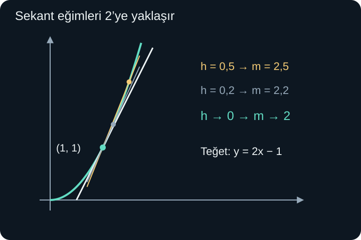
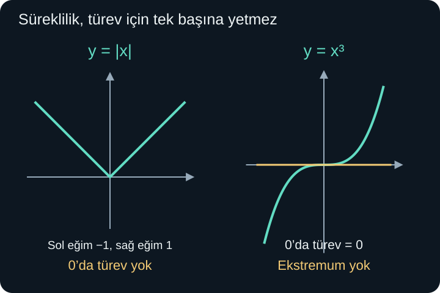

import ArticleVideo from '@/components/ArticleVideo.astro'
import kavram from './media/01-kavram.mp4?url'
import kavramPoster from './media/01-kavram.jpg?url'

Bir aracın iki saatte 120 kilometre yol alması, ortalama süratinin saatte 60 kilometre olduğunu söyler. Ancak gösterge yolculuk boyunca hep 60'ı göstermek zorunda değildir. Araç bazen durabilir, bazen daha hızlı gidebilir. Uzun bir aralığın toplam değişimiyle bir andaki değişim aynı bilgi değildir.

Bir fonksiyonda da benzer bir soru sorabiliriz: girdi belli bir noktadayken çıktı hangi hızla değişiyor? **Türev**, iki yakın girdi arasındaki değişim oranının, girdiler birbirine yaklaşırken ulaştığı sonlu limittir. Bu tanım aynı anda bir hesap yöntemi, bir geometrik eğim ve uygun bağlamda fiziksel bir değişim hızı verir.

[Önceki yazıdaki](/blog/diziler-limit-ve-sureklilik/) limit, tek taraflı yaklaşma ve süreklilik bilgisini kullanacağız. Ayrıca doğru eğimi, fonksiyonların bileşkesi, üsler ve cebirsel açılımlar gerekecek. Önce türevi tanımlayacak, sonra kuralların hangi işlemleri kısalttığını göstereceğiz.

## 1. Ortalama Değişim Bir Orandır

$y=f(x)$ fonksiyonunda iki farklı girdi $a$ ve $b$ seçelim. Girdi değişimi $b-a$, çıktı değişimi $f(b)-f(a)$ olur. **Ortalama değişim oranı**:

$$
\frac{f(b)-f(a)}{b-a},\qquad b\ne a
$$

biçimindedir. Paydanın sıfır olmaması gerekir. Bu oran, grafikteki $(a,f(a))$ ve $(b,f(b))$ noktalarını birleştiren doğrunun eğimidir. Eğriyi iki ayrı noktadan geçen bu doğruya **sekant** denir.

$f(x)=x^2$ için $a=1$, $b=3$ seçersek oran $(9-1)/(3-1)=4$ olur. $b=2$ seçersek $(4-1)/(2-1)=3$ çıkar. Aralığı değiştirdiğimizde ortalama değişim de değişebilir. İki sonuç birbiriyle çelişmez; farklı aralıklar hakkında bilgi verir.

Birimler de oranla birlikte taşınır. Girdi saniye, çıktı metre ise oran metre/saniyedir. Girdi ürün adedi, çıktı lira ise lira/adet olur. Türevi sadece sayısal bir formül olarak görmek, neyin neye göre değiştiği bilgisini kaybettirir.

## 2. İki Noktayı Birbirine Yaklaştırmak

İkinci girdiyi $a+h$ biçiminde yazalım. $h$, ilk girdiden ikinciye olan **işaretli değişimdir**. Pozitifse sağdan, negatifse soldan geliriz. İki girdi farklı olduğu sürece $h\ne0$'dır.

Ortalama değişim oranı şimdi:

$$
\frac{f(a+h)-f(a)}h
$$

olur. Eğer $h$ her iki taraftan sıfıra yaklaşırken bu ifade aynı sonlu gerçek sayıya yaklaşıyorsa, o sayıya $f$'nin $a$ noktasındaki türevi deriz:

$$
\boxed{f'(a)=\lim_{h\to0}\frac{f(a+h)-f(a)}h.}
$$

$f'(a)$ “f türev a” diye okunur. Kesir içinde doğrudan $h=0$ yazmıyoruz. Sıfırdan farklı küçük değişimlerin oranlarını inceliyor, limitlerini alıyoruz. Bu ayrım olmasaydı her örnekte $0/0$ ile karşılaşır ve dururduk.

Türev varsa grafiğin o noktadaki **teğet eğimi** budur. Teğeti yalnızca “eğriye tek noktada değen doğru” diye tanımlamak yeterli değildir. Bir teğet eğriyi kesebilir veya başka bir noktada tekrar buluşabilir. Buradaki belirleyici fikir, sekant eğimlerinin yerel limitidir.

## 3. Kare Fonksiyonunun Türevini Kurmak

Önce $a=1$ noktasında çalışalım. $f(1+h)=(1+h)^2=1+2h+h^2$, $f(1)=1$ olur. Farkı ve bölümü sırayla yazalım:

$$
\frac{f(1+h)-f(1)}h
=\frac{1+2h+h^2-1}h
=\frac{2h+h^2}h.
$$

$h\ne0$ olduğu için ortak $h$ çarpanını sadeleştirebiliriz. Sonuç $2+h$'dir. $h\to0$ iken limit 2 olur; dolayısıyla $f'(1)=2$.

$h=0{,}5$ için sekant eğimi 2,5; $h=0{,}1$ için 2,1; $h=-0{,}1$ için 1,9'dur. Sağdan ve soldan gelen değerlerin 2'ye yaklaştığını görürüz. Sayısal tablo yaklaşmayı görünür kılar; asıl gerekçe bütün sıfırdan farklı $h$ değerlerinde geçerli $2+h$ eşitliğidir.

<ArticleVideo src={kavram} poster={kavramPoster} title="Sekanttan teğete: x karenin türevi" caption="x² grafiğinde ikinci nokta (1, 1) noktasına yaklaşır. Sekant eğimi 2’ye yaklaşır ve teğet y = 2x − 1 doğrusuna ulaşılır." />

Aynı hesabı herhangi bir $a$ için yapalım:

$$
\frac{(a+h)^2-a^2}h
=\frac{2ah+h^2}h=2a+h.
$$

Limit $2a$ olur. Her gerçek girdide $f'(a)=2a$ bulunduğu için **türev fonksiyonunu** $f'(x)=2x$ diye yazabiliriz. Bir noktadaki türev bir sayı, bütün noktalardaki değerleri toplayan türev ise yeni bir fonksiyondur.

## 4. Türev Her Noktada Bulunmayabilir

$f(x)=|x|$ fonksiyonu sıfırda süreklidir. Fakat türev oranı $|h|/h$ olur. Pozitif $h$ için 1, negatif $h$ için $-1$ çıkar. İki taraf aynı sayıya yaklaşmadığından $f'(0)$ yoktur. Grafikteki köşe, sol ve sağ eğimlerin uyuşmamasını gösterir.

Türev için sonlu bir limit istiyoruz. Oran sınırsız büyüyorsa sıradan gerçek değerli türev yoktur; bazı grafiklerde bu durum düşey teğet diliyle ayrıca incelenebilir. “Eğim çok büyük” ile “sonlu bir türev var” aynı ifade değildir.

### Türev varsa süreklilik neden vardır?

$a$ noktasında sonlu türev bulunduğunu varsayalım. $h\ne0$ iken:

$$
f(a+h)-f(a)
=\frac{f(a+h)-f(a)}h\,h.
$$

$h\to0$ iken ilk çarpan sonlu $f'(a)$ değerine, ikinci çarpan 0'a gider. Çarpımın limiti 0'dır. Böylece $f(a+h)\to f(a)$ elde edilir; fonksiyon $a$'da süreklidir.

Sonuç tek yönlüdür: **türevlenebilirlik sürekliliği gerektirir**, süreklilik türevlenebilirliği garanti etmez. Mutlak değer bunun karşı örneğidir. Süreksiz bir noktada sonlu türev aramak sonuç vermez; önce fonksiyonun o noktada tanımlı ve sürekli olması gerekir.

## 5. Sabit, Toplam ve Kuvvet Kuralları

Sabit $f(x)=c$ fonksiyonunda $f(x+h)-f(x)=c-c=0$ olur. Bu yüzden türev 0'dır. Çıktı hiç değişmiyorsa değişim oranının sıfır olması beklenir. $f(x)=x$ için fark $h$, bölüm 1 olur; türev 1'dir.

Bir fonksiyonu sabit $k$ ile çarparsak fark oranının payında da $k$ ortak çarpan olur. Dolayısıyla $(kf)'=kf'$ kuralı çıkar. İki türevlenebilir fonksiyonun toplamında fark oranını iki kesre ayırıp limit kurallarını uygularız:

$$
(f+g)'=f'+g',\qquad(f-g)'=f'-g'.
$$

Kuvvetlerde önce pozitif tam sayılarla başlayalım. $x^3$ için küp açılımından:

$$
\frac{(x+h)^3-x^3}h
=3x^2+3xh+h^2
$$

elde edilir ve limit $3x^2$ olur. Genel pozitif tam sayı $n$ için aynı yapı:

$$
\frac{d}{dx}x^n=nx^{n-1}
$$

sonucunu verir. $d/dx$ sembolü “$x$'e göre türev al” işlemini gösterir. $n$ katsayı olarak öne gelir, üs bir azalır. Bu kuralın tekrar eden çarpımlarla gerekçesini çarpım kuralından sonra da görebileceğiz.

Örneğin $p(x)=4x^3-5x^2+7x-9$ için her terimi ayrı ele alırız:

$$
p'(x)=12x^2-10x+7.
$$

Sabit $-9$'un türevi 0 olduğu için yazılmadı. Fonksiyon değerini bulmakla türevini bulmak farklı işlerdir: $p(1)=-3$, $p'(1)=9$ olur. Biri yüksekliği, diğeri o noktadaki değişim eğimini anlatır.

## 6. Çarpımda Neden İki Terim Var?

$f(x)g(x)$ çarpımının türevi genel olarak $f'(x)g'(x)$ değildir. İki çarpanın da değişimini izlemek gerekir. Paydaki farkı şöyle ayıralım:

$$
\begin{aligned}
f(x+h)g(x+h)-f(x)g(x)
={}&f(x+h)[g(x+h)-g(x)]\\
&+g(x)[f(x+h)-f(x)].
\end{aligned}
$$

Sağ tarafı açtığımızda eklediğimiz iki ara terim birbirini götürür. Şimdi $h$'ye bölüp limit alırız. Türevlenebilir fonksiyon sürekli olduğundan $f(x+h)\to f(x)$ olur. İki fark oranı da kendi türevlerine gider. Böylece:

$$
\boxed{(fg)'=f'g+fg'.}
$$

Örneğin $q(x)=(x^2+1)(x-3)$ için:

$$
q'(x)=2x(x-3)+(x^2+1)\cdot1
=3x^2-6x+1.
$$

Önce çarpımı açarak da kontrol edebiliriz: $q(x)=x^3-3x^2+x-3$, türevi aynı sonuçtur. Çarpım kuralı, her çarpımı önce açmak zorunda kalmadan hesap yapar.

$x^n$, $n$ tane $x$ çarpanı içerir. Çarpım kuralını art arda uyguladığımızda her terimde çarpanlardan biri türevlenip 1 olur, kalan $n-1$ çarpan $x^{n-1}$ verir. Böyle $n$ tane eşit terim toplandığı için $nx^{n-1}$ çıkar. Bu gerekçe pozitif tam sayı kuvvetleri içindir; başka üslerin kapsamını ayrıca belirtmeliyiz.

## 7. Bölüm Kuralı ve Paydanın Koşulu

$g(x)\ne0$ olan bir noktada, $f$ ve $g$ türevlenebilir olsun. Bölümün türevi:

$$
\boxed{\left(\frac fg\right)'
=\frac{f'g-fg'}{g^2}.}
$$

Paydaki sıranın önemi vardır; çıkarma yer değiştirmez. Paydada ise fonksiyonun karesi bulunur. Kuralın gerekçesi, iki yakın bölümün farkını ortak paydada toplamaktır:

$$
\frac{f(x+h)}{g(x+h)}-\frac{f(x)}{g(x)}
=\frac{f(x+h)g(x)-f(x)g(x+h)}{g(x+h)g(x)}.
$$

Payı $g(x)[f(x+h)-f(x)]-f(x)[g(x+h)-g(x)]$ olarak düzenler, $h$'ye böler ve limit alırız. Payda $g(x)^2$'ye gider; bu değer sıfır değildir. $g$'nin sürekliliği yakın çevrede de paydanın sıfır olmamasını sağlar.

$r(x)=(x^2+1)/(x+2)$ için $x\ne-2$ olmalıdır. Kuralı uygulayalım:

$$
r'(x)=\frac{2x(x+2)-(x^2+1)}{(x+2)^2}
=\frac{x^2+4x-1}{(x+2)^2}.
$$

Sadeleştirme tanım dışı $x=-2$ noktasını geri getirmez. Aynı kuralla $(1/x)'=-1/x^2$ bulunur. Daha genel negatif tam sayı kuvvetleri için de kuvvet kuralı çalışır; $x\ne0$ koşulu korunur.

Karekökün türevini doğrudan görmek de mümkündür. $x>0$ için $[\sqrt{x+h}-\sqrt{x}]/h$ ifadesini eşlenikle çarparız. $h\ne0$ için sonuç $1/(\sqrt{x+h}+\sqrt{x})$ olur. Limit:

$$
\frac{d}{dx}\sqrt{x}=\frac1{2\sqrt{x}},\qquad x>0
$$

çıkar. Sıfırda sağdan bölüm $1/\sqrt h$ sınırsız büyür; sonlu türev yoktur. Tanım kümesinde bulunmak ile türev bulunması yine ayrı koşullardır.

## 8. Zincir Kuralı: Bir Değişim Başkasını Tetiklerse

$y=f(g(x))$ bileşkesinde önce $x$, sonra iç fonksiyonun değeri, ardından dış fonksiyonun değeri değişir. İç fonksiyonun çıktısına $u=g(x)$ diyelim. Yerel olarak $x$'teki küçük değişim $u$'da yaklaşık $g'(x)$ katı kadar değişim üretir. Dış fonksiyon da bu değişimi yaklaşık $f'(u)$ ile çarpar. Sonuç:

$$
\boxed{(f\circ g)'(x)=f'(g(x))\,g'(x).}
$$

Bu **zincir kuralıdır**. Koşulu, $g$'nin $x$ noktasında, $f$'nin de $g(x)$ noktasında türevlenebilir olmasıdır. Dış türevi iç fonksiyonun değerinde hesaplarız; ardından iç fonksiyonun türeviyle çarparız.

Örneğin $F(x)=(3x+1)^4$ için dış işlem dördüncü kuvvet, iç işlem $3x+1$'dir. Dış türev $4(3x+1)^3$, iç türev 3 olur:

$$
F'(x)=12(3x+1)^3.
$$

İç türevdeki 3'ü unutmak, girdinin dış fonksiyona üç kat hızlı ulaştığını gözden kaçırır. Benzer biçimde $\sqrt{2x+5}$ için $x>-5/2$ bölgesinde türev $[1/(2\sqrt{2x+5})]\cdot2=1/\sqrt{2x+5}$ olur.

### Küçük değişimleri çarpmak neden geçerli?

İç değişime $\Delta u=g(x+h)-g(x)$ diyelim. $\Delta$ harfi “değişim” anlamında kullanılır. $\Delta u\ne0$ olduğunda bileşkenin fark oranı:

$$
\frac{f(u+\Delta u)-f(u)}{\Delta u}
\frac{\Delta u}{h}
$$

olarak ayrılır. İkinci çarpan $g'(x)$'e, ilk çarpan $f'(u)$'ya yaklaşır; çünkü $g$ sürekli olduğundan $\Delta u\to0$ olur.

Bazı $h$ değerlerinde $\Delta u=0$ olabilir; o durumda yukarıdaki bölmeyi doğrudan yapamayız. Bu boşluğu kapatmak için ilk çarpanı $\Delta u=0$ olduğunda $f'(u)$ değeriyle tanımlarız. Türevin tanımı, bu tamamlanmış çarpanın sıfırda sürekli olmasını sağlar. İkinci çarpan o durumda 0'dır; bileşkenin çıktı farkı da 0 olduğu için çarpım eşitliği yine doğrudur. Böylece zincir kuralı, iç değişimin hiçbir zaman sıfır olmayacağı varsayımına dayanmaz.

## 9. Trigonometrik, Üstel ve Logaritmik Türevlerin Yeri

Şimdi önemli birkaç sonucu haritada yerlerine koyalım. Açı **radyanla** ölçüldüğünde:

$$
(\sin x)'=\cos x,\qquad(\cos x)'=-\sin x.
$$

Bu sonuçlar yalnızca kuvvet kuralından çıkmaz. Toplam açı bağıntılarıyla birlikte iki temel limit gerekir:

$$
\lim_{h\to0}\frac{\sin h}{h}=1,
\qquad
\lim_{h\to0}\frac{\cos h-1}{h}=0.
$$

Örneğin sinüsün fark oranı, toplam açı bağıntısıyla $\sin x(\cos h-1)/h+\cos x\sin h/h$ olur. Bu iki limit kabul edildiğinde sonuç $\sin x\cdot0+\cos x\cdot1=\cos x$ çıkar. Birinci temel limitin geometrik ispatı, birim çemberde yay ile üçgen alanlarını karşılaştırıp sıkıştırma kullanmayı gerektirir. Bu yazıda o ispatı tamamlamıyoruz; sonucu hangi ek bilgiye dayandırdığımızı açık bırakıyoruz. Derece kullanıldığında türevde ayrıca $\pi/180$ çarpanı bulunur.

Doğal üstel fonksiyon ve doğal logaritma için:

$$
(e^x)'=e^x,\qquad(\ln x)'=\frac1x\quad(x>0).
$$

$\ln x$, tabanı $e$ olan logaritmadır. Üstel türev, $\lim_{h\to0}(e^h-1)/h=1$ temel limitine dayanır. Logaritma türevi de üstel fonksiyonla terslik ilişkisi ve türevlenebilir ters fonksiyon sonucuyla kurulabilir. Bu temel limit ve ters fonksiyon teoreminin tam ispatları ayrıca çalışılmalıdır; tabloyu kanıt yerine geçirmiyoruz.

Bu sonuçlarla $a>0$ sabit taban için $(a^x)'=a^x\ln a$ elde edilir. Gerçek $r$ üslerinde de $x>0$ için $(x^r)'=rx^{r-1}$ geçerlidir; $x^r=e^{r\ln x}$ yazımı ve zincir kuralı bunu açıklar. Pozitif tam sayı kuvvetlerinde önceden kurduğumuz kural bütün gerçek $x$'lerdeydi. Genel gerçek üslerde aynı geniş tanım kümesini koşulsuz kullanamayız.

## 10. Teğet Doğrusu ve Yerel Yaklaşım

Bir noktadan geçen, eğimi bilinen doğrunun denklemi $y-y_0=m(x-x_0)$ idi. Türev varsa $x_0=a$, $y_0=f(a)$ ve $m=f'(a)$ seçeriz:

$$
y=f(a)+f'(a)(x-a).
$$

$x^2$ fonksiyonunda $a=1$ için $f(1)=1$, $f'(1)=2$ olduğundan teğet $y=1+2(x-1)=2x-1$ olur. Teğet yalnızca o noktanın çok yakınında fonksiyonu iyi temsil etmek üzere kullanılır.

Örneğin $x=1{,}03$ için gerçek değer $1{,}0609$, teğetin verdiği değer $1{,}06$'dır. Hata $0{,}0009=(0{,}03)^2$ olur. Bu örnekte tam fark $(1+h)^2-(1+2h)=h^2$ olduğundan yaklaşımın hatasını doğrudan hesaplayabiliriz.

Genel türev tanımı da benzer bir yerel fikir taşır: $f(a+h)=f(a)+f'(a)h$ ifadesinin hatası, $h$'nin büyüklüğüne bölündüğünde sıfıra yaklaşır. Bu, küçük değişimlerde doğrusal parçanın başlıca davranışı yakalamasıdır. Fonksiyonun bütün aralıkta düz bir doğru olduğunu söylemez.

Karekök için $a=4$ seçersek $f(4)=2$, $f'(4)=1/4$ olur. $\sqrt{4{,}08}\approx2+(1/4)\cdot0{,}08=2{,}02$ bulunur. Yaklaşık işareti önemlidir; teğet hesabı burada tam eşitlik değildir.

## 11. Konum, Hız ve İvme

Tek bir doğru üzerindeki konumu $s(t)$ ile gösterelim. $t$ zaman, $s$ işaretli konum olsun. **Hız** konumun türevidir: $v(t)=s'(t)$. Hızın türevi de **ivme**dir: $a(t)=v'(t)=s''(t)$. İki kesme işareti ikinci türevi belirtir.

Konum metre, zaman saniye ile ölçülsün ve uygun birimlerde $s(t)=t^2-4t+5$ modeli verilsin. O zaman $v(t)=2t-4$ metre/saniye, $a(t)=2$ metre/saniyekaredir. $t=1$ anında hız $-2$, $t=2$ anında 0, $t=3$ anında 2'dir.

Negatif hız, seçilmiş pozitif yönün tersine hareketi anlatır; negatif sürat anlamına gelmez. Sürat hızın mutlak değeridir. Bu örnekte cisim önce ters yönde gider, ikinci saniyede anlık olarak durur ve sonra pozitif yöne döner. İvme sürekli pozitif olduğu hâlde ilk bölümde sürat azalır; hızın ve ivmenin işaretini aynı anlamda okumayız.

$1$ ile $3$ saniye arasındaki konumlar eşittir: ikisi de 2 metredir. Ortalama hız 0'dır, ama cisim bütün aralık boyunca hareketsiz değildir. Konum önce 1 metreye düşüp sonra 2 metreye çıkar. Bu, ortalama ve anlık değişimi ayırmamızın fiziksel bir örneğidir.

## 12. Artma, Azalma ve En Büyük-En Küçük Değer

Bir aralık boyunca türev pozitifse fonksiyon o aralıkta artar; negatifse azalır. Bu sonucun genel ispatı, türevle aralık üzerindeki ortalama eğimi bağlayan ortalama değer teoremine dayanır. Burada teoremin ispatını yapmadan, örnek parabolümüz üzerinde işaret yorumunu ayrıca cebirle denetleyebiliriz.

$f(x)=x^2-4x+5=(x-2)^2+1$ için $f'(x)=2x-4$ olur. $x<2$ tarafında negatif, $x>2$ tarafında pozitiftir. Fonksiyon önce azalır, sonra artar; $x=2$'de en küçük değer 1'dir. Kareye tamamlama da bütün gerçek $x$'ler için $(x-2)^2\ge0$ olduğundan aynı sonucu kanıtlar.

Bir iç noktada türevlenebilir fonksiyon yerel en büyük veya en küçük değer alıyorsa türev 0 olmalıdır. Ancak ters yön doğru değildir: $f(x)=x^3$ için $f'(0)=0$ olmasına rağmen sıfırın solunda negatif, sağında pozitif değerler vardır. Fonksiyon artmaya devam eder; sıfırda bir ekstremum, yani yerel en büyük veya en küçük değer yoktur.

Türevin olmadığı noktalar da aday olabilir: $|x|$ sıfırda türevlenemez ama en küçük değerini orada alır. Kapalı bir aralıkta mutlak en büyük ve en küçük değeri ararken **uç noktaları** da kontrol ederiz. Örneğin yukarıdaki parabolda $[0,3]$ aralığı için adaylar 0, 2 ve 3'tür. Değerler sırasıyla 5, 1 ve 2 olur. En küçük 1, en büyük 5'tir; en büyük değer uç noktada bulundu.

Türev artık yalnızca “üssü öne indir” kuralı değildir. Yakın iki noktanın değişim oranı, teğet eğimi, fiziksel hız ve yerel doğrusal yaklaşım aynı limitin farklı yorumlarıdır. Sonraki öğrenme adımlarında temel trigonometrik ve üstel limitlerin ispatlarını tamamlayacak, değişim bilgisinden birikmiş miktarı geri kuran integral fikrine geçeceğiz.

## Kaynakça

Aşağıdaki açık ders kitabı sayfaları 8 Ekim 2026 tarihinde doğrudan kontrol edilmiştir. Anlatım, örnekler ve şekiller özgündür; kaynaklar kuralların koşulları ve kapsam sınırları için kullanılmıştır.

- [OpenStax, Calculus Volume 1 — Defining the Derivative](https://openstax.org/books/calculus-volume-1/pages/3-1-defining-the-derivative): Fark oranı, limit ve teğet eğimi.
- [OpenStax, Calculus Volume 1 — The Derivative as a Function](https://openstax.org/books/calculus-volume-1/pages/3-2-the-derivative-as-a-function): Türev fonksiyonu, süreklilik ve türevlenebilirlik ilişkisi.
- [OpenStax, Calculus Volume 1 — Differentiation Rules](https://openstax.org/books/calculus-volume-1/pages/3-3-differentiation-rules): Sabit, toplam, kuvvet, çarpım ve bölüm kuralları.
- [OpenStax, Calculus Volume 1 — The Chain Rule](https://openstax.org/books/calculus-volume-1/pages/3-6-the-chain-rule): Bileşkenin türevi ve iç-dış fonksiyon koşulları.
- [OpenStax, Calculus Volume 1 — Derivatives of Trigonometric Functions](https://openstax.org/books/calculus-volume-1/pages/3-5-derivatives-of-trigonometric-functions): Sinüs ve kosinüs türevlerinin dayandığı radyan limitleri.
- [OpenStax, Calculus Volume 1 — Derivatives of Exponential and Logarithmic Functions](https://openstax.org/books/calculus-volume-1/pages/3-9-derivatives-of-exponential-and-logarithmic-functions): Doğal üstel, logaritma ve genel kuvvet türevleri.
- [OpenStax, Calculus Volume 1 — Linear Approximations and Differentials](https://openstax.org/books/calculus-volume-1/pages/4-2-linear-approximations-and-differentials): Teğet ile yakın değerleri yaklaşık hesaplama.
- [OpenStax, Calculus Volume 1 — Maxima and Minima](https://openstax.org/books/calculus-volume-1/pages/4-3-maxima-and-minima): İç nokta, türevsiz nokta ve uç nokta adaylarının ayrımı.
- [OpenStax, Calculus Volume 1 — Derivatives and the Shape of a Graph](https://openstax.org/books/calculus-volume-1/pages/4-5-derivatives-and-the-shape-of-a-graph): Türev işaretiyle artma ve azalma ilişkisi.
