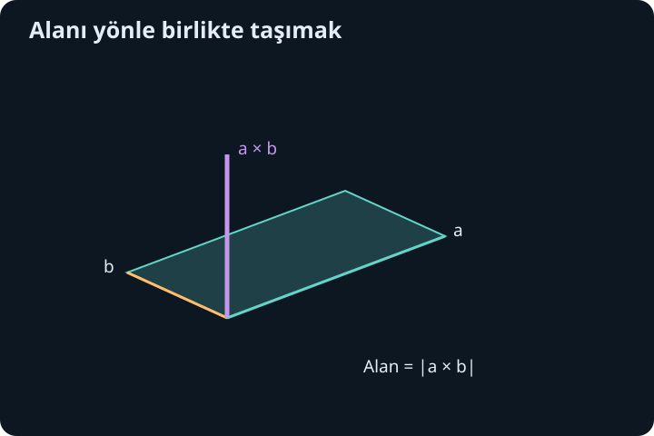
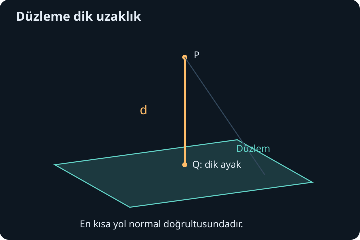

import ArticleVideo from '@/components/ArticleVideo.astro'
import kavram from './media/01-kavram.mp4?url'
import kavramPoster from './media/01-kavram.jpg?url'

İki vektörü çarpmak tek bir anlama gelmez. Skaler çarpım, iki yönün birbirine ne kadar hizalandığını bir sayı olarak verir. Üç boyutta başka bir bilgiye de ihtiyaç duyarız: iki vektörün oluşturduğu düzleme dik yön hangisidir ve bu vektörlerin gerdiği alan ne büyüklüktedir? Vektörel çarpım bu iki bilgiyi tek bir vektörde birleştirir.

[Önceki yazıda](/blog/karmasik-sayilar-ve-euler-bagintisi/) karmaşık çarpmanın düzlemde dönme ve ölçekleme anlamını gördük. Buradaki işlem farklıdır: girdiler üç boyutlu gerçek vektörlerdir. Önce koordinat düzenini ve skaler çarpımı hatırlayacağız; sonra yeni çarpımı kurup düzlem, doğru, alan ve hacim hesaplarına uygulayacağız. İleride dönme hareketinde aynı yapıyla karşılaşacağız, fakat burada hiçbir fizik yasası varsaymayacağız.

## 1. Üç bileşen ve sağ el düzeni

Bir uzay vektörünü $\mathbf a=(a_x,a_y,a_z)$ biçiminde yazalım. Alt indisler bileşenin hangi eksene ait olduğunu gösterir. Eksenler birbirine diktir ve aynı uzunluk birimini kullanır. Birim eksen vektörleri $\mathbf e_x=(1,0,0)$, $\mathbf e_y=(0,1,0)$, $\mathbf e_z=(0,0,1)$ olsun. Her vektör $a_x\mathbf e_x+a_y\mathbf e_y+a_z\mathbf e_z$ biçiminde ayrılır.

Koordinat takımını **sağ elli** seçiyoruz. Sağ elin parmakları pozitif $x$ yönünden pozitif $y$ yönüne kıvrıldığında başparmak pozitif $z$ yönünü gösterir. Eksenlerin sayfada nasıl çizildiği perspektife göre değişebilir; yönelimi belirleyen şey bu kuraldır. Bir ekseni tek başına ters çevirmek, takımın yönelimini değiştirir.

Vektörün uzunluğu $|\mathbf a|=\sqrt{a_x^2+a_y^2+a_z^2}$'dir. Sıfır olmayan bir vektörü uzunluğuna bölersek aynı yönde birim vektör elde ederiz: $\widehat{\mathbf a}=\mathbf a/|\mathbf a|$. Şapka işareti burada uzunluğu 1 olan vektörü belirtir. Sıfır vektörünün yönü bulunmadığı için onu normalleştiremeyiz.

## 2. Skaler çarpımın kısa hatırlatması

İki vektörün skaler çarpımı:

$$
\mathbf a\cdot\mathbf b=a_xb_x+a_yb_y+a_zb_z
=|\mathbf a||\mathbf b|\cos\theta
$$

olur. $\theta$, sıfır olmayan iki vektör arasındaki $[0,\pi]$ aralığındaki açıdır. Sonuç bir sayıdır. Skaler çarpım sıfırsa, iki vektör de sıfırdan farklı olduğu sürece aralarındaki açı dik açıdır.

Bir vektörün birim $\widehat{\mathbf n}$ yönündeki işaretli bileşeni $\mathbf a\cdot\widehat{\mathbf n}$'dir. Bu sayı pozitifse o yöne, negatifse tersine uzanır. İzdüşüm vektörü ise $(\mathbf a\cdot\widehat{\mathbf n})\widehat{\mathbf n}$ olur. Birazdan hacmin yüksekliğini ve noktanın düzleme uzaklığını bu izdüşümle hesaplayacağız.

Örneğin $(1,2,0)\cdot(2,-1,3)=2-2+0=0$ olduğundan bu iki vektör diktir. Uzayda dik olmak için bileşenlerden birinin veya aynı koordinatların sıfır olması gerekmez; belirleyici olan toplamın sıfır olmasıdır.

## 3. Vektörel çarpımın bileşenleri

Sağ elli koordinatlarda **vektörel çarpımı** şu biçimde tanımlayalım:

$$
\mathbf a\times\mathbf b=
(a_yb_z-a_zb_y,\ a_zb_x-a_xb_z,\ a_xb_y-a_yb_x).
$$

$\times$ işareti burada sayı çarpımı veya skaler çarpım değildir; sonuç yine bir vektördür. Formülü ezberlemeden önce temel eksenlerde ne yaptığını görelim: $\mathbf e_x\times\mathbf e_y=\mathbf e_z$, $\mathbf e_y\times\mathbf e_z=\mathbf e_x$, $\mathbf e_z\times\mathbf e_x=\mathbf e_y$. Döngüyü tersine çevirirsek işaret değişir.

Formül iki girdi bakımından ayrı ayrı doğrusaldır. Örneğin $(\mathbf a+\mathbf b)\times\mathbf c=\mathbf a\times\mathbf c+\mathbf b\times\mathbf c$ ve $(\lambda\mathbf a)\times\mathbf b=\lambda(\mathbf a\times\mathbf b)$ olur. $\lambda$ gerçek bir sayıdır. Bu özellikler ile eksen çarpımlarını açınca aynı bileşen formülüne ulaşabiliriz.

Çarpımın girdilere dik olduğunu cebirle kontrol edelim. $\mathbf a\cdot(\mathbf a\times\mathbf b)$ açıldığında:

$$
a_xa_yb_z-a_xa_zb_y+a_ya_zb_x-a_ya_xb_z+a_za_xb_y-a_za_yb_x=0
$$

olur. Her terim karşı işaretli eşiyle gider. $\mathbf b$ ile skaler çarpımda da aynı iptal gerçekleşir. Böylece yeni vektör iki girdiye de diktir; bu geometrik iddia yalnız çizime dayanmıyor.

## 4. Determinant yazımı ve eksi işareti

Bileşenleri hatırlamak için biçimsel determinant düzeni kullanabiliriz:

$$
\mathbf a\times\mathbf b=
\begin{vmatrix}
\mathbf e_x&\mathbf e_y&\mathbf e_z\\
a_x&a_y&a_z\\
b_x&b_y&b_z
\end{vmatrix}.
$$

İlk satırdan açarken işaretler artı, eksi, artıdır. Ortadaki bileşen $-(a_xb_z-a_zb_x)$ olduğundan $a_zb_x-a_xb_z$ çıkar. Bu düzen bir hesap hatırlatıcısıdır; ilk satırdaki nesneler sayılardan farklı olarak vektördür. Sonucun üç bileşenini açık yazmak, işaretleri denetlemek için en güvenli yoldur.

$\mathbf a=(1,2,0)$ ve $\mathbf b=(0,1,3)$ seçelim. Birinci bileşen $2\cdot3-0\cdot1=6$, ikinci bileşen $0\cdot0-1\cdot3=-3$, üçüncü bileşen $1\cdot1-2\cdot0=1$ olur. Dolayısıyla $\mathbf a\times\mathbf b=(6,-3,1)$'dir. Kontroller $\mathbf a\cdot(6,-3,1)=6-6=0$ ve $\mathbf b\cdot(6,-3,1)=-3+3=0$ verir.

## 5. Uzunluğu neden alandır?

$\mathbf a$ ve $\mathbf b$'nin oluşturduğu paralelkenarın tabanını $|\mathbf a|$ seçelim. Yüksekliği, ikinci vektörün ilkine dik bileşeninin büyüklüğü olan $|\mathbf b|\sin\theta$'dır. Alan $|\mathbf a||\mathbf b|\sin\theta$ olur. Vektörel çarpımın uzunluğu da tam olarak budur:

$$
|\mathbf a\times\mathbf b|=|\mathbf a||\mathbf b|\sin\theta.
$$

Bunu bileşenlerden gerekçelendiren özdeşlik:

$$
|\mathbf a\times\mathbf b|^2
=|\mathbf a|^2|\mathbf b|^2-(\mathbf a\cdot\mathbf b)^2
$$

biçimindedir. Sol taraftaki üç bileşen karesini açıp benzer terimleri toplamak sağ tarafı verir. Skaler çarpımın açı formülünü koyunca $|\mathbf a|^2|\mathbf b|^2(1-\cos^2\theta)$ elde ederiz. $0\leq\theta\leq\pi$ için sinüs negatif olmadığından karekök alan formülünü verir.

Vektörel çarpım böylece **yönlü alan** taşır: uzunluğu paralelkenarın alanı, yönü düzleme dik ve sağ el kuralıyla seçilen normaldir. Üçgen alanı aynı taban ve yüksekliğin yarısı olduğu için $|\mathbf a\times\mathbf b|/2$ olur. Önceki sayısal örnekte uzunluk $\sqrt{36+9+1}=\sqrt{46}$; üçgen alanı $\sqrt{46}/2$'dir.

## 6. Sıra, paralellik ve sıfır

Girdileri yer değiştirince bileşen formülündeki her fark tersine döner:

$$
\mathbf b\times\mathbf a=-(\mathbf a\times\mathbf b).
$$

Bu özelliğe karşıt değişme denir. Geometrik alanın büyüklüğü değişmez, fakat seçilen normalin yönü ters döner. İşlem sırası bu nedenle önemli bir bilgidir. Sıfırdan farklı vektörlerde çarpım sıfırsa sinüs sıfırdır; vektörler aynı veya zıt doğrultudadır. Girdilerden biri sıfırsa da sonuç sıfır olur.

$\mathbf a\times\mathbf a=\mathbf0$ olduğundan, bir vektörün kendisiyle vektörel çarpımı uzunluğunun karesi değildir. Uzunluk karesi $\mathbf a\cdot\mathbf a$ ile bulunur. Nokta ve çarpı işaretlerini karıştırmak hem sonucu hem sonucun türünü değiştirir.

Vektörel çarpım birleşmeli de değildir. $\mathbf e_x\times(\mathbf e_x\times\mathbf e_y)=\mathbf e_x\times\mathbf e_z=-\mathbf e_y$ iken $(\mathbf e_x\times\mathbf e_x)\times\mathbf e_y=\mathbf0$ olur. Parantezleri sıradan sayı çarpımındaki gibi kaldırmayız. Bu uyarı özellikle üç vektör içeren ifadelerde gereklidir.

<ArticleVideo src={kavram} poster={kavramPoster} title="Vektörel çarpımın büyüklüğü" caption="İki vektörün uzunlukları sabitken aralarındaki açı değişir. Dik konumda alan en büyüktür; paralelliğe yaklaşırken vektörel çarpımın büyüklüğü sıfıra iner." />

## 7. Üçlü çarpımla hacim

Üç vektörün gerdiği paralelyüzün tabanı $\mathbf a$ ile $\mathbf b$ paralelkenarı olsun. Taban alanı $|\mathbf a\times\mathbf b|$'dir. Üçüncü vektör $\mathbf c$'nin taban normaline izdüşümünün mutlak değeri yüksekliği verir. Dolayısıyla hacim:

$$
V=|\mathbf c\cdot(\mathbf a\times\mathbf b)|.
$$

İçerideki sayı **skaler üçlü çarpımdır**. İşareti üç vektörün yönelimini, mutlak değeri hacmi taşır. Taban vektörleri paralelse çarpım sıfır olur ve hacim de sıfırdır; ayrıca normalleştirme yapmamız gerekmez.

$\mathbf a=(2,0,0)$, $\mathbf b=(0,3,0)$ ve $\mathbf c=(1,1,4)$ seçelim. İlk çarpım $(0,0,6)$'dır. Üçlü çarpım 24 ve hacim 24 birim küptür. Üçüncü vektörün yatay bileşenleri cismi yana yatırır ama dik yüksekliği 4 olarak bırakır. Bu nedenle hacim taban alanı 6 ile yükseklik 4'ün çarpımıdır.

Üçlü çarpım sıfırsa üç vektör aynı düzlem içinde kalır veya başka bir doğrusal bağımlılık taşır. Bu, determinantın sıfır olmasıyla da ifade edilir. Hacmin sıfır olması, üç boyutlu bir bölge gerilemediğinin geometrik karşılığıdır.

## 8. Bir nokta ve bir normal düzlemi belirler

$\mathbf n=(A,B,C)\ne\mathbf0$ düzleme dik bir normal, $\mathbf r_0=(x_0,y_0,z_0)$ düzlem üzerindeki bir nokta olsun. Başka bir $\mathbf r=(x,y,z)$ noktasının aynı düzlemde olması, aradaki farkın normale dik olması demektir:

$$
\mathbf n\cdot(\mathbf r-\mathbf r_0)=0.
$$

Bileşenlerle $A(x-x_0)+B(y-y_0)+C(z-z_0)=0$ olur. Düzenlersek $Ax+By+Cz=D$ biçimini elde ederiz; burada $D=Ax_0+By_0+Cz_0$'dır. Normalin bütün bileşenlerini aynı sıfırdan farklı sayıyla çarpmak aynı düzlemi verir.

Örneğin $\mathbf n=(2,-1,3)$ ve $P=(1,0,2)$ için $D=2+0+6=8$ olur; düzlem $2x-y+3z=8$'dir. $P$'yi yerine koymak denklemi doğrular. $(0,1,3)$ noktası da $0-1+9=8$ verdiği için düzlemdedir; $(0,0,0)$ ise değildir.

Bir düzlemin normalini bilmek, onun uzaydaki yönünü verir ama konumunu vermez. Aynı normalle farklı $D$ değerleri paralel düzlemler oluşturur. Nokta bilgisi bu aileden tek bir düzlemi seçer.

## 9. Üç noktadan düzlem kurmak

$P=(1,0,0)$, $Q=(0,1,0)$ ve $R=(0,0,1)$ noktalarından geçen düzlemi bulalım. Önce aynı başlangıçlı iki yön vektörü oluştururuz: $Q-P=(-1,1,0)$ ve $R-P=(-1,0,1)$. Vektörel çarpımları $(1,1,1)$ olur. Bu normalle $P$ noktasını kullanırsak:

$$
(x-1)+y+z=0,\qquad x+y+z=1
$$

elde edilir. Üç nokta da denklemi sağlar. Sıra ters seçilse normal $(-1,-1,-1)$ çıkardı; denklemin tamamı eksiyle çarpılacağından aynı düzlem bulunurdu.

Üç nokta aynı doğru üzerindeyse iki yön vektörü paraleldir ve çarpım sıfır çıkar. Bu durumda tek bir düzlem belirlenmez; o doğruyu içeren sonsuz düzlem vardır. “Üç nokta bir düzlem belirler” cümlesinin eksik koşulu, noktaların doğrusal olmamasıdır. Hesaptaki sıfır normal, bu geometrik eksikliği haber verir.

## 10. Doğruyu parametreyle anlatmak

Uzayda bir doğru için bir başlangıç noktası $\mathbf r_0$ ve sıfırdan farklı bir yön vektörü $\mathbf v$ yeterlidir. Doğru üzerindeki noktalar:

$$
\mathbf r(t)=\mathbf r_0+t\mathbf v,\qquad t\in\mathbb R
$$

biçimindedir. $t$ bir parametredir; bağlam söylemedikçe zaman olmak zorunda değildir. Pozitif ve negatif değerler başlangıçtan iki zıt yöne gitmeyi sağlar. $0\leq t\leq1$ ile kısıtlarsak uygun iki nokta arasındaki doğru parçasını elde ederiz.

$\mathbf r_0=(1,0,0)$ ve $\mathbf v=(1,1,1)$ için $x=1+t$, $y=t$, $z=t$ olur. Bu doğruyu $2x-y+3z=8$ düzlemiyle kesiştirelim. Yerine koyunca $2(1+t)-t+3t=8$, yani $2+4t=8$ bulunur. $t=3/2$ ve kesişim noktası $(5/2,3/2,3/2)$'dir. Doğrudan kontrol $5-3/2+9/2=8$ verir.

Genel olarak yerine koyma $\mathbf n\cdot\mathbf r_0+t\,\mathbf n\cdot\mathbf v=D$ denklemini üretir. $\mathbf n\cdot\mathbf v\ne0$ ise tek kesişim vardır. Bu çarpım sıfırsa doğru düzleme paraleldir; başlangıç noktası düzlemin içindeyse doğrunun tamamı düzlemdedir, değilse kesişim yoktur.

## 11. Noktanın düzleme uzaklığı

$\mathbf n\cdot\mathbf r=D$ düzleminden bir $\mathbf r_0$ noktası seçelim. Dışarıdaki $P$ noktasına ait vektör $\mathbf p$ olsun. $\mathbf p-\mathbf r_0$ farkının normal yönündeki işaretli bileşeni $(\mathbf n\cdot\mathbf p-D)/|\mathbf n|$'dir. En kısa uzaklık bunun mutlak değeridir:

$$
d=\frac{|Ax_P+By_P+Cz_P-D|}{\sqrt{A^2+B^2+C^2}}.
$$

Neden en kısadır? Noktadan düzlemdeki başka bir noktaya giden her fark vektörü, aynı dik bileşene ek olarak bir düzlem içi bileşen taşır. Dik bileşenler için Pisagor bağıntısı, bu ek bileşenin toplam uzunluğu ancak artırabileceğini söyler. Dik izdüşüm, düzlem içi bileşeni sıfıra indirir.

Orijinin $2x-y+3z=8$ düzlemine uzaklığı $8/\sqrt{14}$'tür. Dik ayağı $\mathbf q=(8/14)(2,-1,3)$ olarak bulabiliriz. Bu nokta düzlem üzerindedir, çünkü normalle skaler çarpımı $(8/14)14=8$ olur. Orijinden bu noktaya giden vektör normale paraleldir ve uzunluğu da $8/\sqrt{14}$ çıkar.

Uzay geometrisindeki hesaplar artık birkaç bağlantılı fikre dayanıyor: fark vektörü iki noktayı ilişkilendirir, skaler çarpım dikliği ve izdüşümü ölçer, vektörel çarpım normal ile alanı verir. Bir sonraki adımda girdinin kendisi iki veya üç bileşenden oluştuğunda fonksiyonun nasıl değiştiğini inceleyeceğiz; bu geometri kısmi türev ve gradyanı okumamıza yardım edecek.

## Kaynaklar

- [OpenStax, Calculus Volume 3: The Cross Product](https://openstax.org/books/calculus-volume-3/pages/2-4-the-cross-product)
- [OpenStax, Calculus Volume 3: Equations of Lines and Planes in Space](https://openstax.org/books/calculus-volume-3/pages/2-5-equations-of-lines-and-planes-in-space)
