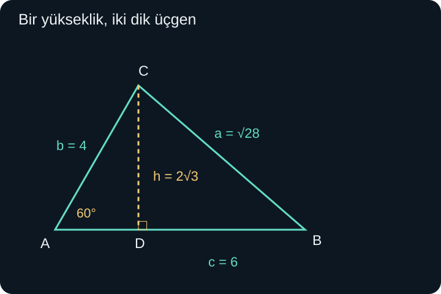
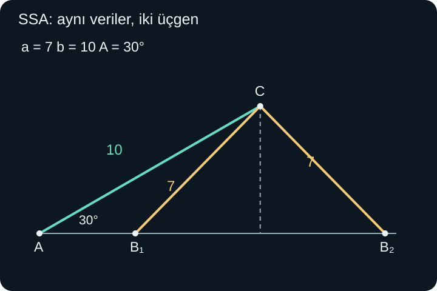

import ArticleVideo from '@/components/ArticleVideo.astro'
import kavram from './media/01-kavram.mp4?url'
import kavramPoster from './media/01-kavram.jpg?url'

Bir parkta iki yol aynı noktadan ayrılıyor. Yollardan birinde 3 metre, diğerinde 4 metre ilerleyen iki kişinin arasındaki uzaklık ne olur? Yollar dikse Pisagor ile 5 metre buluruz. Fakat yollar arasındaki açı 60 dereceyse kişiler daha yakın, 120 dereceyse daha uzaktır. İki kenarı bilmek, aralarındaki açıyı bilmeden üçüncü kenarı belirlemeye yetmez.

Bu yazıda **üçgen çözmek**, yeterli bilgilerden bilinmeyen kenar uzunluklarını ve açı ölçülerini bulmak anlamına gelecek. [Önceki yazının](/blog/trigonometrik-ozdeslikler-ve-denklemler/) toplam açı bağıntılarını, birim çemberi, dik üçgen oranlarını ve temel cebiri kullanacağız. Önce oran verildiğinde açıyı nasıl seçtiğimizi açıklayacak, sonra dik olmayan üçgenlere geçeceğiz.

Bütün üçgenlerimiz düzlemde, kenar uzunlukları pozitif olan ve üç köşesi aynı doğru üzerinde bulunmayan üçgenlerdir. Açı toplamı 180 derecedir. Bir kenarın uzunluğu diğer ikisinin toplamından küçük olmalıdır. Bu koşullar hesap sonunda bakılacak ayrıntılar değil, çözmeye çalıştığımız şeklin varlık koşullarıdır.

## 1. Bir Orandan Bir Açıya Dönmek

Bir dik üçgende dar açının karşısındaki kenar 5, hipotenüs 13 birim olsun. Açıya $\theta$ dersek $\sin\theta=5/13$ yazarız. Burada sinüs değeri bilinir; aranan, bu değeri veren açıdır.

Sinüsün bütün gerçek sayılarda ters fonksiyonu yoktur. Çünkü farklı açılar aynı sinüsü verir: $30^\circ$ ile $150^\circ$ bunun kolay bir örneğidir. Bir ters fonksiyonun her girdiye tek çıktı vermesi gerektiğini [fonksiyonların tersi konusunda](/blog/fonksiyonlarda-bileske-ters-ve-donusum/) görmüştük. Çözüm, sinüsü birebir olduğu belirli bir açı aralığına kısıtlamaktır.

**Arksinüs**, $[-1,1]$ aralığındaki bir sayıya, sinüsü bu sayı olan $[-\pi/2,\pi/2]$ aralığındaki tek açıyı verir. $\arcsin$ sembolüyle yazılır. Örneğin:

$$
\arcsin(1/2)=\pi/6=30^\circ.
$$

$150^\circ$ de aynı sinüsü verir, fakat arksinüsün seçtiği çıktı aralığında değildir. Ters fonksiyon bize denklemin bütün çözümlerini tek seferde söylemez; bunlardan belirlenmiş bir aralıktaki temsilciyi seçer.

Benzer biçimde **arkkosinüs**, $[-1,1]$ içindeki sayıları $[0,\pi]$ aralığındaki açılara götürür. **Arktanjant** ise bütün gerçek sayılarda tanımlıdır ve çıktısı $(-\pi/2,\pi/2)$ aralığındadır. Uçların arktanjantta açık olması, tanjantın bu uç açılarda tanımlı olmamasından gelir.

| İşlem | Girdi | Çıktının radyan aralığı |
| --- | --- | --- |
| $\arcsin t$ | $-1\le t\le1$ | $[-\pi/2,\pi/2]$ |
| $\arccos t$ | $-1\le t\le1$ | $[0,\pi]$ |
| $\arctan t$ | Her gerçek $t$ | $(-\pi/2,\pi/2)$ |

Bazı kitaplarda $\sin^{-1}$ yazımı arksinüs anlamına gelir. Buradaki $-1$ bir üs değildir; $1/\sin$ anlamına gelmez. Örneğin $\arcsin(1/2)=\pi/6$ bir açı ölçüsüyken, $1/(1/2)=2$ sıradan bir sayısal terstir. Karışıklığı azaltmak için burada açıkça $\arcsin$, $\arccos$ ve $\arctan$ kullanacağız.

Başlangıçtaki dik üçgende $\theta=\arcsin(5/13)\approx22{,}62^\circ$ buluruz. Dar açı istediğimiz için arksinüsün pozitif çıktısı doğrudan uygundur. Diğer dik kenar $\sqrt{13^2-5^2}=\sqrt{144}=12$ olduğundan, $\arccos(12/13)$ veya $\arctan(5/12)$ de aynı dar açıyı verir. Bu üç yol birbirinden bağımsız yeni açılar değil, aynı üçgenin üç oranıdır.

### Ters ilişki nerede gerçekten geri döner?

$\sin(\arcsin t)=t$ eşitliği $-1\le t\le1$ için geçerlidir. Fakat $\arcsin(\sin\theta)=\theta$ diyebilmek için $\theta$ seçilen çıktı aralığında olmalıdır. Örneğin $\arcsin(\sin150^\circ)=30^\circ$ olur. Sinüs işlemi hangi açıyı seçtiğimiz bilgisini kısmen kaybetmiştir; arksinüs kendi aralığına döner.

Hesap makinesinin derece veya radyan ayarı da çıktının nasıl okunacağını belirler. Yaklaşık $0{,}3948$ radyan ile yaklaşık $22{,}62^\circ$ aynı açıdır. Sonuca sadece 0,3948 yazıp bunu derece olarak kullanmak, sonraki kenar hesaplarını değiştirir.

## 2. Üçgenin Harflerini Yerleştirmek

Köşelere $A$, $B$, $C$ diyelim. Aynı harfleri köşelerdeki açıların ölçüleri için de kullanacağız; hangi anlamın kastedildiği bağlamdan anlaşılacak. **$a$ kenarı $A$ açısının karşısında, $b$ kenarı $B$ açısının karşısında, $c$ kenarı $C$ açısının karşısındadır.** Küçük harfler uzunlukları gösterir.

Bu eşleştirme, formülleri şekle yerleştirirken en çok dikkat edeceğimiz noktadır. $a$ ile $A$ yan yana durdukları için değil, karşı karşıya oldukları için eşleşir. Üçgeni döndürmek veya başka yönde çizmek bu ilişkiyi değiştirmez.

Örneğin $A$ köşesinden çıkan kenarlar $b$ ile $c$'dir. Dolayısıyla bu iki kenarın arasındaki açı $A$'dır. Bir alan hesabında $bc\sin A$ görürsek, aynı köşede buluşan iki kenarla onların arasındaki açının birlikte kullanıldığını okumalıyız.

## 3. Alanı İki Kenar ve Aralarındaki Açıyla Bulmak

$AB=c$ kenarını taban seçip $C$ köşesinden bu tabanın doğrusuna bir dikme indirelim. Dikmenin uzunluğu $h$ olsun. $AC=b$ olduğundan, dar $A$ açısı için dik üçgende $\sin A=h/b$ ve dolayısıyla $h=b\sin A$ elde ederiz.

Üçgenin alanını $K$ harfiyle gösterirsek, taban çarpı yüksekliğin yarısı:

$$
K=\frac12ch=\frac12bc\sin A
$$

olur. Aynı işlemi başka tabanlarla kurarsak:

$$
K=\frac12ca\sin B=\frac12ab\sin C.
$$

$A$ geniş açı olduğunda dikme taban parçasının dışına düşebilir. Bu kez yardımcı dik üçgende $180^\circ-A$ açısını kullanırız. $\sin(180^\circ-A)=\sin A$ olduğundan yükseklik yine $b\sin A$ olur. Üçgenin iç açısı 0 ile 180 derece arasında olduğu için sinüs pozitiftir; alan da pozitif çıkar.

Şekilde $b=4$, $c=6$, $A=60^\circ$ seçilmiştir. Yükseklik $h=4\sin60^\circ=2\sqrt3$ birimdir. Böylece $K=(1/2)\cdot6\cdot2\sqrt3=6\sqrt3$ birimkare buluruz. Doğrudan iki kenarlı formül de $(1/2)\cdot4\cdot6\cdot\sqrt3/2$ hesabıyla aynı sonucu verir.

Kenarlardan birini santimetre, diğerini metre olarak verirlerse önce ortak birime geçeriz. Sinüsün birimi yoktur; alanın birimi iki uzunluk biriminin çarpımından gelir. Açıyı doğrudan kenarlarla çarpmıyoruz; açının sinüsünü kullanıyoruz.

## 4. Sinüs Teoremi Alandan Çıkar

Aynı üçgenin alanını üç farklı biçimde yazdık. Her birini $2/(abc)$ ile çarpalım. Bütün kenarlar pozitif olduğundan bu bölme geçerlidir. İlk ifadeden $\sin A/a$, diğerlerinden $\sin B/b$ ve $\sin C/c$ kalır:

$$
\frac{\sin A}{a}=\frac{\sin B}{b}=\frac{\sin C}{c}.
$$

Üçgenin iç açılarının sinüsleri de sıfır değildir. Eşit pozitif sayıların terslerini alarak **sinüs teoremini** alışılmış biçimine getiririz:

$$
\boxed{\frac a{\sin A}=\frac b{\sin B}=\frac c{\sin C}.}
$$

Teorem, bir kenarı herhangi bir açının sinüsüyle eşleştirmez. Her bölümde karşılıklı kenar ve açı bulunur. Bir eşleşmiş çift bilindiğinde öteki çiftin bilinmeyeni hesaplanabilir.

$A=40^\circ$, $B=65^\circ$ ve $a=8$ birim verilsin. Önce üçüncü açı $C=180^\circ-40^\circ-65^\circ=75^\circ$ olur. Sonra:

$$
b=8\frac{\sin65^\circ}{\sin40^\circ}\approx11{,}28,
\qquad
c=8\frac{\sin75^\circ}{\sin40^\circ}\approx12{,}02.
$$

Hesap sırasında sinüsleri çok erken yuvarlamadan son sonucu yuvarlarız. En büyük açı 75 derece, karşısındaki en uzun kenar da yaklaşık 12,02 birimdir. Ayrıca $8+11{,}28>12{,}02$ olduğundan üçgen eşitsizliğiyle çelişmiyoruz.

Bu örnekte iki açı ve bir kenar yeterliydi. Açılar şekli benzerlik bakımından belirledi, verilen kenar da ölçeği sabitledi. Üç açıyı bilip hiçbir kenarı bilmeseydik, aynı biçimin farklı büyüklüklerini ayırt edemezdik.

## 5. Kosinüs Teoremi: Dik Açı Koşulunu Kaldırmak

Şimdi $A$ köşesini koordinat başlangıcına, $B$ köşesini yatay eksende $(c,0)$ noktasına yerleştirelim. $AC=b$ ve $A$ açısı belli olduğundan:

$$
C=(b\cos A,b\sin A).
$$

$BC$ uzaklığı $a$'dır. Koordinat uzaklık formülünü uygularsak:

$$
a^2=(c-b\cos A)^2+(b\sin A)^2.
$$

İlk kareyi açıp son kareyle birlikte yazalım:

$$
a^2=c^2-2bc\cos A+b^2\cos^2A+b^2\sin^2A.
$$

Son iki terimde $b^2$ ortak çarpandır. Parantezde kalan $\cos^2A+\sin^2A=1$ olduğundan:

$$
\boxed{a^2=b^2+c^2-2bc\cos A.}
$$

Bu **kosinüs teoremidir**. $A$ geniş açı olduğunda $\cos A$ negatiftir; $C$ noktasının yatay koordinatı da negatiftir. Koordinat hesabı bunu zaten taşıdığı için ayrı bir geniş açı formülü yazmamıza gerek kalmaz.

$A=90^\circ$ olursa $\cos A=0$ ve son terim kaybolur: $a^2=b^2+c^2$. Böylece [Pisagor teoremi](/blog/pisagor-teoremi/) bu daha genel ilişkinin dik açı durumudur. Başlangıçta doğrudan Pisagor kullanamadığımız sorunu, açıya bağlı düzeltme terimi çözer.

## 6. Aynı İki Kenar, Değişen Uzaklık

Park örneğinde iki yol üzerindeki uzaklıklar 3 ve 4 metreydi. Aralarındaki açıyı $C$, kişilerin arasındaki uzaklığı $c$ olarak adlandıralım:

$$
c^2=3^2+4^2-2\cdot3\cdot4\cos C
=25-24\cos C.
$$

$C=60^\circ$ için $c^2=25-12=13$, dolayısıyla $c=\sqrt{13}\approx3{,}61$ metredir. $C=90^\circ$ için $c=5$ metredir. $C=120^\circ$ için $\cos C=-1/2$ olduğundan $c^2=25+12=37$ ve $c\approx6{,}08$ metredir.

<ArticleVideo src={kavram} poster={kavramPoster} title="Açı değişince üçüncü kenarın değişimi" caption="3 ve 4 birimlik iki kenar sabitken aralarındaki açı 60, 90 ve 120 derece olur. Üçüncü kenarın uzunluğu açıyla birlikte değişir." />

Açı 0 dereceye yaklaşırken kişiler aynı yönde ilerler; aralarındaki uzaklık 1 metreye yaklaşır. Açı 180 dereceye yaklaşırken ters yönlerde ilerlerler; uzaklık 7 metreye yaklaşır. Fakat bu iki uçta gerçek bir üçgen kalmaz. Üçgen durumunda üçüncü kenar kesin olarak 1 ile 7 arasındadır. Bu sonuç üçgen eşitsizliğini geometriyle yeniden okumamızı sağlar.

## 7. Üç Kenardan Açı Bulmak

Kosinüs teoremini açı için çözelim. $a^2=b^2+c^2-2bc\cos A$ eşitliğinde terimleri taşıyıp $2bc$'ye bölersek:

$$
\cos A=\frac{b^2+c^2-a^2}{2bc}.
$$

$a=7$, $b=5$, $c=8$ birim olsun. Kenarlar üçgen eşitsizliğini sağlar. Yerine koyunca:

$$
\cos A=\frac{25+64-49}{2\cdot5\cdot8}
=\frac{40}{80}=\frac12.
$$

Dolayısıyla $A=\arccos(1/2)=60^\circ$ olur. Burada arkkosinüsün $[0,180^\circ]$ aralığı üçgen açılarına uygundur. Üçgenin iç açısı için ikinci bir farklı kosinüs açısı aramamız gerekmez.

Öteki açılardan $B$ için $\cos B=(49+64-25)/(2\cdot7\cdot8)=11/14$ buluruz. Buradan $B\approx38{,}21^\circ$, son açı da $C\approx81{,}79^\circ$ olur. En uzun kenar 8'in karşısındaki açı en büyüktür. Alan, bilinen iki kenar ve 60 dereceyle $(1/2)\cdot5\cdot8\sin60^\circ=10\sqrt3$ birimkaredir.

Verilen kenarlar üçgen oluşturmuyorsa formülden çıkan kosinüs bazen $[-1,1]$ dışına çıkar. Bu, gerçek açının bulunmadığını gösterir. Örneğin 2, 3 ve 6 uzunlukları için zaten $2+3<6$ koşulu başarısızdır. Hesap makinesine geçersiz arkkosinüs girdisi vermeden önce şeklin mümkün olup olmadığını kontrol etmeliyiz.

## 8. SSA Durumunda Neden İki Cevap Çıkabilir?

İki kenar ve bu kenarların arasında olmayan bir açı verildiğinde durum değişir. Yaygın İngilizce kısaltması **SSA**, iki kenar ve bir açı demektir. Burada açının hangi kenarın karşısında olduğu belirleyicidir.

$A=30^\circ$, $a=7$, $b=10$ verilsin. Sinüs teoreminden:

$$
\sin B=\frac{b\sin A}{a}
=\frac{10\cdot(1/2)}7=\frac57.
$$

Arksinüs yaklaşık $45{,}585^\circ$ verir. Fakat $180^\circ-45{,}585^\circ\approx134{,}415^\circ$ de aynı sinüse sahiptir. İkisini de açı toplamıyla kontrol etmeliyiz.

İlk durumda $C\approx104{,}415^\circ$, ikinci durumda $C\approx15{,}585^\circ$ olur. İkisi de pozitiftir; dolayısıyla iki farklı üçgen vardır. Son kenarı her biri için ayrı hesaplarız:

$$
c=\frac{7\sin C}{\sin30^\circ}=14\sin C.
$$

Sonuçlar yaklaşık $13{,}56$ ve $3{,}76$ birimdir. Tek bir arksinüs çıktısını kullanıp durmak ikinci üçgeni kaçırırdı.

Şekilde $A$ köşesinden 30 derecelik yönde 10 birim giderek $C$ sabitlenmiştir. $C$'den 7 birim uzaktaki $B$ noktası yatay ışın üzerinde iki yerde bulunur. Koordinatla $C=(5\sqrt3,5)$ yazabiliriz. Yükseklik 5'tir; 7 uzunluğundaki kenarın yatay farkı $\sqrt{7^2-5^2}=\sqrt{24}$ olur. Bu yüzden $AB=5\sqrt3\pm\sqrt{24}$ değerleri elde edilir. Sayısal sinüs teoremi hesaplarıyla aynı iki uzunluğu bulduk.

### Sıfır, bir veya iki üçgen

Dar $A$ verildiğinde $h=b\sin A$ yüksekliği yararlı bir ölçüttür. Eğer $a<h$ ise karşı kenar yatay doğruya ulaşamaz; üçgen yoktur. $a=h$ ise dik olarak değdiği tek konum vardır. $h<a<b$ durumunda iki konum da ışın üzerinde kalır ve iki üçgen oluşur. $a\ge b$ durumunda ise dar $A$ için yalnızca bir geçerli üçgen kalır.

Bu sınıflandırmayı geniş açılı $A$'ya aynen aktarmayız. Geniş açının karşısındaki kenar en uzun olmalıdır; o yüzden $a>b$ gereklidir ve bu durumda tek üçgen bulunur. Pratikte en güvenilir yaklaşım, sinüsten gelen her açı adayını tek tek $A+B<180^\circ$ koşuluyla ve kenar bilgileriyle sınamaktır.

## 9. Ulaşılamayan Bir Noktanın Uzaklığını Ölçmek

Bir göletin karşı kıyısındaki ağaca doğrudan yürüyemediğimizi düşünelim. Bulunduğumuz kıyıda birbirinden 20 metre uzaklıkta iki gözlem noktası seçelim. Bunlara $P$ ve $Q$, ağaca $R$ diyelim. Üç noktayı aynı yatay düzlemde modelleyelim. $P$ noktasında, $PQ$ yönü ile ağaca bakış yönü arasındaki açı 50 derece; $Q$ noktasında, $QP$ yönü ile ağaca bakış yönü arasındaki açı 70 derece ölçülsün.

Üçgenin üçüncü açısı $180^\circ-50^\circ-70^\circ=60^\circ$ olur. Bildiğimiz 20 metrelik kenar bu 60 derecenin karşısındadır. $PR$ uzaklığı ise 70 derecenin karşısında olduğundan:

$$
\frac{PR}{\sin70^\circ}=\frac{20}{\sin60^\circ}.
$$

Her iki tarafı $\sin70^\circ$ ile çarparız. Sonuç $PR=20\sin70^\circ/\sin60^\circ\approx21{,}70$ metredir. Diğer gözlem noktasından ağaca uzaklık da $QR=20\sin50^\circ/\sin60^\circ\approx17{,}69$ metre bulunur. Kıyıdaki iki noktadan birine daha yakın görünmesi bu hesapla nicel bir bilgiye dönüşür.

Burada ölçtüğümüz açıların üçgenin **iç açıları** olduğuna dikkat ettik. Ölçüm aleti dış taraftaki açıyı gösteriyorsa onu iç açıya dönüştürmek gerekir. Ayrıca bulunan uzaklıklar, modelimizdeki düz çizgi uzaklıklarıdır; kıyıyı dolaşarak yürüyeceğimiz yolun uzunluğunu vermez. Ağaç belirgin biçimde farklı yükseklikteyse tek bir yatay üçgen gerçek durumu bütünüyle temsil etmez.

Ölçümde bir dereceye varan belirsizlik varsa sonuçtaki çok sayıda ondalık basamağı kesin bilgi gibi sunamayız. Matematiksel hesap, verilen sayılardan daha güvenilir ölçüm bilgisi üretmez. Bu nedenle yaklaşık işaretini korur, hem kullanılan modeli hem ölçülerin duyarlılığını düşünürüz.

## 10. Veriye Göre Yöntem Seçmek

Üç kenar verilmişse önce üçgen eşitsizliğini kontrol edip kosinüs teoreminden bir açı bulabiliriz. İki kenar ile aralarındaki açı verilmişse kosinüs teoremi üçüncü kenarı doğrudan verir. İki açı ve bir kenar verilmişse açı toplamı ve sinüs teoremi yeterlidir. Karşılıklı bir kenar-açı çifti ile ikinci kenar verildiğinde ise sinüs teoremi uygundur, fakat ikinci açı adayı unutulmamalıdır.

Bu seçimlerin arkasında hangi bilinmeyenin denklemde tek kaldığı düşüncesi vardır. Formülleri sırayla denemek yerine önce bilinenleri şekle yerleştiririz. Sonra kullanacağımız eşitlikte kaç bilinmeyen kaldığını sayarız. Hesaplanan açının ve kenarın başlangıçtaki harflerle doğru eşleştiğini de tekrar kontrol ederiz.

Üçgen çözümü artık yalnızca dik açılı örneklere bağlı değildir. Bu bilgiler, bir uzaklığı farklı yönlerdeki parçalarından bulmaya hazırlar. Sonraki yazıda yönü de sayısal verinin bir parçası hâline getirerek vektörleri tanımlayacağız; bir okun uzunluğunun yanında nereye yöneldiğini de hesaplayacağız.

## Kaynakça

Aşağıdaki açık ders kitabı sayfaları 8 Ekim 2026 tarihinde doğrudan kontrol edilmiştir. Anlatım ve şekiller özgündür; kaynaklar tanım aralıkları ve üçgen çözümünün koşulları için kullanılmıştır.

- [OpenStax, Precalculus 2e — Inverse Trigonometric Functions](https://openstax.org/books/precalculus-2e/pages/6-3-inverse-trigonometric-functions): Ters trigonometrik fonksiyonların tanım ve çıktı aralıkları.
- [OpenStax, Precalculus 2e — Non-right Triangles: Law of Sines](https://openstax.org/books/precalculus-2e/pages/8-1-non-right-triangles-law-of-sines): Sinüs teoremi, alan ilişkisi ve iki üçgene izin veren durum.
- [OpenStax, Precalculus 2e — Non-right Triangles: Law of Cosines](https://openstax.org/books/precalculus-2e/pages/8-2-non-right-triangles-law-of-cosines): İki kenar ve açıdan, ayrıca üç kenardan üçgen çözümü.
