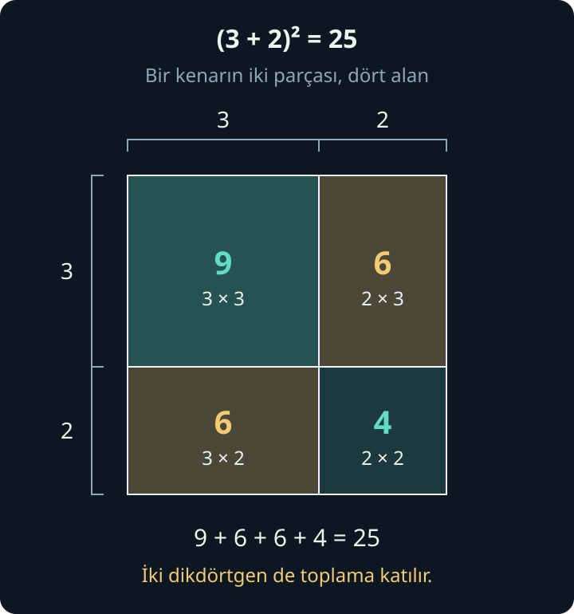
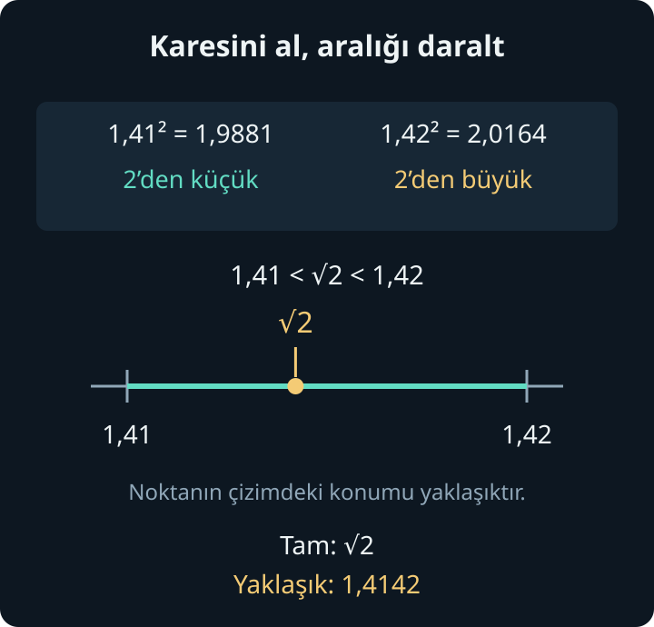
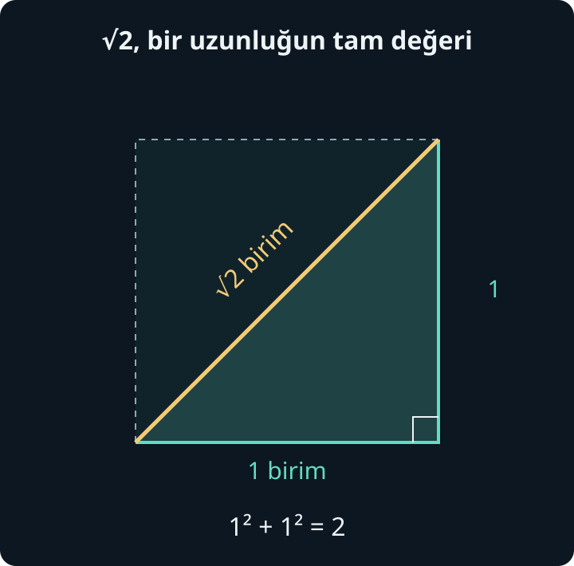

import ArticleVideo from '@/components/ArticleVideo.astro'
import kenardanAlana from './media/01-kenardan-alana.mp4?url'
import kenardanAlanaPoster from './media/01-kenardan-alana.jpg?url'

Bir karenin kenarı 3 santimetre olsun. İçini, kenarları birer santimetre olan küçük karelerle kapladığımızda üç sıra ve her sırada üç kare görürüz. Toplam dokuz küçük kare vardır. Karenin alanı 9 santimetrekaredir.

Şimdi soruyu tersinden soralım: Alanı 9 santimetrekare olan bir karenin kenarı kaç santimetredir? Bu kez verilen uzunluktan alanı hesaplamıyor, verilen alana karşılık gelen uzunluğu arıyoruz. İlk yöndeki hesabı **kare alma**, geri dönüşü **karekök alma** ile ifade edeceğiz.

Bu iki işlem, daha genel bir dilin parçalarıdır: üsler ve kökler. Üslü gösterim aynı sayıyı tekrar tekrar çarpmayı kısaltır. Kökler ise belirli bir kuvveti verilmiş olan sayıya ulaşmamızı sağlar. Büyük ve küçük sayıları yazarken de, Pisagor teoreminden bir uzunluk bulurken de bu dili kullanırız.

[Önceki yazıda](/blog/islemlerin-duzeni/) parantezleri, işlem sırasını, dağılma özelliğini ve işaretleri ele aldık. Burada bunların yanında kesirleri ve ondalık gösterimi kullanacağız. Harfli denklem çözmeyi bildiğimizi varsaymayacağız; genel bir kuralı harfle yazdığımızda, harfin görevini açıklayacağız.

## 1. Aynı Sayıyı Tekrar Tekrar Çarpmak

Üç tane 4'ü toplamak ile üç tane 4'ü çarpmak farklı hesaplar verir:

$$
4+4+4=3\times4=12
$$

$$
4\times4\times4=64
$$

İkinci satırdaki çarpımı $4^3$ biçiminde kısaltırız. “Dördün üçüncü kuvveti” veya “dört üzeri üç” diye okuruz. **4 taban**, sağ üstteki **3 üs** adını alır. Taban hangi sayıyı çarptığımızı, pozitif tam sayı olan üs ise çarpımda bu sayıdan kaç tane bulunduğunu söyler.

$4^3$ içinde üç tane 4, bunları bağlayan iki çarpma işareti vardır. Dolayısıyla üs, çarpma işaretlerini saymaz. Çarpımdaki aynı çarpanın kaç kez yer aldığını sayar.

$$
3^4=3\times3\times3\times3=81
$$

$3^4$ ile $3\times4$ birbirinin yerine geçmez. Biri dört tane 3'ün çarpımı, diğeri dört tane 3'ün toplamıyla aynı değerde olan bir çarpmadır.

Tek bir çarpan varsa $7^1=7$ yazarız. Pozitif tam sayı üslerinde $1^5=1$ ve $0^3=0$ olur. Buradaki tanım henüz sıfırıncı veya negatif kuvveti açıklamıyor. Bu üsleri birazdan, kurduğumuz ilişkileri koruyarak tanımlayacağız.

### Taban bir kesir de olabilir

Tabanın tam sayı olması gerekmez:

$$
\left(\frac12\right)^3
=\frac12\times\frac12\times\frac12
=\frac18
$$

Kesrin tamamını taban olarak göstermek için parantez kullandık. Ondalık gösterimle $0{,}5^3=0{,}125$ aynı hesabı anlatır.

Bu örnek, “üs almak sayıyı büyütür” düşüncesinin her zaman doğru olmadığını gösterir. 1'den büyük pozitif bir sayının pozitif tam sayı kuvvetleri, üs arttıkça büyür. 0 ile 1 arasındaki bir sayıyı kendisiyle tekrar çarpmak ise sonucu küçültür. Tabanın ne olduğu, üssün ne olduğu kadar önemlidir.

## 2. Neden Kare ve Küp Diyoruz?

İkinci kuvvete **kare** dememizin geometrik bir karşılığı vardır. Kenarı 3 santimetre olan karenin alanı:

$$
3\,\text{cm}\times3\,\text{cm}
=9\,\text{cm}^2
$$

Burada yalnızca sayılar değil, birimler de çarpıldı. $\text{cm}^2$, “santimetrekare” diye okunur. Bir santimetrekare, kenarı 1 santimetre olan karenin alanıdır. Uzunluğu santimetreyle, alanı santimetrekareyle ölçüyoruz.

Kenar 3 santimetreden 6 santimetreye çıkarsa iki katına çıkar. Alan ise 9'dan 36 santimetrekareye çıkar:

$$
6^2=6\times6=36
$$

Her sıradaki kare sayısını iki katına çıkardık; sıra sayısını da iki katına çıkardık. Toplam küçük kare sayısı $2\times2=4$ katına çıktı. Bir kenar iki katına çıkarken bir kareyi dolduran alanın dört katına çıkmasının nedeni budur.

<ArticleVideo
  src={kenardanAlana}
  poster={kenardanAlanaPoster}
  title="Kenar iki katına çıkınca alan nasıl değişir?"
  caption="3 birimlik kenarın oluşturduğu 9 birim kare, 6 birimlik kenarda 36 birim kareye dönüşüyor. Son bölümde alan verilerek kenar aranıyor; bu geri dönüşü karekök bölümünde açıklayacağız."
/>

Üçüncü kuvvete **küp** deriz. Ayrıtları, yani kenarları 3 santimetre olan bir küp düşünelim. En alttaki katmanda $3\times3=9$ küçük birim küp, üst üste üç katmanda $9\times3=27$ birim küp bulunur. Hacim $3^3=27$ santimetreküptür. Santimetreküp, $\text{cm}^3$ ile gösterilir.

Karede iki yöndeki uzunlukları, küpte üç yöndeki uzunlukları çarptık. Küpün her ayrıtını iki katına çıkarsaydık hacim $2^3=8$ katına çıkardı. Uzunluk, alan ve hacmin değişimini birbirinden ayırmak, ileride fizik formüllerini okurken de işimize yarayacak.

## 3. İşaret, Parantez ve İşlem Sırası

Negatif sayıları çarpmayı önceki yazıda kurmuştuk. Aynı işaretli iki negatif çarpanın çarpımı pozitiftir:

$$
(-3)^2=(-3)\times(-3)=9
$$

Bir negatif çarpan daha eklersek:

$$
(-3)^3=9\times(-3)=-27
$$

Negatif bir tabanın çift pozitif tam sayı kuvvetinde negatif çarpanları ikişerli eşleyebiliriz; her çift pozitif sonuç verir. Tek kuvvette ise bir negatif çarpan açıkta kalır ve sonuç negatif olur. Bu sayısal işlemi yapabilmek için geometrik bir “negatif kenar uzunluğu” düşünmemiz gerekmez.

### Eksi, tabanın içinde mi?

Parantez burada doğrudan anlamı değiştirir:

$$
(-3)^2=9,\qquad -3^2=-(3^2)=-9
$$

İlk ifadede taban $-3$'tür. İkincisinde üs yalnızca 3'e uygulanır; baştaki eksi, elde edilen 9'un ters işaretlisini alır. Benzer biçimde $(-2)^4=16$ iken $-2^4=-16$ olur.

Üsleri eklediğimizde işlem sırasını şöyle okuruz: **Grupların içini hesaplarız; ardından kuvvetleri, sonra aynı düzeydeki çarpma ve bölmeleri, en son toplama ve çıkarmaları ele alırız.** Eşit öncelikli dört işlemlerde soldan sağa ilerleriz. Köklerle karşılaştığımızda kök çizgisinin altındaki ifadeyi de bir grup olarak okuyacağız.

Örneğin $2+3^2\times2$ ifadesinde önce $3^2=9$ bulunur. Sonra $9\times2=18$, en son $2+18=20$ hesaplanır. Parantez ekleyip $(2+3)^2\times2$ yazsaydık, önce 5'i bulur, karesini alır ve 2 ile çarparak 50'ye ulaşırdık.

## 4. Üs Kuralları Nereden Gelir?

Kuralları, çarpımda bulunan çarpanları sayarak kurabiliriz. Önce pozitif tam sayı üsleriyle çalışalım.

### Aynı tabanlı kuvvetleri çarpmak

$2^3\times2^2$ ifadesinin ilk bölümünde üç tane 2, ikinci bölümünde iki tane 2 vardır. Birlikte beş tane 2 çarpılır:

$$
2^3\times2^2=2^{3+2}=2^5=32
$$

Burada **taban aynı kaldı, üsler toplandı**. Aynı düşünceyi $a^m\times a^n=a^{m+n}$ diye yazabiliriz. $a$ tabanın yerini tutan bir harf; $m$ ve $n$ ise bu aşamada pozitif tam sayı üsleridir. Harfler, gördüğümüz ilişkinin başka sayılarla da geçerli olduğunu söylememizi sağlar.

Bu kural, kuvvetlerin toplamı için geçerli değildir. $2^3+2^2=8+4=12$ olur. Çarpımları birleştirmekle iki çarpımın sonuçlarını toplamak farklı işlemlerdir.

### Aynı tabanlı kuvvetleri bölmek

Paydaki beş tane 2'nin üçü, paydadaki üç tane 2 ile sadeleşebilir:

$$
\frac{2^5}{2^3}=2^{5-3}=2^2=4
$$

Pay ve paydadan ortak çarpanları kaldırınca iki tane 2 kalır. **Taban aynıyken üsleri çıkarmamızın** nedeni budur. Bölme yaptığımız için taban sıfır olamaz. Paydaki üs daha küçük olduğunda kesirli bir sonuç kalacak; bunu negatif üslerle ifade edeceğiz.

### Bir kuvvetin kuvvetini almak

$(2^3)^2$ demek, $2^3$ sayısını iki kez çarpmak demektir:

$$
(2^3)^2=2^3\times2^3=2^6=64
$$

İki grubun her birinde üç çarpan vardır. Toplam çarpan sayısı $3\times2=6$ olur. Bu nedenle **bir kuvvetin kuvvetinde üsler çarpılır**.

Parantezin görevini yine görebiliriz: $(2^3)^2=64$, fakat $2^{(3^2)}=2^9=512$. İkinci ifadede önce üssün içindeki $3^2$ hesaplanır.

### Çarpımın ve bölümün kuvveti

$(2\times5)^3$ ifadesini açtığımızda üç tane 2 ve üç tane 5 buluruz. Çarpanların yerini değiştirip gruplayabiliriz:

$$
(2\times5)^3=2^3\times5^3=1000
$$

Kesirde de paylar kendi aralarında, paydalar kendi aralarında çarpılır:

$$
\left(\frac23\right)^3=\frac{2^3}{3^3}=\frac8{27}
$$

Genel yazımları $(ab)^n=a^n b^n$ ve $(a/b)^n=a^n/b^n$ olur. $ab$, $a$ ile $b$'nin çarpımını kısaltır. Bölümde $b$ sıfır olamaz.

### Toplamın karesinde eksik kalabilecek parçalar

$(3+2)^2$ ifadesinin değeri $5^2=25$'tir. Sadece $3^2+2^2=9+4=13$ hesaplarsak 12 eksik buluruz. Eksik miktarın nereden geldiğini dağılma özelliği açıklar:

$(3+2)(3+2)$ çarpımında ilk parantezdeki 3, ikinci parantezdeki hem 3 hem 2 ile çarpılır. İlk parantezdeki 2 de ikinci parantezdeki hem 3 hem 2 ile çarpılır. Böylece $3\times3$, $3\times2$, $2\times3$ ve $2\times2$ olmak üzere dört parça elde ederiz:

$$
9+6+6+4=25
$$

İlk parantezdeki her terim, ikinci parantezdeki her terimle çarpıldı.

Şekildeki iki dikdörtgenin her biri 6 birimkaredir. Yalnızca 3'ün karesiyle 2'nin karesini toplamak bu iki bölgeyi dışarıda bırakır. **Kuvveti bir çarpımın çarpanlarına uygulayabiliriz; bir toplamın terimlerine ayrı ayrı uygulayıp toplayamayız.**

## 5. Sıfırıncı Kuvvet ve Negatif Üs

Üsler azaldığında ne olduğunu 2'nin kuvvetlerinden izleyelim:

| Üslü gösterim | Değer |
| --- | --- |
| $2^3$ | $8$ |
| $2^2$ | $4$ |
| $2^1$ | $2$ |
| $2^0$ | $1$ |
| $2^{-1}$ | $1/2$ |
| $2^{-2}$ | $1/4$ |

Her satırda üssü bir azalttığımızda değeri 2'ye böldük. $2^1=2$'den sonra aynı ilişkiyi sürdürürsek $2^0=1$, ardından $2^{-1}=1/2$ gelir.

Sıfırıncı kuvveti bölme kuralından da görebiliriz. $5^3/5^3=1$'dir; aynı tabanlı kuvvetlerin bölümünde üsleri çıkarırsak $5^{3-3}=5^0$ elde ederiz. Bu ilişkinin korunması için $5^0=1$ tanımını kullanırız.

**Sıfırdan farklı her sayının sıfırıncı kuvveti 1'dir.** “Hiç çarpmadık, sonuç sıfır olmalı” düşüncesi burada yanıltır; sıfırıncı kuvveti, pozitif tam sayı üslerdeki çarpan sayma açıklamasını doğrudan uygulayarak tanımlamıyoruz.

Negatif üs ise sayının ilgili pozitif kuvvetinin **çarpmaya göre tersini** gösterir. Bir sayıyla çarpıldığında 1 veren sayıya çarpmaya göre ters demiştik. Örneğin:

$$
3^{-2}=\frac1{3^2}=\frac19
$$

Bu nedenle negatif üs, sonucun negatif olacağı anlamına gelmez. $(-3)^{-2}=1/9$, fakat $(-3)^{-3}=-1/27$ olur. İşareti taban ve kuvvetin tek ya da çift olması belirler.

Kesirli tabanda aynı ilişkiyi kullanalım:

$$
\left(\frac23\right)^{-2}
=\frac1{4/9}=\frac94
$$

Önce $(2/3)^2=4/9$ bulduk, sonra tersini aldık. Aynı sonuç $(3/2)^2$ ile de elde edilir.

Sıfırın çarpmaya göre tersi yoktur; $1/0$ tanımlı değildir. Bu yüzden sıfırın negatif kuvvetleri de tanımlı değildir. $0^0$ ise burada kurduğumuz “sıfırdan farklı taban” kuralının dışında kalır; bu yazıda ona bir değer atamayacağız.

Bu tanımlarla aynı tabanlı kuvvetlerde çarpma, bölme ve kuvvetin kuvveti kuralları, taban sıfırdan farklı olduğunda bütün tam sayı üsleri için birlikte çalışır. Örneğin $2^2/2^5=2^{-3}=1/8$; sadeleştirme de aynı sonucu verir.

## 6. Onun Kuvvetleri ve Bilimsel Gösterim

Onun pozitif tam sayı kuvvetlerini basamak değerinden tanıyoruz: $10^2=100$, $10^3=1000$. Negatif kuvvetleri de kesirleriyle okuyabiliriz:

$$
10^{-1}=0{,}1,\quad 10^{-2}=0{,}01
$$

Dolayısıyla çok büyük veya çok küçük bir sayıyı, daha kolay okunabilen bir sayı ile onun bir kuvvetinin çarpımı olarak yazabiliriz:

$$
320000=3{,}2\times10^5
$$

$$
0{,}00047=4{,}7\times10^{-4}
$$

**Bilimsel gösterimde**, pozitif bir sayı için öndeki çarpan en az 1 ve 10'dan küçüktür; 10'un üssü ise tam sayıdır. Böylece virgülden önce tek bir sıfırdan farklı rakam bulunur. Negatif sayıda eksi işaretini bu gösterimin önüne koyarız: $-320000=-3{,}2\times10^5$. Sıfır için bu standart biçimde bir çarpan seçilemez; doğrudan 0 yazarız.

$32\times10^4$ de 320000 eder, ancak öndeki 32 sayısı 10'dan küçük olmadığı için standart bilimsel gösterim biçiminde değildir. Aynı değeri koruyarak $3{,}2\times10^5$ yazarız: ilk çarpanı 10'a bölerken ikinci çarpanı 10 ile çarptık.

Bu yazım hesap yaparken de kullanışlıdır. Örneğin:

$$
(3\times10^4)(2\times10^{-2})
=6\times10^2=600
$$

Öndeki sayıları çarptık; aynı taban olan 10'un üslerini topladık. Bölmede ise:

$$
\frac{8\times10^5}{2\times10^2}
=4\times10^3=4000
$$

Toplama için aynı kuvveti ortak çarpan olarak yazmak gerekir. $3\times10^4+2\times10^3$ ifadesinde ikinci terim $0{,}2\times10^4$ olarak yazılabilir. Böylece toplam $(3+0{,}2)\times10^4=3{,}2\times10^4=32000$ olur. Çarpmadaki üs toplama kuralını, sayıların toplamına uygulamayız.

## 7. Karekök: Alan Verildiğinde Kenarı Bulmak

Alanı 36 birimkare olan bir karenin kenarını arayalım. 5 birimlik kenar $5^2=25$ birimkare, 6 birimlik kenar $6^2=36$ birimkare alan verir. Aradığımız uzunluk 6 birimdir. Bunu **karekök işaretiyle** şöyle yazarız:

$$
\sqrt{36}=6
$$

$\sqrt{36}$, “36'nın karekökü” diye okunur. Kök çizgisinin altındaki 36, aradığımız sayının karesidir.

### Neden hem 6 hem eksi 6 yazmıyoruz?

“Karesi 36 olan sayılar hangileridir?” sorusunun iki cevabı vardır: 6 ve $-6$. Çünkü $6^2=36$ ve $(-6)^2=36$.

**Karekök sembolü, karesi içerideki sayıya eşit olan sıfır veya pozitif değeri belirtir.** Bu nedenle $\sqrt{36}=6$'dır. Başına ayrıca eksi koyarsak $-\sqrt{36}=-6$ elde ederiz. Tek bir sembolün hangi değeri gösterdiğini belirlemek, onu başka işlemlerin içinde kullanabilmemizi sağlar.

$\sqrt0=0$ olur. Negatif bir sayının ise alıştığımız sayı doğrusu üzerindeki sayılar arasında karekökü yoktur: pozitif sayıların karesi pozitif, negatif sayıların karesi yine pozitif, sıfırın karesi sıfırdır. Sayı doğrusundaki bu sayılara **gerçek sayılar** deriz. Negatif sayıların karekökü sorusuna, ileride karmaşık sayılarla sayı sistemini genişlettiğimizde yeniden döneceğiz.

Kare alma ve karekök alma art arda geldiğinde işareti gözden kaçırmamalıyız:

$$
\sqrt{(-5)^2}=\sqrt{25}=5
$$

Kare almak başlangıçtaki işareti kaybettirdi; karekök sembolü pozitif değeri seçti. Bu yüzden bir gerçek sayı için $\sqrt{a^2}=|a|$ yazarız. $a$, herhangi bir gerçek sayının yerini tutar; $|a|$, [sayı doğrusunda](/blog/sayi-dogrusu-yon-ve-uzaklik/) gördüğümüz mutlak değerdir, yani sıfıra uzaklıktır. Örneğin $|-5|=5$.

### Kök çizgisi de gruplar

$$
\sqrt{9+16}=\sqrt{25}=5
$$

Çizgi toplamın tamamını kapsadığı için önce alttaki toplamı hesapladık. Çizgi yalnızca 9'u kapsıyorsa $\sqrt9+16=3+16=19$ olur. Bir ifadenin hangi kısmının kök altında bulunduğunu görmek, parantezleri doğru okumak kadar gereklidir.

## 8. Tam Değer ile Yaklaşık Değeri Ayırmak

0, 1, 4, 9, 16, 25, 36 gibi sayılar birer tam sayının karesidir; bunlara **tam kare sayılar** deriz. Karekökleri de tam sayıdır. Fakat her pozitif tam sayı bir tam kare değildir.

Örneğin $\sqrt2$ için 1 küçük, 2 büyüktür: $1^2=1$, $2^2=4$. Pozitif sayılarda sayı büyüdükçe karesi de büyüdüğünden, $\sqrt2$ sayısı 1 ile 2 arasındadır. Ondalıklarla aralığı daraltabiliriz:

$$
1{,}4^2=1{,}96,\qquad 1{,}5^2=2{,}25
$$

2, bu iki sonuç arasında olduğundan $\sqrt2$ de 1,4 ile 1,5 arasındadır. Bir basamak daha ilerleyelim:

$$
1{,}41^2=1{,}9881
$$

$$
1{,}42^2=2{,}0164
$$

Bu kez aradığımız sayının 1,41 ile 1,42 arasında olduğunu biliyoruz. Aralığı tekrar daraltabiliriz; ama bir ondalık yaklaşımı, tam değerin yerine eşitlik işaretiyle yazamayız.

$\sqrt2$, sayının **tam gösterimidir**. Dört ondalık basamağa yuvarlanmış değeri ise $\sqrt2\approx1{,}4142$ biçiminde yazılır. $\approx$ işareti, [ondalıklar yazısında](/blog/ondalik-gosterim-ve-yaklasik-degerler/) gördüğümüz yaklaşık eşitliği belirtir. Kök işaretini korumak, hesabın içinde değeri yuvarlamadan taşımamızı sağlar.

### Her sayı bir kesir olarak yazılabilir mi?

İki tam sayının oranı biçiminde yazılabilen, paydası sıfır olmayan sayılara **rasyonel sayılar** denir. $3/4$, $-5/2$ ve $7=7/1$ bu gruptadır. Böyle bir oranla tam olarak yazılamayan gerçek sayılar ise **irrasyoneldir**. $\sqrt2$ bunlardan biridir.

Bu sonuç, hesap makinesinde çok basamak görmemize dayanmaz. Kısa bir gerekçe kurabiliriz. $\sqrt2$'nin en sade hâliyle bir tam sayı kesri olduğunu varsayalım ve payına $p$, paydasına $q$ diyelim. Karesini aldığımızda $p^2/q^2=2$ çıkar. Her iki tarafı da $q^2$ ile çarparsak $p^2=2q^2$ olur. Yani $p$'nin karesi çifttir. Tek sayının karesi tek olduğundan $p$ de çift olmalıdır. Bunun arkasındaki sayma fikri basittir: Tek sayıda tek miktarı topladığımızda, ikişer gruplar çift miktar verir; açıkta kalan tek grup toplamı tek yapar.

Çift olan $p$'yi, bir tam sayı $k$ kullanarak $p=2k$ diye yazalım. Yerine koyunca $4k^2=2q^2$, ikiye bölünce $q^2=2k^2$ çıkar. Aynı gerekçeyle $q$ da çifttir. Böylece hem payın hem paydanın 2'ye bölünebildiğini bulduk; oysa kesri en sade hâliyle seçmiştik. Bu çelişki, başlangıçtaki varsayımın mümkün olmadığını gösterir.

İrrasyonel bir sayının ondalık gösterimi bitmez ve sürekli tekrarlanan bir rakam grubuna dönüşmez. Bununla birlikte sayı doğrusunda belirli bir yeri vardır. Ondalık yazımını sonlu sayıda basamakla bitirememek, sayının belirsiz olduğu anlamına gelmez.

## 9. Köklü İfadelerle İşlem Yapmak

Kök içindeki bir sayıyı çarpanlarına ayırmak, ifadeyi daha anlaşılır yazmamızı sağlayabilir. Örneğin:

$$
\sqrt{72}=\sqrt{36\times2}=6\sqrt2
$$

$6\sqrt2$, $6\times\sqrt2$ çarpımını kısaltır. Bu sonucun doğru olduğunu karesini alarak kontrol edebiliriz: 6'nın karesi 36, $\sqrt2$'nin karesi 2 olduğundan çarpımın karesi $36\times2=72$ olur. Ayrıca $6\sqrt2$ pozitiftir; dolayısıyla 72'nin karekökünü gösterir.

Buradaki ilişki, **sıfır veya pozitif iki çarpan** için geçerlidir:

$$
\sqrt{ab}=\sqrt a\,\sqrt b
$$

Koşulu atlamayalım. Gerçek sayılarla çalışırken $\sqrt{(-4)(-9)}=\sqrt{36}=6$ yazabiliriz; ancak bunu $\sqrt{-4}\,\sqrt{-9}$ biçiminde ayıramayız. Ayrı kökler gerçek sayı değildir ve kuralın koşulunu sağlamazlar.

Bölümde de pay sıfır veya pozitif, payda pozitif olmak üzere kökleri ayrı alabiliriz:

$$
\sqrt{\frac{25}{64}}=\frac58
$$

Paydanın sıfır olamaması yine bölme işleminin koşuludur. Sonucu kontrol etmek için $(5/8)^2=25/64$ hesabını yapabiliriz.

### Aynı köklü miktarları toplamak

$2\sqrt2+3\sqrt2$ ifadesinde aynı miktardan, yani $\sqrt2$'den, önce iki sonra üç tane vardır. Toplamı $5\sqrt2$ olur. Bu, dağılma özelliğinin ters yönde kullanımıdır:

$$
2\sqrt2+3\sqrt2=(2+3)\sqrt2
$$

Örneğin $\sqrt8+\sqrt{18}$ hesabında önce $8=4\times2$ ve $18=9\times2$ yazalım. Birinci kök $2\sqrt2$, ikinci kök $3\sqrt2$ olur. Böylece toplam $5\sqrt2$'ye dönüşür. Çıkarmada da aynı köklü miktarların katsayılarını çıkarırız: $5\sqrt2-2\sqrt2=3\sqrt2$. Burada **katsayı**, köklü miktarı çarpan öndeki sayıdır.

Kök, toplamın üzerine dağıtılamaz. $\sqrt{9+16}=5$ iken $\sqrt9+\sqrt{16}=3+4=7$'dir. Benzer köklü ifadeleri toplamak, kök altındaki sayıları toplamak anlamına gelmez.

### Paydada kök varsa

$1/\sqrt2$ de geçerli bir sayısal ifadedir. Bazen aynı değeri paydasında kök bulunmadan yazmak kullanışlı olur. Kesrin payını ve paydasını aynı sıfırdan farklı sayıyla çarpmak değerini değiştirmediğinden:

$$
\frac1{\sqrt2}
=\frac{1\times\sqrt2}{\sqrt2\times\sqrt2}
=\frac{\sqrt2}{2}
$$

Paydada iki $\sqrt2$'nin çarpımı 2 oldu. Bu dönüşüme **paydayı rasyonelleştirme** denir. Burada yaptığımız, daha önce öğrendiğimiz denk kesir oluşturmanın köklü bir örneğidir. Birden fazla terim içeren paydaları, cebirsel ifadeleri ilerlettiğimizde ele alacağız.

## 10. Küpkök ve Kesirli Üsler

Karesi verilen sayıyı karekökle aradık. Küpü verilen sayıyı ararken **küpkök** kullanırız:

$$
\sqrt[3]{27}=3
$$

Kök işaretinin sol üstündeki küçük 3, **kökün derecesidir**. “Hangi sayının üçüncü kuvveti 27?” sorusunu sorar. Karekökün derecesi 2'dir; bu 2'yi yazmamak alışılmıştır.

Küpkökte negatif sayıyla da çalışabiliriz: $\sqrt[3]{-8}=-2$, çünkü $(-2)^3=-8$. Genel olarak tek dereceli kökler negatif gerçek sayılar için de tanımlıdır. Çift dereceli köklerde, gerçek sayılar içinde kalmak için kök altının sıfır veya pozitif olması gerekir; kök sembolü sıfır veya pozitif sonucu gösterir. Örneğin $\sqrt[4]{16}=2$ olur.

Kökleri üslerle aynı dilde de yazabiliriz. **Pozitif bir taban için**:

$$
16^{1/2}=\sqrt{16}=4
$$

Bu kez üs, tekrar eden çarpanları saymıyor. “Yarım tane 16'yı çarpmak” gibi bir işlem tanımlamıyoruz. Üslü gösterimi, daha önce kurduğumuz kuvvet ilişkilerini koruyacak şekilde genişletiyoruz. $16^{1/2}$'nin karesini aldığımızda üsler çarpılıp $16^{(1/2)\times2}=16^1=16$ olmalı; pozitif değer olarak 4'ü seçiyoruz.

Benzer biçimde $8^{1/3}=\sqrt[3]8=2$ olur. Üs birim kesir olmadığında önce kökü, sonra kuvveti alabiliriz:

$$
27^{2/3}=(\sqrt[3]{27})^2=3^2=9
$$

Pozitif tabanlı $a^{m/n}$ gösteriminde, $m$ ve $n$ pozitif tam sayılar olmak üzere, **payda kökün derecesini, pay ise alınacak kuvveti** gösterir. Negatif bir kesirli üs de tersini alma fikrini ekler: $16^{-1/2}=1/\sqrt{16}=1/4$.

Kesirli üsler için burada özellikle pozitif tabanla çalışıyoruz. Negatif tabanlarda kesrin nasıl yazıldığı ve kökün derecesi ayrı dikkat gerektirir; pozitif tabanla kurduğumuz bu okuma kuralını koşulsuz genişletmeyeceğiz.

## 11. Pisagor'a Geri Dönüş

[Pisagor teoreminde](/blog/pisagor-teoremi/) dik kenarları 3 ve 4 birim olan bir dik üçgen düşünmüştük. Dik açının karşısındaki uzun kenarın, yani hipotenüsün karesi, dik kenarların karelerinin toplamıdır:

$$
3^2+4^2=9+16=25
$$

25, aradığımız uzunluğun karesidir. Uzunluğun kendisine ulaşmak için karekök alırız: $\sqrt{25}=5$. Bir uzunluk aradığımız için pozitif sonucu kullanırız.

Bu hesapta önce uzunluklardan alanlara geçtik; 9 ve 16 birimkareyi topladık; 25 birimkarelik karenin kenarını bulmak için tekrar uzunluğa döndük. $3+4=7$ işlemi bu ilişkiyi anlatmaz. Toplanan miktarlar, kenarlar üzerine kurulan karelerin alanlarıdır.

Dik kenarların ikisi de 1 birim olsaydı, hipotenüsün karesi $1^2+1^2=2$ olurdu. Uzunluğu tam olarak $\sqrt2$ birimdir. Kenarı 1 birim olan karenin köşegeni de bu üçgenin hipotenüsüdür.

Böylece ondalık gösterimini sonlu bir yerde bitiremediğimiz $\sqrt2$'yi, basit bir şeklin içinde belirli bir uzunluk olarak görüyoruz. Bir çizimde yaklaşık 1,4142 birim diyebiliriz; sonraki hesaplarda tam değeri korumak istediğimizde $\sqrt2$ yazarız.

Bir sonraki yazıda bu ilişkileri farklı sayılar için yeniden yazmak yerine, **harflerle ifade etmeyi** ele alacağız. Harfin hangi miktarı temsil ettiğini, bir formülde değer yerine koymayı ve eşitliğin iki tarafını koruyarak bilinmeyen bir miktarı bulmayı birlikte kuracağız. Burada üs ve köklerle kullandığımız dil, o formüllerin içini okuyabilmemizi sağlayacak.

## Kaynakça

Bu yazıdaki anlatım, şekiller ve animasyon özgün olarak hazırlandı. Tanımların ve işlem koşullarının kontrolünde aşağıdaki açık ders kitaplarından yararlanıldı. Bağlantılar 7 Ekim 2026 tarihinde kontrol edildi.

- [OpenStax — Prealgebra 2e, 10.2: Use Multiplication Properties of Exponents](https://openstax.org/books/prealgebra-2e/pages/10-2-use-multiplication-properties-of-exponents): Pozitif tam sayı üsler, çarpım ve kuvvet kuralları.
- [OpenStax — Prealgebra 2e, 10.4: Divide Monomials](https://openstax.org/books/prealgebra-2e/pages/10-4-divide-monomials): Aynı tabanlı kuvvetleri bölme ve sıfırıncı kuvvetin koşulu.
- [OpenStax — Prealgebra 2e, 10.5: Integer Exponents and Scientific Notation](https://openstax.org/books/prealgebra-2e/pages/10-5-integer-exponents-and-scientific-notation): Negatif üsler ve bilimsel gösterim.
- [OpenStax — Prealgebra 2e, 5.7: Simplify and Use Square Roots](https://openstax.org/books/prealgebra-2e/pages/5-7-simplify-and-use-square-roots): Karekökün anlamı, işareti ve yaklaşık değerler.
- [OpenStax — Prealgebra 2e, 7.1: Rational and Irrational Numbers](https://openstax.org/books/prealgebra-2e/pages/7-1-rational-and-irrational-numbers): Rasyonel, irrasyonel ve gerçek sayıların ayrımı.
- [OpenStax — Elementary Algebra 2e, 9.2: Simplify Square Roots](https://openstax.org/books/elementary-algebra-2e/pages/9-2-simplify-square-roots): Kareköklerde çarpım ve bölüm özellikleri, köklü ifadeleri sadeleştirme.
- [OpenStax — Intermediate Algebra 2e, 8.3: Simplify Rational Exponents](https://openstax.org/books/intermediate-algebra-2e/pages/8-3-simplify-rational-exponents): Kesirli üsler ile kökler arasındaki ilişki.
